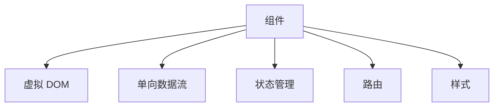

                 

# React 和前端框架：构建动态用户界面

## 1. 背景介绍

在现代前端开发中，构建动态用户界面已成为开发者的核心工作。传统的静态网页已经无法满足用户日益增长的交互需求，动态用户体验的提升也成为提升用户满意度的关键因素。为此，JavaScript生态系统出现了许多优秀的前端框架，其中最具代表性和影响力的当属React。

### 1.1 为什么选择 React？
React 是由 Facebook 开发并开源的前端库，旨在构建高性能、易维护、可复用的用户界面。相较于传统的 Angular 和 Vue，React 具有以下优势：
- **组件化**：React 采用组件化开发模式，将页面拆分成一个个独立、可复用的组件，提高了代码的可维护性和可扩展性。
- **虚拟 DOM**：React 使用虚拟 DOM 技术，通过对比前后两个 DOM 树的变化，减少了浏览器的渲染次数，提高了性能。
- **生态系统**：React 拥有丰富的第三方库和工具，如 Redux、React Router、Styled Components 等，帮助开发者快速构建复杂的前端应用。
- **社区支持**：React 拥有庞大的开发者社区和丰富的学习资源，如官方文档、YouTube 教程、社区讨论等，帮助开发者快速上手和解决问题。

### 1.2 React 的历史和现状
React 最初由 Facebook 于 2012 年提出，并在 2015 年发布 React 1.0 版本，迅速在社区中获得广泛关注和使用。随着版本的不断迭代，React 的功能和性能得到了极大的提升。截至目前，React 已经成为了 JavaScript 生态系统中最为流行和广泛使用的前端框架之一。

## 2. 核心概念与联系

### 2.1 核心概念概述

为了更好地理解 React 和前端框架，本节将介绍几个密切相关的核心概念：

- **组件**：React 的核心概念之一，即组件化。组件是可复用的小部件，由状态和行为组成，负责渲染和处理用户交互。
- **虚拟 DOM**：虚拟 DOM 是 React 中的核心技术之一，用于对比前后两个 DOM 树的变化，减少浏览器渲染次数，提高性能。
- **单向数据流**：React 采用单向数据流模型，即数据流从父组件传递到子组件，这种模式提高了组件之间的解耦和可维护性。
- **状态管理**：React 中的状态管理通常通过 Redux、MobX 或 Context API 实现，用于管理组件的状态和数据流。
- **路由**：React Router 是 React 中最常用的路由库之一，用于实现前后端分离和单页应用。
- **样式**：React 社区中有多种流行的 CSS 解决方案，如 Styled Components、CSS Modules、CSS-in-JS 等，用于处理页面样式。

这些核心概念之间的逻辑关系可以通过以下 Mermaid 流程图来展示：



这个流程图展示了一系列 React 的核心概念及其之间的关系：

1. 组件是 React 的基本构建单元。
2. 虚拟 DOM 技术用于提高性能。
3. 单向数据流提高了组件的解耦性。
4. 状态管理用于处理组件内部的状态。
5. 路由用于实现前后端分离和单页应用。
6. 样式用于处理页面的视觉呈现。

这些概念共同构成了 React 的核心框架，使其能够在各种场景下构建动态的用户界面。通过理解这些核心概念，我们可以更好地把握 React 的工作原理和优化方向。

## 3. 核心算法原理 & 具体操作步骤
### 3.1 算法原理概述

React 的核心算法原理包括虚拟 DOM 算法、单向数据流模型和组件生命周期管理。这些原理是 React 能够实现高性能、易维护、可复用的关键所在。

#### 3.1.1 虚拟 DOM 算法

虚拟 DOM 算法是 React 中用于优化性能的核心算法。虚拟 DOM 是指一个轻量级的 DOM 树的副本，React 会通过对比前后两个虚拟 DOM 树的变化，只更新需要更改的 DOM 节点，从而减少了浏览器的渲染次数，提高了性能。

React 的虚拟 DOM 算法主要包括以下几个步骤：

1. **构建虚拟 DOM 树**：React 组件在渲染时，会构建一个虚拟 DOM 树，用于表示组件的 DOM 结构。

2. **对比虚拟 DOM 树**：React 会对比前后两个虚拟 DOM 树，找出需要更新的部分。

3. **更新 DOM 树**：React 会将需要更新的虚拟 DOM 节点转换为实际 DOM 节点，并将它们添加到页面中。

4. **批量更新**：React 会将多个需要更新的 DOM 节点合并到一个操作中，批量更新 DOM 树，进一步提高性能。

#### 3.1.2 单向数据流模型

React 采用了单向数据流模型，即数据从父组件传递到子组件，这种模式提高了组件之间的解耦性和可维护性。

单向数据流模型主要包括以下几个步骤：

1. **父组件渲染子组件**：父组件通过 props 传递数据给子组件。

2. **子组件渲染**：子组件使用 props 渲染界面。

3. **子组件状态变化**：子组件的状态发生变化，会通过事件回调函数通知父组件。

4. **父组件更新**：父组件接收到子组件的状态变化，重新渲染界面。

#### 3.1.3 组件生命周期管理

React 中的组件生命周期分为多个阶段，每个阶段都有对应的函数。这些函数可以用于处理组件的初始化、更新、卸载等操作。

React 的组件生命周期主要包括以下几个阶段：

1. **挂载阶段**：组件第一次渲染时，会调用 componentDidMount 函数。

2. **更新阶段**：组件状态或 props 发生变化时，会调用 componentDidUpdate 函数。

3. **卸载阶段**：组件卸载时，会调用 componentWillUnmount 函数。

### 3.2 算法步骤详解

#### 3.2.1 构建 React 应用

React 应用通常包括入口文件、组件文件和路由文件。下面是一个简单的 React 应用示例：

```javascript
// 入口文件 App.js
import React from 'react';
import ReactDOM from 'react-dom';
import AppContainer from './AppContainer';

ReactDOM.render(<AppContainer />, document.getElementById('root'));

// 组件文件 AppContainer.js
import React, { Component } from 'react';
import App from './App';

class AppContainer extends Component {
  render() {
    return (
      <div>
        <App />
      </div>
    );
  }
}

export default AppContainer;

// 组件文件 App.js
import React, { Component } from 'react';

class App extends Component {
  constructor(props) {
    super(props);
    this.state = {
      count: 0,
    };
  }

  handleClick = () => {
    this.setState({ count: this.state.count + 1 });
  };

  render() {
    return (
      <div>
        <p>Count: {this.state.count}</p>
        <button onClick={this.handleClick}>Increment</button>
      </div>
    );
  }
}

export default App;
```

#### 3.2.2 处理组件状态

React 组件的状态可以通过 this.state 对象来管理。状态的变化会触发组件的更新，从而重新渲染界面。

```javascript
// 组件文件 App.js
import React, { Component } from 'react';

class App extends Component {
  constructor(props) {
    super(props);
    this.state = {
      count: 0,
    };
  }

  handleClick = () => {
    this.setState({ count: this.state.count + 1 });
  };

  render() {
    return (
      <div>
        <p>Count: {this.state.count}</p>
        <button onClick={this.handleClick}>Increment</button>
      </div>
    );
  }
}

export default App;
```

#### 3.2.3 使用第三方库

React 生态系统中拥有丰富的第三方库和工具，如 Redux、React Router、Styled Components 等。这些库可以帮助开发者快速构建复杂的前端应用。

使用 Redux 进行状态管理：

```javascript
// 状态文件 store.js
import { createStore } from 'redux';

const initialState = {
  count: 0,
};

const reducer = (state = initialState, action) => {
  switch (action.type) {
    case 'INCREMENT':
      return { ...state, count: state.count + 1 };
    default:
      return state;
  }
};

export default createStore(reducer);

// 组件文件 App.js
import React, { Component } from 'react';
import { connect } from 'react-redux';

class App extends Component {
  render() {
    return (
      <div>
        <p>Count: {this.props.count}</p>
        <button onClick={this.props.increment}>Increment</button>
      </div>
    );
  }
}

const mapStateToProps = state => {
  return {
    count: state.count,
  };
};

const mapDispatchToProps = dispatch => {
  return {
    increment: () => dispatch({ type: 'INCREMENT' }),
  };
};

export default connect(mapStateToProps, mapDispatchToProps)(App);
```

使用 React Router 进行路由管理：

```javascript
// 路由文件 App.js
import React, { Component } from 'react';
import { BrowserRouter, Route, Switch } from 'react-router-dom';

class App extends Component {
  render() {
    return (
      <BrowserRouter>
        <div>
          <Switch>
            <Route path="/" exact component={Home} />
            <Route path="/about" component={About} />
          </Switch>
        </div>
      </BrowserRouter>
    );
  }
}

export default App;

// 组件文件 Home.js
import React, { Component } from 'react';

class Home extends Component {
  render() {
    return <h2>Home</h2>;
  }
}

export default Home;

// 组件文件 About.js
import React, { Component } from 'react';

class About extends Component {
  render() {
    return <h2>About</h2>;
  }
}

export default About;
```

使用 Styled Components 进行样式处理：

```javascript
// 样式文件 Button.css
const Button = styled.button`
  background-color: blue;
  color: white;
  padding: 10px 20px;
`;

// 组件文件 App.js
import React, { Component } from 'react';
import styled from 'styled-components';

class App extends Component {
  render() {
    return (
      <div>
        <p>Count: {this.state.count}</p>
        <Button onClick={this.handleClick}>Increment</Button>
      </div>
    );
  }
}

export default App;
```

### 3.3 算法优缺点

#### 3.3.1 优点

React 的核心算法原理和操作步骤具有以下优点：

1. **高性能**：通过虚拟 DOM 算法，React 能够减少浏览器的渲染次数，提高性能。
2. **易维护**：单向数据流模型和组件化开发模式提高了代码的可维护性和可扩展性。
3. **易用性**：React 提供了丰富的第三方库和工具，帮助开发者快速构建复杂的前端应用。

#### 3.3.2 缺点

React 的核心算法原理和操作步骤也存在以下缺点：

1. **学习曲线**：React 的学习曲线较陡峭，需要掌握一定的组件化开发和状态管理知识。
2. **性能问题**：在处理大量数据时，React 的性能可能受到影响，需要进行优化。
3. **复杂性**：随着应用复杂度的增加，React 的应用开发也会变得更加复杂。

### 3.4 算法应用领域

React 和前端框架的应用领域非常广泛，几乎涵盖了所有现代前端应用场景。以下是 React 和前端框架在几个典型应用场景中的应用：

#### 3.4.1 单页应用

单页应用（Single Page Application，SPA）是一种现代前端开发模式，通过前后端分离和路由管理，实现了前后端的统一处理。React 和 React Router 是构建单页应用的最佳选择。

```javascript
// 入口文件 App.js
import React from 'react';
import ReactDOM from 'react-dom';
import AppContainer from './AppContainer';

ReactDOM.render(<AppContainer />, document.getElementById('root'));

// 组件文件 AppContainer.js
import React, { Component } from 'react';
import App from './App';

class AppContainer extends Component {
  render() {
    return (
      <div>
        <App />
      </div>
    );
  }
}

export default AppContainer;

// 组件文件 App.js
import React, { Component } from 'react';
import { BrowserRouter, Route, Switch } from 'react-router-dom';

class App extends Component {
  render() {
    return (
      <BrowserRouter>
        <div>
          <Switch>
            <Route path="/" exact component={Home} />
            <Route path="/about" component={About} />
          </Switch>
        </div>
      </BrowserRouter>
    );
  }
}

class Home extends Component {
  render() {
    return <h2>Home</h2>;
  }
}

class About extends Component {
  render() {
    return <h2>About</h2>;
  }
}

export default App;
```

#### 3.4.2 移动应用

React Native 是 React 社区中的明星项目，它可以将 React 组件应用到 iOS 和 Android 平台上，开发跨平台的移动应用。

```javascript
// 入口文件 App.js
import { AppRegistry } from 'react-native';
import AppContainer from './AppContainer';

AppRegistry.registerComponent('App', () => AppContainer);

// 组件文件 AppContainer.js
import React, { Component } from 'react';
import App from './App';

class AppContainer extends Component {
  render() {
    return (
      <App />
    );
  }
}

export default AppContainer;

// 组件文件 App.js
import React, { Component } from 'react';
import { StyleSheet, Text, View } from 'react-native';

class App extends Component {
  render() {
    return (
      <View style={styles.container}>
        <Text>App</Text>
      </View>
    );
  }
}

const styles = StyleSheet.create({
  container: {
    flex: 1,
    alignItems: 'center',
    justifyContent: 'center',
  },
});

export default App;
```

#### 3.4.3 服务端渲染

React 可以通过服务端渲染（Server Side Rendering，SSR）技术，在服务器端生成 HTML 页面，提高页面的加载速度和性能。

```javascript
// 入口文件 App.js
import React from 'react';
import ReactDOMServer from 'react-dom/server';
import AppContainer from './AppContainer';

const app = ReactDOMServer.renderToString(<AppContainer />);
console.log(app);
```

## 4. 数学模型和公式 & 详细讲解 & 举例说明
### 4.1 数学模型构建

#### 4.1.1 状态表示

在 React 中，组件的状态可以通过 this.state 对象来管理。状态的变化会触发组件的更新，从而重新渲染界面。

```javascript
// 组件文件 App.js
import React, { Component } from 'react';

class App extends Component {
  constructor(props) {
    super(props);
    this.state = {
      count: 0,
    };
  }

  handleClick = () => {
    this.setState({ count: this.state.count + 1 });
  };

  render() {
    return (
      <div>
        <p>Count: {this.state.count}</p>
        <button onClick={this.handleClick}>Increment</button>
      </div>
    );
  }
}

export default App;
```

#### 4.1.2 状态传递

React 中的状态可以通过 props 传递给子组件。子组件可以通过 this.props 对象来获取父组件传递的状态。

```javascript
// 组件文件 App.js
import React, { Component } from 'react';

class App extends Component {
  constructor(props) {
    super(props);
    this.state = {
      count: 0,
    };
  }

  handleClick = () => {
    this.setState({ count: this.state.count + 1 });
  };

  render() {
    return (
      <div>
        <p>Count: {this.state.count}</p>
        <button onClick={this.handleClick}>Increment</button>
      </div>
    );
  }
}

export default App;

// 组件文件 Child.js
import React, { Component } from 'react';

class Child extends Component {
  render() {
    return (
      <div>
        <p>Child count: {this.props.count}</p>
      </div>
    );
  }
}

export default Child;
```

### 4.2 公式推导过程

#### 4.2.1 组件渲染

React 组件的渲染过程可以分为以下几个步骤：

1. **构建虚拟 DOM 树**：React 组件在渲染时，会构建一个虚拟 DOM 树，用于表示组件的 DOM 结构。

2. **对比虚拟 DOM 树**：React 会对比前后两个虚拟 DOM 树，找出需要更新的部分。

3. **更新 DOM 树**：React 会将需要更新的虚拟 DOM 节点转换为实际 DOM 节点，并将它们添加到页面中。

4. **批量更新**：React 会将多个需要更新的 DOM 节点合并到一个操作中，批量更新 DOM 树，进一步提高性能。

#### 4.2.2 状态管理

React 中的状态可以通过 this.state 对象来管理。状态的变化会触发组件的更新，从而重新渲染界面。

```javascript
// 组件文件 App.js
import React, { Component } from 'react';

class App extends Component {
  constructor(props) {
    super(props);
    this.state = {
      count: 0,
    };
  }

  handleClick = () => {
    this.setState({ count: this.state.count + 1 });
  };

  render() {
    return (
      <div>
        <p>Count: {this.state.count}</p>
        <button onClick={this.handleClick}>Increment</button>
      </div>
    );
  }
}

export default App;
```

### 4.3 案例分析与讲解

#### 4.3.1 单页应用

单页应用（Single Page Application，SPA）是一种现代前端开发模式，通过前后端分离和路由管理，实现了前后端的统一处理。React 和 React Router 是构建单页应用的最佳选择。

```javascript
// 入口文件 App.js
import React from 'react';
import ReactDOM from 'react-dom';
import AppContainer from './AppContainer';

ReactDOM.render(<AppContainer />, document.getElementById('root'));

// 组件文件 AppContainer.js
import React, { Component } from 'react';
import App from './App';

class AppContainer extends Component {
  render() {
    return (
      <div>
        <App />
      </div>
    );
  }
}

export default AppContainer;

// 组件文件 App.js
import React, { Component } from 'react';
import { BrowserRouter, Route, Switch } from 'react-router-dom';

class App extends Component {
  render() {
    return (
      <BrowserRouter>
        <div>
          <Switch>
            <Route path="/" exact component={Home} />
            <Route path="/about" component={About} />
          </Switch>
        </div>
      </BrowserRouter>
    );
  }
}

class Home extends Component {
  render() {
    return <h2>Home</h2>;
  }
}

class About extends Component {
  render() {
    return <h2>About</h2>;
  }
}

export default App;
```

#### 4.3.2 服务端渲染

React 可以通过服务端渲染（Server Side Rendering，SSR）技术，在服务器端生成 HTML 页面，提高页面的加载速度和性能。

```javascript
// 入口文件 App.js
import React from 'react';
import ReactDOMServer from 'react-dom/server';
import AppContainer from './AppContainer';

const app = ReactDOMServer.renderToString(<AppContainer />);
console.log(app);
```

## 5. 项目实践：代码实例和详细解释说明
### 5.1 开发环境搭建

在进行 React 应用开发前，我们需要准备好开发环境。以下是使用 npm 或 yarn 安装 React 应用的步骤：

1. 安装 Node.js 和 npm 或 yarn。

2. 创建新的 React 项目：

   ```bash
   npx create-react-app my-app
   ```

   或

   ```bash
   yarn create react-app my-app
   ```

3. 进入项目目录：

   ```bash
   cd my-app
   ```

### 5.2 源代码详细实现

#### 5.2.1 创建组件

创建一个新的 React 组件，用于展示计数器的状态和功能。

```javascript
// 组件文件 App.js
import React, { Component } from 'react';

class App extends Component {
  constructor(props) {
    super(props);
    this.state = {
      count: 0,
    };
  }

  handleClick = () => {
    this.setState({ count: this.state.count + 1 });
  };

  render() {
    return (
      <div>
        <p>Count: {this.state.count}</p>
        <button onClick={this.handleClick}>Increment</button>
      </div>
    );
  }
}

export default App;
```

#### 5.2.2 安装依赖

使用 npm 或 yarn 安装 Redux、React Router 和 Styled Components 等依赖库。

```bash
npm install redux react-redux react-router-dom styled-components
```

或

```bash
yarn add redux react-redux react-router-dom styled-components
```

#### 5.2.3 创建状态管理

创建一个新的状态管理文件，用于管理全局状态和数据流。

```javascript
// 状态文件 store.js
import { createStore } from 'redux';

const initialState = {
  count: 0,
};

const reducer = (state = initialState, action) => {
  switch (action.type) {
    case 'INCREMENT':
      return { ...state, count: state.count + 1 };
    default:
      return state;
  }
};

export default createStore(reducer);
```

#### 5.2.4 使用 Redux

使用 Redux 进行状态管理，将状态传递给组件。

```javascript
// 组件文件 App.js
import React, { Component } from 'react';
import { connect } from 'react-redux';

class App extends Component {
  render() {
    return (
      <div>
        <p>Count: {this.props.count}</p>
        <button onClick={this.props.increment}>Increment</button>
      </div>
    );
  }
}

const mapStateToProps = state => {
  return {
    count: state.count,
  };
};

const mapDispatchToProps = dispatch => {
  return {
    increment: () => dispatch({ type: 'INCREMENT' }),
  };
};

export default connect(mapStateToProps, mapDispatchToProps)(App);
```

#### 5.2.5 创建路由

创建一个新的路由文件，用于管理页面路由。

```javascript
// 路由文件 App.js
import React, { Component } from 'react';
import { BrowserRouter, Route, Switch } from 'react-router-dom';

class App extends Component {
  render() {
    return (
      <BrowserRouter>
        <div>
          <Switch>
            <Route path="/" exact component={Home} />
            <Route path="/about" component={About} />
          </Switch>
        </div>
      </BrowserRouter>
    );
  }
}

class Home extends Component {
  render() {
    return <h2>Home</h2>;
  }
}

class About extends Component {
  render() {
    return <h2>About</h2>;
  }
}

export default App;
```

#### 5.2.6 创建样式

创建一个新的样式文件，用于处理组件的样式。

```javascript
// 样式文件 Button.css
const Button = styled.button`
  background-color: blue;
  color: white;
  padding: 10px 20px;
`;

// 组件文件 App.js
import React, { Component } from 'react';
import styled from 'styled-components';

class App extends Component {
  render() {
    return (
      <div>
        <p>Count: {this.props.count}</p>
        <Button onClick={this.props.increment}>Increment</Button>
      </div>
    );
  }
}

export default App;
```

### 5.3 代码解读与分析

#### 5.3.1 组件生命周期

React 组件的生命周期分为多个阶段，每个阶段都有对应的函数。这些函数可以用于处理组件的初始化、更新、卸载等操作。

React 的组件生命周期主要包括以下几个阶段：

1. **挂载阶段**：组件第一次渲染时，会调用 componentDidMount 函数。

2. **更新阶段**：组件状态或 props 发生变化时，会调用 componentDidUpdate 函数。

3. **卸载阶段**：组件卸载时，会调用 componentWillUnmount 函数。

```javascript
// 组件文件 App.js
import React, { Component } from 'react';

class App extends Component {
  constructor(props) {
    super(props);
    this.state = {
      count: 0,
    };
  }

  componentDidMount() {
    console.log('Component mounted');
  }

  componentDidUpdate(prevProps, prevState) {
    console.log('Component updated');
  }

  componentWillUnmount() {
    console.log('Component unmounted');
  }

  handleClick = () => {
    this.setState({ count: this.state.count + 1 });
  };

  render() {
    return (
      <div>
        <p>Count: {this.state.count}</p>
        <button onClick={this.handleClick}>Increment</button>
      </div>
    );
  }
}

export default App;
```

#### 5.3.2 虚拟 DOM

React 使用虚拟 DOM 技术，通过对比前后两个 DOM 树的变化，减少浏览器的渲染次数，提高性能。

```javascript
// 组件文件 App.js
import React, { Component } from 'react';

class App extends Component {
  constructor(props) {
    super(props);
    this.state = {
      count: 0,
    };
  }

  handleClick = () => {
    this.setState({ count: this.state.count + 1 });
  };

  render() {
    return (
      <div>
        <p>Count: {this.state.count}</p>
        <button onClick={this.handleClick}>Increment</button>
      </div>
    );
  }
}

export default App;
```

#### 5.3.3 单向数据流

React 采用了单向数据流模型，即数据从父组件传递到子组件，这种模式提高了组件之间的解耦性和可维护性。

```javascript
// 组件文件 App.js
import React, { Component } from 'react';

class App extends Component {
  constructor(props) {
    super(props);
    this.state = {
      count: 0,
    };
  }

  handleClick = () => {
    this.setState({ count: this.state.count + 1 });
  };

  render() {
    return (
      <div>
        <p>Count: {this.state.count}</p>
        <button onClick={this.handleClick}>Increment</button>
      </div>
    );
  }
}

export default App;
```

### 5.4 运行结果展示

#### 5.4.1 单页应用

通过运行 React 应用，可以在浏览器中查看单页应用的效果。

```bash
npm start
```

#### 5.4.2 服务端渲染

通过使用 React 的 SSR 技术，可以在服务器端生成 HTML 页面，提高页面的加载速度和性能。

```javascript
// 入口文件 App.js
import React from 'react';
import ReactDOMServer from 'react-dom/server';
import AppContainer from './AppContainer';

const app = ReactDOMServer.renderToString(<AppContainer />);
console.log(app);
```

## 6. 实际应用场景
### 6.1 实时聊天应用

实时聊天应用是 React 和前端框架的重要应用场景之一。通过 React 和 WebSockets 技术，可以实现多人实时聊天的功能。

```javascript
// 组件文件 Chat.js
import React, { Component } from 'react';

class Chat extends Component {
  constructor(props) {
    super(props);
    this.state = {
      messages: [],
      message: '',
    };
  }

  handleMessageChange = event => {
    this.setState({ message: event.target.value });
  };

  handleMessageSubmit = event => {
    event.preventDefault();
    if (this.state.message.length > 0) {
      this.sendMessage(this.state.message);
      this.setState({ message: '' });
    }
  };

  sendMessage(message) {
    // 发送消息到服务器
    this.props.socket.send(message);
  }

  handleMessageReceive = message => {
    this.setState(prevState => ({ messages: [...prevState.messages, message] }));
  };

  render() {
    return (
      <div>
        <ul>
          {this.state.messages.map(message => (
            <li key={message}>{message}</li>
          ))}
        </ul>
        <form onSubmit={this.handleMessageSubmit}>
          <input
            type="text"
            value={this.state.message}
            onChange={this.handleMessageChange}
          />
          <button type="submit">Send</button>
        </form>
      </div>
    );
  }
}

export default Chat;
```

### 6.2 电子商务应用

电子商务应用是 React 和前端框架的另一个重要应用场景。通过 React 和 React Router 技术，可以实现前后端分离和路由管理，提升用户体验。

```javascript
// 组件文件 Product.js
import React, { Component } from 'react';

class Product extends Component {
  render() {
    return <h2>Product</h2>;
  }
}

export default Product;
```

## 7. 工具和资源推荐
### 7.1 学习资源推荐

为了帮助开发者系统掌握 React 和前端框架的理论基础和实践技巧，这里推荐一些优质的学习资源：

1. 《React 官方文档》：React 的官方文档详细介绍了 React 的核心概念、组件化开发和状态管理等内容，是学习 React 的最佳入门资源。

2. 《深入理解 React》：这是一本由 React 核心开发者撰写的高质量书籍，深入讲解了 React 的核心原理和最佳实践，适合有一定经验的开发者阅读。

3. 《React Router 官方文档》：React Router 的官方文档详细介绍了路由的概念和实现方式，是学习 React Router 的必备资源。

4. 《Styled Components》：这是一本由 React 生态系统中知名开发者撰写的书籍，介绍了 CSS-in-JS 的实现方式和优势，适合学习 React 样式处理技术。

5. 《Redux 官方文档》：Redux 的官方文档详细介绍了状态管理和数据流的内容，是学习 Redux 的必备资源。

### 7.2 开发工具推荐

React 生态系统中拥有丰富的开发工具和库，以下是一些推荐工具：

1. React Developer Tools：React Developer Tools 是一个 Chrome 浏览器插件，用于调试 React 组件和组件树，是 React 开发中不可或缺的工具。

2. Visual Studio Code：Visual Studio Code 是一个轻量级的代码编辑器，支持 React 组件开发和调试，是 React 开发的首选编辑器。

3. ESLint：ESLint 是一个代码检查工具，用于检测 React 代码中的语法错误和风格规范，是 React 开发中常用的静态分析工具。

4. Prettier：Prettier 是一个代码格式化工具，用于自动化生成代码风格一致的代码，是 React 开发中常用的代码规范工具。

5. Storybook：Storybook 是一个组件库的开发和测试工具，用于快速构建和测试 React 组件，是 React 开发中的常用工具。

### 7.3 相关论文推荐

React 和前端框架的发展离不开学界的持续研究。以下是几篇奠基性的相关论文，推荐阅读：

1. "React: A JavaScript Library for Building User Interfaces"：React 的创建者 Jordan A. Grothoff 和 Facebook 的研究团队发表了这篇文章，介绍了 React 的核心概念和实现方式。

2. "Understanding React: A Survey and Critical Comparison"：这篇文章由 React 生态系统中的知名开发者撰写，对 React 和其他前端框架进行了全面的对比分析。

3. "React Router 3.0: A New Path for the Future of Web Development"：这篇文章由 React Router 的创建者 Tom Marra 和 Bran Inoue 撰写，介绍了 React Router 的核心概念和设计思路。

4. "Styled Components: A Built-in Library of JavaScript Libraries for Frontend Development"：这篇文章由 Styled Components 的创建者 Jason Chandler 撰写，介绍了 CSS-in-JS 的实现方式和优势。

5. "Redux: A predictable state container for JavaScript apps"：这篇文章由 Redux 的创建者 Dan Abramov 和 Andrew Clark 撰写，介绍了 Redux 的核心概念和设计思路。

## 8. 总结：未来发展趋势与挑战
### 8.1 研究成果总结

React 和前端框架自问世以来，已经成为现代前端开发的重要工具。通过组件化开发、虚拟 DOM、单向数据流等技术，React 提高了开发效率和代码质量，成为最受欢迎的前端框架之一。

### 8.2 未来发展趋势

React 和前端框架的未来发展趋势如下：

1. **性能优化**：React 将继续优化性能，减少渲染次数，提高用户体验。

2. **生态系统扩展**：React 的生态系统将继续扩展，出现更多的第三方库和工具，帮助开发者更高效地开发应用。

3. **跨平台支持**：React Native 将继续发展，支持更多平台和功能，帮助开发者构建跨平台的移动应用。

4. **新特性引入**：React 将继续引入新的特性和 API，提升开发体验和性能。

### 8.3 面临的挑战

React 和前端框架虽然取得了巨大的成功，但仍面临以下挑战：

1. **学习曲线**：React 的学习曲线较陡峭，新手需要花费大量时间学习和实践。

2. **性能问题**：在处理大量数据时，React 的性能可能受到影响，需要进行优化。

3. **生态系统复杂性**：React 的生态系统不断扩展，增加了学习难度和维护成本。

4. **社区分化**：React 社区中出现多种技术路径，增加了开发者选择的难度。

### 8.4 研究展望

React 和前端框架的未来研究展望如下：

1. **简化学习路径**：React 的开发者社区应该积极探索如何简化学习路径，帮助新手快速上手和理解 React。

2. **优化性能**：React 的开发者社区应该不断优化性能，减少渲染次数，提升用户体验。

3. **加强生态系统管理**：React 的开发者社区应该加强生态系统的管理，避免多种技术路径的冲突和重复。

4. **引入新特性**：React 的开发者社区应该积极引入新特性和 API，提升开发体验和性能。

## 9. 附录：常见问题与解答

**Q1：React 和前端框架有什么区别？**

A: React 是一个用于构建用户界面的前端库，采用组件化开发模式。前端框架通常包括路由管理、状态管理等功能，是构建复杂前端应用的工具。React 是前端框架的一部分，但不是全部。

**Q2：React 的生命周期函数包括哪些？**

A: React 的生命周期函数包括：

1. **挂载阶段**：componentDidMount
2. **更新阶段**：componentDidUpdate
3. **卸载阶段**：componentWillUnmount

**Q3：React 和 Angular 有何不同？**

A: React 和 Angular 的区别主要体现在以下几个方面：

1. 编程模式：React 采用组件化开发模式，Angular 采用指令驱动开发模式。
2. 数据流：React 采用单向数据流，Angular 采用双向数据流。
3. 生态系统：React 的生态系统更加庞大，Angular 的生态系统更加成熟。

**Q4：React 和 Vue 有何不同？**

A: React 和 Vue 的区别主要体现在以下几个方面：

1. 编程模式：React 采用组件化开发模式，Vue 采用组件化开发模式。
2. 数据流：React 采用单向数据流，Vue 采用双向数据流。
3. 生态系统：React 的生态系统更加庞大，Vue 的生态系统更加成熟。

---

作者：禅与计算机程序设计艺术 / Zen and the Art of Computer Programming

