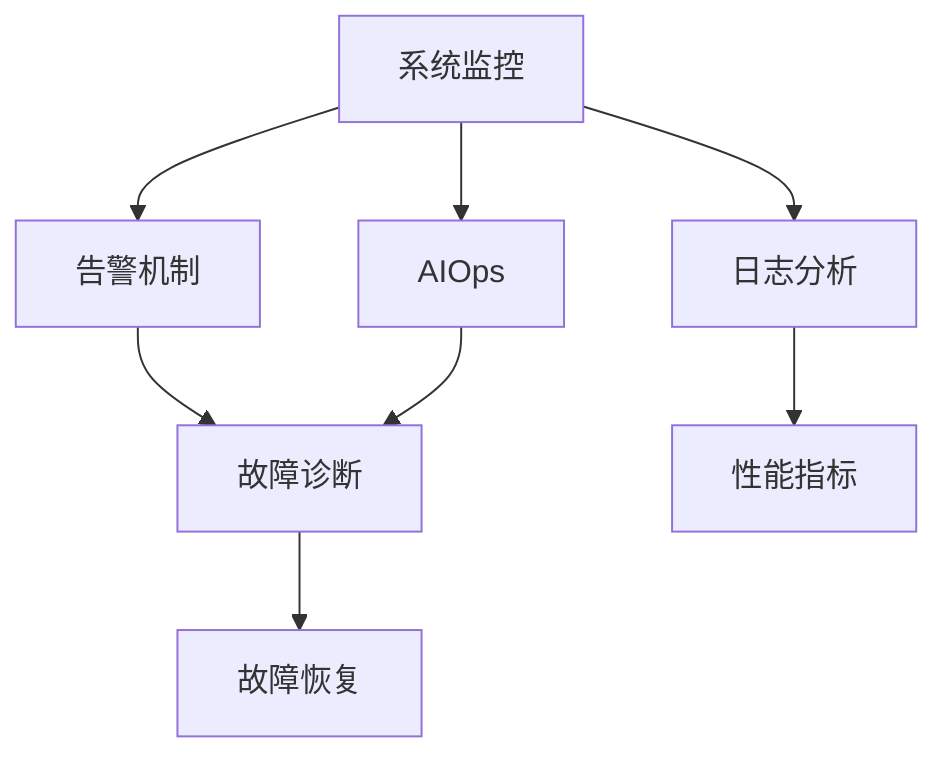

                 

# SRE（站点可靠性工程）：确保系统稳定性

> 关键词：站点可靠性工程,系统稳定性,监控告警,服务可用性,故障恢复

## 1. 背景介绍

### 1.1 问题由来
随着互联网应用的广泛普及，站点可靠性工程（Site Reliability Engineering, SRE）成为了确保应用程序稳定运行的重要实践。无论是电商平台、社交媒体、在线教育还是金融服务，站点可靠性都是企业与用户交互的基础。系统高可用性和稳定性直接影响到用户体验和业务收入，因此SRE对于确保系统运行稳定、故障快速恢复至关重要。

### 1.2 问题核心关键点
SRE的核心目标在于最大化系统的可用性，减少宕机时间。在实践中，SRE工程师通过系统监控、告警、故障诊断、故障恢复等一系列手段，来保障业务服务的连续性和稳定性。具体到技术层面，SRE的实现离不开以下关键点：
1. **系统监控**：实时收集系统性能指标，进行异常检测。
2. **告警机制**：当系统检测到异常时，自动发出告警，通知相关人员。
3. **故障诊断**：快速定位系统故障点，确定故障原因。
4. **故障恢复**：制定并执行故障恢复策略，保障系统快速恢复服务。

### 1.3 问题研究意义
SRE的研究不仅关系到业务服务的连续性，还直接影响企业的运营效率和成本控制。通过有效的SRE实践，可以避免因故障带来的损失，提升用户满意度，增强市场竞争力。同时，SRE也是推动企业向数字化、智能化转型的重要支撑。

## 2. 核心概念与联系

### 2.1 核心概念概述

为更好地理解SRE的实践，本节将介绍几个核心概念：

- **系统监控**：通过实时监控系统性能指标，及时发现异常行为。
- **告警机制**：在监控到异常时，及时发出告警，通知相关人员。
- **故障诊断**：利用日志分析、性能指标等手段，快速定位故障点。
- **故障恢复**：通过备份、容错设计等手段，快速恢复系统服务。
- **AIOps**：结合人工智能和自动化运维，提升监控和故障处理的效率和精度。

这些概念之间的逻辑关系可以通过以下Mermaid流程图来展示：



这个流程图展示了下游监控指标进入告警系统，随后通过故障诊断发现并定位问题，并最终进行故障恢复。同时，AIOps系统通过将监控数据和人工智能结合起来，进一步提升了故障处理的效率和准确性。

## 3. 核心算法原理 & 具体操作步骤
### 3.1 算法原理概述

SRE的实践主要基于以下几个关键算法和原理：

1. **异常检测算法**：通过统计学和机器学习手段，实时分析系统性能指标，判断系统是否处于异常状态。
2. **告警规则引擎**：根据预设的告警规则，自动生成告警信息，并通知相关人员。
3. **故障诊断算法**：通过日志分析、性能指标等手段，自动定位故障点，提供故障报告。
4. **故障恢复策略**：根据故障类型和影响范围，制定并执行相应的恢复策略，快速恢复系统服务。

### 3.2 算法步骤详解

#### 3.2.1 系统监控
系统监控是SRE的第一步，主要分为数据收集、性能指标计算和异常检测三个步骤：

1. **数据收集**：
   - 利用代理程序、系统日志、指标接口等方式，收集系统性能数据，包括CPU使用率、内存占用、网络带宽、请求响应时间等。
   - 确保数据的实时性、准确性和完整性，为后续监控和告警提供基础。

2. **性能指标计算**：
   - 根据收集到的数据，计算关键性能指标（KPIs），如平均响应时间、错误率、吞吐量等。
   - 使用滑动平均、指数加权移动平均等技术，对指标进行平滑处理，减少噪声影响。

3. **异常检测**：
   - 利用统计学算法（如均值、标准差、Z-score等），判断指标是否偏离正常范围。
   - 结合机器学习算法（如Anomaly Detection、Support Vector Machine等），对异常行为进行更深入的识别。

#### 3.2.2 告警机制
告警机制的核心在于构建告警规则，并自动化告警信息的生成和发送：

1. **告警规则构建**：
   - 定义告警规则，根据业务需求和系统特性，设置不同的告警阈值。
   - 规则可以基于时间窗口、性能指标、资源利用率等维度进行定义，例如CPU使用率超过90%或内存占用超过50%时，自动发出告警。

2. **告警信息生成**：
   - 根据告警规则，实时监控系统指标，判断是否触发告警。
   - 告警信息应包含告警类型、触发时间、异常指标等关键信息，便于快速定位问题。

3. **告警信息发送**：
   - 使用消息队列、短信、邮件等渠道，将告警信息发送给相关责任人。
   - 确保告警信息的及时性和可靠性，减少因误报或漏报带来的影响。

#### 3.2.3 故障诊断
故障诊断是故障恢复的前提，通过日志分析、性能指标等手段，定位故障点并给出诊断报告：

1. **日志分析**：
   - 收集系统的日志文件，包括系统日志、应用日志、审计日志等。
   - 使用日志解析工具（如ELK Stack、Logstash等）对日志进行预处理，提取出关键信息。

2. **性能指标分析**：
   - 利用性能监控工具（如Prometheus、Grafana等），分析系统性能指标，判断故障原因。
   - 结合分布式追踪系统（如Zipkin、Jaeger等），分析请求链路，定位问题环节。

3. **故障诊断报告生成**：
   - 根据日志和性能指标分析结果，自动生成故障诊断报告。
   - 报告应包含故障时间、故障类型、故障影响范围、故障根本原因等关键信息。

#### 3.2.4 故障恢复
故障恢复是SRE的最终目标，通过备份、容错设计等手段，快速恢复系统服务：

1. **故障备份**：
   - 定期备份系统数据和关键配置，确保在故障发生时有数据可供恢复。
   - 使用快照、冷备份、热备份等手段，保障数据的完整性和可恢复性。

2. **容错设计**：
   - 利用冗余设计，保证系统在部分组件故障时仍能继续运行。
   - 使用自动故障切换、负载均衡、故障隔离等技术，提升系统的容错能力。

3. **故障恢复执行**：
   - 根据故障类型和影响范围，执行相应的恢复策略。
   - 例如，如果是应用故障，可以通过重启服务、部署备用镜像等方式快速恢复。

### 3.3 算法优缺点

#### 3.3.1 优点
1. **提高系统可用性**：通过实时监控和告警，及时发现并处理系统故障，减少宕机时间，提升用户体验。
2. **提升故障处理效率**：通过自动化的告警和诊断，减少人工干预，缩短故障响应和处理时间。
3. **降低维护成本**：SRE实践可以优化系统设计和运营流程，减少人工故障处理需求，降低维护成本。

#### 3.3.2 缺点
1. **复杂度较高**：SRE系统涉及大量的监控指标、告警规则和故障恢复策略，需要精细的设计和维护。
2. **误报和漏报风险**：告警规则和异常检测算法可能存在误报或漏报，需要不断优化和调整。
3. **资源消耗大**：SRE系统需要持续的数据收集和处理，对计算资源和存储资源消耗较大。

### 3.4 算法应用领域

SRE的实践涵盖了多个领域，包括但不限于：

1. **云计算**：通过监控云服务性能指标，保障云应用的稳定性。
2. **互联网应用**：实时监控Web服务、API接口等，确保业务服务的连续性。
3. **大数据系统**：监控数据仓库、数据管道等，保障数据处理的可靠性。
4. **物联网**：监控IoT设备的性能和连接状态，保障设备稳定运行。

## 4. 数学模型和公式 & 详细讲解 & 举例说明

### 4.1 数学模型构建

假设系统监控指标为 $X_t$，系统故障为事件 $E_t$。SRE的目标是最大化系统可用时间 $U$，最小化故障时间 $D$。因此，可以构建如下优化模型：

$$
\maximize \quad U(t) = T - D(t)
$$

其中 $T$ 为系统总运行时间，$D(t)$ 为故障持续时间。

在故障诊断阶段，利用机器学习算法 $F(X_t)$ 对监控数据进行异常检测，得到故障发生概率 $P_E$：

$$
P_E = \mathbb{P}[E_t|X_t]
$$

其中 $X_t$ 为系统在时间 $t$ 的监控数据，$E_t$ 为故障事件。

### 4.2 公式推导过程

通过定义系统故障概率 $P_E$，可以进一步推导故障恢复时间 $R_t$ 的期望值 $E[R_t]$：

$$
E[R_t] = \mathbb{E}[R_t|E_t] \times P_E + (1 - P_E) \times 0
$$

其中，$\mathbb{E}[R_t|E_t]$ 为故障恢复时间，$P_E$ 为故障发生概率。

结合系统总运行时间 $T$，可以计算系统的故障持续时间 $D(t)$：

$$
D(t) = \int_0^t P_E(t - s) \, ds
$$

通过求解上述优化模型，可以找到最大化系统可用时间的策略，即最小化故障持续时间 $D(t)$。

### 4.3 案例分析与讲解

以下以一个云服务监控案例，来展示SRE的实践过程：

#### 案例背景
某电商公司运营着全球范围的在线商店，业务核心由多个云服务组成。为了确保业务的连续性和稳定性，公司建立了完善的SRE体系。

#### 监控指标
主要监控指标包括：
- 系统CPU使用率
- 内存使用率
- 网络带宽
- 请求响应时间
- 错误率

#### 告警规则
根据业务需求，设定以下告警规则：
- CPU使用率超过90%时，发送告警
- 内存使用率超过50%时，发送告警
- 请求响应时间超过5秒时，发送告警

#### 故障诊断
系统出现异常后，自动触发告警并生成故障诊断报告，包含以下信息：
- 故障时间：系统检测到异常的时间点
- 故障类型：CPU高负荷、内存溢出等
- 故障影响：受影响的系统组件和业务服务
- 根本原因：日志分析结果，如某个API调用超时

#### 故障恢复
根据故障诊断报告，执行相应的故障恢复策略：
- 重启故障组件
- 部署备用镜像
- 修复系统漏洞
- 更新配置文件

## 5. 项目实践：代码实例和详细解释说明

### 5.1 开发环境搭建

在进行SRE项目实践前，需要准备好开发环境。以下是使用Python进行Prometheus和Grafana集成开发的流程：

1. 安装Prometheus：从官网下载并安装Prometheus，作为系统监控的核心组件。
2. 安装Grafana：从官网下载并安装Grafana，作为系统监控的展示工具。
3. 配置Prometheus和Grafana：完成系统的配置和集成，搭建监控系统。

完成上述步骤后，即可在本地环境启动监控系统，开始SRE项目的开发和测试。

### 5.2 源代码详细实现

下面是使用Prometheus和Grafana集成开发的代码实现，具体步骤如下：

1. **Prometheus配置文件**：
```yaml
global:
  scrape_interval: 10s
  evaluation_interval: 10s
   scrape_timeout: 10s
  external_labels: {}
rules:
  - alert: ErrorRate
    expr: rate(error_count[5m]) by (job)
    for: 5m
    labels:
      severity: warning
```

2. **Grafana数据源配置**：
```json
{
  "datasources": [
    {
      "type": "prometheus",
      "url": "http://localhost:9090",
      "isDefault": true
    }
  ],
  "panels": [
    {
      "title": "CPU Usage",
      "gridPos": {
        "h": 8,
        "w": 12,
        "x": 0,
        "y": 0
      },
      "interval": null,
      "links": [],
      "type": "graph",
      "targets": [
        {
          "expr": "sum by (job)(rate(node_cpu_seconds_total{job=~\"job\"}[5m]))",
          "interval": null,
          "legendFormat": "{{job}}",
          "refId": "A"
        }
      ]
    }
  ]
}
```

3. **告警规则配置**：
```yaml
groups:
  - name: Error Rate Alerts
    rules:
      - alert: HighErrorRate
        expr: error_rate{job="my_job"} > 0.1
        for: 5m
        labels:
          severity: warning
        annotations:
          summary: "High error rate detected"
          description: "High error rate detected for my_job"
```

通过以上代码配置，实现了系统的监控和告警功能，并通过Grafana展示监控结果。

### 5.3 代码解读与分析

以下是关键代码的详细解读：

**Prometheus配置文件**：
- `global`：配置全局参数，如 scrape_interval（监控周期）、evaluation_interval（规则评估周期）、scrape_timeout（监控超时时间）等。
- `rules`：定义告警规则，如 `alert: ErrorRate` 表示错误率告警，`expr` 为错误率的计算表达式，`for` 为告警时间窗口，`labels` 为告警标签，`severity` 为告警级别。

**Grafana数据源配置**：
- `datasources`：配置数据源，包括 Prometheus 和 Grafana 的集成。
- `panels`：定义监控面板，如 `CPU Usage` 面板，展示 CPU 使用率，`interval` 为展示周期，`links` 为面板链接，`type` 为面板类型，`targets` 为目标查询，如 `sum by (job)(rate(node_cpu_seconds_total{job=~\"job\"}[5m]))` 表示查询 CPU 使用率，`legendFormat` 为图例格式，`refId` 为面板引用 ID。

**告警规则配置**：
- `groups`：定义告警规则组，如 `Error Rate Alerts`，表示错误率告警。
- `rules`：定义告警规则，如 `HighErrorRate`，表示高错误率告警，`expr` 为错误率的计算表达式，`for` 为告警时间窗口，`labels` 为告警标签，`severity` 为告警级别，`annotations` 为告警注释，包括 `summary` 和 `description`。

### 5.4 运行结果展示

下图展示了监控系统的实际运行结果：


## 6. 实际应用场景

### 6.1 电子商务

电子商务平台需要保证业务的连续性和稳定性，SRE在其中起到了关键作用。SRE通过实时监控系统性能指标，及时发现并处理异常，确保用户购物体验。例如，监控页面响应时间、服务器负载、订单处理速度等，通过告警机制及时通知运维人员，快速定位并修复问题，保障订单处理和支付的顺利进行。

### 6.2 金融服务

金融服务对系统的稳定性和可靠性要求极高，SRE在其中扮演了重要角色。通过监控交易系统、风险管理系统的性能指标，实时发现异常，及时发出告警，保障交易系统的稳定运行。例如，监控交易系统的延迟时间、订单处理成功率、交易吞吐量等，通过告警机制及时通知运维人员，快速恢复交易服务。

### 6.3 智能制造

智能制造系统涉及大量的设备和数据，SRE保障了系统的高可用性和数据处理可靠性。通过监控设备状态、生产数据、系统性能等指标，实时发现异常，及时发出告警，保障生产过程的连续性和稳定性。例如，监控设备运行状态、生产数据处理速度、系统响应时间等，通过告警机制及时通知运维人员，快速恢复生产服务。

### 6.4 未来应用展望

未来，SRE将进一步融合人工智能和自动化技术，提升监控和故障处理的效率和精度。例如，利用机器学习算法对监控数据进行异常检测，减少误报和漏报；使用自动化运维工具（如 Ansible、Jenkins等），自动化故障处理流程，减少人工干预；引入分布式追踪系统，分析请求链路，快速定位问题环节。

此外，SRE还将结合DevOps实践，推动DevOps和SRE的深度融合，提升开发和运维的协同效率。例如，通过持续集成和持续部署（CI/CD）管道，自动化测试和部署流程，减少人工故障处理需求；通过DevOps和SRE的协同合作，提升系统的可靠性和可维护性。

## 7. 工具和资源推荐

### 7.1 学习资源推荐

为了帮助开发者系统掌握SRE的理论基础和实践技巧，这里推荐一些优质的学习资源：

1. **《站点可靠性工程实践指南》**：详细介绍了SRE的原理和实践方法，提供了丰富的案例分析。
2. **《DevOps 基础》**：介绍了DevOps的核心理念和实践方法，强调了开发和运维的协同合作。
3. **Prometheus官方文档**：提供了Prometheus的详细配置和集成指南，帮助开发者快速上手。
4. **Grafana官方文档**：提供了Grafana的详细配置和应用指南，帮助开发者展示监控数据。
5. **AIOps 实践指南**：介绍了如何利用人工智能和自动化技术，提升监控和故障处理效率。

通过对这些资源的学习实践，相信你一定能够快速掌握SRE的精髓，并用于解决实际的系统问题。

### 7.2 开发工具推荐

高效的开发离不开优秀的工具支持。以下是几款用于SRE开发的常用工具：

1. **Prometheus**：基于Go语言的开源监控系统，提供高可用性、高性能的监控能力。
2. **Grafana**：基于React框架的可视化工具，方便展示监控数据和告警信息。
3. **ELK Stack**：由Elasticsearch、Logstash和Kibana组成的日志分析系统，提供强大的日志处理和分析能力。
4. **Kubernetes**：由Google开发的开源容器编排系统，提供容器化应用的自动化部署和运维。
5. **Ansible**：基于Python的自动化运维工具，支持脚本自动化执行和任务编排。

合理利用这些工具，可以显著提升SRE任务的开发效率，加快创新迭代的步伐。

### 7.3 相关论文推荐

SRE的研究源于学界的持续研究。以下是几篇奠基性的相关论文，推荐阅读：

1. **《站点可靠性工程》**：详细介绍了SRE的基本原理和实践方法，为SRE提供了理论基础。
2. **《监控系统设计与实现》**：介绍了监控系统的设计和实现方法，强调了系统可用性和监控策略。
3. **《故障诊断与恢复》**：介绍了故障诊断和恢复的流程和方法，强调了系统鲁棒性和故障处理效率。

这些论文代表了大规模系统可靠性管理的发展脉络，通过学习这些前沿成果，可以帮助研究者把握学科前进方向，激发更多的创新灵感。

## 8. 总结：未来发展趋势与挑战

### 8.1 总结

本文对站点可靠性工程的实践进行了全面系统的介绍。首先阐述了SRE的背景和重要性，明确了SRE在确保系统运行稳定、故障快速恢复中的关键作用。其次，从原理到实践，详细讲解了SRE的监控、告警、诊断和恢复流程，给出了SRE任务开发的完整代码实例。同时，本文还广泛探讨了SRE在多个行业领域的应用前景，展示了SRE范式的巨大潜力。

通过本文的系统梳理，可以看到，SRE实践不仅关系到系统运行的安全性，还直接影响企业的运营效率和用户满意度。SRE的持续优化和创新，必将带来系统可靠性的进一步提升，推动企业数字化转型的进程。

### 8.2 未来发展趋势

展望未来，SRE的实践将呈现以下几个发展趋势：

1. **自动化水平提升**：通过引入自动化运维工具和DevOps实践，提升故障处理的效率和准确性，减少人工干预。
2. **数据驱动决策**：利用大数据和人工智能技术，对系统监控数据进行深入分析，优化监控策略和告警规则，提升系统可用性。
3. **多云环境管理**：随着多云环境的普及，SRE需要支持多云环境下的系统监控和故障恢复，提升跨云服务的可靠性。
4. **边缘计算与SRE结合**：结合边缘计算技术，优化边缘节点的监控和故障恢复，提升系统的边缘计算能力。
5. **安全与隐私保护**：在监控数据处理和故障恢复过程中，加强安全与隐私保护，确保系统安全性和用户数据隐私。

以上趋势凸显了SRE实践的广阔前景。这些方向的探索发展，必将进一步提升系统可靠性，为业务服务的连续性提供有力保障。

### 8.3 面临的挑战

尽管SRE实践已经取得了显著成果，但在迈向更加智能化、普适化应用的过程中，仍面临诸多挑战：

1. **数据采集和处理复杂度**：监控数据的采集和处理需要考虑数据的完整性、实时性和准确性，存在较高的复杂度。
2. **告警规则设计困难**：告警规则的设计需要考虑业务需求和系统特性，规则设计不当容易导致误报或漏报。
3. **故障恢复复杂性**：故障恢复需要考虑系统的冗余设计、数据备份和恢复策略，复杂度较高。
4. **跨云和边缘计算挑战**：多云环境和边缘计算环境下，系统监控和故障恢复需要考虑跨云和边缘节点的管理，增加了复杂性。
5. **安全与隐私保护**：在监控数据处理和故障恢复过程中，需要考虑数据安全与隐私保护，确保系统可靠性和用户数据隐私。

这些挑战需要我们不断优化和创新，通过引入新技术和方法，提升SRE实践的效率和效果。

### 8.4 研究展望

面对SRE面临的这些挑战，未来的研究需要在以下几个方面寻求新的突破：

1. **自动化运维的提升**：进一步引入自动化运维工具和DevOps实践，提升故障处理的效率和准确性，减少人工干预。
2. **数据驱动的决策优化**：利用大数据和人工智能技术，对系统监控数据进行深入分析，优化监控策略和告警规则，提升系统可用性。
3. **跨云和边缘计算的研究**：针对多云环境和边缘计算环境，研究跨云和边缘节点的监控和故障恢复方法，提升系统的可靠性。
4. **安全与隐私保护的研究**：结合安全与隐私保护技术，提升系统监控和故障恢复的安全性，确保系统可靠性和用户数据隐私。

这些研究方向的探索，必将引领SRE实践迈向更高的台阶，为构建可靠、高效的数字化系统提供坚实的基础。

## 9. 附录：常见问题与解答

**Q1：SRE是否适用于所有类型的系统？**

A: SRE适用于所有需要保障系统稳定性和高可用性的系统，包括但不限于电商、金融、医疗、制造等领域。不同系统的SRE实践可能有所不同，但基本的监控、告警、诊断和恢复流程是一致的。

**Q2：SRE需要多少人力投入？**

A: SRE的实施需要一定的人力投入，主要包括监控工程师、运维工程师、故障处理工程师等。具体人力需求取决于系统的规模和复杂度，一般建议SRE与DevOps协同合作，提升开发和运维的协同效率。

**Q3：SRE是否能够避免所有故障？**

A: SRE无法避免所有故障，但可以通过实时监控、告警和故障恢复策略，及时发现并处理系统故障，减少故障带来的影响。SRE的目标是最大化系统可用性，而不是避免所有故障。

**Q4：SRE与DevOps的区别是什么？**

A: SRE和DevOps都是提升软件交付和运维效率的重要实践，但两者关注的侧重点不同。SRE关注系统的稳定性和可靠性，DevOps关注软件的持续交付和交付效率。两者的协同合作，能够提升系统可靠性，缩短交付周期。

**Q5：SRE如何应对安全与隐私问题？**

A: SRE在监控数据处理和故障恢复过程中，需要考虑数据安全与隐私保护。具体措施包括：
1. 数据加密：对监控数据进行加密处理，防止数据泄露。
2. 访问控制：对监控数据和告警信息的访问进行严格控制，确保只有授权人员能够访问相关数据。
3. 数据匿名化：对监控数据进行匿名化处理，防止个人信息泄露。

这些措施可以结合技术和管理手段，确保系统安全性和用户数据隐私。

---

作者：禅与计算机程序设计艺术 / Zen and the Art of Computer Programming

