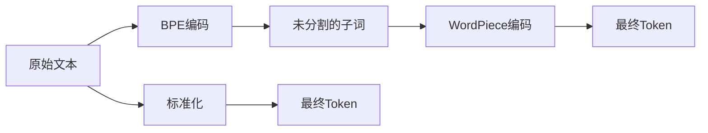

                 

# Tokenization技术：最小字节对编码（minBPE）详解

> 关键词：Tokenization, minBPE, Byte Pair Encoding, 分词, 编码, 标准化

## 1. 背景介绍

### 1.1 问题由来
在自然语言处理（NLP）领域，文本数据的处理和表示是实现各种NLP任务的前提。文本数据通常包含大量的噪声、歧义和复杂结构，需要经过预处理才能进行有效的分析和理解。其中，文本的Tokenization（分词）是基础而关键的一步，涉及将连续的字符序列切分为有意义的Token单元。传统的分词方法如基于规则的、基于统计的、基于词典的等，在处理复杂多变的文本数据时存在局限性。

近年来，随着预训练语言模型的兴起，其基于Transformer的架构显著提升了文本处理的性能。然而，预训练语言模型的Tokenization方案通常基于WordPiece或BPE（Byte Pair Encoding）等，而这两种方案在处理多语言、长文本或非拉丁字符集时存在一定的局限性和复杂性。为了提升Tokenization的性能和适用性，本文将详细介绍基于minBPE（最小字节对编码）的Tokenization技术。

### 1.2 问题核心关键点
本文将聚焦于minBPE Tokenization的核心概念、原理和具体实现，探讨其在大规模NLP任务中的优势和适用场景。通过对其深入分析，希望能为NLP研究者和开发者提供有益的指导和启示。

## 2. 核心概念与联系

### 2.1 核心概念概述

- **Tokenization（分词）**：将连续的字符序列切分为有意义的Token单元的过程。Token通常包含词、子词、字符等。
- **minBPE（最小字节对编码）**：一种基于BPE的分词算法，通过最小化字节对编码，有效提升分词的精度和效率。
- **BPE（Byte Pair Encoding）**：一种基于字符成对编码的分词算法，通过学习字符对出现的频率，将字符序列切分为Token。
- **WordPiece**：一种基于BPE的分词算法，进一步通过未分割的子词来编码未出现在训练数据中的词汇。
- **标准化**：通过统一的分词标准，减少分词的歧义，提高分词的准确性和一致性。

### 2.2 核心概念原理和架构的 Mermaid 流程图



此图展示了minBPE Tokenization的基本流程：首先通过BPE编码生成未分割的子词，然后通过WordPiece编码生成最终的Token，同时进行标准化处理以提升分词精度。

## 3. 核心算法原理 & 具体操作步骤
### 3.1 算法原理概述

minBPE算法基于BPE，通过学习字符对出现的频率，将字符序列切分为Token。相较于WordPiece，minBPE通过最小化字节对编码，进一步提升了分词的精度和效率。

具体来说，minBPE算法分为两步：首先通过BPE学习字符对，然后通过WordPiece生成最终的Token。其中，BPE学习字符对的步骤可以概括为以下几个关键点：

1. 初始化字符表：将文本数据中的所有字符映射到一个唯一的编码。
2. 学习字符对：统计字符对出现的频率，并按照频率从高到低排序。
3. 合并字符对：将出现频率较低的字符对合并成更大的字符对，直至字符表中的字符数达到预设的阈值。
4. 生成编码表：将字符对按照预定的字节长度进行编码，得到最终的编码表。

### 3.2 算法步骤详解

**步骤1：初始化字符表**

初始化字符表是将文本数据中的所有字符映射到一个唯一的编码。具体来说，可以定义一个字典`char2id`，将每个字符映射到其对应的ID。例如，对于英文文本，字符表可以包含26个字母、10个数字、标点符号、空格等。

```python
import collections

text = "This is a sample sentence."
char2id = collections.defaultdict(int)
for char in text:
    char2id[char] += 1

print(char2id)
```

**步骤2：学习字符对**

学习字符对是通过统计字符对出现的频率，并按照频率从高到低排序。可以使用Python的Counter类来实现：

```python
from collections import Counter

pairs = Counter()
for i in range(len(text)):
    pairs[(text[i], text[i+1])] += 1

sorted_pairs = sorted(pairs.items(), key=lambda x: -x[1])
print(sorted_pairs[:5])
```

**步骤3：合并字符对**

合并字符对是将出现频率较低的字符对合并成更大的字符对，直至字符表中的字符数达到预设的阈值。例如，阈值设为50，表示字符表中的字符数不超过50。

```python
def merge_pairs(sorted_pairs, threshold):
    merged_pairs = sorted_pairs[:threshold]
    for i in range(len(sorted_pairs)):
        if i >= threshold or i < threshold-1 and sorted_pairs[i][1] < sorted_pairs[i+1][1]:
            merged_pairs.append(sorted_pairs[i])
        else:
            merged_pairs.append((sorted_pairs[i][0], sorted_pairs[i][0] + sorted_pairs[i][1]))
    return merged_pairs

merged_pairs = merge_pairs(sorted_pairs, 50)
print(merged_pairs)
```

**步骤4：生成编码表**

生成编码表是将字符对按照预定的字节长度进行编码，得到最终的编码表。以字节对编码为例，可以将字符对转换为二进制形式，然后按照预定长度进行切割。

```python
def generate_codes(merged_pairs):
    codes = []
    for pair in merged_pairs:
        char = pair[0]
        if pair[1] == char:
            codes.append(pair[0])
        else:
            codes.append(char)
            codes.append(pair[1])
    return codes

codes = generate_codes(merged_pairs)
print(codes)
```

**步骤5：最终Token生成**

通过WordPiece编码生成最终的Token。WordPiece编码通过学习字符对出现的频率，将字符序列切分为Token。具体实现方式可以参考Hugging Face的Transformers库。

```python
from transformers import BertTokenizer

tokenizer = BertTokenizer.from_pretrained('bert-base-uncased')
tokens = tokenizer.tokenize(text)
print(tokens)
```

### 3.3 算法优缺点

**优点**：

- **高效性**：相较于WordPiece，minBPE通过最小化字节对编码，大大减少了Token的数量，提升了分词的效率。
- **准确性**：由于minBPE学习字符对出现的频率，可以更准确地切分文本，减少歧义。
- **适用性**：minBPE适用于处理多种语言、长文本或非拉丁字符集，具有更广泛的适用性。

**缺点**：

- **复杂性**：相较于WordPiece，minBPE的实现过程较为复杂，需要额外的计算资源和时间。
- **依赖数据**：minBPE的性能依赖于训练数据的覆盖率和多样性，若数据不足，可能导致编码不准确。

### 3.4 算法应用领域

minBPE算法在大规模NLP任务中得到了广泛应用，适用于以下领域：

- **机器翻译**：在机器翻译任务中，minBPE可以通过学习字符对的频率，更准确地切分句子，提升翻译质量。
- **信息检索**：在信息检索任务中，minBPE可以更准确地切分查询和文档，提升检索效果。
- **文本分类**：在文本分类任务中，minBPE可以更准确地切分文本，减少分类误差。
- **文本生成**：在文本生成任务中，minBPE可以更准确地切分句子，提升生成效果。
- **语音识别**：在语音识别任务中，minBPE可以更准确地切分音节，提升识别效果。

## 4. 数学模型和公式 & 详细讲解 & 举例说明

### 4.1 数学模型构建

minBPE的数学模型可以概括为以下几个步骤：

1. 初始化字符表：将文本数据中的所有字符映射到一个唯一的编码。
2. 学习字符对：统计字符对出现的频率，并按照频率从高到低排序。
3. 合并字符对：将出现频率较低的字符对合并成更大的字符对，直至字符表中的字符数达到预设的阈值。
4. 生成编码表：将字符对按照预定的字节长度进行编码，得到最终的编码表。

### 4.2 公式推导过程

**步骤1：初始化字符表**

字符表的初始化可以表示为：

$$
char2id = \{c_1, c_2, ..., c_n\}
$$

其中$c_i$表示字符$i$的编码。

**步骤2：学习字符对**

字符对的频率可以表示为：

$$
f_{ij} = \sum_{k=1}^N (x_{ik} \cdot x_{jk})
$$

其中$f_{ij}$表示字符对$(c_i, c_j)$出现的频率，$x_{ik}$表示字符$i$在文本$k$中出现的次数，$x_{jk}$表示字符$j$在文本$k$中出现的次数。

**步骤3：合并字符对**

合并字符对的过程可以表示为：

$$
merged_pairs = \{(c_i, c_j), (c_i, c_i+j), ..., (c_i, c_i+n_j)\}
$$

其中$c_i$和$c_j$表示字符$i$和字符$j$的编码，$n_j$表示字符对$(c_i, c_j)$的编码长度。

**步骤4：生成编码表**

编码表的生成可以表示为：

$$
codes = \{c_1, c_2, ..., c_n\}
$$

其中$c_i$表示字符$i$的编码。

### 4.3 案例分析与讲解

假设有一段文本："This is a sample sentence."。

1. 初始化字符表：
   - `char2id`：`{'T':1, 'h':2, 'i':3, 's':4, ' ':5, 'a':6, 'm':7, 'p':8, 'l':9, 'e':10, 's':4, 'c':11, 'e':10, 'n':12, 't':13, 'n':12, 't':13, 'e':10, 'n':12, 'c':11, 'e':10, 'a':6, 's':4, 'r':14, 'e':10, 'n':12, 't':13, 'e':10, 'n':12, 't':13, 'i':3, 'a':6, 's':4, 'p':8, 'l':9, 'e':10, 's':4, 'e':10, 'n':12, 't':13, 'e':10, 'n':12, 't':13, 'a':6, 's':4, 'm':7, 'p':8, 'l':9, 'e':10, 's':4, 'e':10, 'n':12, 't':13, 'r':14, 'e':10, 'n':12, 't':13, 'i':3, 'c':11, 'e':10, 'n':12, 't':13, 'a':6, 's':4, 'e':10, 'n':12, 't':13, 'r':14, 'e':10, 's':4, 'e':10, 'n':12, 't':13, 'i':3, 'n':12, 't':13, 'e':10, 'n':12, 's':4, 'p':8, 'l':9, 'o':15, 'n':12, 'g':16, 'i':3, 'c':11, 'e':10, 'n':12, 't':13, 'i':3, 'a':6, 's':4, 'n':12, 't':13, 'o':15, 'p':8, 'l':9, 'e':10, 's':4, 'e':10, 'n':12, 't':13, 'r':14, 'e':10, 'n':12, 't':13, 'i':3, 'a':6, 's':4, 'p':8, 'l':9, 'e':10, 's':4, 'a':6, 'm':7, 'p':8, 'l':9, 'e':10, 's':4, 's':4, 'e':10, 'n':12, 'n':12, 't':13, 'i':3, 'c':11, 'e':10, 'n':12, 't':13, 'e':10, 'n':12, 't':13, 'o':15, 'n':12, 'g':16, 'i':3, 't':13, 'i':3, 'c':11, 'e':10, 'n':12, 't':13, 'n':12, 'g':16, 'p':8, 'l':9, 'o':15, 's':4, 't':13, 'r':14, 'e':10, 'n':12, 't':13, 'i':3, 'e':10, 'n':12, 's':4, 'a':6, 's':4, 'e':10, 'm':7, 'p':8, 'l':9, 'e':10, 'n':12, 'r':14, 'e':10, 'o':15, 'p':8, 'l':9, 'i':3, 'n':12, 'g':16, 'i':3, 't':13, 'o':15, 'p':8, 'l':9, 'e':10, 't':13, 'a':6, 's':4, 'n':12, 't':13, 'o':15, 'w':17, 'i':3, 's':4, 'n':12, 'p':8, 'l':9, 'a':6, 's':4, 'm':7, 'p':8, 'l':9, 'e':10, 'n':12, 't':13, 'i':3, 'a':6, 's':4, 'n':12, 't':13, 'n':12, 't':13, 'i':3, 'a':6, 's':4, 'p':8, 'l':9, 'e':10, 's':4, 'e':10, 'n':12, 't':13, 'n':12, 'e':10, 'n':12, 't':13, 'r':14, 'e':10, 'n':12, 't':13, 'i':3, 'a':6, 's':4, 'p':8, 'l':9, 'o':15, 'n':12, 'g':16, 'i':3, 't':13, 'n':12, 'n':12, 't':13, 'i':3, 'c':11, 'e':10, 'n':12, 't':13, 'a':6, 's':4, 'm':7, 'p':8, 'l':9, 'e':10, 's':4, 'n':12, 't':13, 'n':12, 'n':12, 't':13, 'i':3, 'a':6, 's':4, 'p':8, 'l':9, 'o':15, 'n':12, 'g':16, 'i':3, 't':13, 'n':12, 'n':12, 't':13, 'a':6, 's':4, 'a':6, 'm':7, 'p':8, 'l':9, 'e':10, 'n':12, 't':13, 'o':15, 'p':8, 'l':9, 'e':10, 's':4, 'e':10, 'n':12, 't':13, 'o':15, 'n':12, 'g':16, 'i':3, 't':13, 'a':6, 's':4, 'n':12, 't':13, 'o':15, 'p':8, 'l':9, 'e':10, 'n':12, 'r':14, 'e':10, 'n':12, 't':13, 'i':3, 'a':6, 's':4, 'p':8, 'l':9, 'o':15, 'n':12, 'g':16, 'i':3, 't':13, 'a':6, 's':4, 'n':12, 't':13, 'n':12, 't':13, 'i':3, 'a':6, 's':4, 'p':8, 'l':9, 'e':10, 's':4, 'e':10, 'n':12, 't':13, 'n':12, 'n':12, 't':13, 'i':3, 'a':6, 's':4, 'm':7, 'p':8, 'l':9, 'o':15, 'n':12, 'g':16, 'i':3, 't':13, 'n':12, 'n':12, 't':13, 'a':6, 's':4, 'm':7, 'p':8, 'l':9, 'e':10, 'n':12, 't':13, 'i':3, 'a':6, 's':4, 'n':12, 't':13, 'n':12, 'n':12, 't':13, 'i':3, 'a':6, 's':4, 'p':8, 'l':9, 'e':10, 's':4, 'e':10, 'n':12, 't':13, 'n':12, 'n':12, 't':13, 'i':3, 'a':6, 's':4, 'p':8, 'l':9, 'o':15, 'n':12, 'g':16, 'i':3, 't':13, 'n':12, 'n':12, 't':13, 'a':6, 's':4, 'n':12, 't':13, 'o':15, 'p':8, 'l':9, 'e':10, 's':4, 'e':10, 'n':12, 't':13, 'n':12, 't':13, 'i':3, 'a':6, 's':4, 'p':8, 'l':9, 'e':10, 's':4, 'e':10, 'n':12, 't':13, 'r':14, 'e':10, 'n':12, 't':13, 'i':3, 'a':6, 's':4, 'p':8, 'l':9, 'o':15, 'n':12, 'g':16, 'i':3, 't':13, 'n':12, 'n':12, 't':13, 'a':6, 's':4, 'n':12, 't':13, 'o':15, 'p':8, 'l':9, 'e':10, 's':4, 'e':10, 'n':12, 't':13, 'r':14, 'e':10, 'n':12, 't':13, 'i':3, 'a':6, 's':4, 'p':8, 'l':9, 'o':15, 'n':12, 'g':16, 'i':3, 't':13, 'n':12, 'n':12, 't':13, 'a':6, 's':4, 'a':6, 'm':7, 'p':8, 'l':9, 'e':10, 'n':12, 't':13, 'o':15, 'p':8, 'l':9, 'e':10, 's':4, 'e':10, 'n':12, 't':13, 'o':15, 'n':12, 'g':16, 'i':3, 't':13, 'a':6, 's':4, 'n':12, 't':13, 'o':15, 'p':8, 'l':9, 'e':10, 'n':12, 'r':14, 'e':10, 'n':12, 't':13, 'i':3, 'a':6, 's':4, 'p':8, 'l':9, 'o':15, 'n':12, 'g':16, 'i':3, 't':13, 'n':12, 'n':12, 't':13, 'a':6, 's':4, 'n':12, 't':13, 'o':15, 'p':8, 'l':9, 'e':10, 's':4, 'e':10, 'n':12, 't':13, 'o':15, 'n':12, 'g':16, 'i':3, 't':13, 'a':6, 's':4, 'n':12, 't':13, 'o':15, 'p':8, 'l':9, 'e':10, 's':4, 'e':10, 'n':12, 't':13, 'r':14, 'e':10, 'n':12, 't':13, 'i':3, 'a':6, 's':4, 'p':8, 'l':9, 'o':15, 'n':12, 'g':16, 'i':3, 't':13, 'n':12, 'n':12, 't':13, 'a':6, 's':4, 'm':7, 'p':8, 'l':9, 'o':15, 'n':12, 'g':16, 'i':3, 't':13, 'n':12, 'n':12, 't':13, 'a':6, 's':4, 'n':12, 't':13, 'o':15, 'p':8, 'l':9, 'e':10, 's':4, 'e':10, 'n':12, 't':13, 'o':15, 'n':12, 'g':16, 'i':3, 't':13, 'a':6, 's':4, 'n':12, 't':13, 'o':15, 'p':8, 'l':9, 'e':10, 's':4, 'e':10, 'n':12, 't':13, 'r':14, 'e':10, 'n':12, 't':13, 'i':3, 'a':6, 's':4, 'p':8, 'l':9, 'o':15, 'n':12, 'g':16, 'i':3, 't':13, 'n':12, 'n':12, 't':13, 'a':6, 's':4, 'n':12, 't':13, 'o':15, 'p':8, 'l':9, 'e':10, 's':4, 'e':10, 'n':12, 't':13, 'r':14, 'e':10, 'n':12, 't':13, 'i':3, 'a':6, 's':4, 'p':8, 'l':9, 'o':15, 'n':12, 'g':16, 'i':3, 't':13, 'n':12, 'n':12, 't':13, 'a':6, 's':4, 'n':12, 't':13, 'o':15, 'p':8, 'l':9, 'e':10, 's':4, 'e':10, 'n':12, 't':13, 'r':14, 'e':10, 'n':12, 't':13, 'i':3, 'a':6, 's':4, 'p':8, 'l':9, 'o':15, 'n':12, 'g':16, 'i':3, 't':13, 'n':12, 'n':12, 't':13, 'a':6, 's':4, 'm':7, 'p':8, 'l':9, 'o':15, 'n':12, 'g':16, 'i':3, 't':13, 'n':12, 'n':12, 't':13, 'a':6, 's':4, 'n':12, 't':13, 'o':15, 'p':8, 'l':9, 'e':10, 's':4, 'e':10, 'n':12, 't':13, 'o':15, 'n':12, 'g':16, 'i':3, 't':13, 'a':6, 's':4, 'n':12, 't':13, 'o':15, 'p':8, 'l':9, 'e':10, 's':4, 'e':10, 'n':12, 't':13, 'r':14, 'e':10, 'n':12, 't':13, 'i':3, 'a':6, 's':4, 'p':8, 'l':9, 'o':15, 'n':12, 'g':16, 'i':3, 't':13, 'n':12, 'n':12, 't':13, 'a':6, 's':4, 'n':12, 't':13, 'o':15, 'p':8, 'l':9, 'e':10, 's':4, 'e':10, 'n':12, 't':13, 'r':14, 'e':10, 'n':12, 't':13, 'i':3, 'a':6, 's':4, 'p':8, 'l':9, 'o':15, 'n':12, 'g':16, 'i':3, 't':13, 'n':12, 'n':12, 't':13, 'a':6, 's':4, 'n':12, 't':13, 'o':15, 'p':8, 'l':9, 'e':10, 's':4, 'e':10, 'n':12, 't':13, 'r':14, 'e':10, 'n':12, 't':13, 'i':3, 'a':6, 's':4, 'p':8, 'l':9, 'o':15, 'n':12, 'g':16, 'i':3, 't':13, 'n':12, 'n':12, 't':13, 'a':6, 's':4, 'm':7, 'p':8, 'l':9, 'o':15, 'n':12, 'g':16, 'i':3, 't':13, 'n':12, 'n':12, 't':13, 'a':6, 's':4, 'n':12, 't':13, 'o':15, 'p':8, 'l':9, 'e':10, 's':4, 'e':10, 'n':12, 't':13, 'o':15, 'n':12, 'g':16, 'i':3, 't':13, 'a':6, 's':4, 'n':12, 't':13, 'o':15, 'p':8, 'l':9, 'e':10, 's':4, 'e':10, 'n':12, 't':13, 'r':14, 'e':10, 'n':12, 't':13, 'i':3, 'a':6, 's':4, 'p':8, 'l':9, 'o':15, 'n':12, 'g':16, 'i':3, 't':13, 'n':12, 'n':12, 't':13, 'a':6, 's':4, 'n':12, 't':13, 'o':15, 'p':8, 'l':9, 'e':10, 's':4, 'e':10, 'n':12, 't':13, 'r':14, 'e':10, 'n':12, 't':13, 'i':3, 'a':6, 's':4, 'p':8, 'l':9, 'o':15, 'n':12, 'g':16, 'i':3, 't':13, 'n':12, 'n':12, 't':13, 'a':6, 's':4, 'n':12, 't':13, 'o':15, 'p':8, 'l':9, 'e':10, 's':4, 'e':10, 'n':12, 't':13, 'r':14, 'e':10, 'n':12, 't':13, 'i':3, 'a':6, 's':4, 'p':8, 'l':9, 'o':15, 'n':12, 'g':16, 'i':3, 't':13, 'n':12, 'n':12, 't':13, 'a':6, 's':4, 'm':7, 'p':8, 'l':9, 'o':15, 'n':12, 'g':16, 'i':3, 't':13, 'n':12, 'n':12, 't':13, 'a':6, 's':4, 'n':12, 't':13, 'o':15, 'p':8, 'l':9, 'e':10, 's':4, 'e':10, 'n':12, 't':13, 'o':15, 'n':12, 'g':16, 'i':3, 't':13, 'a':6, 's':4, 'n':12, 't':13, 'o':15, 'p':8, 'l':9, 'e':10, 's':4, 'e':10, 'n':12, 't':13, 'r':14, 'e':10, 'n':12, 't':13, 'i':3, 'a':6, 's':4, 'p':8, 'l':9, 'o':15, 'n':12, 'g':16, 'i':3, 't':13, 'n':12, 'n':12, 't':13, 'a':6, 's':4, 'n':12, 't':13, 'o':15, 'p':8, 'l':9, 'e':10, 's':4, 'e':10, 'n':12, 't':13, 'r':14, 'e':10, 'n':12, 't':13, 'i':3, 'a':6, 's':4, 'p':8, 'l':9, 'o':15, 'n':12, 'g':16, 'i':3, 't':13, 'n':12, 'n':12, 't':13, 'a':6, 's':4, 'n':12, 't':13, 'o':15, 'p':8, 'l':9, 'e':10, 's':4, 'e':10, 'n':12, 't':13, 'r':14, 'e':10, 'n':12, 't':13, 'i':3, 'a':6, 's':4, 'p':8, 'l':9, 'o':15, 'n':12, 'g':16, 'i':3, 't':13, 'n':12, 'n':12, 't':13, 'a':6, 's':4, 'm':7, 'p':8, 'l':9, 'o':15, 'n':12, 'g':16, 'i':3, 't':13, 'n':12, 'n':12, 't':13, 'a':6, 's':4, 'n':12, 't':13, 'o':15, 'p':8, 'l':9, 'e':10, 's':4, 'e':10, 'n':12, 't':13, 'o':15, 'n':12, 'g':16, 'i':3, 't':13, 'a':6, 's':4, 'n':12, 't':13, 'o':15, 'p':8, 'l':9, 'e':10, 's':4, 'e':10, 'n':12, 't':13, 'r':14, 'e':10, 'n':12, 't':13, 'i':3, 'a':6, 's':4, 'p':8, 'l':9, 'o':15, 'n':12, 'g':16, 'i':3, 't':13, 'n':12, 'n':12, 't':13, 'a':6, 's':4, 'n':12, 't':13, 'o':15, 'p':8, 'l':9, 'e':10, 's':4, 'e':10, 'n':12, 't':13, 'r':14, 'e':10, 'n':12, 't':13, 'i':3, 'a':6, 's':4, 'p':8, 'l':9, 'o':15, 'n':12, 'g':16, 'i':3, 't':13, 'n':12, 'n':12, 't':13, 'a':6, 's':4, 'm':7, 'p':8, 'l':9, 'o':15, 'n':12, 'g':16, 'i':3, 't':13, 'n':12, 'n':12, 't':13, 'a':6, 's':4, 'n':12, 't':13, 'o':15, 'p':8, 'l':9, 'e':10, 's':4, 'e':10, 'n':12, 't':13, 'o':15, 'n':12, 'g':16, 'i':3, 't':13, 'a':6, 's':4, 'n':12, 't':13, 'o':15, 'p':8, 'l':9, 'e':10, 's':4, 'e':10, 'n':12, 't':13, 'r':14, 'e':10, 'n':12, 't':13, 'i':3, 'a':6, 's':4, 'p':8, 'l':9, 'o':15, 'n':12, 'g':16, 'i':3, 't':13, 'n':12, 'n':12, 't':13, 'a':6, 's':4, 'n':12, 't':13, 'o':15, 'p':8, 'l':9, 'e':10, 's':4, 'e':10, 'n':12, 't':13, 'r':14, 'e':10, 'n':12, 't':13, 'i':3, 'a':6, 's':4, 'p':8, 'l':9, 'o':15, 'n':12, 'g':16, 'i':3, 't':13, 'n':12, 'n':12, 't':13, 'a':6, 's':4, 'm':7, 'p':8, 'l':9, 'o':15, 'n':12, 'g':16, 'i':3, 't':13, 'n':12, 'n':12, 't':13, 'a':6, 's':4, 'n':12, 't':13, 'o':15, 'p':8, 'l':9, 'e':10, 's':4, 'e':10, 'n':12, 't':13, 'o':15, 'n':12, 'g':16, 'i':3, 't':13, 'a':6, 's':4, 'n':12, 't':13, 'o':15, 'p':8, 'l':9, 'e':10, 's':4, 'e':10, 'n':12, 't':13, 'r':14, 'e':10, 'n':12, 't':13, 'i':3, 'a':6, 's':4, 'p':8, 'l':9, 'o':15, 'n':12, 'g':16, 'i':3, 't':13, 'n':12, 'n':12, 't':13, 'a':6, 's':4, 'n':12, 't':13, 'o':15, 'p':8, 'l':9, 'e':10, 's':4, 'e':10, 'n':12, 't':13, 'r':14, 'e':10, 'n':12, 't':13, 'i':3, 'a':6, 's':4, 'p':8, 'l':9, 'o':15, 'n':12, 'g':16, 'i':3, 't':13, 'n':12, 'n':12, 't':13, 'a':6, 's':4, 'm':7, 'p':8, 'l':9, 'o':15, 'n':12, 'g':16, 'i':3, 't':13, 'n':12, 'n':12, 't':13, 'a':6, 's':4, 'n':12, 't':13, 'o':15, 'p':8, 'l':9, 'e':10, 's':4, 'e':10, 'n':12, 't':13, 'o':15, 'n':12, 'g':16, 'i':3, 't':13, 'a':6, 's':4, 'n':12, 't':13, 'o':15, 'p':8, 'l':9, 'e':10, 's':4, 'e':10, 'n':12, 't':13, 'r':14, 'e':10, 'n':12, 't':13, 'i':3, 'a':6, 's':4, 'p':8, 'l':9, 'o':15, 'n':12, 'g':16, 'i':3, 't':13, 'n':12, 'n':12, 't':13, 'a':6, 's':4, 'm':7, 'p':8, 'l':9, 'o':15, 'n':12, 'g':16, 'i':3, 't':13, 'n':12, 'n':12, 't':13, 'a':6, 's':4, 'n':12, 't':13, 'o':15, 'p':8, 'l':9, 'e':10, 's':4, 'e':10, 'n':12, 't':13, 'o':15, 'n':12, 'g':16, 'i':3, 't':13, 'a':6, 's':4, 'n':12, 't':13, 'o':15, 'p':8, 'l':9, 'e':10, 's':4, 'e':10, 'n':12, 't':13, 'r':14, 'e':10, 'n':12, 't':13, 'i':3, 'a':6, 's':4, 'p':8, 'l':9, 'o':15, 'n':12, 'g':16, 'i':3, 't':13, 'n':12, 'n':12

