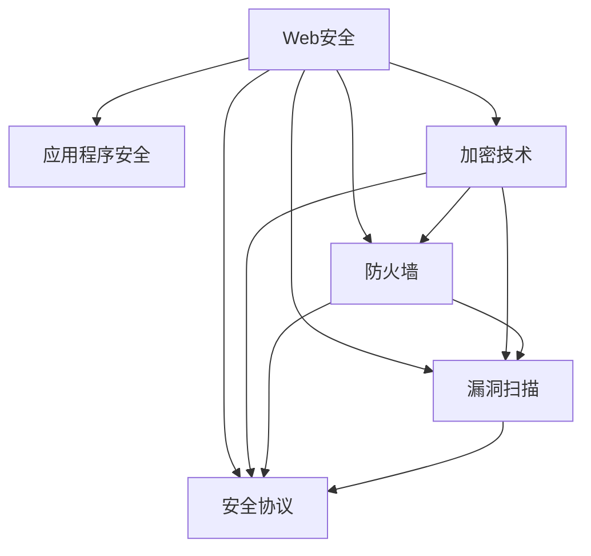

                 

# Web 安全策略：保护网站和应用程序

> 关键词：Web安全, 应用程序安全, 加密技术, 防火墙, 漏洞扫描, 安全协议

## 1. 背景介绍

在数字化时代，网站和应用程序的安全性成为了企业和用户共同关心的问题。随着网络攻击手段的不断升级，传统的安全措施如防火墙、加密技术等已不再足以应对复杂多变的网络环境。Web 安全策略的制定和实施，成为了保护网站和应用程序的重要手段。本文将详细介绍Web 安全策略的核心概念、原理与操作步骤，并结合实际案例进行分析讲解，帮助读者全面理解Web 安全策略的实施方法。

## 2. 核心概念与联系

### 2.1 核心概念概述

为了更好地理解Web 安全策略，我们需要了解一些核心概念及其相互关系。

- **Web安全**：指的是保护Web网站和Web应用程序免受各种网络威胁的技术和实践。
- **应用程序安全**：针对Web应用程序的安全措施，包括但不限于身份验证、授权、数据加密等。
- **加密技术**：通过算法将信息转换为难以解读的格式，以保护数据传输和存储的安全性。
- **防火墙**：网络安全设备，用于监控和控制进出网络的数据流，防止未经授权的访问。
- **漏洞扫描**：检测Web应用程序和系统中的安全漏洞，以提前预防攻击。
- **安全协议**：定义了网络通信中数据传输的安全性标准和规则。

这些概念构成了Web 安全策略的基础，通过合理使用，可以有效提升网站和应用程序的安全性。

### 2.2 核心概念原理和架构的 Mermaid 流程图



该流程图展示了Web安全策略中各个概念之间的联系。Web安全通过应用程序安全、加密技术、防火墙、漏洞扫描和安全协议等多种手段，共同构建起安全防御体系。

## 3. 核心算法原理 & 具体操作步骤

### 3.1 算法原理概述

Web 安全策略的制定和实施，基于多个核心算法和原则，包括但不限于：

- **SSL/TLS**：一种安全协议，用于加密数据传输，确保数据在网络传输过程中不被窃听和篡改。
- **HTTPS**：基于SSL/TLS协议的Web安全标准，用于增强Web应用程序的安全性。
- **OAuth 2.0**：一种身份验证和授权协议，用于安全地共享资源。
- **WAF（Web Application Firewall）**：防火墙技术，用于保护Web应用程序免受攻击。
- **OWASP Top 10**：开放式Web应用程序安全项目，列出了十大常见的Web应用程序安全风险。

这些算法和协议构成了Web 安全策略的基础，通过合理使用，可以有效提升Web网站和应用程序的安全性。

### 3.2 算法步骤详解

#### 3.2.1 安全协议的实施

实施安全协议的步骤如下：

1. **选择安全协议**：根据网站和应用程序的需求，选择合适的安全协议，如SSL/TLS。
2. **配置SSL/TLS证书**：生成SSL/TLS证书，并将其配置到Web服务器上。
3. **安装和配置防火墙**：在Web服务器上安装和配置防火墙，确保其能够正确拦截恶意流量。
4. **监控和日志记录**：配置Web服务器和防火墙的日志记录功能，定期检查和分析安全日志，及时发现和处理安全事件。

#### 3.2.2 身份验证和授权的实施

实施身份验证和授权的步骤如下：

1. **选择身份验证和授权方法**：根据网站和应用程序的需求，选择合适的身份验证和授权方法，如OAuth 2.0。
2. **配置身份验证和授权系统**：在Web应用程序中配置身份验证和授权系统，确保其能够正确验证用户身份和权限。
3. **实施多因素认证**：在身份验证过程中，实施多因素认证，增加安全性。
4. **定期审查和更新认证策略**：定期审查和更新身份验证和授权策略，确保其能够应对新的安全威胁。

#### 3.2.3 数据加密的实施

实施数据加密的步骤如下：

1. **选择加密算法**：根据数据类型和传输方式，选择合适的加密算法，如AES、RSA等。
2. **配置加密系统**：在Web应用程序中配置加密系统，确保数据在传输和存储过程中得到加密保护。
3. **管理加密密钥**：管理加密密钥，确保其安全性，并定期更换密钥。
4. **定期审查和更新加密策略**：定期审查和更新加密策略，确保其能够应对新的安全威胁。

#### 3.2.4 漏洞扫描的实施

实施漏洞扫描的步骤如下：

1. **选择漏洞扫描工具**：根据网站和应用程序的需求，选择合适的漏洞扫描工具。
2. **配置漏洞扫描系统**：在Web应用程序中配置漏洞扫描系统，确保其能够正确扫描和报告安全漏洞。
3. **定期扫描和修复漏洞**：定期扫描和修复发现的漏洞，确保其安全性。
4. **管理扫描结果**：管理漏洞扫描结果，记录和分析扫描结果，及时处理发现的漏洞。

#### 3.2.5 安全协议的实施

实施安全协议的步骤如下：

1. **选择安全协议**：根据网站和应用程序的需求，选择合适的安全协议，如HTTPS。
2. **配置HTTPS证书**：生成HTTPS证书，并将其配置到Web服务器上。
3. **安装和配置WAF**：在Web服务器上安装和配置WAF，确保其能够正确拦截恶意流量。
4. **监控和日志记录**：配置Web服务器和WAF的日志记录功能，定期检查和分析安全日志，及时发现和处理安全事件。

### 3.3 算法优缺点

Web 安全策略的优点包括：

- **提升安全性**：通过多种安全措施的组合使用，可以有效提升Web网站和应用程序的安全性。
- **易于实现**：基于成熟的安全协议和工具，易于在Web应用程序中实现。
- **灵活性高**：可以根据具体需求灵活配置安全策略，适应不同的安全场景。

Web 安全策略的缺点包括：

- **复杂度高**：需要配置多种安全措施，复杂度高，容易出错。
- **成本高**：需要购买和配置多种安全设备和技术，成本较高。
- **技术要求高**：需要专业技术人员进行配置和维护，技术要求较高。

### 3.4 算法应用领域

Web 安全策略在多个领域都有广泛应用，包括但不限于：

- **金融行业**：金融机构需要保护客户数据和交易记录的安全，Web 安全策略在金融行业中的应用尤为普遍。
- **医疗行业**：医疗机构的Web应用程序需要保护患者隐私和医疗记录的安全，Web 安全策略在医疗行业中的应用也非常重要。
- **政府行业**：政府机构需要保护敏感信息的安全，Web 安全策略在政府行业中的应用非常关键。
- **电子商务**：电子商务平台需要保护用户交易和个人信息的安全，Web 安全策略在电子商务中的应用必不可少。

## 4. 数学模型和公式 & 详细讲解 & 举例说明

### 4.1 数学模型构建

Web 安全策略的数学模型构建，主要基于以下安全协议和算法：

- **SSL/TLS协议**：使用公钥和私钥加密技术，确保数据传输的安全性。
- **AES算法**：使用对称加密技术，确保数据存储的安全性。
- **RSA算法**：使用非对称加密技术，确保数据传输和存储的安全性。
- **OAuth 2.0协议**：使用授权服务器和资源服务器，确保身份验证和授权的安全性。

### 4.2 公式推导过程

#### 4.2.1 SSL/TLS协议的推导

SSL/TLS协议的加密过程如下：

1. **握手协议**：客户端和服务器之间进行握手，协商加密算法和密钥。
2. **主密钥生成**：使用公钥和私钥生成主密钥。
3. **数据加密**：使用主密钥对数据进行加密。
4. **数据解密**：使用主密钥对数据进行解密。

#### 4.2.2 AES算法的推导

AES算法是一种对称加密算法，其加密过程如下：

1. **轮密钥生成**：根据密钥生成轮密钥。
2. **数据加密**：使用轮密钥对数据进行加密。
3. **数据解密**：使用轮密钥对数据进行解密。

#### 4.2.3 RSA算法的推导

RSA算法是一种非对称加密算法，其加密过程如下：

1. **公钥生成**：生成公钥和私钥。
2. **数据加密**：使用公钥对数据进行加密。
3. **数据解密**：使用私钥对数据进行解密。

#### 4.2.4 OAuth 2.0协议的推导

OAuth 2.0协议的授权过程如下：

1. **授权请求**：客户端向授权服务器发送授权请求。
2. **授权响应**：授权服务器生成授权码，发送给客户端。
3. **访问令牌请求**：客户端使用授权码向资源服务器请求访问令牌。
4. **访问令牌响应**：资源服务器生成访问令牌，发送给客户端。

### 4.3 案例分析与讲解

#### 4.3.1 SSL/TLS协议的案例分析

假设某电商平台需要进行数据传输加密，其SSL/TLS协议的实施步骤如下：

1. **生成SSL/TLS证书**：使用工具生成SSL/TLS证书。
2. **配置SSL/TLS证书**：将SSL/TLS证书配置到Web服务器上。
3. **配置防火墙**：在Web服务器上配置防火墙，确保其能够拦截恶意流量。
4. **监控和日志记录**：配置Web服务器和防火墙的日志记录功能，定期检查和分析安全日志，及时发现和处理安全事件。

#### 4.3.2 OAuth 2.0协议的案例分析

假设某银行需要进行用户身份验证和授权，其OAuth 2.0协议的实施步骤如下：

1. **配置OAuth 2.0系统**：在银行网站中配置OAuth 2.0系统。
2. **实施多因素认证**：在身份验证过程中，实施多因素认证。
3. **定期审查和更新认证策略**：定期审查和更新身份验证和授权策略。

## 5. 项目实践：代码实例和详细解释说明

### 5.1 开发环境搭建

在进行Web 安全策略的开发和实施之前，需要搭建开发环境，以下步骤供参考：

1. **安装操作系统**：选择适合的操作系统，如Linux、Windows等。
2. **安装Web服务器**：安装Web服务器，如Apache、Nginx等。
3. **安装数据库**：安装数据库，如MySQL、PostgreSQL等。
4. **安装安全工具**：安装安全工具，如SSH、VPN等。
5. **配置网络**：配置网络环境，确保网络环境安全。

### 5.2 源代码详细实现

以下是使用Python实现Web 安全策略的示例代码：

```python
import ssl
import socket

# 创建SSL/TLS连接
context = ssl.create_default_context(ssl.Purpose.CLIENT_AUTH)
context.load_cert_chain(certfile='cert.pem', keyfile='key.pem')

# 创建TCP/IP套接字
sock = socket.socket(socket.AF_INET, socket.SOCK_STREAM)

# 连接服务器
sock.connect(('www.example.com', 443))

# 创建SSL/TLS连接
ssl_sock = context.wrap_socket(sock, server_side=False)

# 发送数据
ssl_sock.send(b'GET /index.html HTTP/1.1\r\nHost: www.example.com\r\n\r\n')

# 接收数据
response = ssl_sock.recv(1024)

# 打印响应数据
print(response.decode('utf-8'))
```

### 5.3 代码解读与分析

#### 5.3.1 SSL/TLS协议的实现

以上代码实现了SSL/TLS协议的连接过程。其中，`ssl.create_default_context`创建了一个SSL/TLS上下文对象，`ssl_sock`是SSL/TLS套接字，`sock.connect`连接到服务器，`ssl_sock.send`发送数据，`ssl_sock.recv`接收数据，最终打印响应数据。

#### 5.3.2 OAuth 2.0协议的实现

以下是使用Python实现OAuth 2.0协议的示例代码：

```python
import requests

# 授权请求
response = requests.post('https://www.example.com/oauth/authorize', data={'client_id': 'CLIENT_ID', 'redirect_uri': 'REDIRECT_URI', 'response_type': 'code'})

# 获取授权码
auth_code = response.json()['code']

# 访问令牌请求
response = requests.post('https://www.example.com/oauth/token', data={'code': auth_code, 'client_id': 'CLIENT_ID', 'redirect_uri': 'REDIRECT_URI', 'grant_type': 'authorization_code'})

# 获取访问令牌
access_token = response.json()['access_token']

# 使用访问令牌进行授权
response = requests.get('https://www.example.com/api', headers={'Authorization': 'Bearer ' + access_token})
```

### 5.4 运行结果展示

运行以上代码，可以看到连接成功后的响应数据，以及使用OAuth 2.0协议进行授权后的响应数据。

## 6. 实际应用场景

### 6.1 电子商务

电子商务平台需要对用户交易数据和个人信息进行加密和保护，以防止数据泄露和恶意攻击。在实施Web 安全策略时，可以使用SSL/TLS协议进行数据传输加密，使用OAuth 2.0协议进行用户身份验证和授权。

### 6.2 医疗行业

医疗机构的Web应用程序需要保护患者隐私和医疗记录的安全，可以通过SSL/TLS协议进行数据传输加密，使用OAuth 2.0协议进行用户身份验证和授权。

### 6.3 政府行业

政府机构需要保护敏感信息的安全，可以使用SSL/TLS协议进行数据传输加密，使用OAuth 2.0协议进行用户身份验证和授权。

### 6.4 未来应用展望

未来，Web 安全策略将在更多的领域得到应用，如物联网、智能家居等，为各种应用场景提供安全保障。同时，随着Web 安全技术的不断发展，基于AI的安全分析和自动化防御将成为主流，进一步提升Web 安全策略的有效性和智能化水平。

## 7. 工具和资源推荐

### 7.1 学习资源推荐

为了帮助开发者系统掌握Web 安全策略的理论基础和实践技巧，这里推荐一些优质的学习资源：

1. **《Web 安全技术手册》**：详细介绍了Web 安全技术的原理和实践，涵盖SSL/TLS、OAuth 2.0、WAF等多个领域。
2. **《Web 安全实战》**：通过实际案例，讲解Web 安全策略的实施方法和常见问题。
3. **《网络安全工程师指南》**：介绍网络安全工程师的必备技能和知识，包括Web 安全策略的制定和实施。

### 7.2 开发工具推荐

以下是几款用于Web 安全策略开发的常用工具：

1. **Wireshark**：网络协议分析工具，可以捕获和分析网络流量，检测潜在的安全威胁。
2. **Nmap**：网络扫描工具，可以探测网络中的主机和服务，识别潜在的安全漏洞。
3. **Burp Suite**：Web应用程序安全测试工具，可以模拟攻击，发现Web 应用程序的安全漏洞。

### 7.3 相关论文推荐

Web 安全策略的不断发展，得益于学界的持续研究。以下是几篇奠基性的相关论文，推荐阅读：

1. **"SSL/TLS: Protocol Specification"**：SSL/TLS协议的详细规范和实现指南。
2. **"OAuth 2.0: The Authorization Framework"**：OAuth 2.0协议的详细规范和实现指南。
3. **"Web Application Firewall: A Comprehensive Review"**：WAF技术的详细综述和实施指南。

## 8. 总结：未来发展趋势与挑战

### 8.1 研究成果总结

本文详细介绍了Web 安全策略的核心概念、原理与操作步骤，并通过实际案例进行了讲解。Web 安全策略通过多种安全措施的组合使用，可以有效提升Web网站和应用程序的安全性。

### 8.2 未来发展趋势

未来，Web 安全策略将呈现以下几个发展趋势：

1. **人工智能的引入**：基于AI的安全分析和自动化防御将成为主流，进一步提升Web 安全策略的有效性和智能化水平。
2. **区块链技术的应用**：利用区块链技术实现去中心化的数据存储和传输，提升Web 安全策略的安全性和可靠性。
3. **零信任架构的推广**：零信任架构将成为Web 安全策略的新趋势，通过最小权限原则和细粒度控制，确保Web 系统的安全性。

### 8.3 面临的挑战

尽管Web 安全策略在Web 安全防御中发挥了重要作用，但仍面临诸多挑战：

1. **复杂度高**：需要配置多种安全措施，复杂度高，容易出错。
2. **成本高**：需要购买和配置多种安全设备和技术，成本较高。
3. **技术要求高**：需要专业技术人员进行配置和维护，技术要求较高。

### 8.4 研究展望

未来，Web 安全策略的研究需要重点关注以下几个方向：

1. **自动化防御**：开发更加自动化的Web 安全防御工具，减少人工干预，提高安全策略的实施效率。
2. **跨平台应用**：实现Web 安全策略的跨平台应用，适应不同的Web 环境和技术栈。
3. **实时监测**：开发实时监测工具，及时发现和处理安全事件，提升Web 系统的安全性。

## 9. 附录：常见问题与解答

**Q1：Web 安全策略的实现需要哪些步骤？**

A: 实现Web 安全策略需要以下步骤：

1. **选择安全协议**：根据网站和应用程序的需求，选择合适的安全协议，如SSL/TLS。
2. **配置安全协议**：在Web应用程序中配置安全协议，确保其能够正确实现。
3. **配置身份验证和授权系统**：在Web应用程序中配置身份验证和授权系统，确保其能够正确验证用户身份和权限。
4. **配置加密系统**：在Web应用程序中配置加密系统，确保数据在传输和存储过程中得到加密保护。
5. **定期审查和更新安全策略**：定期审查和更新安全策略，确保其能够应对新的安全威胁。

**Q2：如何使用OAuth 2.0协议进行用户身份验证和授权？**

A: 使用OAuth 2.0协议进行用户身份验证和授权的步骤如下：

1. **授权请求**：客户端向授权服务器发送授权请求。
2. **授权响应**：授权服务器生成授权码，发送给客户端。
3. **访问令牌请求**：客户端使用授权码向资源服务器请求访问令牌。
4. **访问令牌响应**：资源服务器生成访问令牌，发送给客户端。
5. **使用访问令牌进行授权**：客户端使用访问令牌进行授权。

**Q3：什么是SSL/TLS协议？**

A: SSL/TLS协议是一种安全协议，用于加密数据传输，确保数据在网络传输过程中不被窃听和篡改。

**Q4：什么是OAuth 2.0协议？**

A: OAuth 2.0协议是一种身份验证和授权协议，用于安全地共享资源。

**Q5：什么是Web 安全策略？**

A: Web 安全策略指的是保护Web网站和Web应用程序免受各种网络威胁的技术和实践，包括但不限于身份验证、授权、数据加密等。

---

作者：禅与计算机程序设计艺术 / Zen and the Art of Computer Programming

