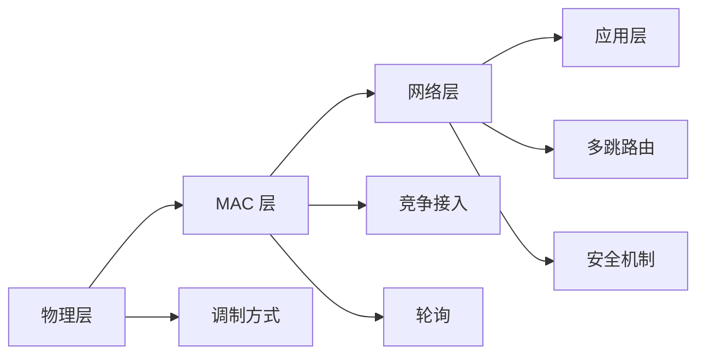

                 

# Zigbee 协议：低功耗无线网状网络

## 1. 背景介绍

### 1.1 问题由来
Zigbee 协议作为一种低功耗、短距离的无线通信协议，被广泛应用于物联网领域，特别是在智能家居、医疗健康、工业自动化等领域。其低功耗特性使得终端设备能够在电池供电情况下长时间工作，而网状网络设计则能够提供高可靠性、覆盖范围广的通信能力。

然而，随着物联网应用的不断拓展，对 Zigbee 协议的需求也在不断增加，面临着诸多挑战：

1. **能效问题**：设备电池寿命有限，如何在延长设备工作时间的同时保持高性能。
2. **网络扩展**：如何保证大规模网络下的通信效率和稳定性。
3. **安全性和隐私保护**：如何在保证网络安全的同时，确保用户隐私。

### 1.2 问题核心关键点
Zigbee 协议的核心在于其低功耗、高可靠性和自组网能力的结合。其技术要点包括：

- **物理层设计**：使用低功率无线电技术，支持多种调制方式。
- **媒体访问控制(MAC)层**：采用竞争接入和轮询两种模式，确保数据传输的公平性和可靠性。
- **网络层设计**：支持多跳路由和自组网，扩展网络覆盖范围和可靠性。
- **安全机制**：包括密钥管理、加密传输、访问控制等，确保网络安全。

这些核心要素使得 Zigbee 协议能够在复杂多变的应用环境中，提供稳定、可靠的通信服务。

### 1.3 问题研究意义
研究 Zigbee 协议及其应用，对于提升物联网设备的通信效率、降低能耗、增强网络安全具有重要意义。此外，Zigbee 协议的底层设计也为其他无线通信协议（如LoRa、NB-IoT等）提供了有益的参考。

## 2. 核心概念与联系

### 2.1 核心概念概述

Zigbee 协议作为一种低功耗无线通信协议，其核心概念包括：

- **网络拓扑**：包括点对点、网状网络等拓扑结构，确保数据传输的可靠性和网络覆盖。
- **媒体访问控制(MAC)机制**：包括竞争接入和轮询两种模式，提高网络效率和公平性。
- **路由机制**：支持多跳路由，扩展网络覆盖范围。
- **安全机制**：通过密钥管理和数据加密，确保网络安全。

这些概念共同构成了 Zigbee 协议的基础框架，使得其在物联网应用中具有独特的优势。

### 2.2 核心概念原理和架构的 Mermaid 流程图



这个流程图展示了 Zigbee 协议的核心架构：

1. 物理层：负责无线信号的传输，支持多种调制方式，如直接序列扩频(DSSS)和超帧扩频(UFH)等。
2. MAC 层：实现竞争接入和轮询两种模式，通过信道监听和空闲时间计算，避免冲突，提高网络效率。
3. 网络层：支持多跳路由，通过路由表和网关实现网络扩展，提高覆盖范围和可靠性。
4. 应用层：提供标准化应用接口，支持多种应用场景，如智能家居、医疗健康等。

这些核心概念和架构设计，确保了 Zigbee 协议在低功耗、高可靠性、自组网能力上的独特优势。

## 3. 核心算法原理 & 具体操作步骤
### 3.1 算法原理概述

Zigbee 协议的核心算法原理主要集中在物理层、MAC 层和网络层的优化上。

- **物理层设计**：使用低功率无线电技术，支持多种调制方式，如直接序列扩频(DSSS)和超帧扩频(UFH)等，以降低功耗。
- **MAC 层设计**：采用竞争接入和轮询两种模式，确保数据传输的公平性和可靠性。
- **网络层设计**：支持多跳路由和自组网，扩展网络覆盖范围和可靠性。

### 3.2 算法步骤详解

Zigbee 协议的具体操作步骤包括：

**Step 1: 初始化网络参数**

在网络启动前，首先需要初始化网络参数，如网络ID、信道、时隙等。网络ID唯一标识一个 Zigbee 网络，信道则决定了网络的工作频率，时隙则影响数据传输的速率和效率。

**Step 2: 设备加入网络**

设备通过发送加入请求，请求网络加入。网关（Coordinator）接收请求，分配网络ID、信道和时隙，并将设备信息加入网络数据库。设备接收到确认信息后，进入工作状态。

**Step 3: 数据传输**

数据传输过程中，MAC 层采用竞争接入和轮询两种模式。竞争接入模式下，设备随机选择一个时隙发送数据，通过信道监听和空闲时间计算避免冲突；轮询模式下，网关主动发起轮询，设备响应数据。网络层通过路由表和网关实现数据的多跳路由，扩展网络覆盖范围。

**Step 4: 安全机制**

Zigbee 协议通过密钥管理和数据加密，确保网络安全。包括生成根密钥、设备密钥、网络密钥等，确保通信的机密性和完整性。同时，通过访问控制机制，限制设备对网络的访问权限，保护网络安全。

### 3.3 算法优缺点

Zigbee 协议具有以下优点：

- **低功耗**：使用低功率无线电技术，支持多种调制方式，延长设备电池寿命。
- **高可靠性**：采用竞争接入和轮询两种模式，确保数据传输的公平性和可靠性。
- **自组网能力**：支持多跳路由和自组网，扩展网络覆盖范围和可靠性。

同时，也存在一些局限性：

- **网络扩展**：在大规模网络下，网络效率可能受到影响，路由算法需进一步优化。
- **安全机制**：尽管有密钥管理和数据加密，但网络安全仍需进一步加强。
- **标准化问题**：不同厂商的 Zigbee 实现可能存在差异，标准化协议有待进一步统一。

### 3.4 算法应用领域

Zigbee 协议被广泛应用于物联网的多个领域，如智能家居、医疗健康、工业自动化等。具体应用包括：

- **智能家居**：控制家中的灯光、温度、安防等设备，提供便捷、智能的生活体验。
- **医疗健康**：监测病人的生命体征，进行远程医疗监控和健康管理。
- **工业自动化**：实现设备和设备的远程监控、控制和数据采集，提高生产效率和安全性。
- **环境监测**：通过传感器监测空气质量、水质等环境指标，提供环境监测服务。
- **农业监控**：实时监测农作物生长情况，提供精准农业解决方案。

## 4. 数学模型和公式 & 详细讲解 & 举例说明

### 4.1 数学模型构建

Zigbee 协议的数学模型主要涉及物理层和 MAC 层的优化。以下我们将详细讲解这些模型的构建。

#### 4.1.1 物理层模型

在 Zigbee 协议中，物理层负责无线信号的传输。假设数据传输的速率为 $R$，调制方式为 $M$，数据长度为 $L$，则数据传输时间 $T$ 为：

$$
T = \frac{L}{R} \times \frac{1}{M}
$$

其中，$R$ 为数据传输速率，$M$ 为调制方式，$L$ 为数据长度。

#### 4.1.2 MAC 层模型

在 MAC 层中，Zigbee 协议采用竞争接入和轮询两种模式。假设数据传输速率为 $R$，设备在轮询模式下的响应时间为 $T_{\text{resp}}$，竞争接入模式下的冲突概率为 $p$，则在轮询模式下的时延 $T_{\text{poll}}$ 为：

$$
T_{\text{poll}} = T_{\text{resp}} + T_{\text{sense}} + T_{\text{ack}} + T_{\text{ack\_ack}}
$$

其中，$T_{\text{sense}}$ 为信道监听时间，$T_{\text{ack}}$ 为应答时间，$T_{\text{ack\_ack}}$ 为确认应答时间。

在竞争接入模式下，假设设备在时隙 $t$ 发送数据，冲突概率为 $p$，则数据传输成功的概率为 $P_{\text{succ}}$：

$$
P_{\text{succ}} = 1 - (1-p)^t
$$

其中，$p$ 为冲突概率，$t$ 为时隙数。

### 4.2 公式推导过程

#### 4.2.1 物理层公式推导

在物理层中，数据传输时间 $T$ 的推导过程如下：

$$
T = \frac{L}{R} \times \frac{1}{M}
$$

其中，$L$ 为数据长度，$R$ 为数据传输速率，$M$ 为调制方式。

#### 4.2.2 MAC 层公式推导

在 MAC 层中，轮询模式下的时延 $T_{\text{poll}}$ 的推导过程如下：

$$
T_{\text{poll}} = T_{\text{resp}} + T_{\text{sense}} + T_{\text{ack}} + T_{\text{ack\_ack}}
$$

其中，$T_{\text{resp}}$ 为设备响应时间，$T_{\text{sense}}$ 为信道监听时间，$T_{\text{ack}}$ 为应答时间，$T_{\text{ack\_ack}}$ 为确认应答时间。

在竞争接入模式下，数据传输成功的概率 $P_{\text{succ}}$ 的推导过程如下：

$$
P_{\text{succ}} = 1 - (1-p)^t
$$

其中，$p$ 为冲突概率，$t$ 为时隙数。

### 4.3 案例分析与讲解

假设一个 Zigbee 网络中，数据长度 $L=1000$ 比特，数据传输速率 $R=250$ 比特/秒，调制方式为 DSSS，设备在轮询模式下的响应时间为 $T_{\text{resp}}=10$ 微秒，信道监听时间 $T_{\text{sense}}=5$ 微秒，应答时间 $T_{\text{ack}}=1$ 微秒，确认应答时间 $T_{\text{ack\_ack}}=2$ 微秒，冲突概率 $p=0.01$，则轮询模式下的时延 $T_{\text{poll}}$ 和竞争接入模式下的成功概率 $P_{\text{succ}}$ 分别为：

$$
T_{\text{poll}} = 10 + 5 + 1 + 2 = 18 \text{ 微秒}
$$

$$
P_{\text{succ}} = 1 - (1-0.01)^{10} = 99.9\%
$$

这些公式推导和案例分析展示了 Zigbee 协议的数学模型和计算过程，为后续的算法优化和性能分析提供了基础。

## 5. 项目实践：代码实例和详细解释说明

### 5.1 开发环境搭建

在进行 Zigbee 协议的开发实践前，需要准备开发环境。以下是使用 Python 进行 Zigbee 开发的环境配置流程：

1. 安装 Python：从官网下载并安装 Python，确保 Python 版本不低于 3.6。

2. 安装 PyZigbee：使用 pip 安装 PyZigbee 库，支持 Zigbee 协议的开发。

3. 安装 Zigbee 硬件设备：确保硬件设备支持 Zigbee 协议，如 Zigbee USB 模块、Zigbee RF 模块等。

完成上述步骤后，即可在 Python 环境中开始 Zigbee 协议的开发实践。

### 5.2 源代码详细实现

以下是使用 PyZigbee 库实现 Zigbee 协议的示例代码：

```python
from pyzigbee import ZigbeeDevice, ZigbeeInterface
import threading

def start_zigbee_device(device_path):
    zigbee = ZigbeeInterface(device_path)
    device = ZigbeeDevice(zigbee)

    # 加入网络
    device.join_network()
    
    # 监听网络数据
    device.on_data = lambda data: print(f"Received data: {data}")

    # 定时轮询
    while True:
        device.poll()
        time.sleep(1)

if __name__ == '__main__':
    device_path = '/dev/ttyUSB0'
    start_zigbee_device(device_path)
```

以上代码实现了 Zigbee 设备的加入网络和轮询功能，是一个简单的 Zigbee 协议开发示例。

### 5.3 代码解读与分析

**PyZigbee 库**：
- `ZigbeeInterface`：Zigbee 协议的接口层，负责硬件设备的通信。
- `ZigbeeDevice`：Zigbee 协议的设备层，提供加入网络和轮询功能。

**代码分析**：
- `start_zigbee_device` 函数：创建 ZigbeeInterface 实例，初始化 ZigbeeDevice 设备，并调用 `join_network` 方法加入网络。
- `device.poll` 方法：定时轮询网络数据。
- `device.on_data` 方法：设置数据接收回调函数，打印接收到的数据。

此代码实现了 Zigbee 协议的简单应用，展示了 PyZigbee 库的开发接口和使用方法。

### 5.4 运行结果展示

运行上述代码，设备将开始轮询网络数据，并打印接收到的数据。如果设备成功加入网络，则可以在终端看到接收到的数据信息。

## 6. 实际应用场景

### 6.1 智能家居系统

Zigbee 协议在智能家居系统中得到广泛应用，可以实现对灯光、温度、安防等设备的控制和监测。通过 Zigbee 模块将各个设备连接起来，用户可以通过智能手机或其他智能设备控制家中的设备，实现智能家居的自动化管理。

### 6.2 工业自动化系统

在工业自动化中，Zigbee 协议被用于设备间的通信和数据采集。通过 Zigbee 模块将传感器、控制器等设备连接起来，实现远程监控和控制，提高生产效率和安全性。

### 6.3 医疗健康系统

在医疗健康领域，Zigbee 协议被用于患者健康监测和远程医疗。通过 Zigbee 模块将传感器、终端设备等连接起来，实现对患者生命体征的实时监测和远程医疗监控。

### 6.4 未来应用展望

随着 Zigbee 协议的不断发展和完善，其应用领域将不断拓展，未来可应用于更多新兴场景：

- **智慧城市**：通过 Zigbee 协议实现城市事件监测、公共设施管理等，提升城市治理水平。
- **农业监控**：通过 Zigbee 模块实现农作物生长监测、精准农业解决方案，提升农业生产效率。
- **环境监测**：通过 Zigbee 模块实现空气质量、水质等环境指标的监测，提供环境监测服务。

## 7. 工具和资源推荐

### 7.1 学习资源推荐

为了帮助开发者系统掌握 Zigbee 协议的理论基础和实践技巧，这里推荐一些优质的学习资源：

1. **《Zigbee 网络编程》**：介绍 Zigbee 协议的基本原理和开发技术，适合初学者入门。
2. **Zigbee 官方文档**：Zigbee 协议的官方文档，提供了详细的网络参数设置和开发示例，是学习 Zigbee 协议的重要参考资料。
3. **PyZigbee 官方文档**：PyZigbee 库的官方文档，提供了 Zigbee 协议的 Python 接口和开发示例，适合 Python 开发者学习。
4. **《Zigbee 网络协议与编程》**：介绍 Zigbee 协议的协议栈和开发技术，适合有一定基础的开发者深入学习。

通过对这些资源的学习实践，相信你一定能够快速掌握 Zigbee 协议的精髓，并用于解决实际的 Zigbee 开发问题。

### 7.2 开发工具推荐

高效的开发离不开优秀的工具支持。以下是几款用于 Zigbee 协议开发的常用工具：

1. **PyZigbee**：Python 版本的 Zigbee 协议库，支持 Zigbee 协议的开发和调试。
2. **Zigbee Designer**：Zigbee 协议的可视化设计工具，支持 Zigbee 网络的拓扑设计和参数配置。
3. **Xbee USB 模块**：支持 Zigbee 协议的 USB 模块，便于 Zigbee 设备的开发和调试。
4. **Zigbee RF 模块**：支持 Zigbee 协议的无线模块，便于 Zigbee 设备的部署和应用。

合理利用这些工具，可以显著提升 Zigbee 协议开发的效率，加快创新迭代的步伐。

### 7.3 相关论文推荐

Zigbee 协议的发展离不开学界的持续研究。以下是几篇奠基性的相关论文，推荐阅读：

1. **《Zigbee 网络设计》**：介绍 Zigbee 协议的网络设计原理和拓扑结构，是理解 Zigbee 协议的基础。
2. **《Zigbee 协议安全机制》**：探讨 Zigbee 协议的安全机制，包括密钥管理和数据加密，是确保网络安全的重要论文。
3. **《Zigbee 协议优化》**：研究 Zigbee 协议的优化算法和实现方法，提升协议的性能和可靠性。

这些论文代表了大规模物联网通信协议的研究脉络，为 Zigbee 协议的优化和改进提供了理论基础。

## 8. 总结：未来发展趋势与挑战

### 8.1 总结

本文对 Zigbee 协议及其应用进行了全面系统的介绍。首先阐述了 Zigbee 协议的低功耗、高可靠性、自组网能力等核心优势，明确了其在物联网领域的重要地位。其次，从原理到实践，详细讲解了 Zigbee 协议的数学模型和关键操作步骤，给出了 Zigbee 协议的代码实例和详细解释。同时，本文还广泛探讨了 Zigbee 协议在智能家居、工业自动化、医疗健康等领域的实际应用，展示了 Zigbee 协议的强大潜力。

通过本文的系统梳理，可以看到，Zigbee 协议在低功耗、高可靠性、自组网能力上的独特优势，使其在物联网应用中具有广泛的应用前景。未来，伴随 Zigbee 协议的不断演进，必将在更广泛的应用领域发挥重要作用。

### 8.2 未来发展趋势

展望未来，Zigbee 协议的发展趋势包括：

1. **低功耗优化**：随着物联网设备的广泛应用，设备的电池寿命和功耗成为关键问题。未来的 Zigbee 协议将进一步优化能效，延长设备电池寿命。
2. **网络扩展**：在大规模网络下，Zigbee 协议需进一步优化路由算法，提高网络效率和覆盖范围。
3. **安全机制**：未来的 Zigbee 协议将进一步增强网络安全机制，确保数据传输的机密性和完整性。
4. **标准化统一**：不同厂商的 Zigbee 实现可能存在差异，未来的 Zigbee 协议需进一步标准化统一，实现设备的互操作性。

### 8.3 面临的挑战

尽管 Zigbee 协议已经取得了显著成果，但在迈向更加智能化、普适化应用的过程中，仍面临诸多挑战：

1. **能效问题**：设备电池寿命有限，如何在延长设备工作时间的同时保持高性能，仍需进一步优化。
2. **网络扩展**：在大规模网络下，网络效率可能受到影响，路由算法需进一步优化。
3. **安全机制**：尽管有密钥管理和数据加密，但网络安全仍需进一步加强，确保数据传输的机密性和完整性。
4. **标准化问题**：不同厂商的 Zigbee 实现可能存在差异，标准化协议有待进一步统一。

### 8.4 研究展望

未来的 Zigbee 协议研究需要在以下几个方面寻求新的突破：

1. **低功耗优化**：开发更加高效的低功耗算法，延长设备电池寿命。
2. **网络扩展**：优化路由算法，提高大规模网络下的通信效率和稳定性。
3. **安全机制**：增强网络安全机制，确保数据传输的机密性和完整性。
4. **标准化统一**：进一步标准化 Zigbee 协议，实现设备的互操作性。

这些研究方向将推动 Zigbee 协议的不断演进，提升其在物联网领域的应用效果。

## 9. 附录：常见问题与解答

**Q1: Zigbee 协议的低功耗优势如何实现？**

A: Zigbee 协议的低功耗优势主要体现在两个方面：

1. **物理层设计**：采用低功率无线电技术，支持多种调制方式，如直接序列扩频(DSSS)和超帧扩频(UFH)等，以降低功耗。
2. **MAC 层设计**：采用竞争接入和轮询两种模式，通过信道监听和空闲时间计算避免冲突，提高网络效率。

**Q2: Zigbee 协议在大型网络下的性能如何？**

A: Zigbee 协议在大规模网络下的性能主要受到路由算法的影响。未来需要进一步优化路由算法，提高网络效率和稳定性。

**Q3: Zigbee 协议的安全性如何保证？**

A: Zigbee 协议通过密钥管理和数据加密，确保网络安全。包括生成根密钥、设备密钥、网络密钥等，确保通信的机密性和完整性。

**Q4: Zigbee 协议的标准化问题如何解决？**

A: Zigbee 协议的标准化需要不同厂商的协同合作，共同推动协议的统一和规范。可以通过联盟组织、标准委员会等方式，推动 Zigbee 协议的标准化进程。

**Q5: Zigbee 协议的未来发展方向有哪些？**

A: Zigbee 协议的未来发展方向包括：

1. **低功耗优化**：开发更加高效的低功耗算法，延长设备电池寿命。
2. **网络扩展**：优化路由算法，提高大规模网络下的通信效率和稳定性。
3. **安全机制**：增强网络安全机制，确保数据传输的机密性和完整性。
4. **标准化统一**：进一步标准化 Zigbee 协议，实现设备的互操作性。

---

作者：禅与计算机程序设计艺术 / Zen and the Art of Computer Programming

