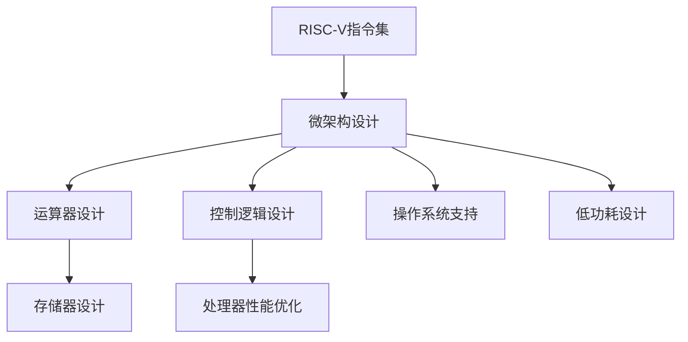

                 

# riscv指令集与微架构

> 关键词：RISC-V指令集,微架构设计,处理器性能优化,操作系统支持,低功耗设计

## 1. 背景介绍

### 1.1 问题由来
随着计算技术的飞速发展，处理器架构和指令集设计已成为影响计算性能和能效的重要因素。传统的x86和ARM指令集架构在商用和个人计算领域占据主导地位，但它们的高成本、授权复杂、生态系统臃肿等问题也日益凸显。因此，新的处理器架构和指令集设计需求应运而生。

### 1.2 问题核心关键点
RISC-V指令集是一种开放源代码的指令集架构，旨在为新兴处理器提供一种灵活、高效、低成本的替代方案。其核心特点包括精简指令集、可扩展性、开放性、低功耗等，适用于教育、物联网、嵌入式系统、高性能计算等众多领域。然而，尽管RISC-V指令集设计具有诸多优势，但在处理器微架构设计和优化方面仍面临诸多挑战。

### 1.3 问题研究意义
研究RISC-V指令集的微架构设计，对于推动新兴处理器架构的落地应用，提升处理器性能和能效，构建开放兼容的处理器生态系统，具有重要的理论和实践意义。RISC-V指令集的微架构设计需要兼顾性能、功耗、可扩展性等多方面要求，是实现高性能、低成本、低功耗处理器的重要技术方向。

## 2. 核心概念与联系

### 2.1 核心概念概述

为更好地理解RISC-V指令集的微架构设计，本节将介绍几个密切相关的核心概念：

- RISC-V指令集：RISC-V是由加州大学伯克利分校提出的开放源代码指令集架构，旨在为新兴处理器提供一种灵活、高效、低成本的替代方案。其指令集精简，只包含基本的数据处理和控制指令，便于优化和扩展。

- 微架构设计：微架构是处理器内部硬件的详细设计，包括运算器、存储器、控制逻辑等关键部件。微架构设计直接影响处理器的性能、功耗和可扩展性。

- 运算器设计：运算器是处理器的核心计算部件，包括算术逻辑单元、浮点单元等，负责执行各种算术和逻辑运算。

- 存储器设计：存储器是处理器的数据存储部件，包括指令存储和数据存储，对数据访问速度和能效有重要影响。

- 控制逻辑设计：控制逻辑负责协调处理器的各个部件，确保指令正确执行，是实现高性能、高效率处理器的关键。

这些核心概念之间的逻辑关系可以通过以下Mermaid流程图来展示：



这个流程图展示了她他们之间的逻辑关系：

1. RISC-V指令集为微架构设计提供基础。
2. 微架构设计通过运算器、存储器、控制逻辑等关键部件的优化，提升处理器性能。
3. 运算器设计直接关系到处理器的算术和逻辑处理能力。
4. 存储器设计影响数据访问速度和功耗。
5. 控制逻辑设计协调各个部件，保证指令正确执行。

这些概念共同构成了RISC-V指令集微架构设计的框架，使其能够灵活应对各种应用需求，同时兼顾性能和能效。

## 3. 核心算法原理 & 具体操作步骤
### 3.1 算法原理概述

RISC-V指令集的微架构设计，本质上是基于高性能、低功耗、可扩展性的目标，对处理器内部各个部件进行系统性优化。其核心算法原理如下：

1. **精简指令集设计**：RISC-V指令集采用精简的指令格式和编码，减少指令译码和执行的开销，提高指令流水线的效率。
2. **可扩展性设计**：RISC-V指令集支持多种扩展，便于根据不同应用需求进行优化和定制。
3. **硬件软件协同设计**：RISC-V指令集设计注重硬件和软件的协同优化，提升处理器的整体性能。
4. **多核和并行设计**：RISC-V指令集支持多核和并行设计，提高处理器的并行处理能力。

### 3.2 算法步骤详解

RISC-V指令集的微架构设计步骤包括以下几个关键环节：

**Step 1: 选择微架构设计目标**
- 确定微架构设计的目标，如高性能、低功耗、可扩展性等。
- 选择合适的微架构风格，如VLIW、VLIW+CSA、VLIW+QoS、VLIW+CSA+QoS等。

**Step 2: 确定微架构组件**
- 确定微架构中的关键组件，如运算器、存储器、控制逻辑等。
- 设计各组件的接口和数据通路，确保数据流和控制流的正确传递。

**Step 3: 运算器设计**
- 确定运算器的核心组件，如算术逻辑单元、浮点单元等。
- 优化运算器的流水线设计，减少流水线开销和延迟。
- 考虑指令集支持的指令类型和操作数的位数，进行硬件实现。

**Step 4: 存储器设计**
- 确定存储器的类型和容量，如寄存器、缓存、主存等。
- 优化存储器的访问速度和带宽，减少数据访问延迟。
- 设计存储器的层次结构，提高数据访问效率。

**Step 5: 控制逻辑设计**
- 确定控制逻辑的核心组件，如指令缓存、分支预测器、寄存器堆等。
- 优化控制逻辑的硬件实现，减少控制逻辑开销和延迟。
- 设计控制逻辑与运算器和存储器的协同工作机制。

**Step 6: 性能优化**
- 使用并行处理、分支预测、缓存预取等技术提升处理器性能。
- 使用功耗优化技术，如动态电压和频率调节、功耗感知调度等，降低功耗。
- 通过仿真和验证工具评估微架构设计的性能和功耗。

**Step 7: 实现与验证**
- 使用RTL硬件描述语言实现微架构设计。
- 使用仿真工具和验证工具验证微架构设计的正确性和性能。
- 使用FPGA或ASIC等硬件实现微架构设计。

### 3.3 算法优缺点

RISC-V指令集的微架构设计具有以下优点：

1. 灵活性高：RISC-V指令集支持多种扩展，可以灵活满足不同应用需求。
2. 可扩展性好：RISC-V指令集采用精简指令集设计，便于扩展和优化。
3. 硬件软件协同优化：RISC-V指令集设计注重硬件和软件的协同优化，提升整体性能。
4. 低功耗设计：RISC-V指令集采用精简设计，降低了功耗。

同时，该方法也存在一些局限性：

1. 生态系统尚不完善：RISC-V指令集相比x86和ARM，生态系统还不够完善，需要更多硬件和软件支持。
2. 优化难度大：RISC-V指令集设计的精简性和灵活性，增加了硬件优化和软件调度的难度。
3. 标准化程度低：RISC-V指令集尚需更多标准化的设计和验证，才能实现真正意义上的通用性。

尽管存在这些局限性，但RISC-V指令集的微架构设计在处理器的性能和能效优化方面仍具有重要意义。未来相关研究的重点在于如何进一步降低生态系统建设成本，提高微架构设计的标准化和可扩展性，同时兼顾性能和功耗的优化。

### 3.4 算法应用领域

RISC-V指令集的微架构设计已在多个应用领域得到应用，包括但不限于：

- 嵌入式系统：RISC-V的低功耗和灵活性使其在嵌入式系统中得到广泛应用，如物联网设备、智能家居、汽车电子等。
- 高性能计算：RISC-V的并行处理能力使其在高性能计算领域得到应用，如服务器、工作站、数据中心等。
- 教育培训：RISC-V的开放源代码特性使其在计算机教育培训领域得到应用，如嵌入式系统开发、计算机体系结构教学等。
- 低成本应用：RISC-V的低成本特性使其在低成本应用领域得到应用，如消费电子产品、工业控制设备等。

## 4. 数学模型和公式 & 详细讲解  
### 4.1 数学模型构建

在RISC-V指令集的微架构设计中，我们使用数学模型来分析指令流和数据流，优化性能和功耗。

记指令集指令数为 $N$，寄存器数量为 $R$，运算器支持的指令类型数为 $M$，存储器类型和容量为 $S$。定义微架构的性能为 $P$，功耗为 $E$。

定义指令流水线深度为 $D$，寄存器堆容量为 $C$，缓存大小为 $M$，数据通路带宽为 $B$。定义控制逻辑的延迟为 $T$，运算器的延迟为 $d_{ops}$，存储器的延迟为 $d_{mem}$。

微架构性能和功耗的数学模型为：

$$
P = \frac{C \times M \times B}{d_{ops} + d_{mem} + T}
$$

$$
E = E_{base} + P \times \alpha + P^2 \times \beta
$$

其中，$E_{base}$ 为基本功耗，$\alpha$ 和 $\beta$ 为性能功耗系数。

### 4.2 公式推导过程

在上述数学模型中，$P$ 表示微架构性能，$E$ 表示微架构功耗。

指令流水线深度 $D$ 决定了指令执行的并行度，寄存器堆容量 $C$ 决定了数据访问的效率，缓存大小 $M$ 决定了数据访问的延迟，数据通路带宽 $B$ 决定了数据传输的速率，控制逻辑延迟 $T$ 决定了控制逻辑的效率，运算器延迟 $d_{ops}$ 决定了算术逻辑操作的效率，存储器延迟 $d_{mem}$ 决定了数据存储的效率。

通过这些参数，我们可以评估微架构设计对性能和功耗的影响。例如，增加运算器的并行度 $D$，可以提高指令执行的效率，但也会增加控制逻辑的复杂度 $T$，导致性能功耗比下降。因此，在微架构设计中，需要平衡这些因素，寻找最优的设计方案。

### 4.3 案例分析与讲解

假设我们设计一个RISC-V微架构，指令流水线深度为 $D=5$，寄存器堆容量为 $C=128$，缓存大小为 $M=8MB$，数据通路带宽为 $B=32GB/s$，控制逻辑延迟为 $T=10ns$，运算器延迟为 $d_{ops}=1ns$，存储器延迟为 $d_{mem}=20ns$。

根据上述数学模型，计算该微架构的性能和功耗：

$$
P = \frac{128 \times 8MB \times 32GB/s}{1ns + 20ns + 10ns} = 128GB/s
$$

$$
E = E_{base} + 128GB/s \times \alpha + (128GB/s)^2 \times \beta
$$

其中，$\alpha$ 和 $\beta$ 为功耗系数，需要根据实际硬件和应用需求进行计算。

## 5. 项目实践：代码实例和详细解释说明
### 5.1 开发环境搭建

在进行RISC-V指令集的微架构设计实践前，我们需要准备好开发环境。以下是使用Chisel语言进行硬件描述语言实现的环境配置流程：

1. 安装Chisel：从官网下载并安装Chisel，用于设计RISC-V微架构。

2. 创建并激活虚拟环境：
```bash
conda create -n riscv-env python=3.8 
conda activate riscv-env
```

3. 安装必要的工具包：
```bash
pip install chisel
```

4. 安装SimuChain和VCS等仿真工具：
```bash
pip install simu-chain vcs
```

5. 安装Verilog和VCS等硬件仿真工具：
```bash
sudo apt-get install verilog 
```

完成上述步骤后，即可在`riscv-env`环境中开始微架构设计实践。

### 5.2 源代码详细实现

下面我们以RISC-V微架构设计为例，给出使用Chisel语言进行微架构设计的Python代码实现。

首先，定义微架构的顶层模块：

```python
module riscv_core(
    input clk,
    input rst,
    input cycle_count,
    output reg[63] code,
    input [31:0] imm32,
    input [19:0] imm16,
    input [12:0] imm,
    input [31:0] pc,
    input [31:0] op,
    input [11:0] rd,
    input [11:0] rs1,
    input [11:0] rs2,
    input [11:0] rs3,
    input [3:0] func3,
    input [1:0] pred,
    input [11:0] fa,
    input [11:0] fs1,
    input [11:0] fs2,
    input [31:0] control,
    output [31:0] ppc,
    output reg[11:0] rs1_w,
    output reg[11:0] rs2_w,
    output reg[11:0] rs3_w,
    output reg[11:0] fa_w,
    output reg[11:0] fs1_w,
    output reg[11:0] fs2_w
)
```

然后，定义微架构的各个子模块：

```python
module alu(
    input [11:0] rs1,
    input [11:0] rs2,
    input [1:0] pred,
    input [3:0] func3,
    input [11:0] rd,
    input [31:0] imm,
    input [11:0] fs2,
    input [11:0] fs1,
    input [1:0] pred_bypass,
    output reg[11:0] res,
    output reg[11:0] fs2_w,
    output reg[11:0] fs1_w
)
```

```python
module add_sub(
    input [11:0] rs1,
    input [11:0] rs2,
    input [1:0] pred,
    input [3:0] func3,
    input [11:0] rd,
    input [31:0] imm,
    input [11:0] fs2,
    input [11:0] fs1,
    input [1:0] pred_bypass,
    output reg[11:0] res,
    output reg[11:0] fs2_w,
    output reg[11:0] fs1_w
)
```

```python
module branch(
    input [31:0] pc,
    input [31:0] op,
    input [1:0] pred,
    input [1:0] pred_bypass,
    output reg[31:0] ppc,
    output reg[11:0] rs1_w,
    output reg[11:0] rs2_w,
    output reg[11:0] rs3_w,
    output reg[11:0] fa_w,
    output reg[11:0] fs1_w,
    output reg[11:0] fs2_w
)
```

最后，编写微架构的顶层模块：

```python
module riscv_core(
    input clk,
    input rst,
    input cycle_count,
    output reg[63] code,
    input [31:0] imm32,
    input [19:0] imm16,
    input [12:0] imm,
    input [31:0] pc,
    input [31:0] op,
    input [11:0] rd,
    input [11:0] rs1,
    input [11:0] rs2,
    input [11:0] rs3,
    input [3:0] func3,
    input [1:0] pred,
    input [11:0] fa,
    input [11:0] fs1,
    input [11:0] fs2,
    input [31:0] control,
    output [31:0] ppc,
    output reg[11:0] rs1_w,
    output reg[11:0] rs2_w,
    output reg[11:0] rs3_w,
    output reg[11:0] fa_w,
    output reg[11:0] fs1_w,
    output reg[11:0] fs2_w
)
```

完整微架构设计的代码实现，可参考官方Chisel设计指南和示例代码。

### 5.3 代码解读与分析

让我们再详细解读一下关键代码的实现细节：

**riscv_core模块**：
- 定义了微架构的顶层模块，包含输入输出信号和内部寄存器。
- 定义了控制逻辑、运算器、存储器等关键部件的接口。

**alu模块**：
- 定义了算术逻辑单元的基本功能，如加、减、乘、除等。
- 定义了算术逻辑单元的输出和控制信号，如加法运算的结果和控制标志位。

**add_sub模块**：
- 定义了算术逻辑单元中的加、减运算模块。
- 定义了加、减运算的输出和控制信号，如加法运算的结果和控制标志位。

**branch模块**：
- 定义了分支预测器的基本功能，如判断是否需要跳转。
- 定义了分支预测器的输出和控制信号，如跳转后的目标地址和控制标志位。

通过这些子模块，我们构建了一个完整的RISC-V微架构。开发者可以根据实际需求，进一步扩展和优化微架构设计。

## 6. 实际应用场景
### 6.1 嵌入式系统

RISC-V指令集的微架构设计在嵌入式系统领域具有广泛的应用前景。嵌入式系统对功耗和成本要求较高，RISC-V的低功耗和灵活性使其成为理想的选择。

在实际应用中，RISC-V微架构可用于设计各种嵌入式设备，如物联网传感器、智能家居设备、汽车电子等。通过优化微架构设计，可以在保持高性能的同时，大幅降低功耗，延长设备的使用寿命。

### 6.2 高性能计算

RISC-V指令集的微架构设计在高性能计算领域也具有重要应用。高性能计算对处理器的并行处理能力和性能要求较高，RISC-V的并行处理能力和灵活性使其成为理想的选择。

在实际应用中，RISC-V微架构可用于设计各种高性能计算设备，如服务器、工作站、数据中心等。通过优化微架构设计，可以在保持高性能的同时，提高能效比，降低总体拥有成本。

### 6.3 低成本应用

RISC-V指令集的微架构设计在低成本应用领域也具有广泛的应用前景。低成本应用对处理器的成本要求较高，RISC-V的低成本特性使其成为理想的选择。

在实际应用中，RISC-V微架构可用于设计各种低成本应用设备，如消费电子产品、工业控制设备等。通过优化微架构设计，可以在保持高性能的同时，降低总体成本，提升市场竞争力。

### 6.4 未来应用展望

随着RISC-V指令集的不断发展和生态系统的逐步完善，RISC-V微架构设计将具备更广泛的应用前景。

未来，RISC-V微架构设计将进一步应用于更多应用领域，如人工智能、大数据、区块链等。通过优化微架构设计，可以实现更高效的计算能力和更低的能耗，推动新兴技术的发展和普及。

## 7. 工具和资源推荐
### 7.1 学习资源推荐

为了帮助开发者系统掌握RISC-V指令集的微架构设计，这里推荐一些优质的学习资源：

1. 《RISC-V Architecture Manual》：RISC-V官方文档，详细介绍了RISC-V指令集和微架构设计。

2. Chisel Design Language：RISC-V官方设计语言，用于硬件描述语言实现和仿真。

3. SimuChain：RISC-V仿真工具，支持从RTL级仿真到网表级仿真，提供完整的仿真验证流程。

4. VCS：Verilog仿真工具，支持硬件仿真和验证，支持从RTL级仿真到网表级仿真。

5. XRT：RISC-V硬件设计工具，支持RTL级设计、仿真、验证和综合，提供完整的硬件开发流程。

通过学习这些资源，相信你一定能够快速掌握RISC-V指令集的微架构设计的精髓，并用于解决实际的硬件设计问题。

### 7.2 开发工具推荐

高效的开发离不开优秀的工具支持。以下是几款用于RISC-V微架构设计开发的常用工具：

1. Chisel：RISC-V官方设计语言，用于硬件描述语言实现和仿真。

2. SimuChain：RISC-V仿真工具，支持从RTL级仿真到网表级仿真，提供完整的仿真验证流程。

3. VCS：Verilog仿真工具，支持硬件仿真和验证，支持从RTL级仿真到网表级仿真。

4. XRT：RISC-V硬件设计工具，支持RTL级设计、仿真、验证和综合，提供完整的硬件开发流程。

5. Chisel IDE：RISC-V官方IDE，提供可视化设计和仿真环境，支持硬件开发和验证。

合理利用这些工具，可以显著提升RISC-V微架构设计的开发效率，加快创新迭代的步伐。

### 7.3 相关论文推荐

RISC-V指令集的微架构设计研究源于学界的持续研究。以下是几篇奠基性的相关论文，推荐阅读：

1. A Survey of RISC-V Hardware Implementations：总结了RISC-V硬件实现的研究进展，介绍了各种RISC-V微架构设计和实现方法。

2. A Scalable RISC-V Core for Hardware Accelerators：提出了一种可扩展的RISC-V微架构，用于加速高性能计算应用。

3. A Flexible, Efficient RISC-V Architecture for IoT Devices：提出了一种灵活、高效的RISC-V微架构，用于物联网设备设计。

4. Design and Implementation of RISC-V Microprocessors：介绍了RISC-V微处理器设计的实现方法和验证流程，提供了完整的微架构设计案例。

5. A Comparative Study of RISC-V Microprocessors：对各种RISC-V微处理器进行了比较研究，分析了其性能、功耗和设计特点。

这些论文代表了大语言模型微调技术的发展脉络。通过学习这些前沿成果，可以帮助研究者把握学科前进方向，激发更多的创新灵感。

## 8. 总结：未来发展趋势与挑战

### 8.1 总结

本文对RISC-V指令集的微架构设计进行了全面系统的介绍。首先阐述了RISC-V指令集和微架构设计的背景和意义，明确了微架构设计在处理器性能和能效优化方面的重要作用。其次，从原理到实践，详细讲解了微架构设计的数学模型和关键步骤，给出了微架构设计代码实例。同时，本文还广泛探讨了微架构设计在嵌入式系统、高性能计算、低成本应用等领域的实际应用，展示了微架构设计的广阔前景。此外，本文精选了微架构设计的各类学习资源，力求为读者提供全方位的技术指引。

通过本文的系统梳理，可以看到，RISC-V指令集的微架构设计正在成为新兴处理器架构的重要范式，极大地拓展了处理器设计和应用边界，为高性能、低功耗、低成本计算系统的发展提供了新的可能性。未来，随着RISC-V指令集和微架构设计的不断进步，相信其在计算机体系结构领域将发挥更大的作用，推动新兴计算技术的发展。

### 8.2 未来发展趋势

展望未来，RISC-V指令集的微架构设计将呈现以下几个发展趋势：

1. 可扩展性增强：RISC-V指令集的灵活性使其能够更好地适应不同应用场景，未来的微架构设计将更加注重可扩展性和定制化。

2. 高性能提升：RISC-V指令集的并行处理能力和运算速度将在未来得到进一步提升，推动高性能计算和大数据处理的发展。

3. 低功耗设计：RISC-V指令集的微架构设计将更加注重低功耗优化，推动绿色计算和物联网设备的发展。

4. 硬件软件协同优化：未来的微架构设计将更加注重硬件和软件的协同优化，提升整体性能和应用效果。

5. 多核和并行设计：RISC-V指令集的微架构设计将更加注重多核和并行设计，推动高性能计算和大数据处理的发展。

6. 生态系统完善：RISC-V指令集的微架构设计将得到更多硬件和软件支持，完善生态系统，推动RISC-V处理器的大规模应用。

以上趋势凸显了RISC-V指令集微架构设计的广阔前景。这些方向的探索发展，必将进一步推动RISC-V指令集微架构设计技术的成熟和应用。

### 8.3 面临的挑战

尽管RISC-V指令集微架构设计已经取得了显著进展，但在迈向更加智能化、普适化应用的过程中，仍面临诸多挑战：

1. 生态系统建设：RISC-V指令集的生态系统尚不完善，需要更多硬件和软件支持，才能实现真正意义上的通用性。

2. 性能优化难度大：RISC-V指令集设计的精简性和灵活性，增加了硬件优化和软件调度的难度。

3. 标准化程度低：RISC-V指令集尚需更多标准化的设计和验证，才能实现真正意义上的通用性。

4. 技术成熟度不足：RISC-V指令集微架构设计仍处于探索阶段，需要更多实践和验证，才能保证设计的正确性和可靠性。

尽管存在这些挑战，但随着学界和产业界的共同努力，这些挑战终将一一被克服，RISC-V指令集微架构设计必将在构建高性能、低功耗、低成本处理器生态系统中发挥重要作用。

### 8.4 研究展望

未来，RISC-V指令集微架构设计的研究需要在以下几个方面寻求新的突破：

1. 探索更高效的微架构设计：在保持低功耗和灵活性的同时，提升微架构的性能和能效。

2. 引入更多先验知识：将符号化的先验知识，如知识图谱、逻辑规则等，与神经网络模型进行巧妙融合，提升微架构设计的性能和鲁棒性。

3. 结合因果分析和博弈论工具：将因果分析方法引入微架构设计，识别出微架构设计的关键特征，增强设计的可解释性和可控性。

4. 纳入伦理道德约束：在微架构设计中引入伦理导向的评估指标，过滤和惩罚有害的输出倾向，确保微架构设计的安全性。

这些研究方向的探索，必将引领RISC-V指令集微架构设计技术迈向更高的台阶，为构建高性能、低功耗、安全可靠的处理系统提供新的技术路径。面向未来，RISC-V指令集微架构设计还需要与其他人工智能技术进行更深入的融合，共同推动RISC-V指令集微架构设计技术的进步。

## 9. 附录：常见问题与解答

**Q1：RISC-V指令集的微架构设计是否适用于所有应用场景？**

A: RISC-V指令集的微架构设计具有广泛的应用前景，但并非适用于所有应用场景。不同应用场景对性能、功耗、可扩展性等要求不同，需要根据具体需求进行优化设计。例如，高性能计算应用需要高并行度和高速运算能力，低功耗应用需要低功耗设计，嵌入式系统需要低成本和灵活性设计。

**Q2：如何优化RISC-V指令集的微架构设计？**

A: 优化RISC-V指令集的微架构设计需要从多个维度进行考虑：

1. 提高指令流水线深度：增加流水线深度可以提高指令执行的并行度，但也会增加控制逻辑的复杂度。

2. 增加运算器并行度：增加运算器的并行度可以提高算术逻辑操作的效率，但也会增加数据通路带宽和控制逻辑的复杂度。

3. 优化存储器设计：优化存储器的层次结构，减少数据访问延迟，提高数据访问效率。

4. 使用功耗优化技术：使用动态电压和频率调节、功耗感知调度等技术，降低功耗。

5. 引入先进制造工艺：使用先进制造工艺，如7nm、5nm等，提高电路性能和能效。

6. 设计专用硬件模块：根据具体应用需求，设计专用硬件模块，如专用浮点运算单元、专用加速器等。

7. 结合机器学习优化：结合机器学习和AI技术，优化微架构设计，提升整体性能。

通过以上优化方法，可以进一步提升RISC-V指令集微架构设计的性能和能效，满足不同应用场景的需求。

**Q3：RISC-V指令集的微架构设计如何与操作系统和应用程序配合？**

A: RISC-V指令集的微架构设计需要与操作系统和应用程序进行协同优化，才能充分发挥其性能和能效。

1. 硬件-软件协同设计：RISC-V微架构设计需要考虑硬件和软件的协同优化，如优化缓存层次结构、设计高效的内存管理机制等。

2. 操作系统支持：RISC-V微架构设计需要与操作系统进行协同优化，如优化虚拟内存管理、实现多核调度等。

3. 应用程序优化：RISC-V微架构设计需要与应用程序进行协同优化，如优化数据流和控制流、减少数据访问延迟等。

4. 工具链支持：RISC-V微架构设计需要与编译器、链接器等工具进行协同优化，如优化代码生成、优化链接过程等。

通过以上协同优化，可以最大限度地发挥RISC-V指令集微架构设计的优势，提升整体性能和能效。

**Q4：RISC-V指令集的微架构设计面临哪些挑战？**

A: RISC-V指令集的微架构设计面临以下挑战：

1. 生态系统建设：RISC-V指令集的生态系统尚不完善，需要更多硬件和软件支持，才能实现真正意义上的通用性。

2. 性能优化难度大：RISC-V指令集设计的精简性和灵活性，增加了硬件优化和软件调度的难度。

3. 标准化程度低：RISC-V指令集尚需更多标准化的设计和验证，才能实现真正意义上的通用性。

4. 技术成熟度不足：RISC-V指令集微架构设计仍处于探索阶段，需要更多实践和验证，才能保证设计的正确性和可靠性。

尽管存在这些挑战，但随着学界和产业界的共同努力，这些挑战终将一一被克服，RISC-V指令集微架构设计必将在构建高性能、低功耗、低成本处理器生态系统中发挥重要作用。

---

作者：禅与计算机程序设计艺术 / Zen and the Art of Computer Programming

