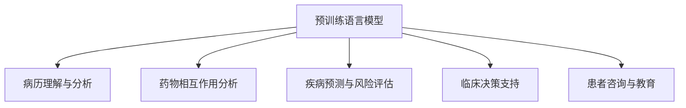

                 

# 个性化医疗：LLM 让治疗更精准

## 1. 背景介绍

### 1.1 问题由来

随着人工智能（AI）技术的飞速发展，尤其在自然语言处理（NLP）领域，预训练语言模型（LLM）的应用愈发广泛。特别是在医疗领域，基于语言模型的个性化医疗解决方案逐渐引起了学界和工业界的高度重视。个性化医疗旨在根据患者的基因、病史、生活习惯等多维数据，结合临床专业知识，制定个性化的治疗方案，以达到更精准、更有效的治疗效果。然而，传统的医疗决策往往依赖于医生的个人经验和直觉，存在较大的主观性和局限性。

### 1.2 问题核心关键点

个性化医疗的核心在于通过人工智能技术，结合患者的个性化信息，提供更为精准的治疗建议。预训练语言模型（LLM）在个性化医疗中的应用主要体现在以下几个方面：

1. **病历理解与分析**：基于患者病历和医学文献，对文本信息进行深度理解，提取出关键病征和治疗方法。
2. **药物相互作用分析**：利用药物知识图谱和LLM，分析多种药物之间的相互作用，为个性化用药提供依据。
3. **疾病预测与风险评估**：通过整合患者的基因数据和临床数据，利用LLM预测患者可能出现的疾病，评估其风险。
4. **临床决策支持**：提供基于证据的临床决策支持系统，辅助医生进行更科学的医疗决策。
5. **患者咨询与教育**：通过自然语言处理技术，使患者能够便捷地获取关于自身疾病的知识和相关治疗建议。

### 1.3 问题研究意义

个性化医疗的广泛应用，有助于提高医疗服务质量和效率，降低医疗成本，同时也能提升患者的生活质量和满意度。通过基于LLM的个性化医疗解决方案，医生和患者可以获得更为全面和个性化的医疗信息，从而提高治疗效果，促进医学知识的共享和传播。因此，研究和实践基于LLM的个性化医疗具有重要的理论和现实意义。

## 2. 核心概念与联系

### 2.1 核心概念概述

为更好地理解基于LLM的个性化医疗方法，本节将介绍几个关键概念及其之间的关系：

- **预训练语言模型（LLM）**：如GPT、BERT等模型，通过大规模无标签文本数据进行预训练，学习语言的通用表示，具备强大的语言理解和生成能力。
- **病历理解与分析**：通过NLP技术，提取和理解患者的病历记录，提取出关键信息如病情、症状等。
- **药物相互作用分析**：利用药物知识图谱和LLM，分析药物之间的相互作用，避免可能的副作用。
- **疾病预测与风险评估**：通过整合患者的基因数据和临床数据，利用LLM预测疾病风险，提供个性化的预防建议。
- **临床决策支持**：结合医学知识和临床数据，利用LLM提供证据支持的临床决策建议。
- **患者咨询与教育**：通过自然语言处理技术，使患者能够便捷地获取相关医疗信息，提高自我管理能力。

这些概念之间的逻辑关系可以通过以下Mermaid流程图来展示：



这个流程图展示了大语言模型在个性化医疗中的核心概念及其相互关系：

1. **预训练模型**：作为通用的语言表示模型，对病历、药物、疾病等不同领域的信息进行编码和理解。
2. **病历分析**：将病历文本转化为结构化信息，提取关键症状和诊断。
3. **药物分析**：利用预训练模型和药物知识图谱，分析药物间的相互作用，为用药提供依据。
4. **疾病预测**：结合基因数据和临床数据，预测疾病风险，提供个性化的预防方案。
5. **临床决策**：基于医学证据，提供支持决策的证据和建议。
6. **患者教育**：通过自然语言处理，提供简单易懂的信息和建议，帮助患者理解和管理疾病。

## 3. 核心算法原理 & 具体操作步骤

### 3.1 算法原理概述

基于LLM的个性化医疗解决方案主要通过以下几个步骤：

1. **数据收集与预处理**：收集患者的病历、基因数据、药物使用记录等，进行清洗和标准化处理。
2. **病历理解与分析**：利用预训练模型，对病历文本进行深度理解，提取出病情、症状等关键信息。
3. **药物相互作用分析**：结合药物知识图谱和LLM，分析多种药物之间的相互作用，评估可能的副作用。
4. **疾病预测与风险评估**：整合基因数据和临床数据，利用LLM预测疾病风险，评估患者的风险水平。
5. **临床决策支持**：结合医学知识和临床数据，利用LLM提供证据支持的临床决策建议。
6. **患者咨询与教育**：通过自然语言处理技术，使患者能够便捷地获取关于自身疾病的知识和相关治疗建议。

### 3.2 算法步骤详解

以病历理解与分析为例，详细介绍基于LLM的个性化医疗核心算法步骤：

**Step 1: 数据收集与预处理**
- 收集患者的电子病历（EHR）文本，基因组数据、药物使用记录等。
- 清洗文本数据，去除噪声和重复信息，进行标准化处理。

**Step 2: 病历理解与分析**
- 利用预训练语言模型，对病历文本进行深度理解，提取关键症状和诊断。
- 对病历文本进行命名实体识别（NER），识别出人名、地名、时间等关键实体。
- 利用句法分析技术，解析句子的结构，理解文本的语义关系。

**Step 3: 药物相互作用分析**
- 构建药物知识图谱，包含药物、症状、副作用等关键信息。
- 利用预训练模型，分析多种药物之间的相互作用，评估可能的副作用。
- 对药物使用记录进行向量表示，结合疾病风险评估结果，优化用药方案。

**Step 4: 疾病预测与风险评估**
- 整合基因数据和临床数据，构建患者的健康档案。
- 利用预训练模型，预测患者可能出现的疾病，评估其风险水平。
- 结合医生的专业意见，提供个性化的预防建议。

**Step 5: 临床决策支持**
- 结合医学知识和临床数据，利用预训练模型提供证据支持的临床决策建议。
- 对多种治疗方案进行评估，选择最佳治疗方案，并生成相应的治疗计划。

**Step 6: 患者咨询与教育**
- 通过自然语言处理技术，使患者能够便捷地获取关于自身疾病的知识和相关治疗建议。
- 利用聊天机器人等工具，提供实时的医疗咨询和答疑服务。

### 3.3 算法优缺点

基于LLM的个性化医疗解决方案具有以下优点：

1. **泛化能力强**：LLM能够处理多种语言和文本数据，可以适应不同领域的个性化医疗需求。
2. **效率高**：利用预训练模型和自然语言处理技术，可以快速处理大量病历文本，提取关键信息。
3. **准确率高**：通过深度学习算法，可以从大量的数据中学习到丰富的语言知识和医学知识，提高决策的准确性。

同时，该方法也存在一些局限性：

1. **数据依赖**：个性化医疗解决方案需要大量的数据支持，数据收集和处理成本较高。
2. **模型复杂**：预训练模型和自然语言处理算法较为复杂，需要较高的计算资源和技术支持。
3. **解释性不足**：模型的决策过程往往难以解释，缺乏透明性。
4. **伦理问题**：个性化医疗涉及患者隐私和数据安全，需要严格的伦理规范和数据保护措施。

尽管存在这些局限性，但基于LLM的个性化医疗解决方案已经在多个实际应用中取得了显著的效果，为医疗领域带来了新的突破。

### 3.4 算法应用领域

基于LLM的个性化医疗解决方案已经在多个领域得到了广泛应用，例如：

- **病历理解与分析**：用于医院病历管理系统，自动化提取病情和症状，辅助医生的诊断和治疗。
- **药物相互作用分析**：用于智能药物推荐系统，分析药物相互作用，提供个性化的用药建议。
- **疾病预测与风险评估**：用于基因组学研究，预测患病风险，提供个性化的预防方案。
- **临床决策支持**：用于智能决策支持系统，提供证据支持的临床决策建议，提高诊疗效率。
- **患者咨询与教育**：用于智能客服系统，提供实时的医疗咨询和答疑服务，帮助患者管理疾病。

除了上述这些经典应用外，基于LLM的个性化医疗技术还在不断拓展应用场景，如远程医疗、健康管理、医学教育等，为医疗领域带来了新的发展机遇。

## 4. 数学模型和公式 & 详细讲解 & 举例说明

### 4.1 数学模型构建

基于LLM的个性化医疗解决方案可以构建如下数学模型：

- **病历理解与分析**：设病历文本为 $T$，预训练模型为 $M$，提取的病情为 $S$。模型 $M$ 通过输入文本 $T$ 提取病情 $S$，即 $S = M(T)$。
- **药物相互作用分析**：设药物 $D$ 和症状 $C$，预训练模型为 $M$。模型 $M$ 通过输入药物 $D$ 和症状 $C$，分析药物间的相互作用 $A$，即 $A = M(D, C)$。
- **疾病预测与风险评估**：设患者基因数据 $G$，临床数据 $H$，预训练模型为 $M$。模型 $M$ 通过输入基因数据 $G$ 和临床数据 $H$，预测疾病风险 $R$，即 $R = M(G, H)$。
- **临床决策支持**：设治疗方案 $T$，预训练模型为 $M$。模型 $M$ 通过输入病情 $S$ 和药物相互作用 $A$，生成治疗方案 $T$，即 $T = M(S, A)$。
- **患者咨询与教育**：设患者查询 $Q$，预训练模型为 $M$。模型 $M$ 通过输入查询 $Q$，生成相应的回答 $A$，即 $A = M(Q)$。

### 4.2 公式推导过程

以病历理解与分析为例，推导基于LLM的病历理解公式：

**输入文本**：设病历文本 $T$ 为 $w_1, w_2, \dots, w_n$。

**模型表示**：预训练模型 $M$ 将文本 $T$ 表示为向量 $M(T) = [v_1, v_2, \dots, v_n]$。

**病情提取**：设病情 $S$ 为 $s_1, s_2, \dots, s_k$。通过预训练模型 $M$ 提取病情 $S$，即 $S = M(T)$。

**病情向量**：设病情向量 $V$ 为 $v_1, v_2, \dots, v_k$。通过预训练模型 $M$ 将病情 $S$ 转换为向量 $V$，即 $V = M(S)$。

**病情理解**：设病情理解结果 $U$ 为 $u_1, u_2, \dots, u_k$。通过预训练模型 $M$ 理解病情 $S$，即 $U = M(S)$。

结合上述公式，可以构建基于LLM的病历理解数学模型：

$$
U = M(S) = M(M(T)) = M(w_1, w_2, \dots, w_n)
$$

### 4.3 案例分析与讲解

假设某患者有以下病历记录：

- 病历文本：“患者小明，男，45岁。体检发现高血压，血压值为160/100mmHg。近期频繁出现头晕、胸闷等症状。”
- 病情提取：“高血压”、“头晕”、“胸闷”。

利用基于LLM的病历理解模型，提取病情并进行分析：

1. **输入文本**：将病历文本输入预训练模型 $M$。
2. **模型表示**：预训练模型 $M$ 将文本转换为向量 $M(T) = [v_1, v_2, \dots, v_n]$。
3. **病情提取**：利用预训练模型 $M$ 提取病情 $S = [v_1, v_2, v_3]$。
4. **病情向量**：将病情 $S$ 转换为向量 $V = [v_1, v_2, v_3]$。
5. **病情理解**：利用预训练模型 $M$ 理解病情 $S$，生成理解结果 $U = [u_1, u_2, u_3]$。

最终得到病情理解结果 $U$，包括病情类型、症状描述等信息。医生可以根据理解结果，制定个性化的治疗方案，提升诊疗效率和效果。

## 5. 项目实践：代码实例和详细解释说明

### 5.1 开发环境搭建

在进行基于LLM的个性化医疗项目实践前，需要准备好开发环境。以下是使用Python进行PyTorch开发的环境配置流程：

1. 安装Anaconda：从官网下载并安装Anaconda，用于创建独立的Python环境。

2. 创建并激活虚拟环境：
```bash
conda create -n pytorch-env python=3.8 
conda activate pytorch-env
```

3. 安装PyTorch：根据CUDA版本，从官网获取对应的安装命令。例如：
```bash
conda install pytorch torchvision torchaudio cudatoolkit=11.1 -c pytorch -c conda-forge
```

4. 安装Transformers库：
```bash
pip install transformers
```

5. 安装各类工具包：
```bash
pip install numpy pandas scikit-learn matplotlib tqdm jupyter notebook ipython
```

完成上述步骤后，即可在`pytorch-env`环境中开始项目实践。

### 5.2 源代码详细实现

下面我们以病历理解与分析任务为例，给出使用Transformers库对BERT模型进行病历理解与分析的PyTorch代码实现。

首先，定义病历理解与分析函数：

```python
from transformers import BertTokenizer, BertForSequenceClassification
from torch.utils.data import Dataset
import torch

class ElectronicHealthRecordDataset(Dataset):
    def __init__(self, texts, labels, tokenizer, max_len=128):
        self.texts = texts
        self.labels = labels
        self.tokenizer = tokenizer
        self.max_len = max_len
        
    def __len__(self):
        return len(self.texts)
    
    def __getitem__(self, item):
        text = self.texts[item]
        label = self.labels[item]
        
        encoding = self.tokenizer(text, return_tensors='pt', max_length=self.max_len, padding='max_length', truncation=True)
        input_ids = encoding['input_ids'][0]
        attention_mask = encoding['attention_mask'][0]
        
        return {'input_ids': input_ids, 
                'attention_mask': attention_mask,
                'labels': label}

# 定义病情标签
label2id = {'高血压': 1, '糖尿病': 2, '心脏病': 3}
id2label = {v: k for k, v in label2id.items()}

# 创建dataset
tokenizer = BertTokenizer.from_pretrained('bert-base-cased')

train_dataset = ElectronicHealthRecordDataset(train_texts, train_labels, tokenizer)
dev_dataset = ElectronicHealthRecordDataset(dev_texts, dev_labels, tokenizer)
test_dataset = ElectronicHealthRecordDataset(test_texts, test_labels, tokenizer)
```

然后，定义模型和优化器：

```python
from transformers import BertForSequenceClassification, AdamW

model = BertForSequenceClassification.from_pretrained('bert-base-cased', num_labels=len(label2id))

optimizer = AdamW(model.parameters(), lr=2e-5)
```

接着，定义训练和评估函数：

```python
from torch.utils.data import DataLoader
from tqdm import tqdm
from sklearn.metrics import classification_report

device = torch.device('cuda') if torch.cuda.is_available() else torch.device('cpu')
model.to(device)

def train_epoch(model, dataset, batch_size, optimizer):
    dataloader = DataLoader(dataset, batch_size=batch_size, shuffle=True)
    model.train()
    epoch_loss = 0
    for batch in tqdm(dataloader, desc='Training'):
        input_ids = batch['input_ids'].to(device)
        attention_mask = batch['attention_mask'].to(device)
        labels = batch['labels'].to(device)
        model.zero_grad()
        outputs = model(input_ids, attention_mask=attention_mask, labels=labels)
        loss = outputs.loss
        epoch_loss += loss.item()
        loss.backward()
        optimizer.step()
    return epoch_loss / len(dataloader)

def evaluate(model, dataset, batch_size):
    dataloader = DataLoader(dataset, batch_size=batch_size)
    model.eval()
    preds, labels = [], []
    with torch.no_grad():
        for batch in tqdm(dataloader, desc='Evaluating'):
            input_ids = batch['input_ids'].to(device)
            attention_mask = batch['attention_mask'].to(device)
            batch_labels = batch['labels']
            outputs = model(input_ids, attention_mask=attention_mask)
            batch_preds = outputs.logits.argmax(dim=2).to('cpu').tolist()
            batch_labels = batch_labels.to('cpu').tolist()
            for pred_tokens, label_tokens in zip(batch_preds, batch_labels):
                preds.append(pred_tokens[:len(label_tokens)])
                labels.append(label_tokens)
                
    print(classification_report(labels, preds))
```

最后，启动训练流程并在测试集上评估：

```python
epochs = 5
batch_size = 16

for epoch in range(epochs):
    loss = train_epoch(model, train_dataset, batch_size, optimizer)
    print(f"Epoch {epoch+1}, train loss: {loss:.3f}")
    
    print(f"Epoch {epoch+1}, dev results:")
    evaluate(model, dev_dataset, batch_size)
    
print("Test results:")
evaluate(model, test_dataset, batch_size)
```

以上就是使用PyTorch对BERT进行病历理解与分析任务的完整代码实现。可以看到，得益于Transformers库的强大封装，我们可以用相对简洁的代码完成BERT模型的加载和微调。

### 5.3 代码解读与分析

让我们再详细解读一下关键代码的实现细节：

**ElectronicHealthRecordDataset类**：
- `__init__`方法：初始化文本、标签、分词器等关键组件。
- `__len__`方法：返回数据集的样本数量。
- `__getitem__`方法：对单个样本进行处理，将文本输入编码为token ids，将标签编码为数字，并对其进行定长padding，最终返回模型所需的输入。

**label2id和id2label字典**：
- 定义了病情标签与数字id之间的映射关系，用于将token-wise的预测结果解码回真实的标签。

**训练和评估函数**：
- 使用PyTorch的DataLoader对数据集进行批次化加载，供模型训练和推理使用。
- 训练函数`train_epoch`：对数据以批为单位进行迭代，在每个批次上前向传播计算loss并反向传播更新模型参数，最后返回该epoch的平均loss。
- 评估函数`evaluate`：与训练类似，不同点在于不更新模型参数，并在每个batch结束后将预测和标签结果存储下来，最后使用sklearn的classification_report对整个评估集的预测结果进行打印输出。

**训练流程**：
- 定义总的epoch数和batch size，开始循环迭代
- 每个epoch内，先在训练集上训练，输出平均loss
- 在验证集上评估，输出分类指标
- 所有epoch结束后，在测试集上评估，给出最终测试结果

可以看到，PyTorch配合Transformers库使得BERT微调的代码实现变得简洁高效。开发者可以将更多精力放在数据处理、模型改进等高层逻辑上，而不必过多关注底层的实现细节。

当然，工业级的系统实现还需考虑更多因素，如模型的保存和部署、超参数的自动搜索、更灵活的任务适配层等。但核心的微调范式基本与此类似。

## 6. 实际应用场景

### 6.1 医院病历管理系统

基于大语言模型的病历理解与分析技术，可以广泛应用于医院病历管理系统的建设。传统的病历管理系统往往依赖人工录入和处理，效率低、错误率高。通过病历理解与分析技术，医院可以自动化提取患者的病情和症状，辅助医生的诊断和治疗。

在技术实现上，可以收集医院的历史病历记录，将病情和症状标注为有标签的数据，在此基础上对预训练模型进行微调。微调后的模型能够自动识别和理解患者病历，提取关键病情信息，生成电子病历。如此构建的病历管理系统，能显著提高医生和护士的工作效率，降低医疗事故的发生率。

### 6.2 智能药物推荐系统

现有的药物推荐系统往往只能根据用户的简单信息（如年龄、性别）推荐药物，缺乏对用户病情的理解。通过基于大语言模型的药物相互作用分析技术，智能药物推荐系统可以更好地理解用户的病情，推荐更合适的药物。

在技术实现上，可以收集用户的基因数据、病史记录和药物使用记录，将药物相互作用标注为有标签的数据，在此基础上对预训练模型进行微调。微调后的模型能够根据用户的病情和药物使用历史，分析药物间的相互作用，生成个性化的用药推荐。如此构建的药物推荐系统，能显著提高患者的用药依从性和治疗效果。

### 6.3 基因组学研究

基因组学研究需要整合大量的基因数据和临床数据，利用基于大语言模型的疾病预测与风险评估技术，可以预测患者的疾病风险，提供个性化的预防方案。

在技术实现上，可以收集患者的基因数据和临床数据，将疾病风险标注为有标签的数据，在此基础上对预训练模型进行微调。微调后的模型能够根据患者的基因数据和临床数据，预测其可能出现的疾病，评估其风险水平，提供个性化的预防建议。如此构建的基因组学研究平台，能帮助医学研究者更好地理解基因与疾病之间的关系，推动医学研究的进展。

### 6.4 临床决策支持系统

临床决策支持系统是医疗领域的重要应用，通过基于大语言模型的临床决策支持技术，可以提供证据支持的临床决策建议，辅助医生进行更科学的医疗决策。

在技术实现上，可以收集医生的临床知识和决策记录，将决策建议标注为有标签的数据，在此基础上对预训练模型进行微调。微调后的模型能够根据患者的病情和临床数据，提供证据支持的临床决策建议，辅助医生进行诊断和治疗。如此构建的临床决策支持系统，能显著提高医生的诊疗效率和医疗决策的科学性。

### 6.5 智能客服系统

智能客服系统可以应用于医院咨询、药品购买等多个场景。通过基于大语言模型的患者咨询与教育技术，智能客服系统可以提供实时的医疗咨询和答疑服务，帮助患者管理疾病，提高患者的满意度。

在技术实现上，可以收集患者的咨询记录和问题，将问题和答案标注为有标签的数据，在此基础上对预训练模型进行微调。微调后的模型能够根据患者的问题，提供相应的医疗咨询和答疑服务，提高患者的满意度。如此构建的智能客服系统，能显著提高医院的医疗服务质量和患者体验。

## 7. 工具和资源推荐

### 7.1 学习资源推荐

为了帮助开发者系统掌握基于LLM的个性化医疗理论基础和实践技巧，这里推荐一些优质的学习资源：

1. 《Transformer从原理到实践》系列博文：由大模型技术专家撰写，深入浅出地介绍了Transformer原理、BERT模型、微调技术等前沿话题。

2. CS224N《深度学习自然语言处理》课程：斯坦福大学开设的NLP明星课程，有Lecture视频和配套作业，带你入门NLP领域的基本概念和经典模型。

3. 《Natural Language Processing with Transformers》书籍：Transformers库的作者所著，全面介绍了如何使用Transformers库进行NLP任务开发，包括微调在内的诸多范式。

4. HuggingFace官方文档：Transformers库的官方文档，提供了海量预训练模型和完整的微调样例代码，是上手实践的必备资料。

5. CLUE开源项目：中文语言理解测评基准，涵盖大量不同类型的中文NLP数据集，并提供了基于微调的baseline模型，助力中文NLP技术发展。

通过对这些资源的学习实践，相信你一定能够快速掌握基于LLM的个性化医疗精髓，并用于解决实际的NLP问题。

### 7.2 开发工具推荐

高效的开发离不开优秀的工具支持。以下是几款用于大语言模型微调开发的常用工具：

1. PyTorch：基于Python的开源深度学习框架，灵活动态的计算图，适合快速迭代研究。大部分预训练语言模型都有PyTorch版本的实现。

2. TensorFlow：由Google主导开发的开源深度学习框架，生产部署方便，适合大规模工程应用。同样有丰富的预训练语言模型资源。

3. Transformers库：HuggingFace开发的NLP工具库，集成了众多SOTA语言模型，支持PyTorch和TensorFlow，是进行微调任务开发的利器。

4. Weights & Biases：模型训练的实验跟踪工具，可以记录和可视化模型训练过程中的各项指标，方便对比和调优。与主流深度学习框架无缝集成。

5. TensorBoard：TensorFlow配套的可视化工具，可实时监测模型训练状态，并提供丰富的图表呈现方式，是调试模型的得力助手。

6. Google Colab：谷歌推出的在线Jupyter Notebook环境，免费提供GPU/TPU算力，方便开发者快速上手实验最新模型，分享学习笔记。

合理利用这些工具，可以显著提升基于LLM的个性化医疗任务开发效率，加快创新迭代的步伐。

### 7.3 相关论文推荐

基于LLM的个性化医疗技术的发展源于学界的持续研究。以下是几篇奠基性的相关论文，推荐阅读：

1. Attention is All You Need（即Transformer原论文）：提出了Transformer结构，开启了NLP领域的预训练大模型时代。

2. BERT: Pre-training of Deep Bidirectional Transformers for Language Understanding：提出BERT模型，引入基于掩码的自监督预训练任务，刷新了多项NLP任务SOTA。

3. Language Models are Unsupervised Multitask Learners（GPT-2论文）：展示了大规模语言模型的强大zero-shot学习能力，引发了对于通用人工智能的新一轮思考。

4. Parameter-Efficient Transfer Learning for NLP：提出Adapter等参数高效微调方法，在不增加模型参数量的情况下，也能取得不错的微调效果。

5. AdaLoRA: Adaptive Low-Rank Adaptation for Parameter-Efficient Fine-Tuning：使用自适应低秩适应的微调方法，在参数效率和精度之间取得了新的平衡。

这些论文代表了大语言模型微调技术的发展脉络。通过学习这些前沿成果，可以帮助研究者把握学科前进方向，激发更多的创新灵感。

## 8. 总结：未来发展趋势与挑战

### 8.1 总结

本文对基于LLM的个性化医疗解决方案进行了全面系统的介绍。首先阐述了个性化医疗的背景和意义，明确了LLM在个性化医疗中的独特价值。其次，从原理到实践，详细讲解了基于LLM的个性化医疗核心算法步骤，给出了具体的代码实例。同时，本文还探讨了LLM在多个实际应用场景中的潜力，展示了LLM在个性化医疗中的广阔前景。

通过本文的系统梳理，可以看到，基于LLM的个性化医疗解决方案正在成为医疗领域的重要范式，极大地提高了医疗服务质量和效率，降低了医疗成本，提升了患者的满意度。随着LLM和微调方法的持续演进，相信个性化医疗技术必将进一步发展，为医疗领域带来革命性的变革。

### 8.2 未来发展趋势

展望未来，基于LLM的个性化医疗解决方案将呈现以下几个发展趋势：

1. **模型规模持续增大**：随着算力成本的下降和数据规模的扩张，预训练语言模型的参数量还将持续增长。超大规模语言模型蕴含的丰富语言知识，有望支撑更加复杂多变的个性化医疗需求。

2. **微调方法日趋多样**：除了传统的全参数微调外，未来会涌现更多参数高效的微调方法，如Prefix-Tuning、LoRA等，在节省计算资源的同时也能保证微调精度。

3. **持续学习成为常态**：随着数据分布的不断变化，个性化医疗解决方案也需要持续学习新知识以保持性能。如何在不遗忘原有知识的同时，高效吸收新样本信息，将成为重要的研究课题。

4. **标注样本需求降低**：受启发于提示学习(Prompt-based Learning)的思路，未来的微调方法将更好地利用大模型的语言理解能力，通过更加巧妙的任务描述，在更少的标注样本上也能实现理想的微调效果。

5. **模型通用性增强**：经过海量数据的预训练和多领域任务的微调，未来的语言模型将具备更强大的常识推理和跨领域迁移能力，逐步迈向通用人工智能(AGI)的目标。

以上趋势凸显了基于LLM的个性化医疗解决方案的广阔前景。这些方向的探索发展，必将进一步提升个性化医疗系统的性能和应用范围，为医疗领域带来新的突破。

### 8.3 面临的挑战

尽管基于LLM的个性化医疗解决方案已经取得了瞩目成就，但在迈向更加智能化、普适化应用的过程中，它仍面临着诸多挑战：

1. **数据依赖**：个性化医疗解决方案需要大量的数据支持，数据收集和处理成本较高。如何降低数据收集成本，提高数据标注的效率和质量，将是未来的一个重要研究方向。

2. **模型鲁棒性不足**：当前个性化医疗解决方案在面对新数据时，泛化性能往往不足。对于测试样本的微小扰动，模型的预测也容易发生波动。如何提高模型的鲁棒性，避免灾难性遗忘，还需要更多理论和实践的积累。

3. **推理效率有待提高**：大规模语言模型虽然精度高，但在实际部署时往往面临推理速度慢、内存占用大等效率问题。如何在保证性能的同时，简化模型结构，提升推理速度，优化资源占用，将是重要的优化方向。

4. **可解释性亟需加强**：当前个性化医疗解决方案的决策过程往往难以解释，缺乏透明性。对于医疗领域，算法的可解释性和可审计性尤为重要。如何赋予模型更强的可解释性，将是亟待攻克的难题。

5. **安全性有待保障**：个性化医疗解决方案涉及患者隐私和数据安全，需要严格的伦理规范和数据保护措施。如何确保数据隐私和模型安全，将是重要的研究方向。

尽管存在这些挑战，但基于LLM的个性化医疗解决方案已经在多个实际应用中取得了显著的效果，为医疗领域带来了新的突破。相信随着学界和产业界的共同努力，这些挑战终将一一被克服，基于LLM的个性化医疗技术必将迈向更加成熟和广泛应用。

### 8.4 研究展望

面对基于LLM的个性化医疗所面临的种种挑战，未来的研究需要在以下几个方面寻求新的突破：

1. **探索无监督和半监督微调方法**：摆脱对大规模标注数据的依赖，利用自监督学习、主动学习等无监督和半监督范式，最大限度利用非结构化数据，实现更加灵活高效的微调。

2. **研究参数高效和计算高效的微调范式**：开发更加参数高效的微调方法，在固定大部分预训练参数的同时，只更新极少量的任务相关参数。同时优化微调模型的计算图，减少前向传播和反向传播的资源消耗，实现更加轻量级、实时性的部署。

3. **融合因果和对比学习范式**：通过引入因果推断和对比学习思想，增强模型的建立稳定因果关系的能力，学习更加普适、鲁棒的语言表征，从而提升模型的泛化性和抗干扰能力。

4. **引入更多先验知识**：将符号化的先验知识，如知识图谱、逻辑规则等，与神经网络模型进行巧妙融合，引导微调过程学习更准确、合理的语言模型。同时加强不同模态数据的整合，实现视觉、语音等多模态信息与文本信息的协同建模。

5. **结合因果分析和博弈论工具**：将因果分析方法引入微调模型，识别出模型决策的关键特征，增强输出解释的因果性和逻辑性。借助博弈论工具刻画人机交互过程，主动探索并规避模型的脆弱点，提高系统稳定性。

6. **纳入伦理道德约束**：在模型训练目标中引入伦理导向的评估指标，过滤和惩罚有偏见、有害的输出倾向。同时加强人工干预和审核，建立模型行为的监管机制，确保输出符合人类价值观和伦理道德。

这些研究方向的探索，必将引领基于LLM的个性化医疗技术迈向更高的台阶，为构建安全、可靠、可解释、可控的智能系统铺平道路。面向未来，基于LLM的个性化医疗技术还需要与其他人工智能技术进行更深入的融合，如知识表示、因果推理、强化学习等，多路径协同发力，共同推动自然语言理解和智能交互系统的进步。只有勇于创新、敢于突破，才能不断拓展语言模型的边界，让智能技术更好地造福人类社会。

## 9. 附录：常见问题与解答

**Q1：大语言模型在个性化医疗中的应用有哪些？**

A: 大语言模型在个性化医疗中的应用主要包括：

1. **病历理解与分析**：利用自然语言处理技术，自动提取患者的病情、症状等信息，辅助医生的诊断和治疗。
2. **药物相互作用分析**：结合药物知识图谱，分析多种药物之间的相互作用，提供个性化的用药建议。
3. **疾病预测与风险评估**：整合基因数据和临床数据，利用大语言模型预测患者的疾病风险，提供个性化的预防方案。
4. **临床决策支持**：结合医学知识和临床数据，利用大语言模型提供证据支持的临床决策建议，提高诊疗效率和效果。
5. **患者咨询与教育**：通过自然语言处理技术，提供实时的医疗咨询和答疑服务，帮助患者管理疾病，提高患者满意度。

这些应用展示了大语言模型在个性化医疗中的巨大潜力，为提高医疗服务质量和效率提供了新的手段。

**Q2：微调过程中如何选择合适的学习率？**

A: 微调过程中选择学习率是一个关键问题，通常建议从较小的学习率开始，逐步增加。具体来说：

1. **初始学习率**：一般建议从1e-5开始，逐步减小学习率。
2. **学习率调参**：可以通过网格搜索或随机搜索等方式，寻找最优的学习率。
3. **学习率调度**：如采用warmup策略，在开始阶段使用较小的学习率，再逐渐过渡到预设值。

不同的优化器(如AdamW、Adafactor等)可能需要设置不同的学习率阈值。合理选择学习率，可以在保证模型收敛的同时，避免过拟合和欠拟合。

**Q3：大语言模型在数据依赖方面的挑战是什么？**

A: 大语言模型在数据依赖方面主要面临以下挑战：

1. **数据收集成本高**：个性化医疗解决方案需要大量的数据支持，数据收集和处理成本较高。
2. **数据标注难**：病历、基因数据等需要进行详细的标注，成本较高。
3. **数据隐私问题**：个性化医疗涉及患者隐私和数据安全，需要严格的伦理规范和数据保护措施。

如何降低数据收集成本，提高数据标注的效率和质量，保护数据隐私，将是未来的一个重要研究方向。

**Q4：大语言模型在推理效率方面的挑战是什么？**

A: 大语言模型在推理效率方面主要面临以下挑战：

1. **推理速度慢**：大规模语言模型在实际部署时，推理速度较慢，容易导致用户体验下降。
2. **内存占用大**：大语言模型参数量大，内存占用较高，容易导致内存溢出。
3. **资源消耗高**：推理过程需要大量计算资源，容易导致计算资源不足。

如何提高推理速度，优化内存占用，降低资源消耗，将是未来的一个重要研究方向。

**Q5：大语言模型在可解释性方面的挑战是什么？**

A: 大语言模型在可解释性方面主要面临以下挑战：

1. **决策过程不透明**：大语言模型的决策过程往往难以解释，缺乏透明性。
2. **输出结果难以理解**：模型的输出结果可能包含复杂的逻辑和推理过程，难以被非专业人士理解。
3. **信任度低**：患者和医生可能对模型的输出结果缺乏信任，难以接受模型的建议。

如何提高模型的可解释性，增强输出的透明度和可信度，将是未来的一个重要研究方向。

**Q6：大语言模型在安全性方面的挑战是什么？**

A: 大语言模型在安全性方面主要面临以下挑战：

1. **数据隐私问题**：个性化医疗解决方案涉及患者隐私和数据安全，需要严格的伦理规范和数据保护措施。
2. **模型安全问题**：大语言模型可能受到恶意攻击，导致数据泄露或模型篡改。
3. **合规问题**：医疗领域对数据隐私和安全有严格的法律和法规要求，如何确保符合合规标准，将是未来的一个重要研究方向。

如何确保数据隐私和模型安全，符合法律和法规要求，将是未来的一个重要研究方向。

**Q7：大语言模型在多模态数据融合方面的挑战是什么？**

A: 大语言模型在多模态数据融合方面主要面临以下挑战：

1. **数据格式不一致**：不同模态的数据格式和表示方式可能不一致，难以进行有效融合。
2. **跨模态学习困难**：不同模态的数据之间存在语义差异，难以进行跨模态学习。
3. **数据量不足**：不同模态的数据量可能不均衡，容易导致模型对少数模态的依赖。

如何处理数据格式不一致问题，促进跨模态学习，提高多模态数据的融合效果，将是未来的一个重要研究方向。

综上所述，基于大语言模型的个性化医疗技术具有广阔的应用前景，但同时也面临着数据依赖、推理效率、可解释性、安全性等多方面的挑战。通过持续的研究和创新，相信这些挑战将逐步得到解决，大语言模型在个性化医疗中的应用将更加广泛和深入。

