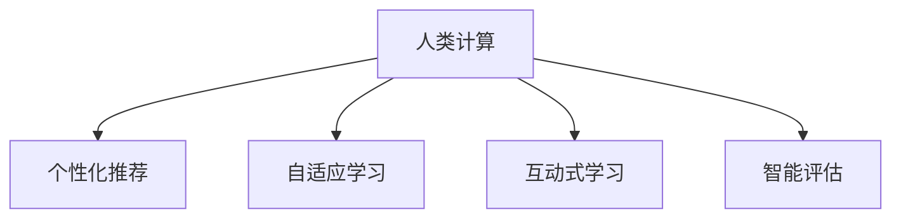

                 

# 个性化教育：利用人类计算打造定制化学习体验

## 1. 背景介绍

### 1.1 问题由来

教育是一个永恒的主题，其本质是传播知识、培养能力、塑造人格。传统的教育模式以教师为中心，采用“一刀切”的教学方法，无法充分照顾到每个学生的个体差异和需求。随着科技的进步，个性化教育开始成为热点，通过精准的数据分析和算法优化，为每个学生提供量身定制的学习路径和资源，从而最大化教育效果和学生体验。

### 1.2 问题核心关键点

个性化教育的核心在于如何利用先进的数据技术，准确把握学生的学习状态和需求，并据此动态调整教学内容和策略。目前，个性化教育主要依赖以下关键技术：

- 人类计算：利用数据分析和算法模型，对海量教育数据进行挖掘和建模，洞察学生的学习规律和个体差异。
- 个性化推荐：根据学生的学习历史和偏好，推荐最合适的内容和路径，实现因材施教。
- 自适应学习：动态调整教学难度和节奏，保持学生处于最佳的学习状态。
- 互动式学习：引入互动元素，提升学生的参与感和学习效果。
- 智能评估：及时反馈学习成果，动态调整学习策略。

这些技术协同工作，使得个性化教育成为可能，为每个学生提供定制化的学习体验，从而提升学习效果和满意度。

## 2. 核心概念与联系

### 2.1 核心概念概述

为更好地理解个性化教育的核心技术，本节将介绍几个密切相关的核心概念：

- 人类计算(Human Computation)：利用人类智慧和技术工具，对海量数据进行自动化分析处理，发现潜在的模式和规律。人类计算在大数据、复杂系统等领域有着广泛应用，尤其在教育领域，通过计算教学、学习分析等方式，为个性化教育提供强有力的支持。

- 个性化推荐(Recommendation System)：基于用户的偏好和行为数据，推荐最相关的内容和路径，帮助用户实现个性化定制。在教育领域，个性化推荐可以用于推荐适合学生水平的学习内容、辅助工具等。

- 自适应学习(Adaptive Learning)：根据学生的学习表现和反馈，动态调整教学内容和策略，使学生始终处于最佳的学习状态。自适应学习结合了人工智能、认知科学等领域的成果，是实现个性化教育的重要手段。

- 互动式学习(Interactive Learning)：通过游戏化、社交化等方式，提升学生的参与感和学习效果。互动式学习使得教育更加生动有趣，有利于激发学生的学习兴趣。

- 智能评估(Intelligent Assessment)：利用机器学习、自然语言处理等技术，自动评估学生的学习成果，及时反馈改进建议。智能评估使得教学和评估更加高效和精准。

这些核心概念之间的逻辑关系可以通过以下Mermaid流程图来展示：



这个流程图展示了个性化教育的核心概念及其之间的关系：

1. 人类计算通过分析教育数据，提供个性化的推荐、学习、互动、评估等建议。
2. 个性化推荐帮助学生选择最合适的学习内容，自适应学习则根据学生的学习表现调整教学策略。
3. 互动式学习提升学生参与感，智能评估则提供及时的学习反馈和改进建议。

这些概念共同构成了个性化教育的体系框架，使得教育过程更加灵活、高效和个性化。

## 3. 核心算法原理 & 具体操作步骤
### 3.1 算法原理概述

个性化教育的核心算法原理在于利用人类计算技术，对教育数据进行深度分析，洞察学生学习行为和效果，并据此提供个性化的推荐、评估和教学策略。算法流程主要包括以下几个步骤：

1. 数据收集：从多种来源收集学生的学习数据，如学习行为、作业成绩、考试结果等。
2. 数据分析：利用机器学习、统计分析等方法，提取学生的学习模式和需求。
3. 个性化推荐：基于分析结果，推荐最适合学生的学习路径和资源。
4. 自适应学习：根据学生的学习反馈，动态调整教学内容和策略。
5. 互动式学习：引入游戏化、社交化等互动元素，提升学习效果。
6. 智能评估：利用自动评估技术，实时反馈学生的学习成果和改进建议。

整个算法流程形成了一个动态反馈系统，不断优化学生的学习体验。

### 3.2 算法步骤详解

个性化教育的具体算法步骤如下：

**Step 1: 数据收集和预处理**
- 收集学生的学习数据，如学习时间、完成作业时间、考试成绩等。
- 对数据进行清洗、归一化、去噪等预处理，确保数据的质量和可用性。

**Step 2: 特征提取和建模**
- 利用特征工程方法，从原始数据中提取有用的特征，如学习时长、答题准确率、学习频率等。
- 选择合适的机器学习模型（如决策树、随机森林、深度学习等）对数据进行建模，挖掘学生的学习规律和个体差异。

**Step 3: 个性化推荐**
- 根据学生的学习数据，构建学生画像，包括兴趣、能力、需求等信息。
- 设计推荐算法，如协同过滤、基于内容的推荐、基于规则的推荐等，为学生推荐最适合的学习资源和路径。

**Step 4: 自适应学习**
- 根据学生的学习表现和反馈，动态调整教学内容和策略。
- 设计自适应算法，如基于规则的调整、基于机器学习的调整、基于贝叶斯网络的调整等，确保学生始终处于最佳的学习状态。

**Step 5: 互动式学习**
- 引入互动元素，如游戏化学习、虚拟实验室、社交化学习等，提升学生的参与感和学习效果。
- 设计互动算法，如自然语言处理、情感分析、行为跟踪等，实时感知学生的学习状态和需求。

**Step 6: 智能评估**
- 利用机器学习、自然语言处理等技术，自动评估学生的学习成果，如自动批改作业、自动生成考试题等。
- 设计评估算法，如基于规则的评估、基于模型的评估、基于强化学习的评估等，提供及时的学习反馈和改进建议。

### 3.3 算法优缺点

个性化教育的算法具有以下优点：

1. 个性化和针对性：通过深度数据分析，了解每个学生的特点和需求，提供量身定制的学习路径和资源。
2. 高效和便捷：自动化的数据处理和分析，减少了教师的工作负担，提高了教学效率。
3. 提升学习效果：互动式学习和自适应学习增强了学生的参与感和学习效果，智能评估提供了及时的学习反馈和改进建议。

同时，这些算法也存在一些局限性：

1. 数据隐私和安全：个性化教育需要收集和处理大量学生数据，存在隐私泄露和数据安全问题。
2. 模型偏差和公平性：基于数据的个性化推荐和评估可能存在偏见，无法完全保证公平性。
3. 资源需求高：算法模型的训练和应用需要高性能计算资源，难以在资源有限的条件下推广应用。
4. 复杂度高：算法模型需要持续优化和调整，才能保证其稳定性和准确性。

尽管存在这些局限性，但就目前而言，个性化教育的算法技术仍具有重要的理论和实践价值。未来相关研究将致力于解决这些问题，提升算法的可解释性、公平性和可扩展性。

### 3.4 算法应用领域

个性化教育的核心算法在多个领域得到了广泛应用，例如：

- 自适应学习系统：根据学生的学习表现和反馈，动态调整教学内容和策略。如Knewton、Smart Sparrow等系统。
- 学习管理系统(LMS)：提供个性化推荐和智能评估功能，提升教学和学习效率。如Moodle、Edmodo等平台。
- 智能辅导系统：利用机器学习技术，提供个性化的学习辅导和答疑。如Duolingo、Quizlet等应用。
- 游戏化学习系统：通过游戏化的方式，提升学生的参与感和学习效果。如Khan Academy、Scratch等平台。
- 虚拟实验室：利用虚拟现实技术，为学生提供丰富的实验场景，提升实验教学效果。如PhET Interactive Simulations等工具。

除了上述这些典型应用外，个性化教育算法还被创新性地应用到更多场景中，如学习路径规划、作业生成、兴趣培养等，为教育技术的创新发展提供了新的动力。

## 4. 数学模型和公式 & 详细讲解 & 举例说明

### 4.1 数学模型构建

本节将使用数学语言对个性化教育的核心算法进行更加严格的刻画。

记学生的学习数据为 $\mathcal{D}=\{(x_i, y_i)\}_{i=1}^N$，其中 $x_i$ 为学生 $i$ 的学习数据，$y_i$ 为学生的学习效果（如成绩、完成时间等）。

定义学生画像为 $\mathcal{P}$，其中包含学生的兴趣、能力、需求等信息。

个性化推荐模型的目标是找到映射函数 $f(\mathcal{P}, \mathcal{D})$，使得：

$$
\hat{y}_i = f(\mathcal{P}, \mathcal{D})
$$

其中 $\hat{y}_i$ 为学生 $i$ 的推荐学习内容。

自适应学习模型的目标是在教学过程中动态调整教学策略，使得学生的学习效果最大化。可以定义一个自适应函数 $g(\mathcal{P}, \mathcal{D}, t)$，其中 $t$ 为学习时间，目标函数为：

$$
\max_{t} f(\mathcal{P}, \mathcal{D}, t)
$$

互动式学习模型的目标是通过互动元素提升学生的学习效果，可以定义互动函数 $h(\mathcal{P}, \mathcal{D}, t)$，使得：

$$
\max_{t} f(\mathcal{P}, \mathcal{D}, t) + h(\mathcal{P}, \mathcal{D}, t)
$$

智能评估模型的目标是自动评估学生的学习成果，可以定义评估函数 $e(\mathcal{P}, \mathcal{D}, t)$，使得：

$$
\max_{t} e(\mathcal{P}, \mathcal{D}, t)
$$

### 4.2 公式推导过程

以下我们以推荐系统为例，推导个性化推荐模型的构建和评估公式。

假设推荐系统的训练集为 $\mathcal{D}=\{(x_i, y_i)\}_{i=1}^N$，其中 $x_i$ 为学生 $i$ 的学习数据，$y_i$ 为推荐的学习内容。

定义推荐模型为 $M_{\theta}$，其中 $\theta$ 为模型参数。推荐模型的目标是最小化预测错误率，即：

$$
\min_{\theta} \frac{1}{N} \sum_{i=1}^N \ell(M_{\theta}(x_i), y_i)
$$

其中 $\ell$ 为损失函数，通常选择交叉熵损失。

根据链式法则，损失函数对参数 $\theta$ 的梯度为：

$$
\frac{\partial \ell(M_{\theta}(x_i), y_i)}{\partial \theta} = -\frac{1}{N} \sum_{i=1}^N \frac{\partial \ell(M_{\theta}(x_i), y_i)}{\partial M_{\theta}(x_i)} \frac{\partial M_{\theta}(x_i)}{\partial \theta}
$$

其中 $\frac{\partial M_{\theta}(x_i)}{\partial \theta}$ 可进一步递归展开，利用自动微分技术完成计算。

在得到损失函数的梯度后，即可带入参数更新公式，完成模型的迭代优化。重复上述过程直至收敛，最终得到适应推荐任务的最优模型参数 $\theta^*$。

## 5. 项目实践：代码实例和详细解释说明
### 5.1 开发环境搭建

在进行个性化教育项目开发前，我们需要准备好开发环境。以下是使用Python进行PyTorch开发的环境配置流程：

1. 安装Anaconda：从官网下载并安装Anaconda，用于创建独立的Python环境。

2. 创建并激活虚拟环境：
```bash
conda create -n pytorch-env python=3.8 
conda activate pytorch-env
```

3. 安装PyTorch：根据CUDA版本，从官网获取对应的安装命令。例如：
```bash
conda install pytorch torchvision torchaudio cudatoolkit=11.1 -c pytorch -c conda-forge
```

4. 安装TensorFlow：
```bash
conda install tensorflow -c conda-forge
```

5. 安装Pandas和Scikit-Learn等工具包：
```bash
pip install pandas scikit-learn matplotlib tqdm jupyter notebook ipython
```

完成上述步骤后，即可在`pytorch-env`环境中开始开发。

### 5.2 源代码详细实现

下面以一个简单的推荐系统为例，给出使用PyTorch进行个性化推荐开发的代码实现。

首先，定义推荐系统的数据处理函数：

```python
import pandas as pd
import numpy as np

def load_data(filename):
    data = pd.read_csv(filename)
    data = data.dropna()
    data = data.drop_duplicates()
    return data

def preprocess_data(data):
    data['time'] = pd.to_datetime(data['time']).astype('timedelta64[ns]')
    data['time'] = data['time'].dt.total_seconds()
    data['time'] = data['time'].astype('float32')
    data['time'] = (data['time'] - data['time'].mean()) / data['time'].std()
    data['time'] = (data['time'] - 5) / 10
    data['time'] = data['time'].clip(-5, 5)
    return data

data = load_data('data.csv')
data = preprocess_data(data)
```

然后，定义推荐模型和优化器：

```python
from torch.utils.data import Dataset, DataLoader
from torch import nn, optim

class RecommendationDataset(Dataset):
    def __init__(self, data):
        self.data = data

    def __len__(self):
        return len(self.data)

    def __getitem__(self, idx):
        return self.data.iloc[idx, :]

class RecommendationModel(nn.Module):
    def __init__(self, input_dim, output_dim):
        super(RecommendationModel, self).__init__()
        self.fc1 = nn.Linear(input_dim, 128)
        self.fc2 = nn.Linear(128, output_dim)

    def forward(self, x):
        x = self.fc1(x)
        x = nn.functional.relu(x)
        x = self.fc2(x)
        return x

# 假设学习率为0.001，批大小为32
model = RecommendationModel(input_dim=10, output_dim=1)
optimizer = optim.Adam(model.parameters(), lr=0.001)
```

接着，定义训练和评估函数：

```python
from sklearn.metrics import mean_squared_error

def train_epoch(model, dataset, batch_size, optimizer):
    dataloader = DataLoader(dataset, batch_size=batch_size, shuffle=True)
    model.train()
    epoch_loss = 0
    for batch in dataloader:
        optimizer.zero_grad()
        outputs = model(batch)
        loss = nn.functional.mse_loss(outputs, batch[:, 1])
        epoch_loss += loss.item()
        loss.backward()
        optimizer.step()
    return epoch_loss / len(dataloader)

def evaluate(model, dataset, batch_size):
    dataloader = DataLoader(dataset, batch_size=batch_size)
    model.eval()
    preds = []
    labels = []
    with torch.no_grad():
        for batch in dataloader:
            outputs = model(batch)
            preds.append(outputs.detach().numpy())
            labels.append(batch[:, 1].detach().numpy())
    mse = mean_squared_error(labels, preds)
    return mse
```

最后，启动训练流程并在测试集上评估：

```python
epochs = 10
batch_size = 32

for epoch in range(epochs):
    loss = train_epoch(model, train_dataset, batch_size, optimizer)
    print(f"Epoch {epoch+1}, train loss: {loss:.3f}")
    
    print(f"Epoch {epoch+1}, test mse: {evaluate(model, test_dataset, batch_size)}")
    
print("Training completed.")
```

以上就是使用PyTorch对推荐系统进行个性化教育开发的完整代码实现。可以看到，得益于PyTorch的强大封装，推荐系统的构建和训练变得简洁高效。

### 5.3 代码解读与分析

让我们再详细解读一下关键代码的实现细节：

**RecommendationDataset类**：
- `__init__`方法：初始化数据集。
- `__len__`方法：返回数据集的样本数量。
- `__getitem__`方法：返回数据集中指定索引的数据行。

**RecommendationModel类**：
- `__init__`方法：初始化模型，定义了两层全连接神经网络。
- `forward`方法：定义前向传播过程，先经过一个全连接层，再经过一个线性层输出预测结果。

**train_epoch函数**：
- 使用DataLoader对数据集进行批次化加载，供模型训练使用。
- 在每个批次上前向传播计算loss并反向传播更新模型参数。

**evaluate函数**：
- 与训练类似，不同点在于不更新模型参数，在每个batch结束后将预测和标签结果存储下来，最后使用sklearn的mse方法对整个测试集的预测结果进行评估。

**训练流程**：
- 定义总的epoch数和batch size，开始循环迭代。
- 每个epoch内，先在训练集上训练，输出平均loss。
- 在验证集上评估，输出测试mse。
- 所有epoch结束后，结束训练并输出结果。

可以看到，PyTorch配合TensorFlow等工具，使得推荐系统的代码实现变得简洁高效。开发者可以将更多精力放在数据处理、模型改进等高层逻辑上，而不必过多关注底层的实现细节。

当然，工业级的系统实现还需考虑更多因素，如模型的保存和部署、超参数的自动搜索、更灵活的任务适配层等。但核心的推荐范式基本与此类似。

## 6. 实际应用场景
### 6.1 自适应学习系统

自适应学习系统是个性化教育的核心应用之一，能够根据学生的学习表现和反馈，动态调整教学内容和策略。

以Knewton系统为例，该系统能够根据学生的学习数据，动态调整课程难度、时间分配和教学资源。系统通过对学生的学习行为进行分析，识别出学生的薄弱环节，然后提供针对性的学习路径和资源。学生在学习过程中可以实时反馈，系统根据反馈调整教学策略，确保学生始终处于最佳的学习状态。

### 6.2 学习管理系统(LMS)

学习管理系统(LMS)是另一种常见的个性化教育应用，提供个性化推荐和智能评估功能，提升教学和学习效率。

如Moodle平台，该系统不仅支持传统的课程管理和在线学习，还提供个性化的推荐系统，根据学生的学习历史和偏好，推荐最适合的学习资源和路径。系统还可以自动评估学生的学习成果，如自动批改作业、自动生成考试题等，提供及时的学习反馈和改进建议。

### 6.3 智能辅导系统

智能辅导系统利用机器学习技术，提供个性化的学习辅导和答疑，帮助学生解决学习中的疑难问题。

如Duolingo应用，该系统利用机器学习技术，根据学生的学习进度和错误率，推荐最适合的语言练习和辅导。系统还利用自然语言处理技术，提供实时答疑服务，帮助学生解决学习中的问题。

### 6.4 游戏化学习系统

游戏化学习系统通过引入游戏化的方式，提升学生的参与感和学习效果。

如Khan Academy平台，该系统通过游戏化的方式，将学习内容融入游戏中，增强学生的学习兴趣。系统还可以通过游戏积分、排行榜等方式，激励学生积极学习，提升学习效果。

### 6.5 虚拟实验室

虚拟实验室利用虚拟现实技术，为学生提供丰富的实验场景，提升实验教学效果。

如PhET Interactive Simulations工具，该系统提供多种虚拟实验，学生可以在虚拟环境中进行实验操作，提升实验技能和理解力。系统还支持学生进行实验数据记录和分析，帮助学生更好地理解实验原理和结果。

## 7. 工具和资源推荐
### 7.1 学习资源推荐

为了帮助开发者系统掌握个性化教育的核心技术，这里推荐一些优质的学习资源：

1. 《机器学习》书籍：经典机器学习教材，全面介绍了机器学习的基本概念和算法。

2. 《深度学习》课程：斯坦福大学深度学习课程，涵盖深度学习的基本概念、神经网络、优化算法等。

3. 《自然语言处理》课程：斯坦福大学自然语言处理课程，介绍了自然语言处理的基本概念、文本表示、序列建模等。

4. Kaggle数据集：Kaggle提供海量教育数据集，用于数据处理、建模和评估。

5. TensorFlow官方文档：TensorFlow官方文档，提供了丰富的机器学习工具和样例代码，方便学习和应用。

通过这些学习资源，相信你一定能够快速掌握个性化教育的理论基础和实践技巧，为实际应用提供有力的支持。

### 7.2 开发工具推荐

高效的开发离不开优秀的工具支持。以下是几款用于个性化教育开发的常用工具：

1. PyTorch：基于Python的开源深度学习框架，灵活动态的计算图，适合快速迭代研究。大部分个性化教育应用都有PyTorch版本的实现。

2. TensorFlow：由Google主导开发的开源深度学习框架，生产部署方便，适合大规模工程应用。

3. Pandas：数据处理和分析工具，提供了丰富的数据清洗、统计分析功能。

4. Scikit-Learn：机器学习库，提供了多种常用的机器学习算法和工具。

5. Jupyter Notebook：交互式开发环境，支持代码编写、数据可视化、模型评估等多种功能。

6. Weights & Biases：模型训练的实验跟踪工具，可以记录和可视化模型训练过程中的各项指标，方便对比和调优。

合理利用这些工具，可以显著提升个性化教育应用的开发效率，加快创新迭代的步伐。

### 7.3 相关论文推荐

个性化教育技术的发展源于学界的持续研究。以下是几篇奠基性的相关论文，推荐阅读：

1. Human Computation: Foundations, Frontiers, and Future Directions：综述性论文，全面介绍了人类计算的研究方向和应用场景。

2. Recommender Systems Handbook：推荐系统经典教材，涵盖推荐算法的理论基础和实践技巧。

3. Adaptive Learning Systems: Learning in the Presence of Diverse Learners and Resources：综述性论文，介绍了自适应学习的研究方向和应用场景。

4. Interactive Learning Environments: A Survey of Recent Developments：综述性论文，介绍了互动式学习的研究方向和应用场景。

5. Intelligent Tutoring Systems: A Historical Review：综述性论文，介绍了智能辅导系统的发展历程和前沿技术。

这些论文代表了大数据教育技术的发展脉络。通过学习这些前沿成果，可以帮助研究者把握学科前进方向，激发更多的创新灵感。

## 8. 总结：未来发展趋势与挑战

### 8.1 总结

本文对个性化教育的核心算法进行了全面系统的介绍。首先阐述了个性化教育的背景和重要性，明确了算法在教育数据处理、推荐、自适应、互动、评估等方面的关键作用。其次，从原理到实践，详细讲解了推荐系统、自适应学习、互动式学习、智能评估等核心算法的构建和应用。最后，本文还广泛探讨了个性化教育在实际应用中的多种场景，展示了其广阔的应用前景。

通过本文的系统梳理，可以看到，个性化教育的核心算法正在成为教育技术的重要范式，为每个学生提供量身定制的学习体验，从而提升学习效果和满意度。未来，伴随技术的持续演进，个性化教育必将在教育领域得到更广泛的应用，为人类认知智能的进化带来深远影响。

### 8.2 未来发展趋势

展望未来，个性化教育的核心算法将呈现以下几个发展趋势：

1. 数据驱动和自适应：利用海量教育数据，挖掘学生的学习模式和个体差异，实现更加精准和个性化的推荐和自适应。

2. 多模态融合：结合视觉、听觉、文本等多模态数据，提供更加全面和生动化的学习体验。

3. 知识图谱整合：将知识图谱和常识推理与个性化教育算法结合，提升知识的整合和应用能力。

4. 自动化和智能化：利用人工智能技术，自动化数据处理、推荐和评估，减少人工干预，提升系统效率。

5. 游戏化互动：引入游戏化、社交化等互动元素，提升学生的参与感和学习效果。

6. 实时评估和反馈：利用自然语言处理和计算机视觉技术，实现实时评估和反馈，提升学习效果。

这些趋势凸显了个性化教育算法的广阔前景，为构建智能、高效、个性化的学习系统提供了新的方向和思路。

### 8.3 面临的挑战

尽管个性化教育算法已经取得了一定的进展，但在迈向更加智能化、普适化应用的过程中，它仍面临诸多挑战：

1. 数据隐私和安全：个性化教育需要收集和处理大量学生数据，存在隐私泄露和数据安全问题。如何保护数据隐私，确保数据安全，将是未来研究的重要课题。

2. 模型偏见和公平性：个性化教育算法可能存在偏见，无法完全保证公平性。如何构建无偏见的推荐系统，确保公平性，需要更多的研究。

3. 资源需求高：算法模型的训练和应用需要高性能计算资源，难以在资源有限的条件下推广应用。如何优化算法模型，降低资源需求，是未来的研究方向。

4. 可解释性不足：个性化教育算法通常是“黑盒”系统，难以解释其内部工作机制和决策逻辑。如何赋予算法更强的可解释性，提升系统透明度，需要更多的研究。

5. 安全性有待保障：个性化教育算法可能学习到有偏见、有害的信息，传递到下游任务，产生误导性、歧视性的输出，给实际应用带来安全隐患。如何从数据和算法层面消除模型偏见，避免恶意用途，确保输出安全性，将是重要的研究课题。

6. 知识整合能力不足：现有的个性化教育算法局限于数据驱动，难以灵活吸收和运用更广泛的先验知识。如何让算法更好地整合知识图谱、逻辑规则等专家知识，提升信息整合能力，还有很大的想象空间。

正视个性化教育面临的这些挑战，积极应对并寻求突破，将是个性化教育技术走向成熟的关键。相信随着学界和产业界的共同努力，这些挑战终将一一被克服，个性化教育必将在教育领域得到更广泛的应用，为人类认知智能的进化带来深远影响。

### 8.4 研究展望

面对个性化教育面临的种种挑战，未来的研究需要在以下几个方面寻求新的突破：

1. 探索无监督和半监督学习范式。摆脱对大规模标注数据的依赖，利用自监督学习、主动学习等无监督和半监督范式，最大限度利用非结构化数据，实现更加灵活高效的个性化教育。

2. 研究参数高效和计算高效的个性化教育范式。开发更加参数高效的个性化教育方法，在固定大部分预训练参数的同时，只更新极少量的任务相关参数。同时优化算法的计算图，减少前向传播和反向传播的资源消耗，实现更加轻量级、实时性的部署。

3. 融合因果和对比学习范式。通过引入因果推断和对比学习思想，增强个性化教育算法建立稳定因果关系的能力，学习更加普适、鲁棒的语言表征，从而提升个性化教育的泛化性和抗干扰能力。

4. 引入更多先验知识。将符号化的先验知识，如知识图谱、逻辑规则等，与神经网络模型进行巧妙融合，引导个性化教育算法学习更准确、合理的语言模型。同时加强不同模态数据的整合，实现视觉、听觉等多模态信息与文本信息的协同建模。

5. 结合因果分析和博弈论工具。将因果分析方法引入个性化教育算法，识别出算法决策的关键特征，增强输出解释的因果性和逻辑性。借助博弈论工具刻画人机交互过程，主动探索并规避算法的脆弱点，提高系统稳定性。

6. 纳入伦理道德约束。在个性化教育算法训练目标中引入伦理导向的评估指标，过滤和惩罚有偏见、有害的输出倾向。同时加强人工干预和审核，建立算法行为的监管机制，确保输出符合人类价值观和伦理道德。

这些研究方向将引领个性化教育算法迈向更高的台阶，为构建智能、高效、个性化的学习系统铺平道路。面向未来，个性化教育技术还需要与其他人工智能技术进行更深入的融合，如知识表示、因果推理、强化学习等，多路径协同发力，共同推动教育技术的进步。只有勇于创新、敢于突破，才能不断拓展个性化教育的边界，让智能技术更好地造福人类社会。

## 9. 附录：常见问题与解答

**Q1：个性化教育是否适用于所有教育场景？**

A: 个性化教育适用于大多数教育场景，特别是针对大规模、个性化需求较高的场景。但对于一些特殊领域，如一对一辅导、个别化心理咨询等，个性化教育可能需要更多人工介入。

**Q2：如何选择合适的学习模型？**

A: 选择学习模型需要综合考虑多个因素，如数据量、学习目标、计算资源等。一般来说，对于大规模数据集，可以使用深度学习模型如神经网络；对于小规模数据集，可以使用传统的机器学习模型如决策树、随机森林等。

**Q3：数据预处理需要注意哪些细节？**

A: 数据预处理是个性化教育的核心环节，需要注意以下细节：
1. 数据清洗：去除噪声、异常值等，确保数据质量。
2. 特征工程：提取有用的特征，如学习时长、答题准确率等。
3. 归一化：对特征进行归一化处理，确保模型训练的稳定性。
4. 数据增强：通过数据扩充、生成等方式，增加数据多样性。

**Q4：如何评估个性化教育的效果？**

A: 评估个性化教育的效果可以从多个维度进行：
1. 学习效果：通过考试、作业等评估学生的学习成果。
2. 学习体验：通过问卷调查、互动反馈等方式，评估学生的学习感受。
3. 教学效果：通过教师评价、教学成果等评估教学效果。

**Q5：个性化教育在实际应用中需要注意哪些问题？**

A: 个性化教育在实际应用中需要注意以下问题：
1. 数据隐私和安全：保护学生隐私，确保数据安全。
2. 模型偏差和公平性：避免模型偏见，确保公平性。
3. 资源需求高：优化算法模型，降低资源需求。
4. 可解释性不足：提升系统的可解释性，增强透明度。
5. 安全性有待保障：避免输出有害信息，确保输出安全性。

以上问题需要在设计和实施个性化教育系统时予以充分考虑和解决。

---

作者：禅与计算机程序设计艺术 / Zen and the Art of Computer Programming

