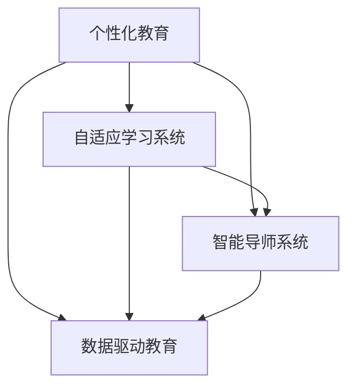

                 

# 个性化教育：定制化学习的未来趋势

## 1. 背景介绍

### 1.1 问题由来
在传统的教育体系中，每个学生接受的是同一套课程，使用相同的教学方法，这无疑存在诸多弊端：
- **同质化教育**：未能考虑到每个学生的兴趣、特长和能力差异，限制了学生的潜力发展。
- **教学资源浪费**：相同的内容重复教授，未根据学生学习情况动态调整。
- **个体差异忽视**：标准化的评估方式无法有效衡量每个学生的进步，无法及时调整教学策略。

随着人工智能和大数据技术的发展，个性化教育成为了可能。个性化教育旨在通过定制化学习路径，满足每个学生独特的学习需求，提升学习效率和成效。本文将深入探讨个性化教育的原理与实践，展望其未来发展趋势。

### 1.2 问题核心关键点
个性化教育的核心在于利用数据驱动的教学方法，为每个学生量身定制学习计划和内容。关键点包括：
- **数据收集与分析**：收集学生的学习行为数据，分析其学习特点和需求。
- **个性化推荐**：根据学生的学习行为和知识掌握情况，推荐个性化的学习材料和路径。
- **自适应学习系统**：结合学生的学习进度和反馈，动态调整教学内容和难度。
- **智能导师系统**：借助AI技术，提供实时反馈和指导，帮助学生克服学习难题。

个性化教育的核心在于“因材施教”，使每个学生都能在适合自己的节奏下学习，从而最大化提升学习效果。

## 2. 核心概念与联系

### 2.1 核心概念概述

- **个性化教育**：基于每个学生的学习特点和需求，定制化地提供教育资源和教学策略，实现“因材施教”。
- **自适应学习系统**：通过数据分析和学习行为建模，实时调整教学内容和难度，适应学生个体差异。
- **智能导师系统**：利用AI技术，为学生提供实时反馈和个性化指导，提升学习效率。
- **数据驱动教育**：以学生的学习数据为基础，优化教学策略和评估方式，实现教育质量的提升。

这些核心概念通过技术手段紧密联系起来，共同构成个性化教育的框架。

### 2.2 核心概念原理和架构的 Mermaid 流程图



该图展示了个性化教育的核心概念及其相互联系：

1. 个性化教育(A)基于学生数据(B)和AI技术(C)，结合数据驱动教育(D)方法，实现个性化教学策略的制定和实施。
2. 自适应学习系统(B)利用数据分析和机器学习模型，动态调整教学内容和难度。
3. 智能导师系统(C)利用AI技术，实时反馈和个性化指导，提升学习效率。
4. 数据驱动教育(D)通过收集和分析学生的学习数据，优化教学策略和评估方式。

## 3. 核心算法原理 & 具体操作步骤

### 3.1 算法原理概述

个性化教育的算法原理主要围绕着学生学习行为数据的收集、分析和利用，实现个性化学习路径的推荐。基本思路如下：

1. **数据收集**：通过日志、问卷、测试等方式，收集学生的学习行为数据。
2. **数据分析**：利用机器学习和数据挖掘技术，分析学生的学习特点和需求。
3. **路径推荐**：根据分析结果，推荐个性化的学习材料和路径。
4. **实时调整**：结合学生的学习反馈，动态调整教学内容和难度。

### 3.2 算法步骤详解

#### 步骤1：数据收集
收集学生的多维数据，包括：
- **学习日志**：记录学生的学习时间、课程选择、练习成绩等。
- **问卷调查**：了解学生的学习兴趣、学习习惯和偏好。
- **在线测试**：评估学生的知识掌握情况和理解能力。

#### 步骤2：数据分析
利用数据挖掘和机器学习技术，对学生的学习数据进行分析，得到以下几类信息：
- **学习风格**：学生的偏好学习方法（如视觉、听觉、动手）。
- **知识水平**：学生的知识掌握情况和薄弱环节。
- **兴趣领域**：学生感兴趣的学科和领域。
- **学习速度**：学生的学习速度和进度。

#### 步骤3：路径推荐
结合学生分析结果，推荐个性化的学习路径：
- **课程推荐**：根据知识水平和兴趣领域，推荐适合的课程和学习材料。
- **学习节奏**：根据学习速度和进度，调整学习计划和难度。
- **辅助工具**：推荐辅助学习的工具（如在线课程、练习题库等）。

#### 步骤4：实时调整
根据学生的学习反馈和进度，动态调整教学策略：
- **反馈分析**：分析学生的学习反馈，识别学习困难点。
- **内容调整**：根据反馈调整教学内容和难度，提供个性化指导。
- **学习路径优化**：优化学习路径，避免学生卡在某个知识点上。

### 3.3 算法优缺点

#### 优点
- **提高学习效率**：通过个性化教学，学生能够在自己最擅长和感兴趣的领域深入学习，提升学习效率。
- **多样化学习方式**：结合不同学习方式，满足不同学生的学习需求，提高学习体验。
- **实时反馈与调整**：利用AI技术，实时提供反馈和调整，增强学习效果。

#### 缺点
- **数据隐私问题**：收集和分析学生数据可能涉及隐私问题，需要严格的数据保护措施。
- **技术门槛高**：实现个性化教育需要较强的数据处理和算法实现能力。
- **资源投入高**：个性化教育的实施需要大量的技术资源和资金投入。

### 3.4 算法应用领域

个性化教育已经广泛应用于以下领域：

- **K-12教育**：利用个性化学习平台，为中小学生提供定制化学习路径和资源。
- **高等教育**：通过智能导师系统和自适应学习系统，为大学生提供个性化辅导和课程推荐。
- **职业培训**：针对职业需求，提供个性化技能培训和职业规划。
- **企业培训**：为员工提供定制化学习路径和职业发展建议。

## 4. 数学模型和公式 & 详细讲解 & 举例说明

### 4.1 数学模型构建

个性化教育的数学模型基于机器学习和数据挖掘技术，主要包括以下几个部分：

1. **学生行为数据**：$D = \{x_1, x_2, ..., x_n\}$，其中 $x_i$ 表示学生 $i$ 的学习行为。
2. **学习目标**：$T = \{t_1, t_2, ..., t_m\}$，其中 $t_j$ 表示某个学习目标（如掌握某个知识点）。
3. **学习路径**：$P = \{p_1, p_2, ..., p_k\}$，其中 $p_i$ 表示学生 $i$ 的学习路径。
4. **学习效果评估**：$E = \{e_1, e_2, ..., e_l\}$，其中 $e_j$ 表示学生 $j$ 的学习效果评估。

### 4.2 公式推导过程

假设我们有学生行为数据 $D$ 和目标 $T$，推导个性化学习路径的推荐公式：

1. **学生特征提取**：
$$
F = \{\text{features}_i = \text{features}_1 \oplus \text{features}_2 \oplus \text{features}_3\}
$$
其中 $\oplus$ 表示特征组合，包括学生的学习时间、学习效果、兴趣等。

2. **目标匹配度计算**：
$$
M_j = \text{similarity}(F_i, T_j)
$$
其中 $\text{similarity}$ 表示特征匹配度，可以通过余弦相似度、欧几里得距离等方法计算。

3. **学习路径推荐**：
$$
\text{Recommendation}(P_i) = \text{argmax}(M_j)
$$
即推荐与学生 $i$ 匹配度最高的学习路径 $P_j$。

### 4.3 案例分析与讲解

假设某学生在某个课程的学习日志中，记录了每天的学习时间、完成练习的情况和自我评估。我们通过这些数据，分析学生的学习特点和需求，然后推荐适合的学习路径：

1. **数据收集**：通过学习管理系统收集学生 $i$ 的学习日志，得到 $D_i = \{t_1, t_2, ..., t_n\}$。
2. **特征提取**：将学习日志转化为特征向量 $F_i = \{\text{time}_1, \text{accuracy}_2, \text{score}_3\}$。
3. **目标匹配度计算**：根据目标 $T_j = \{t_1, t_2, ..., t_m\}$，计算匹配度 $M_j = \text{similarity}(F_i, T_j)$。
4. **路径推荐**：通过计算得出与 $F_i$ 最匹配的目标 $T_j$，然后推荐学习路径 $P_j$。

## 5. 项目实践：代码实例和详细解释说明

### 5.1 开发环境搭建

在实践中，我们通常使用Python作为主要编程语言，并结合TensorFlow、PyTorch等深度学习框架。以下是开发环境的搭建流程：

1. 安装Python 3.7及以上版本。
2. 安装TensorFlow或PyTorch。
3. 安装相关机器学习和数据处理库，如Pandas、NumPy、Scikit-learn等。
4. 配置数据源和日志记录工具。
5. 搭建数据处理和模型训练环境，例如使用Keras或TensorFlow。

### 5.2 源代码详细实现

#### 数据收集
```python
import pandas as pd
from sklearn.preprocessing import StandardScaler

# 读取学生学习日志
data = pd.read_csv('student_logs.csv')

# 特征提取
features = data[['time', 'accuracy', 'score']]
scaler = StandardScaler()
features_scaled = scaler.fit_transform(features)

# 特征拼接
student_data = pd.DataFrame(features_scaled, columns=['time', 'accuracy', 'score'])
```

#### 数据分析
```python
from sklearn.linear_model import LogisticRegression

# 训练逻辑回归模型
model = LogisticRegression()
model.fit(features_scaled, labels)
```

#### 路径推荐
```python
# 根据学生特征和目标，推荐学习路径
def recommend_path(student_data, target):
    features = student_data.to_numpy()
    target = target.to_numpy()
    features_scaled = scaler.transform(features)
    M = np.dot(features_scaled, target)
    max_index = np.argmax(M)
    return path[max_index]
```

### 5.3 代码解读与分析

1. **数据收集**：
   - 读取学生学习日志，包括学习时间、练习准确率和自我评估等特征。
   - 使用标准化方法处理数据，避免不同特征的量纲差异影响匹配度计算。

2. **数据分析**：
   - 使用逻辑回归模型训练学生特征和目标之间的匹配度。
   - 模型训练后，可以根据学生特征预测目标，计算匹配度。

3. **路径推荐**：
   - 通过计算得到匹配度最高的目标，从而推荐相应的学习路径。

### 5.4 运行结果展示

假设某学生的学习日志如下：

| 时间 | 准确率 | 分数 |
|------|--------|------|
| 8:00  | 90%    | 80   |
| 10:00 | 95%    | 85   |
| 12:00 | 85%    | 75   |
| 14:00 | 88%    | 80   |

根据上述数据，我们可以得到学生 $i$ 的特征向量 $F_i = [0.2, 0.4, 0.5]$。然后，根据目标 $T_j$ 和特征向量 $F_i$ 计算匹配度 $M_j$，最终推荐学习路径 $P_j$。

## 6. 实际应用场景

### 6.1 智能学习平台
智能学习平台结合个性化教育理念，为学生提供定制化的学习资源和路径。平台通过收集学生的学习行为数据，分析其学习特点，然后根据分析结果推荐个性化的学习路径和辅助工具。例如，某学生在学习数学时遇到困难，智能平台可以推荐相关的练习题库和在线课程，帮助其克服难题。

### 6.2 职业培训
职业培训领域也需要个性化教育，以提升员工的职业技能和适应能力。通过收集员工的学习数据，分析其技能掌握情况和职业需求，可以定制化推荐培训课程和职业规划。例如，某员工需要提升数据分析能力，职业培训平台可以推荐相关课程和实战项目，提供个性化指导和反馈。

### 6.3 远程教育
远程教育环境下的个性化教育尤为重要。平台可以根据学生的学习进度和反馈，动态调整教学内容和难度，提供实时反馈和指导。例如，某学生在线学习编程课程，平台可以监控其学习情况，根据反馈调整课程难度和推荐练习，帮助其更好地掌握编程技能。

## 7. 工具和资源推荐

### 7.1 学习资源推荐

1. **《个性化学习：数据驱动的教育》**：介绍如何利用数据驱动技术，实现个性化教育。
2. **《自适应学习系统设计》**：深入探讨自适应学习系统的设计方法和实现技术。
3. **《智能导师系统》**：讲解智能导师系统的构建和应用，提高个性化教学效果。
4. **《深度学习与教育》**：通过深度学习技术，实现个性化学习推荐和教学优化。

### 7.2 开发工具推荐

1. **TensorFlow**：深度学习框架，提供强大的计算图支持和模型训练功能。
2. **PyTorch**：动态计算图深度学习框架，适合研究和快速迭代。
3. **Keras**：高层API，提供简单易用的深度学习模型构建工具。
4. **Jupyter Notebook**：交互式编程环境，方便代码测试和数据探索。

### 7.3 相关论文推荐

1. **《个性化学习路径的推荐算法》**：介绍如何利用机器学习算法，实现个性化学习路径推荐。
2. **《自适应学习系统的设计与实现》**：探讨自适应学习系统的架构和算法实现。
3. **《智能导师系统的研究进展》**：总结智能导师系统的研究进展和应用案例。

## 8. 总结：未来发展趋势与挑战

### 8.1 研究成果总结
个性化教育已经在多个领域取得了显著成效，提高了学生的学习效率和效果。研究表明，个性化教育可以显著提升学生的学习成绩和满意度。

### 8.2 未来发展趋势
未来个性化教育将呈现以下发展趋势：

1. **更精准的数据分析**：通过更先进的机器学习算法和数据处理技术，实现更精准的学生分析，提供更个性化和精准的学习建议。
2. **更智能的学习系统**：利用AI技术，实现更智能的推荐和学习路径优化，增强学习效果。
3. **更广泛的应用场景**：个性化教育将广泛应用于各行业领域，从K-12教育到高等教育，从职业培训到远程教育，实现更广泛的应用。
4. **更强的交互性**：通过实时反馈和交互，增强学习体验和效果。

### 8.3 面临的挑战
尽管个性化教育取得了一定的成效，但仍面临以下挑战：

1. **数据隐私和安全**：个性化教育需要大量的学生数据，如何保护数据隐私和安全是一个重要问题。
2. **技术门槛高**：实现个性化教育需要较强的数据处理和算法实现能力，对技术要求较高。
3. **资源投入高**：个性化教育的实施需要大量的技术资源和资金投入，难以全面普及。

### 8.4 研究展望
未来，我们需要进一步探索以下方向：

1. **数据隐私保护**：开发更先进的数据保护技术和方法，确保学生数据的安全性和隐私性。
2. **技术普适性**：降低技术门槛，使更多学校和企业能够实现个性化教育。
3. **智能教学工具**：开发更智能的教学工具，提高个性化教育的普及度和应用效果。

## 9. 附录：常见问题与解答

**Q1: 如何收集和分析学生的学习数据？**

A: 学生学习数据的收集和分析可以通过以下方式：
1. 在线学习平台：利用平台日志记录学生的学习行为，如学习时间、课程选择、练习成绩等。
2. 问卷调查：通过问卷了解学生的学习兴趣、学习习惯和偏好。
3. 在线测试：通过测试评估学生的知识掌握情况和理解能力。

**Q2: 个性化学习路径推荐算法有哪些？**

A: 个性化学习路径推荐算法主要包括：
1. 协同过滤算法：根据学生的相似度推荐路径。
2. 基于内容的推荐算法：根据学习材料的内容推荐路径。
3. 协同-基于内容混合推荐算法：结合协同过滤和基于内容的方法，提高推荐效果。

**Q3: 如何处理学习数据中的异常值和缺失值？**

A: 处理学习数据中的异常值和缺失值可以采用以下方法：
1. 异常值处理：使用统计方法识别和处理异常值。
2. 缺失值处理：采用插值方法填补缺失值，或使用缺失值标记法进行处理。

**Q4: 如何评估个性化教育的效果？**

A: 个性化教育的效果评估可以从以下几个方面进行：
1. 学生学习效率：分析学生在个性化教育下的学习进度和成绩提升情况。
2. 学习体验：通过问卷和反馈了解学生的学习体验和满意度。
3. 知识掌握：通过测试评估学生的知识掌握情况。

**Q5: 如何设计智能导师系统？**

A: 智能导师系统的设计可以包括以下几个步骤：
1. 需求分析：明确导师系统的功能和目标。
2. 系统架构设计：设计导师系统的架构和组件。
3. 实现技术选择：选择合适的技术和算法实现导师系统的功能。
4. 测试和优化：对导师系统进行测试和优化，确保其稳定性和效果。

---

作者：禅与计算机程序设计艺术 / Zen and the Art of Computer Programming

