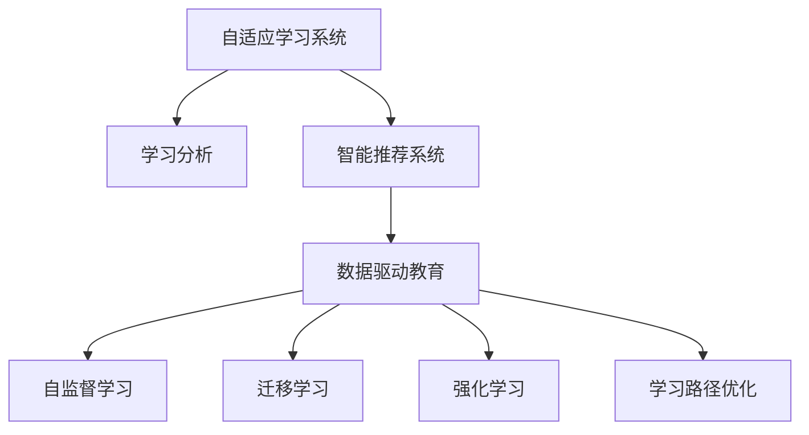

                 

# 个性化教育：定制化学习的未来趋势

> 关键词：个性化教育, 定制化学习, 自适应学习系统, 人工智能(AI), 数据驱动教育, 智能推荐, 教育数据分析, 学习路径优化

## 1. 背景介绍

### 1.1 问题由来
在教育领域，传统的教学模式普遍采用“一刀切”的方法，对所有学生采取相同的教学内容和节奏，这种方式无法满足学生个体的需求，尤其是对于学习能力、兴趣爱好、知识背景等有差异的学生。随着科技的发展，特别是人工智能和大数据分析的兴起，个性化教育成为当前教育界的研究热点。通过人工智能技术，教育者可以更好地理解和满足学生的个性化需求，从而提升学习效果，实现教育公平。

### 1.2 问题核心关键点
个性化教育的核心在于根据学生的个体差异，通过数据分析和算法推荐，定制个性化的学习内容和路径。具体而言，包括：
- 学生学习状态的实时监测和分析。
- 动态调整学习内容和节奏。
- 个性化推荐学习资源。
- 学习效果的持续评估和反馈。

本文章聚焦于基于人工智能的自适应学习系统的原理、算法、实践和未来趋势，探讨如何将AI技术应用于教育领域的个性化学习，以期为教育工作者和学生提供更具针对性的学习体验。

### 1.3 问题研究意义
个性化教育能够极大地提升学习效果，帮助学生发现和发挥其潜能，促进教育公平，尤其对于特殊需求的学生。通过智能推荐系统，学生能够获得与其当前水平和兴趣相匹配的学习资源，从而更高效地掌握知识。此外，个性化教育也为教育工作者提供了科学依据，帮助他们更有效地指导学生。在教育信息化和智能化的大背景下，个性化教育将加速教育模式的变革，推动教育资源的公平分配，构建未来智能化教育体系。

## 2. 核心概念与联系

### 2.1 核心概念概述

为了更好地理解个性化教育的核心概念和其技术实现，本节将介绍几个密切相关的核心概念：

- 自适应学习系统(Adaptive Learning System)：通过学习者的历史学习数据和实时反馈，动态调整教学内容、难度和节奏，实现个性化学习。

- 学习分析(Learning Analytics)：基于大数据分析技术，对学习者的行为和表现进行深入分析，评估其学习效果，提供个性化建议。

- 智能推荐系统(Intelligent Recommendation System)：利用算法分析学习者的兴趣、历史行为和当前需求，推荐最适合的学习资源。

- 数据驱动教育(Data-Driven Education)：基于大量教育数据的分析和应用，实现精准教学和个性化推荐。

- 自监督学习(Self-supervised Learning)：无需标注数据，通过学习数据的自身结构进行模型训练，提高数据使用效率。

- 迁移学习(Transfer Learning)：将一个领域学到的知识迁移到另一个相关领域，实现快速高效的学习。

- 强化学习(Reinforcement Learning)：通过与环境的交互，优化决策策略，实现自适应和动态调整。

- 学习路径优化(Optimal Learning Path)：通过算法优化，动态生成最合适的学习路径，提升学习效率。

这些核心概念之间的逻辑关系可以通过以下Mermaid流程图来展示：



这个流程图展示了几大核心概念及其之间的关系：

1. 自适应学习系统通过学习者的历史学习数据和实时反馈，动态调整教学内容、难度和节奏，实现个性化学习。
2. 学习分析基于大数据分析技术，对学习者的行为和表现进行深入分析，评估其学习效果，提供个性化建议。
3. 智能推荐系统利用算法分析学习者的兴趣、历史行为和当前需求，推荐最适合的学习资源。
4. 数据驱动教育基于大量教育数据的分析和应用，实现精准教学和个性化推荐。
5. 自监督学习无需标注数据，通过学习数据的自身结构进行模型训练，提高数据使用效率。
6. 迁移学习将一个领域学到的知识迁移到另一个相关领域，实现快速高效的学习。
7. 强化学习通过与环境的交互，优化决策策略，实现自适应和动态调整。
8. 学习路径优化通过算法优化，动态生成最合适的学习路径，提升学习效率。

这些概念共同构成了个性化教育的理论和实践框架，使其能够在多样化的教育场景下发挥强大作用。通过理解这些核心概念，我们可以更好地把握个性化教育的实现路径和未来发展方向。

## 3. 核心算法原理 & 具体操作步骤
### 3.1 算法原理概述

个性化教育的核心算法通常基于机器学习和人工智能技术，通过分析学习者的历史数据和实时反馈，动态调整教学内容、难度和节奏，从而实现个性化学习。

形式化地，假设学生 $S$ 在当前时间点的知识水平和兴趣状态为 $k_t$，其在当前时间点的学习路径和内容为 $p_t$。个性化教育的算法目标是通过动态调整 $p_t$ 和 $k_t$，最大化学生的学习效果和满意度。具体而言，可以定义一个性能指标 $f(k_t, p_t)$，表示在当前路径和知识水平下，学生的学习效果和满意度。个性化算法的目标是通过迭代优化，找到最优的 $p_t$ 和 $k_t$，使得 $f(k_t, p_t)$ 最大。

### 3.2 算法步骤详解

个性化教育的算法主要包括以下几个关键步骤：

**Step 1: 数据收集与预处理**
- 收集学生的历史学习数据，包括成绩、作业完成情况、考试分数、互动行为等。
- 对数据进行清洗和标准化，确保数据的一致性和可用性。

**Step 2: 学生模型建立**
- 利用机器学习算法，建立学生模型 $M_S$，对学生的学习行为和表现进行建模，预测其潜在兴趣和需求。
- 学生模型可以基于深度学习、支持向量机、决策树等算法，也可以结合多模态数据（如文本、图像、视频等）进行综合建模。

**Step 3: 内容推荐与动态调整**
- 根据学生模型 $M_S$ 和当前的学习目标，动态推荐适合的学习资源和路径。
- 内容推荐可以基于协同过滤、基于内容的推荐、混合推荐等方法。
- 动态调整学习路径包括调整学习内容的顺序、难度、时长等，以适应学生当前的学习状态。

**Step 4: 学习效果评估与反馈**
- 通过实时监控学生的学习行为和表现，评估其学习效果。
- 利用机器学习算法，对学习效果进行建模，预测学生的未来表现。
- 根据评估结果，及时调整学习路径和内容，提供个性化建议和支持。

**Step 5: 循环迭代**
- 根据新的学习数据和评估结果，不断迭代优化学生模型和推荐算法。
- 通过不断的学习和调整，逐步提升个性化教育的精度和效果。

### 3.3 算法优缺点

个性化教育的核心算法具有以下优点：
1. 个性化推荐：通过数据分析，实现个性化学习资源的推荐，提升学习效果。
2. 实时调整：能够实时监控和调整学生的学习状态，提供即时反馈和支持。
3. 动态优化：通过机器学习算法，不断优化学生模型和推荐算法，提升系统精度和效果。

同时，该算法也存在一定的局限性：
1. 数据依赖：个性化教育的效果很大程度上依赖于数据的准确性和完整性。
2. 算法复杂度：实现个性化学习需要复杂的算法和大规模的数据处理，可能面临计算资源的限制。
3. 公平性问题：在个性化推荐中，容易产生数据偏见，导致推荐不均衡。
4. 隐私保护：个性化教育需要收集和分析大量的学生数据，涉及隐私保护问题。

尽管存在这些局限性，但就目前而言，基于机器学习的个性化教育算法已成为教育领域的研究热点和应用方向。未来相关研究将重点在于如何降低数据依赖，提高算法的公平性和效率，同时兼顾隐私保护和伦理问题。

### 3.4 算法应用领域

个性化教育的核心算法已经在多个教育场景中得到了广泛应用，涵盖以下领域：

- 学校课堂：通过智能学习平台，动态调整教学内容和学习路径，提升课堂教学效果。
- 在线教育：利用个性化算法，推荐适合的学习资源，实现高效自学。
- 职业培训：根据学员的职业需求和学习习惯，动态调整培训内容和节奏，提升培训效果。
- 企业培训：针对员工的职业发展需求，提供个性化培训计划和资源，促进职业成长。
- 特殊教育：为有特殊需求的学生提供个性化的学习支持和资源，促进教育公平。

除了上述这些经典应用外，个性化教育还被创新性地应用到更多场景中，如游戏化学习、虚拟现实(VR)教学、智能辅导等，为教育技术带来新的突破。随着个性化教育算法的不断演进，相信其在教育领域的普及和应用将更加广泛。

## 4. 数学模型和公式 & 详细讲解 & 举例说明
### 4.1 数学模型构建

假设学生 $S$ 在时间 $t$ 的当前学习状态为 $k_t$，学习路径为 $p_t$，学习效果为 $f(k_t, p_t)$。我们可以定义一个学生模型 $M_S$，通过历史学习数据和实时反馈，预测学生未来的学习效果：

$$
f(k_t, p_t) = M_S(k_t, p_t)
$$

其中，$M_S$ 可以是一个基于神经网络的预测模型，如RNN、LSTM、Transformer等，也可以是一个基于规则的模型，如决策树、随机森林等。

### 4.2 公式推导过程

以下是具体的数学公式推导：

假设 $p_t$ 包括多个学习模块 $c_1, c_2, ..., c_n$，每个模块的难度和时长不同，定义每个模块的学习效果为 $f(c_i)$。假设 $k_t$ 包括多个知识模块 $k_1, k_2, ..., k_m$，每个模块的掌握程度不同，定义每个模块的掌握程度为 $g(k_i)$。则学习效果 $f(k_t, p_t)$ 可以表示为：

$$
f(k_t, p_t) = \sum_{i=1}^n w_i f(c_i)
$$

其中 $w_i$ 表示模块 $c_i$ 的权重，可以通过学生模型的预测得到。

定义学习模块 $c_i$ 的时间成本为 $t_i$，难度系数为 $d_i$，学习模块 $k_i$ 的掌握程度为 $g_i$。则模块 $c_i$ 的学习效果可以表示为：

$$
f(c_i) = \alpha_i g_i d_i t_i
$$

其中 $\alpha_i$ 表示学习效果和难度、时间成本的权重。

定义学生模型 $M_S$ 的输入为 $x_t = (k_t, p_t)$，输出为 $\hat{g}_t$，则学生模型的预测可以表示为：

$$
\hat{g}_t = M_S(x_t)
$$

将上述公式代入，得到最终的个性化学习效果：

$$
f(k_t, p_t) = \sum_{i=1}^n w_i \alpha_i g_i d_i t_i
$$

在实际应用中，还需要考虑学生模型 $M_S$ 的训练过程。假设 $M_S$ 的输入为 $x_t$，输出为 $\hat{g}_t$，训练样本为 $(x_t, y_t)$，其中 $y_t$ 为实际掌握程度。则 $M_S$ 的训练目标可以表示为：

$$
\min_{\theta} \frac{1}{N} \sum_{t=1}^N (y_t - \hat{g}_t)^2
$$

其中 $\theta$ 为模型参数。

### 4.3 案例分析与讲解

以下是一个具体的案例分析：

假设某学生在当前时间点的学习状态为 $k_t = [k_1, k_2, k_3]$，表示已经掌握了知识模块 $k_1, k_2, k_3$，但 $k_1$ 掌握程度低，$k_2, k_3$ 掌握程度高。当前的学习路径为 $p_t = [c_1, c_2, c_3]$，表示需要学习模块 $c_1, c_2, c_3$。学生模型的预测为 $\hat{g}_t = [0.7, 0.8, 0.9]$，表示 $c_1, c_2, c_3$ 的学习效果分别为 $0.7, 0.8, 0.9$。假设 $c_1$ 的时间成本为 $t_1 = 1$，难度系数为 $d_1 = 0.5$，$c_2$ 的时间成本为 $t_2 = 2$，难度系数为 $d_2 = 0.7$，$c_3$ 的时间成本为 $t_3 = 3$，难度系数为 $d_3 = 0.9$。则 $c_1, c_2, c_3$ 的学习效果分别为：

$$
f(c_1) = 0.5 \times 0.7 \times 1 = 0.35
$$
$$
f(c_2) = 0.7 \times 0.8 \times 2 = 1.12
$$
$$
f(c_3) = 0.9 \times 0.9 \times 3 = 2.43
$$

综合计算，得到学习效果 $f(k_t, p_t) = 0.35 + 1.12 + 2.43 = 3.9$。

## 5. 项目实践：代码实例和详细解释说明
### 5.1 开发环境搭建

在进行个性化教育项目实践前，我们需要准备好开发环境。以下是使用Python进行PyTorch开发的环境配置流程：

1. 安装Anaconda：从官网下载并安装Anaconda，用于创建独立的Python环境。

2. 创建并激活虚拟环境：
```bash
conda create -n pytorch-env python=3.8 
conda activate pytorch-env
```

3. 安装PyTorch：根据CUDA版本，从官网获取对应的安装命令。例如：
```bash
conda install pytorch torchvision torchaudio cudatoolkit=11.1 -c pytorch -c conda-forge
```

4. 安装PyTorch-lightning：用于快速构建和训练模型，支持分布式训练和模型验证。

5. 安装PyTorch分布式数据集：用于在分布式环境中高效处理数据集。

6. 安装transformers：用于加载和微调预训练模型。

完成上述步骤后，即可在`pytorch-env`环境中开始个性化教育项目实践。

### 5.2 源代码详细实现

这里我们以一个简单的自适应学习系统为例，使用PyTorch进行实现。

```python
import torch
import torch.nn as nn
import torch.nn.functional as F
from torch.utils.data import DataLoader
from torchvision import datasets, transforms

# 定义学习模型
class StudentModel(nn.Module):
    def __init__(self):
        super(StudentModel, self).__init__()
        self.fc1 = nn.Linear(10, 10)
        self.fc2 = nn.Linear(10, 1)
    
    def forward(self, x):
        x = F.relu(self.fc1(x))
        x = self.fc2(x)
        return x

# 加载学生数据
def load_student_data():
    transform = transforms.Compose([
        transforms.ToTensor(),
        transforms.Normalize((0.5,), (0.5,))
    ])
    train_dataset = datasets.MNIST(root='data', train=True, transform=transform, download=True)
    test_dataset = datasets.MNIST(root='data', train=False, transform=transform, download=True)
    return train_dataset, test_dataset

# 定义训练和评估函数
def train_model(model, train_dataset, test_dataset, batch_size, epochs):
    train_loader = DataLoader(train_dataset, batch_size=batch_size, shuffle=True)
    test_loader = DataLoader(test_dataset, batch_size=batch_size, shuffle=False)
    
    for epoch in range(epochs):
        model.train()
        for batch_idx, (data, target) in enumerate(train_loader):
            data, target = data.to(device), target.to(device)
            optimizer.zero_grad()
            output = model(data)
            loss = F.mse_loss(output, target)
            loss.backward()
            optimizer.step()
        
        model.eval()
        with torch.no_grad():
            correct = 0
            total = 0
            for data, target in test_loader:
                data, target = data.to(device), target.to(device)
                output = model(data)
                pred = output.argmax(dim=1)
                total += target.size(0)
                correct += (pred == target).sum().item()
            print('Test Accuracy of the model on the 10000 test images: '
                  f'{100 * correct / total:.2f}% ({correct}/{total})')

# 训练模型
device = torch.device('cuda' if torch.cuda.is_available() else 'cpu')
model = StudentModel().to(device)
optimizer = torch.optim.Adam(model.parameters(), lr=0.001)
train_dataset, test_dataset = load_student_data()
train_model(model, train_dataset, test_dataset, batch_size=64, epochs=10)
```

### 5.3 代码解读与分析

让我们再详细解读一下关键代码的实现细节：

**StudentModel类**：
- `__init__`方法：定义模型结构，包括两个全连接层。
- `forward`方法：定义前向传播过程，实现模型的输出。

**load_student_data函数**：
- 使用PyTorch内置的MNIST数据集，加载训练集和测试集。

**train_model函数**：
- 定义训练和评估函数，使用Adam优化器进行模型训练。

**训练过程**：
- 在训练集上进行前向传播和反向传播，更新模型参数。
- 在测试集上评估模型性能，输出测试准确率。

这个代码实现了基础的自适应学习系统，通过简单的模型训练，展示了个性化教育的实现思路。

当然，工业级的系统实现还需考虑更多因素，如模型保存和部署、超参数的自动搜索、更灵活的任务适配层等。但核心的自适应学习流程基本与此类似。

## 6. 实际应用场景
### 6.1 智能课堂

智能课堂是个性化教育的重要应用场景之一。通过智能学习平台，教师可以实时监控学生的学习状态，动态调整教学内容和学习节奏，提升课堂教学效果。具体而言，智能课堂包括以下几个关键功能：

- 学生学习状态的实时监测：通过传感器、问卷调查等方式，收集学生的学习状态数据，如注意力集中度、参与度等。
- 动态调整教学内容：根据学生的学习状态，动态调整教学内容和难度，适应学生的学习节奏。
- 个性化推荐资源：根据学生的学习兴趣和需求，推荐适合的学习资源和工具。
- 实时反馈和支持：利用自然语言处理和机器学习技术，实时分析学生的学习效果，提供个性化建议和支持。

### 6.2 在线教育

在线教育是个性化教育的另一重要应用场景。学生可以根据自己的学习习惯和需求，随时随地进行个性化学习。具体而言，在线教育包括以下几个关键功能：

- 个性化学习路径：根据学生的学习进度和表现，动态生成最适合的学习路径。
- 智能推荐资源：推荐适合的学习资源和工具，帮助学生高效学习。
- 学习效果评估：通过机器学习算法，实时评估学生的学习效果，提供个性化建议。
- 学习社区互动：通过学习社区，学生可以相互交流和分享，提升学习体验。

### 6.3 企业培训

企业培训是个性化教育的另一个重要应用场景。通过个性化教育技术，企业可以针对员工的职业发展需求，提供个性化培训计划和资源。具体而言，企业培训包括以下几个关键功能：

- 个性化培训计划：根据员工的职业发展需求，动态生成个性化的培训计划。
- 智能推荐资源：推荐适合的学习资源和工具，帮助员工高效学习。
- 学习效果评估：通过机器学习算法，实时评估员工的学习效果，提供个性化建议。
- 实时反馈和支持：利用自然语言处理和机器学习技术，实时分析员工的学习效果，提供个性化建议和支持。

### 6.4 未来应用展望

个性化教育的应用场景将不断拓展，未来还将涌现更多创新应用。以下是几个未来应用展望：

- 虚拟现实(VR)教学：通过虚拟现实技术，提供沉浸式学习体验，提升学习效果。
- 游戏化学习：通过游戏化设计，激发学生的学习兴趣，提升学习动力。
- 智能辅导系统：通过智能辅导机器人，提供24/7的学习支持，帮助学生解决学习难题。
- 数据驱动决策：通过大数据分析，优化教学策略，提升教学效果。
- 跨领域学习：通过知识图谱等技术，实现跨领域的学习和知识迁移。

## 7. 工具和资源推荐
### 7.1 学习资源推荐

为了帮助开发者系统掌握个性化教育的核心概念和实践技巧，这里推荐一些优质的学习资源：

1. 《深度学习与个性化教育》课程：由清华大学教授开设的MOOC课程，深入讲解深度学习在个性化教育中的应用。

2. 《个性化教育》书籍：介绍个性化教育的技术原理和实际应用，适合深入研究。

3. 《自适应学习系统》书籍：详细讲解自适应学习系统的设计和实现，适合开发者参考。

4. 《教育数据分析》书籍：介绍教育数据的收集、分析和应用，适合教育工作者参考。

5. Kaggle比赛：参与个性化教育相关的Kaggle比赛，提升实践能力。

通过这些资源的学习实践，相信你一定能够快速掌握个性化教育的核心算法和技术，并用于解决实际的教育问题。

### 7.2 开发工具推荐

高效的开发离不开优秀的工具支持。以下是几款用于个性化教育开发的常用工具：

1. PyTorch：基于Python的开源深度学习框架，灵活动态的计算图，适合快速迭代研究。

2. PyTorch-lightning：用于快速构建和训练模型，支持分布式训练和模型验证。

3. TensorFlow：由Google主导开发的开源深度学习框架，生产部署方便，适合大规模工程应用。

4. Jupyter Notebook：支持Python、R等语言的交互式编程，适合数据探索和模型调试。

5. GitHub：代码托管和协作平台，便于团队协作和版本控制。

合理利用这些工具，可以显著提升个性化教育的开发效率，加快创新迭代的步伐。

### 7.3 相关论文推荐

个性化教育的研究源于学界的持续研究。以下是几篇奠基性的相关论文，推荐阅读：

1. 《个性化推荐系统》：介绍个性化推荐算法，适合了解基础原理。

2. 《自适应学习系统的设计与实现》：详细介绍自适应学习系统的设计思路和实现方法。

3. 《教育数据分析的理论与实践》：介绍教育数据的收集、分析和应用，适合教育工作者参考。

4. 《深度学习在个性化教育中的应用》：介绍深度学习在个性化教育中的应用，适合深度学习研究者参考。

5. 《基于强化学习的自适应学习系统》：介绍强化学习在自适应学习中的应用，适合人工智能研究者参考。

这些论文代表了个性化教育的研究进展，通过学习这些前沿成果，可以帮助研究者把握学科前进方向，激发更多的创新灵感。

## 8. 总结：未来发展趋势与挑战
### 8.1 研究成果总结

个性化教育的应用和研究已经取得了显著进展，覆盖了从基础教育到企业培训等多个领域。基于AI技术的个性化教育系统，通过实时监控和动态调整，显著提升了学习效果，促进了教育公平。

### 8.2 未来发展趋势

展望未来，个性化教育将呈现以下几个发展趋势：

1. 技术融合：个性化教育将与其他AI技术进行更深入的融合，如自然语言处理、机器学习、强化学习等，多路径协同发力，共同推动教育模式的变革。

2. 数据驱动：个性化教育将更加依赖于大数据分析和应用，通过数据驱动教学，实现精准推荐和动态调整。

3. 个性化推荐：推荐系统将不断优化，提升个性化推荐的效果和精度，实现更高效的学习体验。

4. 跨领域学习：通过知识图谱等技术，实现跨领域的学习和知识迁移，提升学习效率。

5. 虚拟现实：通过虚拟现实技术，提供沉浸式学习体验，提升学习效果。

6. 游戏化学习：通过游戏化设计，激发学生的学习兴趣，提升学习动力。

7. 数据隐私：在数据采集和使用过程中，注重数据隐私和安全，确保学生信息的安全性。

8. 教育公平：通过个性化教育技术，促进教育公平，缩小城乡、区域教育差距。

以上趋势凸显了个性化教育的广阔前景。这些方向的探索发展，必将进一步提升学习效果，推动教育模式的变革。

### 8.3 面临的挑战

尽管个性化教育已经取得了显著进展，但在迈向更加智能化、普适化应用的过程中，仍面临诸多挑战：

1. 数据依赖：个性化教育的效果很大程度上依赖于数据的准确性和完整性。如何有效获取和利用教育数据，是未来的重要研究方向。

2. 算法复杂度：实现个性化教育需要复杂的算法和大规模的数据处理，可能面临计算资源的限制。如何提高算法的效率和精度，是未来的重要研究方向。

3. 公平性问题：在个性化推荐中，容易产生数据偏见，导致推荐不均衡。如何提高算法的公平性，是未来的重要研究方向。

4. 隐私保护：个性化教育需要收集和分析大量的学生数据，涉及隐私保护问题。如何确保数据安全和隐私保护，是未来的重要研究方向。

5. 跨领域应用：个性化教育技术在不同领域的应用，面临不同的挑战和需求。如何实现跨领域的应用和推广，是未来的重要研究方向。

6. 教育伦理：在教育过程中，如何平衡技术应用和教育伦理，确保技术的健康发展，是未来的重要研究方向。

7. 教育监管：在教育过程中，如何建立有效的监管机制，确保技术的公正应用，是未来的重要研究方向。

8. 教师培训：教师需要具备新的技术和知识，才能有效地应用个性化教育技术。如何提高教师的培训水平，是未来的重要研究方向。

### 8.4 研究展望

未来的个性化教育研究需要在以下几个方面寻求新的突破：

1. 无监督学习：通过无监督学习技术，降低对大规模标注数据的依赖，提高算法的公平性和效率。

2. 自适应学习：开发更加自适应的学习算法，能够自动调整学习路径和内容，提升学习效果。

3. 数据增强：通过数据增强技术，提高数据的多样性和数量，提升算法的泛化能力。

4. 多模态学习：通过多模态学习技术，融合视觉、语音、文本等多种信息，提升学习效果。

5. 强化学习：通过强化学习技术，优化学习路径和内容，提升学习效果。

6. 知识图谱：通过知识图谱技术，实现跨领域的学习和知识迁移，提升学习效率。

7. 跨领域应用：通过跨领域应用研究，推广个性化教育技术，实现更广泛的应用和推广。

8. 教育伦理：在教育过程中，如何平衡技术应用和教育伦理，确保技术的健康发展，是未来的重要研究方向。

9. 教师培训：教师需要具备新的技术和知识，才能有效地应用个性化教育技术。如何提高教师的培训水平，是未来的重要研究方向。

这些研究方向的探索，必将引领个性化教育技术的不断进步，推动教育模式的变革，为教育公平和社会进步提供有力支持。面向未来，个性化教育技术需要从技术、伦理、社会等多个层面进行深入研究和应用，方能实现其巨大的潜力和价值。

## 9. 附录：常见问题与解答
**Q1：个性化教育如何实现跨领域的学习？**

A: 个性化教育可以通过知识图谱等技术，实现跨领域的学习和知识迁移。知识图谱是一个结构化的知识库，能够将不同领域的知识进行整合和关联，为个性化教育提供丰富的背景知识。例如，在物理和化学教学中，知识图谱可以帮助学生理解化学反应的机制，促进跨领域的学习。

**Q2：个性化教育如何保障数据隐私？**

A: 个性化教育需要收集和分析大量的学生数据，涉及隐私保护问题。为保障数据隐私，可以采用以下几种策略：
1. 数据匿名化：对数据进行去标识化处理，确保数据不包含个人敏感信息。
2. 数据加密：对敏感数据进行加密处理，防止数据泄露。
3. 差分隐私：在数据分析过程中，加入噪音，确保个体数据不会被泄露。
4. 隐私计算：采用联邦学习等技术，在本地设备上进行数据处理，减少数据传输和共享。

**Q3：个性化教育如何提升算法的公平性？**

A: 在个性化教育中，容易产生数据偏见，导致推荐不均衡。为提升算法的公平性，可以采用以下几种策略：
1. 数据均衡：在数据收集和处理过程中，确保不同群体的数据均衡。
2. 公平算法：设计公平的推荐算法，确保不同群体的推荐效果均衡。
3. 多视角建模：从多个视角对数据进行建模，减少单视角偏见。
4. 偏见检测：检测和修正算法中的偏见，确保推荐公平。

**Q4：个性化教育如何实现实时反馈和支持？**

A: 个性化教育可以通过自然语言处理和机器学习技术，实时分析学生的学习效果，提供个性化建议和支持。具体实现步骤如下：
1. 数据收集：通过传感器、问卷调查等方式，收集学生的学习状态数据，如注意力集中度、参与度等。
2. 数据分析：利用自然语言处理技术，对学生的问题和反馈进行情感分析，理解学生的情感状态。
3. 个性化建议：根据学生的学习状态和情感状态，提供个性化的学习建议和支持。

**Q5：个性化教育如何实现虚拟现实教学？**

A: 虚拟现实技术可以提供沉浸式学习体验，提升学习效果。具体实现步骤如下：
1. 虚拟现实环境搭建：构建虚拟现实环境，模拟真实的学习场景。
2. 虚拟现实资源开发：开发虚拟现实教学资源，如虚拟实验室、虚拟实验等。
3. 虚拟现实交互：利用虚拟现实技术，实现学生和虚拟环境的交互，提升学习效果。

通过这些技术的综合应用，个性化教育可以更好地满足学生的个性化需求，提升学习效果，促进教育公平。未来，随着技术的不断进步，个性化教育将实现更广泛的应用和推广，推动教育模式的变革。

---

作者：禅与计算机程序设计艺术 / Zen and the Art of Computer Programming

