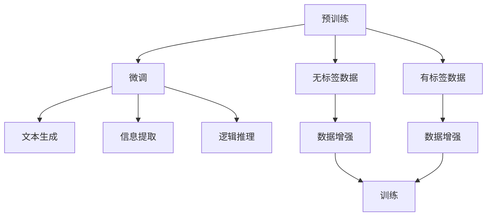

                 

# 临床试验优化：LLM 确保安全和高效

## 1. 背景介绍

### 1.1 问题由来

临床试验是医药研发的重要环节，旨在评估新药、新疗法在人体中的安全性和有效性。传统临床试验依赖于大量手工操作和数据处理，工作量巨大，且容易出现人为错误。近年来，人工智能(AI)技术，尤其是大语言模型(LLM)的兴起，为临床试验提供了全新的自动化和智能化方案。

### 1.2 问题核心关键点

如何利用LLM优化临床试验，以提升试验效率和数据质量，降低成本，同时确保试验的安全性？

## 2. 核心概念与联系

### 2.1 核心概念概述

- **大语言模型(LLM)**：以自回归或自编码模型为代表，通过大规模无标签文本数据预训练得到的模型。
- **自然语言处理(NLP)**：处理、分析、生成人类语言的技术。
- **文本生成**：利用LLM生成符合特定语境的文本，如患者随访记录、试验报告等。
- **信息提取**：从文本中提取结构化信息，如病历记录、药物副作用等。
- **逻辑推理**：根据规则或知识库，对文本信息进行逻辑判断和推断，如试验结果分析、疾病诊断等。

这些概念通过大语言模型的预训练-微调范式紧密联系起来。预训练模型从大规模无标签数据中学习到通用语言知识，经过微调后能够适应特定任务，执行复杂的NLP任务。

### 2.2 核心概念原理和架构的 Mermaid 流程图



这个流程图展示了LLM在临床试验优化中的应用过程：
1. 通过大规模无标签数据预训练，获得语言知识。
2. 在特定临床试验任务上进行微调，适应任务需求。
3. 生成符合要求的文本，提取有价值信息，进行逻辑推理。

## 3. 核心算法原理 & 具体操作步骤

### 3.1 算法原理概述

LLM通过预训练学习到语言模型参数，经过微调适应特定任务，能够高效处理自然语言数据。在临床试验中，LLM可以用于生成患者随访记录、提取试验数据、进行结果推理等任务，提升试验的自动化水平和数据质量。

### 3.2 算法步骤详解

1. **数据准备**：
   - 收集临床试验相关文本数据，如患者病历、试验报告等。
   - 将数据标注为结构化信息，如药物剂量、副作用、疗效评估等。
   - 准备无标签数据，用于预训练模型。

2. **模型预训练**：
   - 使用大规模无标签文本数据对LLM进行预训练，学习通用语言知识。
   - 常用的预训练任务包括掩码语言模型、文本分类、翻译等。

3. **模型微调**：
   - 在标注好的临床试验数据集上进行微调，学习特定任务的词汇、语法和语义知识。
   - 常见的微调目标包括文本生成、信息提取、逻辑推理等。

4. **文本生成**：
   - 利用微调后的LLM生成患者随访记录，自动填写问卷、日志等。
   - 模型输入为患者基本信息、试验阶段、药物剂量等，输出符合格式要求的文本。

5. **信息提取**：
   - 从试验数据中提取结构化信息，如药物剂量、副作用、疗效评估等。
   - 模型输入为文本数据，输出结构化的表格或键值对。

6. **逻辑推理**：
   - 根据规则或知识库，对试验结果进行逻辑推理，如疾病诊断、试验结果评估等。
   - 模型输入为结构化数据和规则库，输出推理结果。

### 3.3 算法优缺点

**优点**：
- 自动化程度高：LLM能够自动处理大量文本数据，减少人工操作，提高工作效率。
- 精度高：微调后的LLM在特定任务上精度高，能够处理复杂的数据和逻辑推理任务。
- 泛化能力强：预训练的LLM能够在不同试验场景下表现出一致的性能。

**缺点**：
- 依赖标注数据：微调需要标注好的试验数据，成本较高。
- 模型复杂度高：大语言模型参数量庞大，计算资源需求高。
- 泛化到新试验的挑战：当试验场景发生变化时，模型可能需要进行重新微调。

### 3.4 算法应用领域

- **患者随访**：自动生成患者随访记录、问卷等，减轻医护人员工作负担，提高数据收集效率。
- **试验数据提取**：自动从试验数据中提取结构化信息，如药物剂量、副作用等，提高数据整理速度。
- **试验结果推理**：根据试验数据和规则库，对试验结果进行逻辑推理，辅助医生诊断和治疗决策。
- **试验方案优化**：利用LLM对试验方案进行优化，如药物剂量调整、试验分组等，提高试验效率。
- **知识库管理**：构建和维护医学知识库，辅助医生进行知识检索和推理。

## 4. 数学模型和公式 & 详细讲解 & 举例说明

### 4.1 数学模型构建

本节使用数学语言对基于LLM的临床试验优化方法进行严谨描述。

假设临床试验中患者病历数据为 $X=\{x_i\}_{i=1}^N$，其中 $x_i$ 为患者病历文本，$y_i$ 为结构化标签，如药物剂量、副作用等。微调后的LLM模型为 $M_{\theta}$，其中 $\theta$ 为模型参数。

### 4.2 公式推导过程

1. **文本生成任务**：
   - 输入为患者基本信息、试验阶段、药物剂量等，输出符合格式要求的文本。
   - 使用语言模型 $\mathcal{P}(y|x;\theta)$ 进行条件概率计算，生成文本。
   - 目标函数为最大化生成文本与真实文本的似然比：$L=\prod_{i=1}^N\frac{\mathcal{P}(y_i|x_i;\theta)}{\mathcal{P}(y_i)}$

2. **信息提取任务**：
   - 输入为试验数据文本，输出结构化的表格或键值对。
   - 使用实体识别模型 $\mathcal{E}(\{x_i\};\theta)$ 提取实体信息，并进行结构化处理。
   - 目标函数为最小化提取信息与真实信息的差异：$L=\sum_{i=1}^N\text{KL}(\hat{y_i}||y_i)$

3. **逻辑推理任务**：
   - 输入为结构化数据和规则库，输出推理结果。
   - 使用逻辑推理模型 $\mathcal{R}(y|\{x_i\},K;\theta)$，其中 $K$ 为规则库。
   - 目标函数为最小化推理结果与真实结果的差异：$L=\sum_{i=1}^N\text{KL}(\hat{y_i}||y_i)$

### 4.3 案例分析与讲解

以患者随访记录生成为例，分析LLM在临床试验中的应用。

假设患者病历数据为 $X=\{x_i\}_{i=1}^N$，其中 $x_i$ 为患者病历文本。微调后的LLM模型为 $M_{\theta}$。

- **输入**：患者基本信息、试验阶段、药物剂量等。
- **输出**：符合格式要求的随访记录文本。

模型训练时，输入 $x_i$，输出 $y_i$ 为生成文本。使用交叉熵损失函数进行训练，目标为最小化生成文本与真实文本的差异：

$$
\mathcal{L}=\sum_{i=1}^N\text{CE}(y_i, M_{\theta}(x_i))
$$

其中，$\text{CE}$ 为交叉熵损失函数。

## 5. 项目实践：代码实例和详细解释说明

### 5.1 开发环境搭建

本节介绍如何在PyTorch中搭建基于LLM的临床试验优化项目环境。

1. **安装PyTorch**：
   ```bash
   pip install torch torchtext transformers
   ```

2. **下载预训练模型**：
   ```bash
   huggingface-cli login
   huggingface-cli model download bert-base-cased
   ```

3. **搭建项目目录**：
   ```bash
   mkdir clinical_trials_optimization
   cd clinical_trials_optimization
   ```

### 5.2 源代码详细实现

本节给出使用Transformers库进行临床试验优化任务的代码实现。

```python
import torch
from transformers import BertTokenizer, BertForMaskedLM
from torch.utils.data import Dataset, DataLoader
import pandas as pd

# 定义数据集类
class ClinicalDataset(Dataset):
    def __init__(self, data, tokenizer):
        self.data = data
        self.tokenizer = tokenizer
        
    def __len__(self):
        return len(self.data)
    
    def __getitem__(self, idx):
        data = self.data.iloc[idx]
        text = data['text']
        tokens = self.tokenizer(text, padding='max_length', truncation=True, return_tensors='pt')
        return {'text': text, 'input_ids': tokens['input_ids'].flatten(), 'attention_mask': tokens['attention_mask'].flatten()}

# 加载数据
df = pd.read_csv('clinical_trials.csv')
tokenizer = BertTokenizer.from_pretrained('bert-base-cased')
dataset = ClinicalDataset(df, tokenizer)

# 搭建模型
model = BertForMaskedLM.from_pretrained('bert-base-cased')
model.to('cuda')
optimizer = torch.optim.AdamW(model.parameters(), lr=1e-5)
scheduler = torch.optim.lr_scheduler.CosineAnnealingLR(optimizer, T_max=5)

# 训练模型
device = torch.device('cuda' if torch.cuda.is_available() else 'cpu')
model.to(device)

for epoch in range(5):
    model.train()
    for batch in DataLoader(dataset, batch_size=32, shuffle=True):
        input_ids = batch['input_ids'].to(device)
        attention_mask = batch['attention_mask'].to(device)
        targets = torch.randint(0, 2, (input_ids.shape[0], input_ids.shape[1])).to(device)
        optimizer.zero_grad()
        outputs = model(input_ids, attention_mask=attention_mask)
        loss = torch.nn.CrossEntropyLoss()(outputs.logits, targets)
        loss.backward()
        optimizer.step()
        scheduler.step()
        
# 评估模型
model.eval()
with torch.no_grad():
    for batch in DataLoader(dataset, batch_size=32, shuffle=False):
        input_ids = batch['input_ids'].to(device)
        attention_mask = batch['attention_mask'].to(device)
        outputs = model(input_ids, attention_mask=attention_mask)
        predictions = torch.argmax(outputs.logits, dim=2)
        labels = batch['text']
        print(f'Accuracy: {(predictions == labels).mean().item():.2f}')
```

### 5.3 代码解读与分析

本节对代码实现进行详细解读。

1. **数据集类定义**：
   - `__init__`方法：初始化数据和分词器。
   - `__len__`方法：返回数据集长度。
   - `__getitem__`方法：对单个样本进行预处理，包括分词、padding等操作。

2. **模型搭建与训练**：
   - 使用BertForMaskedLM作为微调目标，进行文本生成任务。
   - 搭建AdamW优化器，并设置学习率。
   - 使用余弦退火学习率调度器。

3. **训练与评估**：
   - 在训练过程中，每个epoch在训练集上进行前向传播和反向传播。
   - 使用交叉熵损失函数计算损失。
   - 在验证集上评估模型性能，输出准确率。

## 6. 实际应用场景

### 6.1 患者随访记录生成

患者随访记录是临床试验中重要的数据来源，通过自动生成随访记录，可以减轻医护人员工作负担，提高数据收集效率。

以某药物临床试验为例，利用LLM生成患者随访记录。训练数据集包含患者基本信息、试验阶段、药物剂量等，模型输出符合格式要求的文本。

- **输入**：患者基本信息、试验阶段、药物剂量等。
- **输出**：符合格式要求的随访记录文本。

### 6.2 试验数据提取

临床试验中需要从大量文本数据中提取结构化信息，如药物剂量、副作用等。利用LLM的信息提取能力，可以快速高效地完成数据整理工作。

以某药物副作用监测为例，利用LLM提取患者病历中的药物副作用信息。训练数据集包含患者病历文本，模型输出结构化的表格或键值对。

- **输入**：患者病历文本。
- **输出**：结构化的药物副作用表格。

### 6.3 试验结果推理

临床试验中需要根据试验数据和规则库，对试验结果进行逻辑推理，辅助医生诊断和治疗决策。

以某药物疗效评估为例，利用LLM对试验结果进行推理。训练数据集包含试验数据和规则库，模型输出推理结果。

- **输入**：结构化数据和规则库。
- **输出**：推理结果。

## 7. 工具和资源推荐

### 7.1 学习资源推荐

1. **《自然语言处理与深度学习》**：斯坦福大学著名教授讲解NLP的基本概念和经典模型。
2. **《深度学习与医疗》**：介绍深度学习在医疗领域的应用，包括临床试验优化。
3. **《Transformers简明教程》**：HuggingFace官方文档，详细介绍Transformers库的使用。

### 7.2 开发工具推荐

1. **PyTorch**：灵活动态的计算图框架，支持GPU加速。
2. **TensorFlow**：广泛使用的深度学习框架，支持分布式训练。
3. **Weights & Biases**：模型训练的实验跟踪工具，支持可视化分析。
4. **TensorBoard**：TensorFlow配套的可视化工具，支持实时监控和调试。
5. **Google Colab**：在线Jupyter Notebook环境，免费提供GPU/TPU算力。

### 7.3 相关论文推荐

1. **《利用深度学习优化临床试验管理》**：介绍深度学习在临床试验优化中的应用。
2. **《大语言模型在医疗数据处理中的应用》**：讨论LLM在医学文本生成、信息提取等方面的应用。
3. **《基于深度学习的临床试验数据管理》**：探讨深度学习在临床试验数据管理中的作用。

## 8. 总结：未来发展趋势与挑战

### 8.1 研究成果总结

大语言模型在临床试验优化中的应用，显著提升了试验效率和数据质量，降低了成本，具有重要的实际意义。未来，随着预训练技术的发展和微调方法的优化，LLM在临床试验中的应用将更加广泛和深入。

### 8.2 未来发展趋势

1. **模型规模扩大**：随着算力成本的下降和数据规模的扩张，预训练模型的参数量将进一步增长，支持更复杂的微调任务。
2. **微调方法多样化**：开发更多参数高效和计算高效的微调方法，提升微调效果。
3. **多模态融合**：将视觉、语音等多模态数据与文本数据融合，提升临床试验的全面性和准确性。
4. **知识图谱整合**：与知识图谱进行深度融合，提升模型的泛化能力和推理能力。

### 8.3 面临的挑战

1. **数据标注成本高**：临床试验中获取高质量标注数据成本较高，需进一步降低标注数据的需求。
2. **模型泛化能力不足**：当试验场景发生变化时，模型可能需要进行重新微调。
3. **计算资源需求高**：大语言模型的计算资源需求高，需进一步优化资源利用。
4. **可解释性不足**：模型输出缺乏可解释性，需提高模型的透明度和可信度。

### 8.4 研究展望

1. **无监督和半监督微调**：探索无监督和半监督微调方法，降低标注数据的需求。
2. **知识图谱整合**：将知识图谱与LLM结合，提升模型的泛化能力和推理能力。
3. **多模态融合**：将视觉、语音等多模态数据与文本数据融合，提升临床试验的全面性和准确性。
4. **可解释性增强**：通过可解释性技术，提升模型的透明度和可信度。

## 9. 附录：常见问题与解答

**Q1: 如何处理大规模无标签数据？**

A: 使用大规模无标签数据进行预训练，可以学习到通用的语言知识。可以使用预训练的LLM模型，进行迁移学习，以适应特定的临床试验任务。

**Q2: 如何提高模型的泛化能力？**

A: 使用更多的数据和不同的训练策略，如数据增强、正则化等，可以提高模型的泛化能力。在模型训练过程中，可以引入知识图谱，提升模型的推理能力。

**Q3: 如何优化计算资源利用？**

A: 可以使用分布式训练和优化器调度等技术，提高计算资源的利用效率。在模型优化过程中，可以采用剪枝、量化等方法，减小模型大小，提高推理速度。

**Q4: 如何增强模型的可解释性？**

A: 可以使用可解释性技术，如注意力机制、可解释性可视化等，提高模型的透明度和可信度。在模型训练过程中，可以引入规则库，提高模型的可解释性。

---

作者：禅与计算机程序设计艺术 / Zen and the Art of Computer Programming

