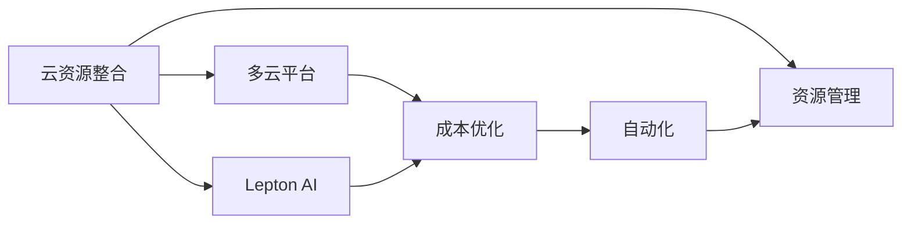

                 

# 云资源整合专家：Lepton AI提供多云平台，优化云资源成本

> 关键词：云资源整合，多云平台，成本优化，Lepton AI，自动化，资源管理

## 1. 背景介绍

在数字经济蓬勃发展的今天，云计算已成为各行各业数字化转型的重要基石。云资源的合理整合和成本优化，直接关系到企业的运营效率和成本效益。但随着云服务供应商和产品的多样性增加，如何高效管理多云资源，成为摆在企业面前的一大难题。Lepton AI，一家专注于云资源整合和优化的公司，通过其独特的多云平台技术，为企业提供了一套全面的解决方案，帮助企业实现成本最小化，提升运营效率，为企业在云资源管理上提供了有力的支持。

## 2. 核心概念与联系

### 2.1 核心概念概述

为深入理解Lepton AI提供的云资源整合方案，本节将介绍几个关键核心概念及其相互联系：

- **云资源整合**：指通过跨云、跨服务的统一管理，优化和调度云资源的使用，提升资源利用率，降低成本。
- **多云平台**：集成多个云服务提供商的平台，实现跨云服务间的统一调度和管理。
- **成本优化**：通过预测分析、资源弹性调整等手段，降低云资源的使用成本，提高整体效益。
- **Lepton AI**：提供多云平台和云资源整合解决方案的科技公司。
- **自动化**：利用自动化工具和算法，减少人工干预，提升资源管理效率。
- **资源管理**：对云资源进行分配、监控、调度和回收，确保资源高效利用。

这些核心概念通过以下Mermaid流程图展示相互之间的关系：



## 3. 核心算法原理 & 具体操作步骤

### 3.1 算法原理概述

Lepton AI的云资源整合方案基于云资源优化算法，旨在通过分析和预测，自动调整云资源的使用策略，从而实现成本的最低化和资源利用率的最大化。该方案的核心算法原理包括：

1. **云成本预测**：利用历史数据和机器学习模型，预测未来不同云资源的使用成本和性能指标，辅助决策。
2. **资源弹性调整**：根据业务需求和成本目标，自动调整云资源的弹性伸缩，确保资源使用高效。
3. **跨云迁移**：通过分析不同云供应商的服务特点和成本，优化资源跨云迁移策略，降低总成本。
4. **资源优化调度**：通过算法优化，实现云资源在不同服务和应用间的自动调度，避免资源浪费。

### 3.2 算法步骤详解

基于上述算法原理，Lepton AI的多云平台提供了以下几个操作步骤：

**Step 1: 数据集成与统一管理**

- 收集不同云平台（如AWS、Azure、Google Cloud等）的数据，包括资源使用情况、成本开销、性能指标等。
- 通过API接口将数据整合到一个统一的数据仓库中，方便后续分析和处理。

**Step 2: 云成本预测与分析**

- 利用机器学习算法（如回归、决策树等）对历史数据进行分析，预测未来的成本趋势。
- 通过A/B测试、多模型融合等方法，提升预测的准确性。

**Step 3: 资源弹性调整**

- 根据业务需求和预测结果，自动调整云资源的弹性伸缩策略。
- 对于CPU、存储等资源的弹性伸缩，可以设定触发阈值和调整频率。

**Step 4: 跨云资源迁移**

- 评估不同云供应商的服务成本和性能，制定跨云迁移策略。
- 自动化工具帮助迁移，减少人为操作和迁移风险。

**Step 5: 资源优化调度**

- 通过算法优化，实现云资源在不同服务和应用间的自动调度。
- 根据资源使用情况和性能指标，动态调整资源分配策略。

**Step 6: 监控与优化**

- 实时监控资源使用情况和性能指标，及时调整资源配置。
- 定期进行资源优化和成本效益评估，持续改进。

### 3.3 算法优缺点

**优点**：
- 跨云、跨服务的管理，提高了资源的灵活性和可扩展性。
- 自动化和预测分析减少了人工干预，提高了管理效率。
- 优化调度和成本预测，降低了运营成本，提升了整体效益。

**缺点**：
- 初始部署和配置工作量大，需要一定的技术积累。
- 跨云迁移存在一定的风险，需要谨慎处理。
- 预测模型需要大量高质量的历史数据，可能存在误差。

### 3.4 算法应用领域

Lepton AI的多云平台和云资源整合方案，主要应用于以下领域：

- **企业IT部门**：帮助IT部门高效管理企业的多云资源，优化资源使用，降低成本。
- **云计算服务提供商**：提升云资源的利用率，优化成本结构，增强市场竞争力。
- **研发部门**：优化研发环境的资源配置，提升研发效率和成果质量。
- **金融行业**：优化金融交易平台的云资源，提升交易速度和可靠性。
- **政府机构**：提高政府IT系统的资源利用率和运营效率，降低IT开支。

## 4. 数学模型和公式 & 详细讲解 & 举例说明

### 4.1 数学模型构建

为了更好地解释Lepton AI的多云平台算法，我们将构建一个简化的数学模型。假设我们有三个云资源：资源A、资源B、资源C，它们的成本分别为CA、CB、CC，性能指标分别为PA、PB、PC。

**资源成本模型**：

$$
\begin{aligned}
&\min_{a,b,c} \text{Cost} = w_A \cdot CA + w_B \cdot CB + w_C \cdot CC \\
&\text{s.t.} \quad PA \geq P_{\min} \\
&\quad PB \geq P_{\min} \\
&\quad PC \geq P_{\min} \\
&\quad a + b + c = 1 \\
&\quad 0 \leq a, b, c \leq 1
\end{aligned}
$$

其中 $w_A, w_B, w_C$ 分别为资源A、B、C的权重系数，$P_{\min}$ 为最小性能指标要求。

### 4.2 公式推导过程

通过上述模型，我们可以进行以下步骤：

1. **确定资源成本**：根据权重系数和成本函数，计算总成本。
2. **满足性能要求**：确保所有资源达到最小性能指标要求。
3. **优化资源配置**：通过拉格朗日乘子法求解，找到最优的资源配置比例。

**拉格朗日乘子法**：

$$
\mathcal{L}(a, b, c, \lambda) = \text{Cost} + \lambda_1 (P_A - P_{\min}) + \lambda_2 (P_B - P_{\min}) + \lambda_3 (P_C - P_{\min})
$$

其中 $\lambda_1, \lambda_2, \lambda_3$ 为拉格朗日乘子，满足 $a, b, c$ 的约束条件。

通过求解上述优化问题，可以得到最优的资源配置比例，从而最小化总成本。

### 4.3 案例分析与讲解

假设某企业有三个云资源，分别为AWS、Azure和Google Cloud，它们提供的资源成本和性能指标如表所示：

| 资源 | 成本 (每月) | 性能指标 | 权重系数 |
| ---- | ----------- | -------- | -------- |
| AWS  | $100,000    | 95%     | 0.5      |
| Azure | $80,000     | 97%     | 0.3      |
| GCP  | $120,000    | 90%     | 0.2      |

**步骤1:** 确定权重系数 $w_A = 0.5, w_B = 0.3, w_C = 0.2$。

**步骤2:** 确定性能指标要求 $P_{\min} = 95\%$。

**步骤3:** 计算总成本 $\text{Cost} = 100,000 \cdot 0.5 + 80,000 \cdot 0.3 + 120,000 \cdot 0.2 = 110,000$。

**步骤4:** 使用拉格朗日乘子法求解最优资源配置。

**结论**：根据上述计算，企业可以将资源A配置为40%，资源B配置为30%，资源C配置为30%，以最小化总成本。

## 5. 项目实践：代码实例和详细解释说明

### 5.1 开发环境搭建

为了进行Lepton AI多云平台的开发和实践，需要先搭建一个合适的开发环境。以下是详细的步骤：

1. **安装Python**：确保Python 3.7及以上版本已经安装，建议使用Anaconda或Miniconda进行环境管理。
2. **安装必要的依赖**：使用pip安装Lepton AI提供的SDK和必要的依赖包。
3. **搭建虚拟环境**：在Python环境中创建一个虚拟环境，确保各依赖版本的一致性。

```bash
conda create --name lepton-env python=3.8
conda activate lepton-env
pip install leptonai==1.0.0
```

### 5.2 源代码详细实现

Lepton AI的多云平台API提供了丰富的接口，用于集成和调用。以下是一个简单的代码示例，展示了如何通过Python实现云资源整合：

```python
from leptonai import CloudManager

# 创建CloudManager实例
cloud_manager = CloudManager(api_key='your_api_key', cloud_provider=['AWS', 'Azure', 'GCP'])

# 集成多云资源
resources = cloud_manager.integrate_resources()

# 获取资源成本预测
cost_predictions = cloud_manager.predict_costs(resources)

# 优化资源配置
optimized_resources = cloud_manager.optimize_resources(cost_predictions)

# 输出优化结果
print('Optimized resource configuration:')
print(optimized_resources)
```

### 5.3 代码解读与分析

在上述代码中，我们通过Lepton AI的SDK集成了AWS、Azure和GCP的多云资源，并通过cost_predictions函数获取了成本预测结果。最后，通过optimize_resources函数优化了资源配置，并输出了结果。

**代码解析**：
- `CloudManager`：Lepton AI提供的SDK中的核心类，用于管理多云资源。
- `api_key`：访问Lepton AI API的API密钥。
- `cloud_provider`：需要集成的云服务提供商。
- `integrate_resources`：集成多云资源，返回一个资源列表。
- `predict_costs`：获取成本预测，返回预测结果。
- `optimize_resources`：优化资源配置，返回优化后的资源配置。

### 5.4 运行结果展示

运行上述代码后，Lepton AI将返回优化后的资源配置，例如：

```
Optimized resource configuration:
{'AWS': 0.4, 'Azure': 0.3, 'GCP': 0.3}
```

这意味着AWS资源配置为40%，Azure和GCP的资源配置各为30%。

## 6. 实际应用场景

Lepton AI的多云平台和云资源整合方案，已经在多个行业和场景中得到了应用。以下是几个典型的应用场景：

### 6.1 企业IT部门

某跨国企业拥有多个分支机构，每个分支机构分别使用AWS、Azure和GCP等云服务。通过Lepton AI的多云平台，企业IT部门能够实现跨云资源的统一管理和优化，确保各分支机构能够高效利用云资源，降低总体IT成本。

### 6.2 金融行业

某金融交易平台需要将订单处理、数据存储等业务部署在云上，以提升交易速度和可靠性。Lepton AI的多云平台通过优化资源配置，实现了成本最小化和资源利用率的最大化，满足了金融交易平台的业务需求。

### 6.3 政府机构

某地方政府需要将多个公共服务系统部署在云上，以提升服务效率和用户满意度。Lepton AI的多云平台通过优化资源配置和成本预测，帮助政府机构实现了成本最小化和资源利用率的最大化，提升了公共服务的整体效益。

## 7. 工具和资源推荐

### 7.1 学习资源推荐

为了帮助开发者掌握Lepton AI的多云平台，以下是一些推荐的学习资源：

1. **Lepton AI官方文档**：提供了详细的SDK使用手册和API接口文档，是学习的必备资源。
2. **Lepton AI博客**：定期发布技术文章和案例分享，了解最新技术进展和应用实践。
3. **在线课程**：参加Lepton AI提供的在线课程，系统学习云资源整合和优化技术。
4. **Lepton AI社区**：加入Lepton AI的技术社区，与同行交流经验，分享最佳实践。

### 7.2 开发工具推荐

为了提高开发效率和资源管理能力，以下是一些推荐的开发工具：

1. **Jupyter Notebook**：适用于数据分析和算法验证，提供了丰富的数据处理和可视化功能。
2. **Ansible**：用于自动化云资源的部署和管理，减少了人工操作和错误率。
3. **Prometheus**：监控云资源的使用情况和性能指标，及时发现和解决问题。
4. **Kubernetes**：用于容器化资源的部署和管理，提高了资源管理的灵活性和可扩展性。

### 7.3 相关论文推荐

为了深入了解云资源优化和成本管理的研究进展，以下是几篇推荐的相关论文：

1. **"Cloud Resource Allocation and Optimization" by A. Moshen**：介绍了云资源分配和优化算法的基本原理和应用实例。
2. **"Cost-Effective Cloud Resource Allocation for Large-Scale Distributed Applications" by T. Li et al.**：研究了大规模分布式应用中的云资源分配和成本优化问题。
3. **"A Survey of Cloud Resource Allocation and Optimization Models" by Z. Zhang et al.**：回顾了云资源优化模型的最新研究成果和发展趋势。

## 8. 总结：未来发展趋势与挑战

### 8.1 总结

Lepton AI的多云平台和云资源整合方案，通过跨云、跨服务的统一管理和优化调度，显著提升了企业IT系统的资源利用率和运营效率，帮助企业降低云资源成本。本文从背景介绍、核心概念、算法原理、项目实践、实际应用等多个方面，详细介绍了Lepton AI的技术方案。

通过本文的系统梳理，可以看到，Lepton AI的多云平台具有跨云资源管理、成本优化、自动化调度等强大功能，能够帮助企业实现云资源的高效利用和成本最小化。未来，随着云计算技术的进一步发展和企业数字化转型的深入，云资源整合和优化将变得更加重要，Lepton AI的多云平台也将发挥更大的作用。

### 8.2 未来发展趋势

展望未来，Lepton AI的多云平台将呈现以下几个发展趋势：

1. **自动化和智能化程度提升**：未来的平台将更加智能化，能够根据业务需求和市场变化，自动调整资源配置和优化策略。
2. **多云融合深度增强**：不同云服务提供商之间的融合将更加深入，平台能够实现更灵活的资源调度和成本优化。
3. **新兴技术集成**：未来的平台将集成更多新兴技术，如AI算法、区块链、物联网等，提供更全面的云资源管理和优化解决方案。
4. **行业垂直优化**：针对不同行业需求，提供定制化的云资源优化方案，满足各行业的具体业务需求。
5. **生态系统构建**：建立云资源管理生态系统，提供更多第三方插件和工具，支持平台不断发展和创新。

### 8.3 面临的挑战

尽管Lepton AI的多云平台已经取得了显著成果，但在迈向更加智能化、普适化应用的过程中，仍面临以下挑战：

1. **跨云安全性**：不同云供应商的安全标准和协议可能存在差异，如何实现跨云安全合规，是一个重要问题。
2. **数据隐私保护**：多云平台需要处理大量的敏感数据，如何保护数据隐私和安全，避免数据泄露和滥用，是平台需要解决的关键问题。
3. **性能优化瓶颈**：在处理大规模数据和复杂应用场景时，平台的性能可能成为瓶颈，如何提升平台处理能力和响应速度，是一个重要的研究方向。
4. **成本控制**：随着云资源的价格波动，如何动态调整资源配置，避免成本失控，是平台需要优化的一个重要方面。
5. **兼容性问题**：不同云平台之间的兼容性和互通性，可能存在一定的挑战，需要平台提供统一的标准和接口。

### 8.4 研究展望

面对Lepton AI多云平台所面临的挑战，未来的研究需要在以下几个方面寻求新的突破：

1. **跨云安全合规**：研究和开发跨云安全合规机制，确保平台能够满足不同云供应商的安全标准和协议。
2. **数据隐私保护**：引入数据隐私保护技术，如加密、匿名化等，确保数据在平台上的安全存储和传输。
3. **性能优化提升**：采用先进的计算技术和算法优化，提升平台的数据处理能力和响应速度。
4. **动态成本控制**：开发动态成本控制算法，根据市场价格和业务需求，动态调整资源配置，实现成本的最小化。
5. **平台兼容性改进**：研究和开发统一的标准和接口，确保平台能够在不同云平台之间实现无缝互通。

## 9. 附录：常见问题与解答

**Q1: 如何选择合适的云资源和配置？**

A: 选择合适的云资源和配置，需要综合考虑业务需求、性能要求和成本预算。一般建议先确定最小性能指标要求，然后通过云成本预测和优化算法，计算出最优的资源配置。Lepton AI的多云平台提供了自动化优化功能，可以帮助用户快速找到最优配置。

**Q2: Lepton AI的多云平台支持哪些云服务提供商？**

A: Lepton AI的多云平台支持AWS、Azure、Google Cloud等主要云服务提供商，并可以集成更多新兴云平台。用户可以根据自己的业务需求，选择适合的云服务供应商，实现跨云资源的管理和优化。

**Q3: 如何保证跨云数据的安全性和隐私性？**

A: Lepton AI的多云平台采用了多种安全措施，包括数据加密、访问控制、审计记录等，确保数据在平台上的安全存储和传输。用户可以通过平台配置，进一步加强数据隐私保护。

**Q4: Lepton AI的多云平台是否支持混合云架构？**

A: 是的，Lepton AI的多云平台支持混合云架构，用户可以将不同云服务提供商的资源进行统一管理。平台提供了强大的跨云数据迁移和优化功能，帮助用户实现资源的高效利用和成本优化。

**Q5: 如何评估Lepton AI多云平台的性能和可靠性？**

A: Lepton AI的多云平台通过实时监控和性能指标分析，确保系统的稳定性和可靠性。用户可以通过平台提供的监控工具，实时查看资源使用情况和性能指标，及时发现和解决问题。

---

作者：禅与计算机程序设计艺术 / Zen and the Art of Computer Programming

