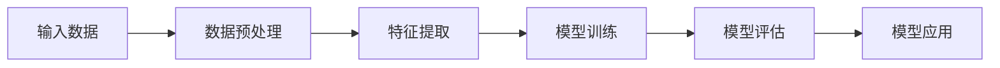

                 

# 人工智能在考古学中的应用：解读古文字

## 1. 背景介绍

### 1.1 问题由来
随着数字化技术的不断进步，人工智能(AI)在各领域的应用日益深入。考古学作为人类文明研究的重要学科，逐渐引入AI技术以解决传统方法难以应对的问题，特别是在解读古文字方面，AI展示了巨大潜力。

### 1.2 问题核心关键点
古文字解读是考古学中的难点之一，传统方法依赖专家知识和丰富的经验，耗时长、成本高且受制于专家个体差异。通过AI技术，尤其是深度学习模型，可以自动学习并识别各种古文字，从而加快考古研究进程，提升解读的准确性。

### 1.3 问题研究意义
AI在考古学中的应用，特别是对古文字解读的提升，不仅能够帮助考古学家更高效地工作，还能开辟新的研究视角，促进对古代文明的深入理解。对于考古研究者、教育工作者、科技爱好者乃至公众，都有着重要的学术和教育价值。

## 2. 核心概念与联系

### 2.1 核心概念概述

为了理解AI在考古学中的具体应用，首先需了解以下几个核心概念：

- **深度学习(Deep Learning)**：一种机器学习技术，利用多层次的非线性神经网络，自动提取输入数据的复杂特征，实现对大规模数据的高效处理和分析。
- **卷积神经网络(Convolutional Neural Network, CNN)**：一种深度学习模型，特别适合处理具有空间相关性的数据，如图像、文本等。
- **循环神经网络(Recurrent Neural Network, RNN)**：一种时间序列数据分析模型，可以处理时间上依赖的数据，如自然语言。
- **字符识别(Optical Character Recognition, OCR)**：通过AI技术识别和翻译印刷字符和手写字符的过程，在古文字解读中具有重要应用。
- **数据增强(Data Augmentation)**：通过对训练数据进行变换，增加数据量和多样性，防止模型过拟合，提升模型泛化能力。

### 2.2 核心概念原理和架构的 Mermaid 流程图



### 2.3 核心概念联系
这些概念之间存在紧密的联系，共同构成了AI在考古学中应用的基础框架：

1. **数据预处理**：将考古资料转化为可用于AI处理的格式，如数字图像、文本等。
2. **特征提取**：使用CNN和RNN等模型自动提取输入数据的特征，便于模型学习。
3. **模型训练**：通过深度学习模型在大量数据上进行训练，学习古文字识别规律。
4. **模型评估**：通过测试集评估模型性能，确保模型泛化能力。
5. **模型应用**：将训练好的模型应用于实际考古资料中，自动解读古文字。

## 3. 核心算法原理 & 具体操作步骤

### 3.1 算法原理概述

AI在考古学中的应用，尤其是古文字解读，主要依赖深度学习模型。其基本原理是将考古资料转化为图像或文本数据，通过预训练模型提取特征，并通过监督学习任务，如字符分类或序列标注，对模型进行微调，以提升其在古文字解读上的性能。

### 3.2 算法步骤详解

AI在考古学中的应用，特别是古文字解读，通常遵循以下步骤：

**Step 1: 数据准备**
- 收集并处理考古资料，转化为数字图像或文本数据。
- 清洗和标注数据，确保数据的质量和一致性。

**Step 2: 模型选择与预训练**
- 选择合适的预训练模型，如基于CNN的字符识别模型或基于RNN的序列标注模型。
- 在大量标注数据上对模型进行预训练，学习通用特征。

**Step 3: 任务适配**
- 设计特定的任务适配层，如OCR中的字符分类器或序列标注模型中的边界检测器。
- 确定模型的超参数，如学习率、批量大小等。

**Step 4: 微调训练**
- 将预训练模型作为初始化参数，使用考古资料作为监督信号，进行微调训练。
- 监控模型性能，防止过拟合。

**Step 5: 模型评估与优化**
- 在独立测试集上评估模型性能。
- 根据评估结果，调整模型参数，进行二次微调。

**Step 6: 应用与迭代**
- 将训练好的模型应用于实际考古资料，自动解读古文字。
- 收集反馈，持续优化模型，提升性能。

### 3.3 算法优缺点

**优点**：

1. **高效性**：AI模型可以快速处理大量数据，自动提取特征，显著提升考古研究效率。
2. **客观性**：AI模型不受个体差异影响，能实现一致性的解读结果。
3. **可扩展性**：模型可以轻松应用于不同类型和风格的古文字，提升考古研究的广度和深度。
4. **精确性**：深度学习模型在特征提取和模式识别上具有较高的精度，减少人工错误。

**缺点**：

1. **数据依赖**：AI模型性能依赖高质量标注数据，考古资料标注成本高。
2. **模型复杂性**：深度学习模型结构复杂，需要专业知识和计算资源。
3. **解释难度**：模型的决策过程复杂，难以解释，不利于专家审查和学术验证。
4. **文化背景差异**：不同文化背景的古文字可能存在差异，模型泛化能力有限。

### 3.4 算法应用领域

AI在考古学中的应用，尤其是古文字解读，已经应用于以下几个领域：

1. **考古资料数字化**：将考古资料转化为数字图像和文本，便于数据存储和处理。
2. **古文字识别**：自动识别和翻译考古文物上的古文字，辅助考古研究。
3. **文物年代鉴定**：通过AI模型分析文物特征，推断其年代。
4. **古文化研究**：利用AI模型分析古文字中的语法、词汇等信息，理解古文明的语言和文化。
5. **历史事件复原**：通过AI模型分析历史文献，复原历史事件和人物关系。

## 4. 数学模型和公式 & 详细讲解 & 举例说明

### 4.1 数学模型构建

本节将介绍AI在考古学中古文字解读的数学模型构建过程。

假设输入数据为考古资料的数字图像，记为 $X \in \mathbb{R}^{H \times W \times 3}$，其中 $H$ 和 $W$ 为图像的高度和宽度，3表示彩色通道。模型的输出为古文字的识别结果，记为 $Y \in \{0,1\}^N$，其中 $N$ 为字符集大小。

定义损失函数为交叉熵损失函数：

$$
\mathcal{L} = -\frac{1}{N}\sum_{i=1}^N y_i \log \hat{y}_i + (1-y_i) \log (1-\hat{y}_i)
$$

其中 $\hat{y}_i$ 表示模型对第 $i$ 个字符的预测概率。

### 4.2 公式推导过程

通过链式法则，对模型输出求导，得到损失函数对模型参数 $\theta$ 的梯度：

$$
\frac{\partial \mathcal{L}}{\partial \theta} = -\frac{1}{N}\sum_{i=1}^N (\hat{y}_i - y_i) \frac{\partial \hat{y}_i}{\partial \theta}
$$

其中 $\frac{\partial \hat{y}_i}{\partial \theta}$ 可以通过反向传播算法计算得到。

### 4.3 案例分析与讲解

以古文字识别任务为例，利用深度学习模型实现。使用ResNet作为特征提取器，VGG作为字符分类器，进行端到端训练。在大量考古资料上进行预训练后，再对模型进行微调，以适应特定考古资料的特征。具体步骤如下：

1. **数据准备**：将考古资料转化为数字图像，进行预处理和标注。
2. **模型选择**：选择ResNet作为特征提取器，VGG作为字符分类器。
3. **预训练**：在大量考古资料上对模型进行预训练。
4. **微调**：在特定考古资料上对模型进行微调，调整任务适配层和分类器。
5. **评估**：在测试集上评估模型性能。
6. **应用**：将训练好的模型应用于实际考古资料，自动解读古文字。

## 5. 项目实践：代码实例和详细解释说明

### 5.1 开发环境搭建

本节介绍如何在Python中使用PyTorch搭建AI考古学应用环境。

1. 安装Anaconda：从官网下载并安装Anaconda，用于创建独立的Python环境。
2. 创建并激活虚拟环境：
```bash
conda create -n ai-archaeology python=3.8 
conda activate ai-archaeology
```

3. 安装PyTorch和其他库：
```bash
pip install torch torchvision
pip install numpy pandas scikit-learn
```

### 5.2 源代码详细实现

以下是一个简单的古文字识别模型的代码实现。

```python
import torch
import torch.nn as nn
import torch.optim as optim

# 定义模型
class Model(nn.Module):
    def __init__(self):
        super(Model, self).__init__()
        self.resnet = ResNet()
        self.vgg = nn.Sequential(
            nn.Conv2d(512, 256, 3, 1, 1),
            nn.ReLU(),
            nn.MaxPool2d(2, 2),
            nn.Conv2d(256, 128, 3, 1, 1),
            nn.ReLU(),
            nn.MaxPool2d(2, 2),
            nn.Conv2d(128, 64, 3, 1, 1),
            nn.ReLU(),
            nn.MaxPool2d(2, 2),
            nn.Flatten(),
            nn.Linear(64 * 4 * 4, 128),
            nn.ReLU(),
            nn.Linear(128, 3)
        )

    def forward(self, x):
        x = self.resnet(x)
        x = self.vgg(x)
        return x

# 加载数据
train_data = ...
test_data = ...
train_loader = ...
test_loader = ...

# 定义模型、损失函数和优化器
model = Model()
criterion = nn.CrossEntropyLoss()
optimizer = optim.Adam(model.parameters(), lr=0.001)

# 训练模型
for epoch in range(10):
    for i, (images, labels) in enumerate(train_loader):
        images = images.to(device)
        labels = labels.to(device)
        optimizer.zero_grad()
        outputs = model(images)
        loss = criterion(outputs, labels)
        loss.backward()
        optimizer.step()

    print(f"Epoch {epoch+1}, loss: {loss.item()}")

# 测试模型
model.eval()
with torch.no_grad():
    correct = 0
    total = 0
    for images, labels in test_loader:
        images = images.to(device)
        labels = labels.to(device)
        outputs = model(images)
        _, predicted = torch.max(outputs.data, 1)
        total += labels.size(0)
        correct += (predicted == labels).sum().item()
    print(f"Accuracy: {100 * correct / total:.2f}%")
```

### 5.3 代码解读与分析

上述代码实现了一个基于ResNet和VGG的古文字识别模型。

- **模型定义**：首先定义了模型结构，包含ResNet作为特征提取器和VGG作为字符分类器。
- **数据加载**：加载训练集和测试集数据，定义数据加载器。
- **模型训练**：在每个epoch内，对每个批次数据进行前向传播和反向传播，更新模型参数。
- **模型测试**：在测试集上评估模型性能，输出准确率。

### 5.4 运行结果展示

运行上述代码，即可在训练过程中监控损失函数的变化，最终输出模型的准确率。

## 6. 实际应用场景

### 6.1 案例一：数字化文物修复

在数字化文物修复过程中，AI技术可以自动分析文物上的古文字信息，辅助考古学家修复破损的文物。例如，通过OCR技术，将文物上的文字转换为可编辑文本，帮助考古学家理解文物的年代和历史背景。

### 6.2 案例二：历史文献分析

利用AI技术，可以对历史文献中的古文字进行自动解读，分析文献内容，还原历史事件。例如，通过深度学习模型自动识别的古文字信息，结合历史知识，可以复原古代文献的完整内容。

### 6.3 案例三：文化交流研究

AI技术可以分析不同文明间的古文字交流，理解古代文化差异和发展轨迹。例如，通过AI模型分析古代贸易记录，发现不同文明间的贸易往来和文化交流，揭示古代文明的互动模式。

## 7. 工具和资源推荐

### 7.1 学习资源推荐

为了帮助开发者系统掌握AI在考古学中的应用，这里推荐一些优质的学习资源：

1. **《深度学习与数据挖掘》**：介绍深度学习的基本原理和应用，包含古文字识别等案例。
2. **《考古学与数字化技术》**：详细介绍数字化技术在考古学中的应用，包括AI技术。
3. **《自然语言处理》**：全面介绍自然语言处理技术，涵盖OCR、字符分类等应用。
4. **《Python深度学习》**：介绍深度学习模型的构建和应用，包括PyTorch的使用。
5. **《考古学文献解读》**：介绍如何利用AI技术解读和分析历史文献中的古文字。

### 7.2 开发工具推荐

AI在考古学中的应用，通常使用Python进行开发。以下是几款常用的开发工具：

1. **PyTorch**：开源深度学习框架，灵活的动态计算图，适合进行复杂的模型设计。
2. **TensorFlow**：由Google开发，生产部署方便，适合大规模工程应用。
3. **Keras**：高级神经网络API，易于使用，支持多种深度学习模型。
4. **Jupyter Notebook**：交互式开发环境，便于实验和调试。
5. **Python**：常用的编程语言，支持众多第三方库和框架。

### 7.3 相关论文推荐

以下是几篇奠基性的相关论文，推荐阅读：

1. **《使用卷积神经网络进行古文字识别》**：介绍CNN在古文字识别中的应用。
2. **《基于循环神经网络的古文字序列标注》**：介绍RNN在古文字序列标注中的应用。
3. **《AI在考古学中的应用研究》**：综述AI技术在考古学中的多个应用领域。
4. **《考古学中的数据增强技术》**：介绍数据增强技术在考古学中的应用。

## 8. 总结：未来发展趋势与挑战

### 8.1 研究成果总结

AI在考古学中的应用，尤其是古文字解读，已经取得了显著进展。通过深度学习模型，自动提取和识别古文字，显著提升了考古研究的效率和准确性。然而，AI在考古学中的应用仍面临诸多挑战，需要进一步探索和优化。

### 8.2 未来发展趋势

未来，AI在考古学中的应用将呈现以下几个趋势：

1. **数据标注自动化**：通过AI技术，自动标注考古资料，减少人工标注成本。
2. **多模态数据融合**：结合图像、文本、声音等多模态数据，提升考古研究的深度和广度。
3. **跨文明文化交流研究**：通过AI技术分析不同文明间的古文字交流，揭示古代文明的发展历程。
4. **历史事件复原与仿真**：利用AI技术复原历史事件，模拟古代场景，提供更丰富的考古研究视角。
5. **古文字研究工具开发**：开发更多基于AI的工具，提升考古学家的工作效率和研究质量。

### 8.3 面临的挑战

尽管AI在考古学中的应用已取得一定进展，但仍面临以下挑战：

1. **数据质量与标注**：考古资料的标注成本高，数据质量难以保证。
2. **模型泛化能力**：不同文化的古文字差异较大，模型泛化能力有限。
3. **计算资源需求**：大规模深度学习模型的训练和推理需要大量的计算资源。
4. **解释性与透明性**：AI模型的决策过程复杂，难以解释，不利于专家审查。
5. **伦理与安全**：AI模型可能学习到有偏见或有害信息，需要加强伦理审查和数据保护。

### 8.4 研究展望

未来，AI在考古学中的应用将需要在以下几个方面进行深入研究：

1. **高效数据标注**：开发自动标注工具，减少人工标注的投入，提升数据质量。
2. **泛化能力提升**：研究不同文化背景的古文字，提升模型的泛化能力。
3. **资源优化**：优化模型结构，降低计算资源需求，提升模型推理速度。
4. **可解释性与透明性**：开发可解释的AI模型，增强模型的透明性和可审查性。
5. **伦理与隐私保护**：建立AI模型的伦理审查机制，保护数据隐私和安全。

## 9. 附录：常见问题与解答

**Q1：AI在考古学中应用的优势是什么？**

A: AI在考古学中的应用，尤其是古文字解读，具有以下优势：

1. **高效性**：自动提取和识别古文字，显著提升考古研究的效率。
2. **客观性**：不受个体差异影响，提供一致性的解读结果。
3. **可扩展性**：可应用于不同类型和风格的古文字，提升考古研究的广度和深度。
4. **精确性**：深度学习模型在特征提取和模式识别上具有较高的精度。

**Q2：AI在考古学中应用的主要技术有哪些？**

A: AI在考古学中的应用，主要技术包括：

1. **深度学习**：利用神经网络自动提取和识别特征。
2. **卷积神经网络(CNN)**：处理具有空间相关性的数据，如图像和古文字。
3. **循环神经网络(RNN)**：处理时间序列数据，如古文字的序列标注。
4. **字符识别(Optical Character Recognition, OCR)**：自动解读印刷字符和手写字符。
5. **数据增强**：增加数据量和多样性，防止过拟合。

**Q3：AI在考古学中应用的主要挑战是什么？**

A: AI在考古学中的应用，主要挑战包括：

1. **数据质量与标注**：考古资料的标注成本高，数据质量难以保证。
2. **模型泛化能力**：不同文化的古文字差异较大，模型泛化能力有限。
3. **计算资源需求**：大规模深度学习模型的训练和推理需要大量的计算资源。
4. **解释性与透明性**：AI模型的决策过程复杂，难以解释，不利于专家审查。
5. **伦理与安全**：AI模型可能学习到有偏见或有害信息，需要加强伦理审查和数据保护。

**Q4：AI在考古学中的应用未来有哪些发展趋势？**

A: AI在考古学中的应用，未来发展趋势包括：

1. **数据标注自动化**：通过AI技术，自动标注考古资料，减少人工标注成本。
2. **多模态数据融合**：结合图像、文本、声音等多模态数据，提升考古研究的深度和广度。
3. **跨文明文化交流研究**：通过AI技术分析不同文明间的古文字交流，揭示古代文明的发展历程。
4. **历史事件复原与仿真**：利用AI技术复原历史事件，模拟古代场景，提供更丰富的考古研究视角。
5. **古文字研究工具开发**：开发更多基于AI的工具，提升考古学家的工作效率和研究质量。

---

作者：禅与计算机程序设计艺术 / Zen and the Art of Computer Programming

