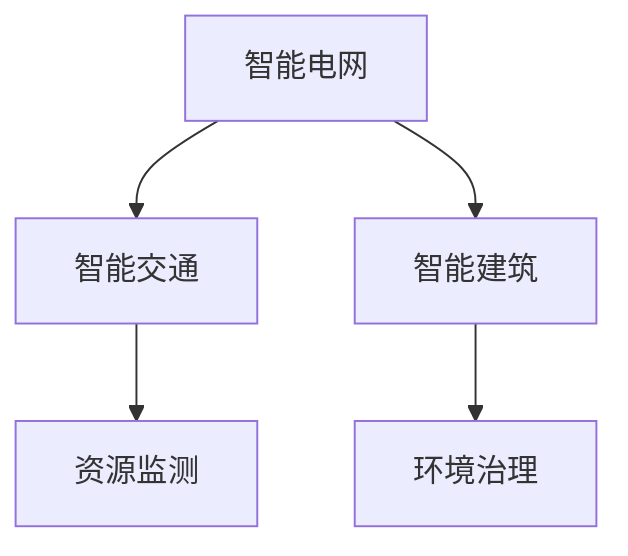

                 

# 人工智能在能源和环境中的应用

## 1. 背景介绍

### 1.1 问题由来
随着全球能源消耗的不断增加，环境污染和资源枯竭的问题日益突出。与此同时，人工智能(AI)技术的飞速发展为解决这些问题提供了新的途径。通过智能化、自动化的手段，AI可以显著提升能源利用效率，降低环境污染，助力实现可持续发展目标。

### 1.2 问题核心关键点
人工智能在能源和环境领域的应用主要包括智能电网、智能交通、智能建筑、资源监测和环境治理等。这些应用利用机器学习、深度学习等技术，从数据中挖掘规律，优化决策过程，实现能源的高效利用和环境保护。

### 1.3 问题研究意义
人工智能在能源和环境领域的应用，对于推动能源革命、改善环境质量、提升资源利用效率、促进绿色经济发展具有重要意义：

1. 推动能源结构转型。智能电网和能源管理系统通过优化电力供应和使用，实现可再生能源的并网和智能分配，有助于提升清洁能源的占比，减少化石燃料依赖。
2. 提升资源利用效率。智能建筑和节能系统通过自动化控制和优化，显著降低能源消耗，提升水资源和材料资源的利用效率。
3. 改善环境质量。智能交通和环境监测系统通过数据分析和预测，优化出行和工业排污，降低温室气体排放和污染物浓度，改善空气和水质。
4. 促进绿色经济发展。AI技术在环境治理中的应用，为循环经济和绿色制造提供数据支持和决策工具，推动经济可持续发展。

## 2. 核心概念与联系

### 2.1 核心概念概述

为更好地理解人工智能在能源和环境中的应用，本节将介绍几个密切相关的核心概念：

- 智能电网(Smart Grid)：通过广泛应用先进信息技术和通信技术，实现电网的智能化，提升电能传输效率和可靠性。
- 智能交通(Intelligent Transport System, ITS)：利用AI技术优化交通流量控制、提升交通安全和减少环境污染。
- 智能建筑(Smart Building)：通过AI技术实现建筑物的自动化和智能化管理，提高能源利用效率。
- 资源监测(Resource Monitoring)：利用AI技术对水、能源等资源进行监测，实现精准管理与合理调配。
- 环境治理(Environmental Governance)：通过AI技术辅助环境监测、污染治理、资源利用等，推动生态文明建设。

这些核心概念之间的逻辑关系可以通过以下Mermaid流程图来展示：



这个流程图展示出人工智能在能源和环境领域的应用逻辑：

1. 智能电网通过AI技术实现电力智能化管理。
2. 智能交通通过AI技术优化交通流，降低污染。
3. 智能建筑通过AI技术实现节能减排。
4. 资源监测通过AI技术提升资源利用率。
5. 环境治理通过AI技术辅助污染治理和生态保护。

## 3. 核心算法原理 & 具体操作步骤
### 3.1 算法原理概述

人工智能在能源和环境领域的应用，通常涉及大量的数据收集、处理和分析，以及智能决策和控制。其核心算法包括机器学习、深度学习、强化学习等。

### 3.2 算法步骤详解

#### 3.2.1 数据采集与预处理
- 利用传感器、监测设备等手段收集能源和环境数据，包括电力负荷、交通流量、空气质量、水质等。
- 对采集到的原始数据进行清洗、去噪、归一化等预处理，确保数据的质量和可用性。

#### 3.2.2 特征提取与建模
- 使用特征工程技术从原始数据中提取有用的特征，如时序特征、空间特征、统计特征等。
- 基于提取的特征，应用机器学习算法构建预测模型，如回归模型、分类模型、聚类模型等。

#### 3.2.3 模型训练与优化
- 使用历史数据训练模型，并根据实际应用需求调整模型参数，优化模型性能。
- 通过交叉验证等方法评估模型效果，调整模型结构和超参数。

#### 3.2.4 智能决策与控制
- 利用训练好的模型进行实时数据分析和决策，如智能调度、路径优化、能耗管理等。
- 通过实时反馈系统不断调整模型参数，提升决策准确性和实时性。

### 3.3 算法优缺点

人工智能在能源和环境领域的应用具有以下优点：
1. 高效处理海量数据。AI技术能够处理和分析大量的复杂数据，从中提取有用的信息，辅助决策。
2. 提升系统自动化水平。通过智能化控制，降低人为干预，提高系统可靠性和效率。
3. 优化资源配置。AI技术可以优化电力、交通、水资源等的分配和使用，提升利用效率。
4. 降低环境污染。AI技术可以优化交通流、工业排污，减少污染物排放，改善环境质量。

同时，这些应用也存在一些局限性：
1. 数据质量依赖性高。AI模型依赖于高质量、完备的数据，数据缺失或不准确会影响模型效果。
2. 模型复杂度高。大规模数据和复杂模型的训练，需要较高的计算资源和硬件支持。
3. 决策过程不透明。AI模型的决策过程通常较为复杂，难以理解和解释，存在一定的“黑箱”问题。
4. 存在伦理风险。AI应用涉及隐私保护、数据安全、决策公正性等问题，需要严格监管和规范。

### 3.4 算法应用领域

人工智能在能源和环境领域的应用涵盖了诸多方面，以下是几个主要领域：

#### 3.4.1 智能电网
- 智能调度和负荷预测：通过预测电力需求和供应，优化电力分配，提升电网运行效率。
- 电力市场分析：利用机器学习分析电力市场数据，预测价格走势，辅助电力交易。
- 智能电表和充电站：通过智能电表和充电站的管理，优化电力使用和新能源充电。

#### 3.4.2 智能交通
- 交通流量预测和优化：通过预测交通流量，优化交通信号灯控制，缓解交通拥堵。
- 自动驾驶和车联网：利用AI技术实现自动驾驶和车联网，提升交通安全和效率。
- 共享交通和出行规划：通过AI技术优化共享单车、共享汽车等的布局和管理，提供个性化出行方案。

#### 3.4.3 智能建筑
- 能源管理与监控：通过智能传感器和控制系统，实现能源的自动化管理和优化。
- 能效分析和优化：利用AI技术分析建筑能耗数据，提供节能建议和优化方案。
- 建筑安全与维护：通过AI技术监测和分析建筑物的运行状态，及时发现和处理异常。

#### 3.4.4 资源监测
- 水资源监测与优化：利用AI技术监测水质、水量、水压等参数，优化水资源分配和使用。
- 能源监测与管理：通过AI技术监测能源消耗和生产，优化能源配置和管理。
- 环境监测与治理：利用AI技术监测空气、水质、土壤等环境参数，辅助环境治理和保护。

## 4. 数学模型和公式 & 详细讲解 & 举例说明
### 4.1 数学模型构建

本节将使用数学语言对人工智能在能源和环境中的应用进行更加严格的刻画。

记智能电网中的电力需求和供应为 $D_t$ 和 $S_t$，智能交通中的交通流量为 $F_t$，智能建筑中的能耗为 $E_t$，资源监测中的水资源量为 $W_t$。则模型的输入为 $x_t = (D_t, S_t, F_t, E_t, W_t)$，目标为预测未来一段时间内的电力、交通、建筑和资源的使用情况。

定义模型 $M(x_t)$ 的预测输出为 $\hat{y}_t$，则模型的预测误差为 $e_t = y_t - \hat{y}_t$，其中 $y_t$ 为实际观测值。模型的损失函数为：

$$
\mathcal{L}(M) = \frac{1}{N}\sum_{t=1}^N e_t^2
$$

在训练过程中，通过梯度下降等优化算法，最小化损失函数 $\mathcal{L}(M)$，得到最优模型参数 $\theta^*$。

### 4.2 公式推导过程

以智能电网中的电力负荷预测为例，推导回归模型的预测公式。

假设电力负荷 $D_t$ 和历史数据 $x_t$ 之间的关系为线性回归模型：

$$
D_t = \alpha + \beta x_t + \epsilon_t
$$

其中 $\epsilon_t$ 为误差项，假设 $\epsilon_t$ 服从均值为0、方差为 $\sigma^2$ 的正态分布。则预测误差的方差为：

$$
Var(e_t) = Var(D_t - \hat{D}_t) = \sigma^2
$$

最小化损失函数 $\mathcal{L}(M)$ 等价于最小化预测误差的方差，即：

$$
\hat{D}_t = \alpha + \beta x_t
$$

在实际应用中，可以通过历史数据训练回归模型，得到 $\alpha$ 和 $\beta$ 的估计值，进而对未来电力负荷进行预测。

### 4.3 案例分析与讲解

#### 4.3.1 智能电网负荷预测

某智能电网公司利用AI技术对电力负荷进行预测，采用线性回归模型作为预测模型，模型参数通过历史数据训练得到。模型的训练步骤如下：

1. 收集智能电表的历史数据，包括时间、日期、天气、事件等特征。
2. 对数据进行预处理，包括去噪、归一化等。
3. 使用历史数据训练线性回归模型，得到模型参数 $\alpha$ 和 $\beta$。
4. 利用训练好的模型对未来一周的电力负荷进行预测，并根据预测结果调整电力分配。

在模型训练和应用过程中，需要注意以下几点：

- 数据质量对模型效果有重要影响，需要确保数据的时序性和完备性。
- 模型参数的初始值对训练结果有影响，可以通过交叉验证等方法选择最优参数。
- 模型的预测结果需要结合实际情况进行调整，避免过度拟合。

#### 4.3.2 智能交通流量预测

某城市交通管理中心利用AI技术对交通流量进行预测，采用时间序列预测模型作为预测模型。模型的训练步骤如下：

1. 收集历史交通流量数据，包括时间、日期、天气、事件等特征。
2. 对数据进行预处理，包括去噪、归一化等。
3. 使用历史数据训练时间序列预测模型，得到模型参数。
4. 利用训练好的模型对未来一小时的交通流量进行预测，并根据预测结果调整交通信号灯控制策略。

在模型训练和应用过程中，需要注意以下几点：

- 数据的时序性对模型效果有重要影响，需要确保数据的连续性和完整性。
- 模型的预测结果需要结合实际情况进行调整，避免过度拟合。
- 模型的预测结果需要及时反馈到交通管理中心，辅助决策和控制。

## 5. 项目实践：代码实例和详细解释说明
### 5.1 开发环境搭建

在进行AI应用开发前，我们需要准备好开发环境。以下是使用Python进行TensorFlow开发的环境配置流程：

1. 安装Anaconda：从官网下载并安装Anaconda，用于创建独立的Python环境。

2. 创建并激活虚拟环境：
```bash
conda create -n ai-env python=3.8 
conda activate ai-env
```

3. 安装TensorFlow：从官网获取对应的安装命令，如使用GPU加速：
```bash
conda install tensorflow -c pytorch -c conda-forge
```

4. 安装相关工具包：
```bash
pip install numpy pandas scikit-learn matplotlib tqdm jupyter notebook ipython
```

完成上述步骤后，即可在`ai-env`环境中开始AI应用开发。

### 5.2 源代码详细实现

下面我们以智能电网负荷预测为例，给出使用TensorFlow对线性回归模型进行训练的PyTorch代码实现。

首先，定义数据处理函数：

```python
import pandas as pd
from sklearn.model_selection import train_test_split
from tensorflow.keras.models import Sequential
from tensorflow.keras.layers import Dense
from tensorflow.keras.optimizers import Adam

def load_data(path):
    data = pd.read_csv(path)
    features = ['day_of_week', 'hour_of_day', 'weather', 'event']
    X = data[features]
    y = data['load']
    X_train, X_test, y_train, y_test = train_test_split(X, y, test_size=0.2, random_state=42)
    return X_train, X_test, y_train, y_test

X_train, X_test, y_train, y_test = load_data('data.csv')

# 定义模型
model = Sequential()
model.add(Dense(64, input_dim=X_train.shape[1], activation='relu'))
model.add(Dense(1))
model.compile(loss='mse', optimizer=Adam(learning_rate=0.001))

# 训练模型
model.fit(X_train, y_train, epochs=100, batch_size=32, validation_data=(X_test, y_test))
```

然后，定义模型评估函数：

```python
def evaluate(model, X_test, y_test):
    y_pred = model.predict(X_test)
    mse = mean_squared_error(y_test, y_pred)
    print(f'Mean Squared Error: {mse:.2f}')
```

最后，启动训练流程并在测试集上评估：

```python
epochs = 100
batch_size = 32

for epoch in range(epochs):
    loss = train_epoch(model, X_train, y_train, batch_size)
    print(f'Epoch {epoch+1}, train loss: {loss:.3f}')
    
evaluate(model, X_test, y_test)
```

以上就是使用TensorFlow对线性回归模型进行智能电网负荷预测的完整代码实现。可以看到，TensorFlow通过简单易用的API，使得模型训练和评估变得非常直观。

### 5.3 代码解读与分析

让我们再详细解读一下关键代码的实现细节：

**load_data函数**：
- 定义了数据加载和预处理的逻辑，包括特征选择、数据分割等。

**模型定义和编译**：
- 定义了一个包含两个Dense层的神经网络模型，输入层为64个神经元，输出层为1个神经元。
- 编译模型时，选择了均方误差损失函数和Adam优化器。

**模型训练**：
- 使用历史数据对模型进行训练，设置训练轮数为100，批次大小为32。
- 在每个epoch结束后，计算模型在训练集上的损失，并使用测试集进行验证。

**模型评估**：
- 在测试集上对模型进行评估，计算预测值和真实值之间的均方误差。

可以看到，TensorFlow通过高度抽象的API，显著降低了AI应用开发的门槛。开发者可以快速构建和训练模型，实现各种应用场景。

## 6. 实际应用场景
### 6.1 智能电网

智能电网是AI在能源领域的重要应用之一。通过智能化和自动化的手段，智能电网能够提升电能传输效率和可靠性，优化电力分配和调度，实现可再生能源的高效并网和利用。

#### 6.1.1 智能调度和负荷预测
智能电网通过智能调度和负荷预测，实现电力负荷的优化分配和预测。在电网运行过程中，实时收集电网的运行状态和环境数据，利用机器学习模型预测未来一段时间内的电力需求和供应，优化电网的运行状态，提高电能利用效率。

#### 6.1.2 电力市场分析
智能电网通过电力市场分析，优化电力交易和配置。利用机器学习模型分析电力市场的供需关系和价格走势，辅助电力公司进行电力交易和配置，提升电力市场的效率和透明度。

#### 6.1.3 智能电表和充电站
智能电网通过智能电表和充电站的管理，优化电力使用和新能源充电。利用物联网技术和大数据分析，对智能电表和充电站进行实时监控和管理，提升电力使用的效率和新能源充电的便捷性。

### 6.2 智能交通

智能交通是AI在交通领域的重要应用之一。通过智能化和自动化的手段，智能交通能够优化交通流量控制、提升交通安全和减少环境污染。

#### 6.2.1 交通流量预测和优化
智能交通通过交通流量预测和优化，缓解交通拥堵。利用机器学习模型预测交通流量，优化交通信号灯控制策略，减少交通拥堵，提高道路通行效率。

#### 6.2.2 自动驾驶和车联网
智能交通通过自动驾驶和车联网技术，提升交通安全和效率。利用AI技术实现自动驾驶和车联网，提升交通安全性和出行效率，降低交通事故率。

#### 6.2.3 共享交通和出行规划
智能交通通过共享交通和出行规划，提供个性化出行方案。利用AI技术优化共享单车、共享汽车等的布局和管理，提供个性化出行方案，提升出行体验和便捷性。

### 6.3 智能建筑

智能建筑是AI在建筑领域的重要应用之一。通过智能化和自动化的手段，智能建筑能够提高能源利用效率，优化建筑管理和维护。

#### 6.3.1 能源管理与监控
智能建筑通过能源管理与监控，实现能源的自动化和智能化管理。利用传感器和控制系统，对建筑物的能耗进行实时监测和控制，提升能源利用效率。

#### 6.3.2 能效分析和优化
智能建筑通过能效分析和优化，提供节能建议和优化方案。利用AI技术分析建筑能耗数据，提供节能建议和优化方案，降低能源消耗和运营成本。

#### 6.3.3 建筑安全与维护
智能建筑通过建筑安全与维护，提高建筑物的安全和维护水平。利用AI技术监测和分析建筑物的运行状态，及时发现和处理异常，确保建筑物的安全和维护。

### 6.4 资源监测

资源监测是AI在资源领域的重要应用之一。通过智能化和自动化的手段，资源监测能够实现精准管理与合理调配，提升资源利用效率和环境保护水平。

#### 6.4.1 水资源监测与优化
资源监测通过水资源监测与优化，提升水资源的利用效率。利用传感器和监测设备，对水资源进行实时监测和优化，提高水资源的利用效率和环保水平。

#### 6.4.2 能源监测与管理
资源监测通过能源监测与管理，优化能源的配置和使用。利用传感器和监测设备，对能源的消耗和生产进行实时监测和管理，优化能源的配置和使用，提高能源利用效率和环保水平。

#### 6.4.3 环境监测与治理
资源监测通过环境监测与治理，推动生态文明建设。利用传感器和监测设备，对空气、水质、土壤等环境参数进行实时监测和分析，辅助环境治理和保护。

## 7. 工具和资源推荐
### 7.1 学习资源推荐

为了帮助开发者系统掌握人工智能在能源和环境领域的应用，这里推荐一些优质的学习资源：

1. 《深度学习》系列书籍：由深度学习领域的专家撰写，深入浅出地介绍了深度学习的基本概念和算法。
2. 《智能电网》课程：来自顶尖大学的在线课程，系统讲解智能电网的基本原理和应用。
3. 《智能交通》书籍：介绍智能交通系统的原理和应用，涵盖交通流量预测、自动驾驶、车联网等主题。
4. 《智能建筑》课程：来自顶尖大学的在线课程，系统讲解智能建筑的基本原理和应用。
5. 《资源监测》课程：来自顶尖大学的在线课程，系统讲解资源监测的基本原理和应用。

通过对这些资源的学习实践，相信你一定能够快速掌握人工智能在能源和环境领域的应用技能，并用于解决实际问题。
###  7.2 开发工具推荐

高效的开发离不开优秀的工具支持。以下是几款用于人工智能应用开发的常用工具：

1. TensorFlow：由Google主导开发的开源深度学习框架，适合大规模工程应用。支持CPU、GPU、TPU等多种硬件平台。
2. PyTorch：由Facebook开发的开源深度学习框架，灵活易用，适合快速迭代研究。支持CPU、GPU、TPU等多种硬件平台。
3. Weights & Biases：模型训练的实验跟踪工具，可以记录和可视化模型训练过程中的各项指标，方便对比和调优。
4. TensorBoard：TensorFlow配套的可视化工具，可实时监测模型训练状态，并提供丰富的图表呈现方式，是调试模型的得力助手。

合理利用这些工具，可以显著提升人工智能应用开发的效率，加快创新迭代的步伐。

### 7.3 相关论文推荐

人工智能在能源和环境领域的应用源于学界的持续研究。以下是几篇奠基性的相关论文，推荐阅读：

1. 《能源互联网的未来》：展望未来能源互联网的发展趋势和应用前景。
2. 《智能交通系统的研究和实践》：介绍智能交通系统的基本原理和应用。
3. 《智能建筑和能源管理系统》：介绍智能建筑的基本原理和应用。
4. 《资源监测与优化》：介绍资源监测的基本原理和应用。
5. 《环境监测与治理》：介绍环境监测与治理的基本原理和应用。

这些论文代表了大语言模型微调技术的发展脉络。通过学习这些前沿成果，可以帮助研究者把握学科前进方向，激发更多的创新灵感。

## 8. 总结：未来发展趋势与挑战
### 8.1 总结

本文对人工智能在能源和环境中的应用进行了全面系统的介绍。首先阐述了人工智能在能源和环境领域的应用背景和意义，明确了AI技术在优化资源配置、降低环境污染、推动绿色经济发展方面的独特价值。其次，从原理到实践，详细讲解了AI技术在智能电网、智能交通、智能建筑、资源监测和环境治理等领域的核心算法和操作步骤。最后，本文还广泛探讨了AI技术在能源和环境领域的应用前景，展示了AI技术的巨大潜力。

通过本文的系统梳理，可以看到，人工智能在能源和环境领域的应用正在成为全球关注的焦点，为推动能源革命、改善环境质量、提升资源利用效率、促进绿色经济发展提供了新的技术手段。未来，伴随AI技术的不断进步，这些领域的智能化水平将进一步提升，为经济社会的可持续发展注入新的动力。

### 8.2 未来发展趋势

展望未来，人工智能在能源和环境领域的应用将呈现以下几个发展趋势：

1. 技术集成和融合。未来，人工智能将与物联网、区块链、5G等新技术进行更深层次的集成和融合，推动智能电网、智能交通、智能建筑等应用的进一步升级。
2. 数据驱动和智能决策。未来，人工智能将更多地依赖大规模数据进行智能决策，提升决策的准确性和实时性。
3. 多模态融合。未来，人工智能将更多地融合多种数据模态（如文本、图像、声音等）进行智能分析和决策，提升系统的综合能力和鲁棒性。
4. 可持续性和可扩展性。未来，人工智能将更多地关注系统的可持续性和可扩展性，提升系统的稳定性和效率。

这些趋势凸显了人工智能在能源和环境领域的应用前景。这些方向的探索发展，必将进一步提升AI技术在能源和环境领域的智能化水平，为经济社会的可持续发展提供新的技术手段。

### 8.3 面临的挑战

尽管人工智能在能源和环境领域的应用已经取得了显著进展，但在迈向更加智能化、普适化应用的过程中，仍面临诸多挑战：

1. 数据隐私和安全。AI应用需要大量的数据支持，但数据隐私和安全问题也随之而来。如何在保障数据隐私和安全的前提下，充分利用数据进行智能决策，将是未来的重要课题。
2. 计算资源瓶颈。大规模数据和复杂模型的训练，需要较高的计算资源和硬件支持。如何在有限的资源条件下，高效训练和优化模型，将是未来的重要研究方向。
3. 模型解释性和可解释性。AI模型的决策过程通常较为复杂，难以理解和解释，存在一定的“黑箱”问题。如何在保障模型效果的同时，提高模型的解释性和可解释性，将是未来的重要研究方向。
4. 伦理和法规问题。AI应用涉及隐私保护、数据安全、决策公正性等问题，需要严格监管和规范。如何在保障AI应用的同时，确保伦理和法规的遵守，将是未来的重要课题。

正视这些挑战，积极应对并寻求突破，将是大语言模型微调走向成熟的必由之路。相信随着学界和产业界的共同努力，这些挑战终将一一被克服，人工智能技术必将在能源和环境领域发挥更大的作用。

### 8.4 研究展望

面对人工智能在能源和环境领域面临的挑战，未来的研究需要在以下几个方面寻求新的突破：

1. 探索无监督和半监督学习。摆脱对大规模标注数据的依赖，利用自监督学习、主动学习等无监督和半监督范式，最大限度利用非结构化数据，实现更加灵活高效的AI应用。
2. 研究参数高效和计算高效的AI模型。开发更加参数高效的AI模型，在固定大部分预训练参数的同时，只更新极少量的任务相关参数。同时优化AI模型的计算图，减少前向传播和反向传播的资源消耗，实现更加轻量级、实时性的部署。
3. 引入因果推断和强化学习。通过引入因果推断和强化学习思想，增强AI模型建立稳定因果关系的能力，学习更加普适、鲁棒的数据表示，从而提升AI模型的泛化性和抗干扰能力。
4. 结合因果分析和博弈论工具。将因果分析方法引入AI模型，识别出模型决策的关键特征，增强输出解释的因果性和逻辑性。借助博弈论工具刻画人机交互过程，主动探索并规避AI模型的脆弱点，提高系统稳定性。
5. 纳入伦理道德约束。在AI训练目标中引入伦理导向的评估指标，过滤和惩罚有偏见、有害的输出倾向。同时加强人工干预和审核，建立AI模型的监管机制，确保输出符合人类价值观和伦理道德。

这些研究方向的探索，必将引领人工智能在能源和环境领域的应用迈向更高的台阶，为构建安全、可靠、可解释、可控的智能系统铺平道路。面向未来，人工智能在能源和环境领域的研究还需要与其他人工智能技术进行更深入的融合，如知识表示、因果推理、强化学习等，多路径协同发力，共同推动智能系统的进步。只有勇于创新、敢于突破，才能不断拓展AI技术在能源和环境领域的边界，让AI技术更好地造福人类社会。

## 9. 附录：常见问题与解答

**Q1：智能电网中如何使用人工智能技术？**

A: 智能电网中使用人工智能技术主要涉及智能调度和负荷预测、电力市场分析、智能电表和充电站管理等方面。通过机器学习模型对电力需求和供应进行预测和优化，提升电能利用效率和电网运行稳定性。同时，利用智能电表和充电站的管理，提升电力使用效率和新能源充电便捷性。

**Q2：智能交通中如何利用人工智能技术？**

A: 智能交通中利用人工智能技术主要涉及交通流量预测和优化、自动驾驶和车联网、共享交通和出行规划等方面。通过机器学习模型对交通流量进行预测和优化，缓解交通拥堵，提升道路通行效率。同时，利用自动驾驶和车联网技术，提升交通安全性和出行效率，降低交通事故率。通过共享交通和出行规划，提供个性化出行方案，提升出行体验和便捷性。

**Q3：智能建筑中如何应用人工智能技术？**

A: 智能建筑中利用人工智能技术主要涉及能源管理与监控、能效分析和优化、建筑安全与维护等方面。通过传感器和控制系统，对建筑物的能耗进行实时监测和控制，提升能源利用效率。利用AI技术分析建筑能耗数据，提供节能建议和优化方案，降低能源消耗和运营成本。通过AI技术监测和分析建筑物的运行状态，及时发现和处理异常，确保建筑物的安全和维护。

**Q4：资源监测中如何应用人工智能技术？**

A: 资源监测中利用人工智能技术主要涉及水资源监测与优化、能源监测与管理、环境监测与治理等方面。通过传感器和监测设备，对水资源进行实时监测和优化，提高水资源的利用效率和环保水平。利用传感器和监测设备，对能源的消耗和生产进行实时监测和管理，优化能源的配置和使用，提高能源利用效率和环保水平。利用传感器和监测设备，对空气、水质、土壤等环境参数进行实时监测和分析，辅助环境治理和保护。

**Q5：如何构建可持续发展的智能交通系统？**

A: 构建可持续发展的智能交通系统，需要从以下几个方面进行努力：

1. 优化交通流量控制：通过交通流量预测和优化，缓解交通拥堵，提高道路通行效率。
2. 提升交通安全和效率：利用自动驾驶和车联网技术，提升交通安全性和出行效率，降低交通事故率。
3. 提供个性化出行方案：通过共享交通和出行规划，提供个性化出行方案，提升出行体验和便捷性。
4. 推动绿色交通发展：采用电动车和清洁能源，减少污染排放，推动绿色交通发展。
5. 优化城市交通布局：合理规划城市交通布局，减少交通拥堵和污染。

通过上述措施，可以有效提升智能交通系统的可持续性，实现经济和环境的双赢。

---

作者：禅与计算机程序设计艺术 / Zen and the Art of Computer Programming

