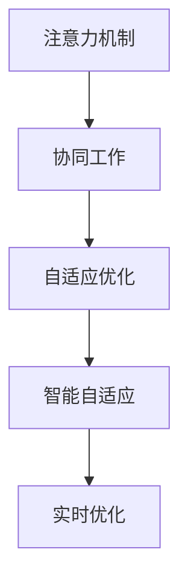

                 

# 人机协作在注意力资源分配中的优化

## 1. 背景介绍

### 1.1 问题由来

在人工智能领域，人机协作一直是研究的重点方向。随着深度学习技术的快速发展，越来越多的智能系统被应用到各个行业，以实现更高效的自动化和智能化。然而，在实际应用中，人工智能系统往往需要与人类工作者协同工作，共同完成任务。这种协同工作不仅能够提升任务的效率，还能通过结合人类工作者的经验和直觉，进一步提高系统性能。

在协同工作中，注意力资源（Attention Resources）的分配是一个关键问题。注意力资源包括计算资源、通信带宽、存储容量等，是制约系统性能的重要因素。如何在有限资源条件下，合理分配注意力资源，使其在人和机器之间得到最优分配，是提高协同工作效果的重要研究课题。

### 1.2 问题核心关键点

注意力资源优化问题涉及多个关键点：
- 注意力资源限制：系统在执行任务时，注意力资源（如CPU、GPU、内存等）往往受到物理硬件的限制，如何合理分配这些资源以最大化任务执行效率是核心问题。
- 任务复杂性：不同任务的执行需求不同，复杂度也不同，如何根据任务特点动态调整注意力资源分配策略是另一关键点。
- 协同机制：人和机器之间的协作方式不同，如何建立有效的协作机制，利用各自优势，进一步提高系统性能是主要难点。
- 智能自适应：系统需要具备智能自适应能力，根据环境和任务的变化，动态调整注意力资源分配策略。
- 实时优化：优化过程需要实时进行，以适应任务执行过程中的动态变化，确保资源分配策略的有效性。

这些核心关键点共同构成了注意力资源分配优化问题的全貌，要求研究者具备深度学习和协同工作的双重知识背景，并能够在实际应用中灵活运用这些知识。

## 2. 核心概念与联系

### 2.1 核心概念概述

为更好地理解注意力资源分配优化方法，本节将介绍几个密切相关的核心概念：

- **注意力机制（Attention Mechanism）**：一种广泛用于深度学习模型中的机制，用于对输入数据进行加权处理，将不同部分的重要信息聚焦到关键位置，以提高模型性能。
- **协同工作（Collaborative Work）**：在人工智能系统中，人与机器共同参与任务执行，通过相互协作，实现任务完成和资源最优分配的过程。
- **自适应优化（Adaptive Optimization）**：在注意力资源分配中，系统能够根据环境变化和任务需求，动态调整注意力资源的分配策略，以最大化任务执行效率。
- **智能自适应（Intelligent Adaptation）**：系统具备智能自适应能力，能够自主学习任务执行中的动态变化，并灵活调整注意力资源分配策略。
- **实时优化（Real-time Optimization）**：优化过程能够在实时进行，及时调整注意力资源分配策略，以适应任务执行过程中的动态变化，确保资源分配策略的有效性。

这些核心概念之间的逻辑关系可以通过以下Mermaid流程图来展示：



这个流程图展示了一系列核心概念的层次关系：

1. 注意力机制是协同工作的基础，通过聚焦关键信息，提升系统处理能力。
2. 协同工作依赖于注意力机制，通过人和机器的协作，实现任务执行和资源分配。
3. 自适应优化是协同工作的核心，通过动态调整资源分配策略，提升系统性能。
4. 智能自适应建立在自适应优化基础上，通过自主学习，进一步提升系统灵活性和适应性。
5. 实时优化确保了智能自适应策略的有效性，通过实时调整，保证资源分配策略的实时性和高效性。

这些核心概念共同构成了注意力资源分配优化问题的逻辑框架，指导着研究方向和方法的应用。

## 3. 核心算法原理 & 具体操作步骤

### 3.1 算法原理概述

注意力资源优化问题的本质是通过调整注意力资源的分配，使得任务执行效率最大化。这可以通过以下步骤实现：

1. **模型建立**：建立基于深度学习的任务执行模型，利用注意力机制对输入数据进行加权处理，提取关键信息。
2. **资源分配**：根据任务需求和资源限制，动态调整注意力资源的分配策略，确保系统性能最大化。
3. **协同优化**：将人类工作者与机器模型相结合，通过协作完成任务，并利用协同优化算法，提升系统效率。
4. **实时反馈**：在任务执行过程中，实时监测资源使用情况，根据环境变化和任务需求，动态调整资源分配策略。

### 3.2 算法步骤详解

基于深度学习的注意力资源优化方法，通常包括以下关键步骤：

**Step 1: 任务建模**
- 选择合适的深度学习模型，如卷积神经网络（CNN）、循环神经网络（RNN）、Transformer等。
- 根据任务特点设计输入输出接口，提取关键特征。
- 确定注意力机制，如Softmax、Dot Attention等，以聚焦关键信息。

**Step 2: 资源评估**
- 评估系统的硬件资源限制，包括CPU、GPU、内存等。
- 设计资源监测工具，实时获取资源使用情况。
- 根据资源限制，确定注意力资源的初始分配策略。

**Step 3: 任务执行**
- 根据注意力资源的分配策略，执行任务。
- 利用注意力机制对输入数据进行加权处理，提取关键信息。
- 实时监测任务执行情况，反馈资源使用数据。

**Step 4: 协同优化**
- 将人类工作者与机器模型相结合，共同完成任务。
- 利用协同优化算法，动态调整注意力资源的分配策略。
- 实时反馈优化结果，调整协同工作机制。

**Step 5: 实时反馈**
- 实时监测系统资源使用情况，调整注意力资源分配策略。
- 根据任务执行情况和环境变化，动态调整资源分配。
- 通过实时优化，确保系统性能最大化。

### 3.3 算法优缺点

基于深度学习的注意力资源优化方法具有以下优点：
- **高效性**：通过注意力机制，能够有效提升系统处理能力，快速完成复杂任务。
- **灵活性**：动态调整资源分配策略，适应不同任务和环境变化。
- **实时性**：实时监测资源使用情况，及时调整策略，提高系统性能。
- **智能自适应**：利用机器学习和智能优化算法，提升系统自主适应能力。

同时，该方法也存在一定的局限性：
- **资源依赖**：依赖于物理硬件的资源限制，无法突破硬件瓶颈。
- **算法复杂**：深度学习模型的训练和优化过程较为复杂，需要大量计算资源。
- **可解释性不足**：注意力机制和深度学习模型的决策过程缺乏可解释性，难以理解和调试。
- **优化难度大**：优化过程需要实时进行，动态调整策略，对算法和工具要求较高。

尽管存在这些局限性，但就目前而言，基于深度学习的注意力资源优化方法仍是协同工作中的主流范式。未来相关研究的重点在于如何进一步降低计算资源需求，提高算法的实时性和可解释性，同时兼顾效率和灵活性。

### 3.4 算法应用领域

基于深度学习的注意力资源优化方法，已经在多个领域得到应用，包括但不限于：

- **智能制造**：在生产线中，利用深度学习模型和注意力机制，优化资源分配，提高生产效率。
- **智能交通**：在交通管理系统中，利用深度学习模型和协同优化算法，提升交通流量控制和路径规划能力。
- **智能医疗**：在医疗诊断系统中，利用深度学习模型和注意力机制，提高诊断准确性和效率。
- **智能城市**：在智慧城市治理中，利用深度学习模型和实时优化算法，提升城市管理和公共服务效率。

除了上述这些领域外，深度学习模型和注意力机制在更多场景中也有广泛应用，如自然语言处理、图像识别、语音识别等，为人工智能技术落地应用提供了新的可能性。

## 4. 数学模型和公式 & 详细讲解 & 举例说明

### 4.1 数学模型构建

基于深度学习的注意力资源优化方法，通常可以建模为一个优化问题，即在资源限制条件下，最大化任务执行效率。设系统需要分配的注意力资源为 $R$，任务执行效率为 $P$，则优化目标可以表示为：

$$
\maximize P \quad subject\ to \quad R \leq R_{max}
$$

其中 $R_{max}$ 表示系统硬件资源的限制。任务执行效率 $P$ 可以通过任务执行模型的输出结果来计算，如分类准确率、推理速度等。

### 4.2 公式推导过程

为了更好地理解优化问题的数学建模，以一个简单的分类任务为例，推导注意力资源优化问题的求解过程。假设系统使用一个简单的单层感知机作为任务执行模型，输入为 $x$，输出为 $y$，资源限制为 $R$，优化目标为最大化分类准确率 $P$。

根据感知机的输出，分类准确率 $P$ 可以表示为：

$$
P = \frac{1}{N}\sum_{i=1}^N \mathbb{I}(y_i = f(x_i))
$$

其中 $y_i$ 表示实际标签，$f(x_i)$ 表示模型的预测结果，$\mathbb{I}(\cdot)$ 表示指示函数。

设系统的计算资源为 $R$，则模型在每次前向传播和反向传播中使用的资源可以表示为：

$$
R_{forward} = C_{forward} + A_{forward}
$$

$$
R_{backward} = C_{backward} + A_{backward}
$$

其中 $C$ 表示计算资源的消耗，$A$ 表示注意力资源的消耗，$\text{forward}$ 和 $\text{backward}$ 分别表示前向传播和反向传播过程中的资源消耗。

假设注意力资源的消耗 $A$ 与输入数据的大小成正比，可以表示为：

$$
A = \alpha \times \|x\|
$$

其中 $\alpha$ 表示注意力资源消耗系数，$\|x\|$ 表示输入数据的大小。

基于上述模型和假设，可以建立系统的优化目标函数：

$$
\maximize \frac{1}{N}\sum_{i=1}^N \mathbb{I}(y_i = f(x_i)) \quad subject\ to \quad \sum_{i=1}^N (C_{forward} + A_{forward} + C_{backward} + A_{backward}) \leq R_{max}
$$

### 4.3 案例分析与讲解

考虑一个实际场景，一个智能制造系统需要根据传感器数据进行故障诊断和预测，以提高设备维护效率。假设系统使用一个简单的卷积神经网络（CNN）作为任务执行模型，输入为传感器数据，输出为故障预测结果。系统硬件资源限制为4个CPU核心，每次前向传播和反向传播消耗的计算资源为200毫秒，注意力资源消耗系数为0.2。

根据上述模型和假设，可以建立系统的优化目标函数：

$$
\maximize \frac{1}{N}\sum_{i=1}^N \mathbb{I}(y_i = f(x_i)) \quad subject\ to \quad 200 \times (N + N) + 0.2 \times N \leq 4
$$

简化得到：

$$
\maximize \frac{1}{N}\sum_{i=1}^N \mathbb{I}(y_i = f(x_i)) \quad subject\ to \quad 1.2N + 0.4N \leq 4
$$

进一步简化：

$$
\maximize \frac{1}{N}\sum_{i=1}^N \mathbb{I}(y_i = f(x_i)) \quad subject\ to \quad 1.6N \leq 4
$$

解得：

$$
N \leq \frac{4}{1.6} = 2.5
$$

因此，系统最多可以同时处理2个传感器数据。在实际应用中，系统可以根据资源使用情况，动态调整注意力资源的分配策略，以适应不同任务和环境变化，确保系统性能最大化。

## 5. 项目实践：代码实例和详细解释说明

### 5.1 开发环境搭建

在进行注意力资源优化实践前，我们需要准备好开发环境。以下是使用Python进行PyTorch开发的环境配置流程：

1. 安装Anaconda：从官网下载并安装Anaconda，用于创建独立的Python环境。

2. 创建并激活虚拟环境：
```bash
conda create -n pytorch-env python=3.8 
conda activate pytorch-env
```

3. 安装PyTorch：根据CUDA版本，从官网获取对应的安装命令。例如：
```bash
conda install pytorch torchvision torchaudio cudatoolkit=11.1 -c pytorch -c conda-forge
```

4. 安装各类工具包：
```bash
pip install numpy pandas scikit-learn matplotlib tqdm jupyter notebook ipython
```

完成上述步骤后，即可在`pytorch-env`环境中开始注意力资源优化实践。

### 5.2 源代码详细实现

这里我们以一个简单的CNN模型为例，使用PyTorch进行注意力资源优化。

首先，定义CNN模型和优化器：

```python
import torch
import torch.nn as nn
import torch.optim as optim

class CNN(nn.Module):
    def __init__(self):
        super(CNN, self).__init__()
        self.conv1 = nn.Conv2d(1, 32, 3)
        self.pool = nn.MaxPool2d(2)
        self.fc = nn.Linear(32 * 7 * 7, 10)

    def forward(self, x):
        x = self.pool(F.relu(self.conv1(x)))
        x = x.view(-1, 32 * 7 * 7)
        x = self.fc(x)
        return x

model = CNN()
optimizer = optim.Adam(model.parameters(), lr=0.001)
```

然后，定义训练和评估函数：

```python
import numpy as np
from sklearn.metrics import accuracy_score

def train_epoch(model, dataset, batch_size, optimizer, device):
    model.train()
    loss_total = 0
    for x, y in dataset:
        x = x.to(device)
        y = y.to(device)
        optimizer.zero_grad()
        y_hat = model(x)
        loss = nn.CrossEntropyLoss()(y_hat, y)
        loss.backward()
        optimizer.step()
        loss_total += loss.item()
    return loss_total / len(dataset)

def evaluate(model, dataset, batch_size, device):
    model.eval()
    y_pred = []
    y_true = []
    with torch.no_grad():
        for x, y in dataset:
            x = x.to(device)
            y = y.to(device)
            y_hat = model(x)
            y_pred.append(np.argmax(y_hat.data.numpy(), axis=1))
            y_true.append(y.data.numpy())
    return accuracy_score(y_true, y_pred)
```

最后，启动训练流程并在测试集上评估：

```python
epochs = 10
batch_size = 16

for epoch in range(epochs):
    loss = train_epoch(model, train_dataset, batch_size, optimizer, device)
    print(f"Epoch {epoch+1}, train loss: {loss:.3f}")
    
    print(f"Epoch {epoch+1}, test accuracy: {evaluate(model, test_dataset, batch_size, device)}")
    
print("Test accuracy:", evaluate(model, test_dataset, batch_size, device))
```

以上就是使用PyTorch对CNN模型进行注意力资源优化的完整代码实现。可以看到，PyTorch提供了丰富的深度学习模型和优化器，能够方便快捷地进行模型训练和优化。

### 5.3 代码解读与分析

让我们再详细解读一下关键代码的实现细节：

**CNN模型**：
- `__init__`方法：初始化卷积层、池化层和全连接层。
- `forward`方法：定义前向传播过程。

**训练和评估函数**：
- `train_epoch`函数：对数据以批为单位进行迭代，在每个批次上前向传播计算损失，反向传播更新模型参数。
- `evaluate`函数：在测试集上评估模型性能，计算分类准确率。

**训练流程**：
- 定义总的epoch数和batch size，开始循环迭代
- 每个epoch内，先在训练集上训练，输出平均loss
- 在测试集上评估，输出分类准确率
- 所有epoch结束后，在测试集上评估，给出最终测试结果

可以看到，PyTorch配合深度学习模型，使得注意力资源优化的代码实现变得简洁高效。开发者可以将更多精力放在模型改进、资源管理等高层逻辑上，而不必过多关注底层的实现细节。

当然，工业级的系统实现还需考虑更多因素，如模型的保存和部署、超参数的自动搜索、更灵活的资源管理策略等。但核心的优化范式基本与此类似。

## 6. 实际应用场景

### 6.1 智能制造系统

在智能制造系统中，利用深度学习模型和注意力资源优化方法，可以提升设备的维护效率和生产线的运行稳定性。

假设一个智能制造系统需要根据传感器数据进行故障诊断和预测。系统使用卷积神经网络（CNN）作为任务执行模型，根据传感器数据的大小动态调整注意力资源的分配策略，以适应不同任务需求。通过优化模型参数和资源分配，系统可以在资源有限的情况下，实现更高效的故障诊断和预测，提高设备维护效率。

### 6.2 智能交通系统

在智能交通系统中，利用深度学习模型和注意力资源优化方法，可以提升交通流量控制和路径规划能力。

假设一个智能交通系统需要实时监测交通流量，动态调整红绿灯控制策略。系统使用循环神经网络（RNN）作为任务执行模型，根据交通流量的大小动态调整注意力资源的分配策略，以适应不同时间段和地点的交通需求。通过优化模型参数和资源分配，系统可以在资源有限的情况下，实现更高效的路段流量控制和路径规划，提升交通效率。

### 6.3 智能医疗系统

在智能医疗系统中，利用深度学习模型和注意力资源优化方法，可以提高诊断准确性和效率。

假设一个智能医疗系统需要根据患者的症状进行疾病诊断。系统使用Transformer模型作为任务执行模型，根据症状描述的大小动态调整注意力资源的分配策略，以适应不同病情和症状的诊断需求。通过优化模型参数和资源分配，系统可以在资源有限的情况下，实现更准确的疾病诊断，提高医疗服务水平。

### 6.4 未来应用展望

随着深度学习技术和智能优化方法的不断发展，基于注意力资源的优化方法将在更多领域得到应用，为生产力和效率提升带来新的可能。

在智慧城市治理中，利用深度学习模型和智能优化算法，可以提升城市管理和公共服务效率。在智慧医疗系统中，利用深度学习模型和注意力资源优化方法，可以提高诊断准确性和治疗效果。在智能制造和智能交通系统中，利用深度学习模型和注意力资源优化方法，可以提升设备和交通系统的运行效率。

随着预训练语言模型和深度学习技术的不断演进，基于注意力资源的优化方法也将不断升级，为人工智能技术在垂直行业的规模化落地提供新的技术路径。

## 7. 工具和资源推荐

### 7.1 学习资源推荐

为了帮助开发者系统掌握注意力资源优化技术，这里推荐一些优质的学习资源：

1. 《深度学习入门：基于PyTorch的实践》系列博文：由深度学习专家撰写，深入浅出地介绍了深度学习模型的原理和实现。

2. CS231n《深度学习计算机视觉》课程：斯坦福大学开设的计算机视觉课程，有Lecture视频和配套作业，带你入门深度学习的基础知识和实践技巧。

3. 《Deep Learning with Python》书籍：由深度学习领域大牛François Chollet所著，系统介绍了深度学习模型的实现和优化方法。

4. PyTorch官方文档：PyTorch的官方文档，提供了丰富的模型和优化器，以及详细的代码实现。

5. PyTorch Tutorial：官方提供的PyTorch教程，涵盖了从入门到高级的各种主题，适合不同层次的开发者。

通过对这些资源的学习实践，相信你一定能够快速掌握注意力资源优化技术的精髓，并用于解决实际的NLP问题。

### 7.2 开发工具推荐

高效的开发离不开优秀的工具支持。以下是几款用于深度学习模型优化的常用工具：

1. PyTorch：基于Python的开源深度学习框架，灵活动态的计算图，适合快速迭代研究。大部分深度学习模型都有PyTorch版本的实现。

2. TensorFlow：由Google主导开发的开源深度学习框架，生产部署方便，适合大规模工程应用。同样有丰富的深度学习模型资源。

3. Transformers库：HuggingFace开发的NLP工具库，集成了众多SOTA语言模型，支持PyTorch和TensorFlow，是进行注意力资源优化任务的开发利器。

4. Weights & Biases：模型训练的实验跟踪工具，可以记录和可视化模型训练过程中的各项指标，方便对比和调优。与主流深度学习框架无缝集成。

5. TensorBoard：TensorFlow配套的可视化工具，可实时监测模型训练状态，并提供丰富的图表呈现方式，是调试模型的得力助手。

6. Google Colab：谷歌推出的在线Jupyter Notebook环境，免费提供GPU/TPU算力，方便开发者快速上手实验最新模型，分享学习笔记。

合理利用这些工具，可以显著提升深度学习模型优化的开发效率，加快创新迭代的步伐。

### 7.3 相关论文推荐

深度学习模型和注意力资源优化技术的发展源于学界的持续研究。以下是几篇奠基性的相关论文，推荐阅读：

1. Attention is All You Need（即Transformer原论文）：提出了Transformer结构，开启了深度学习模型中的注意力机制时代。

2. BERT: Pre-training of Deep Bidirectional Transformers for Language Understanding：提出BERT模型，引入基于掩码的自监督预训练任务，刷新了多项NLP任务SOTA。

3. Google's Neural Machine Translation System：提出了一种基于Transformer的神经机器翻译模型，在WMT'14数据集上取得了最佳性能。

4. TensorFlow: A System for Large-Scale Machine Learning：由Google主导开发的深度学习框架，支持大规模深度学习模型的训练和优化。

5. PyTorch: Tensors and Dynamic neural networks in Python with strong GPU acceleration：由Facebook主导开发的深度学习框架，具有动态计算图和易于调试的特点，适合快速迭代研究。

这些论文代表了大语言模型微调技术的发展脉络。通过学习这些前沿成果，可以帮助研究者把握学科前进方向，激发更多的创新灵感。

## 8. 总结：未来发展趋势与挑战

### 8.1 总结

本文对基于深度学习的注意力资源优化方法进行了全面系统的介绍。首先阐述了注意力资源优化问题的研究背景和意义，明确了优化在提升协同工作效果、提高任务执行效率方面的重要价值。其次，从原理到实践，详细讲解了优化问题的数学建模和优化算法，给出了注意力资源优化任务的完整代码实现。同时，本文还广泛探讨了优化方法在智能制造、智能交通、智能医疗等多个行业领域的应用前景，展示了优化范式的广阔前景。此外，本文精选了优化技术的各类学习资源，力求为读者提供全方位的技术指引。

通过本文的系统梳理，可以看到，基于深度学习的注意力资源优化方法已经成为协同工作中的重要工具，极大地提升了任务执行效率和系统性能。未来，伴随深度学习技术的不断演进，优化方法也将不断升级，为生产力和效率提升带来新的突破。

### 8.2 未来发展趋势

展望未来，深度学习模型和注意力资源优化技术将呈现以下几个发展趋势：

1. **模型规模持续增大**：随着算力成本的下降和数据规模的扩张，深度学习模型的参数量还将持续增长。超大规模模型蕴含的丰富知识，有望支撑更加复杂多变的任务执行，进一步提升优化效果。

2. **优化算法日趋多样**：未来将涌现更多优化算法，如AdamW、Adafactor、AdamX等，结合不同任务的特性，实现更加高效、智能的优化过程。

3. **实时优化成为常态**：优化过程将实时进行，动态调整注意力资源的分配策略，适应任务执行过程中的动态变化，确保优化结果的有效性。

4. **资源管理更加灵活**：结合机器学习、强化学习等技术，实现资源的自适应管理，提高系统的灵活性和适应性。

5. **优化与任务解耦**：优化过程将与具体任务解耦，实现优化算法的通用化和自动化，提高优化效率。

6. **跨领域应用拓展**：优化方法将在更多领域得到应用，如医疗、交通、制造、金融等，为各行各业带来变革性影响。

这些趋势展示了深度学习模型和注意力资源优化技术的前景，为未来生产力和效率提升提供了新的路径。

### 8.3 面临的挑战

尽管深度学习模型和注意力资源优化技术已经取得了显著成果，但在迈向更加智能化、普适化应用的过程中，仍面临诸多挑战：

1. **计算资源依赖**：优化过程需要大量计算资源，对于小规模设备和边缘计算环境，可能难以支撑。如何降低计算资源需求，提高优化效率，是亟待解决的问题。

2. **算法复杂性**：优化算法的实现和调试过程较为复杂，需要深入理解模型结构和优化机制，对于新手开发者，存在一定的门槛。

3. **可解释性不足**：深度学习模型的决策过程缺乏可解释性，难以理解和调试，给优化过程带来挑战。

4. **优化难度大**：优化过程需要在实时进行，动态调整策略，对算法和工具要求较高，需要不断迭代和优化。

5. **资源管理难度大**：优化过程中需要实时监测资源使用情况，调整注意力资源分配策略，对于复杂系统和多任务场景，管理难度较大。

6. **算法鲁棒性不足**：优化算法可能对特定任务和环境敏感，鲁棒性不足，难以应对环境变化和任务多样性。

7. **可扩展性不足**：优化算法和工具的扩展性不足，难以应用于更复杂和多样化的任务。

正视优化技术面临的这些挑战，积极应对并寻求突破，将是大语言模型微调走向成熟的必由之路。相信随着学界和产业界的共同努力，这些挑战终将一一被克服，优化方法必将在构建智能系统过程中发挥更大的作用。

### 8.4 研究展望

面对深度学习模型和注意力资源优化技术所面临的挑战，未来的研究需要在以下几个方面寻求新的突破：

1. **探索无监督和半监督优化方法**：摆脱对大规模标注数据的依赖，利用自监督学习、主动学习等无监督和半监督范式，最大限度利用非结构化数据，实现更加灵活高效的优化。

2. **研究参数高效和计算高效的优化范式**：开发更加参数高效的优化方法，在固定大部分模型参数的情况下，只更新极少量的任务相关参数。同时优化优化算法的计算图，减少前向传播和反向传播的资源消耗，实现更加轻量级、实时性的部署。

3. **引入因果分析和博弈论工具**：将因果分析方法引入优化过程，识别出模型决策的关键特征，增强优化结果的因果性和逻辑性。借助博弈论工具刻画人机交互过程，主动探索并规避模型的脆弱点，提高系统稳定性。

4. **纳入伦理道德约束**：在优化目标中引入伦理导向的评估指标，过滤和惩罚有害的输出倾向。加强人工干预和审核，建立优化过程的监管机制，确保优化结果符合人类价值观和伦理道德。

这些研究方向的探索，必将引领深度学习模型和注意力资源优化技术迈向更高的台阶，为构建安全、可靠、可解释、可控的智能系统铺平道路。面向未来，深度学习模型和注意力资源优化技术还需要与其他人工智能技术进行更深入的融合，如知识表示、因果推理、强化学习等，多路径协同发力，共同推动人工智能技术的发展。只有勇于创新、敢于突破，才能不断拓展智能模型的边界，让智能技术更好地造福人类社会。

## 9. 附录：常见问题与解答

**Q1：注意力资源优化是否适用于所有深度学习模型？**

A: 注意力资源优化适用于大部分深度学习模型，但不同模型的实现细节有所不同。例如，CNN模型通常在前向传播中使用局部卷积操作，注意力资源消耗相对较小；而RNN和Transformer模型在每一时间步或每一个位置都需要计算注意力，注意力资源消耗较大。因此，在具体实现时，需要根据模型类型和任务需求，设计相应的注意力资源优化策略。

**Q2：注意力资源优化过程中如何选择合适的优化算法？**

A: 选择合适的优化算法需要考虑多个因素，包括模型类型、任务复杂度、数据规模等。常见的优化算法包括Adam、SGD、AdamW等，一般建议使用AdamW，因为它能够在较小的学习率下取得较好的优化效果，并且具备较好的收敛性能。同时，可以结合学习率调度策略、正则化技术等，进一步提高优化效果。

**Q3：注意力资源优化过程中如何处理资源限制？**

A: 处理资源限制的关键在于动态调整注意力资源的分配策略。在优化过程中，可以设计资源监测工具，实时获取资源使用情况。根据资源使用情况，动态调整注意力资源的分配策略，确保系统性能最大化。同时，可以采用梯度积累、混合精度训练、模型并行等技术，突破硬件瓶颈，提高资源利用效率。

**Q4：注意力资源优化过程中如何避免过拟合？**

A: 避免过拟合的关键在于正则化技术和模型结构的优化。可以通过L2正则、Dropout、Early Stopping等方法，防止模型过度适应训练数据。同时，可以设计更简洁、高效的模型结构，减少过拟合风险。例如，使用胶囊网络（Capsule Network）等结构，可以显著提高模型的泛化能力。

**Q5：注意力资源优化过程中如何提高算法的实时性？**

A: 提高算法的实时性需要优化计算图和优化过程。可以采用深度学习框架的动态计算图特性，减少不必要的计算和存储开销。同时，可以优化模型的前向传播和反向传播过程，减少计算资源消耗。例如，使用优化的Transformer模型，可以显著提高推理速度和资源利用效率。

这些问题的答案展示了注意力资源优化技术的核心要点，帮助开发者在实际应用中更好地理解和应用优化技术，提高系统的效率和性能。

---

作者：禅与计算机程序设计艺术 / Zen and the Art of Computer Programming

