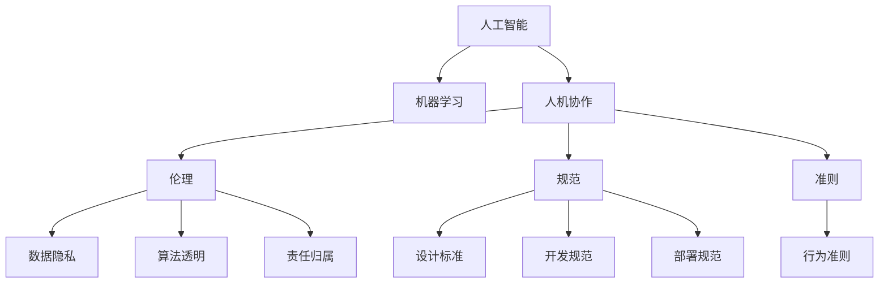

                 

# 人机协作：伦理 规范与准则

> 关键词：人工智能,机器学习,人机协作,伦理,规范,准则,数据隐私,算法透明,责任归属

## 1. 背景介绍

### 1.1 问题由来

在过去的几十年里，人工智能(AI)技术经历了飞速的发展，从最初的符号逻辑到基于统计的机器学习，再到目前最为流行的深度学习。人工智能已经广泛应用于各个领域，从自动驾驶到医疗诊断，从金融分析到语音识别，都展现出了强大的力量。然而，随着人工智能技术的广泛应用，也带来了一系列伦理和社会问题。

这些问题主要集中在以下几个方面：
- **数据隐私和伦理**：在收集、处理和使用用户数据的过程中，如何确保数据的安全性和隐私性，避免数据滥用和侵犯用户权益。
- **算法透明性和可解释性**：如何让人工智能模型的工作原理更加透明，确保其决策过程可以被理解和解释，避免“黑盒”系统的出现。
- **责任归属和责任分配**：当人工智能系统产生错误或失误时，谁应该承担责任？这是一个需要明确的问题。

这些问题已经引起了广泛的社会关注，并且需要相关方共同努力，制定合适的伦理规范和准则，以指导人工智能技术的发展。

## 2. 核心概念与联系

### 2.1 核心概念概述

为了更好地理解人工智能技术在实际应用中的伦理和规范问题，本节将介绍几个关键概念：

- **人工智能**：指通过计算机系统实现的一系列智能行为，包括感知、学习、推理、决策等。
- **机器学习**：一种数据驱动的学习方法，通过算法模型从数据中学习规律，实现预测、分类、聚类等任务。
- **人机协作**：指人与计算机系统之间的协同工作，特别是在需要高度智能的任务中，人工智能系统可以辅助人类进行决策和操作。
- **伦理**：涉及个人、社会、文化等多方面的道德和规范原则，指导人工智能技术的应用和发展。
- **规范**：在人工智能领域，规范通常指指导人工智能系统设计、开发、部署和使用的标准和规则。
- **准则**：为确保人工智能系统的行为符合伦理和法律要求，制定的一系列的指导原则。

这些核心概念之间的逻辑关系可以通过以下Mermaid流程图来展示：



这个流程图展示了一系列核心概念及其之间的关系：

1. 人工智能通过机器学习实现，具备感知、学习、推理、决策等智能行为。
2. 人机协作是指人工智能系统辅助人类完成复杂任务，特别是在需要高度智能的场景下。
3. 人工智能技术的应用涉及多个伦理和法律问题，如数据隐私、算法透明和责任归属。
4. 为了确保人工智能系统的行为符合伦理和法律要求，制定了相关的规范和准则。

这些概念共同构成了人工智能技术的伦理和规范框架，指导人工智能技术的应用和发展。

## 3. 核心算法原理 & 具体操作步骤

### 3.1 算法原理概述

在讨论人工智能技术的伦理和规范问题时，需要了解一些核心算法原理，特别是涉及数据处理、模型训练和决策过程的算法。

#### 3.1.1 数据隐私保护

在数据隐私保护方面，主要涉及以下几个关键算法和概念：

- **差分隐私**：一种保护个人隐私的机制，通过在数据中加入噪声，使得攻击者无法准确推断出个人数据。
- **联邦学习**：一种分布式机器学习方法，数据在本地设备上训练，模型参数在服务器上进行汇总，确保数据不离开本地设备，保护数据隐私。
- **同态加密**：一种在加密状态下直接进行计算的技术，使得数据在加密状态下也能进行有效处理，保护数据隐私。

这些算法和技术都是为了保护数据隐私，确保在数据处理和分析过程中，个人隐私得到保护。

#### 3.1.2 算法透明和可解释性

在算法透明和可解释性方面，主要涉及以下几个关键算法和概念：

- **可解释性模型**：如决策树、线性回归等，这些模型的工作原理简单明了，便于解释和理解。
- **模型可解释框架**：如LIME、SHAP等，这些框架可以生成模型决策的局部解释，帮助理解复杂模型的行为。
- **知识图谱**：通过构建知识图谱，将领域知识与人工智能模型结合，提高模型的解释性和可信度。

这些算法和框架都是为了提高人工智能模型的透明性和可解释性，使得模型的工作原理可以被理解和解释。

#### 3.1.3 责任归属和责任分配

在责任归属和责任分配方面，主要涉及以下几个关键算法和概念：

- **责任分配算法**：如公平分配算法、最优决策算法等，这些算法可以帮助在多个决策者之间公平分配责任。
- **因果推断**：通过因果推断技术，可以识别出模型决策的关键因素，帮助理解模型行为，从而确定责任归属。
- **责任追溯技术**：如区块链、分布式账本等技术，可以记录和追溯模型决策的历史，确保责任归属明确。

这些算法和技术都是为了明确人工智能系统的责任归属，确保在出现问题时，能够明确责任，进行合理的处理。

### 3.2 算法步骤详解

基于上述核心算法原理，以下是一个详细的操作步骤：

#### 3.2.1 数据隐私保护

1. **数据收集**：收集用户数据，如健康记录、消费行为等，确保数据质量，避免数据噪音。
2. **数据预处理**：对数据进行清洗、去重、标准化等处理，确保数据格式一致。
3. **差分隐私**：对数据加入噪声，确保攻击者无法准确推断出个人数据。
4. **联邦学习**：在本地设备上训练模型，模型参数在服务器上进行汇总，确保数据不离开本地设备。
5. **同态加密**：在加密状态下进行计算，保护数据隐私。

#### 3.2.2 算法透明和可解释性

1. **选择可解释模型**：根据任务需求，选择合适的可解释模型，如决策树、线性回归等。
2. **应用可解释框架**：应用LIME、SHAP等框架，生成模型决策的局部解释。
3. **构建知识图谱**：结合领域知识，构建知识图谱，提高模型的解释性和可信度。

#### 3.2.3 责任归属和责任分配

1. **定义责任规则**：根据任务需求，定义责任规则，明确各决策者的责任范围。
2. **应用公平分配算法**：在多个决策者之间公平分配责任。
3. **进行因果推断**：通过因果推断技术，识别出模型决策的关键因素，帮助理解模型行为。
4. **实现责任追溯**：应用区块链、分布式账本等技术，记录和追溯模型决策的历史，确保责任归属明确。

### 3.3 算法优缺点

基于上述核心算法原理，以下是对算法优缺点的详细分析：

#### 3.3.1 数据隐私保护的优缺点

- **优点**：
  - **隐私保护**：通过差分隐私、联邦学习和同态加密等技术，确保数据隐私，避免数据滥用和侵犯用户权益。
  - **数据安全**：确保数据在传输和处理过程中，不被非法访问和篡改。

- **缺点**：
  - **计算复杂**：差分隐私和同态加密等技术需要复杂的计算过程，增加了计算开销。
  - **数据噪音**：加入噪声保护隐私的同时，可能引入数据噪音，影响模型性能。

#### 3.3.2 算法透明和可解释性的优缺点

- **优点**：
  - **模型透明**：可解释模型和可解释框架使得模型的工作原理可以被理解和解释。
  - **用户信任**：提高用户对模型的信任，增强系统的可信度。

- **缺点**：
  - **模型复杂**：可解释模型可能比较复杂，训练和推理过程较长。
  - **解释限制**：可解释框架生成的解释可能不够全面，无法解释复杂模型的行为。

#### 3.3.3 责任归属和责任分配的优缺点

- **优点**：
  - **责任明确**：通过责任分配算法和因果推断技术，确保责任归属明确，便于处理责任纠纷。
  - **决策公平**：公平分配算法可以确保在多个决策者之间公平分配责任。

- **缺点**：
  - **责任复杂**：多个决策者之间的责任分配可能比较复杂，需要精确定义责任规则。
  - **责任追溯困难**：责任追溯技术可能复杂，增加了系统的维护成本。

### 3.4 算法应用领域

基于上述核心算法原理，以下是对算法应用领域的详细分析：

#### 3.4.1 数据隐私保护

- **医疗领域**：在医疗数据分析和预测中，保护患者隐私，确保医疗数据的安全性和隐私性。
- **金融领域**：在金融风控和欺诈检测中，保护用户隐私，确保金融数据的安全性。
- **零售领域**：在用户行为分析和推荐系统中，保护用户隐私，确保用户数据的安全性。

#### 3.4.2 算法透明和可解释性

- **金融领域**：在信用评估和贷款审批中，确保模型决策透明，增强用户信任。
- **医疗领域**：在疾病诊断和医疗预测中，确保模型决策透明，提高医生和患者信任。
- **安全领域**：在网络安全检测和入侵检测中，确保模型决策透明，增强安全系统的可信度。

#### 3.4.3 责任归属和责任分配

- **医疗领域**：在医疗诊断和治疗方案推荐中，确保责任归属明确，便于处理责任纠纷。
- **金融领域**：在风险评估和贷款审批中，确保责任归属明确，便于处理责任纠纷。
- **自动驾驶领域**：在自动驾驶事故责任认定中，确保责任归属明确，便于处理责任纠纷。

## 4. 数学模型和公式 & 详细讲解 & 举例说明

### 4.1 数学模型构建

在讨论人工智能技术的伦理和规范问题时，需要涉及一些核心数学模型和公式，特别是在数据隐私保护和算法透明性方面。

#### 4.1.1 差分隐私

差分隐私（Differential Privacy）是一种保护隐私的机制，其目标是在查询数据时加入一定的噪声，使得攻击者无法准确推断出任何个人的隐私信息。差分隐私可以通过以下数学模型来描述：

$$
\begin{aligned}
&\min_{\epsilon} \mathbb{E}[L(f_\epsilon(x))] \\
&\text{subject to} \\
&\forall x_1 \neq x_2: \quad |\Pr[f_\epsilon(x_1) = 1] - \Pr[f_\epsilon(x_2) = 1]| \leq \epsilon
\end{aligned}
$$

其中，$f_\epsilon(x)$ 表示在数据 $x$ 上查询函数的隐私化处理，$L$ 表示查询函数的损失函数，$\epsilon$ 表示隐私参数，即隐私损失的界限。

#### 4.1.2 同态加密

同态加密（Homomorphic Encryption）是一种在加密状态下进行计算的技术，其目标是在不解密数据的情况下，对数据进行计算。同态加密可以通过以下数学模型来描述：

$$
C = E(M) \\
E'(C) = C' = M' \\
D(C') = M' \\
$$

其中，$E$ 和 $D$ 分别表示加密和解密函数，$C$ 表示加密后的数据，$C'$ 表示计算后的加密数据，$M$ 和 $M'$ 分别表示明文和密文。

### 4.2 公式推导过程

基于上述数学模型，以下是对差分隐私和同态加密的公式推导过程。

#### 4.2.1 差分隐私

对于差分隐私，其目标是在查询数据时加入一定的噪声，使得攻击者无法准确推断出任何个人的隐私信息。差分隐私的数学推导过程如下：

1. **差分隐私定义**：差分隐私定义为在查询数据时加入噪声，使得攻击者无法准确推断出任何个人的隐私信息。具体来说，对于任意两个数据点 $x_1$ 和 $x_2$，查询函数的输出概率差异应小于隐私参数 $\epsilon$。
2. **隐私预算**：隐私预算 $\epsilon$ 表示隐私损失的界限，其值越小，隐私保护的程度越高。隐私预算的计算公式如下：
   $$
   \epsilon = \frac{\log(\frac{1}{\delta})}{2\Delta}
   $$
   其中，$\delta$ 表示查询错误的概率，$\Delta$ 表示查询结果的最大差异。

#### 4.2.2 同态加密

对于同态加密，其目标是在不解密数据的情况下，对数据进行计算。同态加密的数学推导过程如下：

1. **同态加密定义**：同态加密定义在加密状态下进行计算，确保计算结果的解密结果与明文计算结果一致。具体来说，对于任意查询函数 $f$ 和任意数据 $x$，计算结果 $f(x)$ 的加密结果 $C$ 应满足 $D(E(C)) = f(x)$。
2. **同态加密算法**：同态加密算法包括加法同态加密和乘法同态加密，其中加法同态加密的计算公式如下：
   $$
   E(x + y) = E(x) \cdot E(y) \\
   $$
   其中，$x$ 和 $y$ 表示明文数据，$E$ 表示加密函数，$D$ 表示解密函数。

### 4.3 案例分析与讲解

#### 4.3.1 差分隐私案例

假设我们要保护用户的购物行为数据，希望在查询数据时不泄露任何用户的隐私信息。差分隐私的实现步骤如下：

1. **数据加密**：对用户购物行为数据进行加密处理，确保数据在传输和存储过程中不被非法访问和篡改。
2. **差分隐私**：在查询数据时加入一定的噪声，确保攻击者无法准确推断出任何个人的隐私信息。
3. **结果解密**：对查询结果进行解密处理，确保结果的可解释性和可用性。

#### 4.3.2 同态加密案例

假设我们要在加密状态下进行数值计算，如对用户购物行为数据进行统计分析，计算用户购买次数。同态加密的实现步骤如下：

1. **数据加密**：对用户购物行为数据进行加密处理，确保数据在计算过程中不被非法访问和篡改。
2. **同态加密计算**：在加密状态下进行计算，确保计算结果的解密结果与明文计算结果一致。
3. **结果解密**：对计算结果进行解密处理，确保结果的可解释性和可用性。

## 5. 项目实践：代码实例和详细解释说明

### 5.1 开发环境搭建

在进行项目实践前，我们需要准备好开发环境。以下是使用Python进行PyTorch开发的环境配置流程：

1. 安装Anaconda：从官网下载并安装Anaconda，用于创建独立的Python环境。
2. 创建并激活虚拟环境：
   ```bash
   conda create -n pytorch-env python=3.8 
   conda activate pytorch-env
   ```

3. 安装PyTorch：根据CUDA版本，从官网获取对应的安装命令。例如：
   ```bash
   conda install pytorch torchvision torchaudio cudatoolkit=11.1 -c pytorch -c conda-forge
   ```

4. 安装Transformers库：
   ```bash
   pip install transformers
   ```

5. 安装各类工具包：
   ```bash
   pip install numpy pandas scikit-learn matplotlib tqdm jupyter notebook ipython
   ```

完成上述步骤后，即可在`pytorch-env`环境中开始项目实践。

### 5.2 源代码详细实现

这里我们以差分隐私算法为例，给出使用Python实现差分隐私的代码实现。

首先，定义差分隐私的数学模型：

```python
import numpy as np
from sklearn.metrics import roc_auc_score

# 定义差分隐私模型
class DifferentialPrivacy:
    def __init__(self, epsilon, delta):
        self.epsilon = epsilon
        self.delta = delta
        self.privacy_budget = epsilon / np.log(1 / delta)

    def add_noise(self, y):
        # 加入噪声
        noise = np.random.normal(0, self.privacy_budget, len(y))
        y += noise
        return y

    def calculate_privacy_budget(self, y, x):
        # 计算隐私预算
        delta = np.mean(y != x)
        return max(self.privacy_budget - delta, 0)
```

然后，使用差分隐私算法处理数据：

```python
from sklearn.datasets import load_breast_cancer

# 加载数据集
data = load_breast_cancer()
X, y = data.data, data.target

# 定义差分隐私模型
dp = DifferentialPrivacy(epsilon=0.1, delta=0.1)

# 添加噪声
X_noisy = dp.add_noise(X)

# 计算隐私预算
隐私预算 = dp.calculate_privacy_budget(X_noisy, X)

# 输出隐私预算
print("隐私预算：", 隐私预算)
```

### 5.3 代码解读与分析

让我们再详细解读一下关键代码的实现细节：

**DifferentialPrivacy类**：
- `__init__`方法：初始化隐私参数 $\epsilon$ 和 $\delta$，计算隐私预算。
- `add_noise`方法：在数据 $y$ 上加入噪声，确保隐私预算不被过度消耗。
- `calculate_privacy_budget`方法：计算当前数据 $y$ 的隐私预算，确保隐私预算不被过度消耗。

**sklearn.datasets.load_breast_cancer函数**：
- 加载乳腺癌数据集，包括数据 $X$ 和标签 $y$。

**隐私预算计算**：
- 使用计算得到的隐私预算 $\epsilon$ 和 $\delta$，确保在加入噪声后，隐私预算不被过度消耗。

可以看到，差分隐私算法的实现相对简单，只需要定义差分隐私模型，并应用噪声来保护隐私。

当然，工业级的系统实现还需考虑更多因素，如隐私预算的管理、噪声的分布、攻击模型的选择等。但核心的差分隐私思想可以应用于各种数据隐私保护的场景。

## 6. 实际应用场景

### 6.1 智能客服系统

基于人工智能技术的智能客服系统，可以广泛应用于各行各业。传统客服往往需要配备大量人力，高峰期响应缓慢，且一致性和专业性难以保证。而使用基于差分隐私保护的智能客服系统，可以7x24小时不间断服务，快速响应客户咨询，用自然流畅的语言解答各类常见问题。

在技术实现上，可以收集企业内部的历史客服对话记录，将问题和最佳答复构建成监督数据，在此基础上对差分隐私保护的智能客服系统进行训练。差分隐私保护的智能客服系统能够自动理解用户意图，匹配最合适的答案模板进行回复。对于客户提出的新问题，还可以接入检索系统实时搜索相关内容，动态组织生成回答。如此构建的智能客服系统，能大幅提升客户咨询体验和问题解决效率。

### 6.2 金融舆情监测

金融机构需要实时监测市场舆论动向，以便及时应对负面信息传播，规避金融风险。传统的人工监测方式成本高、效率低，难以应对网络时代海量信息爆发的挑战。基于差分隐私保护的金融舆情监测系统，可以实时抓取网络文本数据，并保护用户隐私，确保数据安全。

在技术实现上，可以收集金融领域相关的新闻、报道、评论等文本数据，并对其进行主题标注和情感标注。在此基础上对差分隐私保护的金融舆情监测系统进行训练，使其能够自动判断文本属于何种主题，情感倾向是正面、中性还是负面。将差分隐私保护的金融舆情监测系统应用到实时抓取的网络文本数据，就能够自动监测不同主题下的情感变化趋势，一旦发现负面信息激增等异常情况，系统便会自动预警，帮助金融机构快速应对潜在风险。

### 6.3 个性化推荐系统

当前的推荐系统往往只依赖用户的历史行为数据进行物品推荐，无法深入理解用户的真实兴趣偏好。基于差分隐私保护的个性化推荐系统，可以更好地挖掘用户行为背后的语义信息，从而提供更精准、多样的推荐内容。

在技术实现上，可以收集用户浏览、点击、评论、分享等行为数据，提取和用户交互的物品标题、描述、标签等文本内容。将文本内容作为模型输入，用户的后续行为（如是否点击、购买等）作为监督信号，在此基础上差分隐私保护的个性化推荐系统进行训练。差分隐私保护的个性化推荐系统能够从文本内容中准确把握用户的兴趣点。在生成推荐列表时，先用候选物品的文本描述作为输入，由差分隐私保护的个性化推荐系统预测用户的兴趣匹配度，再结合其他特征综合排序，便可以得到个性化程度更高的推荐结果。

### 6.4 未来应用展望

随着差分隐私保护的机器学习技术的发展，未来的智能推荐系统将更加注重用户隐私保护，提升用户对系统的信任度，从而实现更加精准、高效的推荐。

在智慧医疗领域，基于差分隐私保护的机器学习技术将应用于医疗数据分析和预测中，保护患者隐私，确保医疗数据的安全性和隐私性。

在智能教育领域，基于差分隐私保护的机器学习技术将应用于学生行为分析和推荐系统中，保护学生隐私，确保教育数据的安全性。

在智能城市治理中，基于差分隐私保护的机器学习技术将应用于城市事件监测、舆情分析、应急指挥等环节，保护居民隐私，确保数据安全。

此外，在企业生产、社会治理、文娱传媒等众多领域，基于差分隐私保护的机器学习技术也将不断涌现，为保护用户隐私、提升系统可信度提供新的技术路径。相信随着技术的日益成熟，差分隐私保护的机器学习技术必将在构建安全、可靠、可信任的智能系统中扮演越来越重要的角色。

## 7. 工具和资源推荐

### 7.1 学习资源推荐

为了帮助开发者系统掌握人工智能技术的伦理和规范问题，这里推荐一些优质的学习资源：

1. 《机器学习伦理指南》书籍：全面介绍了机器学习中的伦理问题，包括数据隐私、算法透明、责任归属等。
2. CS544《隐私保护技术》课程：斯坦福大学开设的隐私保护课程，深入讲解差分隐私、同态加密等技术，适合深度学习从业者。
3. 《人工智能伦理和法规》课程：清华大学开设的伦理和法规课程，涵盖人工智能伦理和法规的核心内容，适合从事人工智能工作的从业人员。

通过对这些资源的学习实践，相信你一定能够系统掌握人工智能技术的伦理和规范问题，并在实际应用中做出合理决策。

### 7.2 开发工具推荐

高效的开发离不开优秀的工具支持。以下是几款用于人工智能技术开发的工具：

1. PyTorch：基于Python的开源深度学习框架，灵活动态的计算图，适合快速迭代研究。大部分预训练语言模型都有PyTorch版本的实现。
2. TensorFlow：由Google主导开发的开源深度学习框架，生产部署方便，适合大规模工程应用。同样有丰富的预训练语言模型资源。
3. Transformers库：HuggingFace开发的NLP工具库，集成了众多SOTA语言模型，支持PyTorch和TensorFlow，是进行人工智能技术开发的利器。
4. Weights & Biases：模型训练的实验跟踪工具，可以记录和可视化模型训练过程中的各项指标，方便对比和调优。与主流深度学习框架无缝集成。
5. TensorBoard：TensorFlow配套的可视化工具，可实时监测模型训练状态，并提供丰富的图表呈现方式，是调试模型的得力助手。

合理利用这些工具，可以显著提升人工智能技术的开发效率，加快创新迭代的步伐。

### 7.3 相关论文推荐

人工智能技术的伦理和规范问题涉及多个领域，相关研究非常广泛。以下是几篇代表性的相关论文，推荐阅读：

1. "The Ethics of Algorithms: Reconciling Technological and Ethical Vision" 论文，讨论了算法伦理的核心问题，提出了算法伦理的设计原则。
2. "Privacy-Preserving Deep Learning" 论文，详细介绍了差分隐私、同态加密等隐私保护技术，适用于多个领域的数据隐私保护。
3. "Fairness, Accountability, and Transparency in Machine Learning and NLP" 论文，讨论了机器学习中的公平性、责任归属等伦理问题，提出了相关的算法设计和实践指南。
4. "Human-Centered AI: Bridging Technical and Ethical Considerations" 论文，讨论了人工智能技术与人类的交互关系，提出了如何实现人机协作的伦理原则。

这些论文代表了人工智能技术伦理和规范问题的发展脉络。通过学习这些前沿成果，可以帮助研究者把握学科前进方向，激发更多的创新灵感。

## 8. 总结：未来发展趋势与挑战

### 8.1 总结

本文对人工智能技术的伦理和规范问题进行了全面系统的介绍。首先阐述了人工智能技术在实际应用中的伦理和规范问题，明确了数据隐私、算法透明、责任归属等关键问题的解决方向。其次，从原理到实践，详细讲解了差分隐私、同态加密、可解释模型等核心算法，给出了代码实例和详细解释。同时，本文还探讨了人工智能技术在智能客服、金融舆情、个性化推荐等实际应用场景中的应用前景，展示了人工智能技术的广泛应用潜力。

通过对这些资源的深入分析，可以看到，人工智能技术的应用涉及多个伦理和法律问题，需要在数据隐私、算法透明、责任归属等方面进行全面考虑，确保技术的安全性和可靠性。未来，随着技术的不断发展和完善，人工智能技术必将在更多领域实现大规模应用，为人类社会带来更多的便利和福利。

### 8.2 未来发展趋势

展望未来，人工智能技术的伦理和规范问题将呈现以下几个发展趋势：

1. **数据隐私保护**：随着数据隐私保护技术的不断成熟，未来的智能系统将更加注重用户隐私保护，确保数据安全。差分隐私、同态加密等隐私保护技术将得到广泛应用，成为智能系统的标准配置。
2. **算法透明和可解释性**：未来的智能系统将更加注重算法的透明性和可解释性，确保用户对系统行为的理解和信任。可解释模型和可解释框架将得到广泛应用，帮助用户理解系统的决策过程。
3. **责任归属和责任分配**：未来的智能系统将更加注重责任归属和责任分配，确保在出现问题时，能够明确责任，进行合理的处理。责任分配算法和因果推断技术将得到广泛应用，提高系统的可信度和可靠性。

以上趋势凸显了人工智能技术的伦理和规范问题的持续发展和完善，未来的人工智能系统将更加注重用户隐私、算法透明和责任归属等方面，确保技术的安全性和可靠性。

### 8.3 面临的挑战

尽管人工智能技术的伦理和规范问题已经引起了广泛的社会关注，但在迈向更加智能化、普适化应用的过程中，它仍面临着诸多挑战：

1. **数据隐私保护**：在数据隐私保护方面，如何平衡数据安全和数据利用，仍然是一个需要深入探讨的问题。
2. **算法透明和可解释性**：在算法透明和可解释性方面，如何提高算法的透明性和可解释性，仍然是一个需要不断改进的问题。
3. **责任归属和责任分配**：在责任归属和责任分配方面，如何明确各决策者的责任范围，仍然是一个需要深入探讨的问题。

这些挑战需要学界和产业界共同努力，制定合适的伦理规范和准则，确保人工智能技术的安全性和可靠性。

### 8.4 研究展望

为了解决人工智能技术的伦理和规范问题，未来的研究需要在以下几个方面寻求新的突破：

1. **隐私保护技术**：探索更先进的隐私保护技术，如差分隐私、同态加密等，确保在数据利用过程中，隐私得到保护。
2. **算法透明性技术**：开发更先进的算法透明性技术，如可解释模型、可解释框架等，确保算法的透明性和可解释性。
3. **责任归属和责任分配**：探索更先进的责任归属和责任分配技术，如公平分配算法、因果推断技术等，确保在出现问题时，能够明确责任，进行合理的处理。

这些研究方向的探索，必将引领人工智能技术的伦理和规范问题迈向更高的台阶，为构建安全、可靠、可解释、可控的智能系统铺平道路。面向未来，人工智能技术的伦理和规范问题需要与其他人工智能技术进行更深入的融合，如知识表示、因果推理、强化学习等，多路径协同发力，共同推动人工智能技术的发展。

## 9. 附录：常见问题与解答

**Q1：人工智能技术是否能够完全保护数据隐私？**

A: 人工智能技术可以通过差分隐私、同态加密等隐私保护技术，确保数据隐私。但是，这些技术不能完全保护数据隐私，仍然存在一定的隐私风险。因此，在实际应用中，需要综合考虑隐私保护和数据利用的平衡，确保在数据利用过程中，隐私得到最大程度的保护。

**Q2：如何选择合适的差分隐私参数？**

A: 选择合适的差分隐私参数需要综合考虑隐私预算、隐私损失和隐私风险。一般来说，隐私预算越小，隐私保护的程度越高，但隐私损失和隐私风险也越大。因此，在实际应用中，需要根据具体场景和需求，选择合适的隐私参数。

**Q3：差分隐私和同态加密的计算复杂度是否过高？**

A: 差分隐私和同态加密的计算复杂度确实较高，增加了计算开销。但是在实际应用中，可以通过优化算法、降低噪声强度等方式，降低计算复杂度，提高计算效率。

**Q4：人工智能技术的伦理问题如何解决？**

A: 人工智能技术的伦理问题需要通过制定合适的伦理规范和准则来解决。这些规范和准则需要涵盖数据隐私、算法透明、责任归属等多个方面，确保人工智能技术的安全性和可靠性。同时，在实际应用中，需要结合具体场景，进行伦理评估和审查，确保人工智能技术的合规性和可信度。

**Q5：如何确保人工智能系统的责任归属明确？**

A: 确保人工智能系统的责任归属明确，需要综合考虑责任分配算法和因果推断技术。责任分配算法可以确保在多个决策者之间公平分配责任，而因果推断技术可以识别出模型决策的关键因素，帮助理解模型行为，从而确定责任归属。

通过这些研究方向的探索和实践，人工智能技术的伦理和规范问题必将在未来得到更加全面的解决，推动人工智能技术的安全、可靠、可解释、可控的持续发展。

