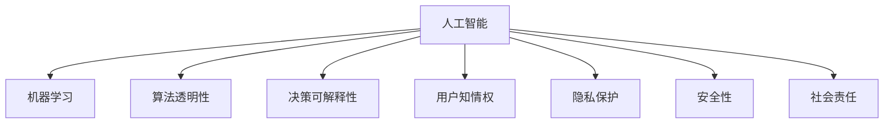

                 

# 人机协作：伦理规范与准则

> 关键词：人机协作,人工智能伦理,机器学习,算法透明性,决策可解释性,用户信任,隐私保护,安全性,社会责任

## 1. 背景介绍

### 1.1 问题由来

随着人工智能技术的迅猛发展，人机协作在各个领域得到了广泛应用。人工智能系统在提升效率、优化决策、辅助人类工作等方面展现了强大的能力。然而，伴随着技术的深入应用，也带来了新的挑战和伦理问题。如何构建一个负责任、可信任、安全的人工智能系统，确保其在道德和法律框架下的合规使用，成为当下迫切需要解决的问题。

### 1.2 问题核心关键点

本文章的核心问题是探讨如何在人机协作中融入伦理规范和准则，确保人工智能系统的行为符合道德和法律标准，维护用户的利益和隐私，保障社会公正和安全。核心关键点包括：

1. 人工智能系统的决策透明性和可解释性。
2. 用户的知情权和隐私保护。
3. 系统的公平性和偏见管理。
4. 系统安全性和鲁棒性。
5. 人工智能的社会责任和影响评估。

这些关键点共同构成了人工智能伦理的核心内容，旨在推动人工智能技术的健康发展和负责任的应用。

## 2. 核心概念与联系

### 2.1 核心概念概述

为更好地理解人工智能伦理与人机协作的联系，本节将介绍几个密切相关的核心概念：

- **人工智能(AI)**：通过算法和模型对数据进行训练，使其具备类似人类的感知、推理、学习等能力的技术。人工智能系统包括机器学习、自然语言处理、计算机视觉等多个领域。

- **机器学习(ML)**：一种让计算机通过数据学习规律的技术，分为监督学习、无监督学习、强化学习等类型。机器学习模型通过训练数据集不断优化自身，以实现特定任务。

- **算法透明性(Algorithm Transparency)**：指系统决策过程的公开性和可理解性，用户应能了解模型如何做出决策。

- **决策可解释性(Decision Explanability)**：指模型输出结果的可解释性，用户应能理解模型输出的原因和依据。

- **用户知情权(Informed Consent)**：指用户在使用人工智能系统前，应了解系统的功能、数据使用方式和潜在的风险，并给予同意。

- **隐私保护(Privacy Protection)**：指保护用户个人信息不被滥用或泄露，遵循数据保护法规。

- **安全性(Security)**：指系统在面对恶意攻击和故障时，能保持稳定运行和数据安全。

- **社会责任(Social Responsibility)**：指人工智能系统在设计和应用过程中，要考虑对社会的影响，确保行为符合社会伦理和道德。

这些核心概念之间的逻辑关系可以通过以下Mermaid流程图来展示：



这个流程图展示了这个概念体系的框架，即人工智能系统需要在多个维度上同时满足伦理规范和准则，才能真正实现负责任和可信任的协作。

## 3. 核心算法原理 & 具体操作步骤

### 3.1 算法原理概述

人机协作中的伦理规范和准则，主要通过算法透明性、决策可解释性、用户知情权、隐私保护、安全性和社会责任等维度来体现。其中，算法透明性和决策可解释性是技术实现的核心，用户知情权、隐私保护、安全性和社会责任则是伦理和法律层面的要求。

### 3.2 算法步骤详解

1. **算法透明性**：
   - 定义模型的输入和输出，解释模型的工作机制。
   - 提供模型训练数据来源和数据处理流程。
   - 使用可解释的模型架构，如线性模型、决策树等。
   - 提供用户友好的可视化界面，展示模型决策路径。

2. **决策可解释性**：
   - 提供模型输出的详细解释，如权重、特征重要性等。
   - 使用可解释的模型解释工具，如LIME、SHAP等。
   - 支持用户自定义解释模板，解释模型预测结果。
   - 定期对模型进行验证，确保解释结果的准确性。

3. **用户知情权**：
   - 设计简洁明了的用户界面，清晰展示系统功能。
   - 提供详细的隐私政策和使用条款，告知用户数据收集和处理方式。
   - 支持用户随时撤销同意，并删除个人信息。
   - 告知用户潜在风险，如模型偏见、数据泄露等。

4. **隐私保护**：
   - 采用加密技术和匿名化处理，保护用户隐私数据。
   - 遵循GDPR、CCPA等数据保护法规，严格管理用户数据。
   - 提供数据访问和更正机制，允许用户查看和管理个人信息。
   - 定期进行隐私安全审计，确保合规性。

5. **安全性**：
   - 使用安全技术和协议，如HTTPS、TLS等。
   - 进行安全漏洞检测和加固，防止攻击和故障。
   - 定期备份数据，防止数据丢失和损坏。
   - 确保系统在高可用性和高可靠性方面达到行业标准。

6. **社会责任**：
   - 在设计和应用过程中，考虑对社会的影响，避免负面影响。
   - 推动人工智能技术的普及和公平使用，减少数字鸿沟。
   - 参与社会伦理讨论，制定行业标准和规范。
   - 公开人工智能系统的社会影响评估报告。

### 3.3 算法优缺点

**算法透明性**：
- **优点**：提高用户信任度，减少误解和质疑。
- **缺点**：复杂模型难以完全透明，可能存在信息泄露的风险。

**决策可解释性**：
- **优点**：增强用户理解，减少模型黑箱问题。
- **缺点**：解释方法可能有误导性，解释成本较高。

**用户知情权**：
- **优点**：保障用户隐私和权益，提升用户满意度。
- **缺点**：需要额外的时间和资源，增加系统复杂性。

**隐私保护**：
- **优点**：保护用户数据安全，减少法律风险。
- **缺点**：隐私保护措施可能影响数据利用效果。

**安全性**：
- **优点**：保障系统稳定运行，减少安全事故。
- **缺点**：安全措施需要持续投入，增加成本。

**社会责任**：
- **优点**：推动技术发展，促进社会公平和正义。
- **缺点**：缺乏明确的定义和标准，可能导致政策执行难度。

### 3.4 算法应用领域

基于算法透明性和决策可解释性，人机协作在多个领域得到了应用，如医疗、金融、司法、教育等。具体应用包括：

- **医疗领域**：AI辅助诊断、医疗影像分析、个性化治疗方案推荐。
- **金融领域**：信用评分、投资策略、反欺诈检测。
- **司法领域**：案件判决、法律文本分析、证据挖掘。
- **教育领域**：个性化学习、智能辅导、学生行为分析。

这些领域的应用展示了人工智能在提升效率、优化决策方面的潜力，同时也强调了伦理规范和准则的重要性。

## 4. 数学模型和公式 & 详细讲解

### 4.1 数学模型构建

在讨论人机协作的伦理规范和准则时，我们重点关注决策可解释性这一核心概念。假设我们有一个监督学习模型 $M$，其输入为特征向量 $x$，输出为预测结果 $y$。为了确保模型的决策可解释性，我们需要：

1. 设计易于理解的特征表示方法。
2. 提供模型输出的详细解释。

对于特征表示，我们可以使用线性模型或树模型，这些模型具有可解释性强的特点。对于模型输出，我们可以使用权重向量 $w$ 和偏置项 $b$ 来表示模型对输入特征的加权和，即 $y = f(x;w,b)$，其中 $f$ 为模型函数。

### 4.2 公式推导过程

以线性回归为例，模型的输出为：

$$ y = wx + b $$

其中 $w$ 为权重向量，$x$ 为输入特征向量，$b$ 为偏置项。为了提高决策可解释性，我们引入特征重要性权重 $p$，表示每个特征对输出的贡献：

$$ p = \frac{\partial y}{\partial x} = w $$

通过上述公式，我们可以得到每个特征对输出的贡献权重，即权重向量 $w$。这个权重向量可以作为模型输出的详细解释，告诉用户模型如何基于输入特征进行决策。

### 4.3 案例分析与讲解

考虑一个股票投资决策系统，使用线性回归模型进行预测。模型的输入为股票价格、交易量、市场情绪等特征，输出为投资收益预测。我们可以使用特征重要性权重 $w$ 来解释模型的决策：

$$ w = [w_1, w_2, \cdots, w_n] $$

其中 $w_i$ 表示第 $i$ 个特征的贡献权重。例如，如果 $w_1 > w_2 > \cdots > w_n$，则说明价格特征对投资收益的预测贡献最大，交易量次之，依此类推。

## 5. 项目实践：代码实例和详细解释说明

### 5.1 开发环境搭建

在进行人机协作伦理规范的实践时，我们需要使用Python开发环境，并选择合适的Python库。

1. 安装Python：从官网下载并安装Python，选择合适的版本，如Python 3.7或更高版本。

2. 创建虚拟环境：
```bash
python -m venv myenv
source myenv/bin/activate
```

3. 安装必要的Python库：
```bash
pip install numpy pandas scikit-learn matplotlib
```

4. 安装机器学习库：
```bash
pip install scikit-learn
```

5. 安装可视化库：
```bash
pip install matplotlib seaborn
```

6. 安装TensorFlow和Keras：
```bash
pip install tensorflow keras
```

完成上述步骤后，即可在虚拟环境中进行人机协作伦理规范的开发和实践。

### 5.2 源代码详细实现

以下是一个简单的示例代码，展示了如何使用TensorFlow和Keras实现一个决策可解释的线性回归模型：

```python
import tensorflow as tf
from tensorflow.keras.models import Sequential
from tensorflow.keras.layers import Dense
from tensorflow.keras.optimizers import Adam
import numpy as np
import matplotlib.pyplot as plt

# 生成随机数据
np.random.seed(123)
X = np.random.rand(100, 1)
y = 0.5 * X + np.random.randn(100, 1) + 2

# 定义模型
model = Sequential()
model.add(Dense(1, input_dim=1, kernel_initializer='uniform'))

# 编译模型
model.compile(loss='mean_squared_error', optimizer=Adam())

# 训练模型
history = model.fit(X, y, epochs=50, verbose=0)

# 可视化模型
plt.plot(history.history['loss'])
plt.show()

# 预测新数据
X_new = np.array([3, 4, 5])
y_pred = model.predict(X_new)

# 输出模型参数
print(model.get_weights())
```

在这个示例中，我们首先生成了100个随机数据点，使用线性模型进行拟合。通过训练，我们得到了模型参数，并使用matplotlib绘制了损失函数的变化趋势。最后，我们使用训练好的模型对新数据进行预测，并输出模型参数。

### 5.3 代码解读与分析

**数据生成**：
```python
np.random.seed(123)
X = np.random.rand(100, 1)
y = 0.5 * X + np.random.randn(100, 1) + 2
```
这里我们使用numpy生成了一个随机数据集，其中 $X$ 为输入特征，$y$ 为输出结果。

**模型定义**：
```python
model = Sequential()
model.add(Dense(1, input_dim=1, kernel_initializer='uniform'))
```
我们使用Keras定义了一个包含一个全连接层的模型，其中输入特征维度为1，输出维度为1。

**模型编译和训练**：
```python
model.compile(loss='mean_squared_error', optimizer=Adam())
history = model.fit(X, y, epochs=50, verbose=0)
```
我们使用均方误差作为损失函数，Adam优化器进行训练，共训练50个epoch。训练过程中，模型在每个epoch结束后记录了损失函数的变化情况。

**模型可视化**：
```python
plt.plot(history.history['loss'])
plt.show()
```
我们使用matplotlib绘制了损失函数的变化趋势，展示了模型在训练过程中的表现。

**模型预测和参数输出**：
```python
X_new = np.array([3, 4, 5])
y_pred = model.predict(X_new)
print(model.get_weights())
```
我们使用训练好的模型对新数据进行预测，并输出模型参数。

## 6. 实际应用场景

### 6.1 医疗诊断

在人机协作医疗诊断中，AI辅助诊断系统需要具备决策可解释性，帮助医生理解和信任系统推荐。例如，一个癌症检测系统可以输出每个特征对诊断结果的贡献权重，医生可以根据这些权重进行综合判断，从而做出更准确的诊断。

### 6.2 金融投资

在金融投资领域，AI决策系统需要提供透明的决策过程，帮助投资者理解模型的预测依据。例如，一个股票推荐系统可以输出每个因素（如市盈率、收益增长率等）对投资收益的贡献权重，投资者可以根据这些权重进行综合评估，做出投资决策。

### 6.3 司法判决

在司法判决中，AI辅助判决系统需要提供透明的判决过程，帮助法官理解和信任系统的判决依据。例如，一个司法判决系统可以输出每个证据对判决结果的贡献权重，法官可以根据这些权重进行综合判断，从而做出更公正的判决。

### 6.4 教育辅导

在人机协作教育辅导中，AI辅助辅导系统需要提供透明的教学过程，帮助学生理解和信任系统的教学依据。例如，一个个性化学习系统可以输出每个知识点对学生学习效果的影响权重，学生可以根据这些权重进行综合学习，从而提高学习效率。

## 7. 工具和资源推荐

### 7.1 学习资源推荐

为了帮助开发者系统掌握人机协作伦理规范和准则的理论基础和实践技巧，这里推荐一些优质的学习资源：

1. **《人工智能伦理与法律》**：详细介绍了人工智能伦理的基本理论和应用实践，是学习人工智能伦理的入门书籍。

2. **Coursera《人工智能伦理》课程**：由斯坦福大学开设的课程，涵盖人工智能伦理的核心内容和前沿话题，适合学术和产业界人士学习。

3. **Kaggle《人工智能伦理挑战》**：通过实际案例，引导开发者思考和解决人工智能伦理问题，培养实践能力。

4. **arXiv.org**：学术论文和预印本平台，提供最新的伦理和技术研究成果，是获取前沿知识的绝佳来源。

5. **IEEE Global Initiative on Ethics of Autonomous and Intelligent Systems**：国际伦理研究机构，提供最新的伦理指南和标准，适合学术和产业界人士参考。

通过对这些资源的学习实践，相信你一定能够快速掌握人机协作伦理规范和准则的精髓，并用于解决实际的AI伦理问题。

### 7.2 开发工具推荐

高效的开发离不开优秀的工具支持。以下是几款用于人机协作伦理规范和准则开发的常用工具：

1. **TensorFlow**：基于Python的开源深度学习框架，支持分布式计算，适合大规模模型训练和推理。

2. **Keras**：高层次的神经网络API，提供简单易用的API接口，适合快速原型开发。

3. **Jupyter Notebook**：交互式开发环境，支持代码编写、可视化、文档编辑等多种功能，适合研究和学习。

4. **PyCharm**：专业的Python开发工具，提供调试、测试、集成等多种功能，适合高效开发。

5. **Hugging Face Transformers**：NLP领域的模型库，提供大量预训练模型和API接口，适合快速构建NLP应用。

6. **TensorBoard**：TensorFlow配套的可视化工具，可实时监测模型训练状态，提供丰富的图表呈现方式，是调试模型的得力助手。

合理利用这些工具，可以显著提升人机协作伦理规范和准则的开发效率，加快创新迭代的步伐。

### 7.3 相关论文推荐

人机协作伦理规范和准则的研究源于学界的持续研究。以下是几篇奠基性的相关论文，推荐阅读：

1. **《人工智能伦理：挑战与对策》**：讨论了人工智能伦理的核心问题和解决方案，是学术界和产业界的必读书籍。

2. **《机器学习的伦理问题》**：探讨了机器学习中的伦理问题，如偏见、隐私、可解释性等，提供了前沿的伦理思考。

3. **《人工智能伦理与责任》**：分析了人工智能伦理的基本原则和责任框架，提供了系统的伦理理论基础。

4. **《机器学习的社会影响评估》**：讨论了机器学习对社会的影响评估，提供了系统的评估方法和标准。

这些论文代表了大语言模型微调技术的发展脉络。通过学习这些前沿成果，可以帮助研究者把握学科前进方向，激发更多的创新灵感。

## 8. 总结：未来发展趋势与挑战

### 8.1 总结

本文对基于监督学习的人机协作伦理规范和准则进行了全面系统的介绍。首先阐述了人机协作伦理规范和准则的研究背景和意义，明确了伦理规范和准则在人机协作中的重要地位。其次，从原理到实践，详细讲解了算法透明性、决策可解释性、用户知情权、隐私保护、安全性和社会责任等核心概念，并通过代码实例展示了具体实现。同时，本文还广泛探讨了人机协作伦理规范和准则在医疗、金融、司法、教育等各个领域的应用前景，展示了伦理规范和准则的重要作用。

通过本文的系统梳理，可以看到，人机协作伦理规范和准则已经成为人工智能技术健康发展的必要组成部分，是保障用户权益、社会公平和正义的重要手段。未来，伴随人工智能技术的不断发展，伦理规范和准则也将成为推动人工智能技术落地应用的关键因素。

### 8.2 未来发展趋势

展望未来，人机协作伦理规范和准则将呈现以下几个发展趋势：

1. **算法透明性和决策可解释性**：随着模型复杂度的提高，算法的透明性和决策可解释性将变得更加重要，用户需要更加透明和可理解的系统。

2. **用户知情权和隐私保护**：用户对数据隐私和知情权的关注度将进一步提高，系统需要在隐私保护和数据利用之间找到平衡。

3. **安全性和社会责任**：系统安全性将受到更高的重视，社会责任也将成为评价系统的重要指标。

4. **多领域应用**：伦理规范和准则将在更多领域得到应用，如医疗、金融、司法、教育等。

5. **国际标准和规范**：全球范围内将形成更多伦理规范和准则的共识，制定统一的国际标准和规范。

6. **技术创新和伦理融合**：伦理规范和准则将与人工智能技术进行更深入的融合，推动技术进步和伦理进步。

以上趋势凸显了人机协作伦理规范和准则的广阔前景，这些方向的探索发展，必将为人机协作的可持续发展奠定基础。

### 8.3 面临的挑战

尽管人机协作伦理规范和准则已经取得了一定的进展，但在迈向更加智能化、普适化应用的过程中，仍然面临诸多挑战：

1. **算法复杂性**：随着模型复杂度的提高，算法透明性和决策可解释性变得更加困难，需要更多研究和创新。

2. **隐私保护**：如何在数据利用和隐私保护之间找到平衡，是当前面临的重大挑战。

3. **安全性**：系统安全性需要不断提升，特别是在面对恶意攻击和数据泄露的风险时。

4. **社会责任**：人工智能系统的社会责任尚无明确的定义和标准，需要更多理论和实践的探索。

5. **伦理冲突**：不同领域和社会群体的伦理观念存在冲突，如何在全球范围内制定统一的伦理规范和准则，是一个复杂的难题。

6. **技术落地**：如何将伦理规范和准则融入实际应用，需要更多技术和工程的支持。

正视这些挑战，积极应对并寻求突破，将是推动人机协作伦理规范和准则发展的重要方向。相信随着学界和产业界的共同努力，这些挑战终将一一被克服，人机协作将变得更加负责任和可信任。

### 8.4 研究展望

面对人机协作伦理规范和准则所面临的种种挑战，未来的研究需要在以下几个方面寻求新的突破：

1. **算法透明性和决策可解释性**：开发更加透明和可解释的模型架构，提高模型的可理解性。

2. **隐私保护**：探索隐私保护的新方法和技术，在数据利用和隐私保护之间找到平衡。

3. **安全性**：研究更加安全可靠的系统架构和技术手段，提高系统的鲁棒性和抗攻击能力。

4. **社会责任**：推动社会责任的融入和实践，制定更多的伦理规范和标准。

5. **多领域应用**：将伦理规范和准则应用于更多领域，推动人工智能技术的普及和公平使用。

6. **国际合作**：加强国际合作和交流，制定统一的伦理规范和准则，推动全球人工智能技术的可持续发展。

这些研究方向的探索，必将引领人机协作伦理规范和准则走向更高的台阶，为构建安全、可靠、可信任的人工智能系统铺平道路。面向未来，人机协作伦理规范和准则还需要与其他人工智能技术进行更深入的融合，共同推动人工智能技术的健康发展和负责任的应用。只有勇于创新、敢于突破，才能不断拓展人机协作的边界，让人工智能技术更好地造福人类社会。

## 9. 附录：常见问题与解答

**Q1：如何在开发人工智能系统时融入伦理规范和准则？**

A: 在开发人工智能系统时，应从以下几个方面融入伦理规范和准则：

1. **算法透明性和决策可解释性**：选择透明和可解释的算法，提供详细的解释。
2. **用户知情权**：设计简洁明了的用户界面，告知用户数据使用方式和潜在风险。
3. **隐私保护**：采用加密和匿名化处理，遵循数据保护法规。
4. **安全性**：使用安全技术和协议，进行安全漏洞检测和加固。
5. **社会责任**：考虑对社会的影响，推动技术公平和公正使用。

**Q2：如何评估人工智能系统的社会影响？**

A: 评估人工智能系统的社会影响，需要从以下几个方面入手：

1. **数据偏见**：评估模型在数据上的偏见，确保模型输出公平。
2. **隐私侵犯**：评估系统对用户隐私的影响，确保数据安全。
3. **经济影响**：评估系统对经济活动的影响，确保模型可接受。
4. **伦理影响**：评估系统对伦理价值观的影响，确保符合社会公德。
5. **技术影响**：评估系统对技术创新的影响，确保技术进步。

**Q3：如何确保人工智能系统的决策可解释性？**

A: 确保人工智能系统的决策可解释性，需要从以下几个方面入手：

1. **可解释性模型**：选择可解释性强的模型，如线性模型、决策树等。
2. **特征重要性分析**：使用特征重要性分析方法，如LIME、SHAP等，提供详细解释。
3. **模型可视化**：使用可视化工具，展示模型决策路径和特征权重。
4. **用户解释模板**：提供用户自定义解释模板，解释模型预测结果。

**Q4：如何在设计人工智能系统时保护用户隐私？**

A: 保护用户隐私，需要从以下几个方面入手：

1. **数据匿名化**：采用数据匿名化处理，保护用户身份信息。
2. **数据加密**：使用加密技术和协议，保护数据传输和存储安全。
3. **数据访问控制**：设置严格的访问控制机制，防止数据滥用。
4. **隐私政策**：制定透明的隐私政策，告知用户数据使用方式和隐私保护措施。
5. **定期审计**：进行隐私安全审计，确保合规性。

**Q5：如何在人工智能系统开发中融入社会责任？**

A: 在人工智能系统开发中融入社会责任，需要从以下几个方面入手：

1. **公平性评估**：评估模型在数据上的公平性，确保模型输出公正。
2. **伦理审查**：进行伦理审查，确保系统符合社会公德和伦理规范。
3. **社会参与**：参与社会伦理讨论，制定行业标准和规范。
4. **公开报告**：公开人工智能系统的社会影响评估报告，接受社会监督。

---

作者：禅与计算机程序设计艺术 / Zen and the Art of Computer Programming

