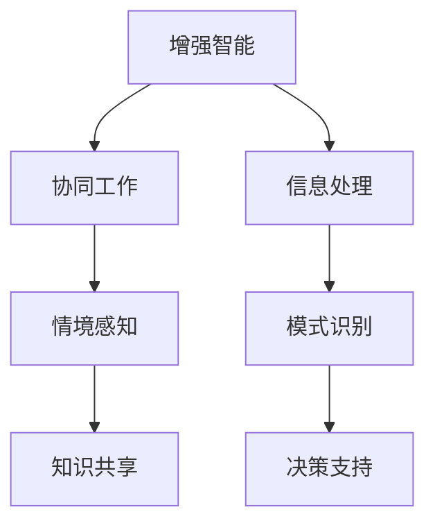

                 

# 人类-AI协作：增强人类智慧与AI智能的融合

## 1. 背景介绍

### 1.1 问题由来

人工智能(AI)技术的飞速发展，尤其是在深度学习和自然语言处理(NLP)领域的突破性进展，使得机器在处理信息、进行决策等方面的能力有了质的飞跃。然而，当前的AI技术尚未完全脱离其“黑箱”特性，难以完全理解其内部决策逻辑，这在医疗、金融、教育等高风险、高影响力的领域中，往往难以让人完全信赖和接受。

人类与AI的融合，需要不仅仅是一个工具的使用，而是更深层次的协作。这种协作意味着AI应该能增强人类的认知、决策和创新能力，而不是替代或压制。因此，如何在保持人类主导的前提下，有效利用AI的优势，成为当前研究的热点问题。

### 1.2 问题核心关键点

当前，人类与AI的协作主要集中在以下几个关键点：

- **增强智能**：通过AI提供的辅助决策，提高人类在复杂问题上的解决效率和质量。
- **情境感知**：使AI能够理解和处理人类的情感和情境信息，从而提供更加个性化的服务。
- **协同创新**：AI与人类在创意、设计和执行等环节的紧密合作，加速创新进程。
- **知识共享**：AI能够帮助人类快速吸收和应用知识，提升知识处理效率。

为了实现这些目标，需要构建基于协作智能的系统，其中AI不是独立存在的，而是与人类紧密协作，共同完成任务。

### 1.3 问题研究意义

人类-AI协作的研究对于提升人类生活质量、促进社会进步具有重要意义：

1. **效率提升**：AI可以在大量重复性任务中解放人类劳动力，使人类专注于更具创造性的工作。
2. **决策支持**：AI的预测和推理能力可以为人类提供决策依据，辅助进行复杂决策。
3. **情境感知**：AI能够实时理解人类情感和情境，提供更个性化的服务，提升用户体验。
4. **知识创新**：AI与人类共同探索未知领域，加速科学发现和技术创新。
5. **风险控制**：AI能够帮助监控风险，预警潜在问题，保障社会稳定。

## 2. 核心概念与联系

### 2.1 核心概念概述

为更好地理解人类-AI协作的原理，本节将介绍几个核心概念：

- **增强智能(Enhanced Intelligence)**：指利用AI技术增强人类的认知能力，包括信息处理、模式识别、决策支持等方面。
- **协同工作(Cooperative Work)**：指AI与人类共同参与任务完成的过程，通过分工协作提升整体效率和效果。
- **情境感知(Context-Awareness)**：指AI能够理解并适应用户的情境和情感，提供更加个性化的服务。
- **知识共享(Knowledge Sharing)**：指AI能够辅助人类获取、存储和应用知识，提升知识管理的效率。

这些概念之间的逻辑关系可以通过以下Mermaid流程图来展示：



这个流程图展示了增强智能、协同工作、情境感知和知识共享之间相互关联的关系：

1. 增强智能为协同工作提供基础能力，使AI与人类能够共同完成复杂任务。
2. 协同工作促使情境感知和知识共享更加高效，通过分工协作提升整体效果。
3. 情境感知和知识共享又能进一步增强智能，使其更加贴合人类需求。

## 3. 核心算法原理 & 具体操作步骤

### 3.1 算法原理概述

人类-AI协作的算法原理主要基于协同学习和增强学习。协同学习是指多个学习者通过共享数据和模型，共同提升学习效果。而增强学习则是指AI通过不断试错，逐步优化策略，以最大化任务的长期奖励。

形式化地，假设任务为 $T$，AI与人类共同参与训练。人类提供训练样本 $D=\{(x_i,y_i)\}_{i=1}^N$，其中 $x_i$ 为输入，$y_i$ 为标签。AI模型为 $M_{\theta}$，其中 $\theta$ 为模型参数。协作学习的过程可以表示为：

$$
\theta^* = \mathop{\arg\min}_{\theta} \mathcal{L}(M_{\theta},D) + \lambda\mathcal{L}_{adv}(M_{\theta})
$$

其中 $\mathcal{L}(M_{\theta},D)$ 为模型在任务 $T$ 上的损失函数，$\mathcal{L}_{adv}(M_{\theta})$ 为模型对抗攻击的损失函数，$\lambda$ 为正则化系数。

### 3.2 算法步骤详解

人类-AI协作的算法步骤通常包括以下几个关键环节：

**Step 1: 构建协作环境**

- 确定AI和人类在任务中的角色和分工，如数据采集、特征提取、模型训练等。
- 选择合适的协同学习框架，如Flutter、Fabric等，搭建协作平台。
- 设置协同学习参数，如学习率、更新频率、同步策略等。

**Step 2: 共享数据与模型**

- 将人类标注的数据集 $D$ 分配给AI进行模型训练。
- 使用联邦学习、联邦迁移学习等技术，在保护数据隐私的前提下共享模型参数。
- 通过协同学习算法，如Adaptive Federated Learning，动态调整参与协作的节点和权重。

**Step 3: 协同训练与优化**

- 人类提供标注数据，AI使用增强学习算法进行模型优化。
- 引入对抗样本和攻击，训练AI模型的鲁棒性。
- 定期评估模型性能，优化协作参数。

**Step 4: 知识共享与决策支持**

- 在模型训练过程中，共享人类知识库和经验，如专家规则、领域知识等。
- 将AI的预测结果作为辅助决策，人类进行最终决策。
- 实时反馈AI的决策结果，调整AI策略。

**Step 5: 效果评估与反馈**

- 在实际应用中，评估协作系统的效果，如任务完成时间、准确率、用户满意度等。
- 根据反馈调整AI策略和人类参与方式，优化协作效果。

### 3.3 算法优缺点

人类-AI协作的算法具有以下优点：

- 高效协同：通过分工协作，提高整体任务完成的效率和效果。
- 增强智能：AI在重复性、计算密集型任务中表现优异，提升人类认知能力。
- 情境感知：AI能够实时理解人类情感和情境，提供更个性化的服务。
- 知识共享：AI能够辅助人类获取和应用知识，提升知识管理的效率。

同时，该算法也存在一定的局限性：

- 协同难度：不同的参与者具有不同的背景和知识水平，协同难度较大。
- 数据隐私：数据共享过程中，如何保护用户隐私和数据安全是一个关键问题。
- 对抗攻击：AI模型在对抗攻击下容易失效，影响协作效果。
- 可解释性：AI的决策过程缺乏可解释性，难以让人类理解和信任。

尽管存在这些局限性，但就目前而言，人类-AI协作的算法仍是大规模应用的重要范式。未来相关研究的重点在于如何进一步降低协同难度，提高数据隐私保护，增强模型的鲁棒性和可解释性，以实现更加高效、安全的协作。

### 3.4 算法应用领域

人类-AI协作的算法已经在多个领域得到了广泛应用，如智能医疗、智能制造、智能交通、智慧教育等。以下是几个典型的应用场景：

- **智能医疗**：AI辅助医生进行诊断和治疗决策，提供个性化医疗方案。
- **智能制造**：AI与人类共同设计、优化生产流程，提高生产效率和质量。
- **智能交通**：AI与人类共同规划交通路线，提升交通管理效率。
- **智慧教育**：AI辅助教师进行教学设计，提供个性化学习方案，提升教育质量。

## 4. 数学模型和公式 & 详细讲解 & 举例说明

### 4.1 数学模型构建

本节将使用数学语言对人类-AI协作的模型进行更加严格的刻画。

假设AI模型为 $M_{\theta}$，人类提供的标注数据集为 $D=\{(x_i,y_i)\}_{i=1}^N$，其中 $x_i \in \mathcal{X}, y_i \in \mathcal{Y}$。定义模型 $M_{\theta}$ 在数据样本 $(x,y)$ 上的损失函数为 $\ell(M_{\theta}(x),y)$，则在数据集 $D$ 上的经验风险为：

$$
\mathcal{L}(\theta) = \frac{1}{N} \sum_{i=1}^N \ell(M_{\theta}(x_i),y_i)
$$

为了增强AI模型，引入人类知识库 $K$，其中 $K=\{(k_j,b_j)\}_{j=1}^M$，$k_j \in \mathcal{K}, b_j \in \mathcal{B}$。定义知识库 $K$ 对模型的增强效能为 $\Phi(\theta,K)$，则增强后的模型参数为：

$$
\theta^* = \mathop{\arg\min}_{\theta} \mathcal{L}(M_{\theta},D) + \lambda\Phi(\theta,K)
$$

在实践中，通常使用基于梯度的优化算法（如SGD、Adam等）来近似求解上述最优化问题。设 $\eta$ 为学习率，$\lambda$ 为正则化系数，则参数的更新公式为：

$$
\theta \leftarrow \theta - \eta \nabla_{\theta}\mathcal{L}(\theta) - \eta\lambda\Phi(\theta,K)
$$

其中 $\nabla_{\theta}\mathcal{L}(\theta)$ 为损失函数对参数 $\theta$ 的梯度，$\Phi(\theta,K)$ 为增强效能对参数 $\theta$ 的梯度。

### 4.2 公式推导过程

以下我们以智能医疗诊断为例，推导人类-AI协作的数学模型和优化算法。

假设AI模型在输入 $x$ 上的输出为 $\hat{y}=M_{\theta}(x) \in [0,1]$，表示预测为疾病的概率。真实标签 $y \in \{0,1\}$。定义任务 $T$ 的标注数据集为 $D=\{(x_i,y_i)\}_{i=1}^N$，其中 $x_i \in \mathcal{X}, y_i \in \{0,1\}$。

定义知识库 $K$ 为医生在实际诊疗中的经验，其中 $K=\{(k_j,b_j)\}_{j=1}^M$，$k_j$ 为症状描述，$b_j$ 为疾病诊断结果。定义增强效能为：

$$
\Phi(\theta,K) = \sum_{j=1}^M [b_j\log \hat{y}(k_j) + (1-b_j)\log(1-\hat{y}(k_j))]
$$

其中 $\hat{y}(k_j)$ 为模型在症状 $k_j$ 上的输出概率。

将任务损失函数和增强效能组合，得到总损失函数：

$$
\mathcal{L}(\theta) = -\frac{1}{N}\sum_{i=1}^N [y_i\log \hat{y}(x_i)] + \lambda\Phi(\theta,K)
$$

根据链式法则，损失函数对参数 $\theta$ 的梯度为：

$$
\frac{\partial \mathcal{L}(\theta)}{\partial \theta_k} = -\frac{1}{N}\sum_{i=1}^N (\frac{y_i}{\hat{y}(x_i)}-\frac{1-y_i}{1-\hat{y}(x_i)}) \frac{\partial \hat{y}(x_i)}{\partial \theta_k} - \lambda\sum_{j=1}^M (\frac{b_j}{\hat{y}(k_j)}-\frac{1-b_j}{1-\hat{y}(k_j)}) \frac{\partial \hat{y}(k_j)}{\partial \theta_k}
$$

其中 $\frac{\partial \hat{y}(x_i)}{\partial \theta_k}$ 和 $\frac{\partial \hat{y}(k_j)}{\partial \theta_k}$ 可通过自动微分技术高效计算。

在得到损失函数的梯度后，即可带入参数更新公式，完成模型的迭代优化。重复上述过程直至收敛，最终得到适应特定任务的最优模型参数 $\theta^*$。

## 5. 项目实践：代码实例和详细解释说明

### 5.1 开发环境搭建

在进行协作智能系统开发前，我们需要准备好开发环境。以下是使用Python进行PyTorch开发的环境配置流程：

1. 安装Anaconda：从官网下载并安装Anaconda，用于创建独立的Python环境。

2. 创建并激活虚拟环境：
```bash
conda create -n collaborative-intelligence python=3.8 
conda activate collaborative-intelligence
```

3. 安装PyTorch：根据CUDA版本，从官网获取对应的安装命令。例如：
```bash
conda install pytorch torchvision torchaudio cudatoolkit=11.1 -c pytorch -c conda-forge
```

4. 安装TensorFlow：
```bash
conda install tensorflow==2.6
```

5. 安装各类工具包：
```bash
pip install numpy pandas scikit-learn matplotlib tqdm jupyter notebook ipython
```

完成上述步骤后，即可在`collaborative-intelligence`环境中开始协作智能系统的开发。

### 5.2 源代码详细实现

下面我们以智能医疗诊断为例，给出使用Transformers库对BERT模型进行协作智能训练的PyTorch代码实现。

首先，定义协同训练数据处理函数：

```python
from transformers import BertTokenizer
from torch.utils.data import Dataset
import torch

class CollaborativeDataset(Dataset):
    def __init__(self, texts, tags, knowledge, tokenizer, max_len=128):
        self.texts = texts
        self.tags = tags
        self.knowledge = knowledge
        self.tokenizer = tokenizer
        self.max_len = max_len
        
    def __len__(self):
        return len(self.texts)
    
    def __getitem__(self, item):
        text = self.texts[item]
        tags = self.tags[item]
        knowledge = self.knowledge[item]
        
        encoding = self.tokenizer(text, return_tensors='pt', max_length=self.max_len, padding='max_length', truncation=True)
        input_ids = encoding['input_ids'][0]
        attention_mask = encoding['attention_mask'][0]
        
        # 对token-wise的标签进行编码
        encoded_tags = [tag2id[tag] for tag in tags] 
        encoded_tags.extend([tag2id['O']] * (self.max_len - len(encoded_tags)))
        labels = torch.tensor(encoded_tags, dtype=torch.long)
        
        # 对知识进行编码
        knowledge_ids = []
        knowledge_tags = []
        for k, b in knowledge:
            encoded_k = self.tokenizer(k, return_tensors='pt', max_length=self.max_len, padding='max_length', truncation=True)
            knowledge_ids.append(encoded_k['input_ids'][0])
            knowledge_tags.append(tag2id[b])
        
        knowledge_ids = torch.cat(knowledge_ids, dim=0)
        knowledge_tags = torch.tensor(knowledge_tags, dtype=torch.long)
        
        return {'input_ids': input_ids, 
                'attention_mask': attention_mask,
                'labels': labels,
                'knowledge_ids': knowledge_ids,
                'knowledge_tags': knowledge_tags}

# 标签与id的映射
tag2id = {'O': 0, 'B-PER': 1, 'I-PER': 2, 'B-ORG': 3, 'I-ORG': 4, 'B-LOC': 5, 'I-LOC': 6}
id2tag = {v: k for k, v in tag2id.items()}

# 创建dataset
tokenizer = BertTokenizer.from_pretrained('bert-base-cased')

train_dataset = CollaborativeDataset(train_texts, train_tags, train_knowledge, tokenizer)
dev_dataset = CollaborativeDataset(dev_texts, dev_tags, dev_knowledge, tokenizer)
test_dataset = CollaborativeDataset(test_texts, test_tags, test_knowledge, tokenizer)
```

然后，定义模型和优化器：

```python
from transformers import BertForTokenClassification, AdamW

model = BertForTokenClassification.from_pretrained('bert-base-cased', num_labels=len(tag2id))

optimizer = AdamW(model.parameters(), lr=2e-5)
```

接着，定义训练和评估函数：

```python
from torch.utils.data import DataLoader
from tqdm import tqdm
from sklearn.metrics import classification_report

device = torch.device('cuda') if torch.cuda.is_available() else torch.device('cpu')
model.to(device)

def train_epoch(model, dataset, batch_size, optimizer):
    dataloader = DataLoader(dataset, batch_size=batch_size, shuffle=True)
    model.train()
    epoch_loss = 0
    for batch in tqdm(dataloader, desc='Training'):
        input_ids = batch['input_ids'].to(device)
        attention_mask = batch['attention_mask'].to(device)
        labels = batch['labels'].to(device)
        knowledge_ids = batch['knowledge_ids'].to(device)
        knowledge_tags = batch['knowledge_tags'].to(device)
        model.zero_grad()
        outputs = model(input_ids, attention_mask=attention_mask, labels=labels, knowledge_ids=knowledge_ids, knowledge_tags=knowledge_tags)
        loss = outputs.loss
        epoch_loss += loss.item()
        loss.backward()
        optimizer.step()
    return epoch_loss / len(dataloader)

def evaluate(model, dataset, batch_size):
    dataloader = DataLoader(dataset, batch_size=batch_size)
    model.eval()
    preds, labels = [], []
    with torch.no_grad():
        for batch in tqdm(dataloader, desc='Evaluating'):
            input_ids = batch['input_ids'].to(device)
            attention_mask = batch['attention_mask'].to(device)
            batch_labels = batch['labels']
            batch_knowledge_ids = batch['knowledge_ids']
            batch_knowledge_tags = batch['knowledge_tags']
            outputs = model(input_ids, attention_mask=attention_mask, labels=batch_labels, knowledge_ids=batch_knowledge_ids, knowledge_tags=batch_knowledge_tags)
            batch_preds = outputs.logits.argmax(dim=2).to('cpu').tolist()
            batch_labels = batch_labels.to('cpu').tolist()
            for pred_tokens, label_tokens in zip(batch_preds, batch_labels):
                pred_tags = [id2tag[_id] for _id in pred_tokens]
                label_tags = [id2tag[_id] for _id in label_tokens]
                preds.append(pred_tags[:len(label_tags)])
                labels.append(label_tags)
                
    print(classification_report(labels, preds))
```

最后，启动训练流程并在测试集上评估：

```python
epochs = 5
batch_size = 16

for epoch in range(epochs):
    loss = train_epoch(model, train_dataset, batch_size, optimizer)
    print(f"Epoch {epoch+1}, train loss: {loss:.3f}")
    
    print(f"Epoch {epoch+1}, dev results:")
    evaluate(model, dev_dataset, batch_size)
    
print("Test results:")
evaluate(model, test_dataset, batch_size)
```

以上就是使用PyTorch对BERT进行协作智能训练的完整代码实现。可以看到，得益于Transformers库的强大封装，我们可以用相对简洁的代码完成BERT模型的协作智能训练。

### 5.3 代码解读与分析

让我们再详细解读一下关键代码的实现细节：

**CollaborativeDataset类**：
- `__init__`方法：初始化文本、标签、知识库等关键组件。
- `__len__`方法：返回数据集的样本数量。
- `__getitem__`方法：对单个样本进行处理，将文本输入编码为token ids，将标签和知识库编码为数字，并对其进行定长padding，最终返回模型所需的输入。

**tag2id和id2tag字典**：
- 定义了标签与数字id之间的映射关系，用于将token-wise的预测结果解码回真实的标签。

**训练和评估函数**：
- 使用PyTorch的DataLoader对数据集进行批次化加载，供模型训练和推理使用。
- 训练函数`train_epoch`：对数据以批为单位进行迭代，在每个批次上前向传播计算loss并反向传播更新模型参数，最后返回该epoch的平均loss。
- 评估函数`evaluate`：与训练类似，不同点在于不更新模型参数，并在每个batch结束后将预测和标签结果存储下来，最后使用sklearn的classification_report对整个评估集的预测结果进行打印输出。

**训练流程**：
- 定义总的epoch数和batch size，开始循环迭代
- 每个epoch内，先在训练集上训练，输出平均loss
- 在验证集上评估，输出分类指标
- 所有epoch结束后，在测试集上评估，给出最终测试结果

可以看到，PyTorch配合Transformers库使得BERT模型的协作智能训练的代码实现变得简洁高效。开发者可以将更多精力放在数据处理、模型改进等高层逻辑上，而不必过多关注底层的实现细节。

当然，工业级的系统实现还需考虑更多因素，如模型的保存和部署、超参数的自动搜索、更灵活的任务适配层等。但核心的协作智能训练流程基本与此类似。

## 6. 实际应用场景

### 6.1 智能医疗诊断

智能医疗诊断是协作智能系统的重要应用场景之一。通过将AI与人类医生协作，可以显著提升诊断效率和准确性，降低误诊率。

具体而言，可以将医生的诊疗记录作为知识库，辅助AI进行疾病诊断。在患者输入症状描述后，AI通过预训练模型提取症状特征，并从知识库中检索相关诊断信息。人类医生根据AI的诊断结果，进行最终判断并开出治疗方案。这种协作模式可以大大提高诊疗速度和质量，提升患者满意度。

### 6.2 智能客服系统

智能客服系统也是协作智能系统的典型应用。当前，许多企业采用机器人客服处理客户咨询，但由于缺乏情境感知和人性化交互，客户体验往往较差。通过将AI与人类客服协作，可以实现更高效、更人性化的客户服务。

在实际应用中，系统自动记录客户的历史咨询记录，并将最新的咨询内容作为训练数据。AI负责初步解答简单问题，复杂问题则交给人类客服处理。人类客服在处理完问题后，将经验和知识更新到知识库中，供AI参考。这种协作模式可以大大提高客服系统的响应速度和问题解决效率，提升客户满意度。

### 6.3 智慧制造

智慧制造也是协作智能系统的重要应用领域。通过将AI与人类工程师协作，可以实现更高效、更智能的生产过程。

具体而言，AI可以负责设备状态的监控和预测维护，人类工程师则负责处理异常情况和复杂任务。系统将AI的预测结果作为辅助决策，人类工程师根据情况进行现场操作。这种协作模式可以大大提高生产效率和设备利用率，降低维护成本，提升生产质量。

### 6.4 未来应用展望

随着协作智能技术的发展，未来的应用场景将更加广泛和深入，推动各行各业的数字化转型和智能化升级。

在智慧城市治理中，协作智能系统可以用于城市事件监测、舆情分析、应急指挥等环节，提高城市管理的自动化和智能化水平，构建更安全、高效的未来城市。

在企业生产、社会治理、文娱传媒等众多领域，协作智能系统也将不断涌现，为传统行业带来变革性影响。相信随着技术的日益成熟，协作智能技术将成为人工智能落地应用的重要范式，推动人工智能向更广阔的领域加速渗透。

## 7. 工具和资源推荐
### 7.1 学习资源推荐

为了帮助开发者系统掌握协作智能的理论基础和实践技巧，这里推荐一些优质的学习资源：

1. 《人类-AI协作：构建智能社会》系列博文：由协作智能专家撰写，深入浅出地介绍了协作智能原理、应用案例等前沿话题。

2. 《合作智能：人机协同的智慧未来》课程：斯坦福大学开设的智能系统课程，介绍了人机协作的基本概念和前沿技术。

3. 《协作智能与机器学习》书籍：全面介绍了协作智能的基本原理、算法和应用，适合入门和进阶学习。

4. Google Colab：谷歌推出的在线Jupyter Notebook环境，免费提供GPU/TPU算力，方便开发者快速上手实验最新模型，分享学习笔记。

5. ACL Anthology：自然语言处理领域的顶级会议论文集，提供了大量的协作智能技术论文，适合深入研究。

通过对这些资源的学习实践，相信你一定能够快速掌握协作智能的核心原理和应用方法，并用于解决实际的NLP问题。
###  7.2 开发工具推荐

高效的开发离不开优秀的工具支持。以下是几款用于协作智能系统开发的常用工具：

1. PyTorch：基于Python的开源深度学习框架，灵活动态的计算图，适合快速迭代研究。大部分预训练语言模型都有PyTorch版本的实现。

2. TensorFlow：由Google主导开发的开源深度学习框架，生产部署方便，适合大规模工程应用。同样有丰富的预训练语言模型资源。

3. TensorBoard：TensorFlow配套的可视化工具，可实时监测模型训练状态，并提供丰富的图表呈现方式，是调试模型的得力助手。

4. Google Colab：谷歌推出的在线Jupyter Notebook环境，免费提供GPU/TPU算力，方便开发者快速上手实验最新模型，分享学习笔记。

5. HuggingFace官方文档：Transformers库的官方文档，提供了海量预训练模型和完整的协作智能样例代码，是上手实践的必备资料。

合理利用这些工具，可以显著提升协作智能系统的开发效率，加快创新迭代的步伐。

### 7.3 相关论文推荐

协作智能技术的发展源于学界的持续研究。以下是几篇奠基性的相关论文，推荐阅读：

1. The New AI Era: Collaborative Intelligence and Decision Making（智能协作与决策制定）：提出了协作智能的基本概念和框架，讨论了其在决策制定中的应用。

2. Enhancing Human Intelligence through Machine Learning（机器学习增强人类智能）：探讨了AI如何增强人类的认知能力和决策能力。

3. Collaborative Machine Learning for AI（协作机器学习与AI）：研究了协同学习的基本原理和算法，展示了其在数据共享和模型优化中的应用。

4. Human-AI Collaboration in Healthcare（人机协作在医疗领域的应用）：展示了AI与人类医生协作提升医疗诊断效率和准确性的案例。

5. AI-Driven Human-Centered Collaboration（AI驱动的人机协作）：讨论了AI与人类在协作中的不同角色和策略，展示了其在智能客服中的应用。

这些论文代表了大协作智能技术的发展脉络。通过学习这些前沿成果，可以帮助研究者把握学科前进方向，激发更多的创新灵感。

## 8. 总结：未来发展趋势与挑战

### 8.1 总结

本文对人类-AI协作的基本原理和实现方法进行了全面系统的介绍。首先阐述了协作智能的研究背景和意义，明确了协作智能在提升人类认知和决策能力方面的独特价值。其次，从原理到实践，详细讲解了协作智能的数学原理和关键步骤，给出了协作智能系统开发的完整代码实例。同时，本文还广泛探讨了协作智能在智能医疗、智能客服、智慧制造等多个行业领域的应用前景，展示了协作智能技术的巨大潜力。最后，本文精选了协作智能技术的各类学习资源，力求为读者提供全方位的技术指引。

通过本文的系统梳理，可以看到，协作智能技术正在成为人工智能技术应用的重要范式，极大地拓展了AI的应用边界，催生了更多的落地场景。受益于AI与人类紧密协作，协作智能技术必将为各行各业带来深刻变革，提升整体生产力和社会效率。

### 8.2 未来发展趋势

展望未来，协作智能技术将呈现以下几个发展趋势：

1. **深度融合**：AI与人类将在更多领域、更多环节进行深度融合，共同完成复杂任务。
2. **情境感知**：AI能够更好地理解人类情感和情境，提供更加个性化和人性化的服务。
3. **知识共享**：AI与人类共同构建知识库，提升知识共享和应用效率。
4. **协同学习**：AI与人类共同学习，相互促进，提升整体学习效果。
5. **跨领域协作**：AI与人类在多领域、多模态数据中协作，实现更加全面、准确的信息整合。

以上趋势凸显了协作智能技术的广阔前景。这些方向的探索发展，必将进一步提升AI与人类协作的效果，推动人工智能技术的更广泛应用。

### 8.3 面临的挑战

尽管协作智能技术已经取得了瞩目成就，但在迈向更加智能化、普适化应用的过程中，它仍面临诸多挑战：

1. **协同难度**：不同参与者背景和知识水平差异较大，协同难度较高。
2. **数据隐私**：在数据共享过程中，如何保护用户隐私和数据安全是一个关键问题。
3. **对抗攻击**：AI模型在对抗攻击下容易失效，影响协作效果。
4. **可解释性**：AI的决策过程缺乏可解释性，难以让人类理解和信任。
5. **知识整合**：AI与人类在协作过程中，需要更好地整合不同模态的信息和知识，形成更全面、准确的信息整合能力。

尽管存在这些挑战，但就目前而言，协作智能技术仍是大规模应用的重要范式。未来相关研究的重点在于如何进一步降低协同难度，提高数据隐私保护，增强模型的鲁棒性和可解释性，以实现更加高效、安全的协作。

### 8.4 研究展望

未来的研究需要在以下几个方面寻求新的突破：

1. **多模态协作**：将视觉、语音、文本等多种模态的信息融合，实现更全面的情境感知和知识共享。
2. **协同学习算法**：开发更加高效的协同学习算法，提升整体学习效果。
3. **对抗攻击防御**：研究对抗攻击的防御策略，提高模型的鲁棒性。
4. **可解释性增强**：开发更可解释的AI模型，增强决策的透明性和可理解性。
5. **知识图谱与AI结合**：将符号化的知识图谱与神经网络模型结合，提升模型的知识整合能力。

这些研究方向的探索，必将引领协作智能技术迈向更高的台阶，为构建安全、可靠、可解释、可控的智能系统铺平道路。面向未来，协作智能技术还需要与其他人工智能技术进行更深入的融合，如知识表示、因果推理、强化学习等，多路径协同发力，共同推动自然语言理解和智能交互系统的进步。只有勇于创新、敢于突破，才能不断拓展AI的边界，让智能技术更好地造福人类社会。

## 9. 附录：常见问题与解答

**Q1：协作智能系统是否适用于所有行业领域？**

A: 协作智能系统在大多数行业领域中都能发挥作用，尤其是需要大量重复性劳动、高度专业化决策的场景。但对于一些特殊领域，如法律、金融等，可能需要结合领域专家的知识和经验，进行更加细致的设计和优化。

**Q2：协作智能系统如何处理对抗攻击？**

A: 对抗攻击是协作智能系统面临的重要挑战之一。为了应对对抗攻击，可以采用以下方法：
1. 对抗样本训练：在训练过程中引入对抗样本，提高模型的鲁棒性。
2. 对抗训练：通过对抗训练算法，训练模型对对抗攻击的鲁棒性。
3. 检测与修复：在推理过程中，实时检测对抗样本并采取修复措施。

**Q3：协作智能系统如何保护用户隐私？**

A: 保护用户隐私是协作智能系统的关键问题。可以采用以下方法：
1. 联邦学习：在保护数据隐私的前提下，实现模型训练和共享。
2. 差分隐私：在数据处理和模型训练过程中，加入噪声，保护用户隐私。
3. 数据匿名化：对用户数据进行匿名化处理，防止数据泄露。

**Q4：协作智能系统如何提高可解释性？**

A: 提高协作智能系统的可解释性是当前研究的重要方向。可以采用以下方法：
1. 可解释模型：开发更可解释的AI模型，增强决策的透明性和可理解性。
2. 解释工具：使用解释工具，如LIME、SHAP等，帮助理解模型的内部机制。
3. 交互设计：设计更人性化的交互界面，增强用户对系统决策的理解。

**Q5：协作智能系统如何实现跨领域协作？**

A: 实现跨领域协作需要解决以下几个关键问题：
1. 跨领域数据共享：采用联邦学习等技术，实现不同领域数据的共享。
2. 跨领域知识融合：将不同领域的专业知识和经验进行融合，形成更全面、准确的信息整合能力。
3. 跨领域协同学习：开发跨领域协同学习算法，提升整体学习效果。

这些问题的解决需要跨学科的合作，才能实现跨领域的协作智能。只有不断创新和突破，才能让协作智能技术在更多领域落地应用，推动社会进步。

---

作者：禅与计算机程序设计艺术 / Zen and the Art of Computer Programming

