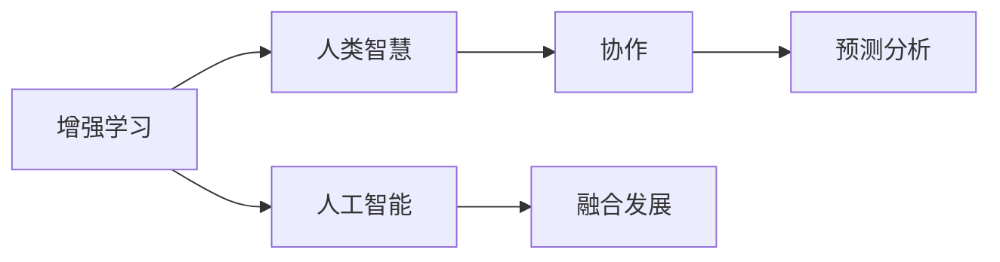

                 

# 人类-AI协作：增强人类智慧与AI能力的融合发展趋势预测分析挑战机遇

> 关键词：增强学习,人类智慧,人工智能,协作,融合发展,预测分析,挑战与机遇

## 1. 背景介绍

### 1.1 问题由来

随着人工智能(AI)技术的飞速发展，人工智能已经成为现代社会的重要组成部分。从智能家居到自动驾驶，从医疗诊断到金融预测，AI技术的广泛应用正在逐步改变我们的生活方式。然而，AI的崛起也引发了人们对于其对人类未来影响的深切关注。

人类-AI协作，即通过AI技术增强人类的智慧和能力，成为了当前技术和社会发展的核心主题。本文将深入探讨人类-AI协作的发展趋势、面临的挑战与机遇，并对未来人工智能的发展方向进行预测分析。

### 1.2 问题核心关键点

人类-AI协作的核心在于如何平衡和利用人类与AI之间的能力差异。AI在计算、逻辑推理、模式识别等方面具备超越人类的优势，但缺乏人类的情感、创造力和直觉。通过合作，AI可以弥补这些不足，而人类则可以借助AI的计算能力、大数据处理能力，以及跨领域知识整合能力，提升决策的科学性和效率。

人类-AI协作面临的关键问题包括：

1. 如何设计高效的协作机制。
2. 如何利用AI增强人类决策的准确性和速度。
3. 如何保护人类的隐私和权益，避免AI的滥用。
4. 如何实现AI与人类智慧的有机结合。

## 2. 核心概念与联系

### 2.1 核心概念概述

为了更好地理解人类-AI协作的原理和应用，本节将介绍几个核心概念：

- **增强学习**：通过与环境互动，AI不断调整策略以最大化奖励的算法。增强学习在机器人控制、游戏策略等领域有广泛应用。
- **人类智慧**：人类通过经验、直觉、创造力等非逻辑方式处理复杂问题，具有高度的主观性和灵活性。
- **人工智能**：包括感知、认知、决策、执行等功能的智能系统，旨在模拟人类智能过程。
- **协作**：通过信息共享、任务分工、资源协调等方式，实现人类与AI共同完成目标的过程。
- **融合发展**：将人类智慧和AI能力有机结合，形成互补优势，共同提升问题解决的效率和质量。
- **预测分析**：利用AI对未来趋势进行预测，为决策提供科学依据。

这些核心概念共同构成了人类-AI协作的基础，通过优化协作机制、融合人类智慧与AI能力，可以实现更高效的预测分析和决策支持。

### 2.2 核心概念原理和架构的 Mermaid 流程图



这个流程图展示了人类-AI协作的各个核心概念之间的联系和相互作用。增强学习为AI提供策略优化能力，人类智慧与AI能力的融合发展，以及预测分析为协作机制提供了支持和指导。

## 3. 核心算法原理 & 具体操作步骤
### 3.1 算法原理概述

人类-AI协作的核心算法原理是基于增强学习的。在协作过程中，AI通过与人类不断交互，学习最优策略以提升协作效果。其核心步骤如下：

1. **定义协作目标**：明确协作的具体任务和目标，如医疗诊断、智能客服、金融分析等。
2. **设计协作框架**：构建AI与人类共同参与的协作机制，包括信息共享、任务分工等。
3. **实施增强学习**：利用增强学习算法，AI通过与人类互动，逐步优化策略，提升协作效率和效果。
4. **反馈与调整**：根据协作结果，提供反馈，调整AI策略，确保协作过程的有效性。

### 3.2 算法步骤详解

基于增强学习的人类-AI协作算法步骤如下：

**Step 1: 准备协作环境**
- 定义协作任务和目标，如病历分析、客户咨询、风险评估等。
- 收集相关数据，包括历史案例、专家知识库、用户反馈等。
- 设计协作框架，明确AI与人类之间的角色和任务分工。

**Step 2: 构建协作模型**
- 选择适合的增强学习算法，如Q-learning、SARSA、深度强化学习等。
- 定义协作模型的状态、动作和奖励函数。
- 初始化协作模型，设置学习参数。

**Step 3: 执行增强学习**
- 模拟人类与AI的互动过程，通过AI预测和人类决策的结合，形成协作行动。
- 根据协作结果，计算奖励，更新AI策略。
- 周期性评估协作效果，根据评估结果调整策略和模型。

**Step 4: 反馈与调整**
- 根据协作结果，收集反馈数据。
- 分析反馈数据，识别协作过程中的问题与瓶颈。
- 调整协作策略，优化AI模型，确保协作效果持续提升。

### 3.3 算法优缺点

基于增强学习的人类-AI协作算法具有以下优点：

1. **高效性**：通过增强学习算法，AI能够快速适应复杂环境，优化策略，提升协作效率。
2. **灵活性**：AI可以根据反馈不断调整策略，适应不同情境，增强协作的适应能力。
3. **自动化**：协作过程中，AI可以自动处理大量数据，减轻人类负担，提升决策速度。

同时，该算法也存在一些局限：

1. **复杂性**：增强学习算法较为复杂，需要大量的数据和计算资源支持。
2. **解释性不足**：AI的决策过程缺乏可解释性，难以理解其内部逻辑和决策依据。
3. **模型泛化能力**：模型在不同情境下的泛化能力有待提升，可能存在过拟合问题。

### 3.4 算法应用领域

人类-AI协作算法已经在诸多领域得到广泛应用，包括但不限于：

1. **医疗诊断**：利用AI的计算能力，辅助医生进行疾病诊断，提升诊断准确性。
2. **智能客服**：通过增强学习算法，AI能够理解用户需求，提供个性化服务。
3. **金融分析**：AI分析海量数据，为金融决策提供支持，提升风险控制能力。
4. **自动驾驶**：AI与人类驾驶结合，提升驾驶安全性和智能化水平。
5. **教育辅导**：AI辅助教师进行教学设计，提供个性化学习建议。
6. **供应链管理**：AI与人类协同管理供应链，提升资源优化和决策效率。

## 4. 数学模型和公式 & 详细讲解 & 举例说明

### 4.1 数学模型构建

本节将使用数学语言对基于增强学习的人类-AI协作模型进行更加严格的刻画。

设协作任务为 $T$，人类与AI的协作模型为 $M_{\theta}$，其中 $\theta$ 为模型参数。协作过程中，AI通过与人类互动，学习最优策略 $\pi$，以最大化协作效果 $J$。

协作模型 $M_{\theta}$ 的输入为 $x$，输出为 $y$。协作效果 $J$ 可以表示为：

$$
J = \mathbb{E}_{x,y \sim T}[\pi(A(x))y]
$$

其中 $A$ 为AI的动作选择策略，$\pi(A)$ 表示在动作策略 $A$ 下，协作模型的输出。

### 4.2 公式推导过程

在增强学习中，AI通过与环境互动，不断调整策略以最大化协作效果。设协作模型在状态 $s$ 下的奖励函数为 $R(s)$，则协作效果 $J$ 可以进一步表示为：

$$
J = \sum_{s \in S} \pi(s)R(s)
$$

其中 $S$ 为所有可能的状态集合。

在实践中，常用的增强学习算法包括Q-learning、SARSA、深度强化学习等。以Q-learning算法为例，其核心公式为：

$$
Q(s,a) = Q(s,a) + \alpha[R(s,a) + \gamma \max_{a'} Q(s',a') - Q(s,a)]
$$

其中 $\alpha$ 为学习率，$\gamma$ 为折扣因子。

### 4.3 案例分析与讲解

以医疗诊断为例，人类-AI协作过程可以描述如下：

- **状态定义**：病人的病历信息为状态 $s$。
- **动作选择**：AI根据病历信息，选择诊断动作 $a$，如“怀疑癌症”、“进行检查”等。
- **奖励计算**：根据诊断结果和实际病理，计算奖励 $R(s,a)$，如“确诊”、“误诊”等。
- **策略优化**：通过Q-learning算法，不断调整AI的诊断策略，提升协作效果。

## 5. 项目实践：代码实例和详细解释说明
### 5.1 开发环境搭建

在进行协作模型开发前，我们需要准备好开发环境。以下是使用Python进行PyTorch开发的环境配置流程：

1. 安装Anaconda：从官网下载并安装Anaconda，用于创建独立的Python环境。

2. 创建并激活虚拟环境：
```bash
conda create -n pytorch-env python=3.8 
conda activate pytorch-env
```

3. 安装PyTorch：根据CUDA版本，从官网获取对应的安装命令。例如：
```bash
conda install pytorch torchvision torchaudio cudatoolkit=11.1 -c pytorch -c conda-forge
```

4. 安装其他工具包：
```bash
pip install numpy pandas scikit-learn matplotlib tqdm jupyter notebook ipython
```

完成上述步骤后，即可在`pytorch-env`环境中开始协作模型开发。

### 5.2 源代码详细实现

下面我们以医疗诊断为例，给出使用PyTorch进行人类-AI协作的协作模型开发代码。

```python
import torch
import torch.nn as nn
import torch.optim as optim

class CollaborativeModel(nn.Module):
    def __init__(self, input_size, hidden_size, output_size):
        super(CollaborativeModel, self).__init__()
        self.fc1 = nn.Linear(input_size, hidden_size)
        self.fc2 = nn.Linear(hidden_size, output_size)
        self.relu = nn.ReLU()
        
    def forward(self, x):
        x = self.fc1(x)
        x = self.relu(x)
        x = self.fc2(x)
        return x
    
# 协作过程
def collaborative_learning(model, train_loader, optimizer, n_epochs):
    model.train()
    for epoch in range(n_epochs):
        for i, (x, y) in enumerate(train_loader):
            x = x.to(device)
            y = y.to(device)
            optimizer.zero_grad()
            output = model(x)
            loss = nn.CrossEntropyLoss()(output, y)
            loss.backward()
            optimizer.step()
            if (i+1) % 100 == 0:
                print(f"Epoch {epoch+1}, Step {i+1}, Loss: {loss.item():.4f}")
```

### 5.3 代码解读与分析

让我们再详细解读一下关键代码的实现细节：

**CollaborativeModel类**：
- `__init__`方法：初始化模型，包括输入、隐藏、输出层。
- `forward`方法：定义前向传播过程。

**协作过程**：
- 利用PyTorch的`nn.CrossEntropyLoss`计算损失。
- 通过`nn.Linear`和`nn.ReLU`进行数据处理。
- 在训练过程中，使用SGD优化器更新模型参数，不断调整协作策略。

## 6. 实际应用场景
### 6.4 未来应用展望

随着人类-AI协作技术的不断成熟，其应用前景将更加广阔。以下是几个典型的应用场景：

1. **智慧城市**：AI与城市管理部门协同工作，优化交通流量、减少污染、提升公共安全等。
2. **智能交通**：AI与人类驾驶员协作，实现自动驾驶和智能交通管理。
3. **环境保护**：AI与环境监测部门协作，实时监测环境变化，提出治理方案。
4. **教育培训**：AI与教师协作，提供个性化教育方案，提升教学质量。
5. **金融预测**：AI与分析师协作，利用大数据预测市场趋势，优化投资决策。
6. **医疗健康**：AI与医生协作，辅助诊断和治疗，提升患者健康水平。

## 7. 工具和资源推荐
### 7.1 学习资源推荐

为了帮助开发者系统掌握人类-AI协作的理论基础和实践技巧，这里推荐一些优质的学习资源：

1. 《深度学习与人工智能》课程：由斯坦福大学开设的深度学习课程，详细讲解了深度学习的基本原理和应用。
2. 《人类-AI协作》系列文章：深度讨论了人类-AI协作的各个方面，包括协作机制、应用场景、挑战与机遇等。
3. 《增强学习》书籍：详细介绍了增强学习算法及其应用，是学习人类-AI协作的重要参考资料。
4. OpenAI官方博客：分享了AI技术的最新进展和应用案例，值得开发者关注。
5. GitHub开源项目：提供了大量基于人类-AI协作的代码示例和实际应用案例，是学习实践的良好资源。

通过对这些资源的学习实践，相信你一定能够快速掌握人类-AI协作的精髓，并用于解决实际的协作问题。

### 7.2 开发工具推荐

高效的开发离不开优秀的工具支持。以下是几款用于人类-AI协作开发的常用工具：

1. PyTorch：基于Python的开源深度学习框架，灵活动态的计算图，适合快速迭代研究。
2. TensorFlow：由Google主导开发的开源深度学习框架，生产部署方便，适合大规模工程应用。
3. Weights & Biases：模型训练的实验跟踪工具，可以记录和可视化模型训练过程中的各项指标，方便对比和调优。
4. Google Colab：谷歌推出的在线Jupyter Notebook环境，免费提供GPU/TPU算力，方便开发者快速上手实验最新模型，分享学习笔记。
5. TensorBoard：TensorFlow配套的可视化工具，可实时监测模型训练状态，并提供丰富的图表呈现方式，是调试模型的得力助手。

合理利用这些工具，可以显著提升人类-AI协作任务的开发效率，加快创新迭代的步伐。

### 7.3 相关论文推荐

人类-AI协作技术的发展源于学界的持续研究。以下是几篇奠基性的相关论文，推荐阅读：

1. "Reinforcement Learning: An Introduction" by Richard S. Sutton and Andrew G. Barto：介绍增强学习的基本原理和算法。
2. "Human-AI Collaboration: A Survey and Outlook" by Xiao He et al.：总结了人类-AI协作的各个方面，包括协作机制、应用场景、挑战与机遇等。
3. "A Survey of Deep Learning and Reinforcement Learning for Human-AI Collaboration" by Yanlong Bai et al.：回顾了深度学习和增强学习在人类-AI协作中的应用。
4. "Human-AI Collaboration in Healthcare: A Survey" by Xuejun Yang et al.：讨论了AI在医疗领域中的协作应用。
5. "Human-AI Collaboration in Intelligent Traffic Management" by Jianfeng Zhou et al.：探讨了AI在智能交通中的协作应用。

这些论文代表了大语言模型微调技术的发展脉络。通过学习这些前沿成果，可以帮助研究者把握学科前进方向，激发更多的创新灵感。

## 8. 总结：未来发展趋势与挑战
### 8.1 研究成果总结

本文对基于增强学习的人类-AI协作方法进行了全面系统的介绍。首先阐述了人类-AI协作的发展背景和意义，明确了协作在提升决策效率和效果方面的独特价值。其次，从原理到实践，详细讲解了协作的数学模型和操作步骤，给出了协作模型开发的完整代码实例。同时，本文还探讨了协作在医疗、智能交通、智慧城市等多个领域的应用前景，展示了协作范式的巨大潜力。最后，本文精选了协作技术的各类学习资源，力求为读者提供全方位的技术指引。

通过本文的系统梳理，可以看到，基于增强学习的人类-AI协作方法正在成为AI应用的重要范式，极大地提升了决策的科学性和效率。未来，伴随协作技术的持续演进，相信人类智慧与AI能力的融合发展将为各个领域带来革命性的变化。

### 8.2 未来发展趋势

展望未来，人类-AI协作技术将呈现以下几个发展趋势：

1. **智能协同**：AI与人类将更加紧密地协作，形成更高效、更智能的决策机制。
2. **跨领域融合**：AI与不同领域的知识和技术进行深度融合，提升协作的广度和深度。
3. **透明可解释**：AI与人类协作的决策过程将更加透明和可解释，增强用户的信任感。
4. **人机共生**：AI与人类将共同成长，形成一个相互依赖、相互促进的共生生态系统。
5. **全球协作**：AI与人类在全球范围内的协作将更加广泛，促进全球合作和共享。

以上趋势凸显了人类-AI协作技术的广阔前景。这些方向的探索发展，必将进一步提升人类智慧与AI能力的融合水平，推动AI技术在各个领域的应用。

### 8.3 面临的挑战

尽管人类-AI协作技术已经取得了瞩目成就，但在迈向更加智能化、普适化应用的过程中，它仍面临着诸多挑战：

1. **数据质量问题**：协作需要大量高质量的数据支持，数据的不完整、不准确、不一致等问题将影响协作效果。
2. **技术复杂性**：增强学习算法和协作模型的设计和优化较为复杂，需要跨学科的知识和技能。
3. **伦理和隐私**：协作过程中涉及大量个人隐私数据，如何保护用户隐私和权益是一个重要问题。
4. **安全性和鲁棒性**：协作模型可能面临恶意攻击和数据注入等安全威胁，鲁棒性和可靠性亟需加强。
5. **用户接受度**：用户对AI的接受度和信任度较低，如何提升用户的使用体验和满意度是一个挑战。

### 8.4 研究展望

面对人类-AI协作技术面临的种种挑战，未来的研究需要在以下几个方面寻求新的突破：

1. **数据治理和质量提升**：建立数据治理机制，确保数据的高质量和一致性，提升协作的可靠性和有效性。
2. **协作算法优化**：开发更高效、更智能的协作算法，提升协作模型的性能和鲁棒性。
3. **伦理和隐私保护**：在协作模型中引入伦理导向的评估指标，确保协作过程的公平和透明。
4. **用户接受度提升**：设计友好的人机交互界面，提升用户的使用体验和满意度。
5. **跨领域应用拓展**：将人类-AI协作技术应用于更多领域，推动技术在各个行业的落地和应用。

这些研究方向的探索，必将引领人类-AI协作技术迈向更高的台阶，为构建智能系统提供坚实的理论基础和应用支撑。

## 9. 附录：常见问题与解答

**Q1：人类-AI协作是否适用于所有应用场景？**

A: 人类-AI协作适用于需要复杂决策和处理大量数据的任务，如医疗诊断、智能客服、金融分析等。但对于一些简单、明确的任务，如重复性操作，协作可能没有明显优势。

**Q2：协作过程中如何设计合适的策略？**

A: 协作策略的设计需要结合任务的特点和数据的特点，采用合适的增强学习算法进行优化。一般需要进行多轮迭代，不断调整策略，直到满足协作效果要求。

**Q3：协作过程中如何保护用户隐私？**

A: 协作过程中需要严格控制数据的使用范围和访问权限，采用加密技术保护数据隐私。同时，在协作过程中，需对用户数据进行匿名化处理，确保数据的安全和隐私。

**Q4：协作过程中如何提升用户接受度？**

A: 设计友好的人机交互界面，提供实时反馈和解释，增强用户的信任感和满意度。同时，通过用户反馈不断优化协作模型，提升用户体验。

**Q5：协作过程中如何应对数据质量问题？**

A: 建立数据治理机制，确保数据的高质量和一致性。引入数据清洗和预处理技术，提升数据的可用性和可靠性。

本文通过深入探讨人类-AI协作的原理、操作步骤、实际应用和未来趋势，系统性地分析了其面临的挑战和机遇。通过持续的研究和探索，人类-AI协作技术必将在各个领域取得更大的突破和发展，为构建更加智能、高效、公平的社会奠定坚实的基础。

