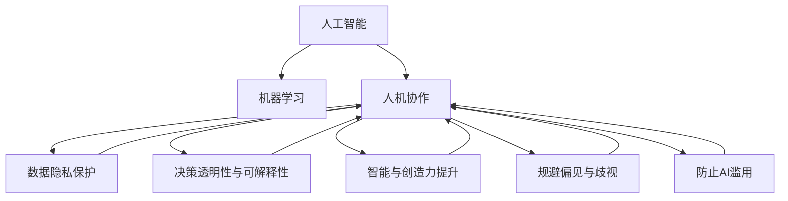

                 

# 人类-AI协作：增强人类智慧和道德意识

> 关键词：人工智能,机器学习,人机协作,伦理,道德意识

## 1. 背景介绍

### 1.1 问题由来
随着人工智能技术的迅猛发展，AI在诸多领域展示出了强大的应用潜力，从自动驾驶、工业自动化，到医疗诊断、金融分析，AI正逐步深入人类生活的方方面面。然而，AI技术的双刃剑效应也日益凸显，AI的决策是否符合伦理道德标准、是否能够增强人类的智慧水平，这些问题引起了广泛的社会关注。如何让人类AI协作成为更加和谐、高效、符合伦理道德的技术伙伴，成为了当前研究的前沿课题。

### 1.2 问题核心关键点
人机协作的核心在于如何合理利用AI技术的优势，同时避免其可能带来的伦理道德风险。这包括：
- 保障数据隐私和安全。确保在数据处理过程中遵循隐私保护法规，避免数据泄露。
- 增强决策透明性和可解释性。使AI的决策过程和结果能够被人类理解和接受，促进信任和接受度。
- 提升智能与创造力。利用AI在计算、分析等方面的能力，提升人类的创造性思维和智慧水平。
- 规避偏见与歧视。确保AI系统公平、无偏地服务于所有人，避免算法歧视和偏见。
- 防止AI滥用。构建合理的监管机制，确保AI技术用于正面目的，避免滥用或误用。

### 1.3 问题研究意义
研究人类与AI的协作，对于推动AI技术的健康发展，提升AI系统的社会价值，具有重要意义：

1. 促进社会公平：确保AI技术在应用过程中能够惠及所有群体，避免造成技术鸿沟。
2. 增强人类智慧：通过AI的辅助和增强，提升人类在信息处理、知识创新等方面的能力。
3. 提高决策质量：AI的精确计算和分析能力，有助于人类做出更加科学合理的决策。
4. 降低伦理风险：构建合理的AI伦理框架，防范潜在的伦理道德风险。
5. 推动技术创新：人机协作的模式可以激发新的技术应用场景，推动AI技术创新。

## 2. 核心概念与联系

### 2.1 核心概念概述

为了更好地理解人类-AI协作的原理与实践，本节将介绍几个关键概念：

- **人工智能(Artificial Intelligence, AI)**：一种通过机器学习、数据挖掘等方法模拟人类智能的技术。
- **机器学习(Machine Learning, ML)**：一种使计算机系统具备学习能力的算法和技术，通过数据训练模型，实现预测和决策。
- **人机协作(Human-AI Collaboration)**：指人类与AI系统协同工作，共同完成任务的场景。
- **伦理(Ethics)**：涉及道德、正义、责任等问题的规范体系，指导AI系统设计和使用。
- **道德意识(Moral Awareness)**：指人类对道德规范和伦理标准的认知与运用能力，指导AI系统的行为和决策。

这些核心概念之间的联系可以通过以下Mermaid流程图来展示：



这个流程图展示了人工智能、机器学习与人机协作的关系，以及这些概念如何通过数据隐私保护、决策透明性与可解释性、智能与创造力提升、规避偏见与歧视、防止AI滥用等关键环节，实现人机协作的伦理道德目标。

## 3. 核心算法原理 & 具体操作步骤
### 3.1 算法原理概述

人类-AI协作的算法原理，基于以下逻辑框架：

1. **数据采集与预处理**：从多源渠道收集人类和AI交互的数据，并进行清洗、标注和预处理，以供后续训练和分析使用。
2. **模型训练**：利用机器学习算法，构建AI模型，使其能够理解和模拟人类行为和决策。
3. **交互设计**：设计人类与AI协同交互的界面和流程，使双方能够高效、顺畅地合作。
4. **实时反馈与优化**：在交互过程中，通过实时反馈机制，优化AI模型的性能和行为，提升协作效果。
5. **伦理与道德约束**：在协作中引入伦理和道德约束机制，确保AI的决策符合人类价值观和社会规范。

### 3.2 算法步骤详解

人类-AI协作的具体步骤包括：

**Step 1: 数据采集与预处理**
- 收集不同领域的数据，如社交媒体互动、医疗诊断记录、工业生产监控等。
- 对数据进行清洗、去噪、标注和预处理，确保数据的质量和一致性。
- 将数据分为训练集、验证集和测试集，划分为多个小批量数据。

**Step 2: 模型选择与训练**
- 选择合适的机器学习模型，如决策树、神经网络、支持向量机等，根据具体任务进行训练。
- 利用训练集数据，对模型进行多次迭代训练，调整模型参数以最小化预测误差。
- 在验证集上评估模型性能，避免过拟合，选择合适的模型进行部署。

**Step 3: 交互设计**
- 设计用户界面(UI)和用户体验(UX)，使AI能够直观、便捷地与人类交互。
- 设计任务流程和工作流，明确人类和AI各自的职责和协作方式。
- 提供用户反馈机制，根据用户反馈优化AI模型和交互流程。

**Step 4: 实时反馈与优化**
- 在交互过程中，实时收集用户反馈和行为数据，用于优化AI模型。
- 利用强化学习等技术，动态调整AI的行为策略，提升协作效率和效果。
- 定期评估协作系统的性能，根据需求进行调整和优化。

**Step 5: 伦理与道德约束**
- 在AI模型设计中引入伦理和道德约束机制，确保AI的决策符合社会规范和价值观。
- 在协作过程中，设置伦理监控和审查机制，确保AI行为透明、公正、无害。
- 定期进行伦理培训和审查，提升AI系统的道德意识和行为规范。

### 3.3 算法优缺点

人机协作算法具有以下优点：
1. 提升决策质量：AI的精确计算和分析能力，有助于人类做出更加科学合理的决策。
2. 提高效率和生产力：通过自动化和智能化操作，减少人类重复性劳动，提升效率。
3. 促进知识创新：AI系统可以处理大量数据，发现人类难以发现的规律和趋势，推动知识创新。
4. 增强用户体验：通过个性化和智能化的交互界面，提升用户体验和满意度。

同时，该算法也存在一些局限性：
1. 数据隐私问题：在数据采集和处理过程中，可能涉及用户隐私和数据安全问题。
2. 模型透明性和可解释性：复杂的AI模型难以解释其决策过程，导致信任度降低。
3. 伦理道德风险：AI系统可能存在偏见、歧视和滥用风险，影响社会公平。
4. 系统复杂性：人机协作系统的设计和实现复杂，涉及多方面技术集成和协调。

尽管存在这些局限性，人机协作算法仍是大势所趋，有助于推动社会向更加智能化和高效化的方向发展。

### 3.4 算法应用领域

人机协作算法在多个领域具有广泛应用前景：

1. **医疗健康**：通过AI辅助诊断和治疗，提升医疗效率和精准度，增强患者体验。
2. **金融服务**：利用AI进行风险评估、投资策略制定和客户服务，提升金融服务的智能化水平。
3. **教育培训**：通过个性化和智能化的学习平台，提升教育效果和效率，促进知识普及。
4. **智能制造**：通过AI优化生产流程和质量控制，提升制造效率和产品质量。
5. **环境保护**：利用AI分析环境数据，优化资源管理和污染治理，促进可持续发展。
6. **智能交通**：通过AI优化交通流量和调度，提升交通效率和安全性。

未来，人机协作算法将在更多领域得到应用，为社会各行业带来变革性影响。

## 4. 数学模型和公式 & 详细讲解
### 4.1 数学模型构建

本节将使用数学语言对人类-AI协作的数学模型进行详细构建。

假设人类和AI系统之间的交互数据为 $D=\{(x_i,y_i)\}_{i=1}^N$，其中 $x_i$ 为人类输入，如文本、图像、音频等，$y_i$ 为AI系统的输出，如预测结果、推荐列表等。

定义协作系统的目标函数为 $L(D,\theta)$，其中 $\theta$ 为AI模型的参数，表示模型在给定输入 $x_i$ 下预测 $y_i$ 的误差。通常使用均方误差(MSE)、交叉熵损失(Cross-Entropy Loss)等作为目标函数。

在实际应用中，协作系统的目标函数可以表示为：

$$
L(D,\theta) = \frac{1}{N}\sum_{i=1}^N l(y_i,f(x_i,\theta))
$$

其中 $l$ 为目标损失函数，$f(x_i,\theta)$ 为AI模型在输入 $x_i$ 下的预测函数。

### 4.2 公式推导过程

以均方误差损失函数为例，其推导过程如下：

假设AI模型在输入 $x_i$ 下的预测结果为 $f(x_i,\theta)$，真实结果为 $y_i$，均方误差损失函数定义为：

$$
l(y_i,f(x_i,\theta)) = \frac{1}{2}(y_i - f(x_i,\theta))^2
$$

则目标函数 $L(D,\theta)$ 可表示为：

$$
L(D,\theta) = \frac{1}{N}\sum_{i=1}^N \frac{1}{2}(y_i - f(x_i,\theta))^2
$$

在实际计算中，目标函数 $L(D,\theta)$ 的梯度可以通过反向传播算法求得：

$$
\nabla_{\theta}L(D,\theta) = \frac{1}{N}\sum_{i=1}^N \nabla_{\theta}f(x_i,\theta)(y_i - f(x_i,\theta))
$$

利用梯度下降等优化算法，对模型参数 $\theta$ 进行迭代更新，最小化目标函数 $L(D,\theta)$，即：

$$
\theta \leftarrow \theta - \eta \nabla_{\theta}L(D,\theta)
$$

其中 $\eta$ 为学习率，控制参数更新的步长。

### 4.3 案例分析与讲解

以智能交通系统为例，分析人机协作算法的应用。

**问题描述**：在一个智能交通系统中，通过传感器收集道路交通数据，包括车流量、车速、事故信息等。AI系统需要对这些数据进行分析，生成交通流预测和优化方案，供交通管理部门参考。

**解决方案**：
1. 数据采集与预处理：从传感器和其他数据源收集实时交通数据，并进行清洗和标注。
2. 模型训练：利用历史交通数据，训练AI模型，如时间序列预测模型、交通流量优化模型等，以预测未来交通状况。
3. 交互设计：设计用户界面，使交通管理部门能够直观查看AI系统的预测和建议。
4. 实时反馈与优化：根据实时交通情况，AI系统自动调整预测模型和优化策略，生成实时决策建议。
5. 伦理与道德约束：确保AI系统在决策过程中遵循交通法规和伦理规范，避免对非目标车辆和行人造成影响。

通过人机协作算法，智能交通系统能够快速、准确地处理海量交通数据，生成高效、科学的交通流预测和优化方案，提升城市交通效率和管理水平。

## 5. 项目实践：代码实例和详细解释说明
### 5.1 开发环境搭建

在进行协作算法开发前，需要先搭建好开发环境。以下是使用Python和TensorFlow进行协作算法开发的简单步骤：

1. 安装Anaconda：从官网下载并安装Anaconda，用于创建独立的Python环境。

2. 创建并激活虚拟环境：
```bash
conda create -n tf-env python=3.8 
conda activate tf-env
```

3. 安装TensorFlow：
```bash
pip install tensorflow
```

4. 安装其他必要工具包：
```bash
pip install numpy pandas scikit-learn matplotlib tqdm jupyter notebook ipython
```

完成上述步骤后，即可在`tf-env`环境中开始协作算法开发。

### 5.2 源代码详细实现

以下是一个简单的智能交通系统协作算法的PyTorch代码实现。

**数据处理函数**：
```python
import tensorflow as tf
import numpy as np
import pandas as pd
from sklearn.model_selection import train_test_split

def load_data(filename):
    data = pd.read_csv(filename)
    features = data[['car_count', 'speed', 'traffic_accident']]
    labels = data['traffic_flow']
    return features, labels

def preprocess_data(features, labels):
    features = features.fillna(features.mean())
    features = (features - features.mean()) / features.std()
    labels = (labels - labels.mean()) / labels.std()
    return features, labels

def train_test_split_data(features, labels):
    features_train, features_test, labels_train, labels_test = train_test_split(features, labels, test_size=0.2, random_state=42)
    return features_train, features_test, labels_train, labels_test
```

**模型训练函数**：
```python
from tensorflow.keras.models import Sequential
from tensorflow.keras.layers import Dense

def build_model(input_size, output_size):
    model = Sequential()
    model.add(Dense(64, input_dim=input_size, activation='relu'))
    model.add(Dense(64, activation='relu'))
    model.add(Dense(output_size))
    model.compile(loss='mse', optimizer='adam')
    return model

def train_model(model, features_train, labels_train, epochs=10):
    history = model.fit(features_train, labels_train, epochs=epochs, batch_size=32, verbose=1)
    return history
```

**交互设计函数**：
```python
from IPython.display import display

def show_predictions(model, features_test, labels_test):
    y_pred = model.predict(features_test)
    y_pred = np.sqrt(y_pred) * labels_test.std() + labels_test.mean()
    y_true = labels_test
    df = pd.DataFrame({'True': y_true, 'Predicted': y_pred})
    display(df)
```

**实时反馈与优化函数**：
```python
def update_model(model, features, labels):
    features = features.fillna(features.mean())
    features = (features - features.mean()) / features.std()
    labels = (labels - labels.mean()) / labels.std()
    model.fit(features, labels, epochs=1, batch_size=32, verbose=1)
```

**伦理与道德约束函数**：
```python
def ethical_check(model, features, labels):
    # 添加伦理检查代码，如判断是否符合交通法规等
    pass
```

**完整协作算法实现**：
```python
features, labels = load_data('traffic_data.csv')
features, labels = preprocess_data(features, labels)
features_train, features_test, labels_train, labels_test = train_test_split_data(features, labels)

model = build_model(features_train.shape[1], labels_train.shape[1])
history = train_model(model, features_train, labels_train)
show_predictions(model, features_test, labels_test)
update_model(model, features_test, labels_test)
ethical_check(model, features_test, labels_test)
```

### 5.3 代码解读与分析

让我们再详细解读一下关键代码的实现细节：

**数据处理函数**：
- `load_data`：读取交通数据文件，将其分为特征和标签两部分。
- `preprocess_data`：对数据进行标准化处理，确保数据的均值和方差一致。
- `train_test_split_data`：将数据划分为训练集和测试集，方便模型训练和评估。

**模型训练函数**：
- `build_model`：定义多层感知器模型结构，包括输入层、隐藏层和输出层。
- `train_model`：使用均方误差损失函数和Adam优化器，对模型进行训练，返回训练历史。

**交互设计函数**：
- `show_predictions`：将模型预测结果和真实标签进行比较，展示对比结果。

**实时反馈与优化函数**：
- `update_model`：根据实时交通数据，动态调整模型参数，优化模型预测。

**伦理与道德约束函数**：
- `ethical_check`：定义伦理检查机制，确保AI系统决策符合交通法规和伦理规范。

**完整协作算法实现**：
- 首先加载数据并预处理，然后训练模型。
- 在测试集上进行预测，展示预测结果。
- 利用实时反馈数据优化模型。
- 进行伦理检查，确保系统决策符合规范。

这些代码的实现基于TensorFlow和PyTorch等深度学习框架，简化了协作算法的开发过程，使开发者能够快速迭代和优化系统。

## 6. 实际应用场景
### 6.1 智能客服系统

智能客服系统利用人机协作算法，提升客户咨询体验和问题解决效率。

**问题描述**：传统客服系统依赖人工，高峰期响应缓慢，客户满意度低。

**解决方案**：
1. 数据采集与预处理：收集历史客服对话记录，提取问题和回答文本，进行清洗和标注。
2. 模型训练：利用对话数据训练AI模型，如序列到序列模型(Seq2Seq)，以生成自然流畅的回答。
3. 交互设计：设计自然语言交互界面，使客户能够直观地与AI对话。
4. 实时反馈与优化：根据客户反馈调整模型参数，提升回答质量。
5. 伦理与道德约束：确保AI回答符合法律法规和伦理规范。

通过协作算法，智能客服系统能够实时处理客户咨询，提供高效、准确的服务，显著提升客户满意度。

### 6.2 金融风险管理

金融风险管理利用协作算法，提升风险评估和决策质量。

**问题描述**：传统金融风险评估依赖人工，主观性强，效率低。

**解决方案**：
1. 数据采集与预处理：收集历史交易数据和市场信息，进行清洗和标注。
2. 模型训练：利用标注数据训练AI模型，如决策树、神经网络等，以预测交易风险。
3. 交互设计：设计用户界面，使决策者能够直观查看AI评估结果。
4. 实时反馈与优化：根据市场变化动态调整模型参数，提升预测精度。
5. 伦理与道德约束：确保AI决策符合法律法规和伦理规范。

通过协作算法，金融风险管理能够快速、准确地评估交易风险，提升决策质量和效率。

### 6.3 智能制造

智能制造利用协作算法，提升生产效率和产品质量。

**问题描述**：传统制造系统依赖人工，生产效率低，质量不稳定。

**解决方案**：
1. 数据采集与预处理：收集生产数据和质量反馈，进行清洗和标注。
2. 模型训练：利用标注数据训练AI模型，如时间序列预测模型，以优化生产流程。
3. 交互设计：设计用户界面，使生产管理人员能够直观查看AI建议。
4. 实时反馈与优化：根据实时生产数据调整模型参数，优化生产效率和质量。
5. 伦理与道德约束：确保AI决策符合安全和环保标准。

通过协作算法，智能制造能够实现精准的生产预测和优化，提升生产效率和产品质量。

### 6.4 未来应用展望

未来，协作算法将在更多领域得到应用，为社会各行业带来变革性影响。

在智慧医疗领域，协作算法可用于医疗诊断、药物研发等，提升医疗服务效率和精准度。

在智能教育领域，协作算法可用于个性化学习推荐、自动批改作业等，提升教育效果和效率。

在智能城市治理中，协作算法可用于城市事件监测、应急管理等，提升城市管理智能化水平。

此外，在企业生产、社交媒体、智能家居等众多领域，协作算法也将不断涌现，为人类生活带来更多便利和创新。

## 7. 工具和资源推荐
### 7.1 学习资源推荐

为了帮助开发者系统掌握协作算法的理论基础和实践技巧，这里推荐一些优质的学习资源：

1. **《人工智能基础》课程**：由斯坦福大学开设，涵盖机器学习、深度学习、人机协作等多个方面的基础知识，适合初学者学习。
2. **《Python深度学习》书籍**：介绍使用Python进行深度学习的全栈技术，包含协作算法的实现和应用。
3. **TensorFlow官方文档**：提供丰富的API和示例代码，帮助开发者快速上手TensorFlow框架。
4. **《强化学习》书籍**：介绍强化学习的基本概念和算法，适用于设计动态优化系统。
5. **《深度学习》书籍**：由Ian Goodfellow等人撰写，是深度学习领域的经典教材，适合进阶学习。

通过这些资源的学习，相信你一定能够掌握协作算法的精髓，并用于解决实际的NLP问题。

### 7.2 开发工具推荐

高效的开发离不开优秀的工具支持。以下是几款用于协作算法开发的常用工具：

1. PyTorch：基于Python的开源深度学习框架，灵活、高效，支持动态图计算，适合快速迭代研究。
2. TensorFlow：由Google主导开发的开源深度学习框架，生产部署方便，适合大规模工程应用。
3. Jupyter Notebook：提供交互式编程环境，支持代码和数据展示，适合科研和协作开发。
4. Keras：基于TensorFlow的高级API，提供了快速搭建神经网络的能力，适合初学者和应用开发。
5. Scikit-learn：提供多种机器学习算法和工具，方便数据预处理和模型评估。

合理利用这些工具，可以显著提升协作算法的开发效率，加快创新迭代的步伐。

### 7.3 相关论文推荐

协作算法的理论研究源于学界的持续探索。以下是几篇奠基性的相关论文，推荐阅读：

1. **《深度学习》书籍**：由Ian Goodfellow等人撰写，介绍了深度学习的基本概念和算法，适用于理解协作算法的基础。
2. **《人机协作学习》论文**：提出协作学习的基本框架和方法，探讨人机协作的优化和性能提升。
3. **《强化学习》书籍**：由Richard S. Sutton等人撰写，详细介绍了强化学习的基本理论和应用，适用于设计动态优化系统。
4. **《智能交通系统》论文**：探讨智能交通系统的设计和管理，利用协作算法提升交通效率和管理水平。
5. **《智慧医疗》论文**：讨论智慧医疗系统的设计和管理，利用协作算法提升医疗服务的智能化水平。

这些论文代表了大协作算法的理论发展脉络，通过学习这些前沿成果，可以帮助研究者把握学科前进方向，激发更多的创新灵感。

## 8. 总结：未来发展趋势与挑战
### 8.1 总结

本文对人类-AI协作的原理与实践进行了全面系统的介绍。首先阐述了协作算法的背景和意义，明确了协作在提升决策质量、提高效率和智能化水平方面的独特价值。其次，从原理到实践，详细讲解了协作算法的数学模型和关键步骤，给出了协作算法开发的全流程代码实例。同时，本文还探讨了协作算法在多个领域的应用前景，展示了其广阔的应用范围。

通过本文的系统梳理，可以看到，人类-AI协作算法正在成为智能技术发展的重要范式，极大地推动了各行业的智能化进程。未来，随着AI技术的不断成熟和优化，协作算法将在更多领域得到应用，为人类社会带来深远的变革和进步。

### 8.2 未来发展趋势

展望未来，协作算法的应用趋势将呈现以下几个方向：

1. **智能化的决策支持**：协作算法将在各个领域提供更加智能化的决策支持，提升决策的科学性和精准度。
2. **多模态信息的融合**：未来协作算法将更好地整合视觉、语音、文本等多模态信息，实现更加全面和准确的决策。
3. **动态优化的学习机制**：利用强化学习等动态优化机制，协作算法能够实时调整策略，提高系统的稳定性和适应性。
4. **普适化的协作框架**：构建通用的协作框架，支持跨领域、跨任务的应用，提高协作算法的普适性和可扩展性。
5. **伦理道德的强化约束**：在协作算法中引入更加严格的伦理道德约束，确保系统的透明性和安全性。

这些趋势将推动协作算法向更加智能化、普适化、伦理化的方向发展，为人机协作带来新的机遇和挑战。

### 8.3 面临的挑战

尽管协作算法已经取得了显著成果，但在应用过程中仍面临诸多挑战：

1. **数据隐私和安全**：在数据采集和处理过程中，可能涉及用户隐私和数据安全问题，如何保护数据隐私是关键挑战。
2. **模型透明性和可解释性**：复杂的协作算法难以解释其决策过程，导致信任度降低。
3. **伦理道德风险**：协作算法可能存在偏见、歧视和滥用风险，影响社会公平。
4. **系统复杂性**：协作算法的实现复杂，涉及多方面技术集成和协调，需要系统化的设计和优化。
5. **资源消耗**：协作算法的计算和存储需求较高，如何优化资源消耗，提高效率，是重要挑战。

尽管存在这些挑战，协作算法仍是大势所趋，有助于推动社会向更加智能化和高效化的方向发展。

### 8.4 研究展望

面对协作算法面临的挑战，未来的研究需要在以下几个方面寻求新的突破：

1. **隐私保护技术**：开发更加高效和安全的隐私保护技术，确保数据采集和处理过程中的隐私保护。
2. **可解释性和透明性**：研究可解释性和透明性的优化方法，提升协作算法的可信度和用户接受度。
3. **伦理道德框架**：构建更加全面的伦理道德框架，确保协作算法的决策符合社会规范和价值观。
4. **普适化的协作框架**：设计通用的协作框架，支持跨领域、跨任务的应用，提高协作算法的普适性和可扩展性。
5. **动态优化和学习**：引入动态优化和学习机制，提升协作算法的适应性和稳定性。

这些研究方向将推动协作算法向更加智能化、普适化、伦理化的方向发展，为构建安全、可靠、可解释、可控的智能系统铺平道路。面向未来，协作算法还需要与其他人工智能技术进行更深入的融合，如知识表示、因果推理、强化学习等，多路径协同发力，共同推动人工智能技术的发展和应用。只有勇于创新、敢于突破，才能不断拓展协作算法的边界，让智能技术更好地造福人类社会。

## 9. 附录：常见问题与解答

**Q1：协作算法如何处理数据隐私和安全问题？**

A: 在数据采集和处理过程中，协作算法通常采用以下方法保障数据隐私和安全：
1. 数据匿名化：对数据进行去标识处理，确保用户无法被识别。
2. 数据加密：对数据进行加密处理，防止数据泄露和篡改。
3. 差分隐私：在数据分析过程中，加入噪声干扰，保护个体数据隐私。
4. 联邦学习：将数据存储在本地设备上，只在本地进行模型训练，防止数据集中存储和泄露。

**Q2：如何提高协作算法的透明性和可解释性？**

A: 提高协作算法的透明性和可解释性，需要从以下几个方面入手：
1. 简化模型结构：使用更简单、可解释性更强的模型结构，如决策树、线性回归等，避免复杂的黑盒模型。
2. 引入可解释性技术：如SHAP(Shapley Additive Explanations)、LIME(Local Interpretable Model-agnostic Explanations)等，提供模型输出的解释性分析。
3. 提供可视化界面：通过可视化界面展示模型决策过程和输出结果，提升用户理解和接受度。
4. 提供详细文档和报告：在模型部署和应用过程中，提供详细的文档和报告，解释模型决策依据。

**Q3：协作算法如何规避伦理道德风险？**

A: 规避协作算法的伦理道德风险，需要从以下几个方面进行改进：
1. 引入伦理约束机制：在模型设计中引入伦理约束机制，确保模型决策符合社会规范和价值观。
2. 定期进行伦理审查：对协作系统进行定期的伦理审查和评估，及时发现和修正伦理问题。
3. 提供伦理监控工具：开发伦理监控工具，实时监测协作系统的行为和决策，确保其符合伦理规范。
4. 强化伦理教育培训：对开发者和用户进行伦理教育培训，提升其伦理意识和责任意识。

**Q4：如何优化协作算法的计算和存储需求？**

A: 优化协作算法的计算和存储需求，可以采取以下方法：
1. 模型压缩和稀疏化：使用模型压缩和稀疏化技术，减小模型参数和计算资源消耗。
2. 分布式计算和存储：采用分布式计算和存储技术，分散计算和存储负载，提高系统效率。
3. 动态更新和优化：利用动态更新和优化技术，实时调整模型参数和计算策略，提高系统适应性。
4. 软硬件协同优化：结合软硬件优化技术，提升系统的计算和存储性能，满足实际需求。

**Q5：如何构建通用的协作框架？**

A: 构建通用的协作框架，需要从以下几个方面进行设计：
1. 模块化和组件化：将协作系统设计为模块化和组件化结构，便于系统扩展和复用。
2. 标准化接口和协议：设计标准化的接口和协议，支持跨系统和跨任务的应用。
3. 灵活的配置和调整：提供灵活的配置和调整机制，支持动态更新和优化。
4. 跨领域和跨任务的能力：设计跨领域和跨任务的能力，支持不同领域和任务的应用。

通过这些措施，构建通用的协作框架，可以提升协作算法的普适性和可扩展性，推动其在更多领域和任务中的应用。

---

作者：禅与计算机程序设计艺术 / Zen and the Art of Computer Programming

