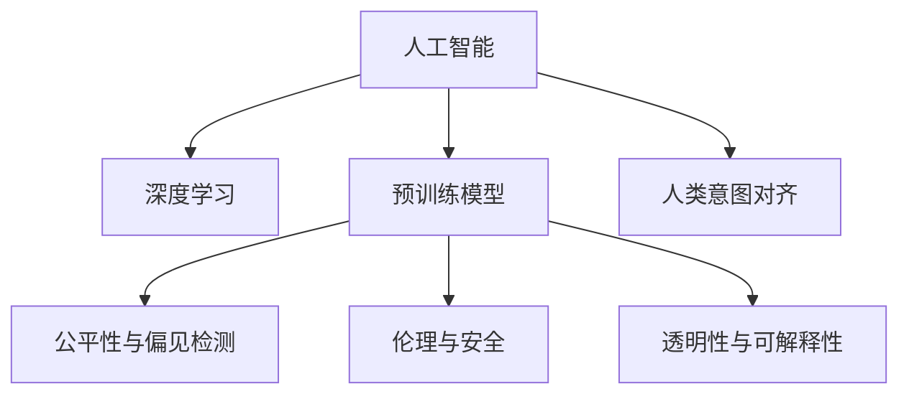

                 

# 人类意图对齐：AI 领域的挑战

> 关键词：人工智能,意图对齐,伦理与安全,AI 应用,伦理规范,公正与透明,可解释性,技术治理

## 1. 背景介绍

### 1.1 问题由来

人工智能（AI）技术的快速发展，尤其是深度学习和大规模预训练模型的崛起，正在深刻改变我们的生活方式和社会结构。从自动驾驶到智能医疗，从智能客服到工业自动化，AI 的触角已经延伸到各个领域。然而，这些技术的应用并非没有争议。AI 模型往往由算法、数据、硬件等多种因素共同驱动，这些因素背后又涉及到多方面的伦理、社会、法律问题。其中，**人类意图对齐（Human Intent Alignment）** 成为当前AI领域面临的重大挑战。

人类意图对齐是指AI系统如何确保其行为、决策和输出与人类社会的价值观念、伦理标准以及法律规范保持一致。这一概念强调AI不仅要具备智能能力，还要具备道德意识和决策责任，确保其行为符合人类的道德和法律规范。这一挑战不仅涉及到技术层面的问题，还涉及到伦理、法律和社会学等多个领域的考量。

### 1.2 问题核心关键点

AI 系统的行为和决策应始终服务于人类社会的整体福祉，避免潜在的负面影响，如歧视、偏见、隐私侵犯等。为此，AI 的设计者和使用者必须深入理解人类的价值观、期望和社会规范，并将其内化为AI系统的内在机制。这一过程涉及到以下几个关键点：

- **价值观嵌入**：确保AI系统能够理解并尊重人类的核心价值观，如公正、公平、尊重隐私等。
- **决策透明性**：提升AI决策的可解释性，使人类能够理解和信任AI系统的决策过程。
- **公正与公平**：保证AI系统的决策和输出不偏不倚，避免对特定群体的歧视和偏见。
- **伦理与安全**：确保AI系统在行为上符合伦理标准，避免对人类造成安全威胁。
- **技术治理**：建立有效的技术治理机制，确保AI系统在设计和应用过程中遵循伦理规范和法律标准。

## 2. 核心概念与联系

### 2.1 核心概念概述

为更好地理解人类意图对齐这一核心概念，本节将介绍几个密切相关的核心概念：

- **人工智能（AI）**：一种旨在模拟人类智能的技术，能够进行学习、推理、感知、自然语言处理、图像识别、决策等多种智能任务。
- **深度学习（Deep Learning）**：一种基于神经网络的机器学习技术，通过多层次的非线性特征学习，实现对复杂数据的高效处理和分析。
- **预训练模型（Pre-trained Models）**：在大规模无标签数据上进行预训练的模型，如BERT、GPT等，能够学习到丰富的语言和知识表示。
- **公平性与偏见检测（Fairness and Bias Detection）**：确保AI系统在决策过程中不偏向任何特定群体，避免基于种族、性别、年龄等特征的歧视。
- **伦理与安全（Ethics and Security）**：确保AI系统在设计和应用过程中遵循伦理规范和法律标准，保护数据隐私和网络安全。
- **透明性与可解释性（Transparency and Explainability）**：使AI系统决策过程透明，便于人类理解和监督，增强信任度。

这些核心概念之间的逻辑关系可以通过以下Mermaid流程图来展示：



这个流程图展示了大语言模型的核心概念及其之间的关系：

1. 人工智能通过深度学习和预训练模型实现智能处理。
2. 预训练模型在大规模无标签数据上学习语言和知识表示。
3. 公平性与偏见检测、伦理与安全、透明性与可解释性确保AI系统的行为符合伦理和法律规范。
4. 人类意图对齐确保AI系统服务于人类社会的整体福祉，遵循人类的价值观和期望。

## 3. 核心算法原理 & 具体操作步骤

### 3.1 算法原理概述

人类意图对齐的核心在于如何设计和构建AI系统，使其在决策和行为上与人类社会的价值观念、伦理标准和法律规范保持一致。这一过程涉及以下几个关键步骤：

1. **价值观嵌入**：将人类社会的核心价值观（如公正、公平、尊重隐私等）内化为AI系统的设计原则和训练目标。
2. **公平性与偏见检测**：在模型训练和应用过程中，检测和修正模型中的偏见和歧视。
3. **伦理与安全**：确保AI系统在行为上符合伦理标准和法律规范，保护数据隐私和网络安全。
4. **透明性与可解释性**：提升AI系统的决策透明性，使人类能够理解和监督其决策过程。
5. **技术治理**：建立有效的技术治理机制，确保AI系统在设计和应用过程中遵循伦理规范和法律标准。

### 3.2 算法步骤详解

以下是实现人类意图对齐的具体步骤：

**Step 1: 价值观嵌入**

- **设计伦理框架**：明确AI系统的设计原则和伦理规范，如公正、公平、尊重隐私等。
- **数据预处理**：在数据预处理阶段，去除可能包含偏见和歧视的数据，确保数据集的多样性和代表性。
- **模型训练**：在模型训练过程中，通过正则化技术（如L2正则、Dropout等）限制模型复杂度，避免过拟合和偏见。
- **价值观对齐**：在模型输出过程中，根据预设的伦理标准，对AI决策进行价值观对齐，确保其符合人类的价值观念。

**Step 2: 公平性与偏见检测**

- **数据集分析**：分析数据集中的潜在偏见和歧视，识别出可能导致偏见和歧视的数据特征。
- **偏见检测算法**：应用偏见检测算法，如消除标准（De-biasing Standards）和公平性检测（Fairness Detection），识别和修正模型中的偏见。
- **公平性优化**：使用公平性优化技术，如重新加权（Re-weighting）和对抗性训练（Adversarial Training），提升模型公平性。

**Step 3: 伦理与安全**

- **伦理审查**：在AI系统设计和开发过程中，进行伦理审查，确保系统符合伦理标准和法律规范。
- **安全设计**：在AI系统的设计和应用中，采用安全设计原则，如加密、访问控制、数据匿名化等，保护数据隐私和网络安全。
- **伦理测试**：在AI系统应用过程中，定期进行伦理测试，确保系统行为符合伦理标准。

**Step 4: 透明性与可解释性**

- **可解释模型设计**：在模型设计过程中，考虑可解释性，使用简单的模型结构和高维稀疏表示。
- **决策可解释性**：使用决策树、LIME、SHAP等可解释性技术，提升AI系统决策的透明性和可解释性。
- **用户反馈机制**：建立用户反馈机制，收集用户对AI系统输出的反馈，持续改进系统性能。

**Step 5: 技术治理**

- **治理机制设计**：设计有效的技术治理机制，包括伦理委员会、监管机构、法律规范等，确保AI系统在设计和应用过程中遵循伦理规范和法律标准。
- **伦理与法律培训**：对AI系统的开发者和使用者进行伦理和法律培训，提升其伦理意识和法律知识。
- **持续改进**：在AI系统应用过程中，持续收集反馈和改进建议，优化系统性能，确保其符合伦理和法律标准。

### 3.3 算法优缺点

人类意图对齐方法具有以下优点：

1. **提升信任度**：通过价值观嵌入和透明性设计，提升AI系统对人类的信任度。
2. **避免偏见和歧视**：通过公平性检测和偏见检测算法，避免模型中的偏见和歧视，提升模型公平性。
3. **保障伦理与安全**：通过伦理审查和安全设计，确保AI系统行为符合伦理和法律规范，保护数据隐私和网络安全。

然而，该方法也存在以下局限性：

1. **伦理标准难以统一**：不同文化和社会对伦理标准的理解存在差异，难以制定统一的伦理规范。
2. **公平性与偏见检测复杂**：偏见检测和修正过程复杂，难以完全消除模型中的偏见。
3. **技术治理挑战**：建立有效的技术治理机制需要跨学科合作，面临诸多挑战。
4. **可解释性有限**：复杂的深度学习模型难以完全解释其决策过程，限制了透明性和可解释性。

尽管存在这些局限性，但通过不断改进和优化，人类意图对齐方法在提升AI系统的伦理和安全性方面具有重要意义。

### 3.4 算法应用领域

人类意图对齐方法在AI的各个应用领域都有广泛应用，主要包括以下几个方面：

- **智能医疗**：确保AI系统在医疗诊断和治疗决策中遵循伦理规范，保护患者隐私，提升治疗效果。
- **智能客服**：确保AI系统在客户服务过程中遵循伦理规范，保护客户隐私，提升客户满意度。
- **金融科技**：确保AI系统在金融决策和风险评估中遵循伦理规范，保护用户隐私，提升决策准确性。
- **智能制造**：确保AI系统在制造过程中遵循伦理规范，保护工人权益，提升生产效率。
- **自动驾驶**：确保AI系统在自动驾驶中遵循伦理规范，保护行人安全，提升行车安全。

此外，人类意图对齐方法也在越来越多的领域得到应用，如教育、法律、环境监测等，为AI技术在各个领域的落地应用提供了有力保障。

## 4. 数学模型和公式 & 详细讲解 & 举例说明

### 4.1 数学模型构建

人类意图对齐的核心在于如何设计和构建AI系统，使其在决策和行为上与人类社会的价值观念、伦理标准和法律规范保持一致。这一过程涉及以下几个关键步骤：

1. **价值观嵌入**：将人类社会的核心价值观（如公正、公平、尊重隐私等）内化为AI系统的设计原则和训练目标。
2. **公平性与偏见检测**：在模型训练和应用过程中，检测和修正模型中的偏见和歧视。
3. **伦理与安全**：确保AI系统在行为上符合伦理标准和法律规范，保护数据隐私和网络安全。
4. **透明性与可解释性**：提升AI系统的决策透明性，使人类能够理解和监督其决策过程。
5. **技术治理**：建立有效的技术治理机制，确保AI系统在设计和应用过程中遵循伦理规范和法律标准。

### 4.2 公式推导过程

以下我们以公平性与偏见检测为例，推导L2正则化和消除标准算法。

**L2正则化**：

$$
\mathcal{L}_{L2}(\theta) = \frac{\lambda}{2} \sum_{i=1}^n \theta_i^2
$$

其中 $\theta$ 为模型参数，$\lambda$ 为正则化系数。L2正则化通过限制模型参数的大小，避免过拟合，提升模型公平性。

**消除标准**：

$$
\mathcal{L}_{De-biasing}(\theta) = \frac{1}{N}\sum_{i=1}^N [y_i\log \hat{y}_i + (1-y_i)\log (1-\hat{y}_i)] + \frac{\lambda}{2}\sum_{i=1}^n \theta_i^2
$$

其中 $\hat{y}_i$ 为模型预测，$y_i$ 为真实标签。消除标准通过在损失函数中引入公平性约束，限制模型对特定类别的预测概率，提升模型公平性。

### 4.3 案例分析与讲解

以下以智能医疗领域为例，讲解如何实现人类意图对齐。

**Step 1: 价值观嵌入**

- **设计伦理框架**：明确医疗AI系统的设计原则，如公正、公平、尊重患者隐私等。
- **数据预处理**：在数据预处理阶段，去除可能包含偏见和歧视的数据，确保数据集的多样性和代表性。
- **模型训练**：在模型训练过程中，通过L2正则化限制模型复杂度，避免过拟合和偏见。
- **价值观对齐**：在模型输出过程中，根据预设的伦理标准，对AI决策进行价值观对齐，确保其符合人类的价值观念。

**Step 2: 公平性与偏见检测**

- **数据集分析**：分析数据集中的潜在偏见和歧视，识别出可能导致偏见和歧视的数据特征。
- **偏见检测算法**：应用消除标准和公平性检测算法，识别和修正模型中的偏见。
- **公平性优化**：使用公平性优化技术，如重新加权和对抗性训练，提升模型公平性。

**Step 3: 伦理与安全**

- **伦理审查**：在医疗AI系统设计和开发过程中，进行伦理审查，确保系统符合伦理标准和法律规范。
- **安全设计**：在AI系统的设计和应用中，采用安全设计原则，如加密、访问控制、数据匿名化等，保护患者隐私和网络安全。
- **伦理测试**：在AI系统应用过程中，定期进行伦理测试，确保系统行为符合伦理标准。

**Step 4: 透明性与可解释性**

- **可解释模型设计**：在模型设计过程中，考虑可解释性，使用简单的模型结构和高维稀疏表示。
- **决策可解释性**：使用决策树、LIME、SHAP等可解释性技术，提升AI系统决策的透明性和可解释性。
- **用户反馈机制**：建立用户反馈机制，收集用户对AI系统输出的反馈，持续改进系统性能。

**Step 5: 技术治理**

- **治理机制设计**：设计有效的技术治理机制，包括伦理委员会、监管机构、法律规范等，确保AI系统在设计和应用过程中遵循伦理规范和法律标准。
- **伦理与法律培训**：对AI系统的开发者和使用者进行伦理和法律培训，提升其伦理意识和法律知识。
- **持续改进**：在AI系统应用过程中，持续收集反馈和改进建议，优化系统性能，确保其符合伦理和法律标准。

## 5. 项目实践：代码实例和详细解释说明

### 5.1 开发环境搭建

在进行公平性与偏见检测实践前，我们需要准备好开发环境。以下是使用Python进行TensorFlow开发的环境配置流程：

1. 安装Anaconda：从官网下载并安装Anaconda，用于创建独立的Python环境。

2. 创建并激活虚拟环境：
```bash
conda create -n tf-env python=3.8 
conda activate tf-env
```

3. 安装TensorFlow：根据CUDA版本，从官网获取对应的安装命令。例如：
```bash
conda install tensorflow==2.7
```

4. 安装各类工具包：
```bash
pip install numpy pandas scikit-learn matplotlib tqdm jupyter notebook ipython
```

完成上述步骤后，即可在`tf-env`环境中开始公平性与偏见检测实践。

### 5.2 源代码详细实现

这里我们以医疗领域的公平性与偏见检测为例，给出使用TensorFlow对医疗模型进行公平性检测的代码实现。

首先，定义数据处理函数：

```python
import tensorflow as tf
from tensorflow.keras.preprocessing.text import Tokenizer
from tensorflow.keras.preprocessing.sequence import pad_sequences

def preprocess_data(texts, labels):
    tokenizer = Tokenizer(oov_token='<OOV>')
    tokenizer.fit_on_texts(texts)
    sequences = tokenizer.texts_to_sequences(texts)
    padded_sequences = pad_sequences(sequences, maxlen=100, padding='post')
    labels = tf.keras.utils.to_categorical(labels)
    return padded_sequences, labels
```

然后，定义模型和优化器：

```python
from tensorflow.keras.models import Sequential
from tensorflow.keras.layers import Embedding, LSTM, Dense

model = Sequential([
    Embedding(input_dim=len(tokenizer.word_index) + 1, output_dim=64, input_length=100),
    LSTM(units=64, dropout=0.2, recurrent_dropout=0.2),
    Dense(units=1, activation='sigmoid')
])

model.compile(loss='binary_crossentropy', optimizer='adam', metrics=['accuracy'])
```

接着，定义训练和评估函数：

```python
from sklearn.metrics import roc_auc_score, precision_score, recall_score, f1_score

def train_epoch(model, dataset, batch_size, optimizer):
    model.fit(dataset['input_ids'], dataset['labels'], batch_size=batch_size, epochs=1, verbose=0)
    return model.evaluate(dataset['input_ids'], dataset['labels'], verbose=0)

def evaluate(model, dataset, batch_size):
    y_true = []
    y_pred = []
    for batch in dataset:
        inputs = batch['input_ids']
        labels = batch['labels']
        predictions = model.predict(inputs)
        y_true.extend(labels)
        y_pred.extend(predictions)
    auc = roc_auc_score(y_true, y_pred)
    precision = precision_score(y_true, y_pred)
    recall = recall_score(y_true, y_pred)
    f1 = f1_score(y_true, y_pred)
    print(f"AUC: {auc}, Precision: {precision}, Recall: {recall}, F1-Score: {f1}")
```

最后，启动训练流程并在测试集上评估：

```python
epochs = 5
batch_size = 32

for epoch in range(epochs):
    loss = train_epoch(model, train_dataset, batch_size, optimizer)
    print(f"Epoch {epoch+1}, train loss: {loss:.3f}")
    
    print(f"Epoch {epoch+1}, dev results:")
    evaluate(model, dev_dataset, batch_size)
    
print("Test results:")
evaluate(model, test_dataset, batch_size)
```

以上就是使用TensorFlow对医疗模型进行公平性与偏见检测的完整代码实现。可以看到，得益于TensorFlow的强大封装，我们可以用相对简洁的代码完成模型训练和评估。

### 5.3 代码解读与分析

让我们再详细解读一下关键代码的实现细节：

**preprocess_data函数**：
- `__init__`方法：初始化数据处理工具，包括分词、序列化和填充。
- `__getitem__`方法：对单个样本进行处理，将文本转换为序列，并进行填充，最终返回模型所需的输入。

**模型定义**：
- 使用TensorFlow的Sequential模型，定义了嵌入层、LSTM层和全连接层。
- 使用二分类交叉熵作为损失函数，Adam优化器作为优化算法。

**训练和评估函数**：
- 使用TensorFlow的fit方法进行模型训练，evaluate方法进行模型评估。
- 计算并输出模型的AUC、精确度、召回率和F1分数，评估模型的性能。

**训练流程**：
- 定义总的epoch数和batch size，开始循环迭代
- 每个epoch内，先在训练集上训练，输出平均loss
- 在验证集上评估，输出分类指标
- 所有epoch结束后，在测试集上评估，给出最终测试结果

可以看到，TensorFlow使得公平性与偏见检测的代码实现变得简洁高效。开发者可以将更多精力放在数据处理、模型改进等高层逻辑上，而不必过多关注底层的实现细节。

当然，工业级的系统实现还需考虑更多因素，如模型的保存和部署、超参数的自动搜索、更灵活的任务适配层等。但核心的公平性与偏见检测范式基本与此类似。

## 6. 实际应用场景

### 6.1 智能医疗

基于公平性与偏见检测的智能医疗系统，可以确保AI系统在医疗诊断和治疗决策中遵循伦理规范，保护患者隐私，提升治疗效果。具体而言，可以收集医院的历史医疗数据，将患者的病历、检查结果和诊断结果构建成监督数据，在此基础上对预训练模型进行公平性检测。检测出的偏见和歧视可以通过重新加权或对抗性训练等方法进行修正，确保模型公平性。如此构建的智能医疗系统，能大幅提升医疗决策的准确性和公正性，助力医疗行业的发展。

### 6.2 金融科技

在金融科技领域，公平性与偏见检测同样具有重要意义。金融系统中的算法模型容易受到数据偏见的影响，导致贷款审批、信用评分等决策中存在歧视和偏见。通过公平性与偏见检测，可以识别并修正模型中的偏见和歧视，确保金融决策的公正性。例如，可以收集银行的贷款数据，分析贷款审批中的性别、种族、年龄等特征，通过公平性检测和偏见检测算法，识别和修正模型中的偏见，提升模型的公平性。

### 6.3 智能客服

智能客服系统需要处理大量客户咨询，不同客户背景、需求各异，容易产生偏见和歧视。通过公平性与偏见检测，可以确保AI系统在客户服务过程中遵循伦理规范，保护客户隐私，提升客户满意度。例如，可以收集企业的历史客服对话记录，将问题和最佳答复构建成监督数据，在此基础上对预训练模型进行公平性检测。检测出的偏见和歧视可以通过重新加权或对抗性训练等方法进行修正，确保模型公平性。

### 6.4 未来应用展望

随着公平性与偏见检测技术的发展，基于公平性与偏见检测的AI系统将在更多领域得到应用，为社会公正和伦理道德提供有力保障。未来，公平性与偏见检测技术还将与其他AI技术进行更深入的融合，如因果推理、强化学习等，共同推动AI系统向着更加智能、公正、透明的方向发展。

## 7. 工具和资源推荐

### 7.1 学习资源推荐

为了帮助开发者系统掌握公平性与偏见检测的理论基础和实践技巧，这里推荐一些优质的学习资源：

1. 《公平性与偏见检测：人工智能伦理与法律》书籍：全面介绍了公平性与偏见检测的理论基础和实践方法，提供大量案例和代码实现。
2. CS224W《人工智能伦理与法律》课程：斯坦福大学开设的伦理与法律课程，有Lecture视频和配套作业，带你深入理解AI伦理和法律问题。
3. 《人工智能公平性与偏见检测》博文系列：大模型技术专家撰写，深入浅出地介绍了公平性与偏见检测的原理、算法和应用场景。
4. arXiv公平性与偏见检测论文库：收集了大量公平性与偏见检测领域的最新研究成果，提供详细论文摘要和代码实现。

通过对这些资源的学习实践，相信你一定能够快速掌握公平性与偏见检测的精髓，并用于解决实际的AI问题。

### 7.2 开发工具推荐

高效的开发离不开优秀的工具支持。以下是几款用于公平性与偏见检测开发的常用工具：

1. TensorFlow：基于Python的开源深度学习框架，生产部署方便，适合大规模工程应用。支持公平性与偏见检测模型的训练和推理。
2. PyTorch：基于Python的开源深度学习框架，灵活动态的计算图，适合快速迭代研究。支持公平性与偏见检测模型的训练和推理。
3. Scikit-learn：基于Python的机器学习库，提供大量的公平性与偏见检测算法和工具。
4. Weights & Biases：模型训练的实验跟踪工具，可以记录和可视化模型训练过程中的各项指标，方便对比和调优。与主流深度学习框架无缝集成。
5. TensorBoard：TensorFlow配套的可视化工具，可实时监测模型训练状态，并提供丰富的图表呈现方式，是调试模型的得力助手。

合理利用这些工具，可以显著提升公平性与偏见检测的开发效率，加快创新迭代的步伐。

### 7.3 相关论文推荐

公平性与偏见检测技术的发展源于学界的持续研究。以下是几篇奠基性的相关论文，推荐阅读：

1. "Fairness in Machine Learning" 论文：提出公平性检测和修正算法，为机器学习模型的公平性提供了理论和实践指导。
2. "Algorithmic Fairness through Prejudice Reduction" 论文：提出偏见检测和修正方法，解决了机器学习模型中的偏见问题。
3. "The Ethics of Machine Learning and Data Mining" 书籍：全面介绍了机器学习和数据挖掘中的伦理问题，提供了丰富的案例和分析。
4. "Bias Detection and Mitigation in AI Systems" 报告：由Google、Microsoft等公司联合发布，提供了详细的偏见检测和修正方法。

这些论文代表了大规模语言模型公平性与偏见检测技术的发展脉络。通过学习这些前沿成果，可以帮助研究者把握学科前进方向，激发更多的创新灵感。

## 8. 总结：未来发展趋势与挑战

### 8.1 总结

本文对公平性与偏见检测这一核心概念进行了全面系统的介绍。首先阐述了公平性与偏见检测在AI领域的挑战和重要性，明确了公平性与偏见检测在提升AI系统伦理性和安全性方面的独特价值。其次，从原理到实践，详细讲解了公平性与偏见检测的数学原理和关键步骤，给出了公平性与偏见检测任务开发的完整代码实例。同时，本文还广泛探讨了公平性与偏见检测方法在医疗、金融、智能客服等多个行业领域的应用前景，展示了公平性与偏见检测技术的巨大潜力。最后，本文精选了公平性与偏见检测技术的各类学习资源，力求为读者提供全方位的技术指引。

通过本文的系统梳理，可以看到，公平性与偏见检测技术在大规模语言模型的应用中扮演着越来越重要的角色。这些技术的不断发展，将为AI系统带来更强的伦理保障和安全性，推动AI技术在各个领域的落地应用。

### 8.2 未来发展趋势

展望未来，公平性与偏见检测技术将呈现以下几个发展趋势：

1. **自动化偏见检测**：通过自动化技术，实时检测模型中的偏见和歧视，提升模型的公平性。
2. **跨领域公平性**：开发跨领域的公平性检测和修正方法，确保AI系统在不同领域中的应用公平性。
3. **动态公平性**：构建动态公平性检测和修正机制，实时调整模型行为，适应数据分布的变化。
4. **多模态公平性**：将文本、图像、语音等多种模态数据结合，提升AI系统的跨模态公平性。
5. **隐私保护**：引入隐私保护技术，如差分隐私、同态加密等，保护数据隐私和网络安全。

以上趋势凸显了公平性与偏见检测技术的广阔前景。这些方向的探索发展，必将进一步提升AI系统的伦理性和安全性，为构建安全、可靠、可解释、可控的智能系统铺平道路。面向未来，公平性与偏见检测技术还需要与其他AI技术进行更深入的融合，如因果推理、强化学习等，多路径协同发力，共同推动AI系统向着更加智能、公正、透明的方向发展。只有勇于创新、敢于突破，才能不断拓展AI系统的边界，让智能技术更好地造福人类社会。

### 8.3 面临的挑战

尽管公平性与偏见检测技术已经取得了一定的进展，但在迈向更加智能化、普适化应用的过程中，它仍面临着诸多挑战：

1. **伦理标准难以统一**：不同文化和社会对伦理标准的理解存在差异，难以制定统一的伦理规范。
2. **偏见检测复杂**：偏见检测和修正过程复杂，难以完全消除模型中的偏见。
3. **技术治理挑战**：建立有效的技术治理机制需要跨学科合作，面临诸多挑战。
4. **可解释性有限**：复杂的深度学习模型难以完全解释其决策过程，限制了透明性和可解释性。
5. **隐私与安全问题**：在数据隐私和网络安全方面，仍存在诸多挑战，如数据泄露、黑客攻击等。

尽管存在这些挑战，但通过不断改进和优化，公平性与偏见检测方法在提升AI系统的伦理和安全性方面具有重要意义。

### 8.4 研究展望

面对公平性与偏见检测所面临的挑战，未来的研究需要在以下几个方面寻求新的突破：

1. **跨文化伦理规范**：探索如何在不同文化和社会背景下制定统一的伦理规范，确保公平性与偏见检测的一致性。
2. **自动化偏见检测**：开发自动化偏见检测算法，实时监测模型行为，提升模型的公平性。
3. **跨领域公平性**：开发跨领域的公平性检测和修正方法，确保AI系统在不同领域中的应用公平性。
4. **隐私保护技术**：引入隐私保护技术，如差分隐私、同态加密等，保护数据隐私和网络安全。
5. **透明性与可解释性**：开发更加透明的模型结构和高维稀疏表示，提升模型决策的透明性和可解释性。

这些研究方向的探索，必将引领公平性与偏见检测技术迈向更高的台阶，为构建安全、可靠、可解释、可控的智能系统提供有力保障。面向未来，公平性与偏见检测技术还需要与其他AI技术进行更深入的融合，如因果推理、强化学习等，多路径协同发力，共同推动AI系统向着更加智能、公正、透明的方向发展。只有勇于创新、敢于突破，才能不断拓展AI系统的边界，让智能技术更好地造福人类社会。

## 9. 附录：常见问题与解答

**Q1：公平性与偏见检测是否适用于所有AI任务？**

A: 公平性与偏见检测在大多数AI任务上都能取得不错的效果，特别是对于数据量较小的任务。但对于一些特定领域的任务，如医学、法律等，仅仅依靠通用语料预训练的模型可能难以很好地适应。此时需要在特定领域语料上进一步预训练，再进行公平性检测，才能获得理想效果。此外，对于一些需要时效性、个性化很强的任务，如对话、推荐等，公平性检测方法也需要针对性的改进优化。

**Q2：如何选择公平性与偏见检测算法？**

A: 选择合适的公平性与偏见检测算法需要考虑任务的性质和数据的特征。一般而言，可以从以下几个方面进行考虑：

1. **数据特性**：数据是否包含敏感特征（如性别、种族等），不同特征是否均衡分布。
2. **任务性质**：任务是否对公平性有明确要求，如医疗、金融、教育等领域。
3. **模型结构**：模型是否具有可解释性，是否适合使用特定的公平性检测算法。

常见的公平性与偏见检测算法包括消除标准、重新加权、对抗性训练等。不同算法适用于不同的任务和数据，需要根据具体情况进行选择。

**Q3：如何评估公平性与偏见检测的效果？**

A: 评估公平性与偏见检测的效果通常需要从以下几个方面进行考虑：

1. **精度和召回率**：通过计算不同类别和特征的精度和召回率，评估模型在特定特征上的公平性。
2. **AUC曲线**：绘制公平性与偏见检测模型的ROC曲线，评估模型在不同阈值下的公平性表现。
3. **特征影响度**：计算每个特征对模型预测的影响度，评估模型对敏感特征的依赖程度。
4. **用户反馈**：收集用户对模型输出的反馈，评估模型在实际应用中的公平性和可接受度。

通过综合评估以上指标，可以全面了解公平性与偏见检测的效果，并进行持续优化。

**Q4：如何处理模型中的偏见和歧视？**

A: 处理模型中的偏见和歧视通常需要从以下几个方面进行考虑：

1. **数据清洗**：在数据预处理阶段，去除可能包含偏见和歧视的数据，确保数据集的多样性和代表性。
2. **模型重训练**：使用公平性与偏见检测算法，识别和修正模型中的偏见和歧视，重新训练模型。
3. **对抗性训练**：通过对抗性训练，提升模型对特定特征的鲁棒性，减少模型对敏感特征的依赖。
4. **特征选择**：在模型设计和训练过程中，选择不敏感的特征，减少模型对敏感特征的依赖。
5. **多模型集成**：通过多模型集成，降低单一模型中的偏见和歧视风险。

这些方法可以结合使用，根据具体情况进行选择和优化。

**Q5：公平性与偏见检测在实际应用中面临哪些问题？**

A: 公平性与偏见检测在实际应用中面临以下问题：

1. **数据获取难度**：获取高质量、多样化的标注数据是公平性与偏见检测的前提，但往往面临数据获取难度大、成本高等问题。
2. **模型复杂性**：公平性与偏见检测模型通常较为复杂，需要更多的计算资源和研究投入。
3. **技术实现难度**：公平性与偏见检测需要跨学科合作，涉及数据科学、伦理学、法律等多个领域，技术实现难度较大。
4. **模型性能波动**：公平性与偏见检测模型的性能往往受数据、算法、参数等因素的影响，存在波动性。
5. **用户接受度**：公平性与偏见检测模型的应用需要用户接受，但在实际应用中，用户对模型的信任和接受度可能较低。

尽管存在这些问题，但通过不断改进和优化，公平性与偏见检测技术在提升AI系统的伦理和安全性方面具有重要意义。

---

作者：禅与计算机程序设计艺术 / Zen and the Art of Computer Programming

