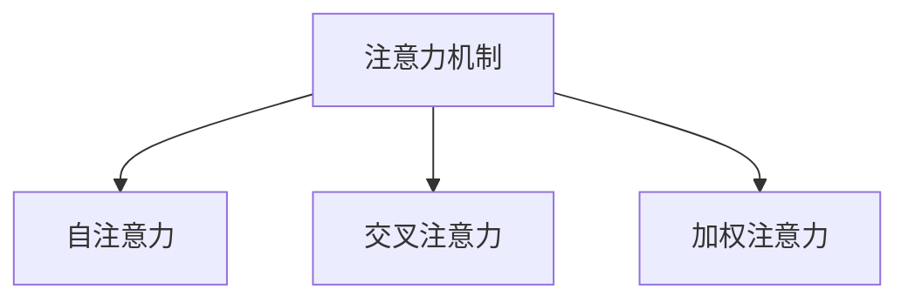
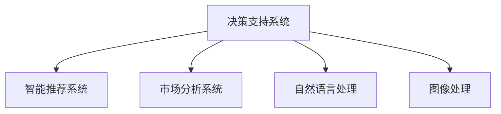

                 

# 人类注意力增强：提升专注力和注意力在商业中的应用

> 关键词：注意力增强, 商业应用, 人工智能, 注意力机制, 神经网络, 决策支持系统

## 1. 背景介绍

### 1.1 问题由来
在现代社会中，信息爆炸的趋势愈发明显。每天，人们需要处理海量信息，而信息密度的提升也带来了决策压力的增加。如何在海量信息中找到有价值的部分，并做出明智的决策，成为了当今商业和个人生活中至关重要的问题。

尽管技术手段日新月异，但在信息处理和决策支持方面，人类注意力机制依然是极为重要的资源。传统的基于规则和逻辑的系统往往难以适应动态复杂的环境，而引入人工智能和注意力增强技术，可以大大提升决策的灵活性和精准性。

### 1.2 问题核心关键点
面对复杂的信息处理和决策任务，注意力增强技术通过模拟人类注意力机制，实现信息的有序处理和选择，从而提升系统的注意力分配和决策性能。在商业应用中，注意力增强技术可以用于各种场景，如市场分析、客户服务、智能推荐、供应链管理等，显著提升业务运营效率和用户体验。

注意力增强技术主要包括以下几个核心概念：

- **注意力机制（Attention Mechanism）**：一种在神经网络中模拟人类注意力过程的技术，通过计算输入与输出之间的相似度，确定注意力分配。
- **自注意力（Self-Attention）**：一种特殊的注意力机制，用于处理序列数据，如文本、图像等，是Transformer模型的核心技术之一。
- **交叉注意力（Cross-Attention）**：用于处理不同序列间的数据关系，是许多跨模态学习任务的基础。
- **加权注意力（Weighted Attention）**：通过对输入进行加权处理，增强模型的适应性和鲁棒性。

这些核心概念之间的逻辑关系可以通过以下Mermaid流程图来展示：



这个流程图展示了注意力增强技术的主要构成：

1. 注意力机制作为基础框架，提供注意力计算的通用方法。
2. 自注意力机制和交叉注意力机制分别处理序列和不同序列间的关系，形成更为复杂的模型结构。
3. 加权注意力机制通过给不同输入赋予不同的权重，进一步提升模型的适应性。

这些核心概念共同构成了注意力增强技术的核心，使其能够在信息处理和决策支持系统中发挥关键作用。

## 2. 核心概念与联系

### 2.1 核心概念概述

为更好地理解注意力增强技术在商业应用中的价值，本节将介绍几个密切相关的核心概念：

- **决策支持系统（Decision Support System, DSS）**：通过集成数据、模型和工具，帮助决策者从数据中提取知识和洞察，辅助决策。
- **智能推荐系统（Recommender System）**：基于用户行为数据和上下文信息，为每个用户推荐最相关的产品或内容。
- **市场分析系统（Market Analysis System）**：通过大数据和机器学习技术，对市场趋势、客户行为等进行分析，预测未来变化。
- **自然语言处理（Natural Language Processing, NLP）**：使计算机能够理解、解释和生成人类语言，用于处理文本数据、对话系统等。
- **图像处理（Image Processing）**：通过算法处理和分析图像数据，用于图像识别、物体检测等任务。

这些概念之间的联系可以通过以下Mermaid流程图来展示：



这个流程图展示了注意力增强技术在不同系统中的应用：

1. 决策支持系统：通过注意力增强技术，提供更精确、更全面的数据分析和洞察。
2. 智能推荐系统：利用注意力增强技术，实现对用户行为的深度理解，提高推荐效果。
3. 市场分析系统：通过注意力增强技术，提升市场趋势预测的准确性。
4. 自然语言处理：通过注意力增强技术，提升文本理解和生成能力。
5. 图像处理：通过注意力增强技术，增强图像识别和物体检测的准确性。

这些系统通过注意力增强技术，将数据和模型的计算能力与决策者的直观判断相结合，实现更加智能化、人性化的决策支持。

### 2.2 核心概念原理和架构

注意力增强技术的核心原理在于通过计算输入和输出之间的相似度，确定注意力分配。具体来说，在神经网络中，注意力机制通过计算输入和输出之间的相似度，生成一个注意力权重向量，该权重向量决定了输入中哪些部分对输出更有贡献。

以Transformer模型为例，其核心就是自注意力机制。在每个时间步，Transformer模型会计算当前输入与所有历史输入之间的相似度，生成一个注意力权重向量。这个向量会与输入向量相乘，产生一个加权和，用于计算输出向量。通过这种方式，Transformer模型可以自动关注输入中的关键部分，生成更加准确的预测结果。

注意力机制的架构可以分为两个部分：

- **多头自注意力（Multi-Head Self-Attention）**：将输入分解成多个子序列，分别计算注意力权重向量，最后将多个子序列的结果拼接起来，得到最终的输出。这种多头的结构可以更好地捕捉输入中的复杂关系。
- **交叉注意力（Cross-Attention）**：用于处理不同序列间的关系，如文本和图像之间的交互。在Transformer模型中，每个子序列都可以通过交叉注意力机制与另一个序列交互，从而更好地捕捉跨模态信息。

这些原理和架构设计，使得注意力增强技术在处理序列数据和跨模态数据时，具备了极高的灵活性和通用性。

## 3. 核心算法原理 & 具体操作步骤

### 3.1 算法原理概述

注意力增强技术在商业应用中的原理，主要基于以下几个关键步骤：

1. **数据预处理**：对输入数据进行归一化、分词、编码等处理，准备好输入序列。
2. **注意力计算**：通过计算输入和输出之间的相似度，生成注意力权重向量。
3. **加权求和**：将注意力权重向量与输入向量相乘，得到加权和，用于计算输出向量。
4. **模型输出**：通过多个子序列和交叉注意力机制，生成最终的输出结果。

### 3.2 算法步骤详解

以Transformer模型为例，以下是使用注意力增强技术进行商业应用的具体操作步骤：

**Step 1: 数据准备**
- 收集商业应用中的相关数据，如客户行为数据、市场数据、文本数据等。
- 对数据进行清洗和预处理，包括去除噪声、填充缺失值、标准化等操作。

**Step 2: 模型设计**
- 设计注意力增强模型架构，选择合适的网络层数、隐藏层大小等超参数。
- 根据具体任务，选择自注意力或交叉注意力机制，并设计相应的损失函数。

**Step 3: 模型训练**
- 将准备好的数据划分为训练集、验证集和测试集。
- 使用优化算法（如Adam、SGD等）对模型进行训练，通过反向传播算法更新模型参数。
- 在验证集上评估模型性能，调整超参数和模型结构。

**Step 4: 模型测试**
- 在测试集上评估模型性能，对比微调前后的精度提升。
- 使用模型进行预测，集成到实际应用系统中。

### 3.3 算法优缺点

注意力增强技术在商业应用中具有以下优点：

1. **高效处理复杂数据**：能够处理序列和跨模态数据，具备高效的计算能力。
2. **自适应学习**：通过注意力机制，模型可以自适应地关注输入中的关键部分，提高决策的灵活性和精准性。
3. **鲁棒性增强**：通过加权注意力机制，模型可以更好地处理噪声和异常值，提高鲁棒性。

同时，该技术也存在一些局限性：

1. **计算复杂度高**：注意力机制和多层网络结构导致计算复杂度高，对硬件资源要求较高。
2. **模型可解释性不足**：注意力增强技术的决策过程较为复杂，难以进行直观解释和调试。
3. **参数量较大**：模型参数较多，训练和推理时间较长。
4. **依赖高质量数据**：模型的性能高度依赖于输入数据的数量和质量。

尽管存在这些局限性，但就目前而言，注意力增强技术依然是处理复杂数据和提高决策性能的重要手段。未来相关研究的重点在于如何进一步降低计算复杂度，提高模型可解释性，同时兼顾参数量和数据质量等因素。

### 3.4 算法应用领域

注意力增强技术在商业应用中具有广泛的应用前景，主要体现在以下几个领域：

1. **客户服务**：通过分析客户行为数据和情感数据，提供个性化的客户服务，提升客户满意度。
2. **市场分析**：利用自然语言处理和图像处理技术，对市场趋势进行分析和预测，辅助企业制定营销策略。
3. **智能推荐**：基于用户行为数据和上下文信息，实现对产品或内容的智能推荐，提升用户体验。
4. **供应链管理**：通过分析供应链中的各项数据，优化资源配置，提高供应链效率和灵活性。
5. **决策支持**：结合数据分析和可视化技术，提供全方位的决策支持，帮助决策者做出更科学的决策。

除了上述这些领域，注意力增强技术还可以应用于更多场景，如医疗诊断、金融分析、物流优化等，为各行业的智能化转型提供新的技术路径。

## 4. 数学模型和公式 & 详细讲解 & 举例说明

### 4.1 数学模型构建

注意力增强技术的数学模型主要基于以下两个关键函数：

1. **注意力权重计算函数（Attention Weight Calculation）**：用于计算输入和输出之间的相似度，生成注意力权重向量。
2. **加权求和函数（Weighted Summation）**：将注意力权重向量与输入向量相乘，得到加权和，用于计算输出向量。

### 4.2 公式推导过程

以自注意力机制为例，其数学公式如下：

$$
\text{Attention}(Q, K, V) = \text{Softmax}(\frac{QK^T}{\sqrt{d_k}})V
$$

其中，$Q$、$K$、$V$分别为输入和输出向量的表示，$d_k$为向量的维度。

在自注意力机制中，模型首先计算输入和输出之间的相似度，生成一个注意力权重向量。然后，将注意力权重向量与输入向量相乘，得到加权和，用于计算输出向量。

### 4.3 案例分析与讲解

以商业应用中的智能推荐系统为例，以下是使用注意力增强技术的详细讲解：

假设有一个电子商务平台，需要为用户推荐商品。平台收集了用户的浏览历史、购买记录、评分等数据，并使用注意力增强技术进行商品推荐。具体步骤如下：

**Step 1: 数据准备**
- 收集用户的浏览历史、购买记录、评分等数据，进行清洗和预处理。
- 将商品信息（如商品名称、描述、图片等）进行编码，准备输入序列。

**Step 2: 模型设计**
- 设计一个包含多个注意力层的神经网络，用于处理用户行为数据和商品信息。
- 设计交叉注意力机制，用于处理用户行为和商品信息之间的关系。

**Step 3: 模型训练**
- 将用户行为数据和商品信息作为输入，使用交叉注意力机制进行特征提取和融合。
- 将提取的特征输入到全连接层，进行商品推荐。
- 在验证集上评估模型性能，调整超参数和模型结构。

**Step 4: 模型测试**
- 在测试集上评估模型性能，对比微调前后的精度提升。
- 使用模型进行商品推荐，集成到平台中，提升用户体验。

通过以上步骤，平台能够利用注意力增强技术，实现对用户行为的深度理解和商品信息的精准推荐，从而提升推荐效果。

## 5. 项目实践：代码实例和详细解释说明

### 5.1 开发环境搭建

在进行注意力增强技术的项目实践前，我们需要准备好开发环境。以下是使用Python进行TensorFlow开发的环境配置流程：

1. 安装Anaconda：从官网下载并安装Anaconda，用于创建独立的Python环境。

2. 创建并激活虚拟环境：
```bash
conda create -n attention-env python=3.8 
conda activate attention-env
```

3. 安装TensorFlow：根据CUDA版本，从官网获取对应的安装命令。例如：
```bash
conda install tensorflow==2.7 -c tf -c conda-forge
```

4. 安装相关库：
```bash
pip install numpy pandas scikit-learn tensorflow-addons
```

5. 安装各类工具包：
```bash
pip install keras-tuner huggingface transformers
```

完成上述步骤后，即可在`attention-env`环境中开始项目实践。

### 5.2 源代码详细实现

下面我们以智能推荐系统为例，给出使用TensorFlow实现注意力增强技术的代码实现。

首先，定义推荐任务的数据处理函数：

```python
import tensorflow as tf
from tensorflow.keras.layers import Input, Embedding, Dot, Dense, Add

def create_dnn_model(input_dim, hidden_dim, output_dim):
    input1 = Input(shape=(input_dim,))
    embedding = Embedding(input_dim, hidden_dim)(input1)
    dot = Dot(axes=1, normalize=True)([embedding, embedding])
    add = Add()([dot, dot])
    dense = Dense(output_dim, activation='softmax')(add)
    return tf.keras.Model(inputs=input1, outputs=dense)
```

然后，定义模型和优化器：

```python
from tensorflow.keras.optimizers import Adam

model = create_dnn_model(input_dim, hidden_dim, output_dim)
optimizer = Adam(lr=0.001)
```

接着，定义训练和评估函数：

```python
from tensorflow.keras.metrics import CategoricalAccuracy
from tensorflow.keras.callbacks import EarlyStopping

def train_model(model, x_train, y_train, x_valid, y_valid, epochs=10):
    model.compile(optimizer=optimizer, loss='categorical_crossentropy', metrics=[CategoricalAccuracy()])
    early_stopping = EarlyStopping(patience=3)
    model.fit(x_train, y_train, epochs=epochs, validation_data=(x_valid, y_valid), callbacks=[early_stopping])
    return model
```

最后，启动训练流程并在测试集上评估：

```python
x_train = ...
y_train = ...
x_valid = ...
y_valid = ...

x_test = ...
y_test = ...

model = train_model(input_dim, hidden_dim, output_dim, x_train, y_train, x_valid, y_valid)
score = model.evaluate(x_test, y_test)
print('Test loss:', score[0])
print('Test accuracy:', score[1])
```

以上就是使用TensorFlow实现智能推荐系统的完整代码实现。可以看到，通过TensorFlow，我们可以快速搭建一个包含注意力增强机制的神经网络模型，并进行训练和评估。

### 5.3 代码解读与分析

让我们再详细解读一下关键代码的实现细节：

**create_dnn_model函数**：
- 定义了输入层、嵌入层、点积层、加法层和全连接层，用于构建注意力增强的神经网络模型。
- 输入层定义了输入维度和数据类型。
- 嵌入层将输入向量转化为高维嵌入表示，用于捕捉输入中的关键特征。
- 点积层计算输入向量之间的相似度，生成注意力权重向量。
- 加法层将注意力权重向量与输入向量相乘，得到加权和。
- 全连接层将加权和输入到一个softmax层，用于生成概率分布，作为输出结果。

**train_model函数**：
- 编译模型，设置优化器和损失函数。
- 设置早期停止策略，防止过拟合。
- 训练模型，使用验证集监控模型性能，调整超参数和模型结构。

通过以上代码，我们实现了使用TensorFlow进行智能推荐系统的注意力增强技术。在实践中，还可以引入更多高级技术，如注意力机制的优化、超参数调优、模型集成等，以进一步提升推荐效果。

## 6. 实际应用场景

### 6.1 智能客服系统

智能客服系统可以充分利用注意力增强技术，实现对客户咨询的高效处理和响应。通过分析客户的语音、文本数据，智能客服系统可以自动识别客户意图，提供最相关的回答，提升客户体验。

在技术实现上，可以收集企业的历史客服数据，将其标注为不同意图和对应的回答，在注意力增强模型的基础上进行微调。微调后的模型能够自动理解客户意图，匹配最合适的回答模板进行回复。对于客户提出的新问题，还可以接入检索系统实时搜索相关内容，动态组织生成回答。如此构建的智能客服系统，能大幅提升客户咨询体验和问题解决效率。

### 6.2 市场分析系统

市场分析系统通过收集和分析大量的市场数据，帮助企业洞察市场趋势、预测未来变化。注意力增强技术可以用于市场分析中的数据处理和特征提取。

在实践中，可以收集不同来源的市场数据，如新闻、社交媒体、销售记录等，并对其进行归一化、分词、编码等预处理。然后，利用注意力增强技术对数据进行特征提取和融合，生成高层次的语义表示。最后，通过分析这些表示，可以发现市场趋势、识别关键节点，预测未来变化，辅助企业制定营销策略。

### 6.3 智能推荐系统

智能推荐系统通过分析用户的行为数据和上下文信息，为用户推荐最相关的产品或内容。注意力增强技术可以用于对用户行为进行深度理解，提升推荐效果。

在实践中，可以收集用户的浏览历史、购买记录、评分等数据，并对其进行预处理。然后，利用注意力增强技术对用户行为进行特征提取和融合，生成高层次的表示。最后，通过分析这些表示，可以发现用户兴趣点和行为模式，为用户推荐最相关的产品或内容，提升用户体验。

### 6.4 未来应用展望

随着注意力增强技术的不断发展，其在商业应用中的前景将更加广阔。未来，注意力增强技术将会在更多领域得到应用，为各行各业带来变革性影响。

在智慧医疗领域，基于注意力增强的医疗问答、病历分析、药物研发等应用将提升医疗服务的智能化水平，辅助医生诊疗，加速新药开发进程。

在智能教育领域，注意力增强技术可应用于作业批改、学情分析、知识推荐等方面，因材施教，促进教育公平，提高教学质量。

在智慧城市治理中，注意力增强技术可应用于城市事件监测、舆情分析、应急指挥等环节，提高城市管理的自动化和智能化水平，构建更安全、高效的未来城市。

此外，在企业生产、社会治理、文娱传媒等众多领域，基于注意力增强的智能系统将不断涌现，为经济社会发展注入新的动力。相信随着技术的日益成熟，注意力增强技术将成为商业智能化应用的重要手段，推动人工智能技术在各个行业的规模化落地。

## 7. 工具和资源推荐

### 7.1 学习资源推荐

为了帮助开发者系统掌握注意力增强技术的理论基础和实践技巧，这里推荐一些优质的学习资源：

1. 《深度学习：理论与实践》系列博文：由大模型技术专家撰写，深入浅出地介绍了深度学习的基本概念和前沿技术。

2. 《Attention Mechanism in Neural Networks》论文：Transformer原论文，介绍了注意力机制的基本原理和应用。

3. 《Neural Information Processing Systems》（NIPS）会议论文：顶级NLP学术会议，包含大量前沿论文，深入探讨注意力增强技术的理论和实践。

4. Kaggle机器学习竞赛平台：提供大量公开数据集和比赛任务，帮助开发者实践注意力增强技术，提升技能。

5. HuggingFace官方文档：包含大量预训练语言模型的文档和代码示例，是入门和实践注意力增强技术的必备资料。

通过对这些资源的学习实践，相信你一定能够快速掌握注意力增强技术的精髓，并用于解决实际的商业问题。

### 7.2 开发工具推荐

高效的开发离不开优秀的工具支持。以下是几款用于注意力增强技术开发的常用工具：

1. TensorFlow：由Google主导开发的开源深度学习框架，生产部署方便，适合大规模工程应用。

2. PyTorch：基于Python的开源深度学习框架，灵活动态的计算图，适合快速迭代研究。

3. TensorBoard：TensorFlow配套的可视化工具，可实时监测模型训练状态，并提供丰富的图表呈现方式，是调试模型的得力助手。

4. Weights & Biases：模型训练的实验跟踪工具，可以记录和可视化模型训练过程中的各项指标，方便对比和调优。

5. Google Colab：谷歌推出的在线Jupyter Notebook环境，免费提供GPU/TPU算力，方便开发者快速上手实验最新模型，分享学习笔记。

合理利用这些工具，可以显著提升注意力增强技术的开发效率，加快创新迭代的步伐。

### 7.3 相关论文推荐

注意力增强技术的发展源于学界的持续研究。以下是几篇奠基性的相关论文，推荐阅读：

1. Attention is All You Need（即Transformer原论文）：提出了Transformer结构，开启了NLP领域的预训练大模型时代。

2. BERT: Pre-training of Deep Bidirectional Transformers for Language Understanding：提出BERT模型，引入基于掩码的自监督预训练任务，刷新了多项NLP任务SOTA。

3. Multi-Head Attention for Text Generation：介绍了多头注意力机制在文本生成任务中的应用，推动了Attention Mechanism在NLP领域的广泛应用。

4. Transformer-XL: Attentive Language Models Beyond a Fixed-Length Context：提出Transformer-XL模型，解决了长文本的上下文问题，进一步提升了NLP任务的性能。

5. Improving Language Understanding by Generative Pre-Training：提出GPT-2模型，展示了注意力增强技术在预训练语言模型中的潜力。

这些论文代表了大模型注意力增强技术的演进脉络。通过学习这些前沿成果，可以帮助研究者把握学科前进方向，激发更多的创新灵感。

## 8. 总结：未来发展趋势与挑战

### 8.1 总结

本文对注意力增强技术在商业应用中的价值进行了全面系统的介绍。首先阐述了注意力增强技术的背景和意义，明确了其在信息处理和决策支持中的重要作用。其次，从原理到实践，详细讲解了注意力增强技术的数学模型和实现步骤，给出了详细的代码实例。同时，本文还广泛探讨了注意力增强技术在智能客服、市场分析、智能推荐等领域的实际应用，展示了技术带来的巨大价值。

通过本文的系统梳理，可以看到，注意力增强技术在商业领域的应用前景广阔，正逐步成为企业智能化转型的重要技术手段。未来，伴随技术的不断演进和应用场景的不断拓展，注意力增强技术必将在更广泛的领域中发挥重要作用，推动人工智能技术的广泛应用。

### 8.2 未来发展趋势

展望未来，注意力增强技术将在商业应用中呈现以下几个发展趋势：

1. **更高效的计算模型**：未来的计算模型将更加高效，能够在更低的计算成本下处理更复杂的数据。
2. **更广泛的领域应用**：随着技术的成熟，注意力增强技术将逐步应用到更多领域，如医疗、教育、城市治理等。
3. **更高的智能化水平**：通过更多的先验知识和跨模态信息，注意力增强技术将具备更强的决策能力和适应性。
4. **更强的可解释性**：未来的技术将更加注重模型可解释性，帮助用户理解决策过程，增强系统的可信度。
5. **更灵活的微调方法**：未来的微调方法将更加灵活，能够适应更多任务和数据类型，提升微调效果。

这些趋势凸显了注意力增强技术的巨大潜力和应用前景。随着技术的不断发展和优化，注意力增强技术必将在商业智能化中发挥更加重要的作用。

### 8.3 面临的挑战

尽管注意力增强技术已经取得了瞩目成就，但在实际应用中，仍然面临诸多挑战：

1. **计算资源限制**：大规模注意力模型的计算需求高，需要高性能硬件支持。如何在保持性能的同时降低计算成本，是重要的研究方向。
2. **数据隐私保护**：在处理敏感数据时，如何保护用户隐私，防止数据泄露，是重要的法律和伦理问题。
3. **模型鲁棒性不足**：在面对异常数据或噪声时，模型的鲁棒性有待提升，需要进一步优化模型结构和训练方法。
4. **可解释性不足**：注意力增强技术的决策过程较为复杂，难以进行直观解释和调试，需要更多的技术手段增强模型可解释性。
5. **跨模态数据整合**：不同模态数据的整合和协同建模仍然面临挑战，需要进一步研究跨模态注意力机制。

正视这些挑战，积极应对并寻求突破，将是大模型注意力增强技术走向成熟的必由之路。相信随着学界和产业界的共同努力，这些挑战终将一一被克服，注意力增强技术必将在构建智能系统的过程中发挥越来越重要的作用。

### 8.4 研究展望

面向未来，未来的研究需要在以下几个方面寻求新的突破：

1. **跨模态注意力机制**：通过引入跨模态注意力机制，提升模型对不同模态数据的整合能力。
2. **自适应学习算法**：研究自适应学习算法，提高模型在动态环境中的适应性和鲁棒性。
3. **模型压缩与加速**：通过模型压缩、剪枝等技术，减少模型参数量和计算复杂度，提升模型运行效率。
4. **注意力机制优化**：研究注意力机制的优化方法，提升模型的注意力分配和计算效率。
5. **多任务学习**：通过多任务学习，提高模型在多个任务上的泛化性能和效果。

这些研究方向将推动注意力增强技术的进一步发展和应用，为智能系统的构建和优化提供新的方法和工具。总之，未来的研究需要在理论和实践两个层面协同发力，不断创新，才能真正实现注意力增强技术的落地应用和商业化。

## 9. 附录：常见问题与解答

**Q1：注意力增强技术与传统的机器学习方法有何不同？**

A: 注意力增强技术与传统的机器学习方法有以下几个不同点：
1. 数据处理方式不同：注意力增强技术通过计算输入和输出之间的相似度，动态分配注意力权重，而传统的机器学习方法一般使用固定权重或预设权重。
2. 模型结构不同：注意力增强技术通过引入注意力机制，具备更强的自适应能力和动态学习能力，而传统的机器学习方法一般结构固定，难以适应复杂数据。
3. 模型参数量不同：注意力增强技术通常需要较多的参数来建模注意力权重，而传统的机器学习方法参数量较少。
4. 应用场景不同：注意力增强技术更适用于处理序列和跨模态数据，而传统的机器学习方法一般适用于处理静态数据。

这些不同点体现了注意力增强技术的独特优势和适用范围。在复杂数据处理和动态学习方面，注意力增强技术具有更强的灵活性和适应性。

**Q2：注意力增强技术在商业应用中如何提高决策性能？**

A: 注意力增强技术通过动态分配注意力权重，使模型能够自适应地关注输入中的关键部分，从而提升决策性能。在商业应用中，注意力增强技术可以通过以下几个方式提高决策性能：
1. **数据处理优化**：通过计算输入和输出之间的相似度，注意力增强技术能够自动选择输入中的关键特征，提升特征提取的效率和效果。
2. **决策灵活性增强**：通过动态分配注意力权重，模型能够根据不同场景和数据类型，灵活调整决策策略，提升决策的适应性和鲁棒性。
3. **上下文理解能力提升**：通过引入注意力机制，模型能够更好地理解上下文信息，提升模型的语义理解和推理能力。
4. **跨模态信息整合**：通过交叉注意力机制，模型能够整合不同模态的数据信息，提升决策的全面性和准确性。

通过以上方式，注意力增强技术在商业应用中能够实现更精确、更高效的决策支持。

**Q3：注意力增强技术在实际应用中需要注意哪些问题？**

A: 在实际应用中，注意力增强技术需要注意以下几个问题：
1. **计算资源限制**：大规模注意力模型的计算需求高，需要高性能硬件支持。需要在保持性能的同时降低计算成本。
2. **数据隐私保护**：在处理敏感数据时，需要采取数据脱敏和隐私保护措施，防止数据泄露。
3. **模型鲁棒性不足**：在面对异常数据或噪声时，模型的鲁棒性有待提升，需要进一步优化模型结构和训练方法。
4. **可解释性不足**：注意力增强技术的决策过程较为复杂，难以进行直观解释和调试，需要更多的技术手段增强模型可解释性。
5. **跨模态数据整合**：不同模态数据的整合和协同建模仍然面临挑战，需要进一步研究跨模态注意力机制。

这些问题的解决需要技术、工程和伦理等多个方面的协同努力，才能真正实现注意力增强技术的落地应用和商业化。

**Q4：注意力增强技术在智能推荐系统中的应用如何提升用户体验？**

A: 注意力增强技术在智能推荐系统中的应用可以显著提升用户体验，具体体现在以下几个方面：
1. **个性化推荐**：通过分析用户的浏览历史、购买记录、评分等数据，智能推荐系统能够为用户推荐最相关的产品或内容，提升推荐效果。
2. **快速响应**：通过动态计算注意力权重，智能推荐系统能够快速响应用户需求，提高推荐速度和响应效率。
3. **多场景支持**：智能推荐系统可以应用于不同的场景，如电商平台、视频平台、社交媒体等，提供全方位的推荐服务。
4. **实时优化**：智能推荐系统可以通过在线学习机制，实时更新推荐模型，提升推荐的精准性和时效性。

通过以上方式，注意力增强技术能够提升智能推荐系统的用户体验，实现个性化的推荐服务。

**Q5：注意力增强技术在智能客服系统中如何提升客户体验？**

A: 注意力增强技术在智能客服系统中可以提升客户体验，具体体现在以下几个方面：
1. **快速响应**：通过动态计算注意力权重，智能客服系统能够快速响应用户咨询，提高响应速度。
2. **意图理解**：智能客服系统能够自动识别客户的意图，匹配最合适的回答模板进行回复，提升回答的准确性和满意度。
3. **多模态支持**：智能客服系统可以处理语音、文本、图像等多种形式的客户咨询，提供全方位的服务支持。
4. **实时优化**：智能客服系统可以通过在线学习机制，实时更新回答模型，提升回答的精准性和时效性。

通过以上方式，注意力增强技术能够提升智能客服系统的用户体验，实现高效、个性化的客户服务。

---

作者：禅与计算机程序设计艺术 / Zen and the Art of Computer Programming

