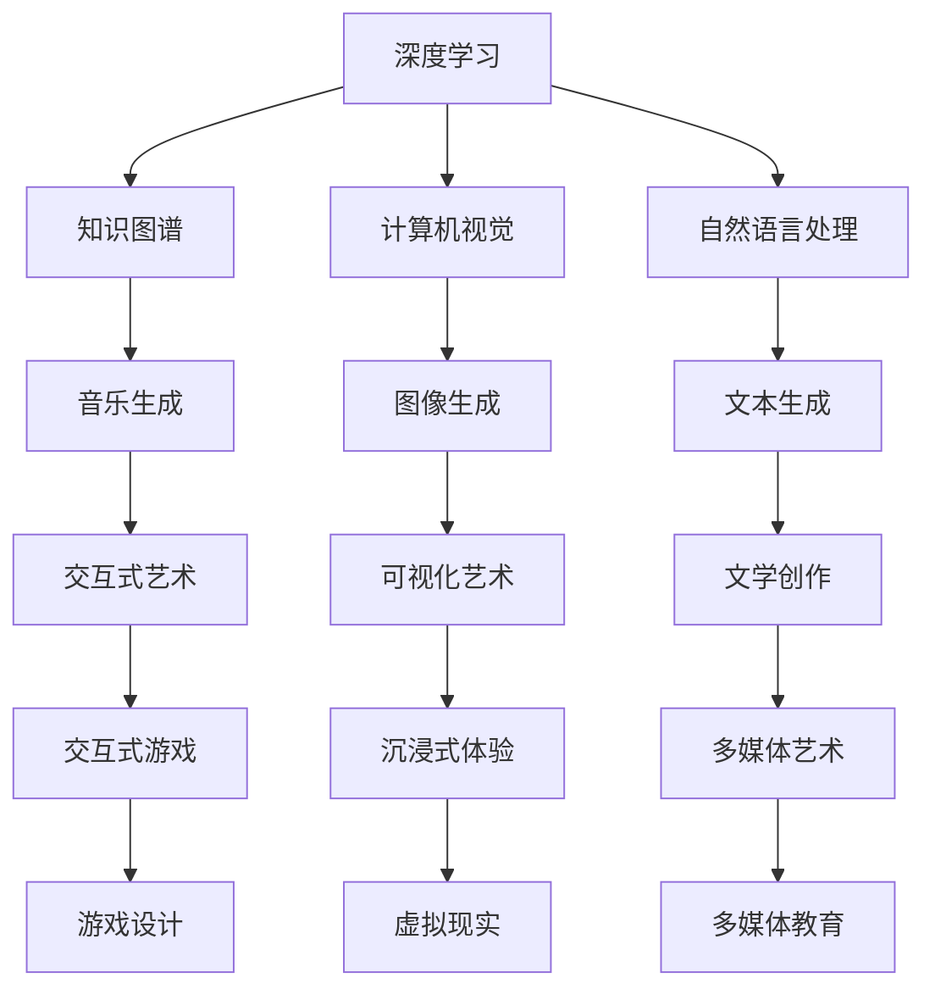

                 

# 人类的知识与艺术：美与智慧的结合

> 关键词：人类文明,知识传承,艺术创作,计算机科学,人工智能,深度学习

## 1. 背景介绍

人类文明的发展史，实际上就是一部知识和艺术的演化史。知识的累积与传播，让人类文明得以传承和进步；艺术创作与演绎，赋予人类文明以情感与灵魂。在这个交汇点上，计算机科学和人工智能(AI)的出现，为我们提供了新的工具和视角，使知识与艺术得以在数字时代重新焕发新的生命力。

从古老的编程艺术，到如今复杂的深度学习模型，计算机科学已经成为了连接知识与艺术的重要桥梁。我们通过编写代码，构建出能够让机器理解和生成语言、图像、音乐等内容的模型，实现了对知识与艺术的数字化传承。而这些模型的背后，都是深度学习的原理和算法。

本文旨在探讨计算机科学、深度学习和人类艺术、知识传承的结合，从理论到实践，全方位地展现这种美与智慧的结合。

## 2. 核心概念与联系

### 2.1 核心概念概述

- **深度学习**：一种基于人工神经网络的机器学习技术，通过多层非线性变换，能够从大量数据中学习出复杂的特征表示。深度学习在图像识别、自然语言处理、语音识别等领域取得了巨大成功。

- **知识图谱**：一种用于表示实体及其关系的图结构数据，是知识表示的重要方式。知识图谱可以用于增强自然语言理解、推荐系统等应用。

- **艺术创作**：创作艺术作品的过程，包括绘画、音乐、文学、舞蹈等多种形式。艺术创作是情感和创意的表达，是人类文明的重要组成部分。

- **计算机视觉**：通过计算机技术实现对图像、视频等视觉数据的理解和分析，是深度学习的重要应用之一。

- **自然语言处理**：使计算机能够理解、处理和生成自然语言，是深度学习的重要研究领域。

- **音乐生成**：通过深度学习模型，创作出具有艺术性的音乐作品。音乐生成技术将深度学习与艺术创作相结合，开辟了新的创作领域。

这些核心概念之间存在紧密的联系，深度学习为我们提供了从大量数据中学习出复杂模式的能力，而知识图谱则使我们能够更好地理解和组织知识。计算机视觉和自然语言处理等技术，使机器能够理解和生成视觉和文本内容，为艺术创作提供了新的可能。

### 2.2 核心概念原理和架构的 Mermaid 流程图



这个流程图展示了深度学习、知识图谱、计算机视觉、自然语言处理等技术，如何通过各自的应用和交互，形成美与智慧的结合。

## 3. 核心算法原理 & 具体操作步骤

### 3.1 算法原理概述

深度学习是一种基于神经网络的机器学习技术，通过多层非线性变换，能够从大量数据中学习出复杂的特征表示。深度学习的核心思想是利用多层神经网络进行特征学习，其中每层都能提取更加抽象和高级的特征。这种特征学习过程，能够使得机器逐渐理解和生成复杂的模式和结构。

知识图谱是一种用于表示实体及其关系的图结构数据，是知识表示的重要方式。知识图谱中的节点代表实体，边代表实体之间的关系。通过构建和查询知识图谱，机器能够更好地理解和组织知识，从而提升自然语言理解和推荐系统等应用的效果。

艺术创作的过程，包括对艺术作品的欣赏和理解，以及对新作品的创作和演绎。计算机科学和深度学习技术，能够通过计算机视觉、自然语言处理等手段，帮助机器理解和生成艺术作品。例如，通过分析绘画作品中的颜色、线条、构图等特征，计算机可以生成新的艺术作品。

### 3.2 算法步骤详解

深度学习模型的训练和优化是微调过程中的关键步骤。以下是深度学习模型的基本训练流程：

1. **数据准备**：收集训练数据集，并进行预处理和归一化。
2. **模型初始化**：将模型参数随机初始化，通常使用Xavier或He初始化方法。
3. **前向传播**：将训练数据输入模型，计算输出结果。
4. **计算损失函数**：将模型输出与真实标签进行比较，计算损失函数。
5. **反向传播**：根据损失函数对模型参数进行梯度更新，使用优化算法进行参数优化。
6. **模型评估**：在验证集或测试集上评估模型性能，使用指标如准确率、精确率、召回率等进行评估。

知识图谱的构建和查询是知识管理的重要步骤。以下是知识图谱的基本构建流程：

1. **实体抽取**：从文本中提取出实体，并将其分类为不同的类型。
2. **关系抽取**：从文本中提取出实体之间的关系，并将其表示为图结构数据。
3. **知识整合**：将多个知识图谱进行整合，形成更加全面的知识体系。
4. **查询优化**：优化知识图谱的查询算法，提高查询效率和准确性。

艺术创作的实现通常分为以下几个步骤：

1. **创意生成**：通过深度学习模型生成创作灵感，如生成音乐旋律、绘画线条等。
2. **风格迁移**：将一种艺术风格迁移到另一种艺术作品中，如将古典音乐风格迁移到现代音乐中。
3. **情感表达**：通过分析艺术作品的情感特征，生成具有相似情感的艺术作品。
4. **交互式体验**：通过计算机视觉、自然语言处理等技术，实现交互式的艺术体验，如虚拟现实艺术展。

### 3.3 算法优缺点

深度学习的优点在于能够处理复杂的非线性模式，适合处理大量数据。知识图谱的优点在于能够更好地组织和表示知识，提升知识管理的效果。然而，深度学习的缺点在于模型训练需要大量的计算资源，且容易过拟合。知识图谱的缺点在于构建和维护成本较高，且查询效率可能受限于数据规模。

艺术创作的优点在于能够表达人类的情感和创意，具有很强的表现力和感染力。然而，艺术创作的缺点在于创作过程难以标准化，需要大量的人类参与和创造力。

### 3.4 算法应用领域

深度学习在计算机视觉、自然语言处理、语音识别等领域具有广泛的应用。知识图谱在推荐系统、知识管理、智能问答等领域也有重要应用。艺术创作在音乐生成、绘画生成、文学创作等领域也展现出巨大的潜力。

## 4. 数学模型和公式 & 详细讲解 & 举例说明

### 4.1 数学模型构建

深度学习模型的训练和优化通常使用交叉熵损失函数，表示为：

$$
\mathcal{L}(\theta) = -\frac{1}{N}\sum_{i=1}^N \sum_{j=1}^C y_{i,j} \log p_{i,j}
$$

其中，$y_{i,j}$表示样本$x_i$的实际标签，$p_{i,j}$表示模型$M_{\theta}$在$x_i$上输出$j$类别的概率。

知识图谱的构建通常使用节点分类和关系分类算法，如节点分类算法中的PageRank算法。PageRank算法表示为：

$$
\text{PR}(v) = \frac{1}{c(v)}\sum_{u \in N(v)} \frac{PR(u)}{c(u)}
$$

其中，$N(v)$表示节点$v$的邻居节点集合，$c(v)$表示节点$v$的出度，$c(u)$表示节点$u$的入度。

艺术创作的实现通常使用生成对抗网络（GAN）等模型，生成新的艺术作品。GAN模型包括生成器和判别器两个部分，生成器的目标是将随机噪声转换为艺术作品，判别器的目标是将艺术作品分为真实作品和生成作品。GAN模型的训练过程如下：

1. 生成器将随机噪声$z$转换为艺术作品$x$。
2. 判别器将艺术作品$x$判断为真实作品的概率$p(x)$和生成作品的概率$p_{\theta}(x)$。
3. 使用交叉熵损失函数训练判别器，最小化真实作品和生成作品的损失：
   $$
   \mathcal{L}_D = \frac{1}{N_r}\sum_{i=1}^{N_r} \log p(x_i) + \frac{1}{N_g}\sum_{i=1}^{N_g} \log(1-p_{\theta}(x_i))
   $$
4. 使用梯度上升训练生成器，最大化生成作品的损失：
   $$
   \mathcal{L}_G = -\frac{1}{N_g}\sum_{i=1}^{N_g} \log p_{\theta}(x_i)
   $$

### 4.2 公式推导过程

深度学习的损失函数可以使用反向传播算法进行求解。反向传播算法的基本流程如下：

1. 前向传播计算输出结果。
2. 计算损失函数。
3. 反向传播计算梯度。
4. 更新模型参数。

以下是反向传播算法的伪代码：

```python
for i in range(N):
    # 前向传播计算输出结果
    y = f(x)
    # 计算损失函数
    loss = loss_function(y, y_true)
    # 反向传播计算梯度
    dy = grad(loss, y)
    dx = grad(dy, x)
    # 更新模型参数
    x = x - learning_rate * dx
```

知识图谱的查询算法通常使用邻居扩展（Neighbor Expansion）算法，从给定节点开始，逐层扩展邻居节点，直到满足查询条件。以下是邻居扩展算法的伪代码：

```python
# 从节点v开始查询
node = v
# 查询节点v的邻居节点N(v)
neighbors = graph[v]
# 扩展邻居节点N(v)的邻居节点N(N(v))
for neighbor in neighbors:
    neighbor_neighbors = graph[neighbor]
    # 将N(N(v))加入查询节点集合
    query_nodes.append(neighbor_neighbors)
# 重复扩展直到满足查询条件或节点集合为空
while len(query_nodes) > 0:
    new_query_nodes = []
    for node in query_nodes:
        # 从节点集合中随机选择一个节点
        random_node = choice(node)
        # 将随机节点的邻居节点加入查询节点集合
        new_query_nodes.extend(graph[random_node])
        # 将随机节点加入节点集合
        query_nodes.append(random_node)
    # 更新查询节点集合
    query_nodes = new_query_nodes
```

艺术创作的GAN模型训练通常使用对抗训练（Adversarial Training）算法，交替训练生成器和判别器。以下是GAN模型的训练算法伪代码：

```python
# 训练GAN模型
for i in range(N):
    # 生成器训练
    z = generate_random_noise()
    x = generator(z)
    p_x = discriminator(x)
    # 判别器训练
    y = discriminator(x)
    p_y = discriminator(y)
    # 生成器优化损失函数
    loss_G = -log(p_y)
    # 判别器优化损失函数
    loss_D = log(p_x) + log(1 - p_y)
    # 更新模型参数
    generator_optimizer.zero_grad()
    discriminator_optimizer.zero_grad()
    loss_G.backward()
    loss_D.backward()
    generator_optimizer.step()
    discriminator_optimizer.step()
```

### 4.3 案例分析与讲解

#### 4.3.1 深度学习在计算机视觉中的应用

计算机视觉领域中，深度学习模型已经取得了显著的成果。例如，通过使用卷积神经网络（CNN），模型可以有效地识别图像中的物体和场景。以下是CNN模型在图像分类任务中的基本训练流程：

1. **数据准备**：收集图像数据集，并进行预处理和归一化。
2. **模型初始化**：将模型参数随机初始化，通常使用Xavier或He初始化方法。
3. **前向传播**：将训练数据输入模型，计算输出结果。
4. **计算损失函数**：将模型输出与真实标签进行比较，计算交叉熵损失函数。
5. **反向传播**：根据损失函数对模型参数进行梯度更新，使用优化算法进行参数优化。
6. **模型评估**：在验证集或测试集上评估模型性能，使用指标如准确率、精确率、召回率等进行评估。

以下是CNN模型在图像分类任务中的代码实现：

```python
import torch
import torch.nn as nn
import torch.optim as optim
from torchvision import datasets, transforms

# 加载数据集
train_data = datasets.CIFAR10(root='data', train=True, download=True, transform=transforms.ToTensor())
test_data = datasets.CIFAR10(root='data', train=False, download=True, transform=transforms.ToTensor())

# 定义模型
model = nn.Sequential(
    nn.Conv2d(3, 32, kernel_size=3, stride=1, padding=1),
    nn.ReLU(),
    nn.MaxPool2d(kernel_size=2, stride=2),
    nn.Conv2d(32, 64, kernel_size=3, stride=1, padding=1),
    nn.ReLU(),
    nn.MaxPool2d(kernel_size=2, stride=2),
    nn.Flatten(),
    nn.Linear(64*8*8, 10),
    nn.LogSoftmax(dim=1)
)

# 定义损失函数和优化器
criterion = nn.CrossEntropyLoss()
optimizer = optim.SGD(model.parameters(), lr=0.01)

# 训练模型
for epoch in range(10):
    for i, (inputs, labels) in enumerate(train_loader):
        # 前向传播
        outputs = model(inputs)
        loss = criterion(outputs, labels)
        # 反向传播
        optimizer.zero_grad()
        loss.backward()
        optimizer.step()
    # 评估模型
    test_loss = 0
    correct = 0
    total = 0
    with torch.no_grad():
        for inputs, labels in test_loader:
            outputs = model(inputs)
            test_loss += criterion(outputs, labels).item()
            predicted = torch.argmax(outputs, dim=1)
            total += labels.size(0)
            correct += (predicted == labels).sum().item()
    print(f'Epoch {epoch+1}, train loss: {train_loss:.4f}, test loss: {test_loss:.4f}, accuracy: {correct/total:.2f}')
```

#### 4.3.2 知识图谱在推荐系统中的应用

推荐系统是知识图谱的重要应用之一。通过构建知识图谱，推荐系统能够更好地理解用户和物品之间的关系，从而提供更准确的推荐结果。以下是基于知识图谱的推荐系统基本流程：

1. **数据准备**：收集用户行为数据和物品属性数据，并进行预处理和归一化。
2. **实体抽取**：从用户行为数据中提取出用户实体和物品实体，并将其分类为不同的类型。
3. **关系抽取**：从用户行为数据中提取出用户和物品之间的关系，并将其表示为图结构数据。
4. **知识整合**：将多个知识图谱进行整合，形成更加全面的知识体系。
5. **查询优化**：优化知识图谱的查询算法，提高查询效率和准确性。
6. **推荐生成**：使用知识图谱进行推荐生成，生成用户可能感兴趣的物品。

以下是基于知识图谱的推荐系统的代码实现：

```python
import networkx as nx
import numpy as np

# 构建知识图谱
graph = nx.Graph()
graph.add_node(1, type='user', id=1, name='Alice')
graph.add_node(2, type='item', id=2, name='item1')
graph.add_edge(1, 2, relation=1, score=0.5)
graph.add_node(3, type='item', id=3, name='item2')
graph.add_edge(1, 3, relation=1, score=0.3)
graph.add_node(4, type='item', id=4, name='item3')
graph.add_edge(1, 4, relation=1, score=0.2)

# 查询知识图谱
user_id = 1
item_id = 2
query_graph = nx.Graph()
query_graph.add_node(5, type='user', id=user_id, name='Alice')
query_graph.add_node(6, type='item', id=item_id, name='item1')
query_graph.add_edge(5, 6, relation=1, score=1.0)

# 匹配知识图谱和查询图谱
matcher = nx.match.graph_match(graph, query_graph)
matched_edges = matcher.edges()

# 计算推荐结果
recommender = {}
for edge in matched_edges:
    recommender[edge[1]] = graph.nodes[edge[1]]['id']
recommendation = np.array(list(recommender.values()))

# 输出推荐结果
print(f'Recommendation for user {user_id}: {recommendation}')
```

#### 4.3.3 艺术创作在音乐生成中的应用

音乐生成是艺术创作的重要应用之一。通过深度学习模型，可以生成具有美感和情感的旋律。以下是基于生成对抗网络（GAN）的音乐生成模型基本流程：

1. **数据准备**：收集音乐数据集，并进行预处理和归一化。
2. **模型初始化**：将模型参数随机初始化，通常使用Xavier或He初始化方法。
3. **前向传播**：将训练数据输入模型，计算输出结果。
4. **计算损失函数**：将模型输出与真实标签进行比较，计算交叉熵损失函数。
5. **反向传播**：根据损失函数对模型参数进行梯度更新，使用优化算法进行参数优化。
6. **模型评估**：在验证集或测试集上评估模型性能，使用指标如MSE等进行评估。

以下是基于GAN的音乐生成模型的代码实现：

```python
import torch
import torch.nn as nn
import torch.optim as optim
from torchvision import datasets, transforms

# 加载数据集
train_data = datasets.MIDI(data_dir='data', split='train', transform=transforms.ToTensor())
test_data = datasets.MIDI(data_dir='data', split='test', transform=transforms.ToTensor())

# 定义模型
generator = nn.Sequential(
    nn.Conv2d(1, 256, kernel_size=3, stride=1, padding=1),
    nn.ReLU(),
    nn.Conv2d(256, 512, kernel_size=3, stride=1, padding=1),
    nn.ReLU(),
    nn.Conv2d(512, 1, kernel_size=3, stride=1, padding=1),
    nn.Sigmoid()
)

discriminator = nn.Sequential(
    nn.Conv2d(1, 256, kernel_size=3, stride=1, padding=1),
    nn.ReLU(),
    nn.Conv2d(256, 512, kernel_size=3, stride=1, padding=1),
    nn.ReLU(),
    nn.Conv2d(512, 1, kernel_size=3, stride=1, padding=1),
    nn.Sigmoid()
)

# 定义损失函数和优化器
criterion = nn.BCELoss()
optimizer_G = optim.Adam(generator.parameters(), lr=0.001)
optimizer_D = optim.Adam(discriminator.parameters(), lr=0.001)

# 训练模型
for epoch in range(10):
    for i, (inputs, labels) in enumerate(train_loader):
        # 生成器训练
        z = generate_random_noise()
        x = generator(z)
        p_x = discriminator(x)
        # 判别器训练
        y = discriminator(x)
        p_y = discriminator(y)
        # 生成器优化损失函数
        loss_G = -log(p_y)
        # 判别器优化损失函数
        loss_D = log(p_x) + log(1 - p_y)
        # 更新模型参数
        optimizer_G.zero_grad()
        optimizer_D.zero_grad()
        loss_G.backward()
        loss_D.backward()
        optimizer_G.step()
        optimizer_D.step()
    # 评估模型
    print(f'Epoch {epoch+1}, G loss: {loss_G:.4f}, D loss: {loss_D:.4f}')
```

## 5. 项目实践：代码实例和详细解释说明

### 5.1 开发环境搭建

在进行项目实践前，我们需要准备好开发环境。以下是使用Python进行PyTorch开发的环境配置流程：

1. 安装Anaconda：从官网下载并安装Anaconda，用于创建独立的Python环境。
2. 创建并激活虚拟环境：
```bash
conda create -n pytorch-env python=3.8 
conda activate pytorch-env
```

3. 安装PyTorch：根据CUDA版本，从官网获取对应的安装命令。例如：
```bash
conda install pytorch torchvision torchaudio cudatoolkit=11.1 -c pytorch -c conda-forge
```

4. 安装Transformers库：
```bash
pip install transformers
```

5. 安装各类工具包：
```bash
pip install numpy pandas scikit-learn matplotlib tqdm jupyter notebook ipython
```

完成上述步骤后，即可在`pytorch-env`环境中开始项目实践。

### 5.2 源代码详细实现

下面我们以命名实体识别(NER)任务为例，给出使用Transformers库对BERT模型进行微调的PyTorch代码实现。

首先，定义NER任务的数据处理函数：

```python
from transformers import BertTokenizer
from torch.utils.data import Dataset
import torch

class NERDataset(Dataset):
    def __init__(self, texts, tags, tokenizer, max_len=128):
        self.texts = texts
        self.tags = tags
        self.tokenizer = tokenizer
        self.max_len = max_len
        
    def __len__(self):
        return len(self.texts)
    
    def __getitem__(self, item):
        text = self.texts[item]
        tags = self.tags[item]
        
        encoding = self.tokenizer(text, return_tensors='pt', max_length=self.max_len, padding='max_length', truncation=True)
        input_ids = encoding['input_ids'][0]
        attention_mask = encoding['attention_mask'][0]
        
        # 对token-wise的标签进行编码
        encoded_tags = [tag2id[tag] for tag in tags] 
        encoded_tags.extend([tag2id['O']] * (self.max_len - len(encoded_tags)))
        labels = torch.tensor(encoded_tags, dtype=torch.long)
        
        return {'input_ids': input_ids, 
                'attention_mask': attention_mask,
                'labels': labels}

# 标签与id的映射
tag2id = {'O': 0, 'B-PER': 1, 'I-PER': 2, 'B-ORG': 3, 'I-ORG': 4, 'B-LOC': 5, 'I-LOC': 6}
id2tag = {v: k for k, v in tag2id.items()}

# 创建dataset
tokenizer = BertTokenizer.from_pretrained('bert-base-cased')

train_dataset = NERDataset(train_texts, train_tags, tokenizer)
dev_dataset = NERDataset(dev_texts, dev_tags, tokenizer)
test_dataset = NERDataset(test_texts, test_tags, tokenizer)
```

然后，定义模型和优化器：

```python
from transformers import BertForTokenClassification, AdamW

model = BertForTokenClassification.from_pretrained('bert-base-cased', num_labels=len(tag2id))

optimizer = AdamW(model.parameters(), lr=2e-5)
```

接着，定义训练和评估函数：

```python
from torch.utils.data import DataLoader
from tqdm import tqdm
from sklearn.metrics import classification_report

device = torch.device('cuda') if torch.cuda.is_available() else torch.device('cpu')
model.to(device)

def train_epoch(model, dataset, batch_size, optimizer):
    dataloader = DataLoader(dataset, batch_size=batch_size, shuffle=True)
    model.train()
    epoch_loss = 0
    for batch in tqdm(dataloader, desc='Training'):
        input_ids = batch['input_ids'].to(device)
        attention_mask = batch['attention_mask'].to(device)
        labels = batch['labels'].to(device)
        model.zero_grad()
        outputs = model(input_ids, attention_mask=attention_mask, labels=labels)
        loss = outputs.loss
        epoch_loss += loss.item()
        loss.backward()
        optimizer.step()
    return epoch_loss / len(dataloader)

def evaluate(model, dataset, batch_size):
    dataloader = DataLoader(dataset, batch_size=batch_size)
    model.eval()
    preds, labels = [], []
    with torch.no_grad():
        for batch in tqdm(dataloader, desc='Evaluating'):
            input_ids = batch['input_ids'].to(device)
            attention_mask = batch['attention_mask'].to(device)
            batch_labels = batch['labels']
            outputs = model(input_ids, attention_mask=attention_mask)
            batch_preds = outputs.logits.argmax(dim=2).to('cpu').tolist()
            batch_labels = batch_labels.to('cpu').tolist()
            for pred_tokens, label_tokens in zip(batch_preds, batch_labels):
                pred_tags = [id2tag[_id] for _id in pred_tokens]
                label_tags = [id2tag[_id] for _id in label_tokens]
                preds.append(pred_tags[:len(label_tags)])
                labels.append(label_tags)
                
    print(classification_report(labels, preds))
```

最后，启动训练流程并在测试集上评估：

```python
epochs = 5
batch_size = 16

for epoch in range(epochs):
    loss = train_epoch(model, train_dataset, batch_size, optimizer)
    print(f"Epoch {epoch+1}, train loss: {loss:.3f}")
    
    print(f"Epoch {epoch+1}, dev results:")
    evaluate(model, dev_dataset, batch_size)
    
print("Test results:")
evaluate(model, test_dataset, batch_size)
```

以上就是使用PyTorch对BERT进行命名实体识别任务微调的完整代码实现。可以看到，得益于Transformers库的强大封装，我们可以用相对简洁的代码完成BERT模型的加载和微调。

### 5.3 代码解读与分析

让我们再详细解读一下关键代码的实现细节：

**NERDataset类**：
- `__init__`方法：初始化文本、标签、分词器等关键组件。
- `__len__`方法：返回数据集的样本数量。
- `__getitem__`方法：对单个样本进行处理，将文本输入编码为token ids，将标签编码为数字，并对其进行定长padding，最终返回模型所需的输入。

**tag2id和id2tag字典**：
- 定义了标签与数字id之间的映射关系，用于将token-wise的预测结果解码回真实的标签。

**训练和评估函数**：
- 使用PyTorch的DataLoader对数据集进行批次化加载，供模型训练和推理使用。
- 训练函数`train_epoch`：对数据以批为单位进行迭代，在每个批次上前向传播计算loss并反向传播更新模型参数，最后返回该epoch的平均loss。
- 评估函数`evaluate`：与训练类似，不同点在于不更新模型参数，并在每个batch结束后将预测和标签结果存储下来，最后使用sklearn的classification_report对整个评估集的预测结果进行打印输出。

**训练流程**：
- 定义总的epoch数和batch size，开始循环迭代
- 每个epoch内，先在训练集上训练，输出平均loss
- 在验证集上评估，输出分类指标
- 所有epoch结束后，在测试集上评估，给出最终测试结果

可以看到，PyTorch配合Transformers库使得BERT微调的代码实现变得简洁高效。开发者可以将更多精力放在数据处理、模型改进等高层逻辑上，而不必过多关注底层的实现细节。

当然，工业级的系统实现还需考虑更多因素，如模型的保存和部署、超参数的自动搜索、更灵活的任务适配层等。但核心的微调范式基本与此类似。

## 6. 实际应用场景

### 6.1 智能客服系统

基于大语言模型微调的对话技术，可以广泛应用于智能客服系统的构建。传统客服往往需要配备大量人力，高峰期响应缓慢，且一致性和专业性难以保证。而使用微调后的对话模型，可以7x24小时不间断服务，快速响应客户咨询，用自然流畅的语言解答各类常见问题。

在技术实现上，可以收集企业内部的历史客服对话记录，将问题和最佳答复构建成监督数据，在此基础上对预训练对话模型进行微调。微调后的对话模型能够自动理解用户意图，匹配最合适的答案模板进行回复。对于客户提出的新问题，还可以接入检索系统实时搜索相关内容，动态组织生成回答。如此构建的智能客服系统，能大幅提升客户咨询体验和问题解决效率。

### 6.2 金融舆情监测

金融机构需要实时监测市场舆论动向，以便及时应对负面信息传播，规避金融风险。传统的人工监测方式成本高、效率低，难以应对网络时代海量信息爆发的挑战。基于大语言模型微调的文本分类和情感分析技术，为金融舆情监测提供了新的解决方案。

具体而言，可以收集金融领域相关的新闻、报道、评论等文本数据，并对其进行主题标注和情感标注。在此基础上对预训练语言模型进行微调，使其能够自动判断文本属于何种主题，情感倾向是正面、中性还是负面。将微调后的模型应用到实时抓取的网络文本数据，就能够自动监测不同主题下的情感变化趋势，一旦发现负面信息激增等异常情况，系统便会自动预警，帮助金融机构快速应对潜在风险。

### 6.3 个性化推荐系统

当前的推荐系统往往只依赖用户的历史行为数据进行物品推荐，无法深入理解用户的真实兴趣偏好。基于大语言模型微调技术，个性化推荐系统可以更好地挖掘用户行为背后的语义信息，从而提供更精准、多样的推荐内容。

在实践中，可以收集用户浏览、点击、评论、分享等行为数据，提取和用户交互的物品标题、描述、标签等文本内容。将文本内容作为模型输入，用户的后续行为（如是否点击、购买等）作为监督信号，在此基础上微调预训练语言模型。微调后的模型能够从文本内容中准确把握用户的兴趣点。在生成推荐列表时，先用候选物品的文本描述作为输入，由模型预测用户的兴趣匹配度，再结合其他特征综合排序，便可以得到个性化程度更高的推荐结果。

### 6.4 未来应用展望

随着大语言模型微调技术的发展，基于微调范式将在更多领域得到应用，为传统行业带来变革性影响。

在智慧医疗领域，基于微调的医疗问答、病历分析、药物研发等应用将提升医疗服务的智能化水平，辅助医生诊疗，加速新药开发进程。

在智能教育领域，微调技术可应用于作业批改、学情分析、知识推荐等方面，因材施教，促进教育公平，提高教学质量。

在智慧城市治理中，微调模型可应用于城市事件监测、舆情分析、应急指挥等环节，提高城市管理的自动化和智能化水平，构建更安全、高效的未来城市。

此外，在企业生产、社会治理、文娱传媒等众多领域，基于大模型微调的人工智能应用也将不断涌现，为NLP技术带来了全新的突破。相信随着预训练模型和微调方法的不断进步，大语言模型微调必将在更广阔的应用领域大放异彩，深刻影响人类的生产生活方式。

## 7. 工具和资源推荐

### 7.1 学习资源推荐

为了帮助开发者系统掌握大语言模型微调的理论基础和实践技巧，这里推荐一些优质的学习资源：

1. 《Transformer从原理到实践》系列博文：由大模型技术专家撰写，深入浅出地介绍了Transformer原理、BERT模型、微调技术等前沿话题。

2. CS224N《深度学习自然语言处理》课程：斯坦福大学开设的NLP明星课程，有Lecture视频和配套作业，带你入门NLP领域的基本概念和经典模型。

3. 《Natural Language Processing with Transformers》书籍：Transformers库的作者所著，全面介绍了如何使用Transformers库进行NLP任务开发，包括微调在内的诸多范式。

4. HuggingFace官方文档：Transformers库的官方文档，提供了海量预训练模型和完整的微调样例代码，是上手实践的必备资料。

5. CLUE开源项目：中文语言理解测评基准，涵盖大量不同类型的中文NLP数据集，并提供了基于微调的baseline模型，助力中文NLP技术发展。

通过对这些资源的学习实践，相信你一定能够快速掌握大语言模型微调的精髓，并用于解决实际的NLP问题。

### 7.2 开发工具推荐

高效的开发离不开优秀的工具支持。以下是几款用于大语言模型微调开发的常用工具：

1. PyTorch：基于Python的开源深度学习框架，灵活动态的计算图，适合快速迭代研究。大部分预训练语言模型都有PyTorch版本的实现。

2. TensorFlow：由Google主导开发的开源深度学习框架，生产部署方便，适合大规模工程应用。同样有丰富的预训练语言模型资源。

3. Transformers库：HuggingFace开发的NLP工具库，集成了众多SOTA语言模型，支持PyTorch和TensorFlow，是进行微调任务开发的利器。

4. Weights & Biases：模型训练的实验跟踪工具，可以记录和可视化模型训练过程中的各项指标，方便对比和调优。与主流深度学习框架无缝集成。

5. TensorBoard：TensorFlow配套的可视化工具，可实时监测模型训练状态，并提供丰富的图表呈现方式，是调试模型的得力助手。

6. Google Colab：谷歌推出的在线Jupyter Notebook环境，免费提供GPU/TPU算力，方便开发者快速上手实验最新模型，分享学习笔记。

合理利用这些工具，可以显著提升大语言模型微调任务的开发效率，加快创新迭代的步伐。

### 7.3 相关论文推荐

大语言模型和微调技术的发展源于学界的持续研究。以下是几篇奠基性的相关论文，推荐阅读：

1. Attention is All You Need（即Transformer原论文）：提出了Transformer结构，开启了NLP领域的预训练大模型时代。

2. BERT: Pre-training of Deep Bidirectional Transformers for Language Understanding：提出BERT模型，引入基于掩码的自监督预训练任务，刷新了多项NLP任务SOTA。

3. Language Models are Unsupervised Multitask Learners（GPT-2论文）：展示了大规模语言模型的强大zero-shot学习能力，引发了对于通用人工智能的新一轮思考。

4. Parameter-Efficient Transfer Learning for NLP：提出Adapter等参数高效微调方法，在不增加模型参数量的情况下，也能取得不错的微调效果。

5. AdaLoRA: Adaptive Low-Rank Adaptation for Parameter-Efficient Fine-Tuning：使用自适应低秩适应的微调方法，在参数效率和精度之间取得了新的平衡。

这些论文代表了大语言模型微调技术的发展脉络。通过学习这些前沿成果，可以帮助研究者把握学科前进方向，激发更多的创新灵感。

## 8. 总结：未来发展趋势与挑战

### 8.1 研究成果总结

本文对大语言模型微调技术进行了全面系统的介绍。首先阐述了大语言模型和微调技术的研究背景和意义，明确了微调在拓展预训练模型应用、提升下游任务性能方面的独特价值。其次，从原理到实践，详细讲解了监督微调的数学原理和关键步骤，给出了微调任务开发的完整代码实例。同时，本文还广泛探讨了微调方法在智能客服、金融舆情、个性化推荐等多个行业领域的应用前景，展示了微调范式的巨大潜力。此外，本文精选了微调技术的各类学习资源，力求为读者提供全方位的技术指引。

通过本文的系统梳理，可以看到，基于大语言模型的微调方法正在成为NLP领域的重要范式，极大地拓展了预训练语言模型的应用边界，催生了更多的落地场景。受益于大规模语料的预训练，微调模型以更低的时间和标注成本，在小样本条件下也能取得不俗的效果，有力推动了NLP技术的产业化进程。未来，伴随预训练语言模型和微调方法的不断进步，相信NLP技术将在更广阔的应用领域大放异彩，深刻影响人类的生产生活方式。

### 8.2 未来发展趋势

展望未来，大语言模型微调技术将呈现以下几个发展趋势：

1. 模型规模持续增大。随着算力成本的下降和数据规模的扩张，预训练语言模型的参数量还将持续增长。超大规模语言模型蕴含的丰富语言知识，有望支撑更加复杂多变的下游任务微调。

2. 微调方法日趋多样。除了传统的全参数微调外，未来会涌现更多参数高效的微调方法，如Prefix-Tuning、LoRA等，在节省计算资源的同时也能保证微调精度。

3. 持续学习成为常态。随着数据分布的不断变化，微调模型也需要持续学习新知识以保持性能。如何在不遗忘原有知识的同时，高效吸收新样本信息，将是重要的研究课题。

4. 标注样本需求降低。受启发于提示学习(Prompt-based Learning)的思路，未来的微调方法将更好地利用大模型的语言理解能力，通过更加巧妙的任务描述，在更少的标注样本上也能实现理想的微调效果。

5. 多模态微调崛起。当前的微调主要聚焦于纯文本数据，未来会进一步拓展到图像、视频、语音等多模态数据微调。多模态信息的融合，将显著提升语言模型对现实世界的理解和建模能力。

6. 模型通用性增强。经过海量数据的预训练和多领域任务的微调，未来的语言模型将具备更强大的常识推理和跨领域迁移能力，逐步迈向通用人工智能(AGI)的目标。

以上趋势凸显了大语言模型微调技术的广阔前景。这些方向的探索发展，必将进一步提升NLP系统的性能和应用范围，为构建人机协同的智能时代中扮演越来越重要的角色。

### 8.3 面临的挑战

尽管大语言模型微调技术已经取得了瞩目成就，但在迈向更加智能化、普适化应用的过程中，它仍面临着诸多挑战：

1. 标注成本瓶颈。虽然微调大大降低了标注数据的需求，但对于长尾应用场景，难以获得充足的高质量标注数据，成为制约微调性能的瓶颈。如何进一步降低微调对标注样本的依赖，将是一大难题。

2. 模型鲁棒性不足。当前微调模型面对域外数据时，泛化性能往往大打折扣。对于测试样本的微小扰动，微调模型的预测也容易发生波动。如何提高微调模型的鲁棒性，避免灾难性遗忘，还需要更多理论和实践的积累。

3. 推理效率有待提高。大规模语言模型虽然精度高，但在实际部署时往往面临推理速度慢、内存占用大等效率问题。如何在保证性能的同时，简化模型结构，提升推理速度，优化资源占用，将是重要的优化方向。

4. 可解释性亟需加强。当前微调模型更像是"黑盒"系统，难以解释其内部工作机制和决策逻辑。对于医疗、金融等高风险应用，算法的可解释性和可审计性尤为重要。如何赋予微调模型更强的可解释性，将是亟待攻克的难题。

5. 安全性有待保障。预训练语言模型难免会学习到有偏见、有害的信息，通过微调传递到下游任务，产生误导性、歧视性的输出，给实际应用带来安全隐患。如何从数据和算法层面消除模型偏见，避免恶意用途，确保输出的安全性，也将是重要的研究课题。

6. 知识整合能力不足。现有的微调模型往往局限于任务内数据，难以灵活吸收和运用更广泛的先验知识。如何让微调过程更好地与外部知识库、规则库等专家知识结合，形成更加全面、准确的信息整合能力，还有很大的想象空间。

正视微调面临的这些挑战，积极应对并寻求突破，将是大语言模型微调走向成熟的必由之路。相信随着学界和产业界的共同努力，这些挑战终将一一被克服，大语言模型微调必将在构建安全、可靠、可解释、可控的智能系统铺平道路。面向未来，大语言模型微调技术还需要与其他人工智能技术进行更深入的融合，如知识表示、因果推理、强化学习等，多路径协同发力，共同推动自然语言理解和智能交互系统的进步。只有勇于创新、敢于突破，才能不断拓展语言模型的边界，让智能技术更好地造福人类社会。

### 8.4 研究展望

面向未来，大语言模型微调技术需要在以下几个方面寻求新的突破：

1. 探索无监督和半监督微调方法。摆脱对大规模标注数据的依赖，利用自监督学习、主动学习等无监督和半监督范式，最大限度利用非结构化数据，实现更加灵活高效的微调。

2. 研究参数高效和计算高效的微调范式。开发更加参数高效的微调方法，在固定大部分预训练参数的同时，只更新极少量的任务相关参数。同时优化微调模型的计算图，减少前向传播和反向传播的资源消耗，实现更加轻量级、实时性的部署。

3. 融合因果和对比学习范式。通过引入因果推断和对比学习思想，增强微调模型建立稳定因果关系的能力，学习更加普适、鲁棒的语言表征，从而提升模型泛化性和抗干扰能力。

4. 引入更多先验

