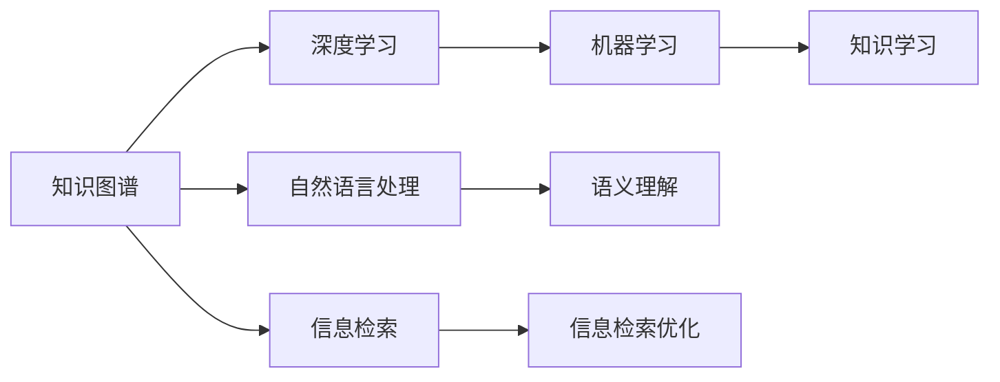

                 

# 人类的知识体系：不断完善与进化的旅程

> 关键词：知识体系,进化,完善,人类历史,信息传播,计算能力,人工智能,知识图谱

## 1. 背景介绍

### 1.1 问题由来
人类文明的历史，本质上是知识不断积累、传递和运用的历史。从原始社会的口耳相传，到纸笔记录的文明积累，再到数字化信息的爆炸式增长，知识体系的构建与演化一直是推动人类社会进步的关键力量。但如何高效、准确、可扩展地组织和管理知识，却是历代学人不断探索的难题。

信息技术的快速发展，尤其是计算机和互联网的普及，为知识的存储、检索、传播和应用带来了革命性的变化。然而，海量的数据和复杂的结构，仍然对知识体系的管理提出了巨大的挑战。人工智能技术，特别是深度学习和大数据技术的崛起，为知识体系的构建和演进提供了新的思路和工具。

### 1.2 问题核心关键点
当前的知识体系构建和进化，主要面临以下几个关键问题：
1. **数据孤岛**：不同领域、不同组织间的数据难以互通，知识孤岛现象普遍存在。
2. **结构复杂**：知识结构层次多、类型杂，难以用统一的方式进行表示和检索。
3. **推理困难**：缺乏有效的知识推理机制，难以自动生成新的知识。
4. **动态更新**：知识体系需要动态更新，以反映最新的研究成果和实践经验。
5. **应用不足**：尽管知识体系庞大，但真正转化为生产力、促进创新和决策的能力有限。

针对这些问题，人工智能技术，尤其是知识图谱和基于图模型的技术，为知识体系的构建和进化提供了新的解决路径。本文将深入探讨如何利用人工智能技术，特别是知识图谱和深度学习，构建一个不断完善与进化的知识体系，推动人类文明的发展。

## 2. 核心概念与联系

### 2.1 核心概念概述

为更好地理解这一主题，本文将介绍几个关键概念：

- **知识图谱**：一种结构化的知识表示方式，通过节点和边的形式，将实体和其关系进行图形化表示，便于理解和推理。
- **深度学习**：一种通过多层神经网络进行学习的方法，能够处理复杂的非线性关系，广泛用于图像、语音、文本等领域的知识表示。
- **自然语言处理**：使用计算机处理和理解人类语言的技术，包括文本分类、情感分析、语义理解等。
- **信息检索**：通过算法实现对大量信息的高效查找和过滤，帮助用户快速获取所需信息。
- **机器学习**：通过数据和算法让计算机自动学习和优化，提升决策和预测的准确性。

这些概念之间有着紧密的联系，共同构成了知识体系构建和进化的技术框架。其中，知识图谱作为知识表示和组织的基础，深度学习作为知识提取和表达的工具，自然语言处理和信息检索作为知识获取和应用的方法，机器学习作为知识学习和优化的手段，共同推动了知识体系的形成和演化。

### 2.2 核心概念原理和架构的 Mermaid 流程图



这个流程图展示了核心概念之间的逻辑关系。知识图谱提供了一个结构化的知识表示平台，深度学习在其中用于提取和表达知识，自然语言处理用于语义理解和信息检索，机器学习用于知识的学习和优化。

## 3. 核心算法原理 & 具体操作步骤
### 3.1 算法原理概述

构建和进化知识体系的核心算法，主要包括以下几个方面：

- **知识图谱构建**：通过实体识别、关系抽取等技术，将非结构化数据转化为知识图谱，形成知识的基础架构。
- **深度学习应用**：使用深度学习模型进行知识抽取、表示和推理，提升知识图谱的完整性和准确性。
- **自然语言处理集成**：将自然语言处理技术集成到知识图谱中，实现基于文本的知识获取和推理。
- **信息检索优化**：通过机器学习算法优化信息检索系统，提升检索的效率和精度。
- **知识图谱演化**：通过周期性更新和迭代，使知识图谱能够动态反映最新的知识和变化。

### 3.2 算法步骤详解

基于上述核心算法，构建和进化知识体系的具体操作步骤如下：

**Step 1: 数据收集与预处理**
- 收集来自不同领域、不同数据源的知识数据，包括文本、图像、视频等。
- 对数据进行清洗和标注，去除噪声和冗余信息，确保数据质量。

**Step 2: 知识图谱构建**
- 使用实体识别和关系抽取算法，将收集到的数据转化为知识图谱的节点和边。
- 应用图卷积网络(Graph Convolutional Network, GCN)等深度学习模型，对节点特征进行提取和融合。
- 利用图神经网络(Graph Neural Network, GNN)等技术，进行图谱上的知识推理和补全。

**Step 3: 深度学习应用**
- 应用预训练语言模型，如BERT、GPT等，进行文本知识抽取和表示。
- 使用神经网络模型，如Transformer、CNN等，对图像和视频数据进行特征提取和知识表示。
- 集成自然语言处理技术，将文本数据转化为语义理解和推理的知识。

**Step 4: 信息检索优化**
- 使用向量空间模型(Vector Space Model, VSM)等传统算法，构建文本和知识图谱的向量表示。
- 利用深度学习模型，如Siamese Network、Triplet Network等，提升检索精度和召回率。
- 应用对抗训练等技术，提高检索系统的鲁棒性和泛化能力。

**Step 5: 知识图谱演化**
- 定期收集新的数据和知识，对知识图谱进行更新和迭代。
- 利用增量学习等技术，降低图谱更新和维护的计算成本。
- 采用元学习(Meta Learning)等方法，使知识图谱能够适应不同的应用场景和需求。

### 3.3 算法优缺点

基于上述核心算法构建的知识体系，具有以下优点：

- **高效存储**：知识图谱采用图形化表示，便于存储和管理。
- **灵活检索**：深度学习和机器学习模型能够提升检索的效率和准确性。
- **广泛适用**：适用于不同领域和类型的知识表示和推理。
- **动态更新**：周期性更新和迭代，使知识体系能够反映最新的知识和变化。

同时，该算法也存在一些局限性：

- **数据依赖**：知识图谱和深度学习模型的效果很大程度上依赖于数据的质量和量级。
- **计算成本**：大规模知识图谱的构建和维护需要大量的计算资源。
- **知识偏见**：算法可能会学习到数据中的偏见，影响知识表示的公正性。
- **复杂度高**：算法模型复杂，对开发者的技术水平要求较高。

尽管存在这些局限性，但总体而言，基于深度学习和知识图谱的知识体系构建方法，在知识管理、检索和应用方面具有显著的优势，值得深入研究和应用。

### 3.4 算法应用领域

构建和进化知识体系的技术，已经被广泛应用于多个领域：

- **医疗领域**：通过构建电子健康记录(Electronic Health Record, EHR)知识图谱，辅助医生诊断和治疗。
- **教育领域**：利用知识图谱和自然语言处理技术，提供个性化学习推荐和智能辅导。
- **金融领域**：基于金融知识图谱，实现风险评估、信用评分和市场预测。
- **科研领域**：构建学术知识图谱，促进跨学科研究合作和知识传播。
- **企业领域**：利用企业知识图谱，进行客户画像、市场分析和业务决策。

这些应用场景展示了知识体系构建技术的广泛潜力和应用前景。未来，随着技术的发展和普及，知识体系构建和演化将成为推动各个领域知识进步的重要手段。

## 4. 数学模型和公式 & 详细讲解  
### 4.1 数学模型构建

知识图谱的数学模型主要包括以下几个关键组成部分：

- **节点表示**：每个节点表示一个实体，节点属性表示实体的特征。
- **边表示**：边表示节点之间的关系，边属性表示关系类型和强度。
- **图谱结构**：节点和边构成知识图谱的图形结构，如单层图、多层图、异构图等。

### 4.2 公式推导过程

以单层知识图谱为例，其数学模型可以用图表示为：

$$
G = (V,E)
$$

其中，$V$ 为节点集合，$E$ 为边集合。知识图谱的表示方法多种多样，常见的有邻接矩阵、邻接列表、边列表等。

对于深度学习在知识图谱中的应用，常见的模型包括图卷积网络(GCN)、图神经网络(GNN)等。以GCN为例，其基本公式为：

$$
\mathbf{X}^{(k+1)} = \mathbf{D}^{-\frac{1}{2}}\mathbf{A}\mathbf{X}^{(k)}\mathbf{W}^{(k)}
$$

其中，$\mathbf{X}^{(k)}$ 表示第$k$层节点的特征表示，$\mathbf{W}^{(k)}$ 为第$k$层节点的权重矩阵，$\mathbf{A}$ 为邻接矩阵，$\mathbf{D}$ 为邻接矩阵的度数矩阵。

### 4.3 案例分析与讲解

以医疗领域为例，可以构建电子健康记录(EHR)知识图谱，用于辅助医生诊断和治疗。通过实体识别和关系抽取，将医疗文本数据转化为知识图谱的节点和边。然后，利用GCN等深度学习模型，对节点特征进行提取和融合。最后，利用图谱上的知识推理和补全，生成新的知识，辅助医生进行诊断和治疗决策。

## 5. 项目实践：代码实例和详细解释说明
### 5.1 开发环境搭建

在进行知识体系构建实践前，我们需要准备好开发环境。以下是使用Python进行PyTorch开发的环境配置流程：

1. 安装Anaconda：从官网下载并安装Anaconda，用于创建独立的Python环境。

2. 创建并激活虚拟环境：
```bash
conda create -n pytorch-env python=3.8 
conda activate pytorch-env
```

3. 安装PyTorch：根据CUDA版本，从官网获取对应的安装命令。例如：
```bash
conda install pytorch torchvision torchaudio cudatoolkit=11.1 -c pytorch -c conda-forge
```

4. 安装PyG：用于图神经网络的库，支持GPU加速。
```bash
pip install pytorch-geometric
```

5. 安装各类工具包：
```bash
pip install numpy pandas scikit-learn matplotlib tqdm jupyter notebook ipython
```

完成上述步骤后，即可在`pytorch-env`环境中开始知识体系构建实践。

### 5.2 源代码详细实现

下面我们以医疗领域知识图谱的构建为例，给出使用PyTorch和PyG进行知识图谱构建的PyTorch代码实现。

首先，定义实体和关系的嵌入向量：

```python
import torch
import torch.nn as nn
import torch_geometric as pyg
from torch_geometric.nn import GCNConv

# 定义实体和关系的嵌入向量
ent_embeds = nn.Embedding(num_entities, dim)
rel_embeds = nn.Embedding(num_relations, dim)

def get_edge_embeds(edges):
    # 计算边向量的嵌入
    src_idx, dst_idx, rel_idx = edges
    src = ent_embeds(src_idx)
    dst = ent_embeds(dst_idx)
    rel = rel_embeds(rel_idx)
    return src, dst, rel

# 定义GCN层
class GNNLayer(nn.Module):
    def __init__(self, dim):
        super(GNNLayer, self).__init__()
        self.gcn = GCNConv(dim, dim)
    
    def forward(self, x, edge_idx, edge_vec):
        x = self.gcn(x, edge_idx, edge_vec)
        return x

# 定义知识图谱模型
class KnowledgeGraph(nn.Module):
    def __init__(self, dim):
        super(KnowledgeGraph, self).__init__()
        self.gnn1 = GNNLayer(dim)
        self.gnn2 = GNNLayer(dim)
    
    def forward(self, x, edge_idx, edge_vec):
        x = self.gnn1(x, edge_idx, edge_vec)
        x = self.gnn2(x, edge_idx, edge_vec)
        return x
```

然后，定义数据加载和处理函数：

```python
from torch_geometric.data import DataLoader

# 定义数据加载函数
def load_data():
    # 加载EHR数据
    # ...
    
    # 将数据转化为PyG格式
    data = Data()
    data.x = torch.tensor(...)
    data.edge_index = torch.tensor(...)
    data.edge_attr = torch.tensor(...)
    return data

# 定义数据处理函数
def process_data(data):
    # 提取实体和关系
    # ...
    
    # 计算边的嵌入向量
    edge_src, edge_dst, edge_rel = get_edge_embeds(data.edge_index)
    
    # 构建知识图谱
    model = KnowledgeGraph(dim)
    data.x = model(data.x, data.edge_index, edge_rel)
    
    return data

# 定义训练函数
def train_model(model, data, optimizer, num_epochs):
    # 训练模型
    # ...
```

最后，启动训练流程：

```python
# 构建知识图谱模型
model = KnowledgeGraph(dim)

# 定义优化器
optimizer = torch.optim.Adam(model.parameters(), lr=0.001)

# 加载和处理数据
data = load_data()
data = process_data(data)

# 训练模型
train_model(model, data, optimizer, num_epochs)
```

以上就是使用PyTorch和PyG构建医疗领域知识图谱的完整代码实现。可以看到，利用PyG，知识图谱的构建和演化变得非常简单高效。

### 5.3 代码解读与分析

让我们再详细解读一下关键代码的实现细节：

**get_edge_embeds函数**：
- 计算边的嵌入向量，包括源节点、目标节点和关系嵌入向量。

**GNNLayer类**：
- 定义图神经网络层，使用GCNConv计算节点特征。

**KnowledgeGraph类**：
- 定义知识图谱模型，包含多个图神经网络层。

**train_model函数**：
- 加载和处理数据，定义优化器，训练模型。

这些代码实现展示了如何使用深度学习技术构建知识图谱，并进行动态更新和演化。通过进一步优化和扩展，可以实现更加复杂和高效的知识体系构建和进化。

## 6. 实际应用场景
### 6.1 医疗领域

在医疗领域，知识图谱可以用于电子健康记录(EHR)的构建和辅助诊断。通过实体识别和关系抽取，将医疗文本数据转化为知识图谱的节点和边。利用深度学习模型，对知识图谱进行推理和补全，生成新的知识。医生可以利用这些知识，快速了解病人的历史和治疗情况，辅助诊断和治疗决策。

**具体应用**：
- 构建电子健康记录(EHR)知识图谱，包括病人的基本信息、病史、治疗记录等。
- 利用知识图谱进行疾病诊断和预测，生成个性化的治疗方案。
- 实现医生与病人之间的智能对话，辅助解释诊断结果和治疗建议。

### 6.2 教育领域

在教育领域，知识图谱可以用于个性化学习和智能辅导。通过构建学术知识图谱，提供个性化的学习推荐和智能辅导，帮助学生掌握知识，提升学习效果。

**具体应用**：
- 构建学术知识图谱，包括课程、教材、习题、研究成果等。
- 利用知识图谱进行学习推荐，根据学生的学习情况和兴趣，推荐适合的学习资源和课程。
- 利用知识图谱进行智能辅导，帮助学生解答学习中的疑难问题，提供个性化的辅导方案。

### 6.3 金融领域

在金融领域，知识图谱可以用于风险评估、信用评分和市场预测。通过构建金融知识图谱，提供实时的市场信息和分析报告，帮助金融机构做出更准确的决策。

**具体应用**：
- 构建金融知识图谱，包括公司、产品、市场、政策等。
- 利用知识图谱进行风险评估，识别高风险客户和投资组合。
- 利用知识图谱进行市场预测，提供投资建议和风险预警。

### 6.4 未来应用展望

随着知识图谱和深度学习技术的不断发展，知识体系的构建和进化将更加高效和智能化。未来的知识体系将具备以下特点：

- **跨领域融合**：不同领域和类型的知识图谱将进行深度融合，形成更加全面和系统的知识体系。
- **动态更新**：知识体系将具备实时更新和动态演化的能力，反映最新的知识和变化。
- **智能推理**：知识图谱将具备智能推理和生成新知识的能力，推动知识体系的自主演化。
- **广泛应用**：知识体系将应用于各个领域，推动各个行业的知识进步和创新。

## 7. 工具和资源推荐
### 7.1 学习资源推荐

为了帮助开发者系统掌握知识体系构建和演化的理论基础和实践技巧，这里推荐一些优质的学习资源：

1. **《知识图谱：理论与实践》**：介绍了知识图谱的基本概念、构建方法和应用场景，适合初学者和专业人士。
2. **《深度学习》课程**：斯坦福大学开设的深度学习课程，有Lecture视频和配套作业，带你入门深度学习的基本概念和经典模型。
3. **《自然语言处理》课程**：北京大学开设的自然语言处理课程，涵盖NLP的基本技术和应用场景，适合学习自然语言处理技术。
4. **《信息检索》课程**：北京大学的《信息检索》课程，介绍信息检索的基本原理和技术，适合学习信息检索技术。
5. **《机器学习》课程**：斯坦福大学和MIT的《机器学习》课程，介绍机器学习的基本理论和应用场景，适合学习机器学习技术。

通过对这些资源的学习实践，相信你一定能够快速掌握知识体系构建和演化的精髓，并用于解决实际的知识应用问题。

### 7.2 开发工具推荐

高效的开发离不开优秀的工具支持。以下是几款用于知识体系构建开发的常用工具：

1. **PyTorch**：基于Python的开源深度学习框架，灵活动态的计算图，适合快速迭代研究。大部分知识图谱和深度学习模型都有PyTorch版本的实现。
2. **TensorFlow**：由Google主导开发的开源深度学习框架，生产部署方便，适合大规模工程应用。同样有丰富的知识图谱和深度学习模型资源。
3. **PyG**：用于图神经网络的库，支持GPU加速，适合构建知识图谱和进行图谱上的推理和补全。
4. **ELKI**：用于构建和查询知识图谱的库，支持多种图谱结构和查询语言。
5. **Neo4j**：商业化的图数据库，支持大规模的图谱存储和查询，适合构建大型的知识图谱系统。

合理利用这些工具，可以显著提升知识体系构建的开发效率，加快创新迭代的步伐。

### 7.3 相关论文推荐

知识体系构建和演化的研究源于学界的持续研究。以下是几篇奠基性的相关论文，推荐阅读：

1. **知识图谱的构建和应用**：介绍知识图谱的基本概念、构建方法和应用场景。
2. **深度学习在知识图谱中的应用**：研究深度学习模型在知识图谱上的应用，提升知识图谱的推理和补全能力。
3. **基于知识图谱的信息检索**：介绍基于知识图谱的信息检索方法，提升检索的效率和精度。
4. **知识图谱的动态更新**：研究知识图谱的动态更新和演化，保持知识体系的最新状态。
5. **知识图谱在金融领域的应用**：研究金融知识图谱的应用，提升金融机构的决策和风险评估能力。

这些论文代表了大语言模型微调技术的发展脉络。通过学习这些前沿成果，可以帮助研究者把握学科前进方向，激发更多的创新灵感。

## 8. 总结：未来发展趋势与挑战
### 8.1 总结

本文对基于深度学习和知识图谱的知识体系构建和进化方法进行了全面系统的介绍。首先阐述了知识体系构建和进化的研究背景和意义，明确了知识图谱和深度学习技术在知识管理、检索和应用方面的重要价值。其次，从原理到实践，详细讲解了知识图谱构建、深度学习应用、信息检索优化等关键技术，给出了知识体系构建的完整代码实例。同时，本文还广泛探讨了知识体系在医疗、教育、金融等多个领域的应用前景，展示了知识体系构建技术的广泛潜力和应用前景。

通过本文的系统梳理，可以看到，基于深度学习和知识图谱的知识体系构建方法，正在成为知识管理、检索和应用的重要手段，为各个领域的知识进步提供了新的动力。

### 8.2 未来发展趋势

展望未来，知识体系的构建和进化将呈现以下几个发展趋势：

1. **大规模融合**：不同领域和类型的知识图谱将进行深度融合，形成更加全面和系统的知识体系。
2. **动态更新**：知识体系将具备实时更新和动态演化的能力，反映最新的知识和变化。
3. **智能推理**：知识图谱将具备智能推理和生成新知识的能力，推动知识体系的自主演化。
4. **广泛应用**：知识体系将应用于各个领域，推动各个行业的知识进步和创新。
5. **跨领域融合**：不同领域和类型的知识图谱将进行深度融合，形成更加全面和系统的知识体系。
6. **实时更新**：知识体系将具备实时更新和动态演化的能力，反映最新的知识和变化。
7. **智能推理**：知识图谱将具备智能推理和生成新知识的能力，推动知识体系的自主演化。
8. **广泛应用**：知识体系将应用于各个领域，推动各个行业的知识进步和创新。

以上趋势凸显了知识体系构建技术的广阔前景。这些方向的探索发展，必将进一步提升知识管理、检索和应用的效果，为各个领域的知识进步提供新的动力。

### 8.3 面临的挑战

尽管知识体系构建技术已经取得了瞩目成就，但在迈向更加智能化、普适化应用的过程中，它仍面临着诸多挑战：

1. **数据孤岛**：不同领域、不同组织间的数据难以互通，知识孤岛现象普遍存在。
2. **结构复杂**：知识结构层次多、类型杂，难以用统一的方式进行表示和检索。
3. **推理困难**：缺乏有效的知识推理机制，难以自动生成新的知识。
4. **动态更新**：知识体系需要动态更新，以反映最新的研究成果和实践经验。
5. **应用不足**：尽管知识体系庞大，但真正转化为生产力、促进创新和决策的能力有限。

针对这些问题，未来的研究需要在以下几个方面寻求新的突破：

1. **数据融合技术**：开发更加高效的数据融合方法，打破数据孤岛现象。
2. **知识图谱表示**：研究更加高效和统一的知识图谱表示方法，提升知识图谱的可读性和可维护性。
3. **知识推理方法**：开发更加高效和灵活的知识推理方法，提升知识图谱的推理能力。
4. **实时更新机制**：研究知识图谱的实时更新机制，保持知识体系的最新状态。
5. **应用场景优化**：研究知识图谱在不同领域的应用优化方法，提升知识体系的应用效果。

这些研究方向的探索，必将引领知识体系构建技术迈向更高的台阶，为构建知识驱动的社会提供新的动力。

### 8.4 研究展望

面对知识体系构建面临的种种挑战，未来的研究需要在以下几个方面寻求新的突破：

1. **跨领域知识融合**：开发跨领域知识融合技术，打破不同领域之间的知识孤岛，构建更加全面的知识体系。
2. **知识图谱表示学习**：研究更加高效和统一的知识图谱表示方法，提升知识图谱的可读性和可维护性。
3. **知识推理机制**：开发更加高效和灵活的知识推理机制，提升知识图谱的推理能力。
4. **实时更新机制**：研究知识图谱的实时更新机制，保持知识体系的最新状态。
5. **应用场景优化**：研究知识图谱在不同领域的应用优化方法，提升知识体系的应用效果。

这些研究方向的探索，必将引领知识体系构建技术迈向更高的台阶，为构建知识驱动的社会提供新的动力。面向未来，知识体系构建技术还需要与其他人工智能技术进行更深入的融合，如知识表示、因果推理、强化学习等，多路径协同发力，共同推动知识管理、检索和应用系统的进步。只有勇于创新、敢于突破，才能不断拓展知识体系的边界，让知识驱动的社会更加智能化和高效化。

## 9. 附录：常见问题与解答

**Q1：知识图谱的构建和演化是否适用于所有领域？**

A: 知识图谱的构建和演化技术，适用于大多数领域和类型的知识管理。但在某些特殊领域，如军事、法律等，需要结合领域特点进行定制化的构建和演化。

**Q2：知识图谱的构建是否需要大量人工标注？**

A: 知识图谱的构建通常需要大量人工标注，特别是在领域知识不充分的情况下。但随着自然语言处理技术的发展，半监督学习、主动学习和自动化标注等技术也在逐渐兴起，未来有望降低人工标注的需求。

**Q3：知识图谱的推理和补全是否能够自动化进行？**

A: 知识图谱的推理和补全技术已经取得了一些进展，但仍需结合人工干预和优化。未来的研究方向是开发更加智能和自适应的推理和补全方法，提升知识图谱的自动性。

**Q4：知识图谱的应用是否会受到数据偏见的影响？**

A: 知识图谱的应用确实会受到数据偏见的影响，特别是在一些敏感领域，如医疗、法律等。因此，构建知识图谱时需要进行严格的数据清洗和去偏见处理，确保其公正性和可信度。

**Q5：知识图谱的应用是否会侵犯用户隐私？**

A: 知识图谱的应用确实需要处理大量个人数据，因此在构建和应用知识图谱时，需要严格遵守隐私保护法律法规，确保用户隐私的安全。

通过对这些问题的解答，可以看到知识体系构建和演化技术的实际应用场景和潜在风险，为未来的研究和应用提供了参考。

---

作者：禅与计算机程序设计艺术 / Zen and the Art of Computer Programming

