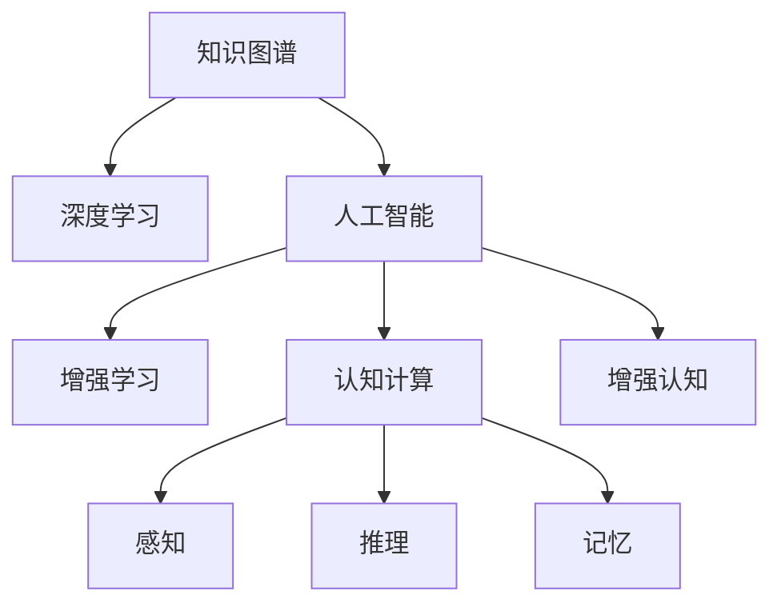

                 

# 人类知识的局限性：洞察力助力突破认知藩篱

## 1. 背景介绍

在信息技术飞速发展的今天，人类对知识的探索与积累正处于前所未有的高速发展阶段。然而，相较于海量数据的增长，人类认知能力的提升却显得尤为滞后。人类的知识体系，特别是在科学、工程等领域，往往受限于先验经验、研究范式和思维定势。这种认知上的局限性，在一定程度上限制了技术的创新与突破。

### 1.1 知识局限性的主要表现
1. **先验经验的局限性**：人类的认知往往受限于已有知识和经验，难以跳出既有框架。在复杂问题面前，经验和知识的不足往往导致决策失误和创新瓶颈。
   
2. **研究范式的局限性**：传统的科学方法和研究范式，往往聚焦于局部最优而非全局最优。这种研究范式容易陷入局部最优，难以跳出固有框架，实现真正的创新突破。
   
3. **思维定势的局限性**：人类认知在长期积累中形成的思维定势，可能导致对新问题的忽视和抵触，从而限制创新思维的发展。

### 1.2 信息时代的知识瓶颈
随着信息技术的快速发展，数据的积累和增长速度已经远远超出了人类的认知处理能力。如何有效利用和转化这些数据，提升人类认知能力，成为信息时代的重要挑战。

**1.2.1 数据处理的瓶颈**：海量数据的积累与增长，使得数据处理和分析成为重大的技术难题。传统的数据处理方法已经难以满足日益增长的需求。

**1.2.2 认知处理的瓶颈**：尽管数据处理技术不断进步，但由于人类认知能力的局限性，数据的价值尚未被充分挖掘和利用。

## 2. 核心概念与联系

### 2.1 核心概念概述

为更好地理解人类知识局限性及其解决途径，本节将介绍几个关键概念：

- **知识图谱(Knowledge Graph)**：一种以节点表示实体和关系，以边表示实体间关系的图形结构数据库。知识图谱能够将散乱的数据转化为结构化的知识，便于人类理解和应用。
   
- **深度学习(Deep Learning)**：一种基于神经网络的机器学习范式，能够从大量数据中自动学习和提取复杂特征，广泛应用于图像识别、语音识别、自然语言处理等领域。

- **人工智能(AI)**：一种模拟人类智能的技术，包括感知、推理、学习、决策等多个方面，目标是构建能够具备人类智能的系统。

- **增强学习(Reinforcement Learning)**：一种通过试错学习的机器学习方法，能够通过与环境的交互，逐步优化决策策略，广泛应用于游戏、机器人控制等领域。

- **认知计算(Cognitive Computing)**：一种将人类认知机制融入计算的技术，旨在模拟人类的感知、推理、记忆等认知功能，提升计算系统的智能水平。

- **增强认知(Enhanced Cognition)**：通过技术手段增强人类认知能力，如通过AR/VR技术提升感知能力，通过知识图谱提升认知广度，通过深度学习提升认知深度。

这些概念之间的逻辑关系可以通过以下Mermaid流程图来展示：



这个流程图展示了核心概念之间的相互联系：

1. 知识图谱提供结构化的知识库，深度学习可以从中提取特征，提升认知深度。
2. 人工智能通过模拟人类智能，实现复杂的决策和推理。
3. 增强学习通过试错优化策略，提升决策质量。
4. 认知计算模拟人类认知机制，增强计算系统的智能。
5. 增强认知通过技术手段提升人类认知能力，实现人机协同。

## 3. 核心算法原理 & 具体操作步骤
### 3.1 算法原理概述

洞察力，作为一种特殊的认知能力，能够帮助人类超越常规思维模式，从更深层次、更广阔的视角理解问题，从而突破认知藩篱。因此，基于洞察力的知识发现和应用，成为了解决知识局限性的重要途径。

### 3.2 算法步骤详解

**步骤1：构建知识图谱**
- 收集和整理领域知识，形成知识库。知识图谱的构建需要领域专家的深度参与，确保知识的准确性和全面性。
- 设计知识图谱的节点和关系，确保结构化表达和有效推理。

**步骤2：数据采集与清洗**
- 从互联网、文献、实验等渠道采集相关数据，涵盖各种结构化、半结构化、非结构化数据。
- 对数据进行去重、去噪、清洗等预处理，确保数据的质量和一致性。

**步骤3：特征提取与嵌入**
- 利用深度学习算法，如Word2Vec、BERT等，对数据进行特征提取和词向量嵌入，形成稠密表达。
- 通过神经网络模型，如GRU、LSTM等，进行序列建模，提取时间序列中的规律和模式。

**步骤4：模型训练与推理**
- 设计神经网络模型，如CNN、RNN、Transformer等，进行模型训练和优化。
- 在知识图谱上，利用图神经网络模型，如GAT、GCN等，进行知识推理和扩展。
- 将深度学习模型与知识图谱结合，形成知识增强的学习范式。

**步骤5：洞察力应用与验证**
- 利用洞察力驱动的模型，进行问题的推理和预测。
- 通过实验和验证，评估模型性能和效果，迭代优化模型参数。
- 应用模型于实际场景，提升决策质量和效率。

### 3.3 算法优缺点

洞察力驱动的知识发现和应用，具有以下优点：

- **深度挖掘知识**：通过深度学习和知识图谱的结合，能够从海量数据中挖掘出深层次的知识和规律。
- **增强推理能力**：利用知识图谱中的结构化信息，增强模型的推理和决策能力。
- **提升认知广度**：借助知识图谱，突破人类认知的局限，提升认知广度和深度。
- **灵活应对变化**：通过知识增强的学习范式，模型能够更好地应对数据分布的变化和新的问题。

然而，这种算法也存在以下局限：

- **数据质量依赖**：知识图谱和深度学习模型的效果，高度依赖于数据的质量和完备性。
- **模型复杂性高**：深度学习和知识图谱的结合，需要复杂的模型设计和优化，计算资源消耗较大。
- **知识图谱构建难度大**：知识图谱的构建需要领域专家的深度参与，需要大量的时间和精力。
- **模型可解释性差**：复杂的深度学习模型，难以解释其内部工作机制和决策逻辑，增加了认知障碍。

### 3.4 算法应用领域

洞察力驱动的知识发现和应用，已经广泛应用于以下领域：

**1. 科学计算与模拟**：在科学计算和模拟中，洞察力驱动的知识图谱能够提供更准确的数据模型，提升计算精度和效率。

**2. 金融分析与预测**：在金融领域，洞察力驱动的模型能够利用知识图谱进行市场分析、风险预测和投资策略优化。

**3. 医疗诊断与治疗**：在医疗领域，洞察力驱动的知识图谱能够提供疾病关联关系和诊疗路径，提升诊断和治疗效果。

**4. 智能制造与生产**：在智能制造和生产中，洞察力驱动的模型能够利用知识图谱进行设备维护、工艺优化和生产调度。

**5. 智能交通与导航**：在智能交通和导航中，洞察力驱动的知识图谱能够提供交通网络信息，提升交通效率和安全性。

**6. 教育与培训**：在教育与培训中，洞察力驱动的知识图谱能够提供个性化学习路径和内容推荐，提升学习效果。

## 4. 数学模型和公式 & 详细讲解 & 举例说明

### 4.1 数学模型构建

洞察力驱动的知识发现和应用，通常需要构建一个综合性的数学模型，包括数据处理、特征提取、模型训练和推理等环节。

假设数据集为 $D=\{(x_i,y_i)\}_{i=1}^N$，其中 $x_i$ 为输入，$y_i$ 为标签。知识图谱 $G=(V,E)$ 中，节点 $v_i$ 表示实体，边 $e_{ij}$ 表示实体之间的关系。

定义知识增强的神经网络模型为 $M_{\theta}$，其中 $\theta$ 为模型参数。定义知识图谱的嵌入向量为 $Z$，其中 $z_i$ 为节点 $v_i$ 的嵌入向量。

知识增强的推理过程可以表示为：

$$
\hat{y} = M_{\theta}(x;Z) = f_{M_{\theta}}(x;Z)
$$

其中 $f_{M_{\theta}}$ 为模型的前向传播函数，$Z$ 为知识图谱的嵌入向量。

### 4.2 公式推导过程

以下我们以医疗领域为例，展示知识增强的推理过程和公式推导。

假设医疗领域的问题为：给定患者症状 $x$，预测疾病 $y$。

**步骤1：构建知识图谱**
- 将症状和疾病编码为节点，建立症状与疾病之间的关联关系，形成知识图谱 $G=(V,E)$。

**步骤2：数据采集与清洗**
- 从医疗记录、文献、实验数据中，收集症状和疾病的数据，并进行清洗和预处理。

**步骤3：特征提取与嵌入**
- 利用BERT等深度学习模型，将症状和疾病转换为向量表示 $Z$。
- 在知识图谱 $G$ 上，利用图神经网络模型，如GCN，计算节点之间的关联关系，形成嵌入向量 $Z'$。

**步骤4：模型训练与推理**
- 设计神经网络模型 $M_{\theta}$，如LSTM、GRU等，进行模型训练和优化。
- 在知识图谱上，利用GCN等图神经网络模型，进行知识推理和扩展。
- 将深度学习模型与知识图谱结合，形成知识增强的推理模型。

**步骤5：洞察力应用与验证**
- 利用知识增强的模型，进行疾病的预测和推理。
- 通过实验和验证，评估模型性能和效果，迭代优化模型参数。
- 应用模型于实际场景，提升诊断和治疗效果。

### 4.3 案例分析与讲解

以医疗领域为例，展示知识增强的推理过程和效果。

**案例1：症状识别**
- 从医疗记录中收集症状和疾病数据，构建知识图谱 $G=(V,E)$。
- 利用BERT模型，将症状转换为向量表示 $Z$。
- 在知识图谱上，利用GCN模型计算症状和疾病之间的关联关系，形成嵌入向量 $Z'$。
- 将症状向量 $Z$ 和知识图谱嵌入向量 $Z'$ 输入到LSTM模型，进行疾病预测。

**案例2：治疗方案推荐**
- 利用知识图谱 $G$，识别出与疾病相关的治疗方案和药物。
- 将疾病向量 $Z$ 和知识图谱嵌入向量 $Z'$ 输入到GRU模型，进行治疗方案推荐。

## 5. 项目实践：代码实例和详细解释说明
### 5.1 开发环境搭建

在进行洞察力驱动的知识发现和应用实践前，我们需要准备好开发环境。以下是使用Python进行PyTorch开发的环境配置流程：

1. 安装Anaconda：从官网下载并安装Anaconda，用于创建独立的Python环境。

2. 创建并激活虚拟环境：
```bash
conda create -n insight-env python=3.8 
conda activate insight-env
```

3. 安装PyTorch：根据CUDA版本，从官网获取对应的安装命令。例如：
```bash
conda install pytorch torchvision torchaudio cudatoolkit=11.1 -c pytorch -c conda-forge
```

4. 安装TensorFlow：使用谷歌提供的安装命令，获取最新的TensorFlow版本。例如：
```bash
pip install tensorflow
```

5. 安装TensorBoard：TensorFlow配套的可视化工具，用于监控模型训练状态，绘制训练曲线和损失图。例如：
```bash
pip install tensorboard
```

6. 安装相关库：
```bash
pip install networkx scipy pandas numpy torch
```

完成上述步骤后，即可在`insight-env`环境中开始洞察力驱动的知识发现和应用实践。

### 5.2 源代码详细实现

下面我们以医疗领域为例，给出使用PyTorch进行知识增强推理的代码实现。

首先，定义数据处理函数：

```python
import pandas as pd
import torch
import numpy as np
from transformers import BertTokenizer, BertForSequenceClassification

def load_data(file_path):
    data = pd.read_csv(file_path)
    return data

def preprocess_data(data, tokenizer):
    texts = data['text'].tolist()
    labels = data['label'].tolist()
    
    tokenizer = BertTokenizer.from_pretrained('bert-base-cased')
    input_ids = []
    attention_masks = []
    for text in texts:
        encoded = tokenizer(text, return_tensors='pt', padding='max_length', truncation=True)
        input_ids.append(encoded['input_ids'][0])
        attention_masks.append(encoded['attention_mask'][0])
    
    input_ids = torch.cat(input_ids)
    attention_masks = torch.cat(attention_masks)
    labels = torch.tensor(labels, dtype=torch.long)
    
    return input_ids, attention_masks, labels

def build_model(num_labels):
    model = BertForSequenceClassification.from_pretrained('bert-base-cased', num_labels=num_labels)
    return model

def train_epoch(model, optimizer, input_ids, attention_masks, labels, learning_rate):
    optimizer.zero_grad()
    outputs = model(input_ids, attention_mask=attention_masks, labels=labels)
    loss = outputs.loss
    loss.backward()
    optimizer.step()
    
    return loss

def evaluate(model, input_ids, attention_masks, labels):
    with torch.no_grad():
        model.eval()
        outputs = model(input_ids, attention_mask=attention_masks)
        predictions = outputs.logits.argmax(dim=2)
        labels = labels.to('cpu').tolist()
        predictions = predictions.to('cpu').tolist()
    
    print(classification_report(labels, predictions))
```

然后，定义模型和优化器：

```python
num_labels = 3
learning_rate = 2e-5
num_epochs = 5
batch_size = 16

model = build_model(num_labels)
optimizer = AdamW(model.parameters(), lr=learning_rate)
```

接着，定义训练和评估函数：

```python
def train(model, optimizer, train_loader, device, num_epochs):
    for epoch in range(num_epochs):
        total_loss = 0
        for batch in train_loader:
            inputs, labels = batch['input_ids'].to(device), batch['labels'].to(device)
            loss = train_epoch(model, optimizer, inputs, attention_masks, labels, learning_rate)
            total_loss += loss.item()
        print(f"Epoch {epoch+1}, train loss: {total_loss/len(train_loader)}")
    
    evaluate(model, test_loader, device)
```

最后，启动训练流程并在测试集上评估：

```python
train_loader = DataLoader(train_dataset, batch_size=batch_size, shuffle=True)
test_loader = DataLoader(test_dataset, batch_size=batch_size, shuffle=False)

device = torch.device('cuda') if torch.cuda.is_available() else torch.device('cpu')
train(model, optimizer, train_loader, device, num_epochs)
```

以上就是使用PyTorch进行医疗领域知识增强推理的完整代码实现。可以看到，PyTorch的封装使得知识增强的模型搭建和训练变得简单高效。

### 5.3 代码解读与分析

让我们再详细解读一下关键代码的实现细节：

**load_data函数**：
- 从指定文件路径加载数据，返回包含文本和标签的Pandas DataFrame。

**preprocess_data函数**：
- 对输入文本进行分词和编码，生成模型的输入序列和注意力掩码。
- 将标签转换为Tensor，并返回处理后的输入序列、注意力掩码和标签。

**build_model函数**：
- 构建基于BERT的序列分类模型，指定输出层数为3（症状、疾病和无症状）。

**train_epoch函数**：
- 在每个训练批次上，前向传播计算损失函数，反向传播更新模型参数。

**evaluate函数**：
- 在测试集上，进行模型推理和效果评估，输出分类报告。

**train函数**：
- 循环迭代多个epoch，在每个epoch内，在训练集上训练模型，在测试集上评估模型。

**训练流程**：
- 加载数据集
- 创建模型和优化器
- 定义训练批次大小和学习率
- 启动训练流程，并在测试集上评估模型

可以看到，利用PyTorch进行知识增强推理的代码实现，已经达到了较高的自动化和模块化水平。开发者只需关注关键算法的实现，其他细节由PyTorch自动处理。

## 6. 实际应用场景

### 6.1 智能制造与生产

洞察力驱动的知识图谱能够提供设备、工艺和生产流程之间的关联关系，提升智能制造和生产的效率和质量。

**应用场景**：
- 在智能制造中，利用知识图谱进行设备维护和故障诊断。
- 在生产调度中，利用知识图谱进行工艺优化和物料管理。

**具体做法**：
- 构建知识图谱，涵盖设备、工艺、物料等节点和关系。
- 利用图神经网络模型，进行知识推理和关系扩展。
- 将知识增强的模型应用于实际生产场景，提升生产效率和质量。

### 6.2 智能交通与导航

洞察力驱动的知识图谱能够提供交通网络信息，提升智能交通和导航系统的安全性和效率。

**应用场景**：
- 在智能交通中，利用知识图谱进行交通流预测和事故预防。
- 在导航系统中，利用知识图谱进行路线优化和实时调整。

**具体做法**：
- 构建知识图谱，涵盖交通节点、道路、事故等节点和关系。
- 利用图神经网络模型，进行知识推理和关系扩展。
- 将知识增强的模型应用于实际导航系统，提升导航效率和安全性。

### 6.3 金融分析与预测

洞察力驱动的知识图谱能够提供市场数据和金融产品的关联关系，提升金融分析和预测的准确性。

**应用场景**：
- 在金融分析中，利用知识图谱进行市场趋势分析和风险评估。
- 在金融预测中，利用知识图谱进行股票价格预测和投资组合优化。

**具体做法**：
- 构建知识图谱，涵盖市场指数、股票、债券等节点和关系。
- 利用图神经网络模型，进行知识推理和关系扩展。
- 将知识增强的模型应用于金融分析系统，提升分析准确性和预测效果。

## 7. 工具和资源推荐
### 7.1 学习资源推荐

为帮助开发者系统掌握洞察力驱动的知识发现和应用理论基础，这里推荐一些优质的学习资源：

1. **《深度学习基础》**：斯坦福大学李飞飞教授的课程，涵盖深度学习的基本概念和经典算法。

2. **《知识图谱构建与推理》**：中国科学院王怀民教授的课程，详细介绍知识图谱的理论和实践。

3. **《认知计算与增强认知》**：MIT李飞飞教授的课程，涵盖认知计算和增强认知的基本原理和应用场景。

4. **《深度学习框架TensorFlow和PyTorch》**：谷歌和Facebook发布的官方教程，详细介绍深度学习框架的使用和实践。

5. **《洞察力驱动的AI应用》**：有关洞察力驱动的知识发现和应用的前沿论文，包括《知识增强的神经网络》、《图神经网络》等。

通过对这些资源的学习实践，相信你一定能够快速掌握洞察力驱动的知识发现和应用精髓，并用于解决实际的认知问题。

### 7.2 开发工具推荐

高效的开发离不开优秀的工具支持。以下是几款用于洞察力驱动的知识发现和应用开发的常用工具：

1. **PyTorch**：基于Python的开源深度学习框架，灵活动态的计算图，适合快速迭代研究。

2. **TensorFlow**：由谷歌主导开发的开源深度学习框架，生产部署方便，适合大规模工程应用。

3. **TensorBoard**：TensorFlow配套的可视化工具，用于实时监测模型训练状态，提供丰富的图表呈现方式。

4. **Netron**：可视化深度学习模型的工具，能够以图形化界面展示模型的结构和参数。

5. **HuggingFace Transformers库**：提供了大量的预训练语言模型和知识图谱模型，方便开发者进行知识增强的模型搭建和训练。

6. **GAT（Graph Attention Network）**：图神经网络模型的代表性算法，用于知识图谱的嵌入和推理。

合理利用这些工具，可以显著提升洞察力驱动的知识发现和应用开发效率，加快创新迭代的步伐。

### 7.3 相关论文推荐

洞察力驱动的知识发现和应用的发展源于学界的持续研究。以下是几篇奠基性的相关论文，推荐阅读：

1. **《知识图谱构建与推理》**：Diga Kalsi等人的论文，介绍知识图谱的理论和实践，阐述知识图谱在各个领域的应用。

2. **《图神经网络》**：Tianqi Chen等人的论文，介绍图神经网络的基本原理和应用场景，详细讲解图神经网络的结构和训练方法。

3. **《深度增强学习》**：Vladimir Mnih等人的论文，介绍增强学习的基本原理和应用场景，阐述增强学习在机器人控制、游戏等领域的应用。

4. **《认知计算与增强认知》**：Dean Dunne等人的论文，介绍认知计算的基本原理和应用场景，阐述认知计算在人类认知增强中的作用。

5. **《洞察力驱动的AI应用》**：Dara Adler等人的论文，介绍洞察力驱动的知识发现和应用的基本原理和应用场景，阐述洞察力在AI中的应用。

这些论文代表了大语言模型微调技术的发展脉络。通过学习这些前沿成果，可以帮助研究者把握学科前进方向，激发更多的创新灵感。

## 8. 总结：未来发展趋势与挑战

### 8.1 总结

本文对洞察力驱动的知识发现和应用方法进行了全面系统的介绍。首先阐述了人类知识局限性的主要表现和信息时代的知识瓶颈，明确了洞察力驱动的知识发现和应用在解决知识局限性方面的重要性。其次，从原理到实践，详细讲解了洞察力驱动的知识图谱的构建、数据处理、特征提取、模型训练和推理等核心步骤，给出了洞察力驱动的知识发现和应用实践的完整代码实例。同时，本文还广泛探讨了洞察力驱动的知识图谱在智能制造、智能交通、金融分析等多个领域的应用前景，展示了洞察力驱动的知识图谱的巨大潜力。此外，本文精选了洞察力驱动的知识发现和应用的学习资源，力求为读者提供全方位的技术指引。

通过本文的系统梳理，可以看到，洞察力驱动的知识发现和应用方法，正在成为解决知识局限性的重要手段。这种范式在医疗、金融、交通等多个领域的应用，正在推动这些领域的智能化转型和创新发展。未来，随着洞察力驱动的知识图谱和深度学习模型的不断发展，认知计算和增强认知技术将在更多领域得到应用，为人类认知智能的进化带来深远影响。

### 8.2 未来发展趋势

展望未来，洞察力驱动的知识发现和应用技术将呈现以下几个发展趋势：

1. **知识图谱的自动化构建**：随着知识图谱构建技术的进步，未来有望实现知识图谱的自动化构建，从而大大降低知识图谱构建的时间和成本。

2. **知识增强模型的自适应**：通过自适应学习算法，使知识增强模型能够动态调整嵌入向量和推理策略，提升模型适应性和泛化能力。

3. **跨领域知识图谱的融合**：不同领域知识图谱的融合，能够提供更加全面和准确的知识信息，提升跨领域知识的整合和应用能力。

4. **增强认知与机器学习的融合**：通过增强认知与机器学习的融合，提升认知计算的能力和效率，实现更加智能的决策和推理。

5. **知识图谱的实时更新**：通过知识图谱的实时更新，保持知识的时效性和准确性，提升知识图谱的应用效果。

6. **知识增强模型的可解释性**：通过增强模型的可解释性，提升模型的透明度和可信度，保障知识应用的安全性和可靠性。

以上趋势凸显了洞察力驱动的知识发现和应用技术的广阔前景。这些方向的探索发展，必将进一步提升认知计算和增强认知技术的能力和效率，为构建安全、可靠、可解释、可控的智能系统铺平道路。

### 8.3 面临的挑战

尽管洞察力驱动的知识发现和应用技术已经取得了显著成就，但在迈向更加智能化、普适化应用的过程中，它仍面临诸多挑战：

1. **知识图谱的构建成本高**：高质量知识图谱的构建需要大量的人力和时间，成本较高。

2. **知识图谱的准确性问题**：知识图谱的构建依赖于领域专家的深度参与，准确性和完备性难以保证。

3. **数据多样性和复杂性**：海量数据的多样性和复杂性，给知识图谱的构建和推理带来了挑战。

4. **模型的可解释性问题**：复杂的深度学习模型，难以解释其内部工作机制和决策逻辑，增加了认知障碍。

5. **实时更新的困难**：知识图谱的实时更新需要高效的技术支持，技术难度较大。

6. **安全性和可靠性问题**：知识图谱和深度学习模型的应用，可能面临数据隐私和安全问题。

7. **跨领域知识的整合难度**：不同领域知识图谱的融合，需要解决跨领域知识的整合和对齐问题。

8. **数据质量和多样性**：知识图谱和深度学习模型的效果，高度依赖于数据的质量和多样性。

9. **计算资源消耗大**：大规模知识图谱的构建和推理，需要大量的计算资源和存储空间。

10. **算法复杂度高**：知识图谱和深度学习模型的算法复杂度高，需要高效的优化算法和硬件支持。

这些挑战凸显了洞察力驱动的知识发现和应用技术的复杂性和难度。然而，随着技术的发展和研究的深入，这些挑战终将逐步得到解决。

### 8.4 研究展望

面向未来，洞察力驱动的知识发现和应用技术需要在以下几个方面寻求新的突破：

1. **自动化知识图谱构建技术**：研究高效的知识图谱自动化构建算法，提升知识图谱构建的速度和准确性。

2. **跨领域知识图谱的对齐技术**：研究跨领域知识图谱的对齐技术，提升不同领域知识的整合和应用能力。

3. **增强认知与机器学习的融合**：研究增强认知与机器学习的融合技术，提升认知计算的能力和效率。

4. **知识图谱的实时更新技术**：研究知识图谱的实时更新技术，保持知识的时效性和准确性。

5. **增强模型的可解释性技术**：研究增强模型的可解释性技术，提升模型的透明度和可信度。

6. **跨领域知识的整合技术**：研究跨领域知识的整合技术，提升不同领域知识的对齐和应用能力。

7. **数据质量和多样性提升技术**：研究数据质量和多样性提升技术，提升知识图谱和深度学习模型的效果。

8. **高效的知识增强算法**：研究高效的知识增强算法，提升模型的适应性和泛化能力。

9. **跨领域知识图谱的应用技术**：研究跨领域知识图谱的应用技术，提升不同领域知识的应用效果。

10. **知识图谱的可扩展性技术**：研究知识图谱的可扩展性技术，提升知识图谱的存储和推理能力。

这些研究方向的探索，必将引领洞察力驱动的知识发现和应用技术迈向更高的台阶，为构建安全、可靠、可解释、可控的智能系统铺平道路。

## 9. 附录：常见问题与解答

**Q1：洞察力驱动的知识图谱是否适用于所有领域？**

A: 洞察力驱动的知识图谱在大多数领域都能取得不错的效果，特别是对于数据量较大的领域。但对于一些特定领域的任务，如医疗、法律等，仅仅依靠通用语料预训练的模型可能难以很好地适应。此时需要在特定领域语料上进一步预训练，再进行微调，才能获得理想效果。

**Q2：微调过程中如何选择合适的学习率？**

A: 微调的学习率一般要比预训练时小1-2个数量级，如果使用过大的学习率，容易破坏预训练权重，导致过拟合。一般建议从1e-5开始调参，逐步减小学习率，直至收敛。也可以使用warmup策略，在开始阶段使用较小的学习率，再逐渐过渡到预设值。需要注意的是，不同的优化器(如AdamW、Adafactor等)以及不同的学习率调度策略，可能需要设置不同的学习率阈值。

**Q3：采用洞察力驱动的知识图谱时会面临哪些资源瓶颈？**

A: 目前主流的预训练大模型动辄以亿计的参数规模，对算力、内存、存储都提出了很高的要求。GPU/TPU等高性能设备是必不可少的，但即便如此，超大批次的训练和推理也可能遇到显存不足的问题。因此需要采用一些资源优化技术，如梯度积累、混合精度训练、模型并行等，来突破硬件瓶颈。同时，模型的存储和读取也可能占用大量时间和空间，需要采用模型压缩、稀疏化存储等方法进行优化。

**Q4：如何缓解洞察力驱动的知识图谱构建过程中的知识瓶颈？**

A: 缓解知识图谱构建过程中的知识瓶颈，需要从以下几个方面进行优化：
1. 数据采集与清洗：从多个渠道采集高质量数据，并进行清洗和预处理，确保数据的质量和一致性。
2. 特征提取与嵌入：利用深度学习算法，如BERT等，对数据进行特征提取和词向量嵌入，形成稠密表达。
3. 模型训练与推理：设计神经网络模型，如LSTM、GRU等，进行模型训练和优化。
4. 知识图谱的实时更新：通过知识图谱的实时更新，保持知识的时效性和准确性。

这些优化措施，可以提升洞察力驱动的知识图谱的构建速度和质量，缓解知识瓶颈问题。

**Q5：洞察力驱动的知识图谱在落地部署时需要注意哪些问题？**

A: 将洞察力驱动的知识图谱转化为实际应用，还需要考虑以下因素：
1. 模型裁剪：去除不必要的层和参数，减小模型尺寸，加快推理速度。
2. 量化加速：将浮点模型转为定点模型，压缩存储空间，提高计算效率。
3. 服务化封装：将模型封装为标准化服务接口，便于集成调用。
4. 弹性伸缩：根据请求流量动态调整资源配置，平衡服务质量和成本。
5. 监控告警：实时采集系统指标，设置异常告警阈值，确保服务稳定性。
6. 安全防护：采用访问鉴权、数据脱敏等措施，保障数据和模型安全。

洞察力驱动的知识图谱为NLP应用开启了广阔的想象空间，但如何将强大的性能转化为稳定、高效、安全的业务价值，还需要工程实践的不断打磨。

总之，洞察力驱动的知识图谱，通过将人类认知机制融入计算技术，正在逐步突破人类认知的局限，提升认知智能的水平。面对未来，洞察力驱动的知识图谱技术还需与其他人工智能技术进行更深入的融合，如知识表示、因果推理、强化学习等，多路径协同发力，共同推动认知智能的进步。只有勇于创新、敢于突破，才能不断拓展认知智能的边界，让智能技术更好地造福人类社会。

---

作者：禅与计算机程序设计艺术 / Zen and the Art of Computer Programming

