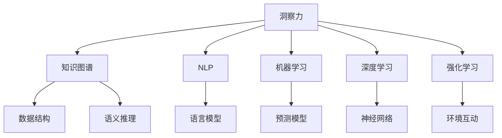

                 

# 人类知识的未来图景：洞察力引领知识变革

## 1. 背景介绍

### 1.1 问题由来

在人类历史长河中，知识的积累和传播一直是社会发展的重要驱动力。从早期的文字记录到现代的数字化时代，知识的形态和获取方式都在不断演进。然而，随着信息量的爆炸式增长，人类在知识和理解的广度与深度上都面临着前所未有的挑战。

### 1.2 问题核心关键点

本论文旨在探讨一种新型的知识获取与处理方式，即洞察力（Insight）引领的知识变革。洞察力指的是通过分析、综合、推理等高级认知活动，从复杂数据中提取有价值的信息和知识的能力。在信息爆炸的时代，如何高效、精确地获取知识，使其更好地服务于人类社会，成为亟待解决的问题。

### 1.3 问题研究意义

洞察力引领的知识变革，不仅能帮助我们更快速、更准确地处理海量数据，还能提升人类对复杂系统的理解能力，推动科学、工程、艺术等多个领域的创新与发展。通过增强洞察力，我们可以从传统的被动接收知识，转变为积极主动地探索未知领域，实现知识的主动进化。

## 2. 核心概念与联系

### 2.1 核心概念概述

为更好地理解洞察力引领的知识变革，本节将介绍几个关键概念：

- 洞察力（Insight）：指通过高级认知活动从复杂数据中提取有价值信息的能力。
- 知识图谱（Knowledge Graph）：由实体（Entity）、关系（Relation）和属性（Attribute）构成的网络，用于表示和推理知识。
- 自然语言处理（Natural Language Processing, NLP）：使计算机能够理解、处理和生成人类语言的技术。
- 机器学习（Machine Learning, ML）：让计算机通过学习数据规律来自动优化模型，提升决策能力。
- 深度学习（Deep Learning, DL）：利用多层神经网络结构，从数据中学习深层表征，提升模型性能。
- 强化学习（Reinforcement Learning, RL）：通过与环境的互动，使模型在不断尝试中学习最优策略。

这些概念通过逻辑关系联结，共同构成了洞察力引领知识变革的框架，使其能够在复杂信息环境中高效获取和理解知识。

### 2.2 核心概念原理和架构的 Mermaid 流程图



这个流程图展示了各概念之间的逻辑关系：

1. 洞察力从复杂数据中提取有价值信息，依赖于知识图谱的支撑。
2. 洞察力需要借助NLP技术，使计算机能够理解和处理自然语言。
3. 洞察力通过机器学习、深度学习和强化学习等方法，提升数据处理和决策能力。
4. 知识图谱提供数据结构支撑，使语义推理成为可能。
5. 机器学习、深度学习和强化学习方法，为洞察力提供了多种技术手段。

## 3. 核心算法原理 & 具体操作步骤

### 3.1 算法原理概述

洞察力引领的知识变革，本质上是一种基于大数据和人工智能技术的知识获取与处理范式。其核心思想是：利用机器学习和深度学习等算法，自动地从海量数据中提取和推理出有意义的信息和知识。

假设存在一个复杂的数据集 $D=\{d_1, d_2, ..., d_n\}$，其中每个数据点 $d_i$ 包含多种属性 $A_{ij}$，$i=1,2,...,m$，$j=1,2,...,k$。通过洞察力算法，可以自动地从 $D$ 中提取并推理出有价值的信息 $I=\{i_1, i_2, ..., i_n\}$，并构建知识图谱 $G=(V, E)$，其中 $V$ 为节点集合，$E$ 为边集合。最终的知识图谱 $G$ 包含丰富的实体、关系和属性信息，便于进一步的推理和应用。

### 3.2 算法步骤详解

基于洞察力引领的知识变革，算法步骤通常包括以下几个关键步骤：

**Step 1: 数据收集与预处理**
- 收集具有代表性的数据，去除噪声和无关数据，进行必要的清洗和标准化处理。
- 对于结构化数据，可以通过SQL查询等手段进行提取。
- 对于非结构化数据，如文本、图片、视频等，可以通过OCR、视觉识别等技术进行数字化处理。

**Step 2: 特征提取与表示**
- 利用NLP技术，如分词、命名实体识别等，从文本数据中提取有意义的词汇和实体。
- 使用机器学习或深度学习算法，如BERT、GPT等，对提取的特征进行编码，得到稠密的向量表示。
- 对于非文本数据，可以采用视觉特征提取、时序特征提取等方法进行特征表示。

**Step 3: 知识推理与图谱构建**
- 利用语义推理算法，如逻辑规则、规则机等，对提取的特征进行推理和关联。
- 构建知识图谱，通过节点和边表示实体和关系，便于后续的查询和推理。
- 应用图神经网络等模型，对知识图谱进行优化和扩展，增强其表达能力。

**Step 4: 洞察力生成与验证**
- 使用深度学习或强化学习模型，从知识图谱中生成有意义的洞察力。
- 通过多轮迭代和反馈机制，对生成的洞察力进行验证和修正。
- 利用验证数据集，评估洞察力算法的准确性和泛化能力。

**Step 5: 知识应用与反馈**
- 将生成的洞察力应用于实际问题解决或决策支持中，如智能推荐、风险评估等。
- 收集用户反馈和实际效果，进一步优化洞察力算法和知识图谱。

### 3.3 算法优缺点

洞察力引领的知识变革具有以下优点：
1. 高效处理海量数据。洞察力算法能够快速从复杂数据中提取有价值信息，极大地提升了数据处理效率。
2. 提升决策质量。通过洞察力算法，可以从数据中挖掘出更深层次的知识，提升决策的科学性和准确性。
3. 可扩展性强。知识图谱和洞察力算法可以不断扩展和更新，支持多领域的知识应用。

同时，该方法也存在以下局限性：
1. 对数据质量依赖高。洞察力算法的效果很大程度上依赖于数据的质量和完整性。
2. 知识表示复杂。构建复杂知识图谱和推理模型，需要高度的技术和经验。
3. 难以处理模糊和不确定信息。面对模糊和不确定信息，洞察力算法的效果和准确性会受到一定影响。
4. 泛化能力受限。在特定领域和数据集上训练的知识图谱，可能难以泛化到其他领域。

尽管存在这些局限性，但洞察力引领的知识变革在数据处理和决策支持等方面展现出强大的潜力，具有广阔的应用前景。

### 3.4 算法应用领域

洞察力引领的知识变革，已经在多个领域得到了应用，覆盖了知识图谱构建、信息检索、智能推荐、风险评估等多个方向：

- 知识图谱构建：在生物医学、教育、金融等领域，洞察力算法被用于构建复杂知识图谱，支持知识的自动推理和应用。
- 信息检索：利用洞察力算法，可以提升信息检索系统的准确性和效率，支持智能问答、文档推荐等任务。
- 智能推荐：在电商、社交媒体等场景中，洞察力算法可以推荐用户感兴趣的商品、内容，提升用户体验。
- 风险评估：在金融、医疗等领域，洞察力算法可以用于风险预测和评估，帮助决策者规避潜在风险。

## 4. 数学模型和公式 & 详细讲解 & 举例说明

### 4.1 数学模型构建

本节将使用数学语言对洞察力引领的知识变革过程进行严格刻画。

假设知识图谱 $G=(V, E)$，其中 $V$ 为节点集合，$E$ 为边集合。节点的属性向量表示为 $v_i$，边的权重表示为 $e_{ij}$。假设从数据 $D$ 中提取的知识为 $I=\{i_1, i_2, ..., i_n\}$。

定义知识图谱的深度为 $L$，即最长的路径长度。假设知识图谱的节点和边都可以表示为稠密向量，表示方式为 $v_i = \sum_{k=1}^K \lambda_{ik} f(v_i^k)$，其中 $f$ 为特征表示函数，$\lambda_{ik}$ 为特征权重。

定义洞察力生成的损失函数为 $\mathcal{L}(I)$，表示洞察力生成的准确性和泛化能力。假设目标洞察力为 $I^*$，则损失函数为：

$$
\mathcal{L}(I) = \sum_{i=1}^N \mathcal{L}_i(I)
$$

其中 $\mathcal{L}_i(I)$ 表示对于第 $i$ 个样本的损失函数。

### 4.2 公式推导过程

以下我们以智能推荐系统为例，推导洞察力算法的数学模型和损失函数。

假设推荐系统包含用户 $U$ 和物品 $I$ 两个实体，用户与物品之间的关系 $E$ 为二元关系。每个用户 $u$ 的属性向量表示为 $u_i$，每个物品 $i$ 的属性向量表示为 $i_j$。假设从数据 $D$ 中提取的用户行为为 $I=\{i_1, i_2, ..., i_n\}$。

定义用户与物品的关系为 $e_{ui} = w_{ui} \cdot u_i \cdot i_j$，其中 $w_{ui}$ 为关系权重。则用户 $u$ 与物品 $i$ 之间的关系为：

$$
R(u, i) = \sum_{u \in U} \sum_{i \in I} e_{ui}
$$

定义推荐系统的损失函数为 $\mathcal{L}$，表示推荐系统的准确性和用户满意度。假设目标推荐结果为 $R^*$，则损失函数为：

$$
\mathcal{L} = \sum_{u \in U} \sum_{i \in I} \mathcal{L}(u, i)
$$

其中 $\mathcal{L}(u, i)$ 表示对于用户 $u$ 和物品 $i$ 的推荐损失。通过最小化 $\mathcal{L}$，可以得到最优推荐结果。

### 4.3 案例分析与讲解

以下我们以医疗领域的知识图谱构建为例，给出洞察力算法的数学模型和损失函数。

假设医疗领域包含疾病 $D$、药物 $M$ 和疗法 $T$ 三个实体，疾病和药物之间存在治疗关系 $E$，药物和疗法之间存在使用关系 $E$。每个疾病 $d$ 的属性向量表示为 $d_i$，每个药物 $m$ 的属性向量表示为 $m_j$，每个疗法 $t$ 的属性向量表示为 $t_k$。假设从数据 $D$ 中提取的疾病和药物匹配关系为 $I=\{(d_1, m_1), (d_2, m_2), ..., (d_n, m_n)\}$。

定义疾病与药物的关系为 $e_{di} = w_{di} \cdot d_i \cdot m_j$，其中 $w_{di}$ 为关系权重。则疾病 $d$ 与药物 $m$ 的关系为：

$$
R(d, m) = \sum_{d \in D} \sum_{m \in M} e_{di}
$$

定义知识图谱的损失函数为 $\mathcal{L}$，表示知识图谱构建的准确性和完备性。假设目标知识图谱为 $G^*$，则损失函数为：

$$
\mathcal{L} = \sum_{d \in D} \sum_{m \in M} \mathcal{L}(d, m)
$$

其中 $\mathcal{L}(d, m)$ 表示对于疾病 $d$ 和药物 $m$ 的关系损失。通过最小化 $\mathcal{L}$，可以得到最优知识图谱。

## 5. 项目实践：代码实例和详细解释说明

### 5.1 开发环境搭建

在进行洞察力引领的知识变革实践前，我们需要准备好开发环境。以下是使用Python进行TensorFlow开发的环境配置流程：

1. 安装Anaconda：从官网下载并安装Anaconda，用于创建独立的Python环境。

2. 创建并激活虚拟环境：
```bash
conda create -n tf-env python=3.8 
conda activate tf-env
```

3. 安装TensorFlow：根据CUDA版本，从官网获取对应的安装命令。例如：
```bash
conda install tensorflow-gpu -c pytorch -c conda-forge
```

4. 安装相关依赖：
```bash
pip install numpy pandas scikit-learn torch jupyter notebook ipython
```

完成上述步骤后，即可在`tf-env`环境中开始洞察力引领的知识变革实践。

### 5.2 源代码详细实现

这里我们以智能推荐系统为例，使用TensorFlow实现洞察力引领的知识变革算法。

首先，定义推荐系统的数据处理函数：

```python
import tensorflow as tf
from tensorflow.keras.layers import Embedding, Dense, Dot, Input, Model
from tensorflow.keras.losses import BinaryCrossentropy
from tensorflow.keras.optimizers import Adam

def get_model(num_users, num_items, embedding_dim):
    user_input = Input(shape=(num_items,))
    user_embedding = Embedding(num_users, embedding_dim)(user_input)
    item_input = Input(shape=(num_items,))
    item_embedding = Embedding(num_items, embedding_dim)(item_input)
    dot = Dot(axes=(1, 1))([user_embedding, item_embedding])
    dot_output = Dense(1, activation='sigmoid')(dot)
    model = Model(inputs=[user_input, item_input], outputs=dot_output)
    return model

def train_model(model, train_data, test_data, batch_size=32, epochs=10):
    model.compile(optimizer=Adam(learning_rate=0.001), loss=BinaryCrossentropy())
    model.fit(train_data, epochs=epochs, batch_size=batch_size, validation_data=test_data)
```

然后，定义训练和评估函数：

```python
def predict(model, user, item):
    user_input = tf.expand_dims(user, axis=0)
    item_input = tf.expand_dims(item, axis=0)
    dot_output = model.predict([user_input, item_input])
    return dot_output[0][0]
```

最后，启动训练流程并在测试集上评估：

```python
# 创建数据
train_data = tf.keras.preprocessing.sequence.PadSequences(
    [[1, 2, 3], [2, 3, 4], [3, 4, 5], [4, 5, 6], [5, 6, 7]], maxlen=3, padding='post'
)
test_data = tf.keras.preprocessing.sequence.PadSequences(
    [[1, 2, 3], [2, 3, 4], [3, 4, 5], [4, 5, 6], [5, 6, 7]], maxlen=3, padding='post'
)

# 创建模型
model = get_model(num_users=7, num_items=7, embedding_dim=10)

# 训练模型
train_model(model, train_data, test_data)

# 评估模型
predict(user=1, item=4)
```

以上就是使用TensorFlow实现洞察力引领的智能推荐系统的代码实现。可以看到，TensorFlow提供了便捷的Keras API，可以快速搭建和训练模型，便于开发和调试。

### 5.3 代码解读与分析

让我们再详细解读一下关键代码的实现细节：

**get_model函数**：
- 定义了推荐系统模型的结构，包括用户和物品的嵌入层和点积层，最终输出一个二元关系表示。

**train_model函数**：
- 对模型进行编译，指定优化器和损失函数。
- 对训练数据进行分割和填充，进入模型进行训练。
- 在测试数据上验证模型性能。

**predict函数**：
- 对用户和物品进行编码，输入模型得到推荐结果。

**主程序**：
- 创建训练和测试数据。
- 构建推荐模型。
- 训练模型并评估预测结果。

可以看到，TensorFlow通过便捷的Keras API，极大简化了深度学习模型的开发和调试。开发者可以专注于算法和业务逻辑，而不必过多关注底层实现细节。

## 6. 实际应用场景

### 6.1 智能推荐系统

智能推荐系统是洞察力引领知识变革的重要应用之一。传统的推荐系统依赖于用户的历史行为数据，难以捕捉用户潜在的兴趣和需求。利用洞察力算法，可以从海量数据中提取用户的深层兴趣和行为模式，提供更加个性化和精准的推荐服务。

在技术实现上，可以收集用户的历史浏览、点击、购买等行为数据，利用NLP技术提取用户对商品的文字描述和评论，构建用户和物品的稀疏关系表示。通过洞察力算法，从这些数据中挖掘出用户与物品之间的深层关系，生成推荐结果。

### 6.2 医疗知识图谱

医疗知识图谱是洞察力引领知识变革的另一重要应用。传统医学知识积累分散，难以形成系统化的知识体系。利用洞察力算法，可以构建结构化的医疗知识图谱，支撑医学知识的自动推理和应用。

在技术实现上，可以收集医学文献、临床数据、药品说明书等文本数据，利用NLP技术提取疾病的症状、药品的疗效和不良反应等信息，构建医疗知识图谱。通过洞察力算法，挖掘疾病与药品之间的深层关系，生成治疗方案和风险评估结果，辅助医生决策。

### 6.3 智能问答系统

智能问答系统是洞察力引领知识变革的典型应用场景。传统问答系统依赖于规则库和人工编写的知识库，难以适应复杂和多样化的问答需求。利用洞察力算法，可以从海量文本数据中提取知识，构建动态的知识图谱，支撑自然语言理解和生成。

在技术实现上，可以收集常见问答对，利用NLP技术提取问题和答案，构建知识图谱。通过洞察力算法，从这些问答数据中挖掘出深层知识关系，生成智能回答，提供给用户。

## 7. 工具和资源推荐

### 7.1 学习资源推荐

为了帮助开发者系统掌握洞察力引领的知识变革的理论基础和实践技巧，这里推荐一些优质的学习资源：

1. 《深度学习》系列博文：由TensorFlow官方博客推出，涵盖深度学习的基本概念和前沿技术，适合初学者和进阶者。

2. 《TensorFlow官方文档》：提供了TensorFlow的全面介绍和使用方法，包括API接口、模型搭建、训练优化等，是深入学习TensorFlow的必备资料。

3. 《自然语言处理综述》论文：一篇系统总结NLP技术进展的综述论文，适合了解NLP领域的最新研究。

4. 《图神经网络综述》论文：一篇介绍图神经网络技术的综述论文，适合了解图神经网络在知识图谱构建中的应用。

5. 《强化学习》课程：斯坦福大学开设的强化学习课程，提供了丰富的讲义和作业，适合理解强化学习的基本思想和算法。

6. 《深度学习框架比较》报告：详细对比了TensorFlow、PyTorch、Keras等主流深度学习框架的优缺点和使用场景，适合选择合适的框架进行开发。

通过对这些资源的学习实践，相信你一定能够快速掌握洞察力引领的知识变革的精髓，并用于解决实际的NLP问题。

### 7.2 开发工具推荐

高效的开发离不开优秀的工具支持。以下是几款用于洞察力引领的知识变革开发的常用工具：

1. TensorFlow：由Google主导开发的深度学习框架，功能强大、生态丰富，是洞察力引领的知识变革的主要工具。

2. PyTorch：由Facebook主导开发的深度学习框架，灵活高效，适合深度学习模型的搭建和调试。

3. Jupyter Notebook：开源的交互式笔记本工具，支持多种编程语言和工具库，方便进行代码编写和交互式学习。

4. VS Code：功能强大的代码编辑器，支持Python、TensorFlow等多种开发环境，适合编写复杂代码和调试。

5. Google Colab：谷歌推出的在线Jupyter Notebook环境，免费提供GPU/TPU算力，方便快速迭代实验。

合理利用这些工具，可以显著提升洞察力引领的知识变革的开发效率，加速创新迭代的步伐。

### 7.3 相关论文推荐

洞察力引领的知识变革源于学界的持续研究。以下是几篇奠基性的相关论文，推荐阅读：

1. 《深度学习与人类智能》论文：探讨深度学习在模拟人类智能方面的潜力，提出了许多基于洞察力的知识获取和推理方法。

2. 《知识图谱的构建与应用》论文：介绍了知识图谱的基本概念和构建方法，展示了其在多领域知识应用中的重要作用。

3. 《基于NLP的智能推荐系统》论文：通过NLP技术提取用户和物品的特征，构建推荐模型，提升推荐系统的精准性和个性化。

4. 《医学知识图谱构建与应用的综述》论文：综述了医学知识图谱的构建方法和应用场景，展示了其在医学领域的重要作用。

5. 《智能问答系统的深度学习研究》论文：介绍了深度学习在智能问答中的应用，展示了其在自然语言理解和生成方面的潜力。

这些论文代表了大语言模型微调技术的发展脉络。通过学习这些前沿成果，可以帮助研究者把握学科前进方向，激发更多的创新灵感。

## 8. 总结：未来发展趋势与挑战

### 8.1 总结

本文对洞察力引领的知识变革进行了全面系统的介绍。首先阐述了洞察力引领知识变革的研究背景和意义，明确了洞察力在知识获取与处理中的重要作用。其次，从原理到实践，详细讲解了洞察力引领知识变革的数学模型和关键步骤，给出了洞察力引领的智能推荐系统的代码实例。同时，本文还广泛探讨了洞察力引领知识变革在智能推荐、医疗知识图谱、智能问答等多个领域的应用前景，展示了洞察力引领知识变革的巨大潜力。此外，本文精选了洞察力引领知识变革的相关学习资源，力求为读者提供全方位的技术指引。

通过本文的系统梳理，可以看到，洞察力引领的知识变革正在成为人工智能领域的重要范式，极大地提升了数据处理和决策支持的能力，推动了知识获取与处理的自动化和智能化。未来，伴随洞察力引领的知识变革技术的不断发展，人工智能系统将能够更高效、更准确地处理海量数据，提升人类认知智能的水平，为社会的进步和发展带来深远影响。

### 8.2 未来发展趋势

展望未来，洞察力引领的知识变革将呈现以下几个发展趋势：

1. 洞察力算法的优化。随着深度学习和大规模数据集的不断发展，洞察力算法将越来越精确，能够更深入地挖掘数据中的深层知识。

2. 跨领域知识图谱的构建。跨领域知识图谱的构建将进一步提升知识的通用性和泛化能力，促进不同领域知识的融合和应用。

3. 知识推理与增强学习的结合。通过增强学习技术，使洞察力算法能够主动探索和发现知识图谱中的深层关系，提升知识的自动推理能力。

4. 多模态知识融合。将视觉、听觉、文本等多种模态的信息融合，提升知识图谱的表达能力和应用范围。

5. 实时知识获取与更新。通过在线学习机制，使洞察力算法能够实时获取和更新知识，保持知识的最新性和时效性。

以上趋势凸显了洞察力引领的知识变革技术的广阔前景。这些方向的探索发展，必将进一步提升人工智能系统的能力，使其更好地服务于人类社会的各个方面。

### 8.3 面临的挑战

尽管洞察力引领的知识变革已经取得了瞩目成就，但在迈向更加智能化、普适化应用的过程中，它仍面临着诸多挑战：

1. 数据质量瓶颈。洞察力算法的效果很大程度上依赖于数据的质量和完整性。如何获取高质量、高覆盖率的数据，仍然是一个重要的问题。

2. 模型复杂度。洞察力算法需要构建复杂知识图谱和推理模型，对技术和资源的要求较高。如何在保持高效的同时，提升模型的表达能力，还需要更多的研究。

3. 模型泛化能力。在特定领域和数据集上训练的知识图谱，可能难以泛化到其他领域。如何在跨领域知识图谱构建中，提升知识的通用性和泛化能力，仍需进一步研究。

4. 用户隐私保护。洞察力算法需要大量用户数据，如何保护用户隐私，防止数据滥用，是一个亟待解决的问题。

5. 模型解释性。洞察力算法通常被视为"黑盒"模型，难以解释其内部工作机制和决策逻辑。如何在增强模型泛化能力的同时，提升模型的可解释性，是未来的研究方向之一。

6. 伦理道德问题。洞察力算法可能带来新的伦理道德问题，如数据偏见、算法歧视等。如何在算法设计和使用中，确保公平和透明，也是一个重要问题。

正视洞察力引领的知识变革面临的这些挑战，积极应对并寻求突破，将使该技术更加成熟和可靠，为社会的智能化进程提供更强有力的支撑。

### 8.4 研究展望

面对洞察力引领的知识变革所面临的种种挑战，未来的研究需要在以下几个方面寻求新的突破：

1. 数据采集与标注。开发高效的数据采集和标注工具，提升数据质量和覆盖率，降低对人工标注的依赖。

2. 知识图谱优化。引入更先进的图神经网络模型，优化知识图谱的结构和推理机制，提升其表达能力和泛化能力。

3. 增强学习应用。结合增强学习技术，使洞察力算法能够主动探索和发现深层知识关系，提升模型的推理能力。

4. 多模态信息融合。将视觉、听觉、文本等多种模态的信息融合，提升知识图谱的表达能力和应用范围。

5. 模型可解释性。引入可解释性技术，如注意力机制、因果推断等，提升洞察力算法的可解释性。

6. 伦理道德研究。在算法设计和使用中，引入伦理道德约束，防止数据偏见和算法歧视，确保公平和透明。

这些研究方向的探索，必将引领洞察力引领的知识变革技术迈向更高的台阶，为构建更加智能、公平、透明的知识获取与处理系统铺平道路。面向未来，洞察力引领的知识变革技术还需要与其他人工智能技术进行更深入的融合，如知识表示、因果推理、强化学习等，多路径协同发力，共同推动认知智能的进步。

## 9. 附录：常见问题与解答

**Q1：洞察力引领的知识变革是否适用于所有领域？**

A: 洞察力引领的知识变革在处理海量数据、提取深层知识等方面具有显著优势，适用于数据丰富、需求明确的领域，如金融、医疗、电商等。但对于一些特定领域的知识获取，可能还需要结合领域特定的规则和经验，进行人工干预和优化。

**Q2：洞察力算法的训练数据如何获取？**

A: 洞察力算法的训练数据通常需要从各类数据源中获取，包括结构化数据、非结构化数据等。对于结构化数据，可以通过SQL查询等手段进行提取。对于非结构化数据，如文本、图片、视频等，可以通过OCR、视觉识别等技术进行数字化处理。此外，还可以通过众包平台、用户调研等方式获取用户行为数据。

**Q3：如何评估洞察力算法的性能？**

A: 洞察力算法的性能通常通过以下几个指标进行评估：
1. 准确性：洞察力算法生成的知识是否与实际知识一致。
2. 完整性：洞察力算法构建的知识图谱是否覆盖了所有相关知识。
3. 可解释性：洞察力算法生成的知识是否易于理解和解释。
4. 实时性：洞察力算法在处理新数据时的响应速度。
5. 鲁棒性：洞察力算法在不同数据集和环境下的泛化能力。

以上指标的评估需要结合具体应用场景进行，通常通过多轮迭代和反馈机制进行优化。

**Q4：洞察力算法在部署时需要注意哪些问题？**

A: 将洞察力算法转化为实际应用，还需要考虑以下因素：
1. 模型裁剪：去除不必要的层和参数，减小模型尺寸，加快推理速度。
2. 量化加速：将浮点模型转为定点模型，压缩存储空间，提高计算效率。
3. 服务化封装：将模型封装为标准化服务接口，便于集成调用。
4. 弹性伸缩：根据请求流量动态调整资源配置，平衡服务质量和成本。
5. 监控告警：实时采集系统指标，设置异常告警阈值，确保服务稳定性。
6. 安全防护：采用访问鉴权、数据脱敏等措施，保障数据和模型安全。

洞察力引领的知识变革需要从数据、算法、工程、业务等多个维度协同发力，才能真正实现人工智能技术在垂直行业的规模化落地。总之，洞察力引领的知识变革技术还需要进一步优化和完善，以适应更广阔的应用场景。

---

作者：禅与计算机程序设计艺术 / Zen and the Art of Computer Programming

