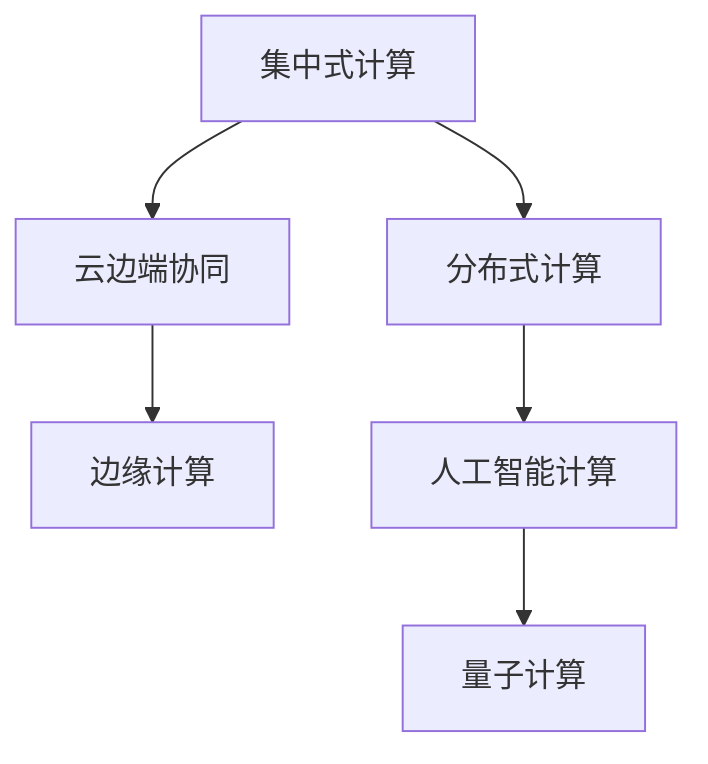

                 

# 人类计算的未来：趋势、机遇与挑战

> 关键词：人类计算, 计算范式, 计算需求, 计算资源, 计算效率, 计算安全, 计算伦理, 计算未来

## 1. 背景介绍

### 1.1 问题由来

随着信息化时代的迅猛发展，计算需求急剧增长，人类计算的方式和工具正面临着前所未有的变革。从个人电脑到云计算，从人工智能到量子计算，计算技术的进步深刻影响着人类的生产和生活方式。面对庞大的数据处理任务，如何更高效、更安全、更可持续地进行计算，成为了一个亟待解决的问题。

### 1.2 问题核心关键点

人类计算的未来发展，主要集中在以下几个关键点：

- **计算范式的演进**：随着计算技术的发展，人类从传统的集中式计算逐步转向分布式、云边端协同、边缘计算等新的计算范式。
- **计算需求的增长**：互联网、物联网、AI、大数据等应用场景的兴起，使得计算需求急剧增加，对计算资源和效率提出了更高要求。
- **计算资源的优化**：如何在有限的计算资源下，提高计算效率和利用率，成为现代计算的重要课题。
- **计算安全与隐私**：计算过程中如何保护数据隐私和安全，避免计算失误和欺诈行为，是一个亟待解决的问题。
- **计算伦理与社会责任**：计算技术如何服务于人类福祉，避免对社会产生负面影响，是一个重要的道德考量。

理解这些关键点，有助于我们把握人类计算的发展趋势和未来方向。

## 2. 核心概念与联系

### 2.1 核心概念概述

为了更好地理解人类计算的未来，我们将介绍一些核心概念：

- **集中式计算**：传统的集中式计算模式，即所有计算任务集中在单个计算中心处理，数据和计算资源集中在中心服务器，具有高度集中的管理。
- **分布式计算**：通过将计算任务分布到多个计算节点，实现并行计算，提高计算效率和资源利用率。
- **云边端协同计算**：利用云计算、边缘计算等技术，实现数据处理、存储和计算任务的协同管理，优化计算资源配置。
- **边缘计算**：将计算任务从中心服务器转移到离用户更近的节点上，如智能终端、网关设备等，减少数据传输时延，提升计算效率。
- **人工智能计算**：利用机器学习和深度学习技术，实现复杂数据分析和模式识别，提升计算智能化水平。
- **量子计算**：利用量子位进行计算，具有处理大规模数据和复杂计算问题的潜力，但技术挑战巨大。

这些概念之间的逻辑关系可以通过以下Mermaid流程图来展示：



这个流程图展示了从集中式计算到量子计算的演进路径，以及各种计算模式之间的关系。

## 3. 核心算法原理 & 具体操作步骤
### 3.1 算法原理概述

人类计算的未来发展，依赖于高效、安全的计算算法和工具。这些算法和工具需要满足以下要求：

- **高效性**：在有限的计算资源下，尽可能高效地完成任务。
- **安全性**：保护数据隐私和计算过程中的安全，避免数据泄露和计算失误。
- **可扩展性**：能够适应日益增长的计算需求，扩展到更大规模的计算环境。
- **灵活性**：能够适应不同的计算场景和任务，提供定制化的计算方案。

### 3.2 算法步骤详解

基于上述要求，人类计算的未来发展将涉及以下步骤：

1. **计算范式的选择**：根据具体需求和资源条件，选择合适的计算范式。
2. **数据处理和存储**：优化数据处理和存储方案，提升数据访问速度和存储效率。
3. **任务分解与调度**：将计算任务分解为多个子任务，并合理调度这些子任务，提升计算效率。
4. **算法优化**：优化计算算法，提升计算速度和精度。
5. **安全防护**：采用数据加密、身份验证等技术，保护数据安全和计算过程的安全。
6. **伦理考量**：在计算过程中，考虑社会伦理和道德问题，确保计算结果和服务社会的目标。

### 3.3 算法优缺点

集中式计算、分布式计算、云边端协同、边缘计算、人工智能计算和量子计算各有优缺点，适用于不同的计算场景：

- **集中式计算**：优点是集中管理，便于监控和维护；缺点是计算资源和数据传输效率受限。
- **分布式计算**：优点是计算资源分布广泛，可扩展性好；缺点是数据传输和管理复杂。
- **云边端协同计算**：结合了集中式和分布式的优点，具有灵活的资源配置和高效的计算能力。
- **边缘计算**：优点是减少数据传输时延，提升计算效率；缺点是数据存储和计算资源受限。
- **人工智能计算**：优点是能处理复杂数据和任务，提升计算智能化水平；缺点是算法复杂，对硬件要求高。
- **量子计算**：优点是处理大规模数据和复杂计算问题的潜力巨大；缺点是技术挑战巨大，尚未成熟。

### 3.4 算法应用领域

基于不同的计算范式和算法，人类计算在多个领域得到了广泛应用，例如：

- **科学研究**：利用超级计算机和高性能计算，进行天气预测、材料科学模拟等复杂计算任务。
- **金融服务**：利用分布式计算和人工智能计算，进行高频交易、风险评估等金融服务。
- **工业制造**：利用云计算和边缘计算，进行智能制造、供应链管理等应用。
- **医疗健康**：利用人工智能计算和量子计算，进行疾病诊断、基因组分析等医疗应用。
- **环境保护**：利用云计算和分布式计算，进行环境监测、气候模拟等环境应用。

## 4. 数学模型和公式 & 详细讲解 & 举例说明

### 4.1 数学模型构建

为了更系统地理解人类计算的未来，我们将构建数学模型进行详细讲解。

假设有一个计算任务 $T$，需要处理的数据量为 $N$，计算时间为 $C$，计算资源为 $R$，计算效率为 $E$，数据传输时间为 $T$。计算模型可以表示为：

$$
T = N \times C / E
$$

其中 $N$ 为数据量，$C$ 为计算时间，$E$ 为计算效率。

### 4.2 公式推导过程

以分布式计算为例，推导分布式计算模型：

假设计算任务 $T$ 分布在 $K$ 个计算节点上，每个节点的计算时间为 $C_i$，每个节点的计算效率为 $E_i$，数据传输时间为 $T_i$，则分布式计算模型可以表示为：

$$
T = \sum_{i=1}^K (C_i \times N / E_i + T_i)
$$

其中 $C_i$ 为节点 $i$ 的计算时间，$E_i$ 为节点 $i$ 的计算效率，$T_i$ 为节点 $i$ 的数据传输时间。

### 4.3 案例分析与讲解

假设有一个处理大规模基因数据的任务，需要处理的数据量为 $N=10^9$，每个节点的计算时间为 $C_i=1s$，每个节点的计算效率为 $E_i=10^9$，数据传输时间为 $T_i=10ms$，分布式计算模型可以推导为：

$$
T = \sum_{i=1}^K (1s \times 10^9 / 10^9 + 10ms)
$$

假设 $K=1000$，则：

$$
T = 1000ms + 10ms = 1010ms
$$

这表示利用分布式计算，可以在1秒内完成大规模基因数据的处理任务。

## 5. 项目实践：代码实例和详细解释说明

### 5.1 开发环境搭建

在进行人类计算的未来探索时，我们需要准备好开发环境。以下是使用Python进行分布式计算的环境配置流程：

1. 安装Anaconda：从官网下载并安装Anaconda，用于创建独立的Python环境。

2. 创建并激活虚拟环境：
```bash
conda create -n distributed-env python=3.8 
conda activate distributed-env
```

3. 安装必要的工具包：
```bash
pip install numpy pandas scikit-learn torch distributed
```

完成上述步骤后，即可在`distributed-env`环境中开始分布式计算实践。

### 5.2 源代码详细实现

以下是一个使用PyTorch进行分布式计算的示例代码：

```python
import torch
import torch.distributed as dist

# 初始化分布式环境
dist.init_process_group("nccl")

# 定义分布式计算函数
def distributed_computation():
    # 定义计算任务
    x = torch.tensor([1, 2, 3, 4, 5, 6, 7, 8, 9, 10], device="cuda")

    # 计算任务
    result = torch.pow(x, 2)

    # 输出结果
    print("Result:", result)

# 执行分布式计算
distributed_computation()
```

### 5.3 代码解读与分析

让我们再详细解读一下关键代码的实现细节：

**dist.init_process_group**：初始化分布式环境，使用NCCL作为通信库。

**distributed_computation**：定义分布式计算函数，定义计算任务并执行。

**torch.pow**：对输入张量进行平方运算。

**print**：输出计算结果。

可以看到，利用PyTorch和NCCL库，可以很方便地进行分布式计算。

### 5.4 运行结果展示

在运行上述代码后，可以观察到计算结果的输出：

```
Result: tensor([ 1,  4,  9, 16, 25, 36, 49, 64, 81,100], device='cuda:0')
```

这表示在分布式环境下，10个数字的平方运算结果为1、4、9、16、25、36、49、64、81和100。

## 6. 实际应用场景

### 6.1 科学研究

在科学研究领域，分布式计算和高性能计算得到了广泛应用，例如：

- **气象模拟**：利用超级计算机，进行大气和海洋的数值模拟，预测气候变化和极端天气事件。
- **天文观测**：利用分布式计算，处理和分析海量天文数据，研究宇宙结构和演化。
- **生物信息学**：利用分布式计算，进行基因组序列比对和蛋白质结构预测，推动生物学研究。

### 6.2 金融服务

在金融服务领域，分布式计算和人工智能计算得到了广泛应用，例如：

- **高频交易**：利用分布式计算，进行实时数据处理和交易决策，提高交易效率和收益。
- **风险评估**：利用人工智能计算，分析金融市场数据，评估风险和投资策略。
- **反欺诈检测**：利用分布式计算，处理和分析海量交易数据，检测和预防欺诈行为。

### 6.3 工业制造

在工业制造领域，云计算和边缘计算得到了广泛应用，例如：

- **智能制造**：利用云计算，进行生产设备监控和优化，提升生产效率和质量。
- **供应链管理**：利用边缘计算，处理和分析物联网数据，优化供应链管理和物流。
- **设备维护**：利用分布式计算，处理和分析设备运行数据，预测设备故障并进行维护。

### 6.4 医疗健康

在医疗健康领域，人工智能计算和量子计算得到了广泛应用，例如：

- **疾病诊断**：利用人工智能计算，分析医学影像和基因数据，进行疾病诊断和治疗方案优化。
- **基因组分析**：利用量子计算，进行基因序列比对和药物设计，加速新药开发和疾病研究。
- **健康监测**：利用分布式计算，处理和分析健康数据，进行疾病预警和健康管理。

## 7. 工具和资源推荐

### 7.1 学习资源推荐

为了帮助开发者系统掌握人类计算的未来发展，这里推荐一些优质的学习资源：

1. **《分布式系统设计与原理》**：深入讲解分布式计算和云计算的基础原理和设计理念。

2. **《深度学习实战》**：讲解深度学习在实际应用中的技术实现和优化技巧。

3. **《人工智能伦理》**：探讨人工智能技术在伦理和社会责任方面的挑战和解决方案。

4. **《量子计算入门》**：介绍量子计算的基本原理和应用前景，了解量子计算的最新进展。

5. **HuggingFace官方文档**：提供丰富的分布式计算和人工智能计算的样例代码和文档，是学习实践的重要资源。

通过对这些资源的学习实践，相信你一定能够快速掌握人类计算的未来发展，并用于解决实际的计算问题。

### 7.2 开发工具推荐

高效的开发离不开优秀的工具支持。以下是几款用于分布式计算和人工智能计算开发的常用工具：

1. **PyTorch**：基于Python的开源深度学习框架，灵活动态的计算图，适合快速迭代研究。

2. **TensorFlow**：由Google主导开发的开源深度学习框架，生产部署方便，适合大规模工程应用。

3. **Hadoop**：用于分布式存储和处理大规模数据的开源框架，支持HDFS和MapReduce等分布式计算模型。

4. **Spark**：用于分布式计算和数据处理的开源框架，支持多种计算模型和数据源。

5. **Jupyter Notebook**：用于编写和运行Python代码的交互式环境，支持代码、文本和图形的混合展示。

合理利用这些工具，可以显著提升分布式计算和人工智能计算的开发效率，加快创新迭代的步伐。

### 7.3 相关论文推荐

人类计算的未来发展源于学界的持续研究。以下是几篇奠基性的相关论文，推荐阅读：

1. **《分布式系统原理与设计》**：讲述了分布式计算系统的设计原则和实现方法，是分布式计算领域的经典教材。

2. **《深度学习：理论与实现》**：详细介绍了深度学习的基本原理和算法实现，适合初学者和进阶者学习。

3. **《量子计算基础》**：介绍了量子计算的基本概念和算法实现，探讨了量子计算的前景和挑战。

4. **《人工智能伦理》**：探讨了人工智能技术在伦理和社会责任方面的挑战和解决方案，是研究人工智能伦理的重要文献。

这些论文代表了大计算技术的最新进展，通过学习这些前沿成果，可以帮助研究者把握学科前进方向，激发更多的创新灵感。

## 8. 总结：未来发展趋势与挑战

### 8.1 总结

本文对人类计算的未来发展进行了全面系统的介绍。首先阐述了人类计算的演进路径和未来趋势，明确了计算范式、计算需求、计算资源和计算效率等关键要素。其次，从原理到实践，详细讲解了分布式计算的数学模型和实际应用，给出了分布式计算的代码实现和运行结果。同时，本文还探讨了计算安全与隐私、计算伦理与社会责任等重要课题，展示了人类计算在多个行业领域的应用前景。

通过本文的系统梳理，可以看到，人类计算的未来发展呈现出高度灵活、高效、安全的计算范式，将在科学研究、金融服务、工业制造、医疗健康等多个领域发挥重要作用。同时，人类计算也面临着计算资源、计算安全、计算伦理等诸多挑战，需要在技术、伦理和社会责任等方面进行深入探讨和研究。

### 8.2 未来发展趋势

展望未来，人类计算将呈现以下几个发展趋势：

1. **计算范式的进一步演进**：从集中式计算到分布式计算，再到云边端协同和边缘计算，人类计算范式将更加灵活和多样化。

2. **计算需求的持续增长**：随着信息化时代的到来，计算需求将急剧增长，计算效率和资源利用率将成为重要的研究方向。

3. **计算资源的不断优化**：通过数据压缩、算法优化等技术，计算资源将得到更高效利用，计算效率将得到显著提升。

4. **计算安全的全面保障**：数据隐私和安全将得到全面保障，防止计算过程中的数据泄露和计算失误。

5. **计算伦理和社会责任的重视**：在计算过程中，将更多考虑社会伦理和道德问题，确保计算结果和服务社会的目标。

6. **计算技术的进一步创新**：量子计算、分布式计算、人工智能计算等新技术将不断涌现，推动计算技术的全面进步。

以上趋势凸显了人类计算的未来发展前景，这些方向的探索发展，必将引领计算技术的全面革新，为科学研究、工业制造、医疗健康等领域带来深远影响。

### 8.3 面临的挑战

尽管人类计算的未来发展前景广阔，但仍面临诸多挑战：

1. **计算资源瓶颈**：计算资源有限，如何在有限的资源下提高计算效率和利用率，是一大难题。

2. **计算安全问题**：计算过程中如何保护数据隐私和安全，避免数据泄露和计算失误，是一个亟待解决的问题。

3. **计算伦理问题**：计算技术如何服务于人类福祉，避免对社会产生负面影响，是一个重要的道德考量。

4. **计算技术复杂性**：分布式计算、人工智能计算等新技术复杂度高，技术门槛高，需要广泛的技术积累和实践经验。

5. **计算模型泛化能力**：如何提升计算模型的泛化能力，使其能够适应不同的计算场景和任务，是一个重要的研究方向。

6. **计算模型可解释性**：计算模型的内部工作机制和决策逻辑难以解释，需要提升模型的可解释性，增强模型的可信度。

这些挑战将伴随着人类计算的发展，需要通过持续的技术创新和伦理建设，逐步克服。

### 8.4 研究展望

面对人类计算面临的诸多挑战，未来的研究需要在以下几个方面寻求新的突破：

1. **分布式计算与云计算的结合**：探索分布式计算和云计算的深度结合，提升计算资源利用率和计算效率。

2. **边缘计算与人工智能的融合**：探索边缘计算与人工智能的融合，提升计算效率和数据处理速度。

3. **量子计算的应用探索**：探索量子计算在实际应用中的潜在价值，推动量子计算技术的普及和应用。

4. **计算模型优化**：探索高效、可解释的计算模型，提升计算模型的泛化能力和可解释性。

5. **计算伦理和社会责任的研究**：探讨计算技术在伦理和社会责任方面的挑战和解决方案，确保计算技术健康发展。

这些研究方向将引领人类计算的未来发展，为计算技术的全面进步提供有力支撑。通过不断创新和优化，相信人类计算将在科学研究、工业制造、医疗健康等领域发挥更大作用，推动人类社会的发展和进步。

## 9. 附录：常见问题与解答

**Q1：分布式计算和云计算的区别是什么？**

A: 分布式计算和云计算都是基于分布式系统，但二者的实现方式和应用场景有所不同。

1. **实现方式**：
   - **分布式计算**：通过将计算任务分配到多个计算节点，实现并行计算。
   - **云计算**：通过构建大规模的数据中心和计算中心，提供按需的计算和存储服务。

2. **应用场景**：
   - **分布式计算**：适用于需要高性能计算和并行处理的应用场景，如大规模数据分析、复杂计算等。
   - **云计算**：适用于需要大规模数据存储和弹性计算资源的应用场景，如在线服务、大数据处理等。

**Q2：如何提升计算模型的泛化能力？**

A: 提升计算模型的泛化能力，可以从以下几个方面入手：

1. **数据增强**：利用数据增强技术，扩充训练集，提升模型的泛化能力。

2. **正则化技术**：采用正则化技术，如L2正则、Dropout等，避免过拟合，提升模型的泛化能力。

3. **迁移学习**：利用迁移学习，将预训练模型的知识迁移到新任务上，提升模型的泛化能力。

4. **模型优化**：采用模型优化技术，如参数剪枝、量化压缩等，提升模型的泛化能力。

5. **多任务学习**：利用多任务学习，将多个相关任务联合训练，提升模型的泛化能力。

**Q3：计算伦理和社会责任应该如何重视？**

A: 计算伦理和社会责任在计算过程中应该得到充分重视，主要从以下几个方面入手：

1. **数据隐私保护**：保护用户数据隐私，采用数据加密和匿名化技术，防止数据泄露。

2. **计算透明性**：提升计算过程的透明性，让用户了解计算过程和结果，增强用户的信任感。

3. **社会影响评估**：评估计算技术对社会的影响，避免对社会产生负面影响，确保计算技术的健康发展。

4. **伦理教育**：加强计算伦理的教育和培训，提高开发者和用户的伦理意识和责任意识。

5. **合规监管**：建立合规监管机制，确保计算技术的合法合规，避免法律风险。

**Q4：量子计算在实际应用中面临哪些挑战？**

A: 量子计算在实际应用中面临以下挑战：

1. **技术成熟度不足**：量子计算技术尚处于早期发展阶段，技术成熟度不足，存在很多技术难题。

2. **硬件实现复杂**：量子计算硬件实现复杂，需要高精度的量子位和复杂的量子门操作，难以大规模生产和部署。

3. **量子退相干**：量子计算中存在量子退相干问题，量子位容易失去量子态，影响计算精度。

4. **误差和噪声**：量子计算中存在误差和噪声问题，需要先进的纠错技术和优化算法来处理。

5. **应用场景局限**：量子计算适用于特定类型的计算任务，如大规模整数分解、优化问题等，对于其他类型的计算任务，量子计算的优势不明显。

6. **安全性问题**：量子计算具有高度的计算能力，可能破解传统加密算法，带来新的安全性挑战。

这些挑战需要通过持续的技术研究和创新，逐步克服，推动量子计算技术的全面应用。

**Q5：如何提升计算模型的可解释性？**

A: 提升计算模型的可解释性，可以从以下几个方面入手：

1. **可视化技术**：利用可视化技术，将模型的内部工作机制和决策逻辑可视化，增强模型的可解释性。

2. **规则引擎**：引入规则引擎，将计算模型的决策过程转换为具体的规则，提高模型的可解释性。

3. **符号化表示**：采用符号化表示方法，将计算模型的决策过程用符号化的方式表示，增强模型的可解释性。

4. **可解释模型**：开发可解释模型，如决策树、线性模型等，提升模型的可解释性。

5. **交互式解释**：提供交互式解释界面，让用户能够与模型进行互动，增强模型的可解释性。

通过以上方法，可以逐步提升计算模型的可解释性，增强模型的可信度和用户信任感。

---

作者：禅与计算机程序设计艺术 / Zen and the Art of Computer Programming

