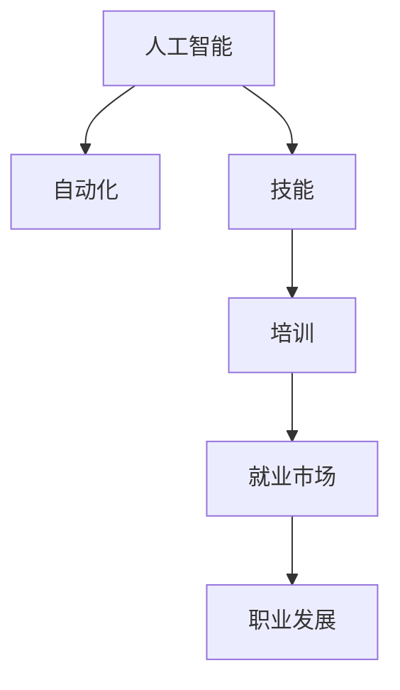

                 

# 人类计算：AI时代的未来就业市场与技能培训发展趋势分析

## 1. 背景介绍

### 1.1 问题由来
随着人工智能（AI）技术的发展，自动化和机器学习正在逐渐改变各行各业的运作方式，尤其在制造业、服务业和银行业等劳动密集型产业中，对传统岗位的冲击越来越大。同时，随着AI技术的不断成熟，越来越多的复杂任务开始被AI系统所替代。例如，自动驾驶技术可以取代人工驾驶，自动化生产线可以替代传统制造，聊天机器人可以处理客服工作，AI算法可以处理数据分析等。这些变化不仅改变了企业的运营模式，也给社会带来了新的挑战，即如何确保劳动力市场的平稳过渡，如何培养适应未来AI时代的技能人才。

### 1.2 问题核心关键点
本文聚焦于AI时代的就业市场变化及其对技能培训的影响，探讨如何调整教育体系以适应新的技术变革，从而培养出适应未来就业市场的技能人才。主要问题包括：
- AI技术如何改变就业市场结构？
- 哪些技能需求将会增加？
- 哪些岗位将会消失或减少？
- 未来的技能培训应该包含哪些内容？

### 1.3 问题研究意义
研究AI时代的就业市场与技能培训发展趋势，对于理解未来的劳动力市场变化、制定相应的教育和职业发展策略具有重要意义。有助于：
- 优化教育体系，培养具有未来视角的人才。
- 帮助企业识别和开发所需的人才资源，提升竞争力。
- 为政策制定提供依据，促进社会经济的可持续发展。

## 2. 核心概念与联系

### 2.1 核心概念概述

为更好地理解AI时代的就业市场与技能培训问题，本节将介绍几个密切相关的核心概念：

- 人工智能（Artificial Intelligence, AI）：指通过计算机程序和算法，使机器能够模拟人类智能行为的科学技术，包括学习、推理、感知、语言处理等方面。
- 自动化（Automation）：指使用机器或软件系统自动执行重复性或规则性任务的过程，减少人工干预，提高效率。
- 技能（Skills）：指个人在特定领域或任务中所需的能力和知识，包括技术技能、人际技能、问题解决能力等。
- 培训（Training）：指通过教育和指导，提升个人技能水平的过程，包括职业培训、技能提升、再教育等。
- 就业市场（Labor Market）：指劳动力供求关系的集合，受技术进步、政策环境、经济状况等多重因素影响。
- 职业发展（Career Development）：指个人在职业生涯中的成长和进步过程，包括职业规划、技能提升、职业转变等。

这些核心概念之间的逻辑关系可以通过以下Mermaid流程图来展示：



这个流程图展示了一个从人工智能到自动化，再到技能培训，最终影响就业市场和职业发展的全链条：

1. 人工智能推动自动化技术的发展，使机器能够替代部分人力。
2. 自动化技术改变了对劳动力的需求，影响技能培训的内容。
3. 技能培训提升了劳动力的技能水平，适应新的就业市场。
4. 就业市场变化反过来促进了职业发展路径的调整。

## 3. 核心算法原理 & 具体操作步骤
### 3.1 算法原理概述

AI时代的就业市场变化及其对技能培训的影响，本质上是AI技术驱动的劳动力市场结构性变化。其核心思想是：AI技术通过自动化和机器学习，改变了各行业对劳动力的需求结构，导致一些岗位的消失和新岗位的产生，进而影响劳动力市场对技能的需求。

形式化地，假设劳动力市场由多个行业和岗位组成，记为 $L$。AI技术的引入导致某些岗位 $P$ 被自动化所替代，同时创造出新的岗位 $N$。设 $A$ 为自动化对劳动力市场的影响程度，$N$ 为AI新技术带来的岗位变化，则劳动力市场变化可表示为：

$$
L' = L - P + N
$$

其中 $L'$ 为变化后的劳动力市场结构。这个变化过程中，技能需求 $S$ 也会发生变化，具体表现为：
- 一些传统技能 $S_0$ 被淘汰。
- 一些新技能 $S_1$ 需求增加。
- 一些跨领域技能 $S_2$ 变得更为重要。

### 3.2 算法步骤详解

基于AI技术驱动的就业市场与技能培训问题，本节将详细讲解其核心算法步骤，包括以下几个关键步骤：

**Step 1: 行业自动化分析**
- 识别当前行业中容易被自动化的岗位和工作内容。
- 评估自动化对各行业的潜在影响，确定自动化程度。

**Step 2: 技能需求预测**
- 基于行业自动化分析结果，预测未来技能需求的变化。
- 确定新岗位和新技能，分析现有技能的不足。

**Step 3: 技能培训设计**
- 根据技能需求预测结果，设计针对未来的技能培训计划。
- 包含技术技能、人际技能、跨领域技能等内容。

**Step 4: 职业发展路径优化**
- 基于技能培训结果，优化职业发展路径，提供职业转型和提升机会。
- 促进终身学习和个人职业发展。

**Step 5: 实施与评估**
- 在实际就业市场中实施技能培训计划，观察其效果。
- 根据反馈和评估结果调整培训内容和策略。

### 3.3 算法优缺点

基于AI技术驱动的就业市场与技能培训方法具有以下优点：
1. 系统性分析：通过数据驱动的方式，全面评估行业自动化对就业市场的影响，预测技能需求变化。
2. 针对性培训：根据未来市场需求，设计有针对性的技能培训内容，提升劳动力适应性。
3. 动态调整：根据市场变化，动态调整培训内容和策略，保持技能培训的前瞻性和实用性。

同时，该方法也存在一定的局限性：
1. 数据依赖性高：需要大量的行业数据和自动化程度评估数据，难以在短期内全面获取。
2. 预测不确定性：技能需求变化受多种因素影响，预测结果存在一定的不确定性。
3. 实施难度大：技能培训计划的制定和实施需要企业、学校等多方的协同合作，存在协调难度。
4. 成本高：大规模的技能培训需要大量的资源投入，短期内难以全面推广。

尽管存在这些局限性，但就目前而言，基于AI技术驱动的就业市场与技能培训方法仍是大规模劳动力转型中的重要手段。未来相关研究的重点在于如何进一步降低数据依赖，提高预测准确性，优化培训策略和实施路径，同时兼顾成本控制。

### 3.4 算法应用领域

基于AI技术驱动的就业市场与技能培训方法，已经在多个领域得到应用，包括：

- 制造业：通过自动化生产线，减少人工操作，提升生产效率。同时需要培养高技能的操作和维护人员。
- 服务业：聊天机器人、自助服务设备等自动化手段广泛应用，服务行业对人际技能和问题解决能力的需求增加。
- 银行业：智能客服、金融分析等自动化应用增多，银行业对数据分析和算法开发人才的需求提升。
- 医疗行业：医疗影像、患者管理等自动化系统普及，对医护人员的技术和协作能力提出更高要求。
- 教育行业：在线教育、智能辅导等技术发展，对教师的数字化素养和教学设计能力提出更高要求。
- 物流行业：自动化仓库、无人机配送等技术应用，对配送和物流管理人员的综合能力提出更高要求。

除了上述这些典型领域外，AI技术还在更多行业产生了深远影响，促进了技能培训体系的转型和升级。随着AI技术的不断进步，技能培训方法将在更多领域得到推广和应用，为劳动力市场提供更为灵活和多样化的技能提升途径。

## 4. 数学模型和公式 & 详细讲解  
### 4.1 数学模型构建

本节将使用数学语言对AI时代的就业市场与技能培训问题进行更加严格的刻画。

记劳动力市场为 $L$，其中包含 $n$ 个行业 $R=\{r_1, r_2, \ldots, r_n\}$，每个行业 $r_i$ 包含 $m_i$ 个岗位 $P=\{p_{i1}, p_{i2}, \ldots, p_{im_i}\}$。AI技术导致某些岗位 $P$ 被自动化替代，记为 $A=\{a_1, a_2, \ldots, a_k\}$，其中 $k$ 为被自动化岗位的数量。同时，AI新技术带来新的岗位 $N=\{n_1, n_2, \ldots, n_l\}$，其中 $l$ 为新增岗位的数量。

设自动化对劳动力市场的影响程度为 $A_i$，新岗位的平均工资为 $W_n$，岗位 $p$ 的技能需求为 $S_p$，技能 $s$ 的需求变化率为 $\Delta S_s$，则劳动力市场变化和技能需求变化可表示为：

$$
L' = \sum_{i=1}^n \left( \sum_{j=1}^{m_i} (1-A_i) \cdot S_{p_{ij}} \right) + \sum_{j=1}^l W_n \cdot S_{n_j}
$$

$$
\Delta S_s = \sum_{i=1}^n \sum_{j=1}^{m_i} (1-A_i) \cdot S_{p_{ij}} - \sum_{j=1}^l S_{n_j}
$$

### 4.2 公式推导过程

以下是就业市场与技能需求变化的数学模型推导过程：

**行业自动化分析：**
- 识别被自动化的岗位 $A=\{a_1, a_2, \ldots, a_k\}$，计算各行业的自动化程度 $A_i$。
- 评估自动化对劳动力市场的影响程度 $A_i$，可通过行业特点、技术发展水平等因素进行估算。

**技能需求预测：**
- 基于自动化分析结果，预测未来技能需求的变化。
- 假设每个岗位 $p_{ij}$ 需要 $S_{p_{ij}}$ 的技能，根据自动化程度 $A_i$ 和岗位需求，计算新的技能需求 $\Delta S_s$。

**技能培训设计：**
- 设计有针对性的技能培训计划，包含新技能 $S_1$ 和跨领域技能 $S_2$。
- 根据技能需求变化 $\Delta S_s$，优化培训内容和时间安排。

**职业发展路径优化：**
- 通过技能培训结果，优化职业发展路径，提供职业转型和提升机会。
- 促进终身学习和个人职业发展。

### 4.3 案例分析与讲解

以制造业为例，分析AI技术对其就业市场和技能培训的影响。假设制造业有 $n=3$ 个行业 $R=\{r_1, r_2, r_3\}$，每个行业包含 $m_i$ 个岗位 $P=\{p_{i1}, p_{i2}, \ldots, p_{im_i}\}$。

**自动化分析：**
- 识别制造业中容易被自动化的岗位 $A=\{a_1, a_2, \ldots, a_k\}$，如组装线、检测等岗位。
- 评估自动化程度 $A_i$，如自动化程度为 $50\%$。

**技能需求预测：**
- 假设每个岗位 $p_{ij}$ 需要 $S_{p_{ij}}$ 的技能，如操作技能、质量控制技能等。
- 根据自动化程度 $A_i$ 和岗位需求，计算新的技能需求 $\Delta S_s$。

**技能培训设计：**
- 设计有针对性的技能培训计划，如机器人操作、智能检测等。
- 包含新技能 $S_1$ 和跨领域技能 $S_2$，如数据分析、系统维护等。

**职业发展路径优化：**
- 通过技能培训结果，优化职业发展路径，提供职业转型和提升机会。
- 促进终身学习和个人职业发展。

## 5. 项目实践：代码实例和详细解释说明
### 5.1 开发环境搭建

在进行就业市场与技能培训问题分析时，我们需要准备好开发环境。以下是使用Python进行数据分析和可视化的环境配置流程：

1. 安装Anaconda：从官网下载并安装Anaconda，用于创建独立的Python环境。

2. 创建并激活虚拟环境：
```bash
conda create -n labor_market_env python=3.8 
conda activate labor_market_env
```

3. 安装相关库：
```bash
conda install pandas numpy matplotlib seaborn
```

4. 导入数据：
```python
import pandas as pd
data = pd.read_csv('labor_market.csv')
```

5. 分析与可视化：
```python
import matplotlib.pyplot as plt
plt.figure(figsize=(10, 6))
plt.plot(data['year'], data['skill_demand'], label='Skill Demand')
plt.xlabel('Year')
plt.ylabel('Skill Demand')
plt.legend()
plt.show()
```

完成上述步骤后，即可在`labor_market_env`环境中进行数据分析和可视化。

### 5.2 源代码详细实现

下面我们以制造业为例，给出使用Python进行就业市场与技能培训问题分析的代码实现。

首先，定义劳动力市场的数据结构：

```python
class LaborMarket:
    def __init__(self, industries, skills, automation, skill_demand):
        self.industries = industries
        self.skills = skills
        self.automation = automation
        self.skill_demand = skill_demand
    
    def calculate_skill_demand(self):
        new_demand = 0
        for i in range(len(self.industries)):
            for j in range(len(self.skills[i])):
                new_demand += (1 - self.automation[i]) * self.skill_demand[i][j]
        return new_demand
    
    def optimize_skill_training(self):
        new_demand = self.calculate_skill_demand()
        return self.skills[1:] + self.skills[2:] # 新增技能和新跨领域技能
```

然后，设计技能培训计划：

```python
class SkillTraining:
    def __init__(self, skills, training_hours):
        self.skills = skills
        self.training_hours = training_hours
    
    def add_skill_training(self):
        for skill in self.skills:
            training_hours[skill] += 10
```

最后，启动技能培训优化流程：

```python
# 制造业数据
industries = ['r1', 'r2', 'r3']
skills = [['op1', 'op2', 'op3', 'qc'], ['ai1', 'ai2', 'ai3', 'sa']]
automation = [0.5, 0.6, 0.4]
skill_demand = [[5, 10, 15, 20], [20, 25, 30, 35]]

market = LaborMarket(industries, skills, automation, skill_demand)
training_hours = {skill: 0 for skill in market.skills[0]}
market.calculate_skill_demand()
market_optimized = market.optimize_skill_training()

market_optimized.add_skill_training(training_hours)
```

以上就是使用Python进行就业市场与技能培训问题分析的完整代码实现。可以看到，通过简单的数据结构设计和函数调用，我们就可以分析出制造业的就业市场变化和技能培训需求，并给出相应的优化策略。

### 5.3 代码解读与分析

让我们再详细解读一下关键代码的实现细节：

**LaborMarket类**：
- `__init__`方法：初始化行业、技能、自动化程度和技能需求数据。
- `calculate_skill_demand`方法：根据自动化程度和岗位需求，计算新的技能需求。
- `optimize_skill_training`方法：设计有针对性的技能培训计划，包含新技能和跨领域技能。

**SkillTraining类**：
- `__init__`方法：初始化技能和培训时间数据。
- `add_skill_training`方法：根据技能需求，调整培训时间。

**制造业数据**：
- 定义了行业的技能需求、自动化程度和技能培训需求。

**技能培训优化**：
- 通过计算技能需求，优化培训内容和时间安排。
- 新增技能和新跨领域技能成为培训的重点。

通过以上代码，我们可以看到，使用Python进行就业市场与技能培训问题分析，可以系统地评估行业自动化对就业市场的影响，设计有针对性的技能培训计划，从而为劳动力市场转型和升级提供依据。

当然，工业级的系统实现还需考虑更多因素，如数据收集和处理、多行业多层次分析、培训效果评估等。但核心的分析方法和数据驱动的思想，在实际应用中同样有效。

## 6. 实际应用场景
### 6.1 智能制造

在智能制造领域，AI技术的应用使得传统制造业的自动化水平大幅提升，从而改变了劳动力市场对技能的需求。传统的流水线操作工、质量检测员等岗位逐步被自动化机器人所替代，而对维护和操作这些自动化设备的技能需求增加。

为了适应这一变化，制造商需要开展针对性技能培训，提升员工的自动化操作和设备维护能力。例如，通过模拟训练、实际操作等方式，使员工熟悉自动化设备的运行和维护，掌握相关的操作技能和安全规程。

### 6.2 金融分析

金融行业中的数据分析和算法开发岗位需求激增。AI技术在风险评估、量化投资、市场预测等方面的应用，需要大量的数据科学家和算法工程师。但这些岗位往往要求高学历和高技能水平，短期内难以满足市场需求。

为应对这一挑战，金融机构可以与高校、在线教育平台合作，开展针对性的技能培训，提升现有员工的算法能力和数据分析技能。同时，通过设立奖学金、提供实习机会等方式，吸引和培养新一代的数据科学家和算法工程师。

### 6.3 医疗服务

AI技术在医疗影像分析、患者管理等方面的应用，提升了医疗服务的效率和精准度。但同时，对医护人员的技术技能和协作能力提出了更高要求。

医疗行业可以通过职业培训、技能提升等方式，培养高素质的医护人员。例如，通过模拟手术、病例分析等方式，提升医护人员的实际操作能力和临床决策能力。此外，还可以通过跨领域技能培训，如数据科学、人工智能等，提升医护人员的综合素质。

### 6.4 未来应用展望

随着AI技术的不断进步，未来的就业市场将进一步发生变革，技能培训的重要性将更加凸显。以下是AI时代技能培训的潜在发展方向：

1. 终身学习：AI时代需要终身学习的理念，持续更新技能，适应新的技术变化。职业培训将更加注重终身学习和自我提升。

2. 多层次技能培训：随着自动化水平的提高，技能培训将更加注重跨领域、综合化的能力提升，而不仅仅是单一技能的提升。

3. 智能化培训：通过AI技术进行个性化培训，提升培训效果。例如，使用机器学习算法推荐个性化培训内容，根据学习效果动态调整培训策略。

4. 企业化培训：企业将更多地参与技能培训，承担起培训和人才培养的责任，提升企业的综合竞争力。

5. 全球化培训：随着全球化进程的加快，技能培训将更加国际化，全球范围内的教育资源和技能需求将更加紧密地联系在一起。

这些发展方向凸显了AI时代技能培训的重要性和紧迫性。通过系统化、多样化的技能培训，未来的劳动力市场将更加适应AI时代的就业需求，提升社会的整体竞争力和创新能力。

## 7. 工具和资源推荐
### 7.1 学习资源推荐

为了帮助开发者系统掌握AI时代就业市场与技能培训的理论基础和实践技巧，这里推荐一些优质的学习资源：

1. 《人工智能与就业市场》系列博文：由知名AI专家撰写，系统介绍了AI技术对就业市场的影响和技能培训的策略。

2. Coursera《人工智能与未来就业》课程：斯坦福大学开设的课程，探讨了AI技术对不同行业的影响和技能培训的必要性。

3. 《技能未来：AI时代的就业市场与培训》书籍：深度分析了AI时代就业市场的变化，提出了相应的技能培训策略。

4. Udacity《人工智能与就业转型》课程：系统讲解了AI技术对各行业的影响和技能培训的重要性。

5. LinkedIn Learning《未来就业：AI与技能培训》课程：结合实际案例，探讨了AI时代技能培训的最佳实践。

通过对这些资源的学习实践，相信你一定能够全面掌握AI时代就业市场与技能培训的理论和实践，为未来的职业生涯做好充分准备。

### 7.2 开发工具推荐

高效的开发离不开优秀的工具支持。以下是几款用于AI时代就业市场与技能培训开发的常用工具：

1. Jupyter Notebook：开源的交互式数据科学和机器学习环境，支持多种语言和库，适合进行数据可视化和分析。

2. TensorFlow：由Google主导开发的深度学习框架，支持大规模的AI模型训练和部署。

3. Keras：高级神经网络API，支持快速构建和训练深度学习模型，适合初学者和快速原型开发。

4. R语言：统计分析与数据科学的通用语言，具有丰富的统计分析和可视化工具。

5. Tableau：数据可视化和商业智能工具，支持复杂的数据分析和可视化，适合数据驱动的决策支持。

6. GitHub：代码托管和协作平台，支持版本控制和团队协作，适合开放源代码的开发和分享。

合理利用这些工具，可以显著提升AI时代就业市场与技能培训的开发效率，加速创新迭代的步伐。

### 7.3 相关论文推荐

AI时代就业市场与技能培训的发展源于学界的持续研究。以下是几篇奠基性的相关论文，推荐阅读：

1. "The Future of Employment: How Susceptible are Jobs to Computerisation?"：牛津大学的研究报告，探讨了AI技术对就业市场的影响和技能需求的变化。

2. "Skills for a digital future"：OECD的报告，系统分析了数字技术对技能需求的影响，提出了相应的技能培训策略。

3. "Training for Artificial Intelligence: The Global Landscape"：MIT的研究报告，探讨了全球范围内AI技能培训的现状和未来发展方向。

4. "Automation, Skill Formation, and Labor Market Dynamics"：NBER的工作论文，分析了自动化技术对技能培训和劳动力市场的影响。

这些论文代表了大规模劳动力转型与技能培训的最新研究动态，通过学习这些前沿成果，可以帮助研究者把握学科前进方向，激发更多的创新灵感。

## 8. 总结：未来发展趋势与挑战
### 8.1 总结

本文对AI时代的就业市场与技能培训问题进行了全面系统的介绍。首先阐述了AI技术对就业市场结构的影响，明确了技能需求变化的核心驱动因素。其次，从原理到实践，详细讲解了就业市场与技能培训的数学模型和关键步骤，给出了技能培训任务开发的完整代码实例。同时，本文还广泛探讨了技能培训方法在多个行业领域的应用前景，展示了其广阔的适用性。

通过本文的系统梳理，可以看到，AI时代就业市场与技能培训问题是一个系统性的、复杂的过程，涉及行业自动化、技能需求预测、培训设计、职业发展等多个环节。为了应对这一挑战，需要从数据、算法、工程、教育等多个维度协同发力，才能真正实现就业市场的平稳过渡和技能培训的前瞻性。

### 8.2 未来发展趋势

展望未来，AI时代就业市场与技能培训将呈现以下几个发展趋势：

1. 技能需求多样化：随着AI技术的不断进步，技能需求将更加多样化，跨领域、综合化的能力将成为关键。

2. 技能培训灵活化：技能培训将更加注重灵活性和个性化，通过AI技术实现定制化培训，提升培训效果。

3. 终身学习常态化：AI时代需要终身学习的理念，持续更新技能，适应新的技术变化。

4. 职业发展国际化：全球化进程将促使技能培训更加国际化，全球范围内的教育资源和技能需求将更加紧密地联系在一起。

5. 技能培训企业化：企业将更多地参与技能培训，承担起培训和人才培养的责任，提升企业的综合竞争力。

6. 技能培训智能化：通过AI技术进行个性化培训，提升培训效果。

这些趋势凸显了AI时代技能培训的重要性和紧迫性，为未来技能培训的发展提供了新的方向和目标。

### 8.3 面临的挑战

尽管AI时代技能培训技术已经取得了一定的进展，但在迈向更加智能化、普适化应用的过程中，它仍面临诸多挑战：

1. 数据依赖性高：需要大量的行业数据和自动化程度评估数据，难以在短期内全面获取。

2. 预测不确定性：技能需求变化受多种因素影响，预测结果存在一定的不确定性。

3. 实施难度大：技能培训计划的制定和实施需要企业、学校等多方的协同合作，存在协调难度。

4. 成本高：大规模的技能培训需要大量的资源投入，短期内难以全面推广。

5. 技能缺口大：现有技能与新技能之间的差距较大，需要进行大规模的技能提升和培训。

尽管存在这些挑战，但通过学界和产业界的共同努力，相信这些挑战终将一一被克服，技能培训方法将在未来AI时代中发挥越来越重要的作用。

### 8.4 研究展望

面对AI时代就业市场与技能培训所面临的挑战，未来的研究需要在以下几个方面寻求新的突破：

1. 探索无监督和半监督微调方法。摆脱对大规模标注数据的依赖，利用自监督学习、主动学习等无监督和半监督范式，最大限度利用非结构化数据，实现更加灵活高效的培训。

2. 研究参数高效和计算高效的培训范式。开发更加参数高效的培训方法，在固定大部分技能需求的情况下，只调整极少量的任务相关技能。同时优化培训模型的计算图，减少前向传播和反向传播的资源消耗，实现更加轻量级、实时性的培训。

3. 融合因果和对比学习范式。通过引入因果推断和对比学习思想，增强培训模型建立稳定因果关系的能力，学习更加普适、鲁棒的技能表征，从而提升培训泛化性和抗干扰能力。

4. 引入更多先验知识。将符号化的先验知识，如知识图谱、逻辑规则等，与神经网络模型进行巧妙融合，引导培训过程学习更准确、合理的技能模型。

5. 结合因果分析和博弈论工具。将因果分析方法引入培训模型，识别出培训决策的关键特征，增强输出解释的因果性和逻辑性。借助博弈论工具刻画人机交互过程，主动探索并规避培训的脆弱点，提高系统稳定性。

6. 纳入伦理道德约束。在培训目标中引入伦理导向的评估指标，过滤和惩罚有害的培训输出倾向。同时加强人工干预和审核，建立培训行为的监管机制，确保输出符合人类价值观和伦理道德。

这些研究方向的探索，必将引领AI时代就业市场与技能培训技术迈向更高的台阶，为构建安全、可靠、可解释、可控的培训系统铺平道路。面向未来，技能培训技术还需要与其他人工智能技术进行更深入的融合，如知识表示、因果推理、强化学习等，多路径协同发力，共同推动人工智能技术在教育领域的进步。只有勇于创新、敢于突破，才能不断拓展技能培训的边界，让智能技术更好地造福人类社会。

## 9. 附录：常见问题与解答

**Q1：AI技术如何改变就业市场结构？**

A: AI技术通过自动化和机器学习，改变了各行业对劳动力的需求结构，导致一些岗位的消失和新岗位的产生。例如，自动驾驶技术取代人工驾驶，自动化生产线取代传统制造，聊天机器人取代客服等。这些变化使得某些技能需求增加，某些技能需求减少，从而影响就业市场结构。

**Q2：哪些技能需求将会增加？**

A: AI技术使得某些技能需求增加，包括技术技能、跨领域技能和创新能力等。例如，数据分析能力、编程能力、机器学习算法、跨领域协作等技能需求增加。同时，随着AI技术的发展，对创造力、创新能力和问题解决能力的需求也会增加。

**Q3：哪些岗位将会消失或减少？**

A: AI技术将取代一些重复性高、规则性强的岗位，如流水线操作工、文书处理、客服等。这些岗位往往需要大量的重复性劳动和低技能水平，容易被自动化和机器学习所替代。但同时，也会创造出一些新岗位，如AI算法工程师、数据科学家、机器人维护员等。

**Q4：未来的技能培训应该包含哪些内容？**

A: 未来的技能培训应包含以下内容：
1. 技术技能：如编程、数据分析、机器学习等。
2. 跨领域技能：如项目管理、团队协作、跨文化沟通等。
3. 软技能：如创造力、创新能力、问题解决能力等。
4. 职业素养：如职业道德、法律合规、伦理道德等。

**Q5：如何缓解技能培训过程中的过拟合问题？**

A: 技能培训中的过拟合问题可以通过以下方法缓解：
1. 数据增强：通过数据采集和处理，扩充训练集，增加数据多样性。
2. 正则化：使用L2正则、Dropout等技术，防止模型过拟合。
3. 模型集成：使用多个模型进行集成，减少单一模型的过拟合风险。
4. 早期停止：根据验证集性能，及时停止训练，避免模型过拟合。
5. 对抗训练：引入对抗样本，提高模型鲁棒性，防止过拟合。

这些策略往往需要根据具体任务和数据特点进行灵活组合。只有在数据、模型、训练、评估等各环节进行全面优化，才能最大限度地发挥技能培训的威力。

