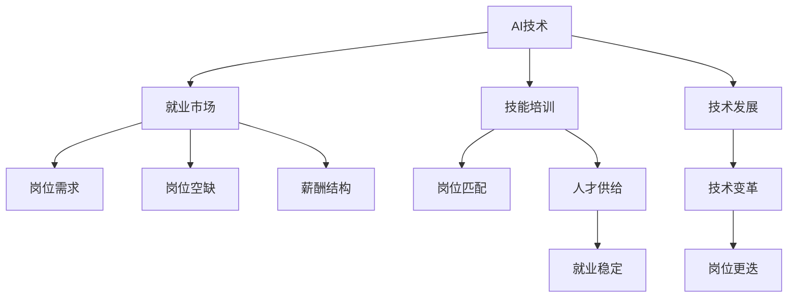

                 

# 人类计算：AI时代的未来就业市场与技能培训发展趋势分析总结挑战

## 1. 背景介绍

### 1.1 问题由来

随着人工智能(AI)技术的迅猛发展，各行各业都面临着深刻的变革。AI技术，特别是深度学习、自然语言处理和计算机视觉等领域的突破，正在改变传统的生产模式和服务方式。同时，AI技术也在改变就业市场的格局，对人类的技能需求和职业定位提出了新的挑战。

### 1.2 问题核心关键点

当前AI技术的发展正在从提高效率转向增强创造力，这对人类的技能需求产生了深远的影响。AI技术能够处理大量重复性、低价值的任务，使人类可以从繁琐的数据处理和基础分析中解放出来，转而专注于更有创意、更复杂的问题解决。然而，这也意味着一些低技能、基础的工作岗位可能被机器取代，而高技能、创造性的岗位需求则更加迫切。

### 1.3 问题研究意义

深入分析AI时代未来就业市场与技能培训的发展趋势，不仅有助于理解AI技术对就业市场的潜在影响，还能为教育培训机构提供方向性的指导，帮助其更好地适应AI时代的就业需求。这有助于优化教育资源配置，提升人才质量，促进经济的持续健康发展。

## 2. 核心概念与联系

### 2.1 核心概念概述

为更好地理解AI技术对就业市场的影响，我们首先需要明确几个核心概念：

- **AI技术**：涵盖深度学习、自然语言处理、计算机视觉、机器人学等多个子领域的先进技术。
- **就业市场**：指一个地区、行业或国家的就业情况，包括岗位数量、岗位类型、薪资水平等。
- **技能培训**：指通过教育培训活动，提高个体或群体在特定领域的技术能力和职业素养。

这些概念之间的关系可以通过以下Mermaid流程图来展示：

这个流程图展示了AI技术、就业市场、技能培训三者之间的关系：

1. AI技术的进步直接推动就业市场和岗位结构的变化。
2. 技能培训的提升能帮助员工适应新的就业市场，提高岗位匹配度。
3. 岗位需求的变化反过来要求教育培训机构调整培训内容和方式，提高人才供给的契合度。
4. 技术的发展和变革导致某些岗位被淘汰，新的岗位不断出现。

## 3. 核心算法原理 & 具体操作步骤
### 3.1 算法原理概述

AI时代就业市场与技能培训的发展趋势分析，主要基于以下算法原理：

1. **就业趋势预测算法**：通过对历史就业数据的分析，使用时间序列分析、回归模型、决策树等算法，预测未来就业市场的变化。
2. **技能需求分析算法**：结合AI技术的进步，使用文本分析、情感分析、话题模型等自然语言处理技术，分析就业市场对技能的需求变化。
3. **岗位匹配算法**：利用机器学习模型，如协同过滤、深度学习等，匹配AI技能与岗位需求，预测未来岗位的紧缺程度。
4. **技能培训效果评估算法**：通过对比培训前后的绩效差异，使用回归模型、分类算法等评估技能培训的效果。

### 3.2 算法步骤详解

1. **数据收集与预处理**：
   - 收集就业市场的历史数据，包括岗位数量、岗位类型、行业分布、薪资水平等。
   - 使用自然语言处理技术，收集和处理技能培训相关的课程内容、学员反馈等数据。
   - 进行数据清洗和特征工程，准备后续分析和建模。

2. **就业趋势预测**：
   - 使用时间序列分析方法，如ARIMA模型、LSTM等，预测就业市场的总体趋势。
   - 结合回归模型，如线性回归、逻辑回归等，预测特定行业或岗位的需求变化。
   - 引入外部因素，如经济环境、政策变化等，进行多变量回归分析。

3. **技能需求分析**：
   - 使用文本分析技术，如TF-IDF、LDA等，分析招聘信息、课程内容等文本数据，识别技能需求的变化趋势。
   - 结合情感分析，分析文本数据中的情感倾向，识别技能需求的变化方向。
   - 使用话题模型，如LDA、HDP等，挖掘技能需求中的高频主题。

4. **岗位匹配与预测**：
   - 使用协同过滤算法，如矩阵分解、KNN等，匹配AI技能与岗位需求，预测未来岗位的紧缺程度。
   - 利用深度学习模型，如CNN、RNN等，处理非结构化数据，提高匹配准确性。
   - 引入外部知识库，如职业标准、技能认证等，优化匹配效果。

5. **技能培训效果评估**：
   - 对比培训前后的技能评估数据，使用回归模型、分类算法等，评估培训效果。
   - 使用学生反馈、课程满意度等软指标，结合硬指标进行综合评估。
   - 引入外部第三方机构，进行独立的培训效果评估。

### 3.3 算法优缺点

AI时代就业市场与技能培训分析的优势在于：

1. **准确性**：结合多种算法和数据源，能够提供较为准确的就业市场趋势和技能需求预测。
2. **时效性**：通过实时数据更新，及时反映就业市场和技能需求的变化。
3. **全面性**：考虑了经济环境、政策变化等多方面因素，提供综合分析。

缺点在于：

1. **数据质量依赖**：预测和分析结果的准确性高度依赖于数据的质量和完整性。
2. **模型复杂性**：多种算法和模型组合，可能导致模型复杂度增加，影响解释性。
3. **动态变化挑战**：AI技术和就业市场的快速变化，可能导致模型更新不及时，影响预测准确性。

### 3.4 算法应用领域

基于AI技术的就业市场与技能培训分析，广泛应用于以下领域：

- **教育培训行业**：通过分析技能需求变化，优化课程设置，提高培训效果。
- **人力资源管理**：结合岗位匹配算法，精准招聘AI相关人才，优化人力资源配置。
- **政府政策制定**：提供就业市场和技能需求的实时数据，辅助制定相关政策。
- **企业战略规划**：结合技能培训效果评估，优化人才战略，提升企业竞争力。
- **职业指导与咨询**：为求职者提供AI时代技能需求信息，指导职业发展方向。

## 4. 数学模型和公式 & 详细讲解 & 举例说明

### 4.1 数学模型构建

AI时代就业市场与技能培训分析的数学模型主要包括以下几个部分：

- **时间序列模型**：用于预测就业市场总体趋势，如ARIMA、LSTM等。
- **回归模型**：用于预测特定行业或岗位的需求变化，如线性回归、逻辑回归等。
- **文本分析模型**：用于分析技能需求的变化趋势，如TF-IDF、LDA等。
- **协同过滤模型**：用于匹配AI技能与岗位需求，如矩阵分解、KNN等。
- **深度学习模型**：用于处理非结构化数据，提高匹配准确性，如CNN、RNN等。

### 4.2 公式推导过程

以线性回归模型为例，假设我们有$n$个样本$(x_i, y_i)$，其中$x_i$为输入特征，$y_i$为输出标签。我们的目标是找到一条直线$y = \theta_0 + \theta_1 x_1 + \theta_2 x_2 + \cdots + \theta_k x_k$，使得预测值$\hat{y_i}$与实际值$y_i$的误差最小。具体公式如下：

$$
\hat{y_i} = \theta_0 + \theta_1 x_{i1} + \theta_2 x_{i2} + \cdots + \theta_k x_{ik}
$$

$$
\text{MSE} = \frac{1}{n} \sum_{i=1}^n (y_i - \hat{y_i})^2
$$

$$
\theta = \arg\min_{\theta} \text{MSE}
$$

其中$\theta$为模型参数，$x_{ij}$为输入特征的取值，$n$为样本数量。

### 4.3 案例分析与讲解

假设我们要预测某个城市的房地产价格走势。我们收集了过去5年的房价数据，以及相关经济指标（如GDP增长率、失业率等）。我们可以使用线性回归模型来分析经济指标与房价之间的关系。具体步骤如下：

1. **数据收集**：收集过去5年的房价和相关经济指标数据。
2. **数据预处理**：对数据进行清洗、归一化处理。
3. **模型构建**：构建线性回归模型，设定房价为输出标签，经济指标为输入特征。
4. **模型训练**：使用梯度下降算法训练模型，最小化误差函数。
5. **结果验证**：使用测试集验证模型预测效果。

通过上述步骤，我们可以得到经济指标对房价的预测模型，进一步分析其对未来房价的走势预测。

## 5. AI时代的就业市场

### 5.1 就业市场趋势

#### 5.1.1 岗位结构变化

AI技术的应用将导致岗位结构发生显著变化。具体表现如下：

- **技术岗位需求增长**：AI、数据分析、机器学习等技术岗位需求大幅增加。
- **传统岗位需求减少**：如基础数据录入、简单的数据分析等岗位可能被机器取代。
- **新兴岗位出现**：如AI伦理学家、机器学习工程师等新兴岗位将出现。

#### 5.1.2 行业分布变化

AI技术在不同行业的应用将带来行业分布的变化：

- **技术行业爆发**：如金融科技、医疗科技、智能制造等行业将加速发展。
- **传统行业转型**：如零售、教育、旅游等行业将引入AI技术进行优化升级。
- **新兴行业崛起**：如自动驾驶、量子计算、区块链等新兴行业将快速发展。

### 5.2 就业市场影响

#### 5.2.1 岗位数量变化

AI技术将导致岗位数量发生显著变化：

- **技术岗位增加**：对AI技术人才的需求将显著增加。
- **基础岗位减少**：低技能、重复性岗位将大幅减少。
- **新兴岗位涌现**：新的AI相关岗位将不断出现。

#### 5.2.2 岗位技能要求变化

AI技术对岗位技能要求的变化主要体现在以下几个方面：

- **技术技能提升**：对编程、数据分析、机器学习等技术技能的要求将大幅提升。
- **跨学科能力增强**：如人工智能、医学、法律等领域的交叉应用将更加广泛。
- **软技能重要性增加**：如团队协作、问题解决、创新能力等软技能的需求将增加。

## 6. AI时代的技能培训

### 6.1 技能培训趋势

#### 6.1.1 技能培训内容变化

AI时代技能培训的内容将发生显著变化：

- **技术技能培训需求增加**：对AI、大数据、机器学习等技术技能培训的需求将大幅增加。
- **跨学科培训需求增加**：如数据科学与医学、数据科学与法律等跨学科的培训需求将增加。
- **软技能培训重要性提升**：对团队协作、沟通能力、创新能力等软技能的培训需求将增加。

#### 6.1.2 技能培训形式变化

AI时代技能培训的形式将更加灵活和多样化：

- **线上培训普及**：在线学习平台将更加普及，提供在线课程、在线考试等培训形式。
- **微培训兴起**：短小精悍的微培训将更加受欢迎，便于快速掌握技能。
- **混合式培训增加**：线上线下结合的混合式培训将更加广泛。

### 6.2 技能培训挑战

#### 6.2.1 技术更新快

AI技术发展迅速，技能培训需要不断更新课程内容，以跟上技术发展的步伐。

#### 6.2.2 师资力量不足

技术类培训往往需要具有高技术水平和行业经验的教师，但这类师资力量相对不足。

#### 6.2.3 培训效果评估难

技能培训的效果评估难以量化，如何科学评估培训效果是一大挑战。

## 7. 工具和资源推荐

### 7.1 学习资源推荐

1. **Coursera**：提供大量高质量的AI和数据分析课程，涵盖从基础到高级的各个层次。
2. **edX**：提供跨学科的AI和机器学习课程，涵盖自然语言处理、计算机视觉等多个领域。
3. **Kaggle**：提供大量数据科学和机器学习的竞赛和项目，有助于实践技能提升。
4. **GitHub**：提供大量的开源项目和代码库，可以学习和参考。
5. **Google Colab**：免费的在线Jupyter Notebook环境，适合学习和实验最新技术。

### 7.2 开发工具推荐

1. **Jupyter Notebook**：免费的开源工具，适合数据分析、机器学习等项目开发。
2. **PyTorch**：深度学习框架，提供丰富的API和工具支持。
3. **TensorFlow**：另一个深度学习框架，提供灵活的构建和部署方式。
4. **Scikit-learn**：机器学习库，提供简单易用的机器学习算法。
5. **R语言**：统计分析工具，适合数据处理和建模。

### 7.3 相关论文推荐

1. **“AI时代就业市场的变化与挑战”**：分析AI技术对就业市场的影响和挑战，提出应对策略。
2. **“技能培训的未来发展趋势”**：探讨未来技能培训的发展方向和关键技术。
3. **“AI技术对教育培训的影响”**：分析AI技术对教育培训的影响，提出优化建议。
4. **“技术岗位的兴起与转型”**：探讨技术岗位的兴起与转型，提出职业发展规划。
5. **“软技能在AI时代的重要性”**：分析软技能在AI时代的重要性，提出提升建议。

## 8. 总结：未来发展趋势与挑战

### 8.1 研究成果总结

AI技术正在深刻改变就业市场和技能培训的发展趋势，带来了机遇与挑战。未来，就业市场将更加注重技术技能和软技能的需求，技能培训也将更加注重技术更新和跨学科培训。通过科学分析和合理规划，可以更好地适应AI时代的就业需求。

### 8.2 未来发展趋势

未来，AI时代就业市场与技能培训的发展趋势如下：

1. **技术岗位需求增加**：AI、数据分析、机器学习等技术岗位需求大幅增加。
2. **岗位结构变化**：技术岗位占比提升，基础岗位减少，新兴岗位涌现。
3. **跨学科培训需求增加**：数据科学与医学、数据科学与法律等跨学科的培训需求增加。
4. **软技能培训重要性提升**：团队协作、沟通能力、创新能力等软技能的需求将增加。
5. **线上培训普及**：在线学习平台将更加普及，提供在线课程、在线考试等培训形式。

### 8.3 面临的挑战

未来，AI时代就业市场与技能培训仍面临以下挑战：

1. **技术更新快**：AI技术发展迅速，技能培训需要不断更新课程内容，以跟上技术发展的步伐。
2. **师资力量不足**：技术类培训往往需要具有高技术水平和行业经验的教师，但这类师资力量相对不足。
3. **培训效果评估难**：技能培训的效果评估难以量化，如何科学评估培训效果是一大挑战。
4. **岗位结构变化**：低技能、重复性岗位可能被机器取代，高技能、创造性岗位需求增加。
5. **软技能需求增加**：团队协作、沟通能力、创新能力等软技能的需求将增加。

### 8.4 研究展望

未来，AI时代就业市场与技能培训的研究展望如下：

1. **智能化技能培训**：结合AI技术，实现个性化、智能化的技能培训，提升培训效果。
2. **跨领域人才培养**：加强跨学科人才的培养，推动技术、医学、法律等领域的交叉应用。
3. **软技能培养**：注重软技能的培养，提升团队协作、沟通能力等综合素质。
4. **持续学习机制**：建立持续学习机制，帮助员工适应技术变化，保持竞争力。
5. **伦理与安全培训**：加强AI伦理和安全培训，确保AI技术的应用符合伦理和法规要求。

## 9. 附录：常见问题与解答

**Q1：AI技术的发展将对就业市场产生什么影响？**

A: AI技术的发展将导致就业市场和岗位结构发生显著变化。技术岗位需求增加，低技能、重复性岗位可能被机器取代，新兴岗位将不断涌现。

**Q2：AI时代的技能培训有哪些变化？**

A: AI时代技能培训的内容将更加注重技术技能和软技能的提升。技术类培训需求增加，跨学科培训需求增加，软技能培训的重要性提升。

**Q3：AI时代技能培训面临哪些挑战？**

A: 技术更新速度快，师资力量不足，培训效果评估难度大等是AI时代技能培训面临的主要挑战。

**Q4：未来技能培训如何适应AI时代？**

A: 未来技能培训应注重智能化、跨学科人才培养，加强软技能培训，建立持续学习机制，并重视AI伦理和安全培训。

---

作者：禅与计算机程序设计艺术 / Zen and the Art of Computer Programming

