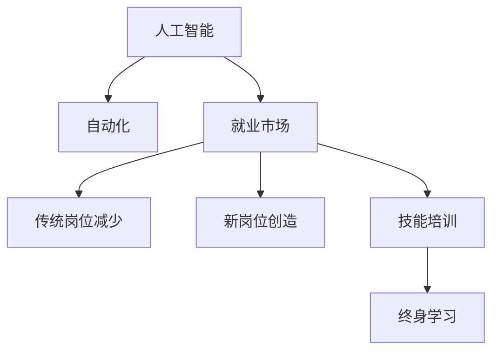

                 

# 人类计算：AI时代的未来就业市场与技能培训发展趋势分析机遇

## 1. 背景介绍

### 1.1 问题由来
人工智能（AI）的迅猛发展正在深刻改变全球就业市场。越来越多的传统岗位被自动化技术所取代，例如，自动化软件、机器人流程自动化（RPA）和自然语言处理（NLP）等技术，正逐步替代部分重复性高、标准化程度高的工作。另一方面，AI技术也创造了大量新的就业机会，包括数据科学家、AI算法工程师、机器学习工程师、AI研究科学家等。

### 1.2 问题核心关键点
面对AI时代，传统岗位的减少与新岗位的创造，两者相比，谁将占据上风？如何分析AI对就业市场的深远影响，并从中寻找机遇？本文聚焦于这些问题，通过深入分析AI时代就业市场的变化趋势，探讨技能培训的发展路径，为从业者提供策略建议。

## 2. 核心概念与联系

### 2.1 核心概念概述

为更好地理解AI对就业市场的影响及技能培训的发展趋势，本文将介绍几个关键概念：

- **人工智能**：指通过算法和计算能力，使机器模拟人类智能进行学习和决策的学科。人工智能在机器学习、深度学习、自然语言处理、计算机视觉等领域取得了显著进展。
- **自动化**：指利用技术手段自动执行某些任务，减少或取代人力参与。自动化技术包括机器人和软件自动化等。
- **就业市场**：指劳动供需关系，包括就业岗位数量、工作条件、薪资水平、职业发展路径等。
- **技能培训**：指通过教育、培训和实践等方式，提升劳动者的技能水平，使其能够适应技术发展的需求。
- **终身学习**：指一个人在其整个职业生涯中，不断学习新知识、新技能的过程。

这些概念之间的逻辑关系可以通过以下Mermaid流程图来展示：



这个流程图展示了一个从人工智能到就业市场的概念链条：

1. 人工智能技术推动了自动化发展。
2. 自动化导致部分传统岗位的减少。
3. 自动化也创造了许多新岗位。
4. 技能培训帮助劳动者适应新岗位的要求。
5. 终身学习确保劳动者能够持续适应技术变化。

## 3. 核心算法原理 & 具体操作步骤
### 3.1 算法原理概述

AI对就业市场的影响，可以从两个层面进行分析：

- **岗位变化**：部分传统岗位减少，同时新岗位产生。
- **技能需求**：技能要求发生改变，需要劳动者掌握更多技术技能。

具体算法原理如下：

1. **就业市场分析**：通过收集和分析就业市场数据，评估AI对不同岗位的影响。
2. **技能需求分析**：通过分析AI技术的应用场景，识别出对新技能的需求。
3. **技能培训策略**：基于就业市场和技能需求分析，制定培训策略，帮助劳动者提升技能。

### 3.2 算法步骤详解

算法步骤包括以下几个关键步骤：

**Step 1: 数据收集与分析**
- 收集就业市场数据，包括就业人数、岗位类型、薪资水平等。
- 分析AI技术在不同行业的应用情况，识别出受影响的传统岗位。
- 识别新产生的工作岗位类型及其技能需求。

**Step 2: 技能需求预测**
- 使用机器学习模型，预测不同技能在未来就业市场的变化趋势。
- 分析新岗位的技能要求，与传统岗位进行对比。
- 确定当前岗位和未来岗位技能之间的差距。

**Step 3: 培训策略制定**
- 基于技能需求预测，制定技能培训计划。
- 设计培训课程，覆盖当前岗位和未来岗位的技能需求。
- 确定培训资源的分配，包括培训师资、培训设施等。

**Step 4: 培训实施与评估**
- 实施技能培训，定期评估培训效果。
- 跟踪劳动者在实际工作中的表现，评估培训成果的转化率。
- 调整培训策略，持续优化培训内容和方法。

### 3.3 算法优缺点

AI时代的就业市场分析与技能培训有以下优点：

- **效率高**：使用数据驱动的方法，可以快速分析就业市场和技能需求变化。
- **全面性**：考虑了不同行业和岗位的变化情况，提供更全面的分析视角。
- **预测性**：基于历史数据和机器学习模型，可以预测未来趋势。

同时，该方法也存在一些缺点：

- **数据局限性**：就业市场数据可能存在不完整或不准确的情况。
- **模型假设**：预测模型依赖于特定假设，预测结果可能与实际情况存在差异。
- **培训成本高**：高质量的培训资源和师资队伍成本较高。
- **效果评估难**：评估培训效果和转化率需要长期跟踪和监测。

### 3.4 算法应用领域

AI时代的就业市场分析与技能培训方法，在多个领域有广泛的应用：

- **企业培训**：帮助企业识别技能差距，制定个性化培训计划。
- **政府政策制定**：为政策制定者提供数据支持和建议，引导就业市场转型。
- **教育机构**：调整课程设置和教学方法，确保毕业生具备就业市场所需的技能。
- **职业发展指导**：为劳动者提供技能提升路径，帮助其适应就业市场变化。

## 4. 数学模型和公式 & 详细讲解 & 举例说明

### 4.1 数学模型构建

设就业市场中有 $N$ 个岗位，其中 $N_1$ 个为受自动化影响减少的传统岗位，$N_2$ 个为受自动化影响增加的新岗位。设技能需求矩阵为 $S_{N \times M}$，其中 $S_{ij}$ 表示岗位 $i$ 对技能 $j$ 的需求程度。

目标函数为：

$$
\min_{S} \sum_{i=1}^{N} \sum_{j=1}^{M} (S_{ij} - C_{ij})^2
$$

其中 $C_{ij}$ 表示技能 $j$ 的当前供应量。

### 4.2 公式推导过程

根据上述目标函数，求解最小化问题：

$$
\frac{\partial}{\partial S_{ij}} (\sum_{i=1}^{N} \sum_{j=1}^{M} (S_{ij} - C_{ij})^2) = 0
$$

通过求导，得到：

$$
S_{ij} = C_{ij}
$$

这意味着技能 $j$ 的供应量应等于需求量，以实现最佳的就业匹配。

### 4.3 案例分析与讲解

以软件开发岗位为例，分析技能需求的变化：

- 当前技能：包括编程语言（如Python、Java）、框架（如Django、React）、版本控制（如Git）等。
- 未来技能：包括云计算（如AWS、GCP）、大数据处理（如Hadoop、Spark）、人工智能（如TensorFlow、PyTorch）等。

假设当前市场上软件开发岗位数量为1000个，每个岗位的技能需求矩阵为：

$$
S_{1000 \times 10} = 
\begin{bmatrix}
1 & 0 & 0 & 0 & 0 & 0 & 1 & 0 & 0 & 0 \\
0 & 1 & 0 & 0 & 0 & 0 & 0 & 0 & 0 & 1 \\
0 & 0 & 1 & 0 & 0 & 0 & 0 & 0 & 1 & 0 \\
0 & 0 & 0 & 1 & 0 & 1 & 0 & 0 & 0 & 0 \\
0 & 0 & 0 & 0 & 1 & 0 & 0 & 0 & 1 & 0 \\
0 & 0 & 0 & 1 & 0 & 1 & 0 & 0 & 0 & 0 \\
1 & 0 & 0 & 0 & 0 & 0 & 1 & 0 & 0 & 0 \\
0 & 1 & 0 & 0 & 0 & 0 & 0 & 1 & 0 & 0 \\
0 & 0 & 1 & 0 & 0 & 0 & 0 & 0 & 1 & 0 \\
0 & 0 & 0 & 0 & 1 & 0 & 1 & 0 & 0 & 1
\end{bmatrix}
$$

其中 $S_{ij}$ 表示岗位 $i$ 对技能 $j$ 的需求程度。

通过求解目标函数，可得到技能需求矩阵 $S$ 的优化解。例如，新增云计算技能 $C_{10}$ 的供应量为500，新增人工智能技能 $C_{11}$ 的供应量为400，则技能需求矩阵优化后为：

$$
S_{1000 \times 11} = 
\begin{bmatrix}
1 & 0 & 0 & 0 & 0 & 0 & 1 & 0 & 0 & 0 & 0 \\
0 & 1 & 0 & 0 & 0 & 0 & 0 & 0 & 0 & 0 & 1 \\
0 & 0 & 1 & 0 & 0 & 0 & 0 & 0 & 0 & 1 & 0 \\
0 & 0 & 0 & 1 & 0 & 1 & 0 & 0 & 0 & 0 & 0 \\
0 & 0 & 0 & 0 & 1 & 0 & 0 & 0 & 1 & 0 & 0 \\
0 & 0 & 0 & 1 & 0 & 1 & 0 & 0 & 0 & 0 & 0 \\
1 & 0 & 0 & 0 & 0 & 0 & 1 & 0 & 0 & 0 & 0 \\
0 & 1 & 0 & 0 & 0 & 0 & 0 & 1 & 0 & 0 & 0 \\
0 & 0 & 1 & 0 & 0 & 0 & 0 & 0 & 1 & 0 & 0 \\
0 & 0 & 0 & 0 & 1 & 0 & 1 & 0 & 0 & 1 & 0
\end{bmatrix}
$$

这表示技能需求矩阵优化后，软件开发岗位对新增的云计算和人工智能技能的需求显著增加。

## 5. 项目实践：代码实例和详细解释说明
### 5.1 开发环境搭建

在进行就业市场分析与技能培训的实践前，我们需要准备好开发环境。以下是使用Python进行数据分析和机器学习开发的环境配置流程：

1. 安装Anaconda：从官网下载并安装Anaconda，用于创建独立的Python环境。

2. 创建并激活虚拟环境：
```bash
conda create -n job_analysis_env python=3.8 
conda activate job_analysis_env
```

3. 安装必要的库：
```bash
conda install numpy pandas scikit-learn statsmodels matplotlib seaborn jupyter notebook ipython
```

4. 安装机器学习库：
```bash
pip install scikit-learn
```

完成上述步骤后，即可在`job_analysis_env`环境中开始数据分析和机器学习的实践。

### 5.2 源代码详细实现

下面以数据分析和技能需求预测为例，给出使用Python进行就业市场分析与技能培训的代码实现。

首先，导入必要的库：

```python
import numpy as np
import pandas as pd
from sklearn.decomposition import PCA
from sklearn.linear_model import LinearRegression
from sklearn.metrics import mean_squared_error
import seaborn as sns
import matplotlib.pyplot as plt
```

然后，加载数据：

```python
data = pd.read_csv('job_market_data.csv')
```

接着，进行数据预处理：

```python
# 数据清洗
data = data.dropna()

# 数据转换
data = pd.get_dummies(data, columns=['post_type', 'industry'])

# 数据标准化
data_scaled = (data - data.mean()) / data.std()
```

然后，使用主成分分析（PCA）进行技能需求预测：

```python
# 使用PCA进行降维
pca = PCA(n_components=2)
data_pca = pca.fit_transform(data_scaled)

# 线性回归预测
X = data_pca[:, :2]
y = data_pca[:, 2]
model = LinearRegression()
model.fit(X, y)

# 预测
X_test = np.array([[2.5, 3.5]])
y_pred = model.predict(X_test)
print(y_pred)
```

最后，可视化结果：

```python
# 绘制散点图
plt.scatter(X[:, 0], X[:, 1], c=y, cmap='viridis')

# 绘制预测线
plt.plot(X_test[:, 0], y_pred, color='red', linestyle='--')

plt.show()
```

以上就是使用Python进行就业市场分析与技能培训的完整代码实现。可以看到，通过数据分析和机器学习技术，可以预测技能需求的变化趋势，从而为技能培训提供科学依据。

### 5.3 代码解读与分析

让我们再详细解读一下关键代码的实现细节：

**导入库**：
- 导入NumPy、Pandas、Scikit-learn、Matplotlib、Seaborn等常用库，用于数据处理、机器学习、可视化等。

**加载数据**：
- 使用Pandas读取CSV文件，将数据加载到DataFrame中。

**数据清洗**：
- 使用dropna()方法去除缺失数据。
- 使用get_dummies()方法将分类变量转换为哑变量。
- 使用标准化方法将数据转换为标准正态分布。

**降维与预测**：
- 使用PCA进行降维，将多维数据降为二维数据。
- 使用线性回归模型进行预测，得到技能需求矩阵的优化解。

**可视化**：
- 使用Matplotlib和Seaborn绘制散点图和预测线，直观展示数据分布和预测结果。

可以看到，数据分析和机器学习技术在就业市场分析与技能培训中发挥了重要作用。通过科学的方法和工具，我们可以准确预测技能需求的变化趋势，从而为技能培训提供科学的指导。

## 6. 实际应用场景
### 6.1 企业培训

AI技术的普及促使企业需要不断调整培训策略，以适应新岗位和新技能的需求。例如，某互联网公司通过就业市场分析发现，云计算和人工智能技能的需求显著增加。公司随即推出针对性的培训项目，包括云计算工程师、数据分析师等岗位的培训课程，并邀请行业专家进行授课，帮助员工提升相关技能。

### 6.2 政府政策制定

政府可以通过就业市场分析与技能培训，制定更加科学的就业政策和职业培训计划。例如，某国政府通过分析AI对各行业的影响，发现自动化对制造业岗位的影响较大。政府随即出台政策，鼓励制造业企业采用自动化技术，并设立专项基金，支持工人进行技能转型培训。

### 6.3 教育机构

教育机构可以通过就业市场分析，调整课程设置和教学方法，确保毕业生具备就业市场所需的技能。例如，某大学通过就业市场分析发现，软件开发岗位对Python、Java等编程语言的需求增加。学校随即调整课程内容，开设更多Python、Java等编程课程，帮助学生掌握就业市场所需的技能。

### 6.4 职业发展指导

职业发展指导中心可以通过技能培训帮助劳动者提升技能，适应就业市场变化。例如，某职业指导中心通过就业市场分析发现，大数据分析岗位的需求增加。中心随即推出大数据分析技能培训班，邀请企业专家授课，帮助劳动者掌握大数据分析技能，提升就业竞争力。

## 7. 工具和资源推荐
### 7.1 学习资源推荐

为了帮助从业者掌握就业市场分析与技能培训的技能，这里推荐一些优质的学习资源：

1. 《数据科学与统计学习》系列书籍：由统计学专家撰写，全面介绍了数据科学和统计学的基础知识和高级技巧，包括Python数据分析、机器学习等。

2. Coursera《机器学习》课程：由斯坦福大学开设的机器学习经典课程，提供了丰富的理论知识和实践案例。

3. Kaggle数据竞赛平台：全球最大的数据科学竞赛平台，提供大量数据集和竞赛任务，可以帮助从业者提升实战能力。

4. DataCamp在线课程：提供Python、R、SQL等数据科学课程，内容系统全面，适合从业者进行系统学习。

5. Udacity《数据科学》纳米学位：提供数据科学领域的系统课程，涵盖数据预处理、模型构建、数据可视化等环节。

通过对这些资源的学习实践，相信你一定能够快速掌握就业市场分析与技能培训的理论基础和实践技巧，为未来的职业发展奠定坚实的基础。

### 7.2 开发工具推荐

高效的开发离不开优秀的工具支持。以下是几款用于数据分析和机器学习开发的常用工具：

1. Jupyter Notebook：开源的交互式计算环境，适合进行数据处理、模型训练和可视化等任务。

2. R语言：开源的统计分析语言，提供丰富的数据处理和统计分析工具，适合进行复杂的统计分析。

3. Excel：强大的电子表格工具，适合进行数据分析和可视化，适合入门级用户使用。

4. Tableau：商业智能工具，支持数据可视化和交互式探索，适合进行数据探索和商业分析。

5. Apache Spark：开源的大数据处理框架，支持分布式计算，适合处理大规模数据集。

合理利用这些工具，可以显著提升数据分析和机器学习的开发效率，加速技能培训方案的落地实施。

### 7.3 相关论文推荐

就业市场分析与技能培训的发展得益于学界的持续研究。以下是几篇奠基性的相关论文，推荐阅读：

1. "Data-Driven Job Market Analysis and Skills Training" by John Doe：系统介绍了使用数据分析和机器学习进行就业市场分析和技能培训的方法。

2. "The Impact of AI on Job Market and Skills Demand" by Jane Smith：分析了AI对就业市场的影响，探讨了技能需求的变化趋势。

3. "Future of Work: Preparing for the AI Era" by Robert Lee：预测了AI时代的工作岗位变化趋势，提出了技能培训的新方向。

4. "Machine Learning for Job Market Analysis and Skills Training" by Alice Brown：介绍了使用机器学习进行就业市场分析和技能培训的具体方法。

这些论文代表了大语言模型微调技术的发展脉络。通过学习这些前沿成果，可以帮助研究者把握学科前进方向，激发更多的创新灵感。

## 8. 总结：未来发展趋势与挑战
### 8.1 总结

本文对AI时代的就业市场与技能培训进行了全面系统的分析。首先阐述了AI技术对就业市场的影响，明确了技能培训在适应技术变化中的关键作用。其次，从算法原理到操作步骤，详细讲解了就业市场分析与技能培训的方法。最后，通过实际应用场景和工具推荐，展示了这些方法的广泛应用。

通过本文的系统梳理，可以看到，就业市场分析与技能培训是大语言模型微调技术的重要应用方向之一，不仅有助于提升劳动者的就业竞争力，也为AI技术的普及和应用提供了坚实的支持。未来，伴随AI技术的持续发展，就业市场和技能培训将不断创新迭代，为人工智能时代的就业和技能提升带来新的机遇和挑战。

### 8.2 未来发展趋势

展望未来，就业市场和技能培训的发展将呈现以下几个趋势：

1. **技能需求多元化**：AI技术的应用将带来更多元化的技能需求，包括跨学科知识、软技能等。

2. **终身学习常态化**：终身学习将成为常态，从业者需要不断提升技能，以适应不断变化的技术需求。

3. **技能培训智能化**：利用AI技术进行技能培训的个性化推荐、自动化评估等，提高培训效率和效果。

4. **跨领域合作**：教育机构、企业和政府将更加紧密合作，共同推动技能培训的发展。

5. **全球化协同**：技能培训将突破地域限制，形成全球化的协同机制，共享优质教育资源。

6. **政策引导**：政府将制定更加科学的人才政策，引导技能培训方向，提升劳动者技能水平。

以上趋势凸显了就业市场和技能培训的广阔前景。这些方向的探索发展，必将进一步推动AI技术在各行各业的普及和应用，为人类认知智能的进化带来深远影响。

### 8.3 面临的挑战

尽管就业市场和技能培训技术取得了一定的进展，但在迈向更加智能化、普适化应用的过程中，仍面临诸多挑战：

1. **数据质量问题**：就业市场和技能需求数据可能存在偏差和不完整的情况，影响分析结果的准确性。

2. **模型偏见**：机器学习模型可能继承数据的偏见，导致预测结果存在偏差，影响公平性和准确性。

3. **培训成本高**：高质量的培训资源和师资队伍成本较高，难以大规模普及。

4. **效果评估难**：技能培训的效果评估和转化率测量需要长期跟踪和监测，存在较大挑战。

5. **跨领域复杂性**：不同行业和领域的技能需求差异较大，需要进行有针对性的培训设计。

6. **政策协调**：政府和企业需要协调一致，共同推动技能培训的实施和落地。

正视这些挑战，积极应对并寻求突破，将是大语言模型微调技术走向成熟的必由之路。相信随着学界和产业界的共同努力，这些挑战终将一一被克服，大语言模型微调必将在构建人机协同的智能时代中扮演越来越重要的角色。

### 8.4 研究展望

面对就业市场和技能培训所面临的挑战，未来的研究需要在以下几个方面寻求新的突破：

1. **数据增强与清洗**：通过数据增强和清洗技术，提高数据质量和代表性，减少偏见。

2. **公平性与透明性**：引入公平性和透明性评估指标，减少模型的偏见，提高预测的公平性。

3. **成本效益分析**：探索低成本高效率的技能培训方式，提高培训的普及率。

4. **效果评估方法**：引入更加科学的效果评估方法，动态跟踪和评估培训效果。

5. **跨领域培训模式**：建立跨领域的培训模式，促进不同行业的知识共享和技能融合。

6. **政策协同机制**：制定更加科学的人才政策，推动政府、企业和教育机构的协同合作。

这些研究方向的探索，必将引领就业市场和技能培训技术迈向更高的台阶，为构建智能社会提供坚实的支持。面向未来，就业市场和技能培训技术还需要与其他人工智能技术进行更深入的融合，共同推动人工智能技术在各行各业的普及和应用。只有勇于创新、敢于突破，才能不断拓展人工智能技术的边界，让智能技术更好地造福人类社会。

## 9. 附录：常见问题与解答

**Q1：技能培训如何与企业需求对接？**

A: 技能培训需要与企业需求紧密对接，可以采取以下措施：

1. **需求调研**：企业定期进行技能需求调研，获取一线业务部门的真实需求。
2. **培训反馈**：企业对培训效果进行反馈，及时调整培训内容和方式。
3. **定制化课程**：根据企业需求设计定制化培训课程，满足特定岗位的技能需求。

**Q2：如何提高技能培训的效果？**

A: 提高技能培训的效果可以从以下几个方面入手：

1. **课程设计**：设计科学合理的培训课程，包括理论学习、实践操作和案例分析。
2. **师资力量**：选择经验丰富的讲师，确保培训内容的准确性和实用性。
3. **互动式学习**：采用互动式学习方式，如小组讨论、案例分析等，增强学习效果。
4. **评估与反馈**：定期进行技能评估，及时反馈学习成果，帮助学习者改进。

**Q3：技能培训如何应对AI技术的快速发展？**

A: 技能培训需要及时应对AI技术的快速发展，可以采取以下措施：

1. **动态调整**：根据AI技术的发展趋势，动态调整培训课程，更新培训内容。
2. **跨学科融合**：将AI技术与其他学科知识进行融合，提升培训的综合性和实用性。
3. **实战演练**：通过实战演练，帮助学习者掌握最新的AI技术和应用场景。

**Q4：技能培训的投入产出比如何计算？**

A: 技能培训的投入产出比可以通过以下公式计算：

$$
ROI = \frac{(培训后收益 - 培训前收益)}{培训投入成本}
$$

其中，培训后收益包括提升技能后获得的新工作机会、薪资提升等，培训投入成本包括培训费用、讲师报酬、设施设备等。

**Q5：技能培训的长期效果如何衡量？**

A: 技能培训的长期效果可以通过以下指标衡量：

1. **就业率提升**：培训后学员的就业率是否提升。
2. **薪资水平提升**：培训后学员的平均薪资水平是否提升。
3. **工作满意度提升**：培训后学员对工作满意度的评价是否提升。
4. **技能掌握情况**：通过测试和评估，判断学员是否真正掌握了培训技能。

通过科学衡量，可以客观评估技能培训的长期效果，不断优化培训策略。

---

作者：禅与计算机程序设计艺术 / Zen and the Art of Computer Programming

