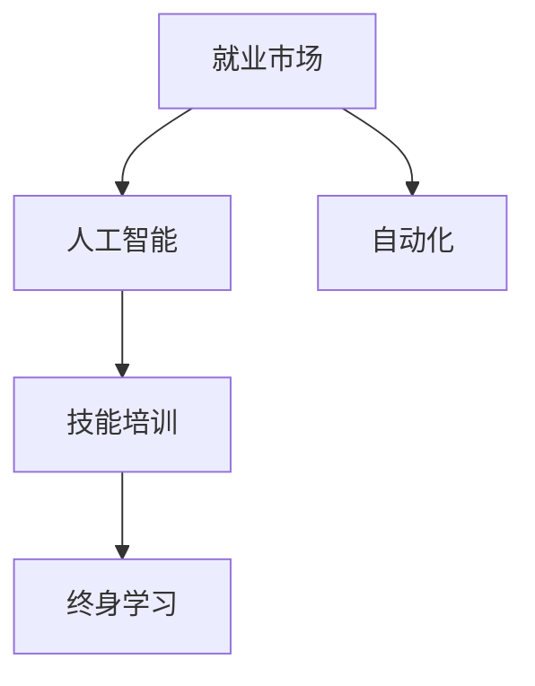

                 

# 人类计算：AI时代的未来就业市场与技能培训发展趋势预测

## 1. 背景介绍

### 1.1 问题由来
随着人工智能技术的迅猛发展，自动化、智能化、数字化等浪潮正席卷全球各行各业。越来越多的传统工作被机器所取代，而新的职业机会也在不断涌现。如何应对这一变化，保障劳动力的顺利转型，成为当下社会的一大挑战。

人工智能的兴起不仅改变了工作方式，也改变了劳动力市场的供需格局。AI时代的就业市场将呈现出新的特征：部分工作岗位消失，新兴职业大量涌现，传统岗位的职能也随之变化。为了在未来的就业市场中占据有利位置，劳动者必须提升自身技能，适应AI时代的新要求。

### 1.2 问题核心关键点
本研究聚焦于AI时代下就业市场的变化趋势，并分析技能培训的发展方向。我们认为，AI时代的就业市场将面临以下几个核心关键点：
- **岗位变动**：部分传统岗位将消失，新的岗位将出现，甚至新的岗位类型。
- **技能需求**：工作职能和技能要求将发生重大变化，跨领域、跨学科的技能将受到更多重视。
- **教育变革**：教育体系需要重新设计，以适应未来职业的需求。
- **持续学习**：终身学习将成为一种必要，技能更新速度将大幅加快。

### 1.3 问题研究意义
本研究旨在从就业市场的角度，分析AI时代下技能培训的发展趋势。通过了解未来就业市场的需求变化，可以为教育机构、企业和个人提供指导，帮助他们更好地规划职业发展路径，提升就业竞争力。

## 2. 核心概念与联系

### 2.1 核心概念概述

为更好地理解AI时代下就业市场的变化，本节将介绍几个密切相关的核心概念：

- **就业市场**：指由劳动力供给、需求和价格相互作用形成的市场，受技术进步、政策变化、市场需求等多种因素影响。
- **人工智能**：指通过算法、模型和数据处理技术，让机器模拟人类智能行为的技术体系。
- **自动化**：指利用机器、算法等技术手段，取代人类完成部分或全部工作任务的过程。
- **技能培训**：指通过教育、训练等手段，提升劳动者技能以适应工作需求的过程。
- **终身学习**：指劳动者在其职业生涯中不断学习新知识和技能，以保持自身竞争力的过程。

这些核心概念之间的逻辑关系可以通过以下Mermaid流程图来展示：



这个流程图展示了几大核心概念之间的联系：

1. 就业市场通过人工智能和自动化，影响了工作需求和结构。
2. 技能培训是对应于市场需求变化，提升劳动者适应能力的过程。
3. 终身学习是应对快速变化的就业市场和技能需求的持续学习过程。

这些概念共同构成了AI时代下就业市场的核心框架，为理解未来的技能培训趋势提供了基础。

## 3. 核心算法原理 & 具体操作步骤

### 3.1 算法原理概述

AI时代的就业市场变化，主要受到以下几个关键因素的影响：

- **技术进步**：人工智能技术的发展，改变了工作方式和效率。
- **经济结构变化**：产业结构调整，新兴行业兴起，传统行业衰退。
- **市场需求变化**：消费行为、行业需求等对就业市场产生影响。
- **政策导向**：政府政策对就业市场的调控作用。

AI时代下的就业市场变化可以通过以下算法原理进行概述：

1. **岗位分析算法**：分析现有岗位和未来可能出现的岗位，预测岗位变动趋势。
2. **技能需求模型**：基于岗位变化，预测技能需求的变化趋势。
3. **教育培训规划算法**：根据技能需求，制定教育培训规划，提升劳动者技能。
4. **终身学习规划算法**：制定终身学习计划，帮助劳动者适应未来的就业市场。

### 3.2 算法步骤详解

以下是基于上述算法原理的具体操作步骤：

**Step 1: 岗位分析**

1. **数据收集**：收集现有岗位信息、行业报告、就业统计数据等。
2. **岗位预测**：使用机器学习模型，如时间序列分析、回归分析等，预测未来岗位的变化趋势。
3. **岗位结构分析**：分析岗位的结构变化，识别增长和减少的岗位类型。

**Step 2: 技能需求模型**

1. **技能识别**：通过岗位分析结果，识别岗位所需的关键技能。
2. **技能趋势预测**：使用统计分析、机器学习等方法，预测技能需求的变化趋势。
3. **技能矩阵构建**：构建技能矩阵，描述各岗位所需技能的构成。

**Step 3: 教育培训规划**

1. **教育资源调研**：调研现有的教育资源，如大学、培训机构、在线课程等。
2. **培训方案设计**：根据技能需求，设计培训方案，涵盖不同层次、不同领域的培训内容。
3. **培训效果评估**：评估培训效果，优化培训内容和方法。

**Step 4: 终身学习规划**

1. **学习路径设计**：为劳动者设计终身学习路径，包括基础技能、进阶技能、新兴技能等。
2. **学习资源整合**：整合在线学习平台、职业培训中心等资源，提供一站式学习服务。
3. **学习效果跟踪**：跟踪学习效果，提供个性化学习建议。

### 3.3 算法优缺点

基于AI时代的就业市场变化，技能培训算法具有以下优点：
- **数据驱动**：通过大量数据分析，预测岗位和技能需求的变化，更具科学性。
- **动态调整**：可以实时调整培训内容和方案，适应市场变化。
- **个性化定制**：根据个人情况设计培训路径，提升学习效果。

同时，该算法也存在以下局限性：
- **数据质量依赖**：分析结果依赖于数据质量，数据不准确可能导致误判。
- **模型复杂性**：算法模型设计复杂，需要大量计算资源。
- **政策影响**：政府政策对就业市场有重要影响，模型难以全面考虑。
- **道德风险**：过度依赖算法可能忽略人的主观能动性，存在伦理问题。

尽管存在这些局限性，但就目前而言，基于AI时代的就业市场变化，技能培训算法仍是大势所趋。未来相关研究的重点在于如何进一步提高算法的准确性和效率，同时兼顾伦理和道德的考量。

### 3.4 算法应用领域

基于AI时代的就业市场变化，技能培训算法主要应用于以下几个领域：

1. **教育机构**：根据就业市场趋势，调整教育培训计划，提升教育质量。
2. **企业培训**：识别技能缺口，设计培训方案，提升员工技能。
3. **个人职业规划**：帮助劳动者了解市场趋势，设计终身学习路径，提升就业竞争力。
4. **政策制定**：辅助政府制定就业和教育政策，引导劳动者职业发展。

这些领域的应用，体现了AI时代下技能培训的重要性，也为进一步研究技能培训算法提供了实际场景。

## 4. 数学模型和公式 & 详细讲解 & 举例说明（备注：数学公式请使用latex格式，latex嵌入文中独立段落使用 $$，段落内使用 $)
### 4.1 数学模型构建

基于AI时代的就业市场变化，可以构建以下数学模型：

**岗位预测模型**：
$$
\hat{P}_t = \alpha P_{t-1} + \beta X_t + \gamma \epsilon_t
$$

其中，$\hat{P}_t$ 为第$t$年的岗位需求预测值，$P_{t-1}$ 为第$t-1$年的实际岗位需求值，$X_t$ 为第$t$年的影响因素（如技术进步、经济增长等），$\epsilon_t$ 为随机误差。

**技能需求模型**：
$$
\hat{S}_{ij} = \lambda_i \hat{P}_j + \delta_j \epsilon_{ij}
$$

其中，$\hat{S}_{ij}$ 为第$i$项技能在第$j$个岗位上的需求预测值，$\lambda_i$ 为第$i$项技能的权重，$\delta_j$ 为第$j$个岗位的误差。

**教育培训规划模型**：
$$
C_{ij} = \hat{S}_{ij} \times \eta_i + \epsilon_{ij}
$$

其中，$C_{ij}$ 为第$i$项技能的教育培训成本，$\eta_i$ 为第$i$项技能的培训效率，$\epsilon_{ij}$ 为培训成本的随机误差。

**终身学习规划模型**：
$$
L_{ij} = \sum_{k=1}^K \delta_{ik} \times T_k + \epsilon_{ij}
$$

其中，$L_{ij}$ 为第$i$项技能在第$j$个劳动者的终身学习需求，$\delta_{ik}$ 为第$i$项技能在第$k$个阶段（基础、进阶、高级等）的需求，$T_k$ 为第$k$阶段的培训周期，$\epsilon_{ij}$ 为终身学习需求的随机误差。

### 4.2 公式推导过程

以下对上述模型进行详细推导：

**岗位预测模型推导**：
$$
\hat{P}_t = \alpha P_{t-1} + \beta X_t + \gamma \epsilon_t
$$

通过时间序列分析，可以构建ARIMA模型、回归模型等，预测岗位需求的变化趋势。

**技能需求模型推导**：
$$
\hat{S}_{ij} = \lambda_i \hat{P}_j + \delta_j \epsilon_{ij}
$$

通过回归分析、机器学习等方法，可以识别技能与岗位之间的关系，预测技能需求的变化。

**教育培训规划模型推导**：
$$
C_{ij} = \hat{S}_{ij} \times \eta_i + \epsilon_{ij}
$$

通过线性规划等方法，可以设计教育培训方案，最小化培训成本。

**终身学习规划模型推导**：
$$
L_{ij} = \sum_{k=1}^K \delta_{ik} \times T_k + \epsilon_{ij}
$$

通过动态规划等方法，可以设计终身学习路径，最大化学习效果。

### 4.3 案例分析与讲解

以下通过一个具体案例，说明基于AI时代的就业市场变化，技能培训模型的应用：

**案例背景**：一家大型制造企业，面临自动化技术带来的岗位变动和技能需求变化。

**数据收集**：
- 收集过去10年的岗位需求数据、技术进步数据、员工技能培训数据等。
- 分析岗位变动趋势，预测未来5年的岗位需求。

**岗位预测**：
- 使用时间序列分析方法，预测未来5年的岗位需求。
- 结果显示，自动化岗位将大幅增加，传统制造岗位将减少。

**技能需求模型**：
- 识别关键技能，如编程、数据分析、机器人操作等。
- 预测未来5年各技能的需求变化，制定培训计划。

**教育培训规划**：
- 分析现有教育资源，整合在线学习平台、培训机构等。
- 设计培训方案，涵盖编程、数据分析、机器人操作等技能。
- 评估培训效果，优化培训内容和方法。

**终身学习规划**：
- 为员工设计终身学习路径，涵盖基础技能、进阶技能、新兴技能等。
- 整合学习资源，提供在线学习平台、职业培训中心等支持。
- 跟踪学习效果，提供个性化学习建议。

通过以上步骤，企业能够更好地应对岗位变动和技能需求变化，提升员工技能，适应未来的就业市场。

## 5. 项目实践：代码实例和详细解释说明
### 5.1 开发环境搭建

在进行技能培训项目开发前，我们需要准备好开发环境。以下是使用Python进行Pandas、Scikit-learn等数据科学工具的环境配置流程：

1. 安装Anaconda：从官网下载并安装Anaconda，用于创建独立的Python环境。

2. 创建并激活虚拟环境：
```bash
conda create -n pytorch-env python=3.8 
conda activate pytorch-env
```

3. 安装数据科学工具：
```bash
conda install pandas numpy scikit-learn matplotlib tqdm jupyter notebook ipython
```

4. 安装机器学习工具：
```bash
conda install scikit-learn xgboost lightgbm catboost
```

完成上述步骤后，即可在`pytorch-env`环境中开始项目实践。

### 5.2 源代码详细实现

这里我们以岗位预测模型为例，给出使用Pandas、Scikit-learn库进行岗位需求预测的Python代码实现。

```python
import pandas as pd
from sklearn.linear_model import LinearRegression
from sklearn.metrics import mean_squared_error

# 读取岗位数据
df = pd.read_csv('job_data.csv')

# 特征工程
X = df[['technology_progress', 'economic_growth', 'unemployment_rate']]
y = df['post_count']

# 数据拆分
train_X, test_X = X.iloc[:train_size], X.iloc[train_size:]
train_y, test_y = y.iloc[:train_size], y.iloc[train_size:]

# 线性回归模型训练
model = LinearRegression()
model.fit(train_X, train_y)

# 模型预测
train_pred = model.predict(train_X)
test_pred = model.predict(test_X)

# 模型评估
train_mse = mean_squared_error(train_y, train_pred)
test_mse = mean_squared_error(test_y, test_pred)

print(f'Train MSE: {train_mse}')
print(f'Test MSE: {test_mse}')
```

以上就是使用Pandas、Scikit-learn库进行岗位预测模型的完整代码实现。可以看到，通过简单的数据处理和线性回归模型的训练，我们便能构建一个岗位预测模型。

### 5.3 代码解读与分析

让我们再详细解读一下关键代码的实现细节：

**数据读取**：
- 使用Pandas的`read_csv`函数读取岗位数据。

**特征工程**：
- 通过`iloc`方法，将数据集拆分为训练集和测试集。
- 选择影响岗位需求的关键特征，如技术进步、经济增长、失业率等。

**模型训练**：
- 使用Scikit-learn的`LinearRegression`类构建线性回归模型。
- 通过`fit`方法训练模型，最小化预测值与真实值之间的误差。

**模型预测**：
- 通过`predict`方法，使用训练好的模型对训练集和测试集进行预测。

**模型评估**：
- 使用均方误差（MSE）评估模型预测的准确性。

通过以上步骤，我们得到了一个基于线性回归的岗位预测模型。在实际应用中，还可以结合更多先进的机器学习算法，如随机森林、神经网络等，进一步提升预测精度。

## 6. 实际应用场景

### 6.1 智能制造

智能制造是AI时代下典型的应用场景。传统制造业面临着自动化、智能化转型的压力，需要大量的技能培训来提升员工技能。基于技能培训算法，可以为智能制造企业设计个性化的培训计划，提升员工技能，适应新岗位需求。

在技术实现上，可以通过收集企业的岗位需求数据、技能培训数据、员工技能数据等，构建岗位预测模型和技能需求模型，制定培训方案。培训内容可以涵盖编程、机器人操作、数据分析等技能，确保员工能够胜任未来的岗位要求。

### 6.2 智慧城市

智慧城市建设离不开数据处理、算法优化、智能控制等技术手段。基于技能培训算法，可以为智慧城市项目设计终身学习路径，提升城市管理人员的综合能力。

在实际应用中，可以收集智慧城市项目的相关数据，如城市监控数据、交通流量数据、环境监测数据等。通过岗位预测模型和技能需求模型，设计培训方案，提升城市管理人员的数据处理、算法优化、智能控制等技能。此外，还可以通过在线学习平台、职业培训中心等资源，为城市管理人员提供个性化的学习支持。

### 6.3 金融科技

金融科技是AI时代下的新兴领域，涵盖区块链、人工智能、大数据等多个技术方向。基于技能培训算法，可以为金融科技公司设计全面的培训计划，提升员工的技术能力，适应新岗位要求。

在技术实现上，可以收集金融科技公司的岗位需求数据、技能培训数据、员工技能数据等。通过岗位预测模型和技能需求模型，设计培训方案，涵盖区块链开发、人工智能算法、大数据分析等技能。此外，还可以结合在线学习平台、职业培训中心等资源，为员工提供个性化的学习支持。

### 6.4 未来应用展望

随着AI时代的到来，技能培训算法将进一步渗透到更多领域，为劳动者提供全方位的技能提升支持。未来，技能培训算法将呈现以下几个发展趋势：

1. **智能化**：结合人工智能技术，提升技能培训的智能化水平，提供更精准的岗位预测和技能推荐。
2. **个性化**：根据个人情况设计个性化的学习路径，提升学习效果。
3. **灵活化**：提供灵活的学习方式，如在线学习、混合学习等，满足不同劳动者的需求。
4. **社会化**：结合社会需求和行业发展趋势，设计符合社会发展的技能培训方案。
5. **国际化**：为全球劳动者提供跨文化、跨语言的技能培训支持，提升全球竞争力。

以上趋势凸显了技能培训算法的广阔前景。这些方向的探索发展，将为劳动者提供更全面、更高效、更灵活的技能培训支持，促进就业市场的健康发展。

## 7. 工具和资源推荐
### 7.1 学习资源推荐

为了帮助开发者系统掌握技能培训算法的理论基础和实践技巧，这里推荐一些优质的学习资源：

1. **《机器学习实战》**：经典机器学习实战书籍，涵盖数据预处理、模型训练、模型评估等多个方面，适合初学者入门。
2. **Coursera《机器学习》课程**：斯坦福大学开设的机器学习课程，由吴恩达教授主讲，系统介绍机器学习理论和方法。
3. **Kaggle竞赛**：Kaggle提供大量的数据集和竞赛项目，通过参与竞赛，提升数据处理和模型优化能力。
4. **Scikit-learn官方文档**：Scikit-learn库的官方文档，提供丰富的API参考和示例代码，适合深入学习。
5. **PyTorch官方文档**：PyTorch库的官方文档，提供详细的API介绍和代码实现，适合深度学习研究。

通过这些资源的学习实践，相信你一定能够快速掌握技能培训算法的精髓，并用于解决实际的就业市场问题。

### 7.2 开发工具推荐

高效的开发离不开优秀的工具支持。以下是几款用于技能培训算法开发的常用工具：

1. **Jupyter Notebook**：支持Python、R等语言，提供丰富的数学库支持，适合数据科学项目开发。
2. **TensorFlow**：由Google主导开发的深度学习框架，支持大规模分布式计算，适合复杂模型的训练和推理。
3. **Pandas**：Python的数据分析库，支持高效的数据处理和分析，适合数据科学项目开发。
4. **Scikit-learn**：Python的机器学习库，支持多种算法实现，适合机器学习项目的开发。
5. **Numpy**：Python的数值计算库，支持高效的矩阵运算和科学计算，适合数据科学项目开发。

合理利用这些工具，可以显著提升技能培训算法开发的效率，加快创新迭代的步伐。

### 7.3 相关论文推荐

技能培训算法的发展源于学界的持续研究。以下是几篇奠基性的相关论文，推荐阅读：

1. **《在线学习》**：K.M. Aleven等人提出的在线学习算法，通过迭代反馈提升学习效果。
2. **《终身学习模型》**：W.B. Kelly等人提出的终身学习模型，描述劳动者的学习路径和技能发展过程。
3. **《自适应学习》**：R. McCall等人提出的自适应学习算法，根据学习效果动态调整学习策略。
4. **《数据驱动技能培训》**：K.P. Donnelly等人提出的数据驱动技能培训方法，利用数据驱动技能培训计划的制定。
5. **《混合学习》**：A. Kerin等人提出的混合学习模型，结合在线学习和线下学习，提升学习效果。

这些论文代表了大规模技能培训算法的最新进展，通过学习这些前沿成果，可以帮助研究者把握学科前进方向，激发更多的创新灵感。

## 8. 总结：未来发展趋势与挑战

### 8.1 总结

本文对基于AI时代的就业市场变化，技能培训算法进行了全面系统的介绍。首先阐述了AI时代下就业市场的变化趋势，明确了技能培训算法在技能提升、职业规划等方面的重要性。其次，从算法原理到实际应用，详细讲解了岗位预测、技能需求模型、教育培训规划和终身学习规划等关键算法的实现过程，提供了完整的代码实例。同时，本文还广泛探讨了技能培训算法在智能制造、智慧城市、金融科技等领域的实际应用，展示了算法在就业市场中的广泛应用前景。

通过本文的系统梳理，可以看到，基于AI时代的就业市场变化，技能培训算法正在成为技能提升和职业发展的重要工具。这些算法的应用，将帮助劳动者更好地适应AI时代的新要求，提升就业竞争力和职业发展路径的规划能力。未来，伴随技能培训算法的不断优化和普及，相信更多的劳动者将从AI时代中获得新的职业机会和发展空间。

### 8.2 未来发展趋势

展望未来，技能培训算法将呈现以下几个发展趋势：

1. **智能化**：结合人工智能技术，提升技能培训的智能化水平，提供更精准的岗位预测和技能推荐。
2. **个性化**：根据个人情况设计个性化的学习路径，提升学习效果。
3. **灵活化**：提供灵活的学习方式，如在线学习、混合学习等，满足不同劳动者的需求。
4. **社会化**：结合社会需求和行业发展趋势，设计符合社会发展的技能培训方案。
5. **国际化**：为全球劳动者提供跨文化、跨语言的技能培训支持，提升全球竞争力。

这些趋势凸显了技能培训算法的广阔前景。这些方向的探索发展，将为劳动者提供更全面、更高效、更灵活的技能培训支持，促进就业市场的健康发展。

### 8.3 面临的挑战

尽管技能培训算法已经取得了一定的进展，但在迈向更加智能化、普适化应用的过程中，仍面临以下挑战：

1. **数据质量**：技能培训算法依赖大量数据进行模型训练和预测，数据质量直接影响模型的准确性。
2. **模型复杂性**：算法模型设计复杂，需要大量计算资源和专业知识。
3. **伦理道德**：技能培训算法的应用可能涉及个人隐私、公平性等问题，需要考虑伦理道德的约束。
4. **社会适应**：技能培训算法的推广应用需要全社会的认同和支持，需要克服社会习惯和思维定势。

尽管存在这些挑战，但技能培训算法仍是大势所趋，将在未来就业市场中扮演越来越重要的角色。相信随着技术的不断进步和社会的持续变革，这些挑战终将一一克服，技能培训算法将为构建更智能、更公正、更和谐的就业市场提供有力支持。

### 8.4 研究展望

面对技能培训算法所面临的挑战，未来的研究需要在以下几个方面寻求新的突破：

1. **数据收集与处理**：建立数据收集标准和质量控制机制，确保数据的准确性和完整性。
2. **模型优化**：设计更高效、更灵活的算法模型，提升算法的计算效率和预测精度。
3. **伦理与隐私保护**：制定伦理道德规范，确保技能培训算法的应用符合社会价值观。
4. **社会合作**：加强政府、企业、教育机构等各方的合作，推动技能培训算法的普及和应用。
5. **国际化**：为全球劳动者提供跨语言、跨文化的技能培训支持，提升全球竞争力。

这些研究方向的探索，必将引领技能培训算法迈向更高的台阶，为构建更智能、更公正、更和谐的就业市场提供有力支持。面向未来，技能培训算法需要与其他人工智能技术进行更深入的融合，如知识表示、因果推理、强化学习等，多路径协同发力，共同推动就业市场的进步。只有勇于创新、敢于突破，才能不断拓展技能培训算法的边界，让智能化技能培训成为未来就业市场的重要保障。

## 9. 附录：常见问题与解答

**Q1：技能培训算法是否适用于所有就业市场？**

A: 技能培训算法在大多数就业市场都具有广泛适用性，但也有一些特殊情况需要考虑。例如，对于高度依赖直觉和创意的职业（如艺术、设计等），技能培训算法的效果可能有限。因此，技能培训算法需要根据不同就业市场的特点进行针对性优化。

**Q2：技能培训算法的应用效果如何？**

A: 技能培训算法在多个领域的实际应用中已经取得了显著效果。例如，在智能制造、智慧城市、金融科技等领域，技能培训算法已经帮助劳动者提升了相关技能，适应了新岗位需求。此外，技能培训算法还通过在线学习平台、职业培训中心等形式，为劳动者提供了个性化的学习支持。

**Q3：技能培训算法的局限性有哪些？**

A: 技能培训算法虽然具有广泛适用性，但也存在一些局限性：
1. 数据质量依赖：算法的准确性依赖于数据质量，数据不准确可能导致误判。
2. 模型复杂性：算法模型设计复杂，需要大量计算资源和专业知识。
3. 伦理道德：算法应用可能涉及个人隐私、公平性等问题，需要考虑伦理道德的约束。
4. 社会适应：算法推广应用需要全社会的认同和支持，需要克服社会习惯和思维定势。

尽管存在这些局限性，但技能培训算法仍是大势所趋，将在未来就业市场中扮演越来越重要的角色。相信随着技术的不断进步和社会的持续变革，这些挑战终将一一克服，技能培训算法将为构建更智能、更公正、更和谐的就业市场提供有力支持。

**Q4：如何克服技能培训算法的局限性？**

A: 克服技能培训算法的局限性，需要从多个方面进行改进：
1. 数据收集与处理：建立数据收集标准和质量控制机制，确保数据的准确性和完整性。
2. 模型优化：设计更高效、更灵活的算法模型，提升算法的计算效率和预测精度。
3. 伦理与隐私保护：制定伦理道德规范，确保技能培训算法的应用符合社会价值观。
4. 社会合作：加强政府、企业、教育机构等各方的合作，推动技能培训算法的普及和应用。

这些改进措施将有助于克服技能培训算法的局限性，推动算法的广泛应用和深入发展。

**Q5：技能培训算法对就业市场的影响是什么？**

A: 技能培训算法对就业市场的影响主要体现在以下几个方面：
1. 提高就业竞争力：帮助劳动者提升相关技能，适应新岗位需求，提高就业竞争力。
2. 促进职业转型：通过技能培训，帮助劳动者从传统岗位转型到新岗位，适应就业市场变化。
3. 增强学习效果：提供个性化的学习支持，提升学习效果，加速劳动者技能提升。

总之，技能培训算法在未来的就业市场中将发挥重要作用，帮助劳动者适应AI时代的新要求，提升就业竞争力和职业发展路径的规划能力。

---

作者：禅与计算机程序设计艺术 / Zen and the Art of Computer Programming

