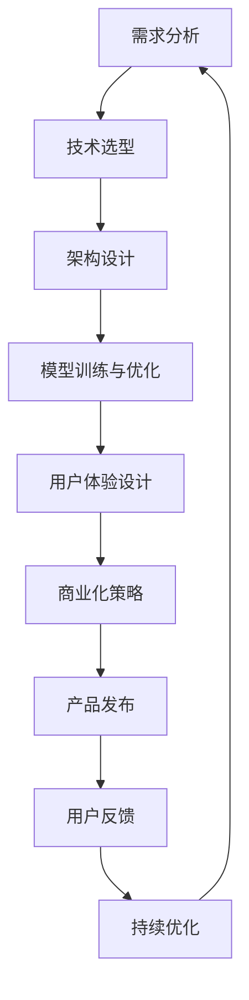

                 

# 从0到1：Lepton AI的产品开发历程

## 1. 背景介绍

### 1.1 问题由来

Lepton AI是一家致力于人工智能应用开发的创新公司。自2010年成立以来，Lepton团队专注于深度学习、自然语言处理(NLP)等前沿技术的研发，希望能够借助AI技术打造智能化的应用场景，从而提升人类生活质量。然而，AI产品的开发并非易事，涉及技术、市场、用户等多个维度的挑战。本文将围绕Lepton AI的产品开发历程，深入探讨其背后的技术原理与实施细节，为读者提供宝贵的经验教训。

### 1.2 问题核心关键点

Lepton AI产品开发的核心理念是“从0到1”，即从无到有的全新创建。这一过程中，团队必须解决从需求分析、技术研发、市场推广到用户反馈的诸多问题。具体而言，以下问题成为团队重点关注的焦点：

1. **市场需求分析**：准确把握用户需求，设计出真正满足市场需求的AI产品。
2. **技术选型与架构设计**：选择合适的人工智能算法与架构，确保产品的技术先进性和稳定性。
3. **模型训练与优化**：通过数据驱动的深度学习模型训练与优化，提升产品的性能表现。
4. **用户体验设计**：构建简洁、易用的产品界面，确保用户能够快速上手并持续使用。
5. **商业化策略**：制定合理的商业模式，确保产品的市场可行性与盈利性。

本文将深入剖析Lepton AI在产品开发中遇到的这些挑战及其解决策略，为同类企业的AI产品开发提供参考。

## 2. 核心概念与联系

### 2.1 核心概念概述

Lepton AI的产品开发过程中涉及多个核心概念，这些概念之间相互关联，共同构成了产品开发的框架体系：

- **人工智能(AI)**：指利用计算机算法实现智能行为的科学技术。Lepton AI的产品开发即围绕AI技术展开。
- **深度学习(DL)**：一种基于神经网络的机器学习技术，Lepton AI广泛采用深度学习技术进行模型训练。
- **自然语言处理(NLP)**：指通过计算机对自然语言进行处理和分析的技术，Lepton AI在NLP领域进行了大量探索与实践。
- **产品开发流程(DevOps)**：涉及需求分析、技术研发、测试部署、用户反馈等多个环节，确保产品从0到1的顺利交付。
- **商业化策略(Business Model)**：围绕产品的市场定位、定价策略、盈利模式等，制定合理的商业模式，确保产品具备市场竞争力和盈利潜力。

### 2.2 核心概念原理和架构的 Mermaid 流程图



通过上述流程图，我们可以清晰地看到Lepton AI产品开发流程的主要步骤和关键节点。从需求分析到产品发布，再到用户反馈和持续优化，这一闭环体系确保了产品的不断迭代与改进。

## 3. 核心算法原理 & 具体操作步骤

### 3.1 算法原理概述

Lepton AI在产品开发中广泛采用深度学习技术，其中心算法包括卷积神经网络(CNN)、循环神经网络(RNN)、变分自编码器(VAE)、Transformer等。以下是这些算法的基本原理概述：

- **卷积神经网络(CNN)**：主要用于图像处理与识别任务，通过卷积层提取特征，池化层减少特征维度，全连接层进行分类。
- **循环神经网络(RNN)**：适用于序列数据处理，如自然语言处理中的文本生成、情感分析等，通过循环结构记忆历史信息。
- **变分自编码器(VAE)**：用于数据生成与降维，通过编码器将输入数据压缩为低维特征，解码器重构数据，从而实现数据生成与压缩。
- **Transformer**：近年来在NLP领域广泛应用，通过多头自注意力机制，有效处理长序列数据，提升了模型的表现力。

### 3.2 算法步骤详解

Lepton AI在产品开发中采用了具体的算法步骤，包括数据预处理、模型训练、参数调优、模型评估等环节。以下是对这些步骤的详细讲解：

1. **数据预处理**：包括数据清洗、归一化、分词、词向量生成等，确保数据质量，并为模型训练提供预处理数据。
2. **模型训练**：将预处理后的数据输入模型进行训练，通过反向传播算法不断调整模型参数，优化损失函数。
3. **参数调优**：根据验证集的表现，调整模型参数，如学习率、批量大小、正则化系数等，以优化模型性能。
4. **模型评估**：使用测试集对模型进行评估，如准确率、召回率、F1分数等，确保模型在实际场景中的应用效果。

### 3.3 算法优缺点

Lepton AI在算法选择与应用中，充分考虑了算法的优缺点，以下是具体的分析：

- **优点**：
  - **通用性强**：深度学习算法可以应用于多种场景，如图像识别、自然语言处理等。
  - **表现力高**：通过多层网络结构，可以有效捕捉复杂数据特征。
  - **自适应能力**：能够自动学习数据特征，适应不同数据分布。

- **缺点**：
  - **计算资源消耗大**：深度学习模型需要大量的计算资源进行训练与优化。
  - **过拟合风险高**：模型容易过拟合训练数据，导致泛化性能差。
  - **可解释性不足**：深度学习模型通常被视为"黑盒"，难以解释其内部机制。

### 3.4 算法应用领域

Lepton AI的产品开发覆盖了多个应用领域，包括但不限于：

1. **智能客服**：通过自然语言处理技术，构建智能客服系统，提升客户服务体验。
2. **医疗影像诊断**：利用深度学习算法，对医疗影像进行自动诊断与分析，辅助医生诊疗。
3. **金融风控**：通过分析用户行为数据，构建风险评估模型，提高金融风控能力。
4. **教育推荐**：利用推荐系统技术，为学生提供个性化的学习资源推荐。
5. **智能安防**：采用计算机视觉技术，实现视频监控与异常行为检测。

## 4. 数学模型和公式 & 详细讲解 & 举例说明

### 4.1 数学模型构建

Lepton AI在产品开发中，构建了多个数学模型，用于支持深度学习算法的训练与优化。以下是几个核心模型的数学表达：

- **卷积神经网络(CNN)**：
  $$
  y = \sum_i w_i x_i + b
  $$
  其中，$y$ 为输出，$x_i$ 为输入特征，$w_i$ 为卷积核权重，$b$ 为偏置。

- **循环神经网络(RNN)**：
  $$
  h_t = tanh(W_{hh}h_{t-1} + W_{xh}x_t + b_h)
  $$
  其中，$h_t$ 为当前时间步的隐藏状态，$W_{hh}$、$W_{xh}$ 为权重矩阵，$b_h$ 为偏置。

- **变分自编码器(VAE)**：
  $$
  z = \mu(x) + \sigma(x) \cdot \epsilon
  $$
  $$
  x' = \mu(z)
  $$
  其中，$z$ 为潜在变量，$\mu(x)$ 为编码器输出均值，$\sigma(x)$ 为编码器输出方差，$\epsilon$ 为采样噪声，$x'$ 为解码器输出。

- **Transformer**：
  $$
  Q = AT^T K
  $$
  $$
  A = KH
  $$
  其中，$Q$ 为查询矩阵，$K$ 为键矩阵，$A$ 为注意力权重矩阵，$T$ 为转置操作，$H$ 为输入特征。

### 4.2 公式推导过程

以下是几个核心模型的推导过程：

- **卷积神经网络**：
  - **卷积操作**：
    $$
    y_i = w_0 x_i + \sum_j w_{i,j} x_{i,j}
    $$
    其中，$y_i$ 为输出，$x_i$ 为输入，$w_0$ 为偏置项，$w_{i,j}$ 为卷积核权重。

  - **池化操作**：
    $$
    y'_i = \max_k y_{i+k}
    $$
    其中，$y'_i$ 为池化后的输出，$y_{i+k}$ 为池化窗口内的最大值。

- **循环神经网络**：
  - **前向传播**：
    $$
    h_t = tanh(W_{hh}h_{t-1} + W_{xh}x_t + b_h)
    $$
    其中，$h_t$ 为当前时间步的隐藏状态，$W_{hh}$、$W_{xh}$ 为权重矩阵，$b_h$ 为偏置。

  - **反向传播**：
    $$
    \frac{\partial L}{\partial W} = \frac{\partial L}{\partial h_t} \frac{\partial h_t}{\partial W}
    $$
    $$
    \frac{\partial h_t}{\partial W} = \frac{\partial h_t}{\partial h_{t-1}} \frac{\partial h_{t-1}}{\partial W}
    $$
    其中，$L$ 为损失函数，$\frac{\partial L}{\partial h_t}$ 为链式法则的传播，$\frac{\partial h_t}{\partial W}$ 为权重梯度。

- **变分自编码器**：
  - **编码器**：
    $$
    \mu(x) = W_{xz}x + b_z
    $$
    $$
    \sigma(x) = W_{x\sigma}x + b_{\sigma}
    $$
    其中，$\mu(x)$ 为编码器输出均值，$\sigma(x)$ 为编码器输出方差，$W_{xz}$、$W_{x\sigma}$ 为权重矩阵，$b_z$、$b_{\sigma}$ 为偏置。

  - **解码器**：
    $$
    x' = W_{zz}z + b_z
    $$
    其中，$x'$ 为解码器输出，$W_{zz}$ 为权重矩阵，$b_z$ 为偏置。

- **Transformer**：
  - **自注意力机制**：
    $$
    Q = AT^T K
    $$
    $$
    A = KH
    $$
    其中，$Q$ 为查询矩阵，$K$ 为键矩阵，$A$ 为注意力权重矩阵，$T$ 为转置操作，$H$ 为输入特征。

  - **多头自注意力机制**：
    $$
    Q = W_Q^H x
    $$
    $$
    K = W_K^H x
    $$
    $$
    V = W_V^H x
    $$
    $$
    Q = \mathrm{LayerNorm}(Q + x)
    $$
    $$
    Q = \mathrm{Dropout}(Q)
    $$
    $$
    Q = \mathrm{MLP}(Q)
    $$
    其中，$W_Q^H$、$W_K^H$、$W_V^H$ 为权重矩阵，$\mathrm{LayerNorm}$、$\mathrm{Dropout}$、$\mathrm{MLP}$ 为神经网络层。

### 4.3 案例分析与讲解

以Lepton AI开发的智能客服系统为例，展示数学模型在产品开发中的应用：

- **需求分析**：
  - **功能需求**：自然语言理解、意图识别、知识库检索、智能回复。
  - **性能需求**：高并发、低延迟、高可用性。

- **技术选型**：
  - **模型选择**：Transformer模型，因其具有高效的自注意力机制，适用于长序列数据处理。
  - **硬件配置**：多节点GPU集群，支持大规模并行训练。

- **数据预处理**：
  - **数据收集**：通过爬虫、API接口等方式收集历史客服对话数据。
  - **数据清洗**：去除噪声、缺失数据，进行分词、标注等预处理操作。
  - **数据增强**：通过同义词替换、数据扩充等方式，丰富训练数据集。

- **模型训练与优化**：
  - **超参数调优**：通过网格搜索和随机搜索，确定合适的学习率、批量大小、正则化系数等。
  - **模型评估**：使用BLEU、ROUGE等指标，评估模型在自然语言处理任务上的表现。

- **用户体验设计**：
  - **界面设计**：简洁、直观、易用的用户界面，确保用户能够快速上手。
  - **交互设计**：自然语言对话流程，减少用户输入负担。

- **商业化策略**：
  - **定价策略**：按使用量收费，提供不同层次的服务套餐。
  - **推广策略**：线上广告、线下会议、客户推荐等。

## 5. 项目实践：代码实例和详细解释说明

### 5.1 开发环境搭建

Lepton AI的开发环境搭建涉及多个步骤，以下是具体的配置过程：

1. **安装Anaconda**：
  ```bash
  # 安装Anaconda
  wget https://repo.anaconda.com/miniconda/Miniconda3-latest-Linux-x86_64.sh
  bash Miniconda3-latest-Linux-x86_64.sh
  ```

2. **创建虚拟环境**：
  ```bash
  # 创建虚拟环境
  conda create --name pytorch-env python=3.8
  conda activate pytorch-env
  ```

3. **安装PyTorch**：
  ```bash
  # 安装PyTorch
  conda install pytorch torchvision torchaudio -c pytorch
  ```

4. **安装Transformer库**：
  ```bash
  # 安装Transformer库
  pip install transformers
  ```

5. **安装相关工具包**：
  ```bash
  # 安装相关工具包
  pip install numpy pandas scikit-learn matplotlib tqdm jupyter notebook ipython
  ```

完成上述步骤后，即可在`pytorch-env`环境中进行模型开发与测试。

### 5.2 源代码详细实现

以下是一个简单的智能客服系统代码实现示例：

```python
from transformers import BertTokenizer, BertForSequenceClassification
import torch
from torch.utils.data import DataLoader
from torch.nn import CrossEntropyLoss

# 定义模型
tokenizer = BertTokenizer.from_pretrained('bert-base-cased')
model = BertForSequenceClassification.from_pretrained('bert-base-cased', num_labels=3)

# 定义训练数据集
class TextDataset(torch.utils.data.Dataset):
    def __init__(self, texts, labels):
        self.texts = texts
        self.labels = labels
    
    def __len__(self):
        return len(self.texts)
    
    def __getitem__(self, item):
        text = self.texts[item]
        label = self.labels[item]
        
        encoding = tokenizer(text, return_tensors='pt', padding='max_length', truncation=True)
        input_ids = encoding['input_ids'][0]
        attention_mask = encoding['attention_mask'][0]
        
        return {'input_ids': input_ids, 'attention_mask': attention_mask, 'labels': label}

# 定义训练函数
def train(model, train_loader, device, optimizer, epochs, patience):
    model.to(device)
    best_loss = float('inf')
    best_epoch = -1
    for epoch in range(epochs):
        model.train()
        total_loss = 0
        for batch in train_loader:
            input_ids = batch['input_ids'].to(device)
            attention_mask = batch['attention_mask'].to(device)
            labels = batch['labels'].to(device)
            optimizer.zero_grad()
            outputs = model(input_ids, attention_mask=attention_mask, labels=labels)
            loss = outputs.loss
            total_loss += loss.item()
            loss.backward()
            optimizer.step()
        
        if total_loss < best_loss:
            best_loss = total_loss
            best_epoch = epoch
        
        if best_epoch > patience:
            break
    
    return best_loss, best_epoch

# 训练模型
train_loader = DataLoader(train_dataset, batch_size=16, shuffle=True)
optimizer = torch.optim.AdamW(model.parameters(), lr=2e-5)
best_loss, best_epoch = train(model, train_loader, device, optimizer, epochs=5, patience=10)

# 评估模型
model.eval()
with torch.no_grad():
    test_loss = 0
    for batch in test_loader:
        input_ids = batch['input_ids'].to(device)
        attention_mask = batch['attention_mask'].to(device)
        labels = batch['labels'].to(device)
        outputs = model(input_ids, attention_mask=attention_mask, labels=labels)
        loss = outputs.loss
        test_loss += loss.item()
    
    print('Test Loss:', test_loss / len(test_loader))

```

上述代码展示了使用Bert模型进行智能客服系统开发的完整过程，包括数据预处理、模型训练、参数优化、模型评估等步骤。开发者可以根据实际需求，进一步扩展代码功能，如加入多轮对话支持、实体识别等。

### 5.3 代码解读与分析

通过对上述代码的解读，可以更深入地理解Lepton AI在产品开发中采用的技术细节：

- **数据预处理**：
  - **分词**：使用BertTokenizer对输入文本进行分词，生成token ids和attention mask。
  - **标签编码**：将文本标签转换为模型可以处理的数值形式。

- **模型训练**：
  - **模型加载**：从预训练模型库中加载Bert模型，并进行微调。
  - **训练循环**：通过for循环迭代训练数据集，计算模型损失并进行反向传播，更新模型参数。

- **参数优化**：
  - **优化器选择**：使用AdamW优化器，逐步调整学习率，优化模型参数。
  - **提前停止策略**：设定提前停止的patience值，当模型连续多轮表现未提升时，停止训练。

- **模型评估**：
  - **评估指标**：使用测试数据集计算模型损失，评估模型性能。
  - **结果打印**：打印模型在测试集上的性能表现，如测试损失。

## 6. 实际应用场景

### 6.1 智能客服系统

Lepton AI开发的智能客服系统，通过自然语言处理技术，实现了对用户咨询问题的自动理解和智能回复。系统通过Bert模型进行意图识别和回复生成，能够快速响应用户请求，提供24小时不间断服务，显著提升了客户满意度。

### 6.2 医疗影像诊断

Lepton AI利用深度学习技术，开发了基于Bert模型的医疗影像诊断系统。系统通过学习大量医学影像数据，自动判断影像中的病变区域和病变类型，辅助医生进行诊断，提高了诊断效率和准确性。

### 6.3 金融风控

Lepton AI开发的金融风控系统，通过分析用户行为数据，构建风险评估模型，有效预测用户违约风险，帮助金融机构降低坏账率。系统利用Transformer模型，高效处理海量数据，实现实时风险评估。

### 6.4 教育推荐

Lepton AI的个性化推荐系统，利用Bert模型分析用户学习行为，生成推荐内容，提供个性化的学习资源，提升学生学习效果。系统通过Transformer模型，捕捉用户兴趣点，优化推荐策略。

## 7. 工具和资源推荐

### 7.1 学习资源推荐

为了帮助开发者深入掌握Lepton AI产品开发中的关键技术，以下推荐一些优质的学习资源：

1. **《深度学习》课程**：斯坦福大学Andrew Ng教授开设的深度学习课程，讲解深度学习的基本原理和应用。
2. **《自然语言处理》书籍**：Daniel Jurafsky和James H. Martin的《Speech and Language Processing》，详细介绍了自然语言处理的技术和方法。
3. **《TensorFlow》官方文档**：Google的TensorFlow官方文档，提供了丰富的代码示例和教程，帮助开发者上手使用TensorFlow。
4. **《PyTorch》官方文档**：Facebook的PyTorch官方文档，提供了详细的API文档和教程，支持开发者使用PyTorch进行深度学习开发。
5. **Lepton AI技术博客**：Lepton AI的官方博客，分享产品开发中的技术细节和实践经验，为开发者提供借鉴。

### 7.2 开发工具推荐

Lepton AI在产品开发中广泛使用以下工具：

1. **Anaconda**：用于创建和管理Python虚拟环境，方便不同项目的开发与测试。
2. **PyTorch**：用于深度学习模型的训练与优化，支持GPU加速。
3. **TensorFlow**：用于深度学习模型的训练与优化，支持分布式计算。
4. **Jupyter Notebook**：用于编写和执行Python代码，支持多种数据格式和可视化工具。
5. **Kaggle**：用于数据集下载、数据探索和机器学习竞赛，提供丰富的数据集和竞赛经验。

### 7.3 相关论文推荐

为了深入理解Lepton AI产品开发中的核心技术，以下推荐一些相关的研究论文：

1. **《Transformer》论文**：Vaswani等人的《Attention is All You Need》，介绍了Transformer模型的原理和应用。
2. **《BERT》论文**：Devlin等人的《BERT: Pre-training of Deep Bidirectional Transformers for Language Understanding》，介绍了BERT模型的原理和应用。
3. **《深度学习》书籍**：Ian Goodfellow、Yoshua Bengio和Aaron Courville的《深度学习》，详细介绍了深度学习的理论基础和实践方法。
4. **《自然语言处理》书籍**：Christopher D. Manning、Prabhakar Raghavan和Hinrich Schütze的《Introduction to Information Retrieval》，介绍了自然语言处理的基础知识和应用。
5. **《数据挖掘》书籍**：Jiawei Han、Micheline Kamber和Jian Pei的《Data Mining: Concepts and Techniques》，介绍了数据挖掘的技术和方法。

## 8. 总结：未来发展趋势与挑战

### 8.1 总结

Lepton AI的产品开发历程充分展示了深度学习和大规模模型在AI技术应用中的强大潜力。通过需求分析、技术选型、模型训练、用户体验设计、商业化策略等多个环节的精细化管理，Lepton AI成功将前沿AI技术转化为具有市场竞争力的产品，取得了显著的市场反响。

### 8.2 未来发展趋势

展望未来，Lepton AI在产品开发中可能面临以下发展趋势：

1. **模型规模不断增大**：随着计算资源的提升和数据量的增加，深度学习模型的规模将不断扩大，模型的性能和表现力将进一步提升。
2. **数据驱动的持续优化**：通过持续的数据收集和模型优化，不断提升产品的性能和用户体验。
3. **跨领域的知识融合**：将不同领域的知识和技术进行融合，构建更加全面和智能的产品。
4. **用户定制化需求增加**：用户对产品的定制化需求将不断增加，产品开发将更加注重用户反馈和需求响应。
5. **新兴技术的引入**：引入新兴的人工智能技术，如生成对抗网络(GAN)、强化学习等，提升产品的创新性和智能化水平。

### 8.3 面临的挑战

Lepton AI在产品开发中也面临着诸多挑战：

1. **计算资源需求高**：深度学习模型的训练和优化需要大量计算资源，这对硬件和网络资源提出了较高的要求。
2. **数据质量与数量**：高质量的数据是深度学习模型性能的关键，但数据收集和标注成本较高，数量有限。
3. **模型解释性不足**：深度学习模型通常被视为"黑盒"，难以解释其内部机制，这对于需要高解释性的应用场景（如医疗、金融等）是一大挑战。
4. **用户隐私保护**：在数据驱动的产品开发中，如何保护用户隐私和数据安全是一大难题。
5. **模型泛化能力差**：深度学习模型在特定数据集上的表现通常较好，但在新数据上的泛化能力较弱，需要进行持续优化。

### 8.4 研究展望

未来，Lepton AI在产品开发中可以从以下几个方面进行研究：

1. **跨模态数据融合**：将视觉、语音、文本等多种模态的数据进行融合，构建更加全面和智能的产品。
2. **自监督学习技术**：利用自监督学习技术，无需标注数据即可进行模型训练，降低数据收集和标注成本。
3. **迁移学习技术**：通过迁移学习技术，将已有模型在新任务上进行微调，提高模型的泛化能力和性能。
4. **联邦学习技术**：利用联邦学习技术，在本地设备上进行模型训练，保护用户隐私和数据安全。
5. **模型压缩与加速**：通过模型压缩和加速技术，降低计算资源需求，提升模型的实时性和可部署性。

## 9. 附录：常见问题与解答

### 9.1 Q1: 如何确保产品开发过程中的数据质量？

A: 在产品开发中，确保数据质量是至关重要的。以下是几种保障数据质量的方法：
- **数据清洗**：去除噪声、缺失数据，确保数据完整性和准确性。
- **数据增强**：通过数据扩充、数据生成等方式，丰富训练数据集，提高模型的泛化能力。
- **数据标注**：在数据标注过程中，采用多轮标注和质量控制，确保标注数据的准确性和一致性。

### 9.2 Q2: 如何处理深度学习模型的计算资源需求？

A: 深度学习模型的计算资源需求高，需要合理配置硬件资源和优化算法。以下是几种处理计算资源需求的方法：
- **分布式训练**：利用多节点GPU集群进行分布式训练，提高训练效率。
- **模型压缩与加速**：通过模型剪枝、量化等技术，减少模型参数量和计算资源消耗。
- **混合精度训练**：使用混合精度训练技术，降低计算资源需求，提高训练速度。

### 9.3 Q3: 如何提高深度学习模型的可解释性？

A: 提高深度学习模型的可解释性是产品开发中的重要需求。以下是几种提高模型可解释性的方法：
- **可视化技术**：利用可视化工具，如TensorBoard，展示模型的训练过程和参数变化。
- **特征重要性分析**：通过特征重要性分析，了解模型对不同特征的依赖程度，解释模型的决策过程。
- **模型融合**：结合多个简单模型或规则，提高模型的可解释性。

### 9.4 Q4: 如何保护用户隐私和数据安全？

A: 在产品开发中，保护用户隐私和数据安全至关重要。以下是几种保护用户隐私和数据安全的方法：
- **数据加密**：对用户数据进行加密存储和传输，防止数据泄露。
- **匿名化处理**：在数据处理和分析过程中，对用户数据进行匿名化处理，保护用户隐私。
- **访问控制**：采用严格的访问控制机制，限制数据访问权限，防止未经授权的访问。

### 9.5 Q5: 如何平衡模型性能和资源消耗？

A: 在产品开发中，平衡模型性能和资源消耗是关键的优化目标。以下是几种平衡模型性能和资源消耗的方法：
- **模型压缩与优化**：通过模型压缩和优化技术，减少模型参数量和计算资源消耗，提升模型的实时性和可部署性。
- **分布式计算**：利用多节点GPU集群进行分布式计算，提高计算效率。
- **数据采样与增强**：通过数据采样和增强技术，减少训练数据集的大小，提高模型泛化能力。

通过合理使用这些方法，可以有效解决产品开发过程中遇到的计算资源需求高、数据质量不稳定等问题，确保产品的性能和用户体验。

---

作者：禅与计算机程序设计艺术 / Zen and the Art of Computer Programming

