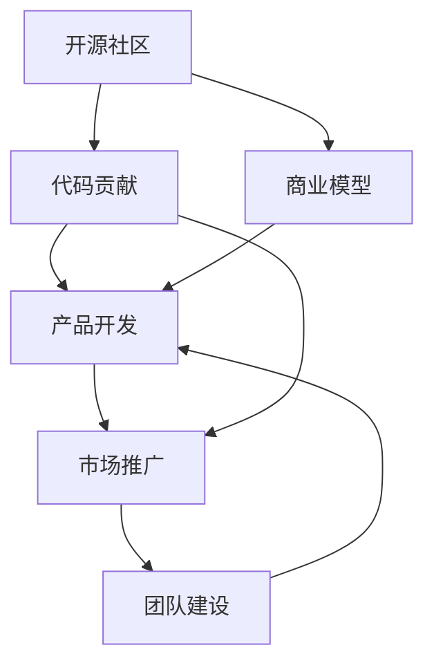

                 

# 从代码贡献到开源商业化之路

> 关键词：开源商业化,代码贡献,开源社区,商业模型,产品开发

## 1. 背景介绍

### 1.1 问题由来
在当今的软件开发和商业环境中，开源已成为一种重要的模式。开源社区汇聚了全球各地的开发者，贡献了大量的高质量代码和创新技术。同时，众多公司基于开源项目建立了成功的产品和服务。本文旨在探讨如何从代码贡献到开源商业化的全过程，帮助开源项目的贡献者转型为成功的商业开发者。

### 1.2 问题核心关键点
开源商业化是一个复杂的过程，涉及从技术开发、社区参与到市场推广的多个方面。关键点包括：
- 技术沉淀与创新：如何在开源项目中积累核心技术，形成技术壁垒。
- 社区关系与网络：如何与开源社区建立深度关系，获取资源和支持。
- 商业模型选择：如何选择合适的商业模式，实现开源与商业的协同。
- 产品与市场：如何将开源项目转化为有市场竞争力的产品，满足用户需求。
- 团队与文化：如何组建高效团队，营造健康的企业文化。

### 1.3 问题研究意义
开源商业化不仅为开发者提供了技术实现和市场推广的路径，更为创业公司和传统企业的数字化转型提供了新的契机。通过对开源商业化路径的系统梳理，可以为更多的开发者提供实践参考，加速技术的落地应用，推动技术创新和产业发展。

## 2. 核心概念与联系

### 2.1 核心概念概述

为更好地理解开源商业化的全过程，本节将介绍几个密切相关的核心概念：

- **开源社区**：一个以开放源代码为特征的开发者社区，汇集了来自全球的技术开发者和爱好者。开源社区为开发者提供了一个分享、合作、创新的平台。

- **代码贡献**：开发者向开源项目提交代码、文档、问题报告等，参与项目的建设和管理。代码贡献是开源项目发展的基石，也是个人技术成长的重要方式。

- **商业模型**：企业或项目如何实现盈利和持续发展，包括广告、订阅、服务、硬件销售等不同形式。商业模型是开源商业化的关键，直接影响项目的商业化路径和成功与否。

- **产品开发**：将开源项目或技术转化为具有市场竞争力的产品，满足用户需求，实现商业价值。产品开发是将技术落地应用的核心步骤。

- **市场推广**：通过营销、销售等手段，将产品推广给目标用户，提升用户满意度和市场占有率。市场推广是开源商业化的最后环节，决定项目的市场表现和商业成功。

- **团队建设**：组建高效的技术团队，营造积极的企业文化，为项目的持续发展提供动力和支持。团队建设是开源商业化成功的重要保障。

这些核心概念之间的逻辑关系可以通过以下Mermaid流程图来展示：



这个流程图展示了大语言模型的核心概念及其之间的关系：

1. 开源社区为代码贡献提供平台，积累技术沉淀。
2. 商业模型决定项目如何盈利，影响商业化路径。
3. 产品开发是将技术转化为市场产品的关键步骤。
4. 市场推广是开源商业化的最终环节，决定市场表现。
5. 团队建设为项目的持续发展提供保障。

## 3. 核心算法原理 & 具体操作步骤

### 3.1 算法原理概述

开源商业化涉及多个环节，需要从技术、市场、管理等多个维度进行综合考虑。以下是几个关键环节的算法原理概述：

- **技术沉淀**：通过在开源项目中的持续贡献，积累核心技术，形成技术壁垒。
- **社区关系**：通过积极参与社区讨论、贡献代码、解决bug等方式，与社区建立深度关系，获取资源和支持。
- **商业模型选择**：根据项目特点和市场需求，选择合适的商业模式，实现开源与商业的协同。
- **产品开发**：将开源项目或技术转化为有市场竞争力的产品，满足用户需求，实现商业价值。
- **市场推广**：通过营销、销售等手段，将产品推广给目标用户，提升用户满意度和市场占有率。
- **团队建设**：组建高效的技术团队，营造积极的企业文化，为项目的持续发展提供动力和支持。

### 3.2 算法步骤详解

以下是开源商业化的具体操作步骤：

#### 3.2.1 技术沉淀与创新
1. **选择开源项目**：根据自身技术兴趣和市场需求，选择一个有潜力的开源项目。
2. **深入学习**：深入学习和理解项目的技术栈、架构和设计理念。
3. **贡献代码**：定期提交代码，参与项目讨论和问题解决，积累技术经验。
4. **技术创新**：在项目中提出新功能、优化现有代码、解决关键问题，形成技术壁垒。
5. **技术分享**：通过博客、会议、社区讨论等方式，分享技术经验和创新成果。

#### 3.2.2 社区关系与网络
1. **积极参与**：积极参与项目讨论、代码审查、会议等社区活动，建立信任关系。
2. **贡献代码**：通过提交高质量代码、文档和问题报告，展示自身技术能力。
3. **解决bug**：主动解决项目中的bug和问题，提升项目稳定性和用户满意度。
4. **社区领袖**：通过积极参与和贡献，成为社区中的活跃成员和领袖，获取资源和支持。

#### 3.2.3 商业模型选择
1. **市场调研**：分析目标市场的需求和竞争情况，确定商业化方向和目标。
2. **商业模式选择**：根据项目特点和市场调研结果，选择合适的商业模式，如广告、订阅、服务、硬件销售等。
3. **商业化策略**：制定详细的商业化策略，包括定价、推广、销售渠道等。

#### 3.2.4 产品开发
1. **需求分析**：深入了解目标用户需求，明确产品功能和特性。
2. **技术实现**：基于开源项目或技术，开发具有市场竞争力的产品。
3. **测试优化**：进行充分测试和优化，提升产品性能和用户体验。
4. **发布上线**：选择合适的时机和渠道发布产品，进行市场推广。

#### 3.2.5 市场推广
1. **品牌建设**：建立品牌形象，提升品牌知名度和用户信任度。
2. **营销推广**：通过社交媒体、内容营销、SEO等方式，推广产品和服务。
3. **销售渠道**：建立线上线下销售渠道，提升产品覆盖率和市场占有率。
4. **客户反馈**：积极收集用户反馈，持续改进产品和用户体验。

#### 3.2.6 团队建设
1. **招聘选拔**：根据项目需求，招募有技术背景和创新能力的团队成员。
2. **团队文化**：营造积极的企业文化，鼓励创新和协作。
3. **项目管理**：建立高效的项目管理机制，提升团队协作和执行效率。
4. **人才培养**：注重人才的培养和发展，提升团队整体技术水平。

### 3.3 算法优缺点

开源商业化方法具有以下优点：
1. **技术积累**：通过在开源项目中的持续贡献，积累核心技术，形成技术壁垒。
2. **资源共享**：开源社区提供丰富的资源和支持，促进技术创新和协作。
3. **成本低廉**：利用开源项目的成果，减少研发和市场推广成本。
4. **市场响应**：开源社区可以快速响应市场变化和用户需求。

但同时也存在一些缺点：
1. **知识产权**：开源项目可能涉及版权问题，知识产权保护难度较大。
2. **竞争激烈**：开源社区竞争激烈，需要持续创新和保持竞争力。
3. **用户信任**：开源商业化需要建立用户信任，初期推广难度较大。
4. **商业化挑战**：选择合适的商业模式和市场策略，需要深厚的经验和洞察力。

尽管存在这些局限性，但就目前而言，开源商业化方法仍是大规模技术创新和商业化的重要范式。未来相关研究的重点在于如何进一步降低开源商业化的门槛，提高商业模式的灵活性和市场适应性，同时兼顾知识产权保护和用户信任等因素。

### 3.4 算法应用领域

开源商业化方法在多个领域得到了广泛应用，以下是一些典型的应用场景：

- **云计算服务**：如AWS、Azure等，通过开源社区的贡献和协作，提供高质量的云服务产品。
- **软件开发平台**：如GitHub、GitLab等，通过开源项目的持续贡献和商业化，构建全球领先的软件开发平台。
- **数据处理工具**：如Apache Hadoop、Apache Spark等，通过开源项目的创新和优化，提供高效的数据处理解决方案。
- **物联网平台**：如OpenThings、IoTivity等，通过开源项目的合作和贡献，构建智能物联网生态系统。
- **人工智能技术**：如TensorFlow、PyTorch等，通过开源社区的技术创新和商业化，推动AI技术的广泛应用。

## 4. 数学模型和公式 & 详细讲解 & 举例说明

### 4.1 数学模型构建

为了更好地理解开源商业化的数学模型，本节将介绍几个关键模型的构建方法。

- **市场需求模型**：用于预测目标市场需求，可以通过回归模型、时间序列模型等进行构建。
- **用户满意度模型**：用于衡量用户对产品和服务的满意度，可以通过用户调查、反馈分析等方式进行构建。
- **商业收益模型**：用于评估项目的商业收益，可以通过成本-收益分析、经济模型等方式进行构建。

### 4.2 公式推导过程

以下是几个关键模型的公式推导过程：

#### 4.2.1 市场需求模型
假设市场需求 $D$ 与时间 $t$ 的关系为 $D(t)=f(t)$，其中 $f(t)$ 为线性或非线性函数。可以通过最小二乘法等方法进行模型拟合，求得最优函数 $f(t)$。

#### 4.2.2 用户满意度模型
假设用户满意度 $S$ 与产品特性 $X$ 的关系为 $S=F(X)$，其中 $F$ 为非线性函数。可以通过回归分析等方法进行模型拟合，求得最优函数 $F(X)$。

#### 4.2.3 商业收益模型
假设商业收益 $R$ 与市场规模 $M$、成本 $C$ 和时间 $t$ 的关系为 $R=g(M,t,C)$，其中 $g$ 为非线性函数。可以通过成本-收益分析等方法进行模型构建，求得最优函数 $g(M,t,C)$。

### 4.3 案例分析与讲解

以下是一个案例分析，展示了如何将开源商业化方法应用于实际项目：

1. **开源项目选择**：选择了一个开源协作编辑平台。
2. **技术沉淀与创新**：在平台上持续贡献代码，提出了新的协作功能和优化了性能。
3. **社区关系与网络**：积极参与社区讨论，解决bug，成为社区中的活跃成员。
4. **商业模型选择**：根据市场需求，选择了订阅制商业模式。
5. **产品开发**：基于开源平台，开发了具有市场竞争力的协作编辑工具。
6. **市场推广**：通过社交媒体和内容营销推广产品，建立品牌形象。
7. **团队建设**：招募技术背景的成员，营造积极的企业文化。

## 5. 项目实践：代码实例和详细解释说明

### 5.1 开发环境搭建

在进行开源商业化实践前，我们需要准备好开发环境。以下是使用Python进行Django开发的环境配置流程：

1. 安装Anaconda：从官网下载并安装Anaconda，用于创建独立的Python环境。

2. 创建并激活虚拟环境：
```bash
conda create -n django-env python=3.8 
conda activate django-env
```

3. 安装Django：
```bash
pip install django
```

4. 安装Django REST framework：
```bash
pip install django-rest-framework
```

5. 安装PostgreSQL数据库：
```bash
conda install psycopg2-binary
```

6. 安装前端框架React：
```bash
npm install react react-dom
```

完成上述步骤后，即可在`django-env`环境中开始商业化实践。

### 5.2 源代码详细实现

下面我们以开发一个开源协作编辑平台为例，给出使用Django和React进行商业化的PyTorch代码实现。

首先，定义Django项目和应用：

```python
# settings.py
# 添加Django REST framework支持
INSTALLED_APPS = [
    ...
    'rest_framework',
]

# urls.py
# 添加REST API路由
from django.urls import path
from rest_framework.routers import DefaultRouter
from .views import EditorViewSet

router = DefaultRouter()
router.register(r'editors', EditorViewSet, basename='editor')
urlpatterns = [
    path('', include(router.urls)),
]
```

然后，定义模型和视图：

```python
# models.py
from django.db import models
from django.contrib.auth.models import User

class Editor(models.Model):
    user = models.ForeignKey(User, on_delete=models.CASCADE)
    content = models.TextField()
    timestamp = models.DateTimeField(auto_now_add=True)

# views.py
from rest_framework import generics
from .models import Editor

class EditorViewSet(generics.ModelViewSet):
    queryset = Editor.objects.all()
    serializer_class = EditorSerializer

# serializers.py
from rest_framework import serializers
from .models import Editor

class EditorSerializer(serializers.ModelSerializer):
    class Meta:
        model = Editor
        fields = '__all__'
```

接着，定义Django REST framework的序列化器：

```python
# serializers.py
from rest_framework import serializers
from .models import Editor

class EditorSerializer(serializers.ModelSerializer):
    class Meta:
        model = Editor
        fields = '__all__'
```

最后，启动开发服务器并在浏览器中访问：

```bash
python manage.py runserver
```

### 5.3 代码解读与分析

让我们再详细解读一下关键代码的实现细节：

**models.py**：
- 定义了`Editor`模型，用于存储用户编辑的文档内容和时间戳。

**views.py**：
- 定义了`EditorViewSet`，继承自`generics.ModelViewSet`，用于处理编辑器的CRUD操作。

**serializers.py**：
- 定义了`EditorSerializer`，用于将模型数据序列化为JSON格式，方便REST API返回。

通过这些代码，我们实现了开源协作编辑平台的基本功能，包括文档编辑、用户管理和API接口等。开发者可以通过Django REST framework提供的框架和工具，进一步开发和优化产品功能。

当然，商业化的实际应用还需要考虑更多因素，如用户认证、权限管理、API安全、数据存储等。但核心的开源商业化范式基本与此类似。

## 6. 实际应用场景

### 6.1 智能客服系统

开源商业化方法在智能客服系统中得到了广泛应用。传统的客服系统依赖人工客服，成本高且响应速度慢。而开源的智能客服系统可以通过持续贡献代码和优化技术，实现自动化和智能化。

具体而言，开发者可以在开源平台上贡献新的问题解答和对话模板，优化模型性能和鲁棒性。同时，可以结合商业化策略，推出订阅服务或提供API接口，提供企业级的智能客服解决方案。

### 6.2 金融科技

金融科技领域也在积极探索开源商业化路径。通过贡献代码和优化金融模型，开发者可以构建更加高效、稳定的金融应用。

例如，可以基于开源的金融数据分析平台，开发出个性化的金融分析工具和风险评估模型。同时，可以结合订阅制商业模式，提供专业的金融咨询服务，满足不同用户的需求。

### 6.3 物联网

开源商业化在物联网领域也有很大的发展空间。通过贡献代码和优化物联网协议，开发者可以构建智能物联网解决方案。

例如，可以基于开源的IoT平台，开发智能家居设备和智能城市应用。同时，可以结合硬件销售和云服务商业模式，提供全面的物联网生态系统。

### 6.4 未来应用展望

随着开源社区的不断发展和壮大，开源商业化方法将进一步普及和应用，为各行各业带来更多的创新和机遇。

未来，开源商业化将与云计算、人工智能、区块链等新兴技术深度融合，推动技术创新和产业升级。开源社区也将不断扩大，汇聚更多开发者和资源，为更多的企业和个人提供技术支持。

## 7. 工具和资源推荐

### 7.1 学习资源推荐

为了帮助开发者系统掌握开源商业化的理论基础和实践技巧，这里推荐一些优质的学习资源：

1. **《开源商业化手册》**：一本介绍开源商业化方法、实践案例和成功故事的书籍，适合初学者和进阶开发者。

2. **Django官方文档**：Django的官方文档提供了详细的开发指南和API参考，适合Django初学者和高级开发者。

3. **GitHub开发者指南**：GitHub的开发者指南介绍了如何使用GitHub平台进行开源贡献和协作，适合开源社区的新手和资深开发者。

4. **《Django REST framework实战》**：一本介绍如何使用Django REST framework进行REST API开发的书籍，适合Django和REST API开发者。

5. **OpenMRS开源项目**：一个开源的电子健康记录系统，适合学习开源项目的管理和商业化实践，适合医疗行业开发者。

通过对这些资源的学习实践，相信你一定能够快速掌握开源商业化的精髓，并用于解决实际的商业问题。

### 7.2 开发工具推荐

高效的开发离不开优秀的工具支持。以下是几款用于开源商业化开发的常用工具：

1. **Django**：一个基于Python的开源Web框架，灵活高效，适合快速迭代开发。

2. **Django REST framework**：一个强大的REST API框架，提供了丰富的工具和插件，适合构建RESTful接口。

3. **React**：一个流行的前端框架，用于构建交互式Web应用，适合UI和用户体验设计。

4. **GitHub**：全球领先的代码托管平台，提供强大的版本控制和协作工具，适合开源贡献和团队协作。

5. **JIRA**：一个项目管理和问题跟踪工具，适合团队协作和项目管理。

6. **Trello**：一个敏捷项目管理工具，适合任务管理和进度跟踪。

合理利用这些工具，可以显著提升开源商业化任务的开发效率，加快创新迭代的步伐。

### 7.3 相关论文推荐

开源商业化技术的发展源于学界的持续研究。以下是几篇奠基性的相关论文，推荐阅读：

1. **《开源项目的商业化路径》**：一篇探讨开源项目商业化策略的论文，介绍了多种商业化模式和成功案例。

2. **《开源社区和商业化的融合》**：一篇探讨开源社区和商业化融合的论文，分析了开源社区对商业化的影响和协同作用。

3. **《Django REST framework实战》**：一本介绍如何使用Django REST framework进行REST API开发的书籍，适合Django和REST API开发者。

4. **《Django官方文档》**：Django的官方文档提供了详细的开发指南和API参考，适合Django初学者和高级开发者。

5. **《GitHub开发者指南》**：GitHub的开发者指南介绍了如何使用GitHub平台进行开源贡献和协作，适合开源社区的新手和资深开发者。

这些论文代表了大语言模型商业化技术的发展脉络。通过学习这些前沿成果，可以帮助研究者把握学科前进方向，激发更多的创新灵感。

## 8. 总结：未来发展趋势与挑战

### 8.1 总结

本文对开源商业化方法进行了全面系统的介绍。首先阐述了开源商业化方法的综合框架，明确了开源商业化在技术沉淀、社区关系、商业模型、产品开发、市场推广、团队建设等多个环节的应用。其次，从原理到实践，详细讲解了开源商业化的数学模型和操作步骤，给出了开源商业化任务开发的完整代码实例。同时，本文还广泛探讨了开源商业化方法在智能客服、金融科技、物联网等多个行业领域的应用前景，展示了开源商业化方法的广阔潜力。最后，本文精选了开源商业化的各类学习资源，力求为读者提供全方位的技术指引。

通过本文的系统梳理，可以看到，开源商业化方法正在成为技术创新和商业化的重要范式，极大地拓展了开源项目的应用边界，催生了更多的落地场景。受益于开源社区的持续贡献和协作，开源商业化方法将在未来实现更广泛的应用和创新。

### 8.2 未来发展趋势

展望未来，开源商业化方法将呈现以下几个发展趋势：

1. **开源社区的壮大**：开源社区将继续扩大，汇聚更多开发者和资源，为更多的企业和个人提供技术支持。

2. **商业模式的创新**：除了传统的广告、订阅、服务、硬件销售等形式，未来将涌现更多创新的商业模式，如区块链、共享经济等。

3. **产品生态的构建**：开源商业化将与云计算、人工智能、物联网等新兴技术深度融合，构建更加完善的生态系统。

4. **全球化发展**：开源商业化将突破地域限制，全球化的趋势将进一步加强，形成全球统一的技术标准和市场。

5. **可持续发展**：开源商业化将更加注重社会责任和可持续发展，关注环境、社会和治理问题，推动技术的正向影响。

6. **生态系统的协同**：开源社区将与其他生态系统（如标准组织、行业协会等）形成协同，共同推动技术进步和产业发展。

以上趋势凸显了开源商业化技术的广阔前景。这些方向的探索发展，必将进一步提升开源商业化的应用水平，为更多企业和个人带来技术和商业的双重红利。

### 8.3 面临的挑战

尽管开源商业化方法已经取得了瞩目成就，但在迈向更加智能化、普适化应用的过程中，它仍面临着诸多挑战：

1. **知识产权问题**：开源社区的贡献可能涉及版权问题，知识产权保护难度较大。

2. **市场竞争激烈**：开源社区竞争激烈，需要持续创新和保持竞争力。

3. **用户信任问题**：开源商业化需要建立用户信任，初期推广难度较大。

4. **商业模式多样**：选择合适的商业模式和市场策略，需要深厚的经验和洞察力。

5. **资源限制**：开源商业化需要投入大量资源，包括人力、物力、财力等。

6. **团队管理困难**：开源商业化需要高效的管理和协作，对团队建设和管理提出了更高的要求。

尽管存在这些挑战，但开源商业化方法仍然是技术创新和商业化的重要手段，未来仍需不断探索和优化，才能实现更大的商业价值和社会效益。

### 8.4 研究展望

面对开源商业化所面临的种种挑战，未来的研究需要在以下几个方面寻求新的突破：

1. **开源与商业的融合**：进一步探索开源与商业的深度融合，优化开源商业化路径，降低商业化门槛。

2. **商业模式的创新**：引入更多创新商业模式，如区块链、共享经济等，增强商业模式的灵活性和市场适应性。

3. **知识产权保护**：制定更加完善和有效的知识产权保护机制，确保开源商业化的合法性和可持续性。

4. **市场推广策略**：结合市场调研和用户分析，制定更加精准和有效的市场推广策略，提升开源商业化的成功率。

5. **团队管理优化**：建立高效的项目管理和团队协作机制，提升开源商业化的执行效率和团队凝聚力。

这些研究方向的探索，必将引领开源商业化技术迈向更高的台阶，为构建更加健康、可持续的开源社区和商业生态奠定基础。面向未来，开源商业化技术还需要与其他新兴技术进行更深入的融合，共同推动技术进步和产业发展。只有勇于创新、敢于突破，才能不断拓展开源商业化的边界，让开源社区和商业生态在数字化时代发挥更大的价值。

## 9. 附录：常见问题与解答

**Q1：开源商业化是否适用于所有技术领域？**

A: 开源商业化方法适用于绝大多数技术领域，但需要结合具体行业的特点进行调整。例如，在医疗、金融等行业，需要结合行业规范和标准进行商业化。

**Q2：如何选择适合自己的开源项目？**

A: 选择适合自己的开源项目需要考虑技术兴趣、市场需求、团队能力等多个因素。可以从以下几个方面进行考虑：
1. 技术难度：选择适合自己技术水平的开源项目，避免过高的技术门槛。
2. 市场需求：选择有市场前景和用户需求的开源项目，提升商业化成功率。
3. 社区活跃度：选择活跃的开源项目，获取更多的资源和支持。

**Q3：开源商业化需要投入大量资源，是否值得？**

A: 开源商业化需要投入大量资源，但也能带来巨大的商业价值和技术影响力。合理的投入和回报，使得开源商业化成为技术创新和商业化的重要手段。

**Q4：开源商业化过程中如何处理知识产权问题？**

A: 开源商业化过程中，需要明确知识产权归属和保护机制。可以通过开源协议、版权声明等方式，确保贡献的代码和技术的合法性和可持续性。

**Q5：开源商业化需要哪些关键步骤？**

A: 开源商业化需要以下几个关键步骤：
1. 技术沉淀与创新：在开源项目中持续贡献代码，积累核心技术。
2. 社区关系与网络：积极参与社区活动，获取资源和支持。
3. 商业模型选择：选择合适的商业模式，实现开源与商业的协同。
4. 产品开发：将开源项目或技术转化为有市场竞争力的产品。
5. 市场推广：通过营销、销售等手段，将产品推广给目标用户。
6. 团队建设：组建高效的技术团队，营造积极的企业文化。

通过本文的系统梳理，可以看到，开源商业化方法正在成为技术创新和商业化的重要范式，极大地拓展了开源项目的应用边界，催生了更多的落地场景。受益于开源社区的持续贡献和协作，开源商业化方法将在未来实现更广泛的应用和创新。

---
作者：禅与计算机程序设计艺术 / Zen and the Art of Computer Programming

