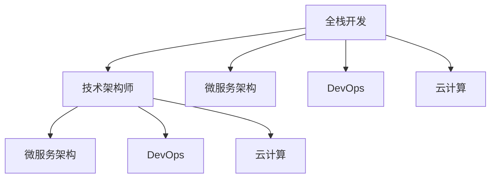

                 

# 从全栈开发到技术架构师的进阶

## 1. 背景介绍

### 1.1 问题由来
随着科技的飞速发展，IT行业从最早的系统维护逐步演进到软件开发，再到如今的数字化转型。全栈开发工程师（Full-stack Developer）在这个过程中扮演着越来越重要的角色。他们不仅需要掌握前端和后端的开发技能，还需要具备架构设计和项目管理能力，以应对不断变化的技术需求和市场挑战。然而，随着企业对技术架构的重视程度日益加深，技术架构师（Technical Architect）逐渐成为企业创新和发展的关键角色。技术架构师不仅具备全面的技术能力，更能够从全局视角出发，规划系统的整体架构，确保系统稳定、高效、可扩展。

### 1.2 问题核心关键点
从全栈开发到技术架构师，不仅是对技术能力的提升，更是一次从局部到全局的认知转变。核心关键点包括但不限于以下几个方面：
- 系统设计能力：理解系统的整体架构和模块关系，能够设计出稳定、可扩展的系统。
- 技术决策能力：具备深度和广度的技术视野，能够根据业务需求选择合适的技术方案。
- 团队管理能力：能够协调不同技术栈之间的协作，推动团队高效协作。
- 持续学习能力：技术更新迭代快速，持续学习和适应新技术是必备能力。
- 跨部门沟通能力：技术架构师需要与业务部门、产品部门紧密合作，确保技术方案符合业务需求。

### 1.3 问题研究意义
研究从全栈开发到技术架构师的角色转变，对于提升IT项目的成功率、提高企业的技术创新能力和市场竞争力具有重要意义：
- 提高项目成功率：技术架构师能够从全局视角审视问题，规划合理的技术架构，确保项目顺利进行。
- 加速技术创新：技术架构师具备深厚的技术积累和前瞻性的技术视野，能够推动企业技术迭代和创新。
- 提升市场竞争力：技术架构师能够设计出具备竞争力的技术方案，帮助企业在市场中占据优势地位。

## 2. 核心概念与联系

### 2.1 核心概念概述

为了更好地理解从全栈开发到技术架构师的进阶，首先需要明确几个关键概念：

- **全栈开发（Full-stack Development）**：指同时具备前端和后端开发能力，能够完成从用户界面到数据库的全面开发工作。全栈开发工程师需要掌握多种编程语言和技术栈，如前端开发（HTML、CSS、JavaScript）、后端开发（Python、Java、Node.js）等。
- **技术架构师（Technical Architect）**：主要负责规划和设计系统的整体架构，确保系统高效、可扩展、易维护。技术架构师不仅需要具备全面的技术能力，更需要具备设计思维和战略规划能力。
- **微服务架构（Microservices Architecture）**：将系统拆分为多个独立的微服务模块，每个微服务专注于单一功能，通过轻量级通信机制相互协作，提高系统的灵活性和可扩展性。
- **DevOps**：融合了开发（Development）和运维（Operations）的理念，倡导持续集成、持续交付和持续监控，提升软件的交付效率和稳定性。
- **云计算（Cloud Computing）**：利用云计算平台提供的资源和服务，实现系统的弹性扩展和资源共享，降低企业的IT成本。

这些概念之间的逻辑关系可以通过以下Mermaid流程图来展示：



这个流程图展示了一名全栈开发工程师通过技术进阶，成长为技术架构师的过程，以及技术架构师在微服务、DevOps和云计算等领域的广泛应用。

## 3. 核心算法原理 & 具体操作步骤

### 3.1 算法原理概述

从全栈开发到技术架构师，涉及的知识面和技术栈更加广泛。核心算法原理和操作步骤主要包括以下几个方面：

1. **系统设计**：理解系统的整体架构，设计出稳定、可扩展的系统。
2. **技术决策**：根据业务需求选择合适的技术方案，确保技术选型符合业务目标。
3. **团队管理**：协调不同技术栈之间的协作，推动团队高效协作。
4. **持续学习**：持续学习和适应新技术，确保技术能力与市场需求保持同步。
5. **跨部门沟通**：与业务部门、产品部门紧密合作，确保技术方案符合业务需求。

### 3.2 算法步骤详解

从全栈开发到技术架构师的进阶，涉及的步骤主要包括：

**Step 1: 技术积累与深造**
- 全面掌握前端和后端开发技能，掌握多种编程语言和技术栈。
- 深入学习设计模式、架构设计等相关知识，提升系统设计能力。

**Step 2: 实践经验积累**
- 参与实际项目开发，积累项目经验，理解业务需求和技术瓶颈。
- 学习DevOps理念，掌握持续集成、持续交付和持续监控的实践方法。

**Step 3: 技术架构设计**
- 分析现有系统的架构缺陷，提出改进方案。
- 设计新系统的整体架构，确保系统稳定、可扩展、易维护。

**Step 4: 技术选型与决策**
- 根据业务需求，选择合适的技术方案和工具。
- 评估不同技术的优缺点，做出最优的技术决策。

**Step 5: 团队协作与管理**
- 协调不同技术栈之间的协作，推动团队高效协作。
- 培训团队成员，提升团队整体技术水平。

**Step 6: 持续学习与适应**
- 持续学习新技术和新方法，提升个人技术能力。
- 关注行业动态，及时调整技术方案，保持技术前沿性。

**Step 7: 跨部门沟通与合作**
- 与业务部门、产品部门紧密合作，理解业务需求和技术挑战。
- 提出技术方案，与业务部门进行充分沟通和协商。

### 3.3 算法优缺点

从全栈开发到技术架构师的进阶，其优缺点如下：

**优点**：
1. **全面技术能力**：具备前端和后端的开发技能，能够全面理解系统的技术实现。
2. **系统设计能力**：能够设计出稳定、可扩展的系统架构。
3. **决策能力**：具备深度和广度的技术视野，能够根据业务需求选择合适的技术方案。
4. **管理能力**：能够协调不同技术栈之间的协作，推动团队高效协作。

**缺点**：
1. **知识面广**：需要掌握多种编程语言和技术栈，学习成本较高。
2. **时间投入**：从全栈开发到技术架构师需要大量时间和精力进行学习和实践。
3. **团队协作难度**：需要具备较强的沟通和协调能力，处理团队内部冲突。

### 3.4 算法应用领域

从全栈开发到技术架构师的进阶，其应用领域非常广泛，涵盖以下几个方面：

1. **企业内部系统架构设计**：设计企业内部业务系统的整体架构，确保系统的稳定性和可扩展性。
2. **云原生架构设计**：设计云原生应用架构，利用云计算平台提供的资源和服务，实现系统的弹性扩展和资源共享。
3. **DevOps实践**：推动企业内部的DevOps实践，实现持续集成、持续交付和持续监控，提升软件的交付效率和稳定性。
4. **大数据架构设计**：设计大数据系统的整体架构，利用大数据技术处理和分析海量数据，提升业务决策能力。
5. **人工智能架构设计**：设计人工智能系统的整体架构，利用人工智能技术提升业务智能化水平。

## 4. 数学模型和公式 & 详细讲解 & 举例说明

### 4.1 数学模型构建

在技术架构设计中，数学模型和公式的应用主要体现在以下几个方面：

1. **系统性能模型**：通过数学模型计算系统在不同负载下的性能表现，如响应时间、吞吐量等。
2. **资源规划模型**：通过数学模型计算系统的资源需求，如CPU、内存、存储等，确保系统的高效运行。
3. **网络模型**：通过数学模型计算网络带宽和延迟，确保系统的高效通信。

### 4.2 公式推导过程

以下以系统性能模型为例，推导其计算公式：

假设系统在负载 $n$ 下的响应时间为 $t(n)$，则系统性能模型为：

$$
P(n) = \frac{1}{t(n)}
$$

其中 $P(n)$ 表示系统性能，单位为请求每秒（requests per second，RPS）。

在实际应用中，可以通过历史数据和监控数据来拟合上述模型，并通过数学推导得到系统的性能预测公式。

### 4.3 案例分析与讲解

以企业内部的电商系统为例，分析如何利用系统性能模型进行性能优化：

1. **性能评估**：收集系统的历史负载数据和监控数据，计算在不同负载下的响应时间。
2. **模型拟合**：使用数学模型拟合系统性能，得到系统性能模型。
3. **性能预测**：根据业务预测流量变化，使用系统性能模型预测系统在不同负载下的响应时间。
4. **优化方案**：根据性能预测结果，优化系统架构，增加计算资源、调整缓存策略等，提升系统性能。

## 5. 项目实践：代码实例和详细解释说明

### 5.1 开发环境搭建

进行技术架构设计和实施时，需要搭建良好的开发环境。以下是使用Java+Spring Boot进行开发的环境配置流程：

1. 安装JDK：从官网下载并安装Java Development Kit（JDK）。
2. 安装Maven：从官网下载并安装Maven，用于管理项目依赖。
3. 安装Spring Boot：从官网下载并安装Spring Boot，用于快速构建Web应用。
4. 配置IDE：配置好IntelliJ IDEA或Eclipse等IDE，支持Java开发。

完成上述步骤后，即可在IDE中开始技术架构设计和实施。

### 5.2 源代码详细实现

以下是一个简单的技术架构设计实现示例，展示如何使用Spring Boot构建微服务架构：

1. 创建Spring Boot项目：
```java
mvn archetype:generate -DgroupId=com.example -DartifactId=my-app -DarchetypeArtifactId=maven-archetype-quickstart
```

2. 编写微服务代码：
```java
@RestController
@RequestMapping("/api")
public class UserServiceController {
    @Autowired
    private UserService userService;

    @GetMapping("/users")
    public List<User> getAllUsers() {
        return userService.getAllUsers();
    }

    @GetMapping("/users/{id}")
    public User getUserById(@PathVariable("id") Long id) {
        return userService.getUserById(id);
    }
}
```

3. 配置Spring Boot应用：
```java
@SpringBootApplication
public class Application {
    public static void main(String[] args) {
        SpringApplication.run(Application.class, args);
    }
}
```

4. 部署微服务：
```java
mvn spring-boot:run
```

通过上述代码实现，可以初步构建一个微服务架构的应用，实现用户信息的增删改查功能。

### 5.3 代码解读与分析

让我们再详细解读一下关键代码的实现细节：

**Spring Boot控制器**：
- `@RestController`注解：用于定义控制器类，表示该类中包含了Web请求的映射信息。
- `@RequestMapping`注解：用于映射URL请求，定义控制器方法的URL路径。
- `@Autowired`注解：用于自动装配服务层对象，简化依赖注入。
- `@GetMapping`注解：用于映射GET请求，自动生成URL路径。

**Spring Boot服务层**：
- `@Autowired`注解：用于自动装配依赖对象。
- `public`方法：定义服务层接口，提供核心业务逻辑。

**Spring Boot应用配置**：
- `@SpringBootApplication`注解：用于配置Spring Boot应用，包含Spring MVC、Spring Boot自动配置和组件扫描等功能。
- `@SpringBootApplication`注解中的`main`方法：用于启动Spring Boot应用，创建Spring容器。

通过上述代码实现，可以看到Spring Boot框架简化了微服务的开发和部署，提升了开发效率。

### 5.4 运行结果展示

在完成微服务架构的构建和部署后，可以在浏览器中访问应用，进行用户信息的增删改查操作。同时，利用Spring Boot的监控功能，可以在控制台中实时查看应用运行状态和性能指标。

## 6. 实际应用场景

### 6.1 电商系统架构设计

电商系统是一个典型的技术架构设计案例。以下展示如何利用技术架构设计提升电商系统的性能和稳定性：

1. **系统架构设计**：将电商系统拆分为多个独立的微服务模块，如用户管理、商品管理、订单管理等，每个微服务专注于单一功能，通过轻量级通信机制相互协作。
2. **性能优化**：通过监控数据和数学模型，预测系统在不同负载下的响应时间，优化系统资源配置，提升系统性能。
3. **弹性扩展**：利用云平台提供的弹性扩展功能，根据业务流量变化动态调整资源配置，确保系统的高效运行。

### 6.2 金融系统架构设计

金融系统是一个高度复杂的技术架构设计案例。以下展示如何利用技术架构设计提升金融系统的安全性和可靠性：

1. **系统架构设计**：设计出稳定、可扩展的系统架构，利用微服务模块划分业务功能，确保系统的高可用性和可扩展性。
2. **安全设计**：设计安全机制，如身份认证、权限控制、加密传输等，确保系统的安全性和隐私保护。
3. **性能优化**：通过监控数据和数学模型，预测系统在不同负载下的响应时间，优化系统资源配置，提升系统性能。
4. **弹性扩展**：利用云平台提供的弹性扩展功能，根据业务流量变化动态调整资源配置，确保系统的高效运行。

### 6.3 医疗系统架构设计

医疗系统是一个需要高度可靠性的技术架构设计案例。以下展示如何利用技术架构设计提升医疗系统的稳定性和可扩展性：

1. **系统架构设计**：设计出稳定、可扩展的系统架构，利用微服务模块划分业务功能，确保系统的高可用性和可扩展性。
2. **数据安全**：设计数据安全机制，如数据加密、访问控制等，确保医疗数据的隐私和安全性。
3. **性能优化**：通过监控数据和数学模型，预测系统在不同负载下的响应时间，优化系统资源配置，提升系统性能。
4. **弹性扩展**：利用云平台提供的弹性扩展功能，根据业务流量变化动态调整资源配置，确保系统的高效运行。

## 7. 工具和资源推荐

### 7.1 学习资源推荐

为了帮助开发者系统掌握技术架构设计的理论基础和实践技巧，这里推荐一些优质的学习资源：

1. **《大型网站技术架构（第三版）》**：介绍大型网站的架构设计、开发和运维经验，涵盖前端、后端、数据库、分布式等技术栈。
2. **《Spring Boot实战》**：详细介绍Spring Boot的开发和部署方法，涵盖Spring MVC、Web、RESTful API等技术。
3. **《微服务架构实践》**：介绍微服务架构的设计、开发和运维方法，涵盖Docker、Kubernetes等技术。
4. **《DevOps实践》**：详细介绍DevOps的理念、工具和实践方法，涵盖持续集成、持续交付、持续监控等技术。
5. **《云计算基础》**：详细介绍云计算平台的架构设计、开发和运维方法，涵盖AWS、Azure、Google Cloud等技术。

通过这些资源的学习实践，相信你一定能够快速掌握技术架构设计的精髓，并用于解决实际的系统设计和开发问题。

### 7.2 开发工具推荐

高效的开发离不开优秀的工具支持。以下是几款用于技术架构设计和实施开发的常用工具：

1. **IntelliJ IDEA**：Java开发的主流IDE，集成了开发、调试、测试、部署等功能，支持Spring Boot、Maven等。
2. **Eclipse**：Java开发的另一主流IDE，支持Java开发、调试和测试等功能。
3. **Spring Boot**：快速构建Web应用的框架，支持RESTful API、Spring MVC等功能。
4. **Docker**：容器化开发和部署工具，支持微服务模块的打包和部署。
5. **Kubernetes**：容器编排和部署平台，支持微服务模块的自动扩展和资源管理。

合理利用这些工具，可以显著提升技术架构设计和实施的开发效率，加快创新迭代的步伐。

### 7.3 相关论文推荐

技术架构设计的不断发展，得益于学界的持续研究。以下是几篇奠基性的相关论文，推荐阅读：

1. **《大型网站技术架构》**：介绍大型网站的架构设计、开发和运维经验，涵盖前端、后端、数据库、分布式等技术栈。
2. **《Spring Boot实战》**：详细介绍Spring Boot的开发和部署方法，涵盖Spring MVC、Web、RESTful API等技术。
3. **《微服务架构实践》**：介绍微服务架构的设计、开发和运维方法，涵盖Docker、Kubernetes等技术。
4. **《DevOps实践》**：详细介绍DevOps的理念、工具和实践方法，涵盖持续集成、持续交付、持续监控等技术。
5. **《云计算基础》**：详细介绍云计算平台的架构设计、开发和运维方法，涵盖AWS、Azure、Google Cloud等技术。

这些论文代表了大语言模型微调技术的发展脉络。通过学习这些前沿成果，可以帮助研究者把握学科前进方向，激发更多的创新灵感。

## 8. 总结：未来发展趋势与挑战

### 8.1 总结

本文对从全栈开发到技术架构师的角色转变进行了全面系统的介绍。首先阐述了技术架构师的重要性和核心关键点，明确了技术架构师从全栈开发到技术架构师的角色转变过程。其次，从原理到实践，详细讲解了技术架构设计的数学原理和关键步骤，给出了技术架构设计和实施的完整代码实例。同时，本文还广泛探讨了技术架构师在电商、金融、医疗等众多行业领域的应用前景，展示了技术架构设计技术的巨大潜力。最后，本文精选了技术架构设计的各类学习资源，力求为读者提供全方位的技术指引。

通过本文的系统梳理，可以看到，从全栈开发到技术架构师的进阶，不仅是一次技术能力的提升，更是一次从局部到全局的认知转变。技术架构师需要具备全面的技术能力、系统设计能力、决策能力、管理能力、持续学习能力以及跨部门沟通能力，才能真正成为企业技术创新的关键角色。

### 8.2 未来发展趋势

展望未来，技术架构设计技术将呈现以下几个发展趋势：

1. **微服务架构普及**：微服务架构将成为企业系统设计的主流范式，进一步提升系统的灵活性和可扩展性。
2. **DevOps全流程自动化**：DevOps理念将进一步深入，实现持续集成、持续交付和持续监控的全流程自动化，提升软件交付效率和稳定性。
3. **云原生技术融合**：云原生技术将进一步融合到系统设计中，实现系统的弹性扩展和资源共享，降低企业IT成本。
4. **人工智能和区块链的应用**：人工智能和区块链技术将进一步应用于系统设计中，提升系统的智能化水平和安全性。
5. **多模态系统的设计**：多模态系统设计将更加普及，涵盖视觉、语音、文本等多种模态，提升系统的全面感知能力。

以上趋势凸显了技术架构设计技术的广阔前景。这些方向的探索发展，必将进一步提升企业系统的性能和应用范围，为企业的数字化转型和创新发展提供新的技术路径。

### 8.3 面临的挑战

尽管技术架构设计技术已经取得了瞩目成就，但在迈向更加智能化、普适化应用的过程中，它仍面临着诸多挑战：

1. **复杂度管理**：微服务架构和云原生技术的引入，带来了系统的复杂度增加，如何管理系统的复杂度是一大挑战。
2. **性能优化**：系统规模的增大，带来了性能瓶颈的增加，如何优化系统的性能是一大挑战。
3. **安全保障**：系统的复杂度和规模的增大，带来了安全性的问题，如何保障系统的安全性是一大挑战。
4. **成本控制**：云原生技术的引入，带来了资源消耗的增加，如何控制系统的成本是一大挑战。
5. **技术演进**：技术的更新迭代速度加快，如何保持技术的前沿性是一大挑战。

这些挑战需要技术架构师在实践中进行不断探索和优化，才能确保技术架构设计的成功和可持续性。

### 8.4 研究展望

面向未来，技术架构设计的不断演进，需要在以下几个方面寻求新的突破：

1. **复杂度管理技术**：开发复杂度管理工具，帮助技术架构师更好地管理系统的复杂度。
2. **高性能优化技术**：开发高性能优化工具，帮助技术架构师更好地优化系统的性能。
3. **安全保障技术**：开发安全保障工具，帮助技术架构师更好地保障系统的安全性。
4. **成本控制技术**：开发成本控制工具，帮助技术架构师更好地控制系统的成本。
5. **技术演进跟踪**：开发技术演进跟踪工具，帮助技术架构师更好地跟踪技术的发展。

这些研究方向的探索，必将引领技术架构设计技术的进一步发展，为企业的数字化转型和创新发展提供新的技术路径。总之，技术架构设计技术需要从全局视角出发，综合考虑系统复杂度、性能、安全性、成本和技术演进等多方面因素，才能确保系统的成功和可持续性。

## 9. 附录：常见问题与解答

**Q1：如何理解从全栈开发到技术架构师的角色转变？**

A: 从全栈开发到技术架构师的角色转变，不仅是对技术能力的提升，更是一次从局部到全局的认知转变。技术架构师需要具备全面的技术能力、系统设计能力、决策能力、管理能力、持续学习能力以及跨部门沟通能力，才能真正成为企业技术创新的关键角色。

**Q2：技术架构师需要进行哪些技能培训？**

A: 技术架构师需要进行以下技能培训：
1. 系统设计：理解系统的整体架构，设计出稳定、可扩展的系统。
2. 技术决策：根据业务需求选择合适的技术方案，确保技术选型符合业务目标。
3. 团队管理：协调不同技术栈之间的协作，推动团队高效协作。
4. 持续学习：持续学习和适应新技术，确保技术能力与市场需求保持同步。
5. 跨部门沟通：与业务部门、产品部门紧密合作，确保技术方案符合业务需求。

**Q3：技术架构设计需要考虑哪些因素？**

A: 技术架构设计需要考虑以下因素：
1. 系统性能：通过数学模型计算系统在不同负载下的性能表现，确保系统的高效运行。
2. 资源规划：通过数学模型计算系统的资源需求，确保系统的高效运行。
3. 网络模型：通过数学模型计算网络带宽和延迟，确保系统的高效通信。
4. 安全性：设计安全机制，确保系统的安全性和隐私保护。
5. 弹性扩展：利用云平台提供的弹性扩展功能，确保系统的高效运行。

**Q4：技术架构师的工作流程是什么？**

A: 技术架构师的工作流程包括：
1. 技术积累与深造：全面掌握前端和后端开发技能，深入学习设计模式、架构设计等相关知识。
2. 实践经验积累：参与实际项目开发，积累项目经验，理解业务需求和技术瓶颈。
3. 技术架构设计：分析现有系统的架构缺陷，提出改进方案，设计新系统的整体架构。
4. 技术选型与决策：根据业务需求，选择合适的技术方案和工具。
5. 团队协作与管理：协调不同技术栈之间的协作，推动团队高效协作。
6. 持续学习与适应：持续学习新技术和新方法，提升个人技术能力。
7. 跨部门沟通与合作：与业务部门、产品部门紧密合作，确保技术方案符合业务需求。

通过本文的系统梳理，可以看到，从全栈开发到技术架构师的进阶，不仅是一次技术能力的提升，更是一次从局部到全局的认知转变。技术架构师需要具备全面的技术能力、系统设计能力、决策能力、管理能力、持续学习能力以及跨部门沟通能力，才能真正成为企业技术创新的关键角色。未来，随着技术的不断演进和应用场景的不断拓展，技术架构设计技术将继续引领企业数字化转型的新一轮发展。

