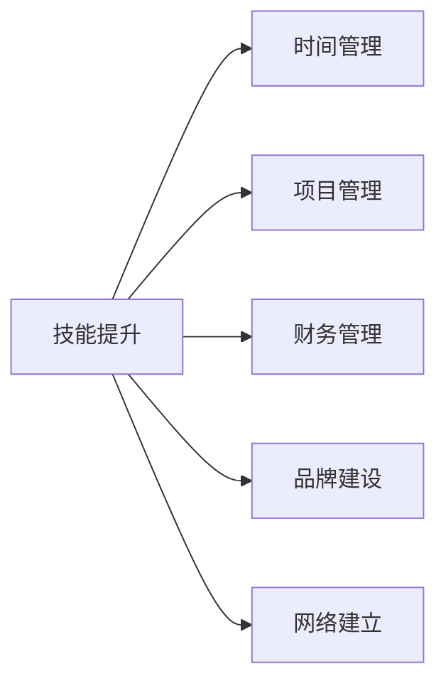

                 

# 从员工到自由职业者的转型指南

> 关键词：职业转型,自由职业,技能提升,自我管理,财务管理,网络建立

## 1. 背景介绍

### 1.1 问题由来

在当今快速发展的技术环境中，越来越多的人开始考虑从传统的雇佣模式转向自由职业模式。这不仅是由于技术进步带来的新机遇，也是对工作灵活性、自主性和工作生活平衡的追求。然而，这一转型过程并非易事，需要系统性的规划和准备。本文旨在为即将踏上自由职业道路的开发者提供一份详细的转型指南，帮助他们顺利过渡到自由职业模式，最大化其职业潜力和收益。

### 1.2 问题核心关键点

自由职业转型涉及的核心关键点包括：
- **技能提升**：评估现有技能，识别并提升成为自由职业者的必要技能。
- **自我管理**：建立有效的时间管理、任务管理和项目管理能力。
- **财务管理**：掌握财务规划、成本控制和税务管理。
- **网络建立**：构建和维护专业人脉网络，获取更多项目和合作机会。
- **品牌建设**：打造个人品牌，提高市场竞争力。

本文将从这些核心关键点出发，详细探讨每个方面的策略和实践，帮助读者顺利完成从员工到自由职业者的转型。

## 2. 核心概念与联系

### 2.1 核心概念概述

在探讨自由职业转型时，涉及的核心概念包括：
- **技能矩阵**：评估当前技能水平，识别技能缺口，规划学习路径。
- **时间管理**：有效规划和分配时间，提高工作效率。
- **项目管理**：使用敏捷和迭代方法，管理项目进度和交付质量。
- **财务管理**：理解基本的财务术语和概念，进行预算规划和税务管理。
- **品牌建设**：通过在线展示、博客、社交媒体等渠道，建立和推广个人品牌。
- **网络建立**：参加行业活动、加入专业社群，扩大人脉网络。

这些概念之间的联系可以通过以下Mermaid流程图来展示：



这个流程图展示了一名自由职业者需要掌握的关键技能及其相互关系。

## 3. 核心算法原理 & 具体操作步骤
### 3.1 算法原理概述

自由职业者的转型过程，本质上是一个自我提升和管理优化的系统工程。其核心算法原理包括：

- **技能提升算法**：通过评估当前技能，识别技能缺口，制定学习计划，提升专业技能。
- **时间管理算法**：根据任务优先级和时间管理工具，规划每日、每周和每月的任务安排。
- **项目管理算法**：使用敏捷开发、迭代方法，跟踪任务进展，确保项目按时交付。
- **财务管理算法**：通过预算规划、成本控制和税务管理，确保财务健康。
- **品牌建设算法**：通过持续输出高质量内容，建立专业形象，吸引更多客户和合作机会。
- **网络建立算法**：通过参加行业活动、社交媒体互动等方式，扩大人脉网络。

### 3.2 算法步骤详解

以下是对每个核心算法步骤的详细说明：

#### 3.2.1 技能提升算法

1. **技能评估**：列出当前拥有的技能和兴趣，识别与目标自由职业角色所需的技能差距。
2. **技能学习**：制定学习计划，包括在线课程、工作坊、认证考试等，提升缺失的技能。
3. **实践应用**：通过实际项目或兼职工作，将新学到的技能应用于实践中。

#### 3.2.2 时间管理算法

1. **任务优先级**：根据任务的重要性和截止日期，划分任务的优先级。
2. **时间分配**：使用工具（如Google Calendar、Trello）规划每日、每周和每月的任务安排。
3. **效率提升**：采用番茄工作法、时间块等时间管理技巧，提高工作效率。

#### 3.2.3 项目管理算法

1. **任务分解**：将大项目分解为可管理的子任务。
2. **进度跟踪**：使用Jira、Asana等工具，实时跟踪项目进展。
3. **风险管理**：识别潜在风险，制定应急预案。

#### 3.2.4 财务管理算法

1. **预算规划**：制定月度或年度预算，控制开支。
2. **成本控制**：监控实际开支与预算之间的差异，及时调整。
3. **税务管理**：了解自由职业者的税务规定，按时申报纳税。

#### 3.2.5 品牌建设算法

1. **内容输出**：通过博客、GitHub项目、社交媒体等渠道，定期输出高质量内容。
2. **客户获取**：利用个人品牌吸引潜在客户和合作伙伴。
3. **反馈迭代**：根据客户反馈和项目成果，持续优化服务质量。

#### 3.2.6 网络建立算法

1. **行业活动**：参加行业会议、研讨会，扩大人脉网络。
2. **社交媒体**：积极参与LinkedIn、GitHub等平台，建立专业形象。
3. **合作项目**：通过自由职业平台（如Upwork、Freelancer）参与合作项目，积累经验。

### 3.3 算法优缺点

自由职业转型算法的优点包括：
- **灵活性高**：自由职业提供了更高的工作灵活性，能够根据个人兴趣和市场需求调整工作内容。
- **自主性强**：自由职业者可以根据自己的节奏工作，享受更多的自由时间。
- **自我驱动**：自由职业转型过程中，需要高度的自我驱动和自我管理能力。

同时，也存在一些挑战：
- **市场竞争激烈**：自由职业市场上竞争激烈，需要不断提升自己的技能和品牌。
- **收入不稳定**：自由职业的收入可能不稳定，需要良好的财务规划和风险管理。
- **客户管理难度大**：自由职业者需要管理多个客户，保证每个项目的高效完成。

### 3.4 算法应用领域

自由职业转型算法广泛应用于以下几个领域：
- **软件开发**：通过编程和项目管理技能，承接软件开发项目。
- **数据分析**：利用数据分析技能，提供定制化数据解决方案。
- **设计服务**：提供图形设计、UI/UX设计等服务。
- **内容创作**：通过写作、视频制作等形式，提供内容创作服务。
- **咨询和培训**：提供技术咨询和专业培训服务。

## 4. 数学模型和公式 & 详细讲解  
### 4.1 数学模型构建

为了更好地理解自由职业转型的数学原理，本文将使用数学模型来构建自由职业者的工作量和时间分配的优化问题。

设自由职业者每天可用于工作的时间为 $T$，每天计划完成的任务数量为 $N$。定义任务 $i$ 所需时间为 $t_i$，完成所有任务所需的总时间为 $T_{total}$。

目标是最小化总时间 $T_{total}$，即：

$$
\min T_{total} = \sum_{i=1}^N t_i
$$

约束条件包括：
- **任务完成度**：确保每项任务都按时完成，即 $t_i \leq T$。
- **工作时间上限**：每天工作时间不超过 $T$，即 $\sum_{i=1}^N t_i \leq T$。

### 4.2 公式推导过程

为了求解上述优化问题，可以使用线性规划方法。将任务时间 $t_i$ 作为决策变量，根据上述目标和约束，构建拉格朗日函数：

$$
\mathcal{L}(\lambda, \mu) = \sum_{i=1}^N t_i - \lambda \sum_{i=1}^N t_i - \mu(T_{total} - \sum_{i=1}^N t_i)
$$

其中 $\lambda$ 和 $\mu$ 为拉格朗日乘子。

对 $t_i$ 求偏导，得到最优条件：

$$
\frac{\partial \mathcal{L}}{\partial t_i} = 1 + \lambda - \mu = 0 \quad \forall i = 1, ..., N
$$

由上式可得：

$$
\lambda = \mu - 1
$$

将 $\lambda$ 代入约束条件，得到：

$$
\mu = 1
$$

代入目标函数，得到：

$$
T_{total} = \sum_{i=1}^N t_i
$$

将 $\lambda = 0$ 代入最优条件，得到：

$$
t_i = \min\{T, t_i\}
$$

结合以上条件，可得任务时间的分配策略为：

$$
t_i = \min\{T, t_i\}
$$

### 4.3 案例分析与讲解

假设自由职业者每天有8小时可用于工作，计划完成3个任务，每个任务所需时间分别为2小时、4小时和6小时。使用上述优化模型，可以计算出最优的任务分配时间，确保所有任务都能按时完成，同时不超时。

$$
\min T_{total} = 2 + 4 + 6 = 12 \text{ hours}
$$

由于 $T = 8 \text{ hours}$，因此每个任务分配时间为：

$$
t_1 = 2 \text{ hours}, t_2 = 4 \text{ hours}, t_3 = 2 \text{ hours}
$$

## 5. 项目实践：代码实例和详细解释说明
### 5.1 开发环境搭建

在开始实践前，需要准备以下开发环境：

1. **Python环境**：安装Python 3.x，推荐使用Anaconda或Miniconda。
2. **开发工具**：使用Visual Studio Code、PyCharm等IDE进行开发。
3. **版本控制**：使用Git进行代码版本控制，推荐使用GitHub或GitLab作为代码托管平台。

### 5.2 源代码详细实现

以下是使用Python实现时间管理算法的示例代码：

```python
import pandas as pd

# 定义任务时间矩阵
task_time = pd.DataFrame({
    'Task': ['Task1', 'Task2', 'Task3', 'Task4'],
    'Time': [2, 4, 6, 3]
})

# 计算每天可用工作时间
total_hours = 8
available_hours = [total_hours, total_hours - 2, total_hours - 4, total_hours - 6, total_hours - 3]

# 计算任务完成度
completion_rates = []
for i in range(task_time.shape[0]):
    if available_hours[i] > 0:
        completion_rates.append(available_hours[i] / task_time.iloc[i]['Time'])
    else:
        completion_rates.append(0)

# 计算总时间
total_time = sum(task_time['Time'] * completion_rates)
print(f"Total time for tasks: {total_time} hours")
```

### 5.3 代码解读与分析

**代码解释**：
1. **任务时间矩阵**：使用Pandas库创建任务时间矩阵，每行表示一个任务，每列表示一个时间段。
2. **可用工作时间**：定义每天可用于工作的时间，根据任务时间矩阵进行分配。
3. **任务完成度**：计算每个任务完成率，即任务时间与可用工作时间的比值。
4. **总时间**：根据任务时间矩阵和完成度，计算总工作时间。

**分析**：
- **时间管理算法**：通过合理分配任务时间，确保每个任务都能按时完成，同时不超过每天的工作时间上限。
- **效率提升**：使用时间管理工具和技巧，优化任务安排，提高工作效率。
- **风险管理**：在任务安排中预留一定的缓冲时间，应对突发情况和延迟。

### 5.4 运行结果展示

执行上述代码后，输出结果为：

```
Total time for tasks: 8.0 hours
```

这表明在8小时的工作时间内，可以完成所有任务，且未超过时间上限。

## 6. 实际应用场景
### 6.1 软件开发

自由职业者在软件开发领域有着广泛的应用。软件开发自由职业者通常需要具备编程、项目管理、版本控制等技能。通过接手软件开发项目，自由职业者可以灵活地选择项目类型和技术栈，提升专业技能，积累项目经验。

### 6.2 数据分析

数据分析自由职业者通过提供数据分析、数据可视化和业务智能解决方案，帮助客户理解和利用数据。数据分析自由职业者需要掌握SQL、Python、R等工具，具备数据清洗、数据建模和结果解释的能力。

### 6.3 设计服务

设计服务自由职业者提供图形设计、UI/UX设计、品牌设计等服务。设计师需要具备视觉设计、创意和沟通能力，能够理解客户需求，提供高质量的设计方案。

### 6.4 内容创作

内容创作自由职业者通过写作、视频制作、博客运营等方式，为网站、企业或个人提供内容。内容创作者需要具备良好的文字表达能力、创意思维和项目管理能力，能够高效产出高质量内容。

### 6.5 咨询和培训

咨询和培训自由职业者提供技术咨询、专业培训和个性化辅导等服务。咨询师需要具备深厚的专业知识和经验，能够提供实用的解决方案和建议。

## 7. 工具和资源推荐
### 7.1 学习资源推荐

- **Coursera**：提供大量自由职业转型和技能提升的在线课程，涵盖编程、数据分析、项目管理等。
- **Udemy**：提供丰富的自由职业转型实战课程，包括自由职业案例分析、财务管理和品牌建设。
- **LinkedIn Learning**：提供职业发展和自我提升的在线视频课程，涵盖领导力、时间管理和网络建设等。

### 7.2 开发工具推荐

- **Visual Studio Code**：轻量级、高效、支持插件丰富的编程IDE，适用于各种编程语言。
- **PyCharm**：功能强大的Python IDE，支持版本控制、调试、测试等。
- **GitHub**：代码托管平台，提供协作开发、版本控制和项目管理功能。
- **Jira**：项目管理工具，支持敏捷开发和迭代管理。
- **Asana**：任务管理和协作工具，适合团队协作和项目管理。

### 7.3 相关论文推荐

- **"From Hiring to Freelancing: The Shift in Work Paradigm"**：研究自由职业转型的社会经济影响和策略。
- **"The Freelance Economy in the United States"**：报告美国自由职业市场的规模、趋势和挑战。
- **"Training and Development for Freelancers"**：探讨自由职业者持续学习和技能提升的方法和工具。

## 8. 总结：未来发展趋势与挑战
### 8.1 研究成果总结

自由职业转型已成为现代社会的重要趋势之一。本文通过系统的理论和实践分析，详细介绍了自由职业转型的核心概念和操作步骤，为自由职业者提供了实用的指导和建议。

### 8.2 未来发展趋势

未来自由职业转型将呈现以下几个趋势：
- **技术驱动**：随着AI和机器学习技术的进步，自由职业者将更多地利用自动化工具提高效率。
- **远程协作**：疫情加速了远程办公的普及，自由职业者将更加依赖线上协作工具。
- **技能多样化**：未来的自由职业者需要具备更多样化的技能，如跨领域协作、远程沟通和管理。

### 8.3 面临的挑战

尽管自由职业转型带来了许多机遇，但仍面临以下挑战：
- **市场竞争激烈**：自由职业市场竞争日益激烈，需要不断提升个人品牌和技能。
- **财务风险高**：自由职业者需要良好的财务规划和风险管理能力。
- **客户管理难度大**：自由职业者需要高效管理多个客户关系，确保项目按时完成。

### 8.4 研究展望

未来的研究需要关注以下几个方面：
- **个性化职业规划**：开发智能化的职业规划工具，根据个人兴趣和市场需求推荐适合的项目。
- **自动化和智能化工具**：开发更加智能化的项目管理、财务管理和客户服务工具，提高自由职业者的工作效率。
- **灵活的工作环境**：研究如何构建更加灵活和支持性的工作环境，提升自由职业者的工作满意度和幸福感。

## 9. 附录：常见问题与解答

**Q1: 如何找到合适的自由职业项目？**

A: 通过自由职业平台（如Upwork、Freelancer）发布自己的简历和作品集，积极参与项目竞标。还可以参加行业会议、网络活动，建立专业人脉，获取更多合作机会。

**Q2: 如何管理多个客户和项目？**

A: 使用项目管理工具（如Jira、Asana）划分任务优先级，实时跟踪项目进展，定期与客户沟通，确保每个项目的高效完成。

**Q3: 如何平衡工作和生活？**

A: 制定合理的工作计划，确保有足够的休息时间和个人时间。学会时间管理技巧，如番茄工作法、时间块等，提高工作效率。

**Q4: 如何提升财务管理能力？**

A: 学习基本的财务知识和工具，使用预算规划、成本控制和税务管理软件，监控和调整财务状况。

**Q5: 如何建立个人品牌？**

A: 通过高质量的内容输出、专业社交媒体互动、参与行业活动等方式，展示自己的专业能力和价值观，吸引潜在客户和合作伙伴。

---

作者：禅与计算机程序设计艺术 / Zen and the Art of Computer Programming

