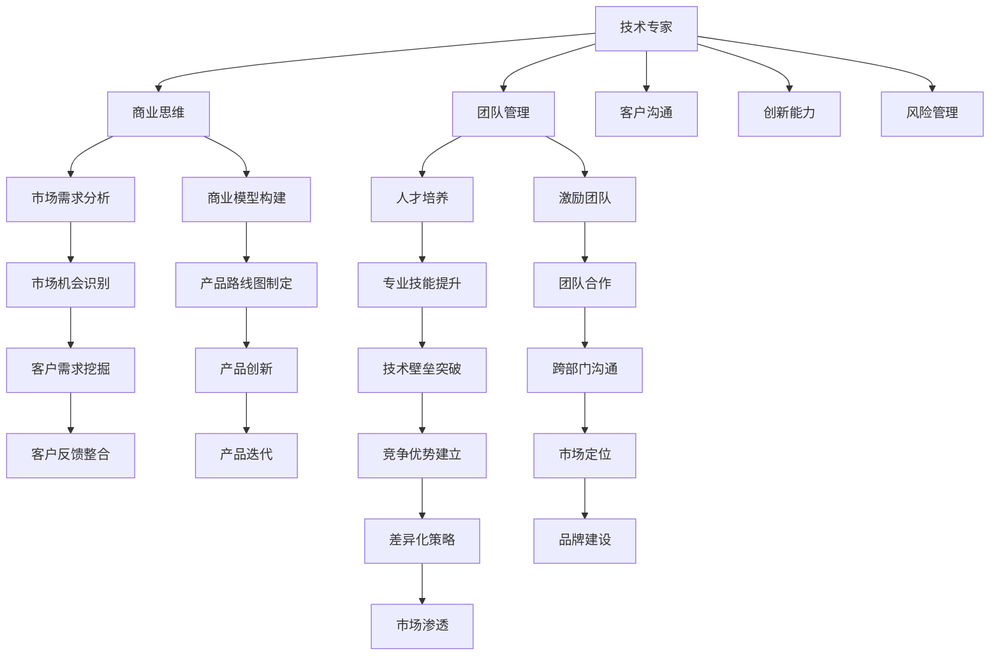

                 

## 1. 背景介绍

在快速迭代的技术世界，从一名技术专家成长为一位创业导师，不仅需要深厚的技术积累，更需要卓越的领导力和商业敏锐度。本文将从技术专家到创业导师的蜕变之路，深入探讨这一转变的核心要素，分享实用的方法和策略，为有志于此领域的人士提供指南。

## 2. 核心概念与联系

### 2.1 核心概念概述

在技术专家到创业导师的转变过程中，涉及多个核心概念，这些概念之间有着紧密的联系：

- **技术专家**：拥有扎实的技术基础，具备解决复杂技术问题的能力。
- **商业思维**：理解市场动态，能够从商业角度看待技术问题。
- **团队管理**：具备领导和管理团队的能力，能够激励和培养团队成员。
- **客户沟通**：能够与客户建立良好关系，理解客户需求。
- **创新能力**：持续创新，推动技术突破。
- **风险管理**：识别和规避技术、商业风险。

### 2.2 核心概念原理和架构的 Mermaid 流程图



## 3. 核心算法原理 & 具体操作步骤

### 3.1 算法原理概述

从技术专家到创业导师的蜕变，可以看作是一个多阶段、多目标的优化问题。其核心算法原理可以归纳为以下几步：

1. **技术积累与深化**：通过持续学习新技术和解决复杂问题，不断提升技术能力。
2. **商业洞察与实践**：从技术视角转向商业视角，理解市场动态，构建商业模式。
3. **团队建设与领导**：培养和领导团队，激励团队成员，提升团队协作效率。
4. **客户沟通与理解**：建立与客户的良好关系，深入理解客户需求，提供解决方案。
5. **风险识别与应对**：识别技术、商业风险，采取措施规避或减轻风险。

### 3.2 算法步骤详解

#### 步骤1: 技术积累与深化

- **持续学习**：参加技术研讨会、阅读前沿论文、实践新技术，保持技术领先。
- **解决复杂问题**：面对技术难题，深入分析和创新解决，提升技术能力。
- **技术分享**：在团队或社区中分享技术知识，提升他人技能，同时深化自身理解。

#### 步骤2: 商业洞察与实践

- **市场研究**：了解行业趋势、竞争对手情况、客户需求等，构建商业思维。
- **商业模式构建**：基于技术优势和市场需求，构建可行的商业模式。
- **市场验证**：通过MVP测试，验证商业模式的可行性，及时调整优化。

#### 步骤3: 团队建设与领导

- **人才招聘**：根据项目需求，招聘合适的人才。
- **团队培养**：制定培训计划，提升团队成员技能，培养技术骨干。
- **激励机制**：建立激励机制，提高团队成员的工作积极性和创造力。

#### 步骤4: 客户沟通与理解

- **客户调研**：通过问卷、访谈等方式，深入了解客户需求和痛点。
- **解决方案设计**：基于客户需求，设计满足需求的技术解决方案。
- **客户关系维护**：保持与客户的持续沟通，及时获取反馈，调整优化产品。

#### 步骤5: 风险识别与应对

- **风险评估**：对技术、商业风险进行评估，识别潜在问题。
- **风险应对策略**：制定风险应对措施，如备份方案、风险转移等。
- **监控与调整**：实时监控风险变化，及时调整策略，确保项目顺利推进。

### 3.3 算法优缺点

#### 优点

1. **综合能力提升**：全面提升技术、商业、管理等多方面的能力。
2. **创新能力强**：通过技术积累和市场洞察，具备持续创新的能力。
3. **风险管理能力**：能够识别并有效应对技术、商业风险。

#### 缺点

1. **学习曲线陡峭**：从技术专家到创业导师的转变，需要跨领域的知识学习。
2. **资源投入大**：需要大量的时间、精力和资金投入。
3. **心理压力**：领导和管理团队，面临的压力和挑战巨大。

### 3.4 算法应用领域

这一算法适用于技术驱动的初创公司或高技术含量项目，如软件开发、AI应用、网络安全等领域。无论是技术专家转型还是创业新手，都可以通过这一算法，逐步从技术导向转向商业导向，构建成功创业项目。

## 4. 数学模型和公式 & 详细讲解 & 举例说明

### 4.1 数学模型构建

在技术专家到创业导师的蜕变过程中，涉及多个数学模型，其中核心模型为技术能力提升模型和商业能力提升模型。

- **技术能力提升模型**：基于技术积累、解决复杂问题和持续学习的循环，提升技术能力。模型可表示为：
  $$
  C_t = f(L, P, T)
  $$
  其中，$C_t$ 表示技术能力，$L$ 表示学习量，$P$ 表示解决问题的复杂度，$T$ 表示技术分享量。

- **商业能力提升模型**：基于市场研究、商业模式构建和市场验证的循环，提升商业能力。模型可表示为：
  $$
  B_c = g(M, B, V)
  $$
  其中，$B_c$ 表示商业能力，$M$ 表示市场研究量，$B$ 表示商业模式构建量，$V$ 表示市场验证量。

### 4.2 公式推导过程

#### 技术能力提升模型推导

- **学习量**：通过阅读论文、参加研讨会等方式积累知识，设每年学习时间为 $L$ 小时。
- **解决问题**：每年解决复杂问题 $P$ 个，每个问题复杂度为 $C$。
- **技术分享**：每年分享技术知识 $T$ 次，每次分享时间为 $H$ 小时。
- **技术能力提升公式**：
  $$
  C_t = C_0 + L\alpha + P\beta + T\gamma
  $$
  其中，$C_0$ 表示初始技术能力，$\alpha, \beta, \gamma$ 为技术提升的系数。

#### 商业能力提升模型推导

- **市场研究**：每年投入市场研究时间 $M$ 小时，市场研究深度为 $D$。
- **商业模式构建**：每年投入商业模式构建时间 $B$ 小时，商业模式创新度为 $I$。
- **市场验证**：每年进行市场验证 $V$ 次，每次验证时间为 $H$ 小时。
- **商业能力提升公式**：
  $$
  B_c = B_0 + M\delta + B\epsilon + V\zeta
  $$
  其中，$B_0$ 表示初始商业能力，$\delta, \epsilon, \zeta$ 为商业能力提升的系数。

### 4.3 案例分析与讲解

假设一位技术专家每年投入1000小时学习新知识，解决5个复杂问题，每年分享技术知识3次，每次分享2小时。设初始技术能力为100，技术提升系数 $\alpha=0.1$，$\beta=0.2$，$\gamma=0.3$。计算该专家三年后的技术能力提升：

$$
C_{t3} = 100 + 1000 \times 0.1 + 5 \times 0.2 + 3 \times 2 \times 0.3 = 100 + 100 + 1 + 1.8 = 202.8
$$

假设该专家每年投入200小时进行市场研究，商业模式构建时间100小时，市场验证5次，每次验证2小时。设初始商业能力为50，市场研究深度系数 $\delta=0.15$，商业模式构建系数 $\epsilon=0.25$，市场验证系数 $\zeta=0.4$。计算该专家三年后的商业能力提升：

$$
B_{c3} = 50 + 200 \times 0.15 + 100 \times 0.25 + 5 \times 2 \times 0.4 = 50 + 30 + 25 + 4 = 109
$$

## 5. 项目实践：代码实例和详细解释说明

### 5.1 开发环境搭建

为了实践技术专家到创业导师的蜕变，需要搭建一个包含技术积累、商业洞察、团队建设、客户沟通、风险管理等模块的综合平台。以下是搭建环境的步骤：

1. **技术积累模块**：
   - **技术学习平台**：选择如Coursera、edX等在线学习平台，获取最新技术知识。
   - **技术分享平台**：建立技术分享社区，如GitHub、Stack Overflow，分享技术文章和代码。

2. **商业洞察模块**：
   - **市场调研工具**：使用SurveyMonkey、Tableau等工具进行市场调研。
   - **商业模式分析工具**：如Business Model Canvas，构建商业模式。

3. **团队建设模块**：
   - **招聘平台**：使用LinkedIn、Indeed等招聘平台，寻找合适人才。
   - **培训管理系统**：如Pluralsight、Udemy，制定培训计划。

4. **客户沟通模块**：
   - **客户管理工具**：使用Salesforce、Zoho CRM，维护客户关系。
   - **客户反馈工具**：如UserVoice、Typeform，收集客户反馈。

5. **风险管理模块**：
   - **风险评估工具**：使用RiskWatch、Risk Register，评估风险。
   - **风险应对平台**：如ProjectManager、Trello，制定应对措施。

### 5.2 源代码详细实现

以下是一个简单的技术积累模块的代码实现，用于记录技术学习时间和解决问题数量：

```python
class TechAccumulator:
    def __init__(self):
        self.learning_hours = 0
        self.problems_solved = 0

    def record_learning(self, hours):
        self.learning_hours += hours

    def record_problem(self):
        self.problems_solved += 1

# 使用示例
tech_accumulator = TechAccumulator()
tech_accumulator.record_learning(1000)
tech_accumulator.record_problem()
tech_accumulator.record_problem()
tech_accumulator.record_problem()
```

### 5.3 代码解读与分析

上述代码定义了一个`TechAccumulator`类，用于记录技术学习时间和解决问题的数量。通过`record_learning`方法记录学习时间，通过`record_problem`方法记录解决的问题数量。

### 5.4 运行结果展示

通过运行上述代码，可以获取如下结果：

```
learning_hours = 1000
problems_solved = 3
```

## 6. 实际应用场景

### 6.1 智能硬件初创公司

在智能硬件领域，从技术专家到创业导师的蜕变尤为重要。智能硬件不仅需要技术支持，还需要强大的商业策划和市场洞察力。

- **技术专家**：负责硬件设计、算法实现和测试，解决硬件技术难题。
- **创业导师**：构建市场模型，确定目标客户群，制定营销策略，吸引投资。

### 6.2 人工智能应用开发

在人工智能应用开发领域，技术专家和创业导师的协作更为紧密。AI应用通常需要跨学科的知识，如算法、数据、产品设计等。

- **技术专家**：专注于AI算法优化、数据处理、模型训练等技术问题。
- **创业导师**：规划产品路线图，理解市场需求，协调团队合作。

### 6.3 新兴技术企业

在新兴技术企业中，技术专家和创业导师的角色可以相互转换。技术专家可以从技术领域转向商业领域，成为带领企业发展的领导者。

- **技术专家**：推动技术创新，解决技术挑战。
- **创业导师**：制定战略规划，拓展市场，推动企业发展。

## 7. 工具和资源推荐

### 7.1 学习资源推荐

1. **技术领域**：
   - **书籍**：《深入理解计算机系统》、《算法导论》等。
   - **在线课程**：Coursera上的CS50、MIT OCW的计算机科学课程。
   - **社区**：Stack Overflow、GitHub等技术社区。

2. **商业领域**：
   - **书籍**：《从0到1》、《创业维艰》等。
   - **在线课程**：edX上的哈佛大学《商业分析》课程、Coursera上的耶鲁大学《创业精神》课程。
   - **商业模型工具**：Business Model Canvas、Lean Startup等。

### 7.2 开发工具推荐

1. **技术工具**：
   - **编程环境**：Visual Studio Code、PyCharm、IntelliJ IDEA等。
   - **版本控制**：Git、GitHub、GitLab等。
   - **协作平台**：Slack、Microsoft Teams、Zoom等。

2. **商业工具**：
   - **市场调研**：SurveyMonkey、Tableau等。
   - **商业模式构建**：Business Model Canvas等。
   - **客户管理**：Salesforce、Zoho CRM等。

### 7.3 相关论文推荐

1. **技术领域**：
   - 《Transformers: Distilling Language Understanding from Human Preferences》
   - 《LSTM: A Search Space Odyssey》
   - 《Deep Learning》

2. **商业领域**：
   - 《The Lean Startup: How Today's Entrepreneurs Use Continuous Innovation to Create Radically Successful Businesses》
   - 《Business Model Generation: A Practical Guide for Designing New Businesses, New Products, and New Business Strategies》
   - 《Blueprints for Scaling the Lean Startup》

## 8. 总结：未来发展趋势与挑战

### 8.1 研究成果总结

本文从技术专家到创业导师的蜕变之路，详细探讨了这一转变的核心要素、具体操作步骤和应用场景。通过技术积累、商业洞察、团队建设、客户沟通和风险管理等多方面的综合提升，成功实现从技术专家到创业导师的蜕变。

### 8.2 未来发展趋势

1. **技术融合加速**：未来技术专家和创业导师的角色将进一步融合，需要掌握更多跨学科知识。
2. **数据驱动决策**：数据将成为决策的重要依据，技术专家需要掌握数据分析和机器学习工具。
3. **全球化视野**：全球市场竞争日益激烈，创业导师需要具备国际视野和跨文化沟通能力。
4. **敏捷开发**：技术创新和市场变化迅速，敏捷开发和持续迭代将成为常态。

### 8.3 面临的挑战

1. **跨学科学习**：技术专家需要掌握更多商业、管理等领域的知识，学习曲线陡峭。
2. **资源有限**：创业初期资源有限，需要合理分配资源，避免浪费。
3. **团队管理**：领导和管理团队，协调团队合作，面临较大的心理压力。
4. **市场变化快**：快速变化的市场环境，需要灵活调整策略，及时应对变化。

### 8.4 研究展望

未来，技术专家到创业导师的蜕变将成为技术创新和商业发展的重要路径。通过持续学习和实践，技术专家可以逐步提升商业思维和管理能力，成为具有跨学科视野的创业领导者。同时，创业导师也需要不断提升技术能力和数据素养，构建更具竞争力的创业项目。

## 9. 附录：常见问题与解答

**Q1: 技术专家如何提升商业洞察力？**

A: 技术专家可以通过市场调研、阅读商业案例、参加商业培训等方式提升商业洞察力。关键在于理解市场需求、客户痛点和商业模式，从而更好地将技术解决方案转化为商业价值。

**Q2: 创业导师如何管理技术团队？**

A: 创业导师需要建立明确的团队目标和激励机制，提供良好的培训和发展机会，鼓励团队成员的创新和合作。同时，需要关注团队动态，及时解决团队内部矛盾和问题，营造积极的团队氛围。

**Q3: 如何平衡技术研发和商业需求？**

A: 技术专家和创业导师需要密切沟通，确保技术研发与商业需求保持一致。可以采用敏捷开发和迭代方法，快速验证产品原型，获取客户反馈，调整产品策略。同时，需要建立有效的沟通机制，确保团队协作顺畅。

**Q4: 如何规避创业过程中的风险？**

A: 创业导师需要全面评估项目风险，制定风险应对策略，如备份方案、风险转移等。同时，需要建立风险监控机制，实时跟踪风险变化，及时调整策略，确保项目顺利推进。

**Q5: 如何培养创业团队的创新能力？**

A: 创业导师需要营造创新文化，鼓励团队成员提出新想法，提供充足的资源支持创新项目。可以设立创新奖励机制，激励团队成员的创新行为。同时，需要保持团队的开放性和灵活性，快速适应市场变化。

---

作者：禅与计算机程序设计艺术 / Zen and the Art of Computer Programming

