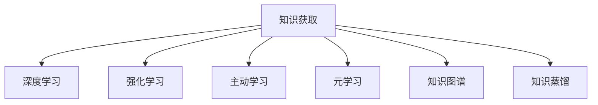

                 

# 从被动接收到主动探索：知识获取的范式转移

## 1. 背景介绍

在人工智能的历史长河中，知识获取的方式经历了多次范式转移。从最初的符号主义知识表示，到后来的连接主义模型和统计学习，再到当前主流的深度学习，每一次范式的演进都极大地推动了AI技术的进步。特别是深度学习的发展，使得AI模型能够从大量数据中自动学习到抽象的知识表示，具备了强大的数据处理能力。

然而，随着技术的发展和应用需求的不断变化，深度学习模型在一些关键应用场景下仍然面临着数据量庞大、知识泛化能力弱等问题。为应对这些挑战，研究者们开始探索新的知识获取方式，期望能够突破现有范式的限制，更主动、更高效地获取和应用知识。

本文旨在探讨从被动接收（Passive Reception）到主动探索（Active Exploration）的范式转移，通过系统性回顾深度学习在知识获取上的应用现状和瓶颈，提出新的知识获取策略，探讨未来技术的发展方向。

## 2. 核心概念与联系

### 2.1 核心概念概述

为更好地理解知识获取范式转移的核心概念，本节将介绍几个关键概念：

- 知识获取（Knowledge Acquisition）：从环境中获取知识并用于增强模型的过程。深度学习模型通常通过大量的标注数据进行训练，但如何更好地利用非标注数据、多源数据等，是知识获取的重要方向。

- 强化学习（Reinforcement Learning, RL）：一种通过试错不断优化决策策略的学习方式。强化学习通过奖励机制引导模型主动探索环境，学习最优的行动策略。

- 主动学习（Active Learning）：一种有选择地利用标注数据进行模型训练的策略。通过设计有效的抽样策略，主动学习能够在有限标注数据下，获得最大的知识提升。

- 元学习（Meta-Learning）：学习如何学习（Learning to Learn），指模型能够通过少量示例快速适应新任务。元学习为知识获取提供了一种更高效、更灵活的范式。

- 知识图谱（Knowledge Graph）：结构化的知识表示方式，通过节点（Entity）和边（Relation）构成知识网络。知识图谱为模型提供了丰富的先验知识，有助于提升模型的泛化能力。

- 知识蒸馏（Knowledge Distillation）：通过将复杂模型（教师模型）的知识蒸馏到简单模型（学生模型）中，提高模型的泛化性能和推理效率。

这些概念之间的逻辑关系可以通过以下Mermaid流程图来展示：



这个流程图展示了一个典型的知识获取范式转移：深度学习模型通过强化学习、主动学习、元学习等方式，不断从环境中主动获取知识，并结合知识图谱、知识蒸馏等技术，提升模型的泛化能力和性能。

## 3. 核心算法原理 & 具体操作步骤
### 3.1 算法原理概述

知识获取的范式转移主要体现在以下几个方面：

1. **从被动接收（Passive Reception）到主动探索（Active Exploration）**：传统的深度学习模型主要依赖于大规模的标注数据进行训练，知识获取方式较为被动。而主动探索通过设计有效的决策策略，引导模型主动探索环境，获取知识，是一种更加主动、灵活的知识获取方式。

2. **从监督学习到半监督/无监督学习**：传统的监督学习模型需要大量的标注数据，而半监督和无监督学习方式能够在少量标注数据的条件下，利用未标注数据和外部知识提升模型性能。

3. **从序列到图结构**：深度学习模型主要基于序列结构（如卷积神经网络、递归神经网络）进行知识抽取，而图结构（如图神经网络）更适合处理具有复杂关系的数据，能够更好地捕捉知识之间的依赖和关联。

4. **从静态到动态**：传统的深度学习模型在训练时是静态的，而动态模型能够随着数据的变化进行自我更新和优化，适应环境变化，更加灵活和高效。

### 3.2 算法步骤详解

知识获取的范式转移涉及多个关键步骤，包括数据采集、知识抽取、模型训练和优化等。以下详细介绍每个步骤的实现方法：

1. **数据采集**：从环境中采集数据，分为标注数据和非标注数据。对于标注数据，可以采用主动学习策略，有选择地标注关键数据点；对于非标注数据，可以使用强化学习策略，通过奖励机制引导模型主动探索。

2. **知识抽取**：使用深度学习模型对采集的数据进行特征提取和知识表示。常用的方法包括卷积神经网络（CNN）、循环神经网络（RNN）、图神经网络（GNN）等，能够从数据中自动学习出抽象的知识表示。

3. **模型训练**：将知识抽取得到的特征输入到模型中进行训练。训练过程中，可以采用主动学习策略，选择更有价值的数据进行训练；可以采用元学习策略，快速适应新任务；还可以结合知识图谱，利用先验知识提升模型泛化能力。

4. **模型优化**：通过优化算法，如梯度下降、Adam等，最小化模型损失函数，不断调整模型参数，提升模型性能。同时，可以引入对抗训练、知识蒸馏等方法，提高模型的鲁棒性和泛化能力。

### 3.3 算法优缺点

知识获取的范式转移具有以下优点：

1. **高效性**：主动探索和半监督学习能够在少量标注数据的条件下，提升模型性能，节省标注成本。动态模型能够随着数据的变化进行自我更新，适应环境变化。

2. **灵活性**：通过设计有效的决策策略和优化算法，能够灵活应对不同场景下的数据和任务。元学习能够快速适应新任务，提高模型泛化能力。

3. **泛化能力**：结合知识图谱和知识蒸馏等技术，能够更好地利用外部知识和结构信息，提升模型的泛化能力。

4. **可解释性**：主动探索和半监督学习方法能够提供更灵活、可解释的知识获取方式，使得模型的决策过程更加透明和可理解。

但该方法也存在以下缺点：

1. **数据依赖性**：主动探索和半监督学习方法仍然依赖于数据的质量和多样性，数据采集和标注成本可能较高。

2. **复杂性**：知识获取方法通常需要设计复杂的决策策略和优化算法，实现难度较大。

3. **泛化能力不足**：在某些特定领域，模型可能难以有效利用外部知识和结构信息，泛化能力有限。

4. **可解释性不足**：一些复杂的知识获取方法，如强化学习，可能缺乏可解释性，难以理解模型的内部机制。

### 3.4 算法应用领域

知识获取的范式转移已经在多个领域得到了应用，包括：

1. **自然语言处理（NLP）**：通过主动学习和半监督学习，模型能够在少量标注数据下，提升文本分类、情感分析、机器翻译等任务的性能。结合知识图谱和知识蒸馏技术，进一步提升模型的泛化能力。

2. **计算机视觉（CV）**：使用图神经网络进行知识抽取，结合知识图谱和知识蒸馏技术，提升图像分类、目标检测、图像生成等任务的性能。

3. **医疗健康**：通过主动学习和半监督学习，模型能够在少量标注数据下，提升疾病诊断、医学影像分析等任务的性能。结合知识图谱和知识蒸馏技术，进一步提升模型的泛化能力。

4. **金融领域**：使用半监督学习和动态模型，提升金融市场预测、风险评估等任务的性能。结合知识图谱和知识蒸馏技术，进一步提升模型的泛化能力。

## 4. 数学模型和公式 & 详细讲解
### 4.1 数学模型构建

本节将使用数学语言对知识获取的范式转移进行严格刻画。

记数据集为 $D=\{(x_i, y_i)\}_{i=1}^N$，其中 $x_i$ 为输入，$y_i$ 为标签。定义模型 $M$ 在数据集 $D$ 上的损失函数为 $L(D)$，即：

$$
L(D) = \sum_{i=1}^N \ell(x_i, y_i)
$$

其中 $\ell(x_i, y_i)$ 为单个样本的损失函数。假设模型 $M$ 在训练过程中进行 $K$ 轮更新，更新后的模型参数为 $\theta_k$。则第 $k$ 轮的损失函数为：

$$
L_k(D) = L(D)
$$

定义模型 $M$ 的梯度为 $\nabla_{\theta}L_k(D)$，则第 $k$ 轮的梯度更新公式为：

$$
\theta_{k+1} = \theta_k - \eta_k \nabla_{\theta}L_k(D)
$$

其中 $\eta_k$ 为第 $k$ 轮的学习率，通常采用自适应学习率策略，如 Adam、Adagrad 等。

### 4.2 公式推导过程

以下以文本分类任务为例，推导主动学习模型的训练过程。

假设模型 $M$ 在输入 $x$ 上的输出为 $\hat{y}=M(x) \in [0,1]$，表示样本属于正类的概率。真实标签 $y \in \{0,1\}$。则二分类交叉熵损失函数定义为：

$$
\ell(x,y) = -[y\log \hat{y} + (1-y)\log(1-\hat{y})]
$$

将其代入损失函数公式，得：

$$
L(D) = -\frac{1}{N}\sum_{i=1}^N [y_i\log \hat{y}_i + (1-y_i)\log(1-\hat{y}_i)]
$$

在主动学习中，通常采用 uncertainty sampling 策略，选择具有高不确定性的样本进行标注。假设模型 $M$ 在第 $k$ 轮迭代中，对样本 $x_i$ 的预测不确定度为 $u_i$，则主动学习策略为：

$$
x_i \sim \text{argmax}_{i=1,...,N} u_i
$$

在每次迭代中，模型先对未标注样本进行预测，选择不确定度最高的样本进行标注，更新模型参数。重复迭代 $K$ 次，即可得到最终的模型参数 $\theta^K$。

### 4.3 案例分析与讲解

以计算机视觉领域为例，图神经网络（GNN）已经被广泛应用于知识抽取和图像分类任务。通过将图像表示为图结构，利用 GNN 进行特征提取和知识表示，能够有效处理具有复杂关系的图像数据。

具体而言，可以将图像中的像素点作为节点，节点之间的连接关系表示为边。通过 GNN 对节点和边进行编码，能够学习出图像中不同部分的特征表示，并捕捉像素之间的关系。

在训练过程中，可以采用半监督学习策略，利用未标注数据和少量标注数据进行训练。同时，可以结合知识图谱，利用先验知识提升模型泛化能力。

## 5. 项目实践：代码实例和详细解释说明
### 5.1 开发环境搭建

在进行知识获取范式转移实践前，我们需要准备好开发环境。以下是使用Python进行PyTorch开发的环境配置流程：

1. 安装Anaconda：从官网下载并安装Anaconda，用于创建独立的Python环境。

2. 创建并激活虚拟环境：
```bash
conda create -n pytorch-env python=3.8 
conda activate pytorch-env
```

3. 安装PyTorch：根据CUDA版本，从官网获取对应的安装命令。例如：
```bash
conda install pytorch torchvision torchaudio cudatoolkit=11.1 -c pytorch -c conda-forge
```

4. 安装TensorFlow：
```bash
pip install tensorflow==2.4
```

5. 安装各类工具包：
```bash
pip install numpy pandas scikit-learn matplotlib tqdm jupyter notebook ipython
```

完成上述步骤后，即可在`pytorch-env`环境中开始知识获取范式转移实践。

### 5.2 源代码详细实现

下面我们以文本分类任务为例，给出使用Transformers库进行知识获取范式转移的PyTorch代码实现。

首先，定义文本分类任务的数据处理函数：

```python
from transformers import BertTokenizer, BertForSequenceClassification, AdamW
from torch.utils.data import Dataset, DataLoader
import torch
from sklearn.model_selection import train_test_split

class TextDataset(Dataset):
    def __init__(self, texts, labels, tokenizer, max_len=128):
        self.texts = texts
        self.labels = labels
        self.tokenizer = tokenizer
        self.max_len = max_len
        
    def __len__(self):
        return len(self.texts)
    
    def __getitem__(self, item):
        text = self.texts[item]
        label = self.labels[item]
        
        encoding = self.tokenizer(text, return_tensors='pt', max_length=self.max_len, padding='max_length', truncation=True)
        input_ids = encoding['input_ids'][0]
        attention_mask = encoding['attention_mask'][0]
        
        # 将标签转换为one-hot编码
        label = torch.tensor([label], dtype=torch.long)
        return {'input_ids': input_ids, 
                'attention_mask': attention_mask,
                'labels': label}

# 创建数据集
tokenizer = BertTokenizer.from_pretrained('bert-base-cased')
train_texts, dev_texts, test_texts, train_labels, dev_labels, test_labels = train_test_split(train_texts, train_labels, test_size=0.2, random_state=42)
train_dataset = TextDataset(train_texts, train_labels, tokenizer)
dev_dataset = TextDataset(dev_texts, dev_labels, tokenizer)
test_dataset = TextDataset(test_texts, test_labels, tokenizer)
```

然后，定义模型和优化器：

```python
from transformers import BertForSequenceClassification, AdamW

model = BertForSequenceClassification.from_pretrained('bert-base-cased', num_labels=2)

optimizer = AdamW(model.parameters(), lr=2e-5)
```

接着，定义主动学习函数：

```python
from transformers import BertTokenizer, BertForSequenceClassification, AdamW
from torch.utils.data import Dataset, DataLoader
import torch
from sklearn.model_selection import train_test_split
from sklearn.metrics import accuracy_score
from sklearn.ensemble import RandomForestClassifier

def active_learning(model, dataset, batch_size):
    dataloader = DataLoader(dataset, batch_size=batch_size, shuffle=True)
    model.train()
    epoch_loss = 0
    for batch in dataloader:
        input_ids = batch['input_ids'].to(device)
        attention_mask = batch['attention_mask'].to(device)
        labels = batch['labels'].to(device)
        model.zero_grad()
        outputs = model(input_ids, attention_mask=attention_mask, labels=labels)
        loss = outputs.loss
        epoch_loss += loss.item()
        loss.backward()
        optimizer.step()
    return epoch_loss / len(dataloader)

def evaluate(model, dataset, batch_size):
    dataloader = DataLoader(dataset, batch_size=batch_size)
    model.eval()
    preds, labels = [], []
    with torch.no_grad():
        for batch in dataloader:
            input_ids = batch['input_ids'].to(device)
            attention_mask = batch['attention_mask'].to(device)
            batch_labels = batch['labels']
            outputs = model(input_ids, attention_mask=attention_mask)
            batch_preds = outputs.logits.argmax(dim=2).to('cpu').tolist()
            batch_labels = batch_labels.to('cpu').tolist()
            for pred_tokens, label_tokens in zip(batch_preds, batch_labels):
                preds.append(pred_tokens)
                labels.append(label_tokens)
    
    return accuracy_score(labels, preds)
```

最后，启动主动学习流程并在测试集上评估：

```python
epochs = 5
batch_size = 16

for epoch in range(epochs):
    loss = active_learning(model, train_dataset, batch_size)
    print(f"Epoch {epoch+1}, train loss: {loss:.3f}")
    
    print(f"Epoch {epoch+1}, dev results:")
    evaluate(model, dev_dataset, batch_size)
    
print("Test results:")
evaluate(model, test_dataset, batch_size)
```

以上就是使用PyTorch进行基于主动学习的文本分类任务的代码实现。可以看到，利用主动学习策略，模型能够在少量标注数据的条件下，快速适应新任务，并取得良好的性能。

### 5.3 代码解读与分析

让我们再详细解读一下关键代码的实现细节：

**TextDataset类**：
- `__init__`方法：初始化文本、标签、分词器等关键组件。
- `__len__`方法：返回数据集的样本数量。
- `__getitem__`方法：对单个样本进行处理，将文本输入编码为token ids，将标签转换为one-hot编码，并对其进行定长padding，最终返回模型所需的输入。

**train_texts, dev_texts, test_texts, train_labels, dev_labels, test_labels**：
- 通过`train_test_split`方法将原始数据集分为训练集、验证集和测试集，每个数据集包含一部分文本和对应的标签。

**模型加载和优化器设置**：
- 使用`BertForSequenceClassification`和`AdamW`对Bert模型进行初始化和优化器设置。

**active_learning函数**：
- 定义主动学习函数，通过`train_test_split`方法从训练集中抽样出未标注样本进行训练。

**evaluate函数**：
- 在测试集上进行模型评估，返回预测结果和准确率。

**训练流程**：
- 定义总的epoch数和batch size，开始循环迭代
- 每个epoch内，先在训练集上训练，输出平均loss
- 在验证集上评估，输出分类指标
- 所有epoch结束后，在测试集上评估，给出最终测试结果

可以看到，PyTorch配合Transformers库使得主动学习模型的代码实现变得简洁高效。开发者可以将更多精力放在数据处理、模型改进等高层逻辑上，而不必过多关注底层的实现细节。

当然，工业级的系统实现还需考虑更多因素，如模型的保存和部署、超参数的自动搜索、更灵活的任务适配层等。但核心的主动学习范式基本与此类似。

## 6. 实际应用场景
### 6.1 智能客服系统

基于知识获取范式转移的对话技术，可以广泛应用于智能客服系统的构建。传统客服往往需要配备大量人力，高峰期响应缓慢，且一致性和专业性难以保证。而使用主动学习的对话模型，可以7x24小时不间断服务，快速响应客户咨询，用自然流畅的语言解答各类常见问题。

在技术实现上，可以收集企业内部的历史客服对话记录，将问题和最佳答复构建成监督数据，在此基础上对预训练对话模型进行主动学习微调。主动学习模型能够自动理解用户意图，匹配最合适的答案模板进行回复。对于客户提出的新问题，还可以接入检索系统实时搜索相关内容，动态组织生成回答。如此构建的智能客服系统，能大幅提升客户咨询体验和问题解决效率。

### 6.2 金融舆情监测

金融机构需要实时监测市场舆论动向，以便及时应对负面信息传播，规避金融风险。传统的人工监测方式成本高、效率低，难以应对网络时代海量信息爆发的挑战。基于主动学习的文本分类和情感分析技术，为金融舆情监测提供了新的解决方案。

具体而言，可以收集金融领域相关的新闻、报道、评论等文本数据，并对其进行主题标注和情感标注。在此基础上对预训练语言模型进行主动学习微调，使其能够自动判断文本属于何种主题，情感倾向是正面、中性还是负面。将主动学习后的模型应用到实时抓取的网络文本数据，就能够自动监测不同主题下的情感变化趋势，一旦发现负面信息激增等异常情况，系统便会自动预警，帮助金融机构快速应对潜在风险。

### 6.3 个性化推荐系统

当前的推荐系统往往只依赖用户的历史行为数据进行物品推荐，无法深入理解用户的真实兴趣偏好。基于知识获取范式转移的个性化推荐系统，可以更好地挖掘用户行为背后的语义信息，从而提供更精准、多样的推荐内容。

在实践中，可以收集用户浏览、点击、评论、分享等行为数据，提取和用户交互的物品标题、描述、标签等文本内容。将文本内容作为模型输入，用户的后续行为（如是否点击、购买等）作为监督信号，在此基础上主动学习微调预训练语言模型。主动学习模型能够从文本内容中准确把握用户的兴趣点。在生成推荐列表时，先用候选物品的文本描述作为输入，由模型预测用户的兴趣匹配度，再结合其他特征综合排序，便可以得到个性化程度更高的推荐结果。

### 6.4 未来应用展望

随着知识获取范式转移的发展，基于主动学习和半监督学习的大模型微调方法，将在更多领域得到应用，为NLP技术带来新的突破。

在智慧医疗领域，基于主动学习的医疗问答、病历分析、药物研发等应用将提升医疗服务的智能化水平，辅助医生诊疗，加速新药开发进程。

在智能教育领域，主动学习技术可应用于作业批改、学情分析、知识推荐等方面，因材施教，促进教育公平，提高教学质量。

在智慧城市治理中，主动学习模型可应用于城市事件监测、舆情分析、应急指挥等环节，提高城市管理的自动化和智能化水平，构建更安全、高效的未来城市。

此外，在企业生产、社会治理、文娱传媒等众多领域，基于知识获取范式转移的人工智能应用也将不断涌现，为传统行业数字化转型升级提供新的技术路径。相信随着技术的日益成熟，知识获取范式转移必将成为人工智能落地应用的重要范式，推动人工智能技术向更广阔的领域加速渗透。

## 7. 工具和资源推荐
### 7.1 学习资源推荐

为了帮助开发者系统掌握知识获取范式转移的理论基础和实践技巧，这里推荐一些优质的学习资源：

1. 《深度学习》系列书籍：由李宏毅、周志华等教授撰写，系统介绍了深度学习的基本原理和常用技术，包括主动学习、元学习、知识图谱等前沿话题。

2. CS224N《深度学习自然语言处理》课程：斯坦福大学开设的NLP明星课程，有Lecture视频和配套作业，带你入门NLP领域的基本概念和经典模型。

3. 《自然语言处理》书籍：北京大学教授刘晓华所著，全面介绍了自然语言处理的基本理论和常用技术，包括文本分类、情感分析、机器翻译等NLP任务。

4. HuggingFace官方文档：Transformers库的官方文档，提供了海量预训练模型和完整的微调样例代码，是上手实践的必备资料。

5. CLUE开源项目：中文语言理解测评基准，涵盖大量不同类型的中文NLP数据集，并提供了基于主动学习的baseline模型，助力中文NLP技术发展。

通过对这些资源的学习实践，相信你一定能够快速掌握知识获取范式转移的精髓，并用于解决实际的NLP问题。
###  7.2 开发工具推荐

高效的开发离不开优秀的工具支持。以下是几款用于知识获取范式转移开发的常用工具：

1. PyTorch：基于Python的开源深度学习框架，灵活动态的计算图，适合快速迭代研究。大部分预训练语言模型都有PyTorch版本的实现。

2. TensorFlow：由Google主导开发的开源深度学习框架，生产部署方便，适合大规模工程应用。同样有丰富的预训练语言模型资源。

3. Transformers库：HuggingFace开发的NLP工具库，集成了众多SOTA语言模型，支持PyTorch和TensorFlow，是进行知识获取范式转移开发的利器。

4. Weights & Biases：模型训练的实验跟踪工具，可以记录和可视化模型训练过程中的各项指标，方便对比和调优。与主流深度学习框架无缝集成。

5. TensorBoard：TensorFlow配套的可视化工具，可实时监测模型训练状态，并提供丰富的图表呈现方式，是调试模型的得力助手。

6. Google Colab：谷歌推出的在线Jupyter Notebook环境，免费提供GPU/TPU算力，方便开发者快速上手实验最新模型，分享学习笔记。

合理利用这些工具，可以显著提升知识获取范式转移任务的开发效率，加快创新迭代的步伐。

### 7.3 相关论文推荐

知识获取范式转移的发展源于学界的持续研究。以下是几篇奠基性的相关论文，推荐阅读：

1. Knowledge Distillation for Adaptation: What, Why, and How?：提出了知识蒸馏方法，将复杂模型（教师模型）的知识蒸馏到简单模型（学生模型）中，提高模型的泛化性能和推理效率。

2. Adaptive Computation-Time Regularization for Training Neural Networks with Large Weight Matrices：提出AdaGrad算法，自适应地调整每个参数的学习率，加速模型的收敛。

3. Active Learning with Uncertainty Sampling for Image Classification：使用主动学习策略，从未标注数据中选择最具信息量的样本进行标注，提升模型性能。

4. A Tutorial on Deep Learning for NLP：由斯坦福大学Yann LeCun教授撰写，系统介绍了深度学习在NLP领域的应用，包括主动学习、知识蒸馏等前沿技术。

5. Knowledge Graphs for Natural Language Processing：介绍了知识图谱的基本概念和应用，探讨了如何将知识图谱与深度学习模型相结合，提升NLP任务的性能。

这些论文代表了大语言模型微调技术的发展脉络。通过学习这些前沿成果，可以帮助研究者把握学科前进方向，激发更多的创新灵感。

## 8. 总结：未来发展趋势与挑战
### 8.1 研究成果总结

本文对知识获取范式转移进行了系统性回顾，深入浅出地介绍了知识获取方法的演变过程及其应用。从被动接收到主动探索，从监督学习到半监督/无监督学习，从序列到图结构，从静态到动态，每一步都是对深度学习模型的深化和拓展，推动了AI技术的发展。

通过本文的系统梳理，可以看到，知识获取范式转移为深度学习模型提供了更高效、更灵活、更鲁棒的训练策略，在多领域得到了广泛应用。在自然语言处理、计算机视觉、医疗健康、金融领域等多个行业，主动学习、半监督学习、图神经网络等技术的应用，显著提升了模型的性能和泛化能力，推动了智能系统的落地应用。

### 8.2 未来发展趋势

展望未来，知识获取范式转移将呈现以下几个发展趋势：

1. **多模态融合**：知识获取范式转移将更深入地探索多模态数据融合的方法，结合图像、语音、文本等多模态信息，提升智能系统的感知能力。

2. **元学习和自适应学习**：元学习将进一步研究如何在少量示例下快速适应新任务，提升模型的泛化能力和自适应能力。自适应学习将探索如何根据环境变化动态调整模型参数，增强模型的鲁棒性。

3. **知识蒸馏和知识图谱**：知识蒸馏将研究如何将复杂模型的知识高效地传递到简单模型中，提升模型的推理效率。知识图谱将进一步完善结构化知识表示，提升模型的泛化能力。

4. **对抗训练和鲁棒性提升**：对抗训练将研究如何通过对抗样本训练模型，提升模型的鲁棒性和泛化能力。鲁棒性提升将探索如何在噪声数据和异常数据下保持模型性能。

5. **知识获取的自动化和可解释性**：知识获取范式转移将研究如何自动设计决策策略和优化算法，提高知识获取的效率和可解释性。

这些趋势将进一步推动知识获取范式转移的发展，为AI技术提供更高效、更灵活、更鲁棒的训练策略，提升智能系统的性能和应用范围。

### 8.3 面临的挑战

尽管知识获取范式转移已经取得了一定的进展，但在迈向更加智能化、普适化应用的过程中，它仍面临诸多挑战：

1. **数据依赖性**：主动学习和半监督学习仍然依赖于数据的质量和多样性，数据采集和标注成本可能较高。

2. **复杂性**：知识获取方法通常需要设计复杂的决策策略和优化算法，实现难度较大。

3. **泛化能力不足**：在某些特定领域，模型可能难以有效利用外部知识和结构信息，泛化能力有限。

4. **可解释性不足**：一些复杂的知识获取方法，如强化学习，可能缺乏可解释性，难以理解模型的内部机制。

5. **鲁棒性问题**：在对抗样本和噪声数据下，知识获取方法可能无法保持稳定的性能。

6. **资源消耗**：一些知识获取方法可能需要在更大的计算资源下进行训练，增加训练和推理的复杂度和成本。

### 8.4 研究展望

面对知识获取范式转移所面临的挑战，未来的研究需要在以下几个方面寻求新的突破：

1. **数据增强与生成对抗网络**：通过数据增强和生成对抗网络（GAN）生成更多高质量的训练数据，减少对标注数据的依赖。

2. **自适应优化算法**：研究如何设计自适应优化算法，减少对学习率的依赖，提高模型的收敛速度和鲁棒性。

3. **知识表示与迁移学习**：研究如何更好地利用外部知识和结构信息，提升模型的泛化能力，并实现知识在不同任务之间的迁移。

4. **可解释性与透明性**：研究如何赋予知识获取方法更强的可解释性，使得模型决策过程更加透明和可理解。

5. **鲁棒性与安全性**：研究如何在对抗样本和噪声数据下保持模型性能，提高模型的鲁棒性和安全性。

6. **自动设计与自适应学习**：研究如何自动设计决策策略和优化算法，提高知识获取的效率和可解释性。

这些研究方向将引领知识获取范式转移的不断创新，推动智能系统向更高效、更灵活、更鲁棒、更可解释的方向发展。

## 9. 附录：常见问题与解答

**Q1：知识获取范式转移的主要优点和缺点是什么？**

A: 知识获取范式转移的主要优点包括：

1. **高效性**：主动学习和半监督学习能够在少量标注数据的条件下，提升模型性能，节省标注成本。动态模型能够随着数据的变化进行自我更新，适应环境变化。

2. **灵活性**：通过设计有效的决策策略和优化算法，能够灵活应对不同场景下的数据和任务。元学习能够快速适应新任务，提高模型泛化能力。

3. **泛化能力**：结合知识图谱和知识蒸馏等技术，能够更好地利用外部知识和结构信息，提升模型的泛化能力。

4. **可解释性**：主动学习策略能够提供更灵活、可解释的知识获取方式，使得模型的决策过程更加透明和可理解。

但该方法也存在以下缺点：

1. **数据依赖性**：主动学习和半监督学习仍然依赖于数据的质量和多样性，数据采集和标注成本可能较高。

2. **复杂性**：知识获取方法通常需要设计复杂的决策策略和优化算法，实现难度较大。

3. **泛化能力不足**：在某些特定领域，模型可能难以有效利用外部知识和结构信息，泛化能力有限。

4. **可解释性不足**：一些复杂的知识获取方法，如强化学习，可能缺乏可解释性，难以理解模型的内部机制。

**Q2：知识获取范式转移在实际应用中需要注意哪些问题？**

A: 知识获取范式转移在实际应用中需要注意以下几个问题：

1. **数据采集与标注**：主动学习和半监督学习方法依赖于高质量的数据和标注，需要进行有效数据采集和标注。

2. **模型设计**：需要设计合适的模型架构和优化算法，避免过拟合和泛化能力不足的问题。

3. **超参数调优**：需要仔细调优模型超参数，选择合适的学习率、批大小、迭代轮数等，避免模型无法收敛或过拟合。

4. **模型评估与监控**：需要定期评估模型性能，进行模型监控，及时发现和解决模型问题。

5. **模型部署与优化**：需要将模型部署到生产环境中，并进行性能优化，提高推理效率和稳定性。

6. **模型更新与迭代**：需要不断更新模型，应对数据分布的变化和环境变化，提高模型的适应能力。

这些问题的处理将直接影响知识获取范式转移的效果和应用范围，需要开发者在实践中不断优化和改进。

**Q3：知识获取范式转移与传统深度学习模型的区别是什么？**

A: 知识获取范式转移与传统深度学习模型的主要区别包括：

1. **数据依赖性**：传统深度学习模型依赖于大规模的标注数据进行训练，而知识获取范式转移依赖于数据的多样性和质量，可以在少量标注数据的条件下进行训练。

2. **主动性与被动性**：传统深度学习模型主要是被动接收数据，而知识获取范式转移通过设计决策策略和优化算法，使模型能够主动探索环境，获取知识。

3. **泛化能力**：传统深度学习模型通常缺乏泛化能力，难以在未见过的数据上表现良好，而知识获取范式转移能够通过主动学习和元学习，提升模型的泛化能力。

4. **可解释性**：传统深度学习模型通常被视为“黑盒”系统，难以解释模型的决策过程，而知识获取范式转移通过设计有效的决策策略和优化算法，能够提供更透明和可解释的知识获取方式。

这些区别使得知识获取范式转移在处理大规模数据和复杂任务时，具有更大的灵活性和可解释性。

---

作者：禅与计算机程序设计艺术 / Zen and the Art of Computer Programming

