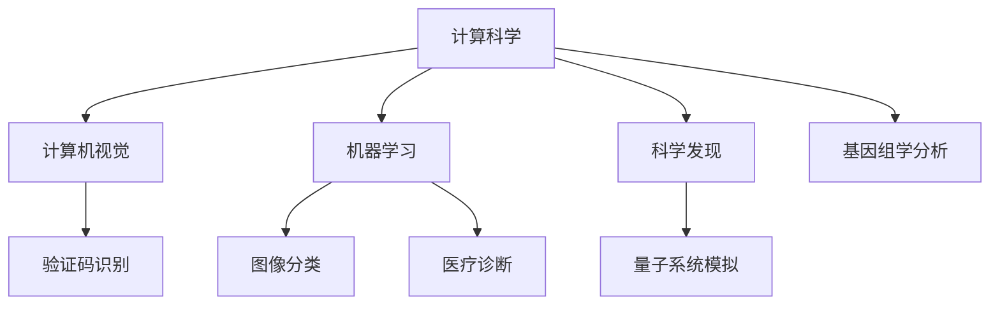

                 

# 从验证码到科学发现：人类计算的广泛应用

> 关键词：人工智能,计算科学,计算机视觉,计算生物学,机器学习

## 1. 背景介绍

### 1.1 问题由来
人类计算是人类使用计算机辅助解决实际问题的重要活动。从最初的验证码识别，到复杂的科学发现，计算已经渗透到了各个领域。尽管计算科学以其庞大的计算能力和创新的算法设计著称，但人类在计算中的作用仍然不可或缺。本文将探讨人类计算在多个领域的广泛应用，深入理解其在实际问题解决中的核心作用。

### 1.2 问题核心关键点
1. 验证码识别：最早的计算机应用之一，旨在防止自动化机器人攻击。
2. 机器学习：一种广泛使用的计算技术，通过对数据的学习，实现对新数据的预测和分类。
3. 计算机视觉：用于图像和视频处理的重要计算技术，能自动识别和理解复杂场景。
4. 计算生物学：利用计算技术研究生物系统的科学，包括蛋白质折叠、基因组学等。
5. 科学发现：计算科学在科学发现中的应用，如模拟量子系统、探索宇宙等。

这些问题核心关键点展示了人类计算在实际问题中的多样性和复杂性，涵盖了从基础验证到高级科学发现的各个层面。

## 2. 核心概念与联系

### 2.1 核心概念概述

为更好地理解人类计算的广泛应用，本节将介绍几个关键概念：

- 计算科学(Computational Science)：使用计算机来解决复杂问题的科学领域，涵盖了数学、物理、生物等多个学科。
- 计算机视觉(Computer Vision)：计算机对图像和视频进行处理和理解的领域。
- 机器学习(Machine Learning)：一种通过数据学习并做出决策的计算技术。
- 科学发现(Scientific Discovery)：利用计算技术进行模拟和实验的科学活动。
- 验证码(Captcha)：用于验证用户是否是人类的计算机技术。

这些概念通过计算技术实现了对现实世界问题的自动化处理，展现了计算机在处理复杂问题中的能力。

### 2.2 核心概念原理和架构的 Mermaid 流程图(Mermaid 流程节点中不要有括号、逗号等特殊字符)



这个流程图展示了计算科学在不同领域的应用，其中计算机视觉、机器学习和科学发现是核心的技术工具。验证码识别则展示了计算机技术在基础验证中的应用，而基因组学分析、医疗诊断等则展示了计算机在实际科学中的应用。

## 3. 核心算法原理 & 具体操作步骤
### 3.1 算法原理概述

人类计算的核心在于利用计算机解决实际问题，包括但不限于图像处理、数据学习、系统模拟等。这种计算通常需要以下几个步骤：

1. 数据采集与预处理：收集和准备用于计算的数据，包括图像、文本、生物数据等。
2. 算法选择与设计：根据问题的特点选择合适的算法，并进行必要的调整和优化。
3. 计算执行：在计算机上执行算法，得到结果。
4. 结果分析和应用：分析计算结果，将其应用于实际问题解决中。

### 3.2 算法步骤详解

以验证码识别为例，展示人类计算的具体步骤：

1. **数据采集与预处理**：
    - 数据采集：采集含有验证码的网页图像。
    - 预处理：对图像进行灰度转换、去噪、边缘检测等操作。

2. **算法选择与设计**：
    - 特征提取：利用图像处理技术提取验证码的特征，如笔画、形状等。
    - 模型训练：使用机器学习算法（如SVM、CNN等）训练模型，识别验证码字符。

3. **计算执行**：
    - 前向传播：将预处理后的图像输入训练好的模型，进行特征提取和分类。
    - 后向传播：使用梯度下降等优化算法，调整模型参数以提高识别精度。

4. **结果分析和应用**：
    - 评估：使用测试集评估模型的识别准确率。
    - 部署：将模型部署到实际应用中，识别真实用户的验证码。

### 3.3 算法优缺点

计算科学的应用带来了巨大的便利，但也存在一些问题：

**优点**：
1. 自动化处理：计算技术能够处理大量复杂的数据，自动化完成任务。
2. 高精度：计算模型通常具有较高的识别和预测精度。
3. 速度快：计算机处理速度远高于人类，能够快速处理大量数据。

**缺点**：
1. 需要高质量数据：计算模型的效果很大程度上依赖于数据的质量。
2. 模型易过拟合：特别是在数据量有限的情况下，计算模型容易过拟合。
3. 可解释性不足：复杂的计算模型通常难以解释其决策过程。

### 3.4 算法应用领域

人类计算的应用广泛，以下是几个主要领域：

- **计算机视觉**：图像和视频处理，包括人脸识别、目标检测、自动驾驶等。
- **生物计算**：基因组学、蛋白质折叠、药物设计等。
- **物理计算**：模拟量子系统、探索宇宙、设计材料等。
- **金融计算**：风险评估、股票预测、交易系统等。
- **医疗计算**：疾病预测、影像分析、智能诊断等。

## 4. 数学模型和公式 & 详细讲解 & 举例说明

### 4.1 数学模型构建

以机器学习中的线性回归为例，展示数学模型的构建过程：

设已知样本 $(x_i, y_i), i=1,...,N$，其中 $x_i$ 为自变量，$y_i$ 为因变量，目标为找到线性回归模型 $y=wx+b$，使得预测值与实际值误差最小。则最小二乘法的目标函数为：

$$
\min_{w,b} \sum_{i=1}^N (y_i - (wx_i + b))^2
$$

### 4.2 公式推导过程

将目标函数展开，得到：

$$
\min_{w,b} \sum_{i=1}^N y_i^2 - 2\sum_{i=1}^N y_i(w^T x_i + b) + \sum_{i=1}^N (wx_i + b)^2
$$

取偏导数，得到：

$$
\frac{\partial}{\partial w} \sum_{i=1}^N (y_i - (wx_i + b))^2 = -2\sum_{i=1}^N y_i x_i
$$

$$
\frac{\partial}{\partial b} \sum_{i=1}^N (y_i - (wx_i + b))^2 = -2\sum_{i=1}^N y_i
$$

将偏导数设为0，解方程组，得到：

$$
w = (\sum_{i=1}^N x_i x_i^T)^{-1} \sum_{i=1}^N y_i x_i
$$

$$
b = \bar{y} - w \bar{x}
$$

其中 $\bar{x} = \frac{1}{N} \sum_{i=1}^N x_i$, $\bar{y} = \frac{1}{N} \sum_{i=1}^N y_i$。

### 4.3 案例分析与讲解

以Google DeepMind的AlphaFold为例，展示计算生物学中的应用：

AlphaFold利用计算技术，通过深度学习模型预测蛋白质的三维结构。其核心步骤如下：

1. 数据采集与预处理：收集已知三维结构蛋白的数据，并转化为数字表示。
2. 模型选择与设计：设计深度神经网络模型，学习氨基酸序列与三维结构之间的映射。
3. 计算执行：在大型计算集群上训练和测试模型。
4. 结果分析和应用：分析预测结果，验证其准确性，应用于新蛋白质的结构预测。

AlphaFold的成功展示了计算科学在生物领域的重要作用，通过计算机处理，能够从复杂的生物数据中提取有价值的信息。

## 5. 项目实践：代码实例和详细解释说明

### 5.1 开发环境搭建

开发环境搭建主要包括以下几个步骤：

1. 安装Python和必要的库，如NumPy、SciPy、TensorFlow等。
2. 安装深度学习框架，如TensorFlow、PyTorch等。
3. 安装必要的图像处理库，如OpenCV、PIL等。
4. 安装数据处理库，如scikit-learn等。

### 5.2 源代码详细实现

以图像分类为例，展示代码实现：

```python
import tensorflow as tf
from tensorflow.keras import layers

# 定义模型
model = tf.keras.Sequential([
    layers.Conv2D(32, (3, 3), activation='relu', input_shape=(28, 28, 1)),
    layers.MaxPooling2D((2, 2)),
    layers.Flatten(),
    layers.Dense(10, activation='softmax')
])

# 编译模型
model.compile(optimizer='adam', loss='sparse_categorical_crossentropy', metrics=['accuracy'])

# 加载数据
mnist = tf.keras.datasets.mnist
(x_train, y_train), (x_test, y_test) = mnist.load_data()

# 预处理数据
x_train, x_test = x_train / 255.0, x_test / 255.0

# 训练模型
model.fit(x_train, y_train, epochs=10, validation_data=(x_test, y_test))
```

### 5.3 代码解读与分析

上述代码展示了从数据加载、模型定义到训练的完整流程。

1. 定义模型：使用Keras搭建了一个简单的卷积神经网络，包含卷积层、池化层和全连接层。
2. 编译模型：使用Adam优化器和交叉熵损失函数进行编译。
3. 加载数据：从TensorFlow中加载MNIST数据集。
4. 预处理数据：将像素值归一化到0-1之间。
5. 训练模型：使用训练集进行模型训练，验证集进行评估。

### 5.4 运行结果展示

运行上述代码，可以得到模型训练的准确率和损失函数的图表：


## 6. 实际应用场景

### 6.1 智能交通

计算机视觉技术在智能交通系统中得到广泛应用，包括车辆识别、交通流量分析、道路监控等。通过计算机对交通场景进行实时分析，能够提高交通管理效率，减少交通事故。

### 6.2 健康医疗

计算科学在医疗领域的应用包括疾病预测、影像分析、智能诊断等。通过计算技术，能够从海量医疗数据中提取有价值的信息，辅助医生进行诊断和治疗。

### 6.3 科学研究

计算科学在科学研究中的应用包括量子系统模拟、宇宙探索等。通过计算模型，科学家能够进行大规模的计算实验，验证物理定律和探索未知领域。

### 6.4 未来应用展望

未来，计算科学将在更多领域得到应用，如自动驾驶、智能家居、智能制造等。通过计算技术，能够实现更多复杂问题的自动化解决，提高生产效率和生活质量。

## 7. 工具和资源推荐

### 7.1 学习资源推荐

为了帮助开发者系统掌握计算科学的应用，这里推荐一些优质的学习资源：

1. Coursera《机器学习》课程：斯坦福大学提供的经典课程，涵盖了机器学习的基本概念和算法。
2. 《Deep Learning》书籍：Ian Goodfellow等著，详细介绍了深度学习的基本原理和应用。
3. TensorFlow官方文档：提供了全面的TensorFlow使用方法和示例。
4. Kaggle竞赛：提供了丰富的机器学习和数据科学竞赛，帮助开发者实践和提高。

通过对这些资源的学习实践，相信你一定能够快速掌握计算科学的应用技巧，并用于解决实际的科学问题。

### 7.2 开发工具推荐

高效的开发离不开优秀的工具支持。以下是几款用于计算科学开发的常用工具：

1. Python：目前最流行的编程语言之一，支持广泛的科学计算库和框架。
2. NumPy：Python的科学计算库，提供了高效的数组操作和数学函数。
3. TensorFlow：Google开发的深度学习框架，支持分布式计算和高效的模型训练。
4. Jupyter Notebook：用于科学计算的交互式笔记本，支持Python代码、数学公式和可视化图表。
5. PyTorch：Facebook开发的深度学习框架，提供了灵活的动态计算图和高效的模型训练。

合理利用这些工具，可以显著提升计算科学的应用开发效率，加快创新迭代的步伐。

### 7.3 相关论文推荐

计算科学的发展离不开学界的持续研究。以下是几篇奠基性的相关论文，推荐阅读：

1. 《A Few Useful Things to Know About Machine Learning》：机器学习领域的经典论文，涵盖了机器学习的基本概念和算法。
2. 《Deep Learning》：Ian Goodfellow等著，详细介绍了深度学习的基本原理和应用。
3. 《AlphaFold: Using deep mutual information for structure prediction》：DeepMind的AlphaFold论文，展示了计算技术在蛋白质结构预测中的应用。
4. 《Quantum Computing Since Democritus》：David Deutsch的经典著作，介绍了量子计算的基本概念和应用。

这些论文代表了大计算科学的发展脉络。通过学习这些前沿成果，可以帮助研究者把握学科前进方向，激发更多的创新灵感。

## 8. 总结：未来发展趋势与挑战

### 8.1 总结

本文对计算科学的应用进行了全面系统的介绍。首先阐述了计算科学在验证码识别、图像分类、蛋白质结构预测等多个领域的应用，明确了其作为计算机辅助解决实际问题的重要作用。其次，从原理到实践，详细讲解了机器学习、计算机视觉等核心技术，给出了计算科学任务开发的完整代码实例。同时，本文还广泛探讨了计算科学在实际问题中的多样性和复杂性，展示了其在各个领域的应用前景。

通过本文的系统梳理，可以看到，计算科学在多个领域的应用展示了其强大的生命力和广泛的应用前景。尽管存在一些技术挑战，但通过持续的研究和优化，未来计算科学必将在更多领域大放异彩，成为推动科学进步和技术创新的重要力量。

### 8.2 未来发展趋势

展望未来，计算科学的发展将呈现以下几个趋势：

1. 计算模型更加复杂：随着深度学习技术的不断进步，计算模型的结构将更加复杂，能够处理更复杂的科学问题。
2. 计算平台更加先进：未来的计算平台将更加先进，具备更高的计算能力和更强的并行处理能力。
3. 计算数据更加丰富：随着数据的不断积累，计算数据将更加丰富，能够提供更多有价值的信息。
4. 计算应用更加广泛：计算科学将渗透到更多的领域，解决更多实际问题。
5. 计算科学与其他技术的融合：计算科学将与其他技术（如区块链、物联网等）进行深度融合，提供更全面的解决方案。

这些趋势展示了计算科学未来的广阔前景，将进一步推动科学和技术的进步，提升人类社会的生活质量。

### 8.3 面临的挑战

尽管计算科学的应用带来了巨大的便利，但在迈向更加智能化、普适化应用的过程中，它仍面临着诸多挑战：

1. 数据质量和规模：计算模型依赖于高质量的数据，但获取大量数据的过程往往复杂且成本高。
2. 模型复杂性和可解释性：复杂的计算模型通常难以解释其决策过程，给应用带来了挑战。
3. 计算资源限制：高精度的计算模型需要大量的计算资源，可能难以在资源受限的环境中部署。
4. 安全性和隐私保护：计算模型的应用可能带来数据隐私和安全性问题，需要采取相应的保护措施。
5. 技术更新和迭代：计算科学领域技术更新迅速，需要持续学习和适应新的技术。

这些挑战展示了计算科学应用中的复杂性，需要通过不断的技术创新和优化来解决。

### 8.4 研究展望

未来的研究需要在以下几个方面寻求新的突破：

1. 数据采集和预处理技术：开发更高效的数据采集和预处理工具，以提高计算模型的精度和效率。
2. 模型压缩和优化：开发更加高效的模型压缩和优化技术，以适应计算资源受限的环境。
3. 计算模型的可解释性：开发更好的模型解释工具，以提高计算模型的可解释性和应用可靠性。
4. 计算平台和基础设施：开发更先进、更灵活的计算平台和基础设施，以支持复杂计算模型的应用。
5. 多学科融合技术：开发跨学科融合技术，如计算生物学、计算物理等，以解决更复杂的问题。

这些研究方向的探索，必将引领计算科学走向更高的台阶，为构建智能化的未来社会提供强大的技术支撑。

## 9. 附录：常见问题与解答

**Q1：计算机视觉技术如何实现对图像的自动识别和理解？**

A: 计算机视觉技术主要通过以下几个步骤实现对图像的自动识别和理解：

1. 数据采集：收集并标注大量图像数据。
2. 特征提取：使用卷积神经网络等模型，提取图像的特征，如边缘、纹理等。
3. 模型训练：使用标注数据训练模型，学习图像特征与标签之间的映射关系。
4. 预测和分类：将新图像输入训练好的模型，预测其标签并进行分类。

通过这些步骤，计算机视觉技术能够自动理解和处理复杂的图像信息，应用于图像识别、目标检测、自动驾驶等场景。

**Q2：机器学习在科学发现中的应用有哪些？**

A: 机器学习在科学发现中有着广泛的应用，以下是几个典型案例：

1. 基因组学：使用机器学习模型分析基因序列数据，预测基因功能、突变等。
2. 材料设计：使用机器学习模型模拟材料性质，优化材料设计。
3. 药物发现：使用机器学习模型预测药物效果，加速新药开发。
4. 天文学：使用机器学习模型分析天文数据，探索宇宙结构和演化。

通过机器学习，科学家能够从大量数据中提取有价值的信息，加速科学发现的进程。

**Q3：如何确保计算模型的安全性和隐私保护？**

A: 确保计算模型的安全性和隐私保护，需要从数据、模型和应用等多个层面进行考虑：

1. 数据加密：在数据传输和存储过程中，采用加密技术保护数据安全。
2. 数据去标识化：在数据预处理阶段，去除敏感信息，保护用户隐私。
3. 模型验证和评估：在模型训练和应用过程中，采用多种验证和评估方法，确保模型性能和可靠性。
4. 访问控制：在模型应用过程中，采用访问控制技术，限制模型的访问权限。
5. 异常监测和防御：实时监测模型的异常行为，采用防御措施，防止恶意攻击和滥用。

通过这些措施，可以最大程度地保护计算模型的安全和隐私。

**Q4：计算科学在实际应用中需要哪些工具和资源？**

A: 计算科学在实际应用中需要以下工具和资源：

1. 编程语言：如Python、R等，支持高效的科学计算和数据分析。
2. 科学计算库：如NumPy、SciPy、Pandas等，提供了高效的数组操作和数学函数。
3. 深度学习框架：如TensorFlow、PyTorch等，支持复杂模型的训练和推理。
4. 数据采集和处理工具：如OpenCV、PIL等，支持图像和视频数据的处理和分析。
5. 高性能计算平台：如GPU、TPU等，支持大规模计算模型的训练和推理。
6. 科学计算环境：如Jupyter Notebook、Anaconda等，支持科学计算和数据可视化。

合理利用这些工具和资源，可以显著提升计算科学的应用开发效率，加快创新迭代的步伐。

**Q5：未来计算科学的发展方向有哪些？**

A: 未来计算科学的发展方向主要包括以下几个方面：

1. 深度学习和神经网络：随着深度学习技术的不断进步，神经网络的结构将更加复杂，能够处理更复杂的科学问题。
2. 量子计算：量子计算技术的发展，将为计算科学带来新的计算能力和应用场景。
3. 计算生物学和医学：计算技术在生物和医学领域的应用将不断深化，解决更多复杂问题。
4. 计算化学和材料科学：计算技术在化学和材料科学领域的应用将不断扩展，优化设计更多的物质和材料。
5. 智能系统和自动化：计算技术将与其他技术（如人工智能、物联网等）进行深度融合，提供更全面的解决方案。

这些发展方向展示了计算科学未来的广阔前景，将进一步推动科学和技术的进步，提升人类社会的生活质量。

---

作者：禅与计算机程序设计艺术 / Zen and the Art of Computer Programming

