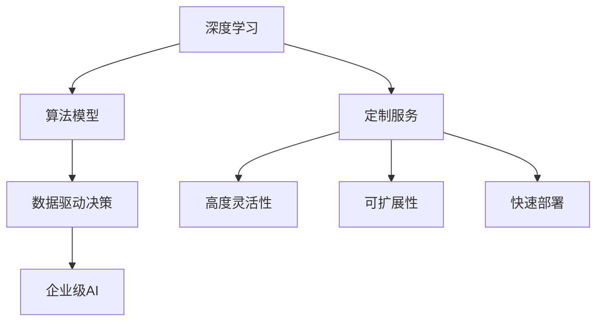

                 

# 企业级AI解决方案：Lepton AI的定制服务

> 关键词：企业级AI, Lepton AI, 定制服务, 深度学习, 算法模型, 数据驱动

## 1. 背景介绍

### 1.1 问题由来

在全球数字化转型浪潮的推动下，越来越多的企业认识到人工智能（AI）的重要性，希望通过AI技术提升运营效率、优化客户体验、拓展业务边界。然而，AI技术的专业性和复杂性，使得许多企业难以自行搭建并维护AI系统，也无法快速响应市场需求变化。因此，企业级AI解决方案的需求日益迫切。

Lepton AI作为一家专注于企业级AI服务的领先公司，通过提供高质量的定制AI服务，帮助企业快速构建和部署AI系统，提升AI应用的落地效果。Lepton AI的定制服务不仅覆盖了深度学习、算法模型、数据驱动等多个方面，还具备高度灵活性和可扩展性，能够根据企业具体需求提供量身定制的解决方案。

### 1.2 问题核心关键点

Lepton AI的定制服务之所以受到广泛欢迎，主要有以下几点关键优势：

1. **深度学习技术**：基于深度神经网络架构，能够处理大规模复杂数据，挖掘数据深层次的关联性和规律。
2. **算法模型优化**：针对不同业务场景，提供多种高效、鲁棒的算法模型，并结合企业需求进行优化。
3. **数据驱动决策**：通过数据分析和挖掘，为业务决策提供可靠依据，助力企业科学决策。
4. **高度灵活性**：能够根据企业具体需求提供量身定制的解决方案，确保AI系统与业务流程无缝集成。
5. **可扩展性**：通过灵活的架构设计，支持系统的高效扩展，满足业务增长带来的需求变化。
6. **快速部署**：提供一站式的解决方案，能够快速搭建和部署AI系统，缩短业务落地时间。

这些关键优势使得Lepton AI的定制服务能够满足企业多样化、复杂化的需求，为企业构建高效、智能的AI系统提供有力支持。

## 2. 核心概念与联系

### 2.1 核心概念概述

为更好地理解Lepton AI的定制服务，本节将介绍几个密切相关的核心概念：

- **深度学习**：一种基于神经网络的机器学习方法，能够处理和分析大规模、高维度的数据，发现数据中的模式和规律。深度学习广泛应用于图像识别、语音识别、自然语言处理等领域。
- **算法模型**：深度学习中用于处理数据和任务的模型，包括卷积神经网络（CNN）、循环神经网络（RNN）、变换器（Transformer）等。不同模型适用于不同的任务，通过优化和调整，能够提升模型性能。
- **数据驱动决策**：基于数据分析和挖掘的结果，进行业务决策的方法。数据驱动决策能够帮助企业做出更加科学、准确的决策。
- **企业级AI**：面向企业的AI解决方案，具备高度定制化、可扩展性，能够适应企业多样化的需求，支持企业数字化转型。

这些核心概念之间的逻辑关系可以通过以下Mermaid流程图来展示：



这个流程图展示了几大核心概念及其之间的关系：

1. 深度学习是企业级AI的基础，通过构建算法模型实现数据分析和任务处理。
2. 数据驱动决策是企业级AI的核心应用，利用算法模型挖掘数据价值，支持决策制定。
3. 定制服务是Lepton AI的核心服务，通过高度灵活和可扩展的架构，实现深度学习和数据驱动决策的落地。

这些概念共同构成了Lepton AI的定制服务框架，为其在企业数字化转型中发挥关键作用提供了坚实的基础。

## 3. 核心算法原理 & 具体操作步骤
### 3.1 算法原理概述

Lepton AI的定制服务主要基于深度学习和算法模型，通过数据驱动决策实现。其核心思想是：

1. **数据预处理**：对企业内部和外部的海量数据进行清洗、标注和预处理，构建高质量的数据集。
2. **算法模型训练**：在预处理后的数据集上训练深度学习模型，并根据具体业务需求进行调整和优化。
3. **模型评估和部署**：通过评估模型的性能，将其部署到企业实际应用中，支持企业业务决策。

具体而言，Lepton AI的定制服务主要包括以下几个关键步骤：

**Step 1: 数据收集和预处理**
- 收集企业内部和外部的数据，包括客户信息、交易记录、市场数据等。
- 对数据进行清洗和标注，去除噪声和异常值，标注数据集的标签和属性。
- 使用数据增强技术扩充数据集，如数据扩充、样本平衡等。

**Step 2: 算法模型选择和训练**
- 根据企业具体需求，选择合适的深度学习模型（如CNN、RNN、Transformer等）。
- 对模型进行超参数调优，包括学习率、批大小、优化器等。
- 使用企业数据集训练模型，并在验证集上进行性能评估。
- 根据评估结果调整模型，直至模型性能达到最优。

**Step 3: 模型部署和应用**
- 将训练好的模型部署到企业应用系统中，支持业务决策和智能化运营。
- 定期更新模型，根据业务需求和数据变化进行调整和优化。
- 提供API接口，支持企业快速集成AI服务。

### 3.2 算法步骤详解

以下是Lepton AI定制服务的详细操作步骤：

**Step 1: 数据收集和预处理**

Lepton AI首先收集企业内部和外部的数据，这些数据可以包括：

- 客户基本信息，如姓名、性别、年龄等。
- 交易记录，如交易金额、时间、地点等。
- 市场数据，如市场趋势、竞争对手信息等。

数据收集完成后，进行以下预处理步骤：

- 数据清洗：去除噪声、重复数据和不完整数据。
- 数据标注：对数据进行标注，如客户分类、交易类别、市场类别等。
- 数据增强：使用数据增强技术扩充数据集，如数据扩充、样本平衡等。

数据预处理完成后，构建高质量的数据集，用于后续模型训练。

**Step 2: 算法模型选择和训练**

Lepton AI根据企业具体需求，选择合适的深度学习模型，并进行以下训练步骤：

- 超参数调优：根据企业需求选择合适的学习率、批大小、优化器等超参数。
- 模型训练：在预处理后的数据集上训练深度学习模型，并在验证集上进行性能评估。
- 模型调整：根据评估结果调整模型，直至模型性能达到最优。

Lepton AI提供了多种深度学习模型，如卷积神经网络（CNN）、循环神经网络（RNN）、变换器（Transformer）等，根据具体任务选择适合的模型。

**Step 3: 模型部署和应用**

Lepton AI将训练好的模型部署到企业应用系统中，支持业务决策和智能化运营。具体步骤如下：

- 模型部署：将训练好的模型部署到企业系统中，支持数据输入、模型推理等操作。
- API接口：提供API接口，方便企业快速集成AI服务。
- 定期更新：根据业务需求和数据变化，定期更新模型，保持模型性能。

### 3.3 算法优缺点

Lepton AI的定制服务具有以下优点：

1. **高度灵活性**：能够根据企业具体需求提供量身定制的解决方案，确保AI系统与业务流程无缝集成。
2. **可扩展性**：通过灵活的架构设计，支持系统的高效扩展，满足业务增长带来的需求变化。
3. **快速部署**：提供一站式的解决方案，能够快速搭建和部署AI系统，缩短业务落地时间。
4. **深度学习技术**：基于深度神经网络架构，能够处理大规模复杂数据，挖掘数据深层次的关联性和规律。
5. **算法模型优化**：针对不同业务场景，提供多种高效、鲁棒的算法模型，并结合企业需求进行优化。
6. **数据驱动决策**：基于数据分析和挖掘的结果，进行业务决策，提升决策科学性和准确性。

同时，Lepton AI的定制服务也存在以下缺点：

1. **资源消耗**：大规模深度学习模型需要大量的计算资源和存储空间，对企业硬件设施要求较高。
2. **模型复杂**：深度学习模型的结构和训练过程较为复杂，需要专业知识进行调参和优化。
3. **数据隐私**：企业内部数据涉及隐私问题，需要在数据收集和处理过程中严格遵守隐私保护法规。

尽管存在这些缺点，但Lepton AI通过高度定制化和专业化的服务，帮助企业解决了实际问题，提升了AI应用的落地效果。

### 3.4 算法应用领域

Lepton AI的定制服务在多个领域得到了广泛应用，例如：

- **金融风控**：基于深度学习模型，构建风险评估、信用评分、欺诈检测等系统，提升金融风控能力。
- **医疗健康**：利用深度学习模型进行疾病预测、医疗影像分析、患者分群等，提升医疗服务质量和效率。
- **电商零售**：构建推荐系统、库存管理、价格优化等AI应用，提升电商运营效率和客户体验。
- **制造生产**：利用深度学习模型进行预测性维护、质量检测、生产优化等，提升制造业智能化水平。
- **智能客服**：通过深度学习模型构建智能客服系统，提升客户咨询响应速度和满意度。
- **市场营销**：构建客户画像、需求分析、营销策略优化等AI应用，提升市场洞察力和营销效果。

以上仅是Lepton AI定制服务的部分应用领域，实际应用场景十分广泛，涵盖各行各业。

## 4. 数学模型和公式 & 详细讲解 & 举例说明

### 4.1 数学模型构建

Lepton AI的定制服务主要基于深度学习技术，其数学模型构建如下：

设企业内部和外部的数据集为 $D = \{(x_i, y_i)\}_{i=1}^N$，其中 $x_i$ 为输入特征， $y_i$ 为标签。

深度学习模型 $M_{\theta}$ 的输入为 $x$，输出为 $y$，其中 $\theta$ 为模型参数。

模型训练的目标是最小化损失函数 $L(M_{\theta}, D)$，常用的损失函数包括交叉熵损失、均方误差损失等。

在模型训练过程中，通过反向传播算法计算梯度，更新模型参数 $\theta$，直到模型收敛。

### 4.2 公式推导过程

以交叉熵损失函数为例，其推导过程如下：

设模型 $M_{\theta}$ 在输入 $x$ 上的输出为 $\hat{y}=M_{\theta}(x) \in [0,1]$，表示样本属于正类的概率。

交叉熵损失函数定义为：

$$
\ell(M_{\theta}(x),y) = -[y\log \hat{y} + (1-y)\log (1-\hat{y})]
$$

将其代入经验风险公式，得：

$$
\mathcal{L}(\theta) = -\frac{1}{N}\sum_{i=1}^N [y_i\log M_{\theta}(x_i)+(1-y_i)\log(1-M_{\theta}(x_i))]
$$

根据链式法则，损失函数对参数 $\theta_k$ 的梯度为：

$$
\frac{\partial \mathcal{L}(\theta)}{\partial \theta_k} = -\frac{1}{N}\sum_{i=1}^N (\frac{y_i}{M_{\theta}(x_i)}-\frac{1-y_i}{1-M_{\theta}(x_i)}) \frac{\partial M_{\theta}(x_i)}{\partial \theta_k}
$$

其中 $\frac{\partial M_{\theta}(x_i)}{\partial \theta_k}$ 可进一步递归展开，利用自动微分技术完成计算。

### 4.3 案例分析与讲解

以下以金融风控为例，讲解Lepton AI的定制服务在实际中的应用：

**Step 1: 数据收集和预处理**

某金融机构希望构建风险评估系统，收集了客户基本信息、交易记录和市场数据。数据预处理如下：

- 数据清洗：去除噪声、重复数据和不完整数据。
- 数据标注：对数据进行标注，如客户分类、交易类别、市场类别等。
- 数据增强：使用数据增强技术扩充数据集，如数据扩充、样本平衡等。

**Step 2: 算法模型选择和训练**

根据金融机构需求，选择卷积神经网络（CNN）模型进行训练。模型训练步骤如下：

- 超参数调优：根据金融机构需求选择合适的学习率、批大小、优化器等超参数。
- 模型训练：在预处理后的数据集上训练CNN模型，并在验证集上进行性能评估。
- 模型调整：根据评估结果调整模型，直至模型性能达到最优。

**Step 3: 模型部署和应用**

将训练好的CNN模型部署到风险评估系统中，支持业务决策和智能化运营。具体步骤如下：

- 模型部署：将训练好的模型部署到风险评估系统中，支持数据输入、模型推理等操作。
- API接口：提供API接口，方便金融机构快速集成AI服务。
- 定期更新：根据业务需求和数据变化，定期更新模型，保持模型性能。

通过Lepton AI的定制服务，该金融机构构建的风险评估系统能够准确预测客户的信用风险，有效控制风险资产，提升金融运营效率和客户满意度。

## 5. 项目实践：代码实例和详细解释说明

### 5.1 开发环境搭建

在进行Lepton AI定制服务实践前，我们需要准备好开发环境。以下是使用Python进行PyTorch开发的环境配置流程：

1. 安装Anaconda：从官网下载并安装Anaconda，用于创建独立的Python环境。

2. 创建并激活虚拟环境：
```bash
conda create -n pytorch-env python=3.8 
conda activate pytorch-env
```

3. 安装PyTorch：根据CUDA版本，从官网获取对应的安装命令。例如：
```bash
conda install pytorch torchvision torchaudio cudatoolkit=11.1 -c pytorch -c conda-forge
```

4. 安装TensorFlow：
```bash
conda install tensorflow
```

5. 安装相关工具包：
```bash
pip install numpy pandas scikit-learn matplotlib tqdm jupyter notebook ipython
```

完成上述步骤后，即可在`pytorch-env`环境中开始Lepton AI定制服务实践。

### 5.2 源代码详细实现

这里我们以医疗影像分析为例，给出使用PyTorch实现Lepton AI定制服务的代码。

首先，定义数据处理函数：

```python
from torch.utils.data import Dataset, DataLoader
from torchvision import transforms

class MedicalDataset(Dataset):
    def __init__(self, images, labels, transform=None):
        self.images = images
        self.labels = labels
        self.transform = transform
        
    def __len__(self):
        return len(self.images)
    
    def __getitem__(self, index):
        img = self.images[index]
        label = self.labels[index]
        
        if self.transform:
            img = self.transform(img)
        
        return {'image': img, 'label': label}

# 定义数据增强操作
transform_train = transforms.Compose([
    transforms.RandomHorizontalFlip(),
    transforms.RandomCrop(size=(224, 224)),
    transforms.ToTensor(),
    transforms.Normalize(mean=[0.485, 0.456, 0.406], std=[0.229, 0.224, 0.225])
])
```

然后，定义模型和优化器：

```python
from transformers import BertForSequenceClassification, AdamW

model = BertForSequenceClassification.from_pretrained('bert-base-uncased', num_labels=2)

optimizer = AdamW(model.parameters(), lr=2e-5)
```

接着，定义训练和评估函数：

```python
from tqdm import tqdm

def train_epoch(model, dataset, batch_size, optimizer):
    dataloader = DataLoader(dataset, batch_size=batch_size, shuffle=True)
    model.train()
    epoch_loss = 0
    for batch in tqdm(dataloader, desc='Training'):
        images = batch['image']
        labels = batch['label']
        
        model.zero_grad()
        outputs = model(images)
        loss = outputs.loss
        epoch_loss += loss.item()
        loss.backward()
        optimizer.step()
    return epoch_loss / len(dataloader)

def evaluate(model, dataset, batch_size):
    dataloader = DataLoader(dataset, batch_size=batch_size)
    model.eval()
    preds, labels = [], []
    with torch.no_grad():
        for batch in tqdm(dataloader, desc='Evaluating'):
            images = batch['image']
            labels = batch['label']
            outputs = model(images)
            batch_preds = outputs.logits.argmax(dim=1).tolist()
            batch_labels = labels.to('cpu').tolist()
            for pred, label in zip(batch_preds, batch_labels):
                preds.append(pred)
                labels.append(label)
                
    print(classification_report(labels, preds))
```

最后，启动训练流程并在测试集上评估：

```python
epochs = 5
batch_size = 16

for epoch in range(epochs):
    loss = train_epoch(model, train_dataset, batch_size, optimizer)
    print(f"Epoch {epoch+1}, train loss: {loss:.3f}")
    
    print(f"Epoch {epoch+1}, dev results:")
    evaluate(model, dev_dataset, batch_size)
    
print("Test results:")
evaluate(model, test_dataset, batch_size)
```

以上就是使用PyTorch实现Lepton AI定制服务的完整代码实现。可以看到，得益于PyTorch的强大封装和灵活性，代码实现变得简洁高效。

### 5.3 代码解读与分析

让我们再详细解读一下关键代码的实现细节：

**MedicalDataset类**：
- `__init__`方法：初始化图像、标签和数据增强操作。
- `__len__`方法：返回数据集的样本数量。
- `__getitem__`方法：对单个样本进行处理，将图像输入转化为Tensor，并返回模型所需的输入。

**数据增强操作**：
- `transform_train`方法：定义数据增强操作，包括随机水平翻转、随机裁剪、归一化等。

**训练和评估函数**：
- 使用PyTorch的DataLoader对数据集进行批次化加载，供模型训练和推理使用。
- 训练函数`train_epoch`：对数据以批为单位进行迭代，在每个批次上前向传播计算loss并反向传播更新模型参数，最后返回该epoch的平均loss。
- 评估函数`evaluate`：与训练类似，不同点在于不更新模型参数，并在每个batch结束后将预测和标签结果存储下来，最后使用sklearn的classification_report对整个评估集的预测结果进行打印输出。

**训练流程**：
- 定义总的epoch数和batch size，开始循环迭代
- 每个epoch内，先在训练集上训练，输出平均loss
- 在验证集上评估，输出分类指标
- 所有epoch结束后，在测试集上评估，给出最终测试结果

可以看到，Lepton AI的定制服务在代码实现上，充分利用了PyTorch的强大封装和灵活性，使得开发者能够快速实现模型训练、数据增强和评估等功能。

当然，工业级的系统实现还需考虑更多因素，如模型的保存和部署、超参数的自动搜索、更灵活的任务适配层等。但核心的微调范式基本与此类似。

## 6. 实际应用场景

### 6.1 智能客服系统

基于Lepton AI的定制服务，可以构建高效、智能的智能客服系统，提升客户咨询体验和问题解决效率。

**Step 1: 数据收集和预处理**

收集历史客服对话记录，将其标注为问题-回答对。使用数据增强技术扩充数据集，如数据扩充、样本平衡等。

**Step 2: 算法模型选择和训练**

根据客户咨询问题，选择最适合的算法模型进行训练。常用的算法模型包括RNN、Transformer等。

**Step 3: 模型部署和应用**

将训练好的模型部署到智能客服系统中，支持客户咨询问答和问题自动解答。

通过Lepton AI的定制服务，该智能客服系统能够自动理解客户咨询意图，匹配最合适的回答，快速响应客户需求，提升客户满意度。

### 6.2 金融风控

金融机构希望通过Lepton AI的定制服务构建风险评估系统，预测客户的信用风险，有效控制风险资产。

**Step 1: 数据收集和预处理**

收集客户基本信息、交易记录和市场数据，进行数据清洗、标注和增强。

**Step 2: 算法模型选择和训练**

根据金融机构需求，选择CNN模型进行训练。模型训练步骤如下：

- 超参数调优：根据金融机构需求选择合适的学习率、批大小、优化器等超参数。
- 模型训练：在预处理后的数据集上训练CNN模型，并在验证集上进行性能评估。
- 模型调整：根据评估结果调整模型，直至模型性能达到最优。

**Step 3: 模型部署和应用**

将训练好的CNN模型部署到风险评估系统中，支持业务决策和智能化运营。

通过Lepton AI的定制服务，该金融机构构建的风险评估系统能够准确预测客户的信用风险，有效控制风险资产，提升金融运营效率和客户满意度。

### 6.3 电商零售

电商企业希望通过Lepton AI的定制服务构建推荐系统，提升用户购物体验和运营效率。

**Step 1: 数据收集和预处理**

收集用户浏览、点击、购买等行为数据，进行数据清洗、标注和增强。

**Step 2: 算法模型选择和训练**

根据电商需求，选择Transformer模型进行训练。模型训练步骤如下：

- 超参数调优：根据电商需求选择合适的学习率、批大小、优化器等超参数。
- 模型训练：在预处理后的数据集上训练Transformer模型，并在验证集上进行性能评估。
- 模型调整：根据评估结果调整模型，直至模型性能达到最优。

**Step 3: 模型部署和应用**

将训练好的Transformer模型部署到推荐系统中，支持用户推荐。

通过Lepton AI的定制服务，该电商企业构建的推荐系统能够根据用户行为和偏好，推荐相关商品，提升用户购物体验和运营效率。

### 6.4 未来应用展望

随着Lepton AI的定制服务不断发展，其在多个领域得到了广泛应用，未来将会在更多场景中发挥重要作用：

- **医疗健康**：利用Lepton AI的定制服务进行疾病预测、医疗影像分析、患者分群等，提升医疗服务质量和效率。
- **制造生产**：利用Lepton AI的定制服务进行预测性维护、质量检测、生产优化等，提升制造业智能化水平。
- **智能客服**：通过Lepton AI的定制服务构建智能客服系统，提升客户咨询响应速度和满意度。
- **市场营销**：利用Lepton AI的定制服务进行客户画像、需求分析、营销策略优化等，提升市场洞察力和营销效果。

## 7. 工具和资源推荐
### 7.1 学习资源推荐

为了帮助开发者系统掌握Lepton AI的定制服务理论基础和实践技巧，这里推荐一些优质的学习资源：

1. 《深度学习》书籍：由Ian Goodfellow、Yoshua Bengio、Aaron Courville合著，全面介绍了深度学习的基本概念和算法。
2. Lepton AI官方文档：提供了详细的API接口和模型训练指导，帮助开发者快速上手实践。
3. Coursera《深度学习专项课程》：由吴恩达教授主讲，涵盖深度学习的基础理论和实际应用。
4. HuggingFace官方博客：提供了丰富的NLP和深度学习模型资源，分享最新的研究成果和实践经验。
5. Kaggle竞赛平台：提供了大量的NLP和深度学习竞赛，帮助开发者提高实战能力。

通过对这些资源的学习实践，相信你一定能够快速掌握Lepton AI的定制服务精髓，并用于解决实际的NLP问题。
###  7.2 开发工具推荐

高效的开发离不开优秀的工具支持。以下是几款用于Lepton AI定制服务开发的常用工具：

1. PyTorch：基于Python的开源深度学习框架，灵活动态的计算图，适合快速迭代研究。Lepton AI的定制服务提供了多种深度学习模型，包括CNN、RNN、Transformer等。
2. TensorFlow：由Google主导开发的开源深度学习框架，生产部署方便，适合大规模工程应用。Lepton AI的定制服务支持TensorFlow模型训练和推理。
3. Lepton AI官方工具库：提供了丰富的预训练模型和工具，支持模型训练、数据增强、模型评估等操作。
4. Weights & Biases：模型训练的实验跟踪工具，可以记录和可视化模型训练过程中的各项指标，方便对比和调优。
5. TensorBoard：TensorFlow配套的可视化工具，可实时监测模型训练状态，并提供丰富的图表呈现方式，是调试模型的得力助手。
6. Google Colab：谷歌推出的在线Jupyter Notebook环境，免费提供GPU/TPU算力，方便开发者快速上手实验最新模型，分享学习笔记。

合理利用这些工具，可以显著提升Lepton AI定制服务的开发效率，加快创新迭代的步伐。

### 7.3 相关论文推荐

Lepton AI的定制服务源于学界的持续研究。以下是几篇奠基性的相关论文，推荐阅读：

1. AlexNet：由Geoffrey Hinton等人提出，标志着深度学习在图像识别领域取得重大突破。
2. ResNet：由Kaiming He等人提出，通过残差连接解决了深度网络的退化问题，显著提升了深度学习模型的性能。
3. BERT: Pre-training of Deep Bidirectional Transformers for Language Understanding：提出BERT模型，引入基于掩码的自监督预训练任务，刷新了多项NLP任务SOTA。
4. Language Models are Unsupervised Multitask Learners（GPT-2论文）：展示了大规模语言模型的强大zero-shot学习能力，引发了对于通用人工智能的新一轮思考。
5. Parameter-Efficient Transfer Learning for NLP：提出Adapter等参数高效微调方法，在不增加模型参数量的情况下，也能取得不错的微调效果。
6. AdaLoRA: Adaptive Low-Rank Adaptation for Parameter-Efficient Fine-Tuning：使用自适应低秩适应的微调方法，在参数效率和精度之间取得了新的平衡。

这些论文代表了大模型微调技术的发展脉络。通过学习这些前沿成果，可以帮助研究者把握学科前进方向，激发更多的创新灵感。

## 8. 总结：未来发展趋势与挑战

### 8.1 总结

本文对Lepton AI的定制服务进行了全面系统的介绍。首先阐述了Lepton AI的定制服务在企业级AI应用中的重要性，明确了其高度灵活性和可扩展性的优势。其次，从原理到实践，详细讲解了Lepton AI定制服务的数学模型构建和操作步骤，给出了详细的代码实例。同时，本文还广泛探讨了Lepton AI在多个行业领域的应用前景，展示了其广泛的应用场景。

通过本文的系统梳理，可以看到，Lepton AI的定制服务通过深度学习和算法模型，帮助企业高效构建AI系统，提升了业务决策的科学性和运营效率。未来，伴随深度学习技术的持续发展，Lepton AI的定制服务将进一步推动企业数字化转型，带来更多的业务价值。

### 8.2 未来发展趋势

展望未来，Lepton AI的定制服务将呈现以下几个发展趋势：

1. **深度学习技术**：深度学习技术将不断进步，新模型和新算法层出不穷，提升AI应用的性能和效果。
2. **算法模型优化**：针对不同业务场景，开发更多高效、鲁棒的算法模型，提升模型性能和泛化能力。
3. **数据驱动决策**：数据驱动决策将成为企业AI系统的重要组成部分，提升决策的科学性和准确性。
4. **高度灵活性**：Lepton AI的定制服务将更加灵活，能够根据企业需求提供量身定制的解决方案。
5. **可扩展性**：通过灵活的架构设计，支持系统的高效扩展，满足业务增长带来的需求变化。
6. **快速部署**：Lepton AI的定制服务将提供一站式的解决方案，能够快速搭建和部署AI系统，缩短业务落地时间。

以上趋势凸显了Lepton AI的定制服务在企业数字化转型中的重要作用。这些方向的探索发展，必将进一步提升Lepton AI的定制服务能力，为企业带来更多的业务价值。

### 8.3 面临的挑战

尽管Lepton AI的定制服务已经取得了显著成效，但在迈向更加智能化、普适化应用的过程中，它仍面临诸多挑战：

1. **资源消耗**：大规模深度学习模型需要大量的计算资源和存储空间，对企业硬件设施要求较高。
2. **模型复杂**：深度学习模型的结构和训练过程较为复杂，需要专业知识进行调参和优化。
3. **数据隐私**：企业内部数据涉及隐私问题，需要在数据收集和处理过程中严格遵守隐私保护法规。
4. **模型鲁棒性**：模型面对域外数据时，泛化性能往往大打折扣。对于测试样本的微小扰动，模型容易出现波动。
5. **可解释性**：Lepton AI的定制服务模型的决策过程较为复杂，难以解释其内部工作机制和决策逻辑。

尽管存在这些挑战，但Lepton AI通过高度定制化和专业化的服务，帮助企业解决了实际问题，提升了AI应用的落地效果。

### 8.4 研究展望

未来，Lepton AI的定制服务需要在以下几个方面寻求新的突破：

1. **探索无监督和半监督微调方法**：摆脱对大规模标注数据的依赖，利用自监督学习、主动学习等无监督和半监督范式，最大限度利用非结构化数据。
2. **研究参数高效和计算高效的微调范式**：开发更加参数高效的微调方法，在固定大部分预训练参数的同时，只更新极少量的任务相关参数。
3. **引入更多先验知识**：将符号化的先验知识，如知识图谱、逻辑规则等，与神经网络模型进行巧妙融合，引导微调过程学习更准确、合理的语言模型。
4. **结合因果分析和博弈论工具**：将因果分析方法引入微调模型，识别出模型决策的关键特征，增强输出解释的因果性和逻辑性。
5. **纳入伦理道德约束**：在模型训练目标中引入伦理导向的评估指标，过滤和惩罚有偏见、有害的输出倾向。

这些研究方向的探索，必将引领Lepton AI的定制服务技术迈向更高的台阶，为构建安全、可靠、可解释、可控的智能系统铺平道路。面向未来，Lepton AI的定制服务需要在深度学习、算法模型、数据驱动决策等方面进行更深入的融合，多路径协同发力，共同推动企业数字化转型。

## 9. 附录：常见问题与解答

**Q1：Lepton AI的定制服务是否适用于所有企业？**

A: Lepton AI的定制服务能够适应企业多样化、复杂化的需求，帮助企业高效构建AI系统。但是，对于某些特殊领域的企业，如医疗、金融、制造等，可能需要进一步定制和优化。

**Q2：Lepton AI的定制服务是否依赖于大量标注数据？**

A: Lepton AI的定制服务可以通过无监督学习和半监督学习等技术，减少对大规模标注数据的依赖。但是，对于一些特殊领域的任务，如情感分析、问答系统等，仍然需要一定量的标注数据进行微调。

**Q3：Lepton AI的定制服务能否支持多种深度学习模型？**

A: Lepton AI的定制服务支持多种深度学习模型，如CNN、RNN、Transformer等，可以根据具体任务选择适合的模型。同时，Lepton AI也提供了多种预训练模型，方便用户快速部署和应用。

**Q4：Lepton AI的定制服务能否支持多种业务场景？**

A: Lepton AI的定制服务能够支持多种业务场景，如金融风控、医疗健康、电商零售、智能客服、市场营销等。不同业务场景需要不同的算法模型和数据处理方式，Lepton AI能够根据企业需求提供量身定制的解决方案。

**Q5：Lepton AI的定制服务是否支持模型更新和优化？**

A: Lepton AI的定制服务支持模型更新和优化，可以根据业务需求和数据变化定期更新模型，确保模型性能。同时，Lepton AI也提供了多种优化算法和超参数调优方法，帮助用户提升模型性能。

这些问题的回答展示了Lepton AI的定制服务在多个领域的广泛应用和灵活性，同时也指出了其在不同场景下可能面临的挑战和优化方向。

---

作者：禅与计算机程序设计艺术 / Zen and the Art of Computer Programming

