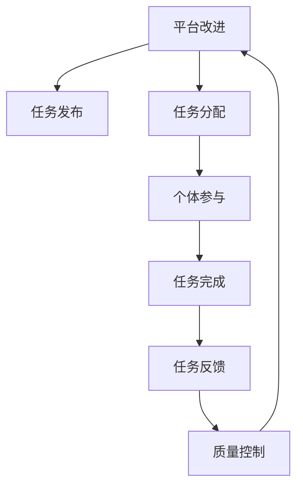

                 

# 众包：释放集体智慧的力量

## 1. 背景介绍

在快速变化的时代，人们面临的信息量爆炸、知识更新加速、复杂问题层出不穷。传统自上而下的知识获取方式，往往难以应对这些挑战。而众包（Crowdsourcing）的兴起，为解决这些问题提供了一种全新的方法。众包通过将任务分发给大量个体，借助他们的集体智慧，快速、高效地完成各类项目。

### 1.1 问题由来

在过去几十年中，信息技术的发展为众包提供了实现的可能。互联网技术降低了信息传播和个体协作的成本，开源软件运动推动了开放协作文化的兴起，而社交网络则进一步拓展了人们连接与合作的空间。众包不仅仅是网络平台上的兼职接单，更是信息时代知识生产、传播和应用的重要方式。

### 1.2 问题核心关键点

众包的核心在于如何有效地组织和管理众包平台上的个体，将分散的智慧集合起来，完成复杂任务。关键点包括：
- **任务分解**：将复杂任务分解为可独立完成的子任务。
- **平台设计**：构建高效的任务分配和反馈机制，保障任务顺利进行。
- **激励机制**：设计合理的激励措施，提高个体参与积极性。
- **质量控制**：保证最终输出质量，避免低质工作。
- **隐私保护**：保护任务和参与者的隐私。

众包方法已经广泛应用于各个领域，如软件测试、数据标注、创新竞赛、在线教育等。通过众包，我们不仅能够迅速解决各类问题，还为科学研究、社会治理、经济创新提供了新的解决方案。

## 2. 核心概念与联系

### 2.1 核心概念概述

众包是一种新兴的知识生产和传播模式，其核心在于将大量个体智慧集合起来，通过平台机制进行组织和管理，完成特定任务。众包涉及的关键概念包括：

- **平台**：众包平台是众包系统的核心组件，提供任务发布、分配、监控等功能。
- **任务**：需要解决的实际问题，分为具体任务和宏观任务。
- **个体**：众包平台上的参与者，包括专家、学生、业余爱好者等。
- **激励**：为参与者提供报酬、荣誉等激励，鼓励高质量参与。
- **质量**：确保最终任务输出的质量，避免低质工作。
- **隐私**：保护参与者和任务的隐私，防止信息泄露。

这些概念相互联系，形成一个完整的众包生态系统。众包平台提供任务管理和激励机制，个体参与者贡献智慧和劳动，最终形成高质量的任务输出。

### 2.2 核心概念原理和架构的 Mermaid 流程图



这个流程图展示了众包的基本流程：平台发布任务，分配任务给个体，个体完成任务，反馈任务完成情况，进行质量控制，最后平台改进以优化流程。

## 3. 核心算法原理 & 具体操作步骤

### 3.1 算法原理概述

众包的核心算法包括任务分解、任务分配、个体激励、质量控制等。

- **任务分解**：将复杂任务分解为若干子任务，简化任务难度，提高效率。
- **任务分配**：根据任务特性和个体能力，合理分配任务给相应个体。
- **个体激励**：通过奖励机制，激励个体高质量完成任务。
- **质量控制**：使用质量检查和反馈机制，确保任务输出质量。

这些算法相互配合，保障了众包系统的正常运行和高效运作。

### 3.2 算法步骤详解

#### 3.2.1 任务分解

任务分解是将大任务拆分成若干可独立完成的子任务。这可以通过任务定义、分解标准和分解算法来实现。例如，对于软件开发，可以将一个大模块分解为多个小功能，每个小功能可以独立实现和测试。

#### 3.2.2 任务分配

任务分配是合理将子任务分配给个体。这可以通过多种算法实现，如贪心算法、优化算法、启发式算法等。例如，可以根据个体历史表现、工作负荷等因素，使用贪心算法分配任务。

#### 3.2.3 个体激励

个体激励是鼓励个体高质量完成任务的机制。这可以通过报酬、荣誉、竞赛等方式实现。例如，可以设置任务奖励、积分系统、排名系统等，提高参与者的积极性。

#### 3.2.4 质量控制

质量控制是确保任务输出的质量，避免低质工作。这可以通过质量检查、反馈机制、重做机制等方式实现。例如，可以通过用户评价、专家评审等方式，对任务输出进行质量检查。

### 3.3 算法优缺点

众包方法具有以下优点：

- **灵活性**：众包平台可以快速应对各种任务，灵活度高。
- **成本低**：相比于传统自上而下的知识获取方式，众包成本较低。
- **多样性**：众包参与者多样，可以引入不同背景和视角，提升任务质量。

但众包也存在以下缺点：

- **质量难以控制**：众包个体水平参差不齐，任务输出质量难以保证。
- **激励机制复杂**：设计合理的激励机制需要考虑多种因素，复杂度高。
- **隐私风险**：众包过程中涉及大量敏感信息，隐私保护难度大。

### 3.4 算法应用领域

众包方法在各个领域得到了广泛应用，以下是几个典型应用：

- **软件开发**：使用众包平台进行软件开发，如Github上的开源项目贡献。
- **数据标注**：众包平台提供大量标注任务，如ImageNet数据集的标注。
- **创新竞赛**：通过众包平台举办创新竞赛，激发创意和创新。
- **在线教育**：使用众包平台进行在线课程开发和教学，如Coursera上的课程制作。
- **市场调研**：众包平台进行市场调研，收集消费者反馈和需求。

## 4. 数学模型和公式 & 详细讲解 & 举例说明

### 4.1 数学模型构建

众包系统可以抽象为一个图模型，其中节点表示任务和个体，边表示任务分配关系。系统目标是通过任务分配和个体激励，最大化任务完成质量和个体满意度。

设任务集为 $T$，个体集为 $W$，任务 $t \in T$ 分配给个体 $w \in W$ 的权重为 $A_{tw}$，个体 $w$ 完成任务 $t$ 的回报为 $R_{tw}$。设任务集合和个体集合的大小分别为 $|T|$ 和 $|W|$。

### 4.2 公式推导过程

我们定义任务完成质量和个体满意度分别为 $Q$ 和 $S$，则众包系统优化目标为：

$$
\max_{A, R} Q \times S
$$

其中 $Q$ 和 $S$ 的计算公式分别为：

$$
Q = \sum_{t \in T} \sum_{w \in W} A_{tw}
$$

$$
S = \sum_{t \in T} \sum_{w \in W} \frac{R_{tw}}{A_{tw}}
$$

目标函数中，$Q$ 表示任务完成质量，$S$ 表示个体满意度。优化目标是通过合理分配任务和设计激励机制，最大化任务完成质量和个体满意度。

### 4.3 案例分析与讲解

以在线教育平台为例，分析众包系统如何设计激励机制，提高课程质量。

平台将课程制作任务分解为多个子任务，如脚本编写、视频录制、测试等。每个子任务分配给合适的个体完成，同时设计合理的报酬机制，如基础报酬、竞赛奖励、用户评分等，激励个体高质量完成任务。通过质量检查和用户反馈，保证课程输出的质量。

## 5. 项目实践：代码实例和详细解释说明

### 5.1 开发环境搭建

众包平台开发需要多种技术和工具支持。以下是搭建开发环境的步骤：

1. 安装Python和相关的开发工具。
2. 选择众包平台技术框架，如Flask、Django等。
3. 配置数据库，如MySQL、PostgreSQL等。
4. 集成第三方API，如AWS、GCP等云服务。
5. 设置自动化测试和部署流程。

### 5.2 源代码详细实现

以在线教育平台为例，下面给出众包平台的核心代码实现：

```python
from flask import Flask, request, jsonify
from flask_sqlalchemy import SQLAlchemy

app = Flask(__name__)
app.config['SQLALCHEMY_DATABASE_URI'] = 'sqlite:////tmp/test.db'
db = SQLAlchemy(app)

class Task(db.Model):
    id = db.Column(db.Integer, primary_key=True)
    name = db.Column(db.String(255))
    description = db.Column(db.Text)
    status = db.Column(db.String(255))

class Worker(db.Model):
    id = db.Column(db.Integer, primary_key=True)
    name = db.Column(db.String(255))
    skills = db.Column(db.Text)

@app.route('/tasks', methods=['POST'])
def create_task():
    data = request.get_json()
    task = Task(name=data['name'], description=data['description'], status='pending')
    db.session.add(task)
    db.session.commit()
    return jsonify({'task_id': task.id})

@app.route('/workers', methods=['POST'])
def create_worker():
    data = request.get_json()
    worker = Worker(name=data['name'], skills=data['skills'])
    db.session.add(worker)
    db.session.commit()
    return jsonify({'worker_id': worker.id})

@app.route('/tasks/assign', methods=['POST'])
def assign_task():
    data = request.get_json()
    task_id = data['task_id']
    worker_id = data['worker_id']
    task = Task.query.get(task_id)
    worker = Worker.query.get(worker_id)
    task.status = 'assigned'
    task.worker_id = worker.id
    db.session.commit()
    return jsonify({'task_status': task.status})

@app.route('/tasks/complete', methods=['POST'])
def complete_task():
    data = request.get_json()
    task_id = data['task_id']
    task = Task.query.get(task_id)
    task.status = 'completed'
    db.session.commit()
    return jsonify({'task_status': task.status})

@app.route('/tasks/feedback', methods=['POST'])
def give_feedback():
    data = request.get_json()
    task_id = data['task_id']
    rating = data['rating']
    task = Task.query.get(task_id)
    task.rating = rating
    db.session.commit()
    return jsonify({'task_rating': task.rating})
```

### 5.3 代码解读与分析

这段代码实现了在线教育平台的核心功能，包括任务创建、个体注册、任务分配、任务完成和反馈机制。主要实现步骤如下：

1. 使用Flask框架搭建平台后端，配置数据库。
2. 定义Task和Worker模型，分别表示任务和个体。
3. 实现任务创建和个体注册接口，供平台管理员使用。
4. 实现任务分配接口，将任务分配给个体。
5. 实现任务完成和反馈接口，供个体完成并评价任务。

### 5.4 运行结果展示

运行上述代码，可以搭建一个简单的在线教育平台。管理员可以通过RESTful API创建任务和个体，任务可以根据个体技能和历史表现进行分配。个体完成并评价任务后，平台会记录任务完成质量和个体满意度。

## 6. 实际应用场景

### 6.1 智能制造

智能制造需要大量的设计、调试和优化任务，这些任务往往复杂且耗时。通过众包平台，企业可以快速聚集大量工程师和专家，完成各类设计优化、工艺改进和设备调试任务，提升生产效率和产品质量。

### 6.2 农业科技

农业科技涉及大量的田间实验和数据分析任务，如作物育种、土壤分析、病虫害检测等。众包平台可以将这些任务分配给农村技术员和科研人员，通过实地调研和数据分析，获取大量有益信息，推动农业科技进步。

### 6.3 医疗健康

医疗健康领域涉及大量医疗数据标注、医学影像分析和疾病预测任务。众包平台可以将这些任务分配给医生、护士和医学院学生，通过大量标注和分析，提升医疗数据的准确性和诊断的可靠性。

### 6.4 未来应用展望

未来，众包将在更多领域得到应用，为各个行业带来新的变革：

- **金融科技**：使用众包平台进行金融数据分析和模型开发，提升金融服务的智能化水平。
- **环境保护**：众包平台进行环境监测和数据分析，推动环境保护工作。
- **灾害应对**：众包平台收集和分析灾害数据，支持灾害预警和应对。
- **教育科技**：众包平台进行在线教育内容开发和学生辅导，提升教育质量。
- **健康科技**：众包平台进行健康数据收集和疾病预测，推动健康科技发展。

## 7. 工具和资源推荐

### 7.1 学习资源推荐

为了帮助开发者系统掌握众包技术的理论基础和实践技巧，这里推荐一些优质的学习资源：

1. 《Crowdsourcing for Innovation》：详细介绍了众包在创新管理中的应用。
2. 《Crowdsourcing: A short guide to collecting big data on small scales》：讲解了众包数据收集的原理和实践。
3. 《Crowdsourcing as an Online Labor Market》：分析了众包平台作为在线劳动市场的运作机制。
4. 《Crowdsourcing: Theory and Practice》：提供了众包理论和实践的全面介绍。
5. Coursera上的《Introduction to Crowdsourcing》课程：由密歇根大学开设，深入讲解了众包的基本概念和应用。

通过这些资源的学习实践，相信你一定能够快速掌握众包技术的精髓，并用于解决实际的业务问题。

### 7.2 开发工具推荐

高效的开发离不开优秀的工具支持。以下是几款用于众包平台开发的常用工具：

1. Flask：轻量级Web开发框架，适合快速搭建后端系统。
2. Django：全栈Web框架，提供丰富的功能模块，适合复杂系统开发。
3. SQLAlchemy：Python ORM库，方便数据库操作。
4. AWS Lambda：云函数服务，适合微服务架构。
5. Google Cloud Functions：Google云函数服务，适合云平台部署。
6. Jenkins：持续集成和部署工具，自动化测试和部署流程。

合理利用这些工具，可以显著提升众包平台的开发效率，加快创新迭代的步伐。

### 7.3 相关论文推荐

众包技术的快速发展源于学界的持续研究。以下是几篇奠基性的相关论文，推荐阅读：

1. "Crowdsourcing: Task Design, Coordination, and Production"：探讨了众包任务设计和管理的基本原则。
2. "The Spoken language experience platform: Real-world crowdsourcing for improving healthcare"：介绍了众包在医疗领域的应用。
3. "Crowdsourcing for Analytics"：讲解了众包在数据分析中的应用。
4. "Crowdsourcing as a Digital Revolution"：分析了众包对数字经济的影响。
5. "Crowdsourcing the Discovery of New Drugs"：介绍了众包在药物发现中的应用。

这些论文代表了大众技术的发展脉络。通过学习这些前沿成果，可以帮助研究者把握学科前进方向，激发更多的创新灵感。

## 8. 总结：未来发展趋势与挑战

### 8.1 总结

本文对众包技术进行了全面系统的介绍。首先阐述了众包技术的研究背景和意义，明确了众包在信息时代知识生产和传播中的独特价值。其次，从原理到实践，详细讲解了众包系统的构建和运作机制，给出了平台开发的完整代码实例。同时，本文还广泛探讨了众包方法在智能制造、农业科技、医疗健康等多个领域的应用前景，展示了众包技术的巨大潜力。

通过本文的系统梳理，可以看到，众包技术在各个领域都展现了强大的应用价值，为各行各业的知识生产和传播提供了新的解决方案。未来，伴随技术的不断演进和应用场景的拓展，众包必将成为信息时代知识生产和传播的重要手段，推动人类社会的发展进步。

### 8.2 未来发展趋势

展望未来，众包技术将呈现以下几个发展趋势：

1. **自动化和智能化**：随着AI技术的发展，众包平台将具备更强的自动化和智能化能力，提高任务分配和个体激励的效率和精度。
2. **数据驱动**：众包平台将更多依赖数据驱动，通过数据分析和机器学习优化任务分配和个体激励，提升平台性能。
3. **多模态融合**：众包平台将支持多模态数据融合，结合文本、图像、视频等多种信息，提升任务处理能力。
4. **生态系统建设**：众包平台将构建更完整的生态系统，包括个体、任务、市场、监管等多个维度，形成良性循环。
5. **全球化**：众包平台将跨越地域限制，实现全球协作，汇聚全球智慧。

这些趋势凸显了众包技术的广阔前景。这些方向的探索发展，必将进一步提升众包平台的功能和效能，为社会治理、经济创新等领域带来新的突破。

### 8.3 面临的挑战

尽管众包技术已经取得了显著成效，但在迈向更加智能化、普适化应用的过程中，仍面临诸多挑战：

1. **质量控制**：众包个体水平参差不齐，任务输出质量难以保证。
2. **激励机制**：设计合理的激励机制需要考虑多种因素，复杂度高。
3. **隐私保护**：众包过程中涉及大量敏感信息，隐私保护难度大。
4. **平台管理**：众包平台需要高效管理大量个体和任务，管理复杂度较高。
5. **成本控制**：众包平台的运营成本较高，需要合理控制和管理。

这些挑战需要更多的研究和技术创新来解决，才能使众包技术在更广阔的应用领域发挥更大作用。

### 8.4 研究展望

未来，众包技术的研究方向主要集中在以下几个方面：

1. **自动化和智能化**：开发更高效的自动化和智能化算法，提升众包平台的功能和效率。
2. **数据驱动**：深入研究数据驱动的众包平台设计，通过数据分析和机器学习优化任务分配和个体激励。
3. **多模态融合**：研究多模态数据融合的技术和方法，提升众包平台的多样性和处理能力。
4. **生态系统建设**：研究众包平台的生态系统建设，形成更完善的平台功能和更健康的生态循环。
5. **全球化和标准化**：推动众包平台的标准化建设，促进全球协作和共享。

这些方向的研究将进一步推动众包技术的发展，使其在更多领域发挥更大的作用。

## 9. 附录：常见问题与解答

**Q1: 众包平台如何提高任务完成质量和个体满意度？**

A: 众包平台可以通过以下方式提高任务完成质量和个体满意度：
1. **质量控制**：通过质量检查和反馈机制，确保任务输出质量。
2. **激励机制**：设计合理的激励措施，提高个体参与积极性。
3. **任务分配**：根据个体能力和历史表现，合理分配任务。
4. **平台改进**：根据用户反馈，不断优化平台功能和用户体验。

**Q2: 众包平台如何处理众包个体水平参差不齐的问题？**

A: 众包平台可以通过以下方式处理众包个体水平参差不齐的问题：
1. **任务筛选**：筛选高质量的个体参与关键任务，确保任务完成质量。
2. **培训和教育**：通过培训和教育，提升个体技能和知识水平。
3. **多级审核**：设计多级审核机制，确保任务完成质量。
4. **质量控制**：通过质量检查和反馈机制，及时发现和纠正低质工作。

**Q3: 众包平台如何保护任务和个体的隐私？**

A: 众包平台可以通过以下方式保护任务和个体的隐私：
1. **匿名化处理**：对任务和个体信息进行匿名化处理，保护隐私。
2. **访问控制**：严格控制任务和个体信息的访问权限，防止信息泄露。
3. **数据加密**：使用数据加密技术，保护数据传输和存储安全。
4. **隐私政策**：制定明确的隐私政策，告知用户隐私保护措施和权限。

通过这些措施，众包平台可以有效保护任务和个体的隐私，增强用户信任和平台可靠性。

**Q4: 众包平台如何应对平台管理复杂度？**

A: 众包平台可以通过以下方式应对平台管理复杂度：
1. **自动化工具**：使用自动化工具，提高任务分配和个体激励的效率。
2. **智能算法**：开发智能算法，优化平台功能和用户体验。
3. **多级审核**：设计多级审核机制，确保任务完成质量。
4. **用户反馈**：收集用户反馈，不断优化平台功能和用户体验。

通过这些措施，众包平台可以有效应对平台管理复杂度，提高平台运行效率和用户满意度。

**Q5: 众包平台如何控制运营成本？**

A: 众包平台可以通过以下方式控制运营成本：
1. **任务分解**：将复杂任务分解为若干子任务，简化任务难度，提高效率。
2. **优化激励机制**：设计合理的激励机制，减少成本支出。
3. **平台自动化**：使用自动化工具，提高平台运行效率，减少人工投入。
4. **数据驱动**：通过数据分析和机器学习优化任务分配和个体激励，提高平台效率。

通过这些措施，众包平台可以有效控制运营成本，提高平台效益和用户满意度。

---

作者：禅与计算机程序设计艺术 / Zen and the Art of Computer Programming

