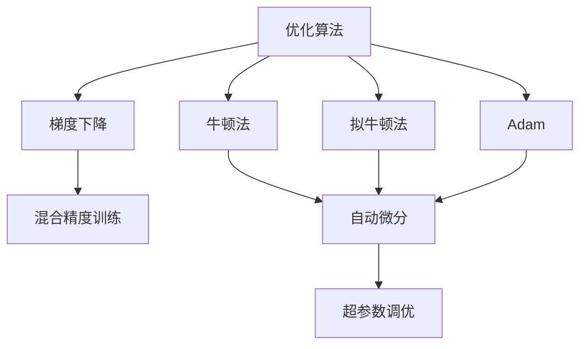

                 

# 优化算法在工业界的应用

> 关键词：优化算法,工业界,梯度下降,牛顿法,拟牛顿法,Adam,混合精度训练,自动微分,超参数调优

## 1. 背景介绍

### 1.1 问题由来
在现代工业界，算法优化是核心竞争力之一。从工业生产线上的自动化控制，到软件开发中的性能优化，再到机器学习中的模型训练，优化算法的应用无处不在。随着大数据、人工智能等技术的迅猛发展，优化算法的优化范围和优化性能需求也相应提高。在深度学习领域，优化算法更是成为神经网络训练的核心所在。

### 1.2 问题核心关键点
工业界应用优化算法主要有以下关键点：
- 高效的算法和工具：需要快速高效地找到最优解，同时能够大规模处理数据和模型。
- 稳定性：算法需要具备良好的鲁棒性，对不同规模、不同结构的问题都能稳健运行。
- 可扩展性：算法需要具备高度的可扩展性，能够适应分布式计算环境，处理大规模数据集。
- 自动调参：自动调参能够大幅提高模型训练效率，是工业界优化算法的重要应用方向。
- 融合多种优化技术：融合梯度下降、牛顿法、拟牛顿法等多种优化技术，最大化优化效果。

## 2. 核心概念与联系

### 2.1 核心概念概述

为更好地理解工业界优化算法，本节将介绍几个密切相关的核心概念：

- 优化算法(Optimization Algorithm)：指用于最小化或最大化某个目标函数的算法。在工业界，优化算法广泛应用于参数调整、成本最小化、系统优化等领域。

- 梯度下降(Gradient Descent)：是优化算法中最基本的一种，通过计算目标函数的梯度方向来更新变量，逐步逼近最优解。在深度学习中，梯度下降是神经网络训练的核心。

- 牛顿法(Newton's Method)：一种基于目标函数二阶导数的优化算法，收敛速度较快，但计算复杂度较高，通常用于高精度计算。

- 拟牛顿法(Quasi-Newton Methods)：如BFGS、L-BFGS等，是一种近似牛顿法，通过目标函数的Hessian矩阵近似逼近来优化。

- Adam：一种基于梯度的自适应优化算法，结合了动量项和自适应学习率，能够快速收敛且具有稳定性。

- 混合精度训练(Mixed-Precision Training)：通过使用不同精度的数据和权重来加速模型训练，同时提升模型精度。

- 自动微分(Automatic Differentiation)：通过符号计算或数值计算，自动求导，减少手动求导的复杂性和误差。

- 超参数调优(Hyperparameter Tuning)：调整模型的超参数以优化性能，是工业界优化算法的重要应用方向。

这些核心概念之间的逻辑关系可以通过以下Mermaid流程图来展示：



这个流程图展示了几类优化算法及其与自动微分、混合精度训练、超参数调优等技术的关系：

1. 优化算法通过梯度下降、牛顿法、拟牛顿法等具体实现方式来最小化或最大化目标函数。
2. 自动微分技术为优化算法提供了精确的目标函数求导过程，是梯度下降、牛顿法、Adam等算法的核心支撑。
3. 混合精度训练通过减少计算量、提升精度，加速了优化算法的运行效率。
4. 超参数调优通过调整学习率、批次大小、优化器等超参数，优化算法性能。

这些核心概念共同构成了工业界优化算法的应用框架，使得算法能够在大规模数据和模型上高效运行，并持续提升性能。

## 3. 核心算法原理 & 具体操作步骤
### 3.1 算法原理概述

工业界优化算法的主要目标是最大化或最小化某个目标函数 $f(x)$。以深度学习中的损失函数为例，设目标为最小化损失函数 $L(w)$，其中 $w$ 为模型参数。优化算法的核心是使用合适的迭代策略，不断更新参数 $w$，使损失函数 $L(w)$ 逐步逼近最小值。

形式化地，假设当前参数为 $w^{(t)}$，优化算法的迭代公式为：

$$
w^{(t+1)} = w^{(t)} - \alpha \nabla L(w^{(t)})
$$

其中，$\alpha$ 为步长，$\nabla L(w^{(t)})$ 为损失函数 $L(w)$ 对参数 $w$ 的梯度，可以通过自动微分等技术计算。

### 3.2 算法步骤详解

工业界优化算法的核心步骤如下：

1. **初始化**：
   - 选择初始参数 $w^{(0)}$。
   - 确定目标函数 $L(w)$ 和目标。

2. **迭代更新**：
   - 计算目标函数的梯度 $\nabla L(w^{(t)})$。
   - 根据梯度方向更新参数 $w^{(t+1)}$。
   - 根据目标和当前参数计算损失 $L(w^{(t+1)})$。

3. **收敛判断**：
   - 当损失函数达到预设阈值或迭代次数达到预设上限时，停止迭代。
   - 返回最优参数 $w^*$。

### 3.3 算法优缺点

工业界优化算法具有以下优点：
1. 高效性：算法能够在短时间内找到最优解，适合大规模数据和模型的训练。
2. 可扩展性：算法能够适应分布式计算环境，处理大规模数据集。
3. 自动化：自动调参和混合精度训练等技术能够提升算法性能，减少手动调参的复杂性。
4. 鲁棒性：算法能够应对各种复杂目标函数，具备较强的鲁棒性。

同时，这些算法也存在一些局限性：
1. 初始值敏感：优化算法对初始值敏感，初始值不当可能导致算法无法收敛。
2. 计算复杂度高：某些算法如牛顿法计算复杂度高，不适用于大规模数据集。
3. 超参数调优困难：需要手动调整超参数，增加了算法调优的复杂性。

### 3.4 算法应用领域

工业界优化算法广泛应用于各种领域：

1. 机器学习与深度学习：优化算法是神经网络训练的核心，用于最小化损失函数。

2. 自动化与机器人控制：优化算法用于控制机器人、自动化生产线的运动轨迹和参数，提升系统性能。

3. 金融与经济分析：优化算法用于优化投资组合、风险管理、市场预测等，提升金融决策的精准度。

4. 物流与供应链管理：优化算法用于优化物流路径、库存管理、配送时间等，提升供应链效率。

5. 信号与图像处理：优化算法用于图像去噪、目标检测、信号滤波等，提升图像和信号的质量。

6. 生物医药：优化算法用于药物设计、基因编辑、生物信息学等领域，提升科学研究的精准性。

以上领域都高度依赖于高效、稳定的优化算法，未来随着技术的发展，优化算法的应用范围将进一步扩展。

## 4. 数学模型和公式 & 详细讲解 & 举例说明

### 4.1 数学模型构建

我们以梯度下降算法为例，形式化地描述其数学模型构建过程。设目标函数为 $L(w)$，其中 $w$ 为模型参数，目标为最小化损失函数 $L(w)$。梯度下降算法的目标函数为：

$$
L(w) = \frac{1}{2} \sum_{i=1}^{m} (y_i - f(x_i, w))^2
$$

其中，$y_i$ 为训练样本的真实标签，$f(x_i, w)$ 为模型对样本 $x_i$ 的预测，$m$ 为样本数量。

目标函数的最小值为：

$$
\min_{w} L(w)
$$

### 4.2 公式推导过程

梯度下降算法的核心在于不断更新参数 $w$，使得损失函数 $L(w)$ 最小化。算法的迭代公式为：

$$
w^{(t+1)} = w^{(t)} - \alpha \nabla L(w^{(t)})
$$

其中，$\nabla L(w)$ 为目标函数 $L(w)$ 对参数 $w$ 的梯度，$\alpha$ 为学习率，通常设置为一个小于1的常数。梯度 $\nabla L(w)$ 的计算公式为：

$$
\nabla L(w) = \frac{\partial L(w)}{\partial w}
$$

### 4.3 案例分析与讲解

以线性回归为例，考虑目标函数 $L(w) = \frac{1}{2} \sum_{i=1}^{m} (y_i - f(x_i, w))^2$，其中 $f(x_i, w) = w^T x_i + b$，$x_i$ 为样本特征，$w$ 为模型参数，$b$ 为截距。

假设初始参数 $w^{(0)}$ 和 $b^{(0)}$，学习率为 $\alpha$，则梯度下降的迭代公式为：

$$
w^{(t+1)} = w^{(t)} - \alpha (\sum_{i=1}^{m} (y_i - f(x_i, w^{(t)}))x_i)
$$
$$
b^{(t+1)} = b^{(t)} - \alpha \sum_{i=1}^{m} (y_i - f(x_i, w^{(t)}))
$$

通过不断迭代，更新参数 $w$ 和 $b$，直到损失函数 $L(w)$ 收敛。

## 5. 项目实践：代码实例和详细解释说明
### 5.1 开发环境搭建

在进行优化算法实践前，我们需要准备好开发环境。以下是使用Python进行PyTorch开发的环境配置流程：

1. 安装Anaconda：从官网下载并安装Anaconda，用于创建独立的Python环境。

2. 创建并激活虚拟环境：
```bash
conda create -n pytorch-env python=3.8 
conda activate pytorch-env
```

3. 安装PyTorch：根据CUDA版本，从官网获取对应的安装命令。例如：
```bash
conda install pytorch torchvision torchaudio cudatoolkit=11.1 -c pytorch -c conda-forge
```

4. 安装各类工具包：
```bash
pip install numpy pandas scikit-learn matplotlib tqdm jupyter notebook ipython
```

完成上述步骤后，即可在`pytorch-env`环境中开始优化算法实践。

### 5.2 源代码详细实现

这里我们以Adam优化算法为例，给出使用PyTorch进行深度学习模型训练的PyTorch代码实现。

首先，定义深度学习模型：

```python
import torch.nn as nn
import torch.optim as optim

class LinearModel(nn.Module):
    def __init__(self, input_dim, output_dim):
        super(LinearModel, self).__init__()
        self.linear = nn.Linear(input_dim, output_dim)

    def forward(self, x):
        return self.linear(x)
```

接着，定义Adam优化器和数据集：

```python
optimizer = optim.Adam(model.parameters(), lr=0.01)

train_dataset = torch.utils.data.TensorDataset(torch.randn(1000, 10), torch.randn(1000, 5))
train_loader = torch.utils.data.DataLoader(train_dataset, batch_size=32, shuffle=True)
```

然后，定义训练函数：

```python
def train_epoch(model, optimizer, data_loader, loss_fn):
    model.train()
    for batch in data_loader:
        inputs, labels = batch
        optimizer.zero_grad()
        outputs = model(inputs)
        loss = loss_fn(outputs, labels)
        loss.backward()
        optimizer.step()
```

最后，启动训练流程：

```python
loss_fn = nn.MSELoss()
epochs = 10

for epoch in range(epochs):
    train_epoch(model, optimizer, train_loader, loss_fn)
```

以上就是使用PyTorch进行Adam优化算法实现线性回归模型的完整代码实现。可以看到，利用PyTorch的高级API，我们只需短短几行代码，就能实现高效的深度学习模型训练。

### 5.3 代码解读与分析

让我们再详细解读一下关键代码的实现细节：

**LinearModel类**：
- `__init__`方法：初始化模型参数。
- `forward`方法：定义模型前向传播过程。

**优化器定义**：
- `optimizer`变量：定义Adam优化器。

**数据集定义**：
- `train_dataset`：使用`torch.utils.data`定义训练数据集，包含随机生成的输入和标签。
- `train_loader`：使用`torch.utils.data.DataLoader`将数据集拆分成批处理数据。

**训练函数**：
- `train_epoch`：在每个epoch中，对数据进行迭代，计算损失并反向传播更新参数。

**训练循环**：
- `loss_fn`：定义均方误差损失函数。
- `epochs`：定义训练轮数。

可以看到，PyTorch提供了丰富的高级API，使得优化算法的实践过程变得非常简单。开发者可以专注于模型结构和优化器选择等高层逻辑，而不必过多关注底层的实现细节。

当然，在工业级的系统实现中，还需要考虑更多因素，如超参数调优、自动混合精度训练、模型并行等。但核心的优化算法基本与此类似。

## 6. 实际应用场景
### 6.1 金融风险评估

金融领域需要实时评估市场风险，预测股票价格、利率波动等。传统的统计模型和人工规则难以应对市场数据的高频变化和复杂性。基于优化算法的机器学习模型，特别是深度学习模型，能够在大量历史数据基础上建立预测模型，提供更准确的金融风险评估。

在实践中，可以通过收集历史金融数据，构建训练集，训练基于深度学习模型（如LSTM、RNN等）的风险评估模型。利用优化算法，最小化模型预测误差，从而提升金融风险评估的准确度。

### 6.2 自动驾驶

自动驾驶系统需要实时处理车辆周围环境数据，预测并规划行驶路径。传统的控制算法难以处理多源异构数据和高维度动态环境。基于优化算法的深度学习模型，能够自动学习并优化传感器数据处理和路径规划，提升自动驾驶系统的安全性和稳定性。

在实践中，可以通过收集自动驾驶车辆的传感器数据，训练基于深度学习模型的路径规划和决策模型。利用优化算法，最小化模型预测误差和决策损失，从而提升自动驾驶系统的性能。

### 6.3 工业流程优化

工业生产流程中的自动化控制需要高效响应生产环境的变化，提升生产效率和产品质量。传统的PID控制等算法难以应对复杂多变的环境因素。基于优化算法的深度学习模型，能够自动学习并优化生产流程，提升生产自动化水平。

在实践中，可以通过收集工业生产数据，构建训练集，训练基于深度学习模型的生产控制模型。利用优化算法，最小化模型预测误差和生产成本，从而提升生产流程的效率和质量。

### 6.4 未来应用展望

随着优化算法的不断发展，其在工业界的应用前景将更加广阔。以下列出几点未来发展趋势：

1. **融合多种优化技术**：未来优化算法将融合梯度下降、牛顿法、拟牛顿法等多种优化技术，最大化优化效果，提升模型精度和鲁棒性。

2. **自适应优化**：优化算法将具备更强的自适应能力，能够根据数据特征和模型状态动态调整算法参数，提升优化效率和稳定性。

3. **分布式优化**：优化算法将更加适应分布式计算环境，具备高度的可扩展性和并行性，处理大规模数据集。

4. **多目标优化**：优化算法将能够处理多目标优化问题，同时优化多个指标，提升系统综合性能。

5. **实时优化**：优化算法将具备更强的实时性，能够实时处理动态环境下的优化问题，提升系统响应速度。

## 7. 工具和资源推荐
### 7.1 学习资源推荐

为了帮助开发者系统掌握优化算法的理论基础和实践技巧，这里推荐一些优质的学习资源：

1. 《深度学习》书籍：Ian Goodfellow、Yoshua Bengio、Aaron Courville合著，全面介绍深度学习的基本概念和优化算法。

2. CS231n《卷积神经网络》课程：斯坦福大学开设的深度学习明星课程，讲解深度学习模型的优化和训练。

3. 《Python深度学习》书籍：Francois Chollet著，结合TensorFlow和Keras实现深度学习模型的优化和训练。

4. PyTorch官方文档：PyTorch的官方文档，提供丰富的优化算法和深度学习模型实现。

5. Google AutoML：谷歌提供的自动化机器学习平台，支持使用优化算法训练多种深度学习模型。

通过对这些资源的学习实践，相信你一定能够快速掌握优化算法的精髓，并用于解决实际的深度学习问题。

### 7.2 开发工具推荐

高效的开发离不开优秀的工具支持。以下是几款用于深度学习模型优化开发的常用工具：

1. PyTorch：基于Python的开源深度学习框架，灵活动态的计算图，适合快速迭代研究。

2. TensorFlow：由Google主导开发的开源深度学习框架，生产部署方便，适合大规模工程应用。

3. Keras：高层次深度学习API，易于上手，适合初学者和快速原型开发。

4. JAX：Google开发的张量计算框架，支持自动微分和向量-矩阵优化，具备高性能计算能力。

5. TensorBoard：TensorFlow配套的可视化工具，可实时监测模型训练状态，并提供丰富的图表呈现方式。

6. Weights & Biases：模型训练的实验跟踪工具，可以记录和可视化模型训练过程中的各项指标，方便对比和调优。

合理利用这些工具，可以显著提升深度学习模型优化任务的开发效率，加快创新迭代的步伐。

### 7.3 相关论文推荐

深度学习和优化算法的发展源于学界的持续研究。以下是几篇奠基性的相关论文，推荐阅读：

1. Deep Learning（Ian Goodfellow等著）：全面介绍深度学习的基本概念和优化算法。

2. On the Importance of Initialization and Momentum in Deep Learning（Sutskever等著）：介绍初始化和动量项对深度学习模型的影响。

3. Adam: A Method for Stochastic Optimization（Kingma等著）：提出Adam优化算法，结合动量项和自适应学习率，快速收敛且具有稳定性。

4. Adaptive Moment Estimation（王晋东等著）：改进Adam算法，提出Adaptive Moment Estimation（AdaMax、RMSprop等），进一步提升优化效果。

5. Neural Architecture Search with Reinforcement Learning（Zoph等著）：提出基于强化学习的神经网络架构搜索方法，优化模型设计。

这些论文代表了大模型优化技术的发展脉络。通过学习这些前沿成果，可以帮助研究者把握学科前进方向，激发更多的创新灵感。

## 8. 总结：未来发展趋势与挑战
### 8.1 总结

本文对工业界优化算法进行了全面系统的介绍。首先阐述了优化算法在工业界的应用背景和重要性，明确了优化算法在模型训练、系统优化、金融决策等领域的独特价值。其次，从原理到实践，详细讲解了梯度下降、Adam、牛顿法等优化算法的核心步骤，给出了优化算法任务开发的完整代码实例。同时，本文还广泛探讨了优化算法在金融风险评估、自动驾驶、工业流程优化等多个领域的应用前景，展示了优化算法的巨大潜力。此外，本文精选了优化算法的各类学习资源，力求为读者提供全方位的技术指引。

通过本文的系统梳理，可以看到，优化算法在工业界的广泛应用和高效性能，极大地提升了各类系统的智能化水平和自动化程度。未来，伴随算法优化技术的发展，深度学习模型将具备更强的适应性和泛化能力，加速智能化社会的建设。

### 8.2 未来发展趋势

展望未来，优化算法将呈现以下几个发展趋势：

1. **融合多种优化技术**：未来优化算法将融合梯度下降、牛顿法、拟牛顿法等多种优化技术，最大化优化效果，提升模型精度和鲁棒性。

2. **自适应优化**：优化算法将具备更强的自适应能力，能够根据数据特征和模型状态动态调整算法参数，提升优化效率和稳定性。

3. **分布式优化**：优化算法将更加适应分布式计算环境，具备高度的可扩展性和并行性，处理大规模数据集。

4. **多目标优化**：优化算法将能够处理多目标优化问题，同时优化多个指标，提升系统综合性能。

5. **实时优化**：优化算法将具备更强的实时性，能够实时处理动态环境下的优化问题，提升系统响应速度。

6. **自动化调参**：自动化调参技术将使得优化算法更加高效便捷，减少手动调参的复杂性。

以上趋势凸显了工业界优化算法的广阔前景。这些方向的探索发展，必将进一步提升深度学习模型的性能和应用范围，为智能化社会的建设提供更强大的技术支撑。

### 8.3 面临的挑战

尽管优化算法已经取得了瞩目成就，但在迈向更加智能化、普适化应用的过程中，它仍面临着诸多挑战：

1. **计算资源消耗大**：优化算法的计算复杂度高，对计算资源消耗较大，在大规模数据集上运行时需要高性能计算资源。

2. **超参数调优困难**：优化算法的性能受超参数影响较大，需要手动调整超参数，增加了算法调优的复杂性。

3. **模型鲁棒性不足**：优化算法对初始值敏感，初始值不当可能导致算法无法收敛，模型鲁棒性有待提升。

4. **实时性不足**：优化算法处理动态环境下的优化问题时，实时性往往不足，难以满足实时性要求高的场景。

5. **多目标优化复杂**：多目标优化问题复杂，难以同时优化多个指标，需要更高级的算法和工具。

6. **模型公平性和安全性**：优化算法生成的模型可能存在公平性不足和安全性问题，需要进一步改进。

正视优化算法面临的这些挑战，积极应对并寻求突破，将使其在工业界更好地发挥作用，推动人工智能技术在各行各业的应用和普及。

### 8.4 研究展望

面对工业界优化算法所面临的挑战，未来的研究需要在以下几个方面寻求新的突破：

1. **自适应优化**：开发更高效的自适应优化算法，根据数据特征和模型状态动态调整算法参数，提升优化效率和稳定性。

2. **分布式优化**：开发更高效的分布式优化算法，适应分布式计算环境，处理大规模数据集。

3. **自动化调参**：开发更智能的自动化调参技术，减少手动调参的复杂性，提升算法性能。

4. **实时优化**：开发更高效的实时优化算法，提升模型在动态环境下的响应速度和精度。

5. **多目标优化**：开发更高效的多目标优化算法，同时优化多个指标，提升系统综合性能。

6. **模型公平性和安全性**：改进优化算法，增强模型的公平性和安全性，确保输出符合人类价值观和伦理道德。

这些研究方向将进一步提升优化算法的性能和应用范围，为人工智能技术在工业界的落地应用提供更强大的技术支撑。面向未来，优化算法将与其他人工智能技术进行更深入的融合，共同推动智能化社会的建设。总之，优化算法需要不断创新和突破，才能在工业界发挥更大的作用。

## 9. 附录：常见问题与解答

**Q1：优化算法和深度学习模型训练的异同点是什么？**

A: 优化算法和深度学习模型训练是深度学习应用中的两个核心过程。优化算法的核心目标是最大化或最小化目标函数，而深度学习模型训练的目标是最小化损失函数。优化算法是模型训练的核心，通过不断调整模型参数，使得模型预测结果与真实标签一致。两者虽然目标一致，但优化算法更关注算法的效率和鲁棒性，而深度学习模型训练更关注模型的性能和泛化能力。

**Q2：如何选择合适的优化算法？**

A: 选择合适的优化算法需要综合考虑数据规模、模型结构、计算资源等因素。通常，对于大规模数据集，选择具有高性能和高效性的优化算法，如Adam、SGD等。对于模型结构较复杂、参数较多的深度学习模型，选择自适应学习率、动量项等具备较高稳定性的算法。同时，需要根据实际应用场景，考虑模型响应速度和实时性等需求。

**Q3：优化算法的超参数有哪些？**

A: 优化算法的超参数包括学习率、批次大小、动量项、自适应学习率等。这些超参数需要根据实际应用场景进行调整。例如，学习率过大会导致模型不稳定，过小则训练速度较慢。批次大小决定了模型的收敛速度和稳定性，需要根据数据集大小和计算资源进行调整。动量项和自适应学习率等超参数也需根据具体模型和数据特点进行调整。

**Q4：优化算法如何处理多目标优化问题？**

A: 多目标优化问题通常涉及多个指标，如模型精度、计算速度、资源消耗等。处理多目标优化问题的方法包括：

1. **权重优化**：为每个目标函数设置权重，通过优化加权目标函数来综合多个指标。

2. **多目标优化算法**：如Pareto最优解、多目标遗传算法等，通过多目标优化算法同时优化多个目标函数。

3. **单目标优化方法**：如强化学习等，通过多次训练不同模型来优化多个目标函数。

**Q5：如何处理优化算法中的计算资源消耗问题？**

A: 优化算法的计算资源消耗较大，特别是在大规模数据集上运行时。处理该问题的方法包括：

1. **分布式优化**：通过分布式计算环境，如Hadoop、Spark等，将计算任务分配到多个计算节点上，提升计算效率。

2. **混合精度训练**：通过使用不同精度的数据和权重，减少计算量和存储空间，提升计算效率。

3. **模型并行**：通过将模型分解为多个子模型，并行计算，提升计算效率。

4. **硬件加速**：利用GPU、TPU等高性能计算硬件，提升计算速度。

通过以上措施，可以显著降低优化算法的计算资源消耗，提升其在大规模数据集上的应用效率。

这些研究方向将进一步提升优化算法的性能和应用范围，为人工智能技术在工业界的落地应用提供更强大的技术支撑。面向未来，优化算法将与其他人工智能技术进行更深入的融合，共同推动智能化社会的建设。总之，优化算法需要不断创新和突破，才能在工业界发挥更大的作用。

