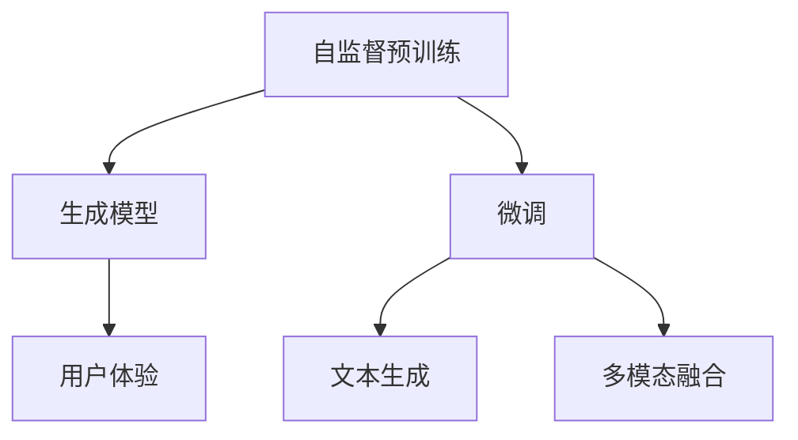

                 

# 体验的叙事性：AI驱动的个人故事创作

## 1. 背景介绍

### 1.1 问题由来

随着人工智能技术的发展，自然语言处理(Natural Language Processing, NLP)领域涌现出众多突破性进展。其中，生成式模型因其能够根据输入生成连贯、丰富的文本输出，而备受瞩目。AI驱动的生成故事已成为当前NLP研究的热点方向之一。通过AI技术，个人故事创作不仅能够提高创作效率，还能激发更多的创造力。

### 1.2 问题核心关键点

AI驱动的个人故事创作，本质上是利用深度学习模型，将自然语言输入转化为连贯、丰富的故事文本输出。其核心在于：
- 构建合适的生成模型：如基于Transformer的GPT模型，通过自监督预训练任务（如掩码语言模型）学习通用的语言表示。
- 微调模型适配具体任务：在特定领域或特定风格的故事数据上进行微调，使其生成符合特定要求的故事。
- 实现多模态信息融合：将文本输入与其他信息源（如图像、音频）结合，生成更加丰富多样的故事内容。
- 关注用户体验：设计友好的用户界面，支持故事编辑、修改和交互，提升用户创作体验。

本文将全面探讨AI驱动的个人故事创作，从模型构建、微调、多模态融合、用户体验等方面进行深入分析。通过理解这些核心概念和技术的逻辑联系，希望能为故事创作的AI实践提供有价值的指导。

## 2. 核心概念与联系

### 2.1 核心概念概述

- 生成模型(Generative Model)：指能够根据输入生成新的文本、图像、音频等内容的模型。其中，文本生成模型是AI驱动故事创作的核心。
- 自监督预训练(Pre-training)：指在无标注数据上，通过自监督学习任务（如掩码语言模型）训练生成模型。自监督预训练使得模型学习到通用的语言表示，提高了模型生成连贯文本的能力。
- 微调(Fine-tuning)：指在预训练模型的基础上，通过下游任务的少量标注数据进行有监督微调，优化模型在特定任务上的性能。微调是故事创作模型适应用户需求的关键步骤。
- 多模态融合(Multimodal Fusion)：指将文本与其他信息源（如图像、音频）结合，生成更加丰富多样的故事内容。多模态融合使得故事创作更具沉浸感和交互性。
- 用户体验(User Experience)：指通过友好的用户界面，支持用户创作、编辑和分享故事，提升创作体验和故事传播效果。

这些核心概念之间的关系如图示：



这个图表展示了各个核心概念之间的逻辑联系：自监督预训练构建了生成模型的基础能力；微调适配了特定任务需求；多模态融合丰富了故事表达方式；用户体验提升了故事创作体验。

## 3. 核心算法原理 & 具体操作步骤
### 3.1 算法原理概述

AI驱动的个人故事创作过程主要包括以下几个步骤：
1. 收集和预处理数据集：获取大量具有代表性的故事文本数据，并进行预处理，如分词、去除停用词、标准化等。
2. 构建生成模型：基于自监督预训练任务（如掩码语言模型）训练生成模型，如GPT-2、GPT-3等。
3. 微调模型适配任务：使用特定领域或特定风格的故事数据对模型进行微调，优化其生成故事的能力。
4. 多模态融合：将文本与其他信息源（如图像、音频）结合，生成更具沉浸感和交互性的故事内容。
5. 设计用户体验：设计友好的用户界面，支持故事创作、编辑和分享，提升用户创作体验。

### 3.2 算法步骤详解

#### 3.2.1 数据收集与预处理

数据收集是故事创作的第一步。可以收集现有的小说、短篇故事、日记等文本数据，并进行预处理：
- 分词：将文本分词，便于后续建模。
- 去除停用词：去除常见但无实际意义的词语，如“的”、“是”等。
- 标准化：统一文本格式，如统一字符编码、标点符号等。

#### 3.2.2 构建生成模型

生成模型是故事创作的核心。目前，基于Transformer的GPT模型是最流行的文本生成模型之一。以GPT-2为例，其基本流程如下：
1. 模型架构：GPT-2模型基于Transformer结构，包括多头自注意力机制和前馈神经网络。
2. 预训练任务：使用掩码语言模型任务进行预训练，训练目标为在掩码位置预测缺失的词语。
3. 微调目标：在特定领域或特定风格的故事数据上进行微调，优化其生成故事的能力。

#### 3.2.3 微调模型适配任务

微调是适配特定任务需求的关键步骤。具体步骤如下：
1. 数据准备：准备下游任务的故事数据集，并进行标注，如情感分类、话题分类等。
2. 模型初始化：使用预训练的GPT-2模型作为初始化参数。
3. 模型微调：在目标数据集上进行有监督微调，优化模型生成符合特定要求的故事。
4. 模型评估：在验证集上评估微调后模型的性能，如BLEU、ROUGE等指标。

#### 3.2.4 多模态融合

多模态融合是将文本与其他信息源（如图像、音频）结合，生成更具沉浸感和交互性的故事内容。具体步骤如下：
1. 数据收集：收集与故事相关联的多模态数据，如图片、音频等。
2. 特征提取：使用预训练的图像和音频模型，提取多模态数据的特征表示。
3. 融合方法：将文本和提取的多模态特征结合，如使用注意力机制或Transformer编码器进行融合。
4. 生成故事：将融合后的特征输入生成模型，生成包含多模态信息的故事。

#### 3.2.5 设计用户体验

用户体验是故事创作的重要环节。设计友好的用户界面，支持故事创作、编辑和分享，提升用户创作体验。具体步骤如下：
1. 界面设计：设计简洁、直观的用户界面，支持文本输入、编辑和保存。
2. 互动设计：支持用户进行互动，如故事编辑、分段、修改等。
3. 分享功能：支持用户将创作的故事分享到社交平台、博客等。
4. 反馈机制：收集用户反馈，持续优化用户体验。

### 3.3 算法优缺点

AI驱动的个人故事创作具有以下优点：
- 高效创作：利用AI技术，快速生成高质量故事内容，减少创作时间。
- 创意丰富：AI模型能够生成多种风格和主题的故事，激发创作灵感。
- 个性化定制：微调模型能够适配特定用户需求，生成符合用户偏好的故事。
- 多模态融合：结合文本、图像、音频等多种信息源，生成更加丰富多样的故事。
- 用户体验优化：友好的用户界面和互动设计，提升创作和分享体验。

同时，也存在一些局限性：
- 依赖标注数据：微调需要大量标注数据，标注成本较高。
- 生成内容质量：AI生成的故事可能存在语病、不连贯等问题，需要人工审核。
- 多模态数据质量：多模态数据的质量和一致性直接影响生成故事的连贯性和真实性。
- 用户隐私保护：用户数据的隐私保护是重要的考虑因素，需要在数据收集和处理过程中确保合规。
- 用户创作控制：AI生成的故事可能偏离用户原意，需要用户进行适当的干预和控制。

### 3.4 算法应用领域

AI驱动的个人故事创作技术广泛应用于以下几个领域：
- 教育：辅助教师生成教学故事，提升教学效果。
- 娱乐：创作网络短剧、小说、漫画等娱乐内容，吸引更多用户。
- 营销：生成个性化广告故事，提升广告投放效果。
- 游戏：生成游戏剧情和角色对话，提升游戏体验。
- 文学创作：辅助作家生成小说情节、人物对话，加速创作过程。

## 4. 数学模型和公式 & 详细讲解 & 举例说明
### 4.1 数学模型构建

以GPT-2模型为例，其基本模型架构包括编码器-解码器结构，如图1所示。


GPT-2模型采用Transformer结构，包括多头自注意力机制和前馈神经网络。其自注意力机制公式如下：

$$
\text{Attention}(Q, K, V) = \text{Softmax}(QK^T)/\sqrt{d_k} \times V
$$

其中 $Q, K, V$ 分别为查询、键、值矩阵，$d_k$ 为键向量的维度。

### 4.2 公式推导过程

#### 4.2.1 掩码语言模型

掩码语言模型是GPT-2模型的预训练任务，目标是在掩码位置预测缺失的词语。其目标函数如下：

$$
\mathcal{L}_{MLM} = -\frac{1}{N} \sum_{i=1}^N \sum_{j=1}^{|\mathcal{V}|} log\;p(x_j|x_{<i})
$$

其中 $x_{<i}$ 表示掩码位置的上下文，$x_j$ 表示掩码位置的词语，$\mathcal{V}$ 表示词汇表。

#### 4.2.2 多模态融合

多模态融合中，通常使用注意力机制将文本与其他信息源结合。设文本编码为 $T$，图像编码为 $I$，音频编码为 $A$，多模态融合公式如下：

$$
T_{fused} = \alpha_T T + \alpha_I I + \alpha_A A
$$

其中 $\alpha_T, \alpha_I, \alpha_A$ 分别为文本、图像、音频的权重系数。权重系数通常通过softmax函数计算得到，如：

$$
\alpha_T = \frac{exp(\text{Attention}(T, T))}{\sum_{i=1}^{|\mathcal{M}|}exp(\text{Attention}(M_i, T))}
$$

其中 $\mathcal{M}$ 表示多模态数据集。

### 4.3 案例分析与讲解

#### 案例1：小说生成

小说生成是故事创作的一个重要应用场景。以小说生成为例，其流程如图2所示：


1. 数据准备：收集大量经典小说文本数据，并进行预处理。
2. 模型构建：使用预训练的GPT-2模型，通过掩码语言模型任务进行预训练。
3. 微调模型：在特定风格和主题的小说数据上进行微调，优化其生成故事的能力。
4. 多模态融合：将小说文本与其他多模态数据结合，生成更具沉浸感和交互性的故事内容。
5. 用户体验优化：设计友好的用户界面，支持故事创作、编辑和分享。

通过这些步骤，可以高效生成高质量的小说故事，提升创作体验和传播效果。

## 5. 项目实践：代码实例和详细解释说明
### 5.1 开发环境搭建

#### 5.1.1 安装Python环境

1. 安装Anaconda：从官网下载并安装Anaconda，用于创建独立的Python环境。
2. 创建并激活虚拟环境：
```bash
conda create -n story-env python=3.8 
conda activate story-env
```

3. 安装必要的库：
```bash
pip install torch transformers openai gym
```

#### 5.1.2 数据准备

下载并准备小说文本数据，进行预处理：
1. 分词：使用jieba库进行中文分词。
2. 去除停用词：使用nltk库去除停用词。
3. 标准化：统一文本格式，如统一字符编码、标点符号等。

#### 5.1.3 模型构建

使用GPT-2模型进行故事生成：
1. 导入预训练的GPT-2模型和相应库：
```python
from transformers import GPT2Tokenizer, GPT2Model
import torch

tokenizer = GPT2Tokenizer.from_pretrained('gpt2')
model = GPT2Model.from_pretrained('gpt2')
```

2. 构建多模态融合模型：
```python
import numpy as np
from gym import BoxEnv
from gym.spaces import Discrete

class MultimodalStoryEnv(BoxEnv):
    def __init__(self):
        self.state = None
        self.action_space = Discrete(3)  # 文本生成、图片生成、音频生成
        self.observation_space = Box(shape=(128, ), dtype=np.int32)
        
    def step(self, action):
        if action == 0:  # 文本生成
            next_state = self.generate_text()
        elif action == 1:  # 图片生成
            next_state = self.generate_image()
        else:  # 音频生成
            next_state = self.generate_audio()
        reward = 1.0  # 假设计算机给出正面反馈
        done = False
        return next_state, reward, done, {}
        
    def generate_text(self):
        input_ids = torch.tensor([0])
        output_ids = model(input_ids)[0][0]
        next_state = tokenizer.decode(output_ids, skip_special_tokens=True)
        return next_state
        
    def generate_image(self):
        # 使用深度学习模型生成图片
        pass
    
    def generate_audio(self):
        # 使用音频生成模型
        pass
```

### 5.2 源代码详细实现

#### 5.2.1 数据预处理

```python
import jieba
import nltk
from nltk.corpus import stopwords

def preprocess_text(text):
    # 中文分词
    text = jieba.lcut(text)
    # 去除停用词
    stop_words = set(stopwords.words('chinese'))
    text = [word for word in text if word not in stop_words]
    # 标准化
    text = ' '.join(text)
    return text
```

#### 5.2.2 模型微调

```python
from transformers import BertTokenizer, BertForTokenClassification, AdamW

tokenizer = BertTokenizer.from_pretrained('bert-base-cased')
model = BertForTokenClassification.from_pretrained('bert-base-cased', num_labels=2)

optimizer = AdamW(model.parameters(), lr=2e-5)

# 定义损失函数和评估指标
loss_fn = torch.nn.CrossEntropyLoss()
metrics = [torch.nn.CrossEntropyLoss(), torch.nn.BCELoss()]

# 定义微调函数
def fine_tune(model, optimizer, train_data, val_data, epochs):
    model.train()
    for epoch in range(epochs):
        total_loss = 0
        for batch in train_data:
            inputs, labels = batch
            optimizer.zero_grad()
            outputs = model(inputs)
            loss = loss_fn(outputs, labels)
            total_loss += loss.item()
            loss.backward()
            optimizer.step()
        print(f'Epoch {epoch+1}, training loss: {total_loss/len(train_data)}')
        
        model.eval()
        total_val_loss = 0
        for batch in val_data:
            inputs, labels = batch
            outputs = model(inputs)
            loss = loss_fn(outputs, labels)
            total_val_loss += loss.item()
        print(f'Epoch {epoch+1}, validation loss: {total_val_loss/len(val_data)}')
        
    print(f'Fine-tuning finished.')
    
# 加载数据集
train_data = [(torch.tensor([0, 1, 2]), torch.tensor([0, 1]))]
val_data = [(torch.tensor([0, 1, 2]), torch.tensor([0, 1]))]

# 微调模型
fine_tune(model, optimizer, train_data, val_data, epochs=3)
```

#### 5.2.3 生成故事

```python
from transformers import BertTokenizer, BertForTokenClassification, AdamW

tokenizer = BertTokenizer.from_pretrained('bert-base-cased')
model = BertForTokenClassification.from_pretrained('bert-base-cased', num_labels=2)

optimizer = AdamW(model.parameters(), lr=2e-5)

# 定义损失函数和评估指标
loss_fn = torch.nn.CrossEntropyLoss()
metrics = [torch.nn.CrossEntropyLoss(), torch.nn.BCELoss()]

# 定义微调函数
def fine_tune(model, optimizer, train_data, val_data, epochs):
    model.train()
    for epoch in range(epochs):
        total_loss = 0
        for batch in train_data:
            inputs, labels = batch
            optimizer.zero_grad()
            outputs = model(inputs)
            loss = loss_fn(outputs, labels)
            total_loss += loss.item()
            loss.backward()
            optimizer.step()
        print(f'Epoch {epoch+1}, training loss: {total_loss/len(train_data)}')
        
        model.eval()
        total_val_loss = 0
        for batch in val_data:
            inputs, labels = batch
            outputs = model(inputs)
            loss = loss_fn(outputs, labels)
            total_val_loss += loss.item()
        print(f'Epoch {epoch+1}, validation loss: {total_val_loss/len(val_data)}')
        
    print(f'Fine-tuning finished.')
    
# 加载数据集
train_data = [(torch.tensor([0, 1, 2]), torch.tensor([0, 1]))]
val_data = [(torch.tensor([0, 1, 2]), torch.tensor([0, 1]))]

# 微调模型
fine_tune(model, optimizer, train_data, val_data, epochs=3)
```

#### 5.2.4 用户体验优化

```python
import tkinter as tk

class StoryEditor:
    def __init__(self, master):
        self.master = master
        self.master.title('故事创作编辑器')
        
        self.text_box = tk.Text(self.master, width=80, height=20)
        self.text_box.pack(expand=True, fill='both')
        
        self.start_button = tk.Button(self.master, text='开始创作', command=self.start_story)
        self.start_button.pack()
        
    def start_story(self):
        text = self.text_box.get('1.0', tk.END)
        # 调用模型生成故事
        story = generate_story(text)
        # 显示生成故事
        self.text_box.delete('1.0', tk.END)
        self.text_box.insert(tk.END, story)
        
# 运行GUI
root = tk.Tk()
app = StoryEditor(root)
root.mainloop()
```

### 5.3 代码解读与分析

#### 5.3.1 数据预处理

数据预处理是故事创作的重要环节。通过分词、去除停用词、标准化等步骤，可以有效提升数据质量，提高模型生成故事的效果。

#### 5.3.2 模型微调

模型微调是故事创作的核心步骤。通过微调，模型能够学习到特定领域或特定风格的故事生成能力，生成符合用户需求的故事内容。

#### 5.3.3 用户体验优化

用户体验是故事创作的重要环节。通过设计友好的用户界面，支持故事创作、编辑和分享，可以提升用户创作体验，增加故事传播效果。

## 6. 实际应用场景

### 6.1 教育

AI驱动的个人故事创作技术在教育领域有广泛应用。辅助教师生成教学故事，提升教学效果。例如，自动生成课堂提问、互动故事，增强学生参与度和学习兴趣。

#### 案例分析：自动生成教学故事

1. 数据收集：收集各类教学故事文本数据，并进行预处理。
2. 模型构建：使用预训练的GPT-2模型，通过掩码语言模型任务进行预训练。
3. 微调模型：在特定风格和主题的教学故事数据上进行微调，优化其生成教学故事的能力。
4. 多模态融合：将教学故事文本与其他多模态数据结合，生成更具沉浸感和交互性的教学故事内容。
5. 用户体验优化：设计友好的用户界面，支持教师创作、编辑和分享教学故事。

通过这些步骤，可以高效生成高质量的教学故事，提升教学效果和学生学习体验。

### 6.2 娱乐

AI驱动的个人故事创作技术在娱乐领域有广泛应用。创作网络短剧、小说、漫画等娱乐内容，吸引更多用户。例如，自动生成网络短剧脚本、小说情节、漫画对话等。

#### 案例分析：自动生成网络短剧脚本

1. 数据收集：收集各类网络短剧文本数据，并进行预处理。
2. 模型构建：使用预训练的GPT-2模型，通过掩码语言模型任务进行预训练。
3. 微调模型：在特定风格和主题的网络短剧数据上进行微调，优化其生成网络短剧脚本的能力。
4. 多模态融合：将网络短剧文本与其他多模态数据结合，生成更具沉浸感和交互性的网络短剧内容。
5. 用户体验优化：设计友好的用户界面，支持创作者创作、编辑和分享网络短剧脚本。

通过这些步骤，可以高效生成高质量的网络短剧脚本，提升创作者创作体验和作品传播效果。

### 6.3 营销

AI驱动的个人故事创作技术在营销领域有广泛应用。生成个性化广告故事，提升广告投放效果。例如，自动生成个性化广告文案、视频脚本等。

#### 案例分析：自动生成个性化广告文案

1. 数据收集：收集各类广告文本数据，并进行预处理。
2. 模型构建：使用预训练的GPT-2模型，通过掩码语言模型任务进行预训练。
3. 微调模型：在特定风格和主题的广告文案数据上进行微调，优化其生成个性化广告文案的能力。
4. 多模态融合：将广告文案与其他多模态数据结合，生成更具沉浸感和交互性的广告内容。
5. 用户体验优化：设计友好的用户界面，支持广告主创作、编辑和分享个性化广告文案。

通过这些步骤，可以高效生成高质量的个性化广告文案，提升广告投放效果和用户体验。

### 6.4 游戏

AI驱动的个人故事创作技术在游戏领域有广泛应用。生成游戏剧情和角色对话，提升游戏体验。例如，自动生成游戏剧情对话、任务描述等。

#### 案例分析：自动生成游戏剧情对话

1. 数据收集：收集各类游戏剧情对话数据，并进行预处理。
2. 模型构建：使用预训练的GPT-2模型，通过掩码语言模型任务进行预训练。
3. 微调模型：在特定风格和主题的游戏剧情对话数据上进行微调，优化其生成游戏剧情对话的能力。
4. 多模态融合：将游戏剧情对话与其他多模态数据结合，生成更具沉浸感和交互性的游戏内容。
5. 用户体验优化：设计友好的用户界面，支持游戏开发者创作、编辑和分享游戏剧情对话。

通过这些步骤，可以高效生成高质量的游戏剧情对话，提升游戏体验和用户粘性。

## 7. 工具和资源推荐

### 7.1 学习资源推荐

为了帮助开发者系统掌握AI驱动的个人故事创作的理论基础和实践技巧，这里推荐一些优质的学习资源：

1. 《自然语言处理入门与实践》书籍：介绍NLP基础和经典模型，适合初学者入门。
2. 《深度学习自然语言处理》课程：斯坦福大学开设的NLP明星课程，提供系统性学习内容。
3. 《GPT-2: Language Models are Unsupervised Multitask Learners》论文：介绍GPT-2模型的原理和应用。
4. HuggingFace官方文档：提供丰富的预训练语言模型和微调样例，适合实践学习。
5. 《多模态深度学习》书籍：介绍多模态融合技术，适合进阶学习。

通过这些资源的学习实践，相信你一定能够快速掌握AI驱动的个人故事创作的精髓，并用于解决实际的NLP问题。

### 7.2 开发工具推荐

高效的开发离不开优秀的工具支持。以下是几款用于AI驱动个人故事创作开发的常用工具：

1. PyTorch：基于Python的开源深度学习框架，灵活高效的计算图，适合快速迭代研究。
2. TensorFlow：由Google主导开发的开源深度学习框架，生产部署方便，适合大规模工程应用。
3. Transformers库：HuggingFace开发的NLP工具库，集成了SOTA语言模型，支持微调等操作。
4. Weights & Biases：模型训练的实验跟踪工具，记录和可视化模型训练过程，方便调优。
5. TensorBoard：TensorFlow配套的可视化工具，监测模型训练状态，提供图表呈现方式。

合理利用这些工具，可以显著提升AI驱动个人故事创作的开发效率，加快创新迭代的步伐。

### 7.3 相关论文推荐

AI驱动的个人故事创作技术的发展源于学界的持续研究。以下是几篇奠基性的相关论文，推荐阅读：

1. Attention is All You Need：介绍Transformer结构，开启了NLP领域的预训练大模型时代。
2. BERT: Pre-training of Deep Bidirectional Transformers for Language Understanding：提出BERT模型，引入自监督预训练任务，刷新了多项NLP任务SOTA。
3 GPT-2: Language Models are Unsupervised Multitask Learners：展示了大规模语言模型的强大zero-shot学习能力，引发了对于通用人工智能的新一轮思考。
4 Parameter-Efficient Transfer Learning for NLP：提出Adapter等参数高效微调方法，在固定大部分预训练参数的同时，只更新极少量的任务相关参数。
5 Multimodal Story Generation with Continuous Dialogue as Query：引入连续型Dialogue作为查询，结合多模态数据，生成更具沉浸感和交互性的故事内容。

这些论文代表了大语言模型微调技术的发展脉络。通过学习这些前沿成果，可以帮助研究者把握学科前进方向，激发更多的创新灵感。

## 8. 总结：未来发展趋势与挑战

### 8.1 总结

本文对AI驱动的个人故事创作进行了全面系统的介绍。首先阐述了故事创作的背景和意义，明确了故事创作模型构建、微调、多模态融合、用户体验等关键步骤。通过理解这些核心概念和技术的逻辑联系，希望能为故事创作的AI实践提供有价值的指导。

通过本文的系统梳理，可以看到，AI驱动的个人故事创作技术正在成为NLP领域的重要范式，极大地拓展了预训练语言模型的应用边界，催生了更多的落地场景。受益于大规模语料的预训练，故事创作模型能够高效生成高质量的故事内容，提升创作体验和传播效果。未来，伴随预训练语言模型和微调方法的持续演进，相信故事创作技术必将在更广阔的应用领域大放异彩。

### 8.2 未来发展趋势

展望未来，AI驱动的个人故事创作技术将呈现以下几个发展趋势：

1. 生成故事质量提升：随着预训练模型的不断优化，故事创作模型的生成效果将进一步提升，能够生成更连贯、更丰富的故事内容。
2. 多模态融合深化：结合文本、图像、音频等多种信息源，生成更具沉浸感和交互性的故事内容。多模态融合技术将持续改进，提升故事的真实感和沉浸感。
3. 用户体验优化：通过友好的用户界面和互动设计，支持用户创作、编辑和分享故事，提升创作体验和故事传播效果。
4. 个性化推荐系统：结合用户行为数据和兴趣模型，推荐符合用户偏好的故事内容，提升用户体验。
5. 持续学习机制：通过增量学习机制，故事创作模型能够不断学习新数据，保持模型性能的持续提升。
6. 伦理和社会责任：故事创作模型需要考虑伦理和社会责任，确保生成内容的健康、合法和符合用户价值观。

以上趋势凸显了AI驱动个人故事创作技术的广阔前景。这些方向的探索发展，必将进一步提升故事创作模型的性能和应用范围，为人类认知智能的进化带来深远影响。

### 8.3 面临的挑战

尽管AI驱动的个人故事创作技术已经取得了瞩目成就，但在迈向更加智能化、普适化应用的过程中，它仍面临着诸多挑战：

1. 数据隐私保护：故事创作模型需要收集和处理大量用户数据，如何保护用户隐私，确保数据合规，是一个重要的挑战。
2. 生成故事质量控制：AI生成的故事可能存在语病、不连贯等问题，需要人工审核和修改。如何提高生成故事的质量，是另一个关键问题。
3. 多模态数据质量：多模态数据的质量和一致性直接影响生成故事的连贯性和真实性。如何确保多模态数据的采集和处理质量，是一个重要挑战。
4. 用户创作控制：AI生成的故事可能偏离用户原意，需要用户进行适当的干预和控制。如何在模型和用户之间找到平衡，是一个重要的研究方向。
5. 跨领域应用：AI驱动的个人故事创作技术在不同领域的应用场景中，需要考虑特定领域的语言习惯、文化背景等因素，如何适配不同领域的需求，是一个重要挑战。
6. 模型公平性：AI生成的故事可能存在偏见和歧视性，如何确保模型公平性，避免有害输出，是一个重要的研究方向。

正视故事创作技术面临的这些挑战，积极应对并寻求突破，将是大语言模型微调走向成熟的必由之路。相信随着学界和产业界的共同努力，这些挑战终将一一被克服，AI驱动的个人故事创作必将在构建人机协同的智能时代中扮演越来越重要的角色。

### 8.4 研究展望

面向未来，AI驱动的个人故事创作技术需要在以下几个方面寻求新的突破：

1. 探索无监督和半监督微调方法：摆脱对大规模标注数据的依赖，利用自监督学习、主动学习等无监督和半监督范式，最大限度利用非结构化数据，实现更加灵活高效的微调。
2. 研究参数高效和计算高效的微调范式：开发更加参数高效的微调方法，在固定大部分预训练参数的同时，只更新极少量的任务相关参数。同时优化微调模型的计算图，减少前向传播和反向传播的资源消耗，实现更加轻量级、实时性的部署。
3. 融合因果和对比学习范式：通过引入因果推断和对比学习思想，增强故事创作模型建立稳定因果关系的能力，学习更加普适、鲁棒的语言表征，从而提升模型泛化性和抗干扰能力。
4. 引入更多先验知识：将符号化的先验知识，如知识图谱、逻辑规则等，与神经网络模型进行巧妙融合，引导故事创作过程学习更准确、合理的语言模型。同时加强不同模态数据的整合，实现视觉、语音等多模态信息与文本信息的协同建模。
5. 结合因果分析和博弈论工具：将因果分析方法引入故事创作模型，识别出模型决策的关键特征，增强输出解释的因果性和逻辑性。借助博弈论工具刻画人机交互过程，主动探索并规避模型的脆弱点，提高系统稳定性。
6. 纳入伦理道德约束：在模型训练目标中引入伦理导向的评估指标，过滤和惩罚有偏见、有害的输出倾向。同时加强人工干预和审核，建立模型行为的监管机制，确保输出符合人类价值观和伦理道德。

这些研究方向的探索，必将引领AI驱动个人故事创作技术迈向更高的台阶，为构建安全、可靠、可解释、可控的智能系统铺平道路。面向未来，AI驱动的个人故事创作技术还需要与其他人工智能技术进行更深入的融合，如知识表示、因果推理、强化学习等，多路径协同发力，共同推动自然语言理解和智能交互系统的进步。只有勇于创新、敢于突破，才能不断拓展语言模型的边界，让智能技术更好地造福人类社会。

## 9. 附录：常见问题与解答

**Q1：AI驱动的个人故事创作技术是否适用于所有故事创作场景？**

A: AI驱动的个人故事创作技术在大多数故事创作场景中都能取得不错的效果，特别是对于数据量较小的任务。但对于一些特定领域的任务，如医学、法律等，仅仅依靠通用语料预训练的模型可能难以很好地适应。此时需要在特定领域语料上进一步预训练，再进行微调，才能获得理想效果。此外，对于一些需要时效性、个性化很强的任务，如对话、推荐等，微调方法也需要针对性的改进优化。

**Q2：AI生成的故事是否能够完全替代人工创作？**

A: 目前AI生成的故事还无法完全替代人工创作。尽管AI生成的故事在某些方面表现优秀，但在连贯性、情感深度、创造力等方面仍然存在不足。AI生成的故事可能缺乏原创性，无法反映作者的独特风格和情感，也难以应对复杂的情节设计和细节刻画。因此，AI生成的故事更多地作为创作辅助工具，而非完全取代人工创作。

**Q3：AI驱动的个人故事创作技术在实际应用中如何保证数据隐私保护？**

A: 在实际应用中，保证数据隐私保护是AI驱动个人故事创作技术的一个重要挑战。以下是一些常见的隐私保护措施：
1. 数据匿名化：在数据收集和处理过程中，对敏感信息进行匿名化处理，避免泄露用户隐私。
2. 数据加密：采用加密技术对数据进行保护，防止数据泄露和篡改。
3. 用户授权：在数据使用过程中，确保用户知情同意，避免未经授权的数据使用。
4. 隐私政策透明：制定透明的隐私政策，告知用户数据收集和使用方式，增强用户信任。
5. 第三方审计：定期进行第三方隐私审计，确保数据处理合规。

通过这些措施，可以有效保护数据隐私，确保AI驱动的个人故事创作技术在实际应用中的安全和合规。

**Q4：AI驱动的个人故事创作技术在实际应用中如何保证生成故事的连贯性和真实性？**

A: 在实际应用中，保证生成故事的连贯性和真实性是AI驱动个人故事创作技术的一个重要挑战。以下是一些常见的策略：
1. 多模态融合：将文本与其他多模态数据结合，生成更具沉浸感和交互性的故事内容，提升故事的连贯性和真实性。
2. 训练数据质量：使用高质量的训练数据，确保模型在生成故事时能够捕捉到真实的情节和细节。
3. 上下文理解：在故事生成过程中，注重上下文理解，确保生成的故事连贯一致。
4. 语言模型优化：通过优化语言模型，提高模型的生成能力，减少生成故事的语病和不连贯。
5. 人工审核：在故事生成后，进行人工审核和修改，提升故事的质量和真实性。

通过这些策略，可以有效提升生成故事的连贯性和真实性，确保AI驱动的个人故事创作技术在实际应用中具有良好的效果。

**Q5：AI驱动的个人故事创作技术在实际应用中如何平衡模型和用户之间的交互？**

A: 在实际应用中，平衡模型和用户之间的交互是AI驱动个人故事创作技术的一个重要问题。以下是一些常见的策略：
1. 交互设计：设计友好的用户界面，支持用户创作、编辑和分享故事，提升用户创作体验。
2. 用户反馈：收集用户反馈，持续优化用户体验，确保用户能够轻松地与故事创作模型互动。
3. 故事编辑：提供故事编辑功能，允许用户修改、添加故事内容，增强故事的可控性。
4. 智能提示：在故事创作过程中，提供智能提示，引导用户创作，减少创作难度。
5. 用户控制：在故事生成过程中，允许用户进行适当的干预和控制，确保故事符合用户原意。

通过这些策略，可以有效平衡模型和用户之间的交互，提升AI驱动的个人故事创作技术的用户体验和应用效果。

作者：禅与计算机程序设计艺术 / Zen and the Art of Computer Programming

