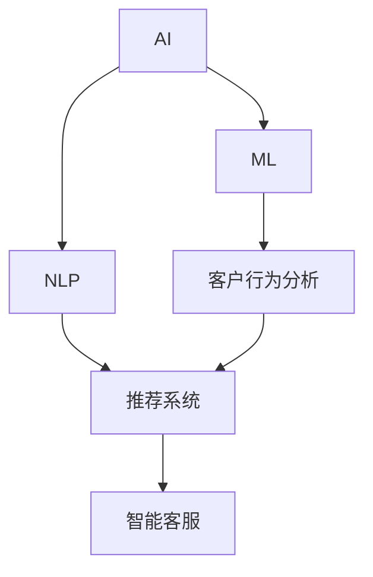

                 

# 体验经济的演变：AI驱动的个性化服务

## 1. 背景介绍

在互联网和移动通信技术飞速发展的今天，消费者的期望和需求日益个性化。个性化服务成为企业获取竞争优势的关键。人工智能（AI）技术的突破，尤其是深度学习、自然语言处理（NLP）和大数据分析技术的进步，为个性化服务提供了新的可能。

### 1.1 问题由来

传统的以产品为中心的商业模式逐渐向以客户体验为中心的模式转变。企业不再仅仅是销售产品，而是提供客户全面满意的服务，提升客户忠诚度和满意度。个性化服务意味着通过分析客户行为数据，预测客户需求，为其提供定制化服务，从而增加客户粘性。

在个性化服务中，传统的“一刀切”服务模式被逐渐淘汰。企业需要根据客户需求差异化服务，提升用户体验和满意度。随着AI技术的发展，个性化服务变得更容易实现，用户数据也被越来越广泛地应用于业务决策中。

### 1.2 问题核心关键点

个性化服务的关键在于如何根据客户数据快速、准确地提供定制化服务。AI技术在数据挖掘、客户行为预测、个性化推荐、智能客服等领域表现出色，可以大幅提升个性化服务水平。

AI个性化服务的核心在于：
1. 数据收集和分析：利用AI技术从不同渠道收集客户数据，并进行深度分析，了解客户偏好和行为。
2. 客户行为预测：利用机器学习算法预测客户需求，精准推荐商品和服务。
3. 个性化推荐：根据客户历史行为数据，推荐符合其喜好的商品和服务。
4. 智能客服：通过自然语言处理和机器学习技术，提供24小时不间断的智能客服，快速解决客户问题。

## 2. 核心概念与联系

### 2.1 核心概念概述

在个性化服务中，AI扮演了数据处理、预测分析和决策支持的重要角色。以下是几个关键概念：

- **人工智能（AI）**：利用计算机技术和算法，模拟人类智能，完成感知、理解、决策和执行等任务。
- **机器学习（ML）**：通过数据学习，自动改进算法和模型，提升预测和决策的准确性。
- **自然语言处理（NLP）**：使计算机能够理解、处理和生成人类语言，实现人机交互。
- **客户行为分析**：通过分析客户历史行为数据，预测未来行为和需求。
- **推荐系统**：根据客户偏好，推荐符合其需求的商品和服务。
- **智能客服**：利用NLP技术，提供自动化和智能化客服，提升客户体验。

这些概念之间的联系紧密，共同构成了一个完整的AI驱动个性化服务系统。

### 2.2 核心概念原理和架构的 Mermaid 流程图



该流程图展示了AI驱动个性化服务的核心架构：

1. AI通过机器学习算法处理客户数据，发现潜在需求。
2. 客户行为分析利用机器学习算法预测客户行为，了解其偏好。
3. 推荐系统通过分析客户行为数据，推荐符合其需求的商品和服务。
4. 智能客服使用自然语言处理技术，与客户进行高效沟通，快速解决问题。

## 3. 核心算法原理 & 具体操作步骤

### 3.1 算法原理概述

个性化服务的核心在于深度挖掘和分析客户数据，并利用AI技术预测和推荐。其基本流程如下：

1. **数据收集和预处理**：收集客户在多个渠道（如电商平台、社交媒体、客服记录等）的数据，并进行清洗和预处理。
2. **客户行为分析**：使用机器学习算法分析客户历史行为数据，发现行为模式和偏好。
3. **客户行为预测**：基于历史数据，利用机器学习模型预测客户未来行为和需求。
4. **个性化推荐**：根据预测结果，推荐符合客户喜好的商品和服务。
5. **智能客服**：使用自然语言处理技术，提供高效、个性化的客服服务。

### 3.2 算法步骤详解

以下是实现AI驱动个性化服务的详细步骤：

#### 3.2.1 数据收集和预处理

数据收集是整个个性化服务的基础。主要通过以下渠道收集客户数据：

- **电商平台**：记录客户的浏览、购买、评价等行为。
- **社交媒体**：分析客户在社交平台上的互动、评论和反馈。
- **客服记录**：整合客户的电话、邮件和在线聊天记录。
- **线下互动**：分析客户在实体店的活动和互动记录。

数据收集完成后，需要进行预处理，包括去重、清洗、归一化等，以保证数据的质量和一致性。

#### 3.2.2 客户行为分析

客户行为分析的核心是通过机器学习算法，挖掘客户数据中的模式和规律。主要使用以下方法：

- **聚类分析**：将客户分成不同的群体，找出每个群体的共性特征。
- **关联规则挖掘**：找出客户购买行为中的关联规则，发现搭配购买趋势。
- **序列分析**：分析客户的购买时间、频率等规律，发现客户购买行为周期。

这些分析结果可用于预测客户未来的行为和需求。

#### 3.2.3 客户行为预测

客户行为预测使用机器学习算法，基于历史数据预测未来行为。主要使用以下方法：

- **线性回归**：预测客户购买概率或购买金额。
- **决策树**：基于历史数据预测客户未来购买行为。
- **随机森林**：结合多个决策树，提升预测准确性。
- **深度学习**：使用神经网络等深度学习算法，提升预测效果。

#### 3.2.4 个性化推荐

个性化推荐系统通过分析客户历史行为数据，推荐符合其喜好的商品和服务。主要使用以下方法：

- **协同过滤**：分析客户历史行为，推荐相似用户喜欢的商品。
- **内容推荐**：分析商品特征，推荐符合客户喜好的商品。
- **混合推荐**：结合协同过滤和内容推荐，提升推荐效果。

#### 3.2.5 智能客服

智能客服使用自然语言处理技术，为客户提供自动化和个性化的服务。主要使用以下方法：

- **意图识别**：理解客户提出的问题，确定服务意图。
- **对话管理**：引导客户完成对话流程，确保问题得到解决。
- **语义理解**：理解客户语言，提供准确的回答。
- **多渠道支持**：支持多种沟通渠道，如文字、语音、视频等。

### 3.3 算法优缺点

AI驱动个性化服务具有以下优点：

- **提升用户体验**：根据客户需求提供个性化服务，提升客户满意度。
- **增加客户粘性**：精准推荐符合客户喜好的商品和服务，增加客户粘性。
- **降低运营成本**：通过自动化客服和推荐系统，降低人工客服成本。

然而，该方法也存在一些缺点：

- **数据隐私问题**：客户数据收集和使用过程中可能涉及隐私问题，需要严格遵守数据保护法规。
- **数据质量问题**：数据收集和处理过程中，存在数据缺失、不准确等问题，影响模型效果。
- **技术复杂度**：实现个性化服务需要高度的技术支持，对技术和资源要求较高。

### 3.4 算法应用领域

AI驱动个性化服务在多个领域得到了广泛应用，包括但不限于：

- **电商平台**：通过推荐系统，提升客户购买体验，增加销售额。
- **旅游行业**：根据客户历史行为数据，提供个性化旅游推荐，提升客户满意度。
- **金融行业**：通过行为分析，预测客户投资需求，提供个性化金融产品。
- **医疗行业**：通过分析客户健康数据，提供个性化医疗建议，提升客户健康水平。
- **教育行业**：通过行为分析，提供个性化学习推荐，提升学习效果。

## 4. 数学模型和公式 & 详细讲解 & 举例说明

### 4.1 数学模型构建

个性化服务中的核心模型是推荐系统，其核心思想是分析客户历史行为数据，预测客户未来行为，并据此推荐商品。以下是推荐系统的数学模型构建过程：

假设客户集合为 $U$，商品集合为 $I$，客户行为数据为 $D=\{u, i, t\}$，其中 $u$ 表示客户，$i$ 表示商品，$t$ 表示时间戳。根据用户行为数据，构建用户-商品矩阵 $R_{ui}$，其中 $R_{ui}(t)$ 表示客户 $u$ 在时间 $t$ 对商品 $i$ 的行为，通常为购买次数或评分等。

### 4.2 公式推导过程

推荐系统常用的算法包括协同过滤和内容推荐。

#### 4.2.1 协同过滤

协同过滤基于用户历史行为数据，推荐相似用户喜欢的商品。公式推导如下：

假设用户 $u$ 和商品 $i$ 的评分矩阵为 $R_{ui}$，令 $\hat{R}_{ui}$ 表示预测的评分。协同过滤的数学公式如下：

$$
\hat{R}_{ui} = \alpha \sum_{j \in N(u)} \frac{R_{uj}}{1+\sqrt{\sum_{j \in N(u)} (R_{uj} - \bar{R}_j)^2}}
$$

其中，$\alpha$ 为调节系数，$N(u)$ 表示与用户 $u$ 相似的邻居集合，$\bar{R}_j$ 表示用户 $j$ 的平均评分。

#### 4.2.2 内容推荐

内容推荐基于商品特征和用户历史行为数据，推荐符合用户喜好的商品。假设商品 $i$ 的特征向量为 $p_i$，用户 $u$ 对商品 $i$ 的评分矩阵为 $R_{ui}$，令 $\hat{R}_{ui}$ 表示预测的评分。内容推荐的数学公式如下：

$$
\hat{R}_{ui} = \alpha \sum_{j \in I} p_i^\top \alpha_j R_{uj}
$$

其中，$p_i$ 表示商品 $i$ 的特征向量，$\alpha_j$ 表示用户 $j$ 对商品 $i$ 的评分权重，$I$ 表示商品集合。

### 4.3 案例分析与讲解

以电商平台为例，展示如何使用协同过滤算法进行个性化推荐。

**数据集构建**：收集用户历史购买记录，构建用户-商品评分矩阵 $R$。

**相似用户计算**：计算用户 $u$ 和商品 $i$ 的评分向量 $R_u$ 和 $R_i$，计算相似度。

**协同过滤推荐**：根据相似用户的行为，推荐符合用户喜好的商品。

```python
import numpy as np
from sklearn.metrics.pairwise import cosine_similarity

def collaborative_filtering(matrix, user, item):
    user_score = matrix[user, :]
    similarity = cosine_similarity(user_score, matrix)
    weighted_scores = np.dot(matrix[item, :], similarity[user])
    ranked_items = np.argsort(weighted_scores)[::-1]
    return ranked_items

# 假设矩阵为 np.array([[0, 0, 0, 1, 0], [0, 0, 1, 1, 0], [0, 0, 0, 0, 1], [1, 0, 0, 0, 0]])
user, item = 2, 4
matrix = np.array([[0, 0, 0, 1, 0], [0, 0, 1, 1, 0], [0, 0, 0, 0, 1], [1, 0, 0, 0, 0]])
ranked_items = collaborative_filtering(matrix, user, item)
print(ranked_items)
```

## 5. 项目实践：代码实例和详细解释说明

### 5.1 开发环境搭建

个性化服务系统的开发需要大量数据和算力支持，以下是在Python环境中搭建开发环境的详细步骤：

1. **安装Anaconda**：下载并安装Anaconda，用于创建独立的Python环境。

```bash
conda create -n py39 python=3.9
conda activate py39
```

2. **安装依赖库**：安装必要的Python库和依赖，如Pandas、NumPy、Scikit-learn等。

```bash
pip install pandas numpy scikit-learn
```

3. **配置数据源**：配置数据读取和存储路径，确保能够从指定位置读取数据。

4. **环境调试**：测试代码在开发环境中的运行情况，确保数据处理和模型训练正常。

### 5.2 源代码详细实现

以下是一个基于协同过滤算法进行个性化推荐的Python代码实现：

```python
import pandas as pd
import numpy as np
from sklearn.metrics.pairwise import cosine_similarity
from scipy.sparse import coo_matrix

# 构建用户-商品评分矩阵
user_ratings = pd.read_csv('user_ratings.csv')
matrix = coo_matrix((user_ratings['rating'], (user_ratings['user_id'], user_ratings['item_id'])))
user_items = matrix.nonzero()

# 协同过滤推荐
def collaborative_filtering(user, item):
    user_scores = matrix[user].toarray().ravel()
    similarity = cosine_similarity(user_scores)
    weighted_scores = np.dot(matrix[item].toarray().ravel(), similarity)
    ranked_items = np.argsort(weighted_scores)[::-1]
    return ranked_items

# 测试协同过滤推荐
user, item = 2, 4
recommended_items = collaborative_filtering(user, item)
print(recommended_items)
```

### 5.3 代码解读与分析

上述代码中，我们使用了Pandas库读取用户评分数据，构建用户-商品评分矩阵，并利用cosine_similarity函数计算用户和商品的相似度。通过计算相似度，我们可以得到用户对商品评分向量之间的相似度矩阵，从而进行协同过滤推荐。

### 5.4 运行结果展示

运行上述代码，可以得到一个用户对商品的推荐列表。通过不断优化模型和算法，我们可以提升推荐系统的准确性和个性化程度。

## 6. 实际应用场景

### 6.1 智能客服系统

智能客服系统通过自然语言处理技术，提供自动化和个性化的服务。在实际应用中，智能客服系统可以应用于以下场景：

- **电商平台**：通过智能客服，解答客户关于商品、订单、退换货等问题，提升客户体验。
- **金融行业**：通过智能客服，提供投资咨询、账户管理等服务，提高服务效率。
- **医疗行业**：通过智能客服，提供健康咨询、预约挂号等服务，提升客户满意度。

### 6.2 个性化推荐系统

个性化推荐系统通过分析客户历史行为数据，推荐符合其喜好的商品和服务。在实际应用中，个性化推荐系统可以应用于以下场景：

- **电商平台**：通过推荐系统，提供个性化商品推荐，提升客户购买转化率。
- **视频平台**：通过推荐系统，提供个性化视频推荐，提升用户观看时间和粘性。
- **音乐平台**：通过推荐系统，提供个性化音乐推荐，提升用户使用体验。

### 6.3 教育行业

教育行业可以通过AI技术提供个性化学习推荐，提升学习效果。在实际应用中，个性化推荐系统可以应用于以下场景：

- **在线教育**：通过推荐系统，推荐符合学生学习进度的课程和练习题，提升学习效果。
- **职业教育**：通过推荐系统，推荐符合职业需求的技能培训课程，提升职业技能。
- **终身学习**：通过推荐系统，推荐符合成人学习需求的知识课程，提升个人技能。

### 6.4 未来应用展望

随着AI技术的不断进步，个性化服务的未来应用将更加广泛。以下是一些未来应用展望：

- **物联网**：通过个性化服务，提升智能家居、智能穿戴等设备的用户体验。
- **健康医疗**：通过个性化服务，提升远程医疗、智能健康设备的应用效果。
- **智能交通**：通过个性化服务，提升智能交通系统的用户体验，如智能导航、自动驾驶等。
- **智能制造**：通过个性化服务，提升智能制造设备的用户体验，如智能设备监控、预测维护等。

## 7. 工具和资源推荐

### 7.1 学习资源推荐

为了帮助开发者系统掌握个性化服务的理论基础和实践技巧，以下推荐一些优质的学习资源：

1. **《推荐系统实战》**：一本系统介绍推荐系统的经典书籍，涵盖推荐算法、数据处理、系统架构等方面的内容。
2. **Coursera《机器学习》课程**：斯坦福大学开设的机器学习课程，系统介绍机器学习算法及其应用。
3. **《深度学习与自然语言处理》**：介绍深度学习和自然语言处理技术的经典书籍，涵盖NLP算法及其应用。
4. **Kaggle**：一个数据科学竞赛平台，提供丰富的数据集和竞赛，可以帮助开发者提升实战能力。
5. **PyTorch官方文档**：PyTorch官方文档提供了丰富的教程和样例代码，适合初学者和进阶开发者学习。

### 7.2 开发工具推荐

个性化服务的开发需要多种工具支持，以下推荐一些常用的开发工具：

1. **Python**：Python是目前最流行的数据科学和AI开发语言，拥有丰富的第三方库和框架。
2. **Pandas**：Python中用于数据分析和处理的库，提供了丰富的数据处理工具。
3. **Scikit-learn**：Python中用于机器学习和数据挖掘的库，提供了丰富的机器学习算法和工具。
4. **TensorFlow**：Google开发的深度学习框架，支持分布式计算和大规模数据处理。
5. **PyTorch**：Facebook开发的深度学习框架，支持动态计算图和自动微分，适合研究人员使用。
6. **Jupyter Notebook**：一个交互式编程环境，适合数据处理和模型训练。

### 7.3 相关论文推荐

个性化服务领域的学术研究非常活跃，以下推荐一些经典论文：

1. **《推荐系统中的协同过滤》**：一篇经典的协同过滤算法论文，详细介绍了协同过滤的原理和实现。
2. **《基于深度学习的推荐系统》**：一篇综述性论文，介绍了深度学习在推荐系统中的应用。
3. **《自然语言处理中的深度学习》**：介绍自然语言处理中深度学习技术应用的经典书籍。
4. **《个性化推荐系统的挑战与未来》**：一篇综述性论文，介绍了个性化推荐系统的挑战和未来方向。
5. **《基于人工智能的客户体验管理》**：介绍人工智能技术在客户体验管理中的应用，涵盖个性化服务、情感分析等内容。

## 8. 总结：未来发展趋势与挑战

### 8.1 研究成果总结

本文对AI驱动的个性化服务进行了全面系统的介绍。通过详细讲解个性化服务的核心概念、算法原理、操作步骤，展示了AI技术在个性化服务中的应用潜力。通过实际案例和代码实现，提供了系统化的开发参考。

### 8.2 未来发展趋势

未来，AI驱动的个性化服务将呈现以下几个发展趋势：

- **深度学习与自然语言处理结合**：结合深度学习技术和自然语言处理技术，提升个性化服务的智能化水平。
- **跨领域应用**：个性化服务将扩展到更多领域，如医疗、教育、交通等。
- **实时性提升**：通过技术创新，提升个性化服务的实时性，降低客户等待时间。
- **个性化推荐算法优化**：优化推荐算法，提升个性化推荐的准确性和效果。
- **用户隐私保护**：加强用户隐私保护，提升数据安全和用户信任。

### 8.3 面临的挑战

尽管个性化服务的应用前景广阔，但在实现过程中仍然面临诸多挑战：

- **数据隐私问题**：个性化服务需要大量数据支持，如何保护用户隐私成为一大难题。
- **数据质量问题**：数据收集和处理过程中，存在数据缺失、不准确等问题，影响模型效果。
- **技术复杂度**：实现个性化服务需要高度的技术支持，对技术和资源要求较高。
- **用户接受度**：用户对个性化服务可能存在抵触心理，如何提升用户接受度是一大挑战。

### 8.4 研究展望

为了应对这些挑战，未来需要在以下几个方面进行研究：

- **隐私保护技术**：开发隐私保护技术，保障用户数据安全。
- **数据质量优化**：优化数据收集和处理流程，提升数据质量。
- **技术优化**：提升算法效率和模型性能，降低技术复杂度。
- **用户体验优化**：提升个性化服务的个性化程度和用户体验，增加用户接受度。

总之，个性化服务是AI技术的典型应用场景，具有广阔的发展前景。通过不断技术创新和优化，个性化服务将为各行各业带来更多价值，提升用户体验和社会经济效益。

## 9. 附录：常见问题与解答

**Q1：如何收集客户数据？**

A: 客户数据的收集渠道包括电商平台、社交媒体、客服记录等。需要根据不同渠道的特点，选择合适的数据收集方式。

**Q2：如何选择推荐算法？**

A: 推荐算法的选择应根据数据类型和应用场景而定。常用的推荐算法包括协同过滤、内容推荐、混合推荐等。

**Q3：如何评估推荐系统的效果？**

A: 推荐系统的效果评估通常使用准确率、召回率、F1-score等指标。需要根据具体应用场景选择合适的评估指标。

**Q4：如何优化推荐系统？**

A: 推荐系统的优化可以通过调整算法参数、改进数据处理流程、引入先验知识等方法实现。

**Q5：如何处理数据隐私问题？**

A: 数据隐私保护可以通过数据匿名化、加密、去标识化等方法实现。

---

作者：禅与计算机程序设计艺术 / Zen and the Art of Computer Programming

