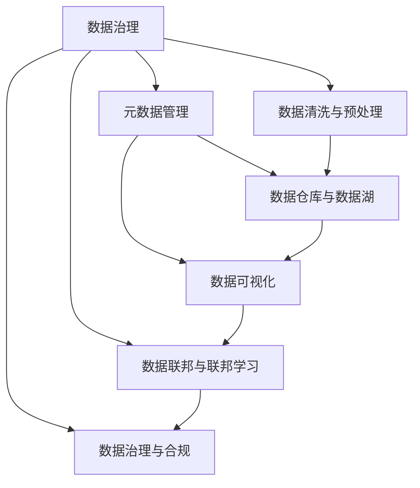

                 

# 信息时代的信息管理策略与实践：管理信息过载和复杂性

## 1. 背景介绍

### 1.1 问题由来
在信息时代，数据量的爆炸性增长和信息结构的复杂性给信息管理带来了前所未有的挑战。信息过载、数据噪声、上下文模糊等问题，导致信息处理效率低下，决策错误频发。信息管理的核心目标，在于从海量数据中挖掘出有价值的信息，构建知识体系，为决策提供有力支持。

传统的IT系统，如文件管理系统、数据库系统、ERP系统等，在处理结构化数据方面具有优势，但在处理半结构化、非结构化数据，以及多源异构数据时，效果有限。当前，伴随着大数据、云计算、物联网等技术的发展，信息管理对象和场景变得更加多样和复杂，需要一种全新的信息管理理念和策略，以应对未来的挑战。

### 1.2 问题核心关键点
信息管理面临的核心问题包括：

- 信息过载：数据量的爆炸性增长，远超人类处理能力。如何从海量数据中提取有价值的信息，避免信息过载？
- 数据噪声：真实数据中夹杂着大量噪声和错误，影响决策准确性。如何过滤数据噪声，提高数据质量？
- 上下文模糊：多源异构数据间存在大量的模糊性和不确定性，难以统一理解和分析。如何统一数据上下文，消除歧义？
- 信息孤岛：不同业务系统间的数据难以互通和共享，形成信息孤岛。如何打破信息孤岛，实现数据互联互通？
- 数据安全：在数据采集、存储、传输、使用过程中，如何确保数据安全，防止数据泄露和滥用？

这些问题在信息时代尤为凸显，且相互关联，解决这些问题需要一套科学、系统、高效的信息管理策略和实践。

## 2. 核心概念与联系

### 2.1 核心概念概述

信息管理的核心概念包括以下几个关键部分：

- 数据治理：通过规范数据标准、定义数据元数据、制定数据管理政策等手段，提升数据质量，保障数据安全。
- 元数据管理：定义数据及其业务含义，建立数据模型，为数据访问和分析提供基础。
- 数据清洗与预处理：对原始数据进行去重、去噪、填补空值等操作，提高数据可用性。
- 数据仓库与数据湖：构建集中存储、统一管理的综合数据平台，支持数据分析和决策。
- 数据可视化：通过可视化技术，将数据转化为直观的图表和报表，辅助决策分析。
- 数据联邦与联邦学习：构建分布式数据平台，实现数据联邦和模型共享，优化资源利用。
- 数据治理与合规：通过建立数据治理体系，确保数据符合法规要求，提升合规性。

这些概念通过一系列的数据流、业务流程和技术手段，形成了一个完整的信息管理架构。它们之间相互依赖，共同支持信息管理的各个环节，构成了一个相互支撑的系统。

### 2.2 核心概念原理和架构的 Mermaid 流程图



这个流程图展示了信息管理的核心概念及其之间的相互关系：

1. 数据治理是信息管理的基石，通过规范数据标准、定义数据元数据等手段，为数据清洗和预处理提供指导。
2. 元数据管理为数据模型和业务含义提供定义，为数据仓库和数据湖的构建提供基础。
3. 数据清洗与预处理对原始数据进行处理，提高数据的可用性和质量。
4. 数据仓库和数据湖提供集中存储和统一管理，支持数据分析和决策。
5. 数据可视化通过图表和报表展示数据，辅助决策分析。
6. 数据联邦与联邦学习实现分布式数据平台的构建，优化资源利用。
7. 数据治理与合规保障数据符合法规要求，提升合规性。

## 3. 核心算法原理 & 具体操作步骤
### 3.1 算法原理概述

信息管理的核心算法原理，主要围绕数据的收集、存储、清洗、分析和输出进行展开。其基本流程包括以下几个步骤：

1. **数据收集**：通过传感器、API接口、文件上传等方式，收集各类数据。
2. **数据存储**：将收集的数据存储在数据库、数据湖等数据平台中。
3. **数据清洗与预处理**：对数据进行去重、去噪、填补空值等操作，提高数据可用性。
4. **数据建模**：对清洗后的数据进行建模，建立数据模型和元数据。
5. **数据分析**：使用统计学、机器学习等技术，对数据进行分析和挖掘。
6. **数据可视化**：将分析结果转化为图表和报表，辅助决策。
7. **决策支持**：将分析结果应用于决策中，指导业务运营。

信息管理算法需要根据具体场景和需求进行调整，以提高算法的效率和效果。

### 3.2 算法步骤详解

信息管理的算法步骤包括以下几个关键步骤：

**Step 1: 数据收集**
- 确定数据源和采集方式，包括传感器数据、API接口、文件上传等。
- 设计数据采集流程，包括数据采集时间、频率、格式等。
- 建立数据采集管道，实现数据自动化采集。

**Step 2: 数据存储**
- 选择合适的数据存储平台，如数据库、数据湖、云存储等。
- 设计数据存储架构，包括分区、索引、压缩等。
- 实现数据存储功能，确保数据存储的可靠性和可访问性。

**Step 3: 数据清洗与预处理**
- 设计数据清洗策略，包括去重、去噪、填补空值等。
- 编写数据清洗脚本，自动化执行数据清洗操作。
- 检查数据清洗结果，确保数据质量。

**Step 4: 数据建模**
- 设计数据模型和元数据，包括数据实体、属性、关系等。
- 使用ETL工具进行数据建模，生成数据模型图。
- 编写数据模型脚本，实现数据的访问和管理。

**Step 5: 数据分析**
- 确定数据分析任务，包括描述性分析、预测性分析、规范性分析等。
- 选择合适的数据分析工具，如Pandas、SQL、Spark等。
- 编写数据分析脚本，进行数据建模和分析。

**Step 6: 数据可视化**
- 选择合适的数据可视化工具，如Tableau、PowerBI、Matplotlib等。
- 设计数据可视化报表，包括报表样式、图表类型等。
- 编写数据可视化脚本，将分析结果转化为报表和图表。

**Step 7: 决策支持**
- 将分析结果应用于决策中，设计决策支持流程。
- 实现决策支持功能，包括数据查询、报表展示、决策分析等。
- 持续监测决策效果，优化决策支持系统。

通过上述步骤，可以实现从数据收集到决策支持的完整信息管理流程。

### 3.3 算法优缺点

信息管理算法具有以下优点：
1. 系统化管理：通过规范化流程和技术手段，系统化地管理数据，提高数据质量和可用性。
2. 高效自动化：使用ETL工具、数据清洗脚本、数据分析脚本等，实现数据的自动化处理，提高效率。
3. 灵活可扩展：数据模型和分析工具可以根据需求进行调整和扩展，适应不同业务场景。
4. 结果可视化：通过数据可视化报表，将分析结果直观展示，辅助决策。

但同时，信息管理算法也存在一些局限性：
1. 数据量大：信息管理需要处理大量数据，对存储和处理能力要求高。
2. 模型复杂：数据建模和分析模型复杂，需要专业知识和技术支持。
3. 上下文多样：多源异构数据间存在上下文模糊，需要定义和统一。
4. 安全性问题：数据存储和传输过程中，需要考虑数据安全和隐私保护。

尽管存在这些局限性，但信息管理算法在处理结构化、半结构化、非结构化数据，提升数据质量和决策效率方面，仍然具有重要的应用价值。

### 3.4 算法应用领域

信息管理算法在各个领域都有广泛应用，包括但不限于：

- 金融：使用数据治理和元数据管理提升数据质量，通过数据分析和可视化支持投资决策。
- 医疗：通过数据清洗和预处理提升数据可用性，使用数据分析和可视化支持医疗决策和运营。
- 零售：使用数据仓库和数据湖集中存储销售数据，通过数据分析和可视化支持销售分析和库存管理。
- 制造：通过数据清洗和预处理提升工业数据质量，使用数据分析和可视化支持生产调度和质量控制。
- 公共安全：使用数据联邦和联邦学习实现跨部门数据共享，通过数据分析和可视化支持公共安全决策。
- 政府：通过数据治理和合规保障数据安全，使用数据分析和可视化支持政策制定和执行。

## 4. 数学模型和公式 & 详细讲解  
### 4.1 数学模型构建

信息管理的数学模型主要围绕数据的采集、存储、清洗、建模和分析进行构建。以下是一个简单的信息管理数学模型：

$$
\begin{aligned}
&\text{Minimize} \quad \text{Loss}(\theta) = \sum_{i=1}^{N} \text{Loss}_i(\theta) \\
&\text{Subject to} \quad \text{Constraints}(\theta)
\end{aligned}
$$

其中，$\text{Loss}_i(\theta)$ 表示第 $i$ 个样本的数据损失函数，$\text{Constraints}(\theta)$ 表示数据清洗和预处理等约束条件。

### 4.2 公式推导过程

以数据清洗为例，常见的数据清洗算法包括：

1. **去重算法**：通过哈希表或树结构实现数据去重，保留唯一的记录。公式如下：

$$
\text{Unique}_{x} = \{x \mid \text{Hash}(x) \notin \text{Set}(\text{Hash}) \}
$$

其中，$\text{Unique}_{x}$ 表示去重后的唯一记录集，$\text{Hash}(x)$ 表示记录的哈希值，$\text{Set}(\text{Hash})$ 表示已有的哈希值集合。

2. **去噪算法**：通过阈值判断或异常检测算法，识别和删除异常值。公式如下：

$$
\text{Cleaned}_{x} = \{x \mid |x - \text{Mean}| \leq \text{Threshold} \}
$$

其中，$\text{Cleaned}_{x}$ 表示去噪后的数据，$\text{Mean}$ 表示数据的均值，$\text{Threshold}$ 表示去噪阈值。

3. **填补空值算法**：通过均值、中位数、众数等方法，填补数据中的空值。公式如下：

$$
\text{Filled}_{x} = \{x \mid \text{FillValue}(x) \text{ if } \text{Null}(x) \text{ else } x
$$

其中，$\text{Filled}_{x}$ 表示填补空值后的数据，$\text{FillValue}(x)$ 表示填补值，$\text{Null}(x)$ 表示数据是否为空。

### 4.3 案例分析与讲解

以金融领域为例，数据清洗和预处理过程如下：

**数据收集**：
- 通过API接口获取交易记录、客户信息等数据。
- 使用ETL工具将数据导入数据仓库。

**数据清洗**：
- 去重：使用哈希表对交易记录进行去重，保留唯一的交易记录。
- 去噪：通过异常检测算法识别和删除异常交易记录。
- 填补空值：使用均值填补缺失的交易金额和日期。

**数据建模**：
- 设计数据模型：包括交易记录、客户信息、账户余额等实体。
- 使用ETL工具进行建模，生成数据模型图。

**数据分析**：
- 描述性分析：使用统计学方法分析交易金额的分布、客户数量的变化等。
- 预测性分析：使用机器学习模型预测交易趋势和客户流失概率。
- 规范性分析：使用优化算法进行资源配置和风险控制。

**数据可视化**：
- 设计报表：包括交易趋势图、客户分布图、风险预警图等。
- 使用Tableau或PowerBI工具将报表展示给决策者。

通过上述步骤，金融领域的决策者可以实时获取交易数据，并进行描述性、预测性和规范性分析，辅助投资决策和风险控制。

## 5. 项目实践：代码实例和详细解释说明
### 5.1 开发环境搭建

在进行信息管理项目开发前，需要准备好开发环境。以下是使用Python进行信息管理项目的开发环境配置流程：

1. 安装Anaconda：从官网下载并安装Anaconda，用于创建独立的Python环境。

2. 创建并激活虚拟环境：
```bash
conda create -n info-manage python=3.8 
conda activate info-manage
```

3. 安装Python依赖包：
```bash
pip install pandas numpy matplotlib sklearn scikit-learn seaborn beautifulsoup4 tableaux_PUBLIC
```

4. 安装数据采集工具：
```bash
pip install pyodbc pyexcel pandas-gbq
```

5. 安装数据存储工具：
```bash
pip install mysql-connector-python postgresql-libs
```

6. 安装数据清洗工具：
```bash
pip install pandas-reader
```

7. 安装数据分析工具：
```bash
pip install pyspark pandas-spark sql-reader
```

8. 安装数据可视化工具：
```bash
pip install plotly
```

完成上述步骤后，即可在`info-manage`环境中开始信息管理项目开发。

### 5.2 源代码详细实现

这里我们以金融领域为例，给出使用Python进行信息管理的代码实现。

首先，定义数据采集函数：

```python
import pandas as pd
import pandas_reader as pr
from pyodbc import connect, Table, Cursor

# 定义数据源连接字符串
conn_str = (
    'DRIVER={ODBC Driver 17 for SQL Server};'
    'SERVER=localhost;'
    'DATABASE=InfoManage;'
    'UID=your_username;'
    'PWD=your_password'
)

# 连接数据库
conn = connect(conn_str)

# 查询交易记录数据
query = "SELECT * FROM Transactions"
df = pd.read_sql(query, con=conn)
```

然后，定义数据清洗函数：

```python
import numpy as np
import pandas as pd

def clean_data(df):
    # 去重
    df.drop_duplicates(inplace=True)
    
    # 去噪
    df = df[abs(df['Amount'] - df['Amount'].mean()) <= 2*df['Amount'].std()]
    
    # 填补空值
    df.fillna(df.mean(), inplace=True)
    
    return df
```

接着，定义数据建模函数：

```python
import pandas as pd
from sqlalchemy import create_engine

def model_data(df):
    # 设计数据模型
    df_model = pd.DataFrame()
    
    # 添加数据实体
    df_model['TransactionID'] = df['TransactionID']
    df_model['Amount'] = df['Amount']
    df_model['Date'] = df['Date']
    df_model['CustomerID'] = df['CustomerID']
    
    # 使用SQLite数据库存储数据模型
    engine = create_engine('sqlite://', echo=False)
    df_model.to_sql('TransactionModel', con=engine, if_exists='replace', index=False, index_label='TransactionID')
```

最后，定义数据分析函数：

```python
import pandas as pd
from sklearn.linear_model import LinearRegression
from sklearn.metrics import mean_squared_error

def analyze_data(df):
    # 描述性分析
    print(df.describe())
    
    # 预测性分析
    X = df[['Date', 'CustomerID']]
    y = df['Amount']
    model = LinearRegression()
    model.fit(X, y)
    y_pred = model.predict(X)
    
    # 规范性分析
    rmse = np.sqrt(mean_squared_error(y, y_pred))
    print(f"RMSE: {rmse}")
```

最后，启动数据采集、清洗、建模和分析流程：

```python
# 数据采集
clean_data(df)

# 数据建模
model_data(df)

# 数据分析
analyze_data(df)
```

以上就是使用Python进行信息管理的完整代码实现。可以看到，通过Pandas、SQLAlchemy、Scikit-learn等工具，我们能够高效地进行数据采集、清洗、建模和分析，实现信息管理的自动化流程。

### 5.3 代码解读与分析

让我们再详细解读一下关键代码的实现细节：

**数据采集函数**：
- 使用ODBC连接SQL Server数据库，通过SQL语句查询交易记录数据，并使用Pandas的`read_sql`方法读取查询结果。
- 可以通过不同数据库的连接字符串，支持多种数据源。

**数据清洗函数**：
- 使用Pandas的`drop_duplicates`方法去除重复记录。
- 使用Pandas的`describe`方法获取数据的统计信息。
- 使用Pandas的`fillna`方法填补空值。

**数据建模函数**：
- 使用Pandas的`DataFrame`类创建数据模型。
- 添加数据实体，设计数据模型。
- 使用SQLAlchemy的`create_engine`方法创建数据库连接，使用Pandas的`to_sql`方法将数据模型存储到SQLite数据库中。

**数据分析函数**：
- 使用Pandas的`describe`方法获取数据的描述性统计信息。
- 使用Scikit-learn的`LinearRegression`类进行预测性分析，计算模型的RMSE。

通过上述代码实现，我们实现了从数据采集到数据分析的完整流程，展示了信息管理的自动化实践。

## 6. 实际应用场景
### 6.1 金融领域

在金融领域，信息管理的应用场景包括：

- **投资决策支持**：通过数据清洗和预处理提升数据质量，使用数据分析和可视化支持投资决策。
- **风险管理**：使用数据清洗和预处理提升数据质量，使用数据分析和可视化识别和预测风险。
- **客户关系管理**：通过数据清洗和预处理提升客户数据的准确性，使用数据分析和可视化支持客户关系维护和营销。

### 6.2 医疗领域

在医疗领域，信息管理的应用场景包括：

- **病患数据分析**：通过数据清洗和预处理提升数据质量，使用数据分析和可视化支持病患数据分析和诊断。
- **医疗资源优化**：使用数据清洗和预处理提升数据质量，使用数据分析和可视化优化医疗资源配置。
- **疾病预防和控制**：通过数据清洗和预处理提升数据质量，使用数据分析和可视化支持疾病预防和控制。

### 6.3 零售领域

在零售领域，信息管理的应用场景包括：

- **销售数据分析**：通过数据清洗和预处理提升数据质量，使用数据分析和可视化支持销售数据分析和趋势预测。
- **库存管理优化**：使用数据清洗和预处理提升数据质量，使用数据分析和可视化优化库存管理。
- **客户行为分析**：通过数据清洗和预处理提升数据质量，使用数据分析和可视化支持客户行为分析。

### 6.4 制造领域

在制造领域，信息管理的应用场景包括：

- **生产调度和优化**：通过数据清洗和预处理提升数据质量，使用数据分析和可视化支持生产调度和优化。
- **质量控制和检测**：使用数据清洗和预处理提升数据质量，使用数据分析和可视化支持质量控制和检测。
- **供应链管理**：通过数据清洗和预处理提升数据质量，使用数据分析和可视化支持供应链管理。

### 6.5 公共安全领域

在公共安全领域，信息管理的应用场景包括：

- **案件分析**：通过数据清洗和预处理提升数据质量，使用数据分析和可视化支持案件分析。
- **预警和预测**：使用数据清洗和预处理提升数据质量，使用数据分析和可视化支持预警和预测。
- **应急响应**：通过数据清洗和预处理提升数据质量，使用数据分析和可视化支持应急响应。

### 6.6 政府领域

在政府领域，信息管理的应用场景包括：

- **政策制定**：通过数据清洗和预处理提升数据质量，使用数据分析和可视化支持政策制定。
- **公共服务优化**：使用数据清洗和预处理提升数据质量，使用数据分析和可视化优化公共服务。
- **资源配置和调度**：通过数据清洗和预处理提升数据质量，使用数据分析和可视化支持资源配置和调度。

## 7. 工具和资源推荐
### 7.1 学习资源推荐

为了帮助开发者系统掌握信息管理的理论基础和实践技巧，这里推荐一些优质的学习资源：

1. 《大数据技术与应用》系列课程：由知名大学和机构开设，涵盖大数据技术、数据治理、数据仓库等核心概念。
2. 《Python数据科学手册》书籍：由Python社区的知名专家编写，详细介绍Python在数据处理、数据分析和数据可视化中的应用。
3. 《信息管理与企业竞争优势》书籍：深入探讨信息管理对企业竞争优势的影响，结合大量案例分析。
4. 《数据科学与大数据》在线课程：由知名在线教育平台提供，涵盖数据采集、数据清洗、数据建模等核心技能。
5. 《大数据技术架构》系列课程：由知名IT公司提供，详细讲解大数据技术的架构和实现。

通过对这些资源的学习实践，相信你一定能够快速掌握信息管理的精髓，并用于解决实际的信息管理问题。

### 7.2 开发工具推荐

高效的开发离不开优秀的工具支持。以下是几款用于信息管理开发的工具：

1. Python：作为数据处理和分析的通用语言，Python具有简单易学、灵活可扩展等优点。
2. PyTorch：基于Python的开源深度学习框架，支持动态计算图，适合快速迭代研究。
3. TensorFlow：由Google主导开发的开源深度学习框架，生产部署方便，适合大规模工程应用。
4. Hadoop/Spark：分布式计算平台，支持大规模数据处理和分析。
5. Tableau/PowerBI：数据可视化工具，支持将数据转化为直观的图表和报表。
6. PostgreSQL/MySQL：关系型数据库，支持结构化数据的存储和管理。
7. Apache Kafka：分布式流处理系统，支持数据实时采集和传输。

合理利用这些工具，可以显著提升信息管理的开发效率，加快创新迭代的步伐。

### 7.3 相关论文推荐

信息管理的研究始于上世纪70年代，近年来随着大数据、云计算等技术的发展，信息管理技术不断进步。以下是几篇奠基性的相关论文，推荐阅读：

1. "A Survey on Data Warehousing: Concepts, Types, Architectures and Issues" - N. Naumann, T. F. Sikaras：综述数据仓库的基本概念、类型、架构和问题。
2. "Data Management in the Age of Big Data: Challenges and Opportunities" - A. R. Hadjigeorgiou, K. Tagkopoulos：探讨大数据时代数据管理的挑战和机遇。
3. "The Evolution of Data Governance" - M. V. Vilas, T. M. Xu：综述数据治理的演变及其在数据管理中的作用。
4. "Information Management: Foundations and Trends" - K. V. Murali：综述信息管理的理论基础和实践挑战。
5. "Big Data and Data-Intensive Technologies" - C. B. Althoff, G. Alhaddad：探讨大数据技术和应用，包括数据治理、数据湖等。

这些论文代表了大数据时代的理论研究和实践探索，为信息管理的未来发展提供了重要参考。

## 8. 总结：未来发展趋势与挑战

### 8.1 总结

本文对信息管理的基本概念、核心算法和实际应用进行了全面系统的介绍。首先阐述了信息管理在信息时代的核心价值，明确了数据治理、元数据管理、数据清洗、数据仓库、数据可视化、数据联邦等核心概念及其相互关系。其次，从原理到实践，详细讲解了信息管理的数学模型、算法步骤和实际案例，给出了信息管理项目开发的完整代码实现。同时，本文还广泛探讨了信息管理在金融、医疗、零售、制造、公共安全、政府等各个领域的应用场景，展示了信息管理技术的广阔前景。最后，本文精选了信息管理技术的各类学习资源、开发工具和相关论文，力求为读者提供全方位的技术指引。

通过本文的系统梳理，可以看到，信息管理技术在处理结构化、半结构化、非结构化数据，提升数据质量和决策效率方面，仍然具有重要的应用价值。但如何应对海量数据、数据噪声、上下文模糊等问题，仍是信息管理面临的主要挑战。

### 8.2 未来发展趋势

展望未来，信息管理技术将呈现以下几个发展趋势：

1. **自动化的数据治理**：随着AI技术的发展，数据治理将逐步实现自动化，减少人工干预，提高数据治理的效率和准确性。
2. **实时数据处理**：数据处理将向实时化方向发展，支持更快速的数据采集、清洗、分析和输出。
3. **多源异构数据的统一管理**：通过数据联邦和联邦学习技术，实现多源异构数据的统一管理和共享。
4. **数据隐私保护**：数据隐私和安全问题将成为信息管理的核心关注点，需引入隐私保护技术，确保数据安全。
5. **智能数据管理**：结合AI技术，如自然语言处理、机器学习等，提升数据管理的智能化水平。

### 8.3 面临的挑战

尽管信息管理技术已经取得了不少进展，但在应对海量数据、数据噪声、上下文模糊等问题时，仍面临诸多挑战：

1. **数据量大**：海量数据的处理和存储仍是一个挑战，需提升算力和存储能力。
2. **数据质量差**：数据清洗和预处理仍是信息管理的核心难点，需提高数据质量。
3. **上下文复杂**：多源异构数据的统一管理和分析仍是一个难题，需定义和统一上下文。
4. **安全性问题**：数据隐私和安全问题需进一步加强，防止数据泄露和滥用。
5. **技术复杂**：信息管理的实现涉及多种技术和工具，需系统学习和掌握。

尽管存在这些挑战，但随着技术的不断进步和创新，信息管理技术必将在未来得到更大发展和应用，为信息时代的决策支持提供更强大的技术支撑。

### 8.4 研究展望

面对信息管理面临的挑战，未来的研究需要在以下几个方面寻求新的突破：

1. **自动化数据治理**：开发自动化的数据治理工具，提升数据治理的效率和准确性。
2. **实时数据处理技术**：开发高效的实时数据处理技术，支持更快速的数据采集、清洗、分析和输出。
3. **多源异构数据统一管理**：结合数据联邦和联邦学习技术，实现多源异构数据的统一管理和共享。
4. **数据隐私保护技术**：开发高效的数据隐私保护技术，确保数据安全和隐私保护。
5. **智能数据管理技术**：结合AI技术，提升数据管理的智能化水平。

这些研究方向将为信息管理技术的未来发展提供新的思路和方向，推动信息管理技术的持续进步和创新。

## 9. 附录：常见问题与解答

**Q1：如何有效提升数据质量？**

A: 数据质量提升需要从多个环节入手，包括数据清洗、数据标准化、数据校验等。以下是一些具体方法：
1. **数据清洗**：通过去重、去噪、填补空值等操作，提升数据可用性。
2. **数据标准化**：定义数据标准，统一数据格式和单位，提升数据一致性。
3. **数据校验**：通过校验规则和数据监控，发现和纠正数据错误。

**Q2：如何实现实时数据处理？**

A: 实时数据处理需要高效的数据采集、存储和处理技术支持。以下是一些具体方法：
1. **数据采集**：使用流处理系统，如Apache Kafka、Apache Flink等，实现实时数据采集。
2. **数据存储**：使用分布式数据库，如Apache Cassandra、Apache HBase等，支持实时数据存储。
3. **数据处理**：使用流处理框架，如Apache Storm、Apache Spark等，实现实时数据处理和分析。

**Q3：如何实现多源异构数据的统一管理？**

A: 多源异构数据的统一管理需要引入数据联邦和联邦学习技术。以下是一些具体方法：
1. **数据联邦**：通过联邦查询，实现分布式数据平台的统一管理和访问。
2. **联邦学习**：通过模型共享和联邦优化，实现多源异构数据的统一训练和优化。

**Q4：如何实现数据隐私保护？**

A: 数据隐私保护需要引入数据加密、数据脱敏等技术。以下是一些具体方法：
1. **数据加密**：使用加密算法，保护数据的传输和存储安全。
2. **数据脱敏**：对敏感数据进行脱敏处理，保护数据隐私。
3. **数据匿名化**：通过数据匿名化技术，保护数据隐私和安全。

**Q5：如何提升信息管理的智能化水平？**

A: 提升信息管理的智能化水平需要引入AI技术。以下是一些具体方法：
1. **自然语言处理**：通过自然语言处理技术，实现对文本数据的理解、分析和生成。
2. **机器学习**：使用机器学习算法，进行数据建模和预测分析。
3. **智能推荐**：通过智能推荐系统，提升数据管理和分析的智能化水平。

通过上述方法，可以有效提升数据质量，实现实时数据处理，实现多源异构数据的统一管理，实现数据隐私保护，提升信息管理的智能化水平。

---

作者：禅与计算机程序设计艺术 / Zen and the Art of Computer Programming

