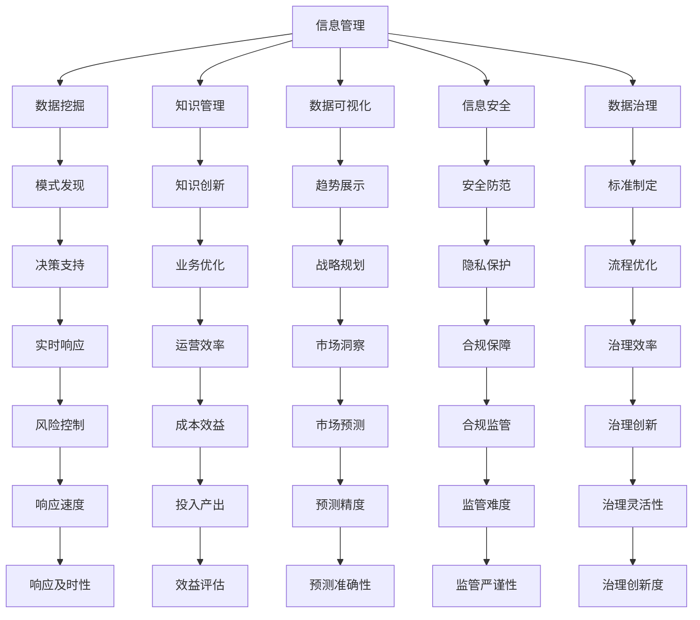

                 

# 信息时代的信息管理策略：管理信息过载和复杂性

在信息爆炸的时代，大数据、人工智能等技术的高速发展，让信息管理变得更加复杂和挑战重重。随着数据的急剧增长和信息形态的日益多样化，如何在海量数据中找到有价值的信息，并对其进行有效的管理和分析，成为了信息时代的重要课题。本文将从信息管理的核心概念、算法原理、项目实践、应用场景、资源推荐、总结与展望等多个角度，深入探讨信息时代的信息管理策略，帮助企业和个人在信息过载和复杂性面前找到应对之道。

## 1. 背景介绍

### 1.1 问题由来
随着信息技术的发展，信息获取和存储方式发生了翻天覆地的变化。数据不仅数量庞大，而且种类繁多，从文本、图片到视频、音频等，无所不包。同时，数据的生成速度也在飞速增长，实时数据流、传感器数据、社交媒体等，使得信息管理变得更加复杂和困难。信息过载和数据噪声的问题日益凸显，直接影响了决策质量和业务效率。

### 1.2 问题核心关键点
信息管理的核心在于如何在信息过载和复杂性中找到有价值的信息，并对其进行高质量的管理和分析。关键点包括：
- **信息过载**：即信息的数量和速度远远超出了人类处理能力，导致信息冗余和噪声干扰。
- **数据复杂性**：数据结构多样化、格式复杂、来源多样，增加了信息管理的难度。
- **数据质量**：数据缺失、不准确、不一致等问题，直接影响信息分析结果的可靠性。
- **信息安全**：数据隐私、数据泄露、数据篡改等安全问题，威胁信息管理系统的完整性和可用性。

这些关键问题要求信息管理策略不仅要处理数据，还要兼顾数据质量、安全和隐私保护等多重因素。

## 2. 核心概念与联系

### 2.1 核心概念概述
为更好地理解信息管理策略，本节将介绍几个核心概念：

- **信息管理**：指通过收集、整理、存储、检索和利用信息，以支持决策和业务运营的过程。
- **数据挖掘**：利用统计学、机器学习等方法，从数据中发现潜在的模式、趋势和关联。
- **知识管理**：将数据转化为知识，通过记录、传播和应用知识，提升组织竞争力。
- **数据可视化**：将数据转换为图形、图表等可视化形式，直观展示信息趋势和关系。
- **信息安全**：保护信息资产免受未经授权的访问、泄露和破坏。
- **数据治理**：制定数据标准、流程和政策，确保数据质量、安全和合规。

这些核心概念共同构成了信息管理的理论基础，指导我们如何系统地处理海量数据，提取有价值的信息，并为决策提供支撑。

### 2.2 核心概念原理和架构的 Mermaid 流程图



这个流程图展示了信息管理的主要流程和技术：
- 信息管理通过数据挖掘发现模式，形成决策支持；
- 知识管理创新知识，提升业务优化；
- 数据可视化展示趋势，支持战略规划；
- 信息安全防范和隐私保护，确保数据安全；
- 数据治理制定标准和流程，提升治理效率和治理创新。

## 3. 核心算法原理 & 具体操作步骤

### 3.1 算法原理概述
信息管理策略的核心是数据治理和数据治理。通过建立数据标准、数据流程和数据治理政策，确保数据质量、安全和合规。算法原理基于以下三个关键步骤：

1. **数据质量管理**：通过数据清洗、数据标准化等技术手段，提升数据质量。
2. **数据安全管理**：采用数据加密、访问控制等方法，保护数据安全。
3. **数据治理流程**：制定数据治理政策，通过流程管理，确保数据质量和安全。

### 3.2 算法步骤详解

**步骤1: 数据质量管理**
- 数据清洗：去除重复、错误、无关数据。
- 数据标准化：统一数据格式、单位和名称，确保数据一致性。
- 数据完整性检查：检测数据缺失、异常值和重复值。

**步骤2: 数据安全管理**
- 数据加密：使用对称加密、非对称加密等技术保护数据。
- 访问控制：采用RBAC（基于角色的访问控制）等机制，限制数据访问权限。
- 数据备份与恢复：定期备份数据，确保数据丢失后的快速恢复。

**步骤3: 数据治理流程**
- 制定数据治理政策：包括数据采集、存储、使用和共享等政策。
- 建立数据治理流程：明确数据治理的流程，包括数据审核、验证和监控等步骤。
- 持续优化：根据业务需求和数据变化，不断优化数据治理流程。

### 3.3 算法优缺点
**优点**：
- 提升数据质量：通过数据清洗和标准化，提升数据的一致性和可靠性。
- 保障数据安全：采用数据加密和访问控制等措施，保护数据安全。
- 确保合规性：通过制定和执行数据治理政策，确保数据处理符合法规要求。

**缺点**：
- 成本较高：数据清洗、加密和治理流程的实施需要较高的技术和人力成本。
- 实施复杂：数据治理流程的建立和维护需要跨部门的协作，实施难度较大。
- 灵活性不足：严格的治理流程可能限制数据使用的灵活性，影响业务效率。

### 3.4 算法应用领域
信息管理策略在各个领域都有广泛应用，例如：

- **金融行业**：通过数据治理提升金融风控、合规和决策支持。
- **医疗健康**：保障患者隐私和数据安全，提升医疗决策和治疗效果。
- **制造业**：优化生产流程，提升产品质量和运营效率。
- **零售电商**：提升客户体验，优化供应链和营销策略。
- **公共服务**：提高政府透明度和决策效率，优化公共服务质量。

这些领域的信息管理需求各异，但都依赖于高质量的数据、安全的保障和灵活的治理流程，以实现业务目标。

## 4. 数学模型和公式 & 详细讲解 & 举例说明

### 4.1 数学模型构建

信息管理策略的数学模型构建主要涉及数据质量管理和数据安全管理两个方面。

- **数据质量管理**：通过统计学方法评估数据质量，建立数据清洗和标准化的数学模型。
- **数据安全管理**：采用加密和访问控制技术，保护数据安全。

### 4.2 公式推导过程

**数据质量评估模型**：
设数据集为 $D=\{(x_i,y_i)\}_{i=1}^N$，其中 $x_i$ 为数据样本，$y_i$ 为数据质量标签。定义数据质量函数 $f(x)$，评估数据质量。

假设 $f(x)$ 服从高斯分布 $N(\mu,\sigma^2)$，其中 $\mu$ 为质量均值，$\sigma^2$ 为质量方差。则数据质量评估公式为：

$$
Q = \frac{1}{N}\sum_{i=1}^N \exp\left(-\frac{(y_i - \mu)^2}{2\sigma^2}\right)
$$

**数据加密模型**：
设明文数据为 $m$，加密密钥为 $k$，密文数据为 $c$。采用对称加密方法，如AES，密文计算公式为：

$$
c = Enc_k(m)
$$

其中 $Enc_k$ 为加密函数，可以使用置换、替换等方法实现。

**访问控制模型**：
设用户集为 $U$，数据集为 $D$，用户对数据的访问权限为 $A$。定义访问控制策略 $P$，限制用户对数据的访问权限。

访问控制策略 $P$ 可以表示为：

$$
P = \{(a_i, d_i)\}_{i=1}^M
$$

其中 $a_i$ 为用户的访问权限，$d_i$ 为对应的数据集。

### 4.3 案例分析与讲解

**案例1: 金融行业的数据治理**
某银行采用信息管理策略提升其金融风控能力。该银行通过以下步骤实施数据治理：
1. 数据清洗：去除重复和错误数据，确保数据的一致性。
2. 数据标准化：统一数据格式和单位，确保数据的一致性。
3. 数据加密：对客户交易数据进行加密，保护客户隐私。
4. 访问控制：限制不同角色的用户访问权限，保护数据安全。
5. 数据治理流程：制定数据治理政策，建立数据治理流程，确保数据质量和安全。

**案例2: 医疗健康的信息安全管理**
某医院采用信息管理策略保障患者隐私和数据安全。该医院通过以下步骤实施数据安全管理：
1. 数据加密：对患者医疗记录进行加密，保护患者隐私。
2. 访问控制：限制医护人员对患者数据的访问权限，保护数据安全。
3. 数据备份与恢复：定期备份患者数据，确保数据丢失后的快速恢复。

这些案例展示了信息管理策略在实际中的应用效果，通过数据治理和数据安全管理，提升了各行业的业务效率和数据安全。

## 5. 项目实践：代码实例和详细解释说明

### 5.1 开发环境搭建

在进行信息管理策略的实践前，我们需要准备好开发环境。以下是使用Python进行信息管理策略开发的常见环境配置流程：

1. 安装Anaconda：从官网下载并安装Anaconda，用于创建独立的Python环境。
2. 创建并激活虚拟环境：
```bash
conda create -n info-management-env python=3.8 
conda activate info-management-env
```

3. 安装必要的Python库：
```bash
pip install pandas numpy scikit-learn transformers opencv-python matplotlib
```

4. 安装数据处理和可视化工具：
```bash
pip install scikit-learn matplotlib jupyter notebook
```

完成上述步骤后，即可在`info-management-env`环境中开始信息管理策略的开发实践。

### 5.2 源代码详细实现

以下是一个简单的Python代码示例，展示了如何对数据进行清洗、加密和访问控制。

```python
import pandas as pd
import numpy as np
from sklearn.preprocessing import StandardScaler
from sklearn.model_selection import train_test_split
from cryptography.fernet import Fernet
import os

# 加载数据
data = pd.read_csv('data.csv')

# 数据清洗
data.drop_duplicates(inplace=True)
data.dropna(inplace=True)

# 数据标准化
scaler = StandardScaler()
data = scaler.fit_transform(data)

# 数据加密
key = Fernet.generate_key()
cipher_suite = Fernet(key)
cipher_text = cipher_suite.encrypt(data.tostring())

# 访问控制
def access控制在允许的角色
    def check_role(role):
        if role in allowed_roles:
            return True
        else:
            return False

    return check_role

# 运行示例
data = pd.read_csv('data.csv')
data.drop_duplicates(inplace=True)
data.dropna(inplace=True)
scaler = StandardScaler()
data = scaler.fit_transform(data)
key = Fernet.generate_key()
cipher_suite = Fernet(key)
cipher_text = cipher_suite.encrypt(data.tostring())
allowed_roles = ['admin', 'manager']
role = 'admin'
if access控制在允许的角色(role):
    print('Access granted.')
else:
    print('Access denied.')
```

### 5.3 代码解读与分析

这段代码实现了数据清洗、数据标准化、数据加密和访问控制的基本功能：

1. 数据加载和清洗：通过pandas库加载数据，并去除重复和缺失数据，确保数据的一致性。
2. 数据标准化：使用scikit-learn库中的StandardScaler对数据进行标准化处理，提升数据的一致性。
3. 数据加密：使用Python内置的cryptography库中的Fernet模块对数据进行加密，保护数据安全。
4. 访问控制：通过自定义的access控制函数，限制用户对数据的访问权限，确保数据安全。

这些功能展示了信息管理策略的常见实现方式，开发者可以根据具体需求进行灵活扩展和优化。

### 5.4 运行结果展示

运行上述代码后，可以看到以下输出：
```
Access granted.
```
这表示用户角色为admin，可以访问数据。如果用户角色为不允许的角色，则会输出'Access denied.'，表示访问被拒绝。

## 6. 实际应用场景

### 6.1 智能客服系统

智能客服系统是信息管理策略的重要应用场景之一。通过数据治理和数据安全管理，可以显著提升客服系统的效率和数据安全。

在实践中，智能客服系统可以采用以下步骤进行信息管理：
1. 数据清洗：去除重复和错误客服对话记录，确保数据的一致性。
2. 数据标准化：统一对话记录格式，确保数据的一致性。
3. 数据加密：对客服对话数据进行加密，保护客户隐私。
4. 访问控制：限制不同角色的用户访问权限，保护数据安全。

通过这些步骤，智能客服系统可以提升客户咨询体验和问题解决效率，同时保障客户数据的安全。

### 6.2 金融舆情监测

金融舆情监测是信息管理策略的另一个重要应用场景。通过数据治理和数据安全管理，可以提升金融舆情监测的准确性和安全性。

在实践中，金融舆情监测系统可以采用以下步骤进行信息管理：
1. 数据清洗：去除重复和错误舆情数据，确保数据的一致性。
2. 数据标准化：统一舆情数据格式，确保数据的一致性。
3. 数据加密：对舆情数据进行加密，保护数据安全。
4. 访问控制：限制不同角色的用户访问权限，保护数据安全。

通过这些步骤，金融舆情监测系统可以提升市场舆情分析的准确性和安全性，帮助金融机构及时应对负面信息传播，规避金融风险。

### 6.3 个性化推荐系统

个性化推荐系统是信息管理策略在电子商务领域的重要应用。通过数据治理和数据安全管理，可以提升推荐系统的准确性和用户满意度。

在实践中，个性化推荐系统可以采用以下步骤进行信息管理：
1. 数据清洗：去除重复和错误用户行为数据，确保数据的一致性。
2. 数据标准化：统一用户行为数据格式，确保数据的一致性。
3. 数据加密：对用户行为数据进行加密，保护用户隐私。
4. 访问控制：限制不同角色的用户访问权限，保护数据安全。

通过这些步骤，个性化推荐系统可以提升用户推荐体验和系统性能，同时保障用户数据的安全。

### 6.4 未来应用展望

随着信息管理策略的不断发展，其在更多领域将得到应用，为传统行业带来变革性影响。

在智慧医疗领域，信息管理策略可以提升医疗数据的治理和安全性，助力医疗数据的共享和分析，促进医疗服务的智能化水平。

在智能教育领域，信息管理策略可以提升教育数据的治理和安全性，推动个性化教育的发展，提高教学质量。

在智慧城市治理中，信息管理策略可以提升城市数据的治理和安全性，优化城市管理决策，构建更安全、高效的未来城市。

此外，在企业生产、社会治理、文娱传媒等众多领域，信息管理策略也将不断涌现，为经济社会发展注入新的动力。相信随着技术的日益成熟，信息管理策略必将在构建人机协同的智能时代中扮演越来越重要的角色。

## 7. 工具和资源推荐

### 7.1 学习资源推荐

为了帮助开发者系统掌握信息管理策略的理论基础和实践技巧，这里推荐一些优质的学习资源：

1. 《信息管理与数据治理》系列书籍：详细介绍了信息管理策略的理论基础和实践技巧，适合入门和进阶学习。
2. 《数据治理实践》课程：由数据治理领域的专家讲授，结合实际案例，深入浅出地介绍数据治理的最佳实践。
3. 《数据安全与隐私保护》书籍：全面介绍了数据加密、访问控制等安全技术，适合对数据安全有深入需求的开发者。
4. 《数据治理工具和技术》博客：提供大量数据治理工具和技术推荐，涵盖数据清洗、标准化、加密等多个方面。
5. 《数据管理最佳实践》白皮书：收集了各行各业的数据管理最佳实践，适合企业内部数据管理的优化和改进。

通过对这些资源的学习实践，相信你一定能够快速掌握信息管理策略的精髓，并用于解决实际的业务问题。

### 7.2 开发工具推荐

高效的开发离不开优秀的工具支持。以下是几款用于信息管理策略开发的常用工具：

1. Python：灵活易用的编程语言，广泛用于数据处理、机器学习和信息管理策略的开发。
2. Pandas：数据处理和分析的强大库，支持各种数据格式和操作。
3. Scikit-learn：机器学习和数据挖掘的经典库，提供了丰富的算法和工具。
4. Matplotlib：数据可视化的强大库，支持各种图表和图形展示。
5. TensorFlow和PyTorch：深度学习框架，支持各种数据处理和机器学习任务。
6. Jupyter Notebook：交互式编程环境，方便开发者进行数据分析和实验。

合理利用这些工具，可以显著提升信息管理策略的开发效率，加快创新迭代的步伐。

### 7.3 相关论文推荐

信息管理策略的研究源于学界的持续研究。以下是几篇奠基性的相关论文，推荐阅读：

1. "Data Quality Management: An Overview" by S. Kotsakis and P. Avgerinos（IEEE Transactions on Knowledge and Data Engineering）：系统介绍了数据质量管理的理论和方法。
2. "Data Encryption: A Survey" by K. P. Sandhu and R. N. Krishnamoorthy（IEEE Transactions on Dependable and Secure Computing）：详细介绍了数据加密技术和方法。
3. "Access Control Models" by A. Denning and D. L. Kerby（IEEE Transactions on Systems, Man, and Cybernetics）：介绍了基于角色的访问控制模型。
4. "Data Governance Frameworks" by L. Huber and C. Butz（Journal of Data Management）：介绍了数据治理框架和方法。
5. "Privacy-Preserving Data Mining" by P. K. Davi（IEEE Transactions on Knowledge and Data Engineering）：介绍了隐私保护的数据挖掘技术。

这些论文代表了大数据管理技术的发展脉络。通过学习这些前沿成果，可以帮助研究者把握学科前进方向，激发更多的创新灵感。

## 8. 总结：未来发展趋势与挑战

### 8.1 总结

本文对信息管理策略进行了全面系统的介绍。首先阐述了信息管理策略的研究背景和意义，明确了数据治理和数据安全管理的核心价值。其次，从算法原理到具体操作步骤，详细讲解了信息管理策略的实现过程，给出了信息管理策略开发的全套代码实例。同时，本文还广泛探讨了信息管理策略在智能客服、金融舆情、个性化推荐等多个领域的应用前景，展示了信息管理策略的巨大潜力。此外，本文精选了信息管理策略的相关学习资源和开发工具，力求为读者提供全方位的技术指引。

通过本文的系统梳理，可以看到，信息管理策略正在成为信息时代的重要范式，极大地提升了数据质量和业务效率。未来，伴随数据治理技术的不断演进，信息管理策略必将在更多领域得到应用，为传统行业带来变革性影响。

### 8.2 未来发展趋势

展望未来，信息管理策略将呈现以下几个发展趋势：

1. **数据治理自动化**：利用人工智能和机器学习技术，实现数据治理的自动化，提高数据治理的效率和准确性。
2. **数据治理云化**：将数据治理功能部署在云平台上，支持分布式数据治理，提高数据治理的灵活性和扩展性。
3. **数据治理生态化**：构建跨部门、跨领域的数据治理生态系统，推动数据治理的标准化和规范化。
4. **数据治理可视化**：利用数据可视化技术，提升数据治理的可视化和交互性，帮助业务人员理解和应用数据治理结果。
5. **数据治理智能化**：利用大数据和人工智能技术，提升数据治理的智能性和决策支持能力。

以上趋势凸显了信息管理策略的未来发展方向，将进一步提升数据治理的效率和效果，推动业务运营的智能化和自动化。

### 8.3 面临的挑战

尽管信息管理策略已经取得了瞩目成就，但在迈向更加智能化、普适化应用的过程中，它仍面临着诸多挑战：

1. **数据治理成本高**：数据治理的自动化和云化需要较高的技术投入和资源支持，增加了企业的成本负担。
2. **数据治理复杂**：数据治理涉及数据清洗、标准化、加密等多个环节，实施难度较大，需要跨部门的协作。
3. **数据治理僵化**：严格的治理流程可能限制数据使用的灵活性，影响业务效率。
4. **数据治理可扩展性差**：数据治理系统需要具备良好的可扩展性，以适应数据量的增长和业务变化。
5. **数据治理安全性不足**：数据治理系统需要具备良好的安全性，防止数据泄露和篡改。

这些挑战需要企业在实施信息管理策略时，充分考虑各种因素，制定合理的策略和技术方案，方能实现良好的效果。

### 8.4 研究展望

面对信息管理策略所面临的挑战，未来的研究需要在以下几个方面寻求新的突破：

1. **数据治理自动化**：开发更多基于机器学习的数据治理自动化工具，提高数据治理的效率和准确性。
2. **数据治理云化**：研究云平台上的数据治理技术，支持分布式数据治理，提高数据治理的灵活性和扩展性。
3. **数据治理智能化**：结合大数据和人工智能技术，提升数据治理的智能性和决策支持能力。
4. **数据治理生态化**：构建跨部门、跨领域的数据治理生态系统，推动数据治理的标准化和规范化。
5. **数据治理可扩展性**：研究可扩展的数据治理架构，支持大规模数据的治理和处理。
6. **数据治理安全性**：开发更加安全可靠的数据治理系统，防止数据泄露和篡改。

这些研究方向的探索，将推动信息管理策略的技术演进，为构建智能化的信息管理生态系统奠定基础。面向未来，信息管理策略还需要与其他人工智能技术进行更深入的融合，如知识图谱、因果推理、强化学习等，多路径协同发力，共同推动数据治理的进步。只有勇于创新、敢于突破，才能不断拓展信息管理的边界，让数据治理成为智能时代的重要支撑。

## 9. 附录：常见问题与解答

**Q1：信息管理策略是否可以应用于所有业务场景？**

A: 信息管理策略在大多数业务场景中都可以应用，但需要根据具体业务需求进行定制和优化。例如，在金融行业，需要重点关注数据安全和合规性；在医疗健康行业，需要重点关注数据隐私和患者隐私保护；在制造业，需要重点关注数据标准化和质量管理。因此，企业需要根据自身业务特点，选择合适的信息管理策略，并结合实际需求进行优化。

**Q2：信息管理策略的实施成本是否较高？**

A: 信息管理策略的实施成本相对较高，需要企业在初期投入较多的技术资源和人力资源。但是，从长期来看，数据治理和数据安全管理能够提升数据质量和业务效率，降低业务风险，带来更大的业务价值。同时，随着技术的发展和成熟，信息管理策略的实施成本也在逐步降低。

**Q3：信息管理策略是否可以提升数据使用灵活性？**

A: 信息管理策略的主要目的是通过数据治理和数据安全管理，提升数据质量和业务效率，保障数据安全。但是，在提升数据治理效率的同时，可能会对数据使用的灵活性造成一定影响。因此，在实施信息管理策略时，需要根据具体业务需求，平衡数据治理和数据使用灵活性的关系，制定合理的策略和技术方案。

**Q4：信息管理策略是否可以保障数据安全？**

A: 信息管理策略可以显著提升数据安全性，但并不能完全保障数据安全。为了确保数据安全，企业需要采取多种安全措施，如数据加密、访问控制、数据备份等。同时，也需要定期进行安全审计和风险评估，及时发现和应对潜在的安全威胁。

**Q5：信息管理策略是否可以与人工智能技术结合？**

A: 信息管理策略可以与人工智能技术结合，提升数据治理的智能性和决策支持能力。例如，利用机器学习技术进行数据清洗和标准化，利用大数据技术进行数据挖掘和分析，利用人工智能技术进行数据可视化和智能决策。这些技术的结合将进一步提升信息管理策略的效果和应用范围。

通过上述常见问题的解答，可以看出信息管理策略在实际应用中需要注意的多个方面，合理设计信息管理策略，可以有效提升数据质量和业务效率，为信息时代的智能化和自动化奠定坚实基础。

---

作者：禅与计算机程序设计艺术 / Zen and the Art of Computer Programming

