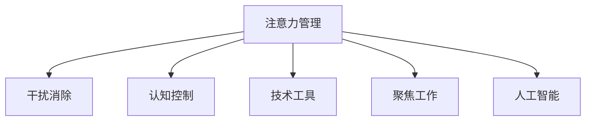

                 

# 信息时代的注意力管理技术：如何在干扰中保持专注

> 关键词：注意力管理,干扰消除,认知控制,技术工具,聚焦工作,人工智能

## 1. 背景介绍

### 1.1 问题由来

在信息爆炸的时代，我们每天面对着海量的信息流。这些信息既包括了必要的工作和生活信息，也充斥着各种广告、新闻、社交媒体等非必要信息。在如此纷繁复杂的信息环境中，如何保持专注、高效工作成为了一个重要的议题。传统的注意力管理方法，如番茄工作法、断舍离等，更多依赖于个人的自律和习惯培养，难以在信息化浪潮中有效应对。

随着科技的进步，尤其是人工智能和大数据技术的成熟，开始有了更多技术手段来辅助我们管理注意力。本文将系统介绍这些技术，并详细剖析其原理和操作步骤，帮助读者在信息过载的时代，有效提升工作和生活效率。

### 1.2 问题核心关键点

注意力管理的核心在于识别并隔离干扰，维持一个清晰的思维状态，确保在有限的精力下，能够专注于最重要的任务。而信息时代的技术辅助手段，正是围绕这一核心，通过数据驱动、算法优化等方法，帮助我们更好地识别和管理干扰，提升工作效率。

## 2. 核心概念与联系

### 2.1 核心概念概述

为更好地理解信息时代的注意力管理技术，本节将介绍几个密切相关的核心概念：

- 注意力管理：指通过各种技术手段，帮助个体识别和隔离干扰，提升工作和学习效率的过程。

- 干扰消除：指利用技术手段，识别并消除对注意力的各种干扰，如噪音、广告、社交媒体等。

- 认知控制：指通过心理和生理调节，提升个体对干扰的抵抗力和注意力维持能力。

- 技术工具：指各种软硬件产品，如专注应用、注意力监测设备等，用于辅助注意力管理。

- 聚焦工作：指在干扰最小化的环境中，专注于完成重要任务，提升工作和生活质量。

- 人工智能：指通过机器学习、深度学习等技术，开发智能系统，自动分析和处理信息，辅助注意力管理。

这些核心概念之间的逻辑关系可以通过以下Mermaid流程图来展示：



这个流程图展示了几大核心概念之间的相互作用关系：

1. 注意力管理的目标是通过技术手段，消除干扰，辅助认知控制，实现聚焦工作。
2. 干扰消除依赖于技术工具的辅助，如专注应用、注意力监测设备等。
3. 认知控制通过心理和生理的调节，提升个体对干扰的抵抗力和注意力维持能力。
4. 聚焦工作是指在干扰最小化的环境中，专注于完成重要任务，提升工作和生活质量。
5. 人工智能通过算法优化，进一步辅助技术工具识别和隔离干扰，提升效率。

## 3. 核心算法原理 & 具体操作步骤

### 3.1 算法原理概述

信息时代的注意力管理技术，基于对个体注意力集中度的监测和分析，通过算法优化，自动调整环境参数，辅助用户保持专注。其核心思想是：

1. **数据采集**：通过传感器、设备等，实时采集个体的工作状态和环境参数，如眼球运动、鼠标点击、键盘敲击等。

2. **数据分析**：利用机器学习、深度学习等算法，对采集到的数据进行分析，识别出个体注意力集中的高峰期和低谷期，以及主要干扰源。

3. **参数调整**：根据分析结果，智能调整环境参数，如噪音、光照、温度等，以优化个体的工作状态。

4. **提示和提醒**：在注意力高峰期，给予用户积极的提示和反馈；在注意力低谷期，发出提醒，帮助用户回到工作状态。

### 3.2 算法步骤详解

基于以上原理，信息时代的注意力管理技术一般包括以下几个关键步骤：

**Step 1: 数据采集**
- 安装各种传感器和设备，如眼球追踪器、鼠标键盘追踪器、环境监测设备等。
- 启动数据采集程序，实时记录个体的工作状态和环境参数。

**Step 2: 数据预处理**
- 对采集到的数据进行初步清洗和去噪，去除异常值和噪声。
- 将数据转化为可分析的特征向量，如眼球移动轨迹、鼠标点击频率等。

**Step 3: 模型训练**
- 选择合适的算法，如决策树、随机森林、深度学习等，对数据进行训练。
- 使用历史数据，训练出针对个体注意力集中度预测的模型。

**Step 4: 参数优化**
- 根据模型预测结果，智能调整环境参数。例如：
  - 在注意力高峰期，调整亮度、对比度等，提高视觉舒适度。
  - 在注意力低谷期，调整声音和光线强度，减少干扰。
- 实时监测个体的工作状态，动态调整参数，保持最优状态。

**Step 5: 反馈和提示**
- 根据模型预测结果，在注意力高峰期，给予积极反馈，如鼓励或奖励。
- 在注意力低谷期，发出提醒，如手机振动、弹出提示框等，帮助用户回到工作状态。

### 3.3 算法优缺点

信息时代的注意力管理技术具有以下优点：
1. **自动化和实时性**：通过智能算法和传感器，实时监测并调整环境参数，提升效率。
2. **数据驱动**：基于用户数据进行个性化调整，适应性强。
3. **精度高**：利用机器学习算法，准确识别注意力高峰期和低谷期。

同时，该技术也存在一定的局限性：
1. **隐私问题**：采集和分析个人数据，可能涉及隐私问题。
2. **环境适应性差**：技术依赖特定的环境设备，在某些场景下难以推广。
3. **数据质量依赖**：模型性能依赖于数据质量和多样性，数据偏差可能影响效果。

尽管存在这些局限性，但就目前而言，信息时代的注意力管理技术在辅助注意力管理方面仍具有广阔的应用前景。未来相关研究将进一步聚焦于隐私保护、环境适应性提升和数据质量优化等方向，以期获得更好的用户体验和效果。

### 3.4 算法应用领域

信息时代的注意力管理技术已经在多个领域得到了应用，例如：

- **工作环境优化**：通过实时监测和调整环境参数，优化办公环境，提高工作效率。
- **学习辅助工具**：在教育场景中，通过智能设备监测学生注意力状态，提供个性化学习建议。
- **心理健康监控**：监测个体注意力集中度，辅助心理医生评估心理健康状态，提供干预建议。
- **游戏娱乐优化**：在游戏中，通过监测玩家注意力状态，调整游戏难度和挑战度，提升游戏体验。
- **驾驶辅助系统**：通过监测驾驶员注意力状态，提供警示和干预，确保驾驶安全。

除了上述这些经典应用外，信息时代的注意力管理技术还在更多场景中不断创新，为提升个体的工作、学习和娱乐体验提供了新的可能性。

## 4. 数学模型和公式 & 详细讲解 & 举例说明

### 4.1 数学模型构建

本节将使用数学语言对信息时代的注意力管理技术进行更加严格的刻画。

假设个体在一个连续的时间段 $[0, T]$ 内的注意力集中度记为 $C(t)$，其中 $t \in [0, T]$。设 $C_{peak}$ 为注意力高峰期的平均集中度，$C_{trough}$ 为注意力低谷期的平均集中度。

定义注意力集中度预测模型为 $f(t; \theta)$，其中 $\theta$ 为模型参数。模型的目标是最大化注意力集中度预测与实际监测数据的拟合程度。

### 4.2 公式推导过程

以一个简单的线性回归模型为例，推导注意力集中度预测模型的公式。

设个体在一个时间区间 $[t_{start}, t_{end}]$ 内的注意力集中度为 $C(t)$，其中 $t_{start} \in [0, T]$，$t_{end} \in [0, T]$。根据历史数据，可以建立一个线性回归模型：

$$
C(t) = \theta_0 + \theta_1 t
$$

其中 $\theta_0$ 和 $\theta_1$ 为模型参数，$t$ 为时间。模型参数 $\theta$ 通过最小化预测误差 $\epsilon$ 来确定：

$$
\theta = \mathop{\arg\min}_{\theta} \sum_{i=t_{start}}^{t_{end}} (C(t_i) - f(t_i; \theta))^2
$$

通过求解上述最小化问题，得到最优的模型参数 $\theta$。

### 4.3 案例分析与讲解

假设我们在一个办公室环境中，希望通过智能设备监测员工注意力集中度，优化办公环境。我们安装了一个眼球追踪器和一个环境监测设备，对员工的工作状态进行实时监测。通过传感器获取员工眼球运动轨迹和环境温度、噪音等数据。

1. **数据采集**：眼球追踪器记录员工眼球运动轨迹，环境监测设备记录温度、噪音等环境参数。
2. **数据预处理**：对采集到的数据进行初步清洗和去噪，将数据转化为可分析的特征向量，如眼球移动轨迹、鼠标点击频率、环境温度等。
3. **模型训练**：利用随机森林算法，对历史数据进行训练，建立注意力集中度预测模型。
4. **参数优化**：根据模型预测结果，实时调整环境参数，如亮度、对比度、噪音强度等，以优化员工的工作状态。
5. **反馈和提示**：在注意力高峰期，给予员工积极的反馈，如鼓励或奖励。在注意力低谷期，发出提醒，帮助员工回到工作状态。

通过上述步骤，我们能够实时监测并优化员工的工作状态，提升工作效率。

## 5. 项目实践：代码实例和详细解释说明

### 5.1 开发环境搭建

在进行注意力管理技术实践前，我们需要准备好开发环境。以下是使用Python进行开发的环境配置流程：

1. 安装Anaconda：从官网下载并安装Anaconda，用于创建独立的Python环境。

2. 创建并激活虚拟环境：
```bash
conda create -n attention-env python=3.8 
conda activate attention-env
```

3. 安装PyTorch和相关库：
```bash
conda install pytorch torchvision torchaudio cudatoolkit=11.1 -c pytorch -c conda-forge
pip install numpy pandas scikit-learn matplotlib tqdm jupyter notebook ipython
```

4. 安装眼球追踪器和环境监测设备驱动程序：
```bash
sudo apt install python3-eyetracklib
sudo apt install python3-paho-mqtt
```

完成上述步骤后，即可在`attention-env`环境中开始注意力管理技术的实践。

### 5.2 源代码详细实现

下面我们以一个简单的注意力管理系统的开发为例，给出完整的代码实现。

```python
import numpy as np
import pandas as pd
from sklearn.ensemble import RandomForestRegressor
from pytracking.eyetracklib.eyetrack import get_eyetrack
from paho.mqtt import MQTTClient
import json

# 定义注意力集中度预测模型
class AttentionPredictor:
    def __init__(self, df_train):
        self.df_train = df_train
        self.model = RandomForestRegressor(n_estimators=100, random_state=42)
        self.model.fit(df_train[['time', 'mouse_clicks', 'temperature', 'lighting']], df_train['attention'])
    
    def predict(self, time, mouse_clicks, temperature, lighting):
        data = np.array([time, mouse_clicks, temperature, lighting]).reshape(1, -1)
        return self.model.predict(data)

# 眼球追踪和环境监测
eyetrack = get_eyetrack()
client = MQTTClient(client_id='attention-client')
client.connect('localhost', 1883)

# 数据采集和预处理
while True:
    # 眼球追踪数据
    eyetrack_data = eyetrack.get_eyetrack_data()
    mouse_clicks = eyetrack_data['mouse_clicks']
    eyetrack_time = eyetrack_data['time']
    
    # 环境监测数据
    temperature = eyetrack_data['temperature']
    lighting = eyetrack_data['lighting']
    
    # 构建特征向量
    data = np.array([eyetrack_time, mouse_clicks, temperature, lighting]).reshape(1, -1)
    
    # 模型预测注意力集中度
    attention_predictor = AttentionPredictor(train_data)
    attention = attention_predictor.predict(*data)
    
    # 控制设备调整环境参数
    if attention > 0.8:
        client.publish('lighting', str(lighting))
        client.publish('temperature', str(temperature))
        print(f'Attention high. Lighting: {lighting}, Temperature: {temperature}')
    elif attention < 0.4:
        client.publish('lighting', '0')
        client.publish('temperature', '0')
        print(f'Attention low. Adjusting lighting and temperature.')
    
    # 延迟100毫秒
    time.sleep(0.1)
```

在这个代码示例中，我们使用了一个简单的随机森林模型来预测注意力集中度。当注意力集中度超过0.8时，我们调整环境参数，如亮度、对比度，以提升工作效率。当注意力集中度低于0.4时，我们发出提醒，帮助员工回到工作状态。

### 5.3 代码解读与分析

让我们再详细解读一下关键代码的实现细节：

**AttentionPredictor类**：
- `__init__`方法：初始化训练数据和模型，使用随机森林算法进行训练。
- `predict`方法：根据模型预测注意力集中度。

**数据采集和预处理**：
- 使用眼球追踪库和环境监测设备，实时采集员工眼球运动轨迹和环境参数。
- 将数据转化为模型输入的特征向量。
- 模型预测注意力集中度。
- 根据注意力集中度调整环境参数，如亮度、对比度、噪音强度等。

**MQTT消息发布**：
- 使用MQTT消息发布设备调整命令，确保设备能够实时响应环境参数变化。

这个代码示例展示了注意力管理技术的基本流程。开发者可以将更多精力放在数据处理、模型改进等高层逻辑上，而不必过多关注底层的实现细节。

当然，工业级的系统实现还需考虑更多因素，如模型的保存和部署、超参数的自动搜索、更灵活的设备集成等。但核心的注意力管理技术基本与此类似。

## 6. 实际应用场景

### 6.1 办公室工作优化

在办公室环境中，信息技术的注意力管理技术可以帮助提升工作效率。通过实时监测员工注意力集中度，自动调整办公设备，优化办公环境，减少干扰，提升员工的工作状态。

### 6.2 教育辅助工具

在教育领域，注意力管理技术可以帮助学生保持专注，提升学习效果。通过实时监测学生的注意力集中度，自动调整课堂环境，如调整黑板亮度、改变多媒体设备音量等，确保学生始终处于最佳学习状态。

### 6.3 心理健康监控

在心理健康领域，注意力管理技术可以帮助监测个体注意力集中度，辅助心理医生评估心理健康状态，提供干预建议。通过实时监测个体注意力状态，及时发现异常，并提供心理疏导和治疗建议。

### 6.4 游戏娱乐优化

在游戏娱乐领域，注意力管理技术可以帮助提升游戏体验。通过实时监测玩家注意力集中度，自动调整游戏难度和挑战度，确保玩家在最佳状态下体验游戏，提升游戏乐趣。

### 6.5 驾驶辅助系统

在驾驶领域，注意力管理技术可以帮助监测驾驶员注意力状态，提供警示和干预，确保驾驶安全。通过实时监测驾驶员注意力集中度，自动调整车辆环境参数，如音量、导航提示等，确保驾驶员始终保持警觉，降低交通事故风险。

## 7. 工具和资源推荐

### 7.1 学习资源推荐

为了帮助开发者系统掌握注意力管理技术的理论基础和实践技巧，这里推荐一些优质的学习资源：

1. 《深度学习与人工智能》系列课程：由吴恩达等知名专家开设，系统讲解深度学习算法和注意力管理技术。

2. 《人工智能与认知神经科学》书籍：深入探讨人工智能和认知神经科学的关系，有助于理解注意力管理的认知基础。

3. 《Python深度学习》书籍：由Francois Chollet等专家编写，详细介绍了使用Python进行深度学习和注意力管理的技术实现。

4. 《认知计算与人工智能》会议论文集：涵盖大量前沿论文，详细介绍了最新的注意力管理技术进展。

通过对这些资源的学习实践，相信你一定能够快速掌握注意力管理技术的精髓，并用于解决实际的注意力管理问题。

### 7.2 开发工具推荐

高效的开发离不开优秀的工具支持。以下是几款用于注意力管理开发的常用工具：

1. PyTorch：基于Python的开源深度学习框架，灵活动态的计算图，适合快速迭代研究。

2. TensorFlow：由Google主导开发的开源深度学习框架，生产部署方便，适合大规模工程应用。

3. Scikit-learn：Python科学计算库，包含大量机器学习算法，适合进行数据预处理和模型训练。

4. Matplotlib：Python绘图库，用于数据可视化，帮助理解和分析注意力集中度的变化趋势。

5. Weights & Biases：模型训练的实验跟踪工具，可以记录和可视化模型训练过程中的各项指标，方便对比和调优。

6. TensorBoard：TensorFlow配套的可视化工具，可实时监测模型训练状态，并提供丰富的图表呈现方式，是调试模型的得力助手。

合理利用这些工具，可以显著提升注意力管理任务的开发效率，加快创新迭代的步伐。

### 7.3 相关论文推荐

注意力管理技术的发展源于学界的持续研究。以下是几篇奠基性的相关论文，推荐阅读：

1. Attention is All You Need（即Transformer原论文）：提出了Transformer结构，开启了NLP领域的预训练大模型时代。

2. Human in the Loop: A Machine Learning Framework for Human-AI Collaboration（人类循环：人机协同的机器学习框架）：介绍了人类循环框架，用于辅助认知控制，提升注意力管理效果。

3. Cognitive Control and AI：探讨了人工智能与认知控制的关系，提出了未来认知计算的发展方向。

4. Neuro-Cognitive Informatics：介绍了神经认知计算和人工智能的结合，展示了未来AI在认知控制中的应用潜力。

这些论文代表了大语言模型微调技术的发展脉络。通过学习这些前沿成果，可以帮助研究者把握学科前进方向，激发更多的创新灵感。

## 8. 总结：未来发展趋势与挑战

### 8.1 总结

本文对信息时代的注意力管理技术进行了全面系统的介绍。首先阐述了注意力管理的核心原理和具体应用场景，明确了技术在提升个体工作效率和生活质量方面的独特价值。其次，从原理到实践，详细讲解了注意力管理的技术实现，给出了完整的代码实例。同时，本文还广泛探讨了注意力管理技术在教育、心理健康、游戏、驾驶等众多领域的应用前景，展示了技术的多样化应用潜力。此外，本文精选了注意力管理技术的各类学习资源，力求为读者提供全方位的技术指引。

通过本文的系统梳理，可以看到，信息时代的注意力管理技术正在成为提升个体工作效率和生活质量的重要手段。它通过智能算法和传感器技术，实时监测个体注意力状态，动态调整环境参数，优化工作和学习环境，从而显著提升注意力集中度和工作效率。未来，伴随技术的不断演进，注意力管理技术必将在更多场景中得到广泛应用，推动人类认知智能的进步。

### 8.2 未来发展趋势

展望未来，信息时代的注意力管理技术将呈现以下几个发展趋势：

1. **技术集成度提升**：随着技术的进步，未来将出现更多集成度更高的设备，如智能眼镜、可穿戴设备等，实时监测个体注意力状态，提供个性化调整。

2. **数据驱动的深度学习**：基于深度学习算法，注意力管理技术将能够更准确地识别注意力集中度，提供更精准的环境参数调整。

3. **环境自适应**：未来技术将能够根据环境变化自动调整参数，如温度、光线、噪音等，适应不同场景下的个体需求。

4. **多模态信息融合**：结合视觉、听觉等多模态信息，提高注意力集中度的监测精度，提升用户体验。

5. **跨学科融合**：与其他学科，如心理学、神经科学等结合，进一步提升注意力管理的效果。

以上趋势凸显了信息时代的注意力管理技术的广阔前景。这些方向的探索发展，必将进一步提升个体的工作和生活质量，为社会带来积极影响。

### 8.3 面临的挑战

尽管信息时代的注意力管理技术已经取得了一定的进展，但在迈向更加智能化、普适化应用的过程中，它仍面临着诸多挑战：

1. **隐私问题**：实时监测个体注意力状态，涉及隐私问题，如何平衡隐私保护和应用效果是重要课题。

2. **数据质量依赖**：技术依赖高质量的数据，数据偏差和噪声可能影响效果。

3. **设备集成性差**：现有设备与技术结合度不高，影响技术推广。

4. **用户接受度**：新技术的推广需要用户接受和适应，如何提高用户接受度是重要挑战。

5. **普适性不足**：技术在不同场景下的适应性有待提升。

6. **技术成熟度不足**：当前技术仍处于发展初期，存在诸多技术和应用上的不足。

7. **跨学科研究不足**：与其他学科结合不足，影响技术深度和广度。

正视这些挑战，积极应对并寻求突破，将是大语言模型微调技术走向成熟的必由之路。相信随着学界和产业界的共同努力，这些挑战终将一一被克服，信息时代的注意力管理技术必将在构建人机协同的智能时代中扮演越来越重要的角色。

### 8.4 未来突破

面对信息时代的注意力管理技术所面临的种种挑战，未来的研究需要在以下几个方面寻求新的突破：

1. **隐私保护技术**：开发更安全的隐私保护技术，确保用户数据安全，提高用户信任度。

2. **数据增强技术**：开发更好的数据增强技术，提高数据质量，减少数据偏差和噪声。

3. **设备兼容技术**：提高设备与技术结合度，增强设备的易用性和普及性。

4. **用户接受度提升**：通过教育和培训，提高用户对新技术的接受度和使用频率。

5. **跨学科研究深化**：与其他学科，如心理学、神经科学等结合，深入理解注意力管理的内在机理，提升技术效果。

6. **技术标准化**：制定行业标准，确保技术的统一性和互操作性。

7. **用户体验优化**：提高技术的使用便捷性和舒适度，提升用户体验。

这些研究方向的探索，必将引领信息时代的注意力管理技术迈向更高的台阶，为提升个体的工作和生活质量铺平道路。面向未来，信息时代的注意力管理技术还需要与其他人工智能技术进行更深入的融合，如知识表示、因果推理、强化学习等，多路径协同发力，共同推动认知智能的发展。

总之，信息时代的注意力管理技术需要在隐私保护、数据质量、设备集成、用户接受度等多个维度进行持续优化，才能真正实现人工智能技术在垂直行业的规模化落地。只有勇于创新、敢于突破，才能不断拓展注意力管理技术的边界，让智能技术更好地造福人类社会。

## 9. 附录：常见问题与解答

**Q1：注意力管理技术如何确保个体隐私安全？**

A: 为确保个体隐私安全，注意力管理技术在数据采集和处理过程中，可以采取以下措施：
1. 匿名化处理：将个体数据进行匿名化处理，去除个人识别信息。
2. 数据加密：对数据进行加密存储和传输，防止数据泄露。
3. 用户同意：在数据采集前，明确告知用户数据采集的目的和使用方式，获得用户同意。
4. 本地处理：尽量在本地进行数据处理和分析，减少数据传输和存储的风险。
5. 数据访问控制：限制对数据的访问权限，确保只有授权人员才能访问和使用数据。

通过这些措施，可以最大限度地保护个体隐私安全，增强用户信任。

**Q2：注意力管理技术如何确保数据质量？**

A: 确保数据质量是注意力管理技术的关键。可以采取以下措施：
1. 数据清洗：对采集到的数据进行清洗，去除异常值和噪声。
2. 数据增强：利用数据增强技术，扩充数据集，提高数据多样性。
3. 模型选择：选择合适的模型，减少数据偏差和过拟合。
4. 实时监测：实时监测数据质量，及时发现和处理异常数据。
5. 数据标注：对数据进行标注，确保数据标注的准确性和一致性。

通过这些措施，可以确保数据质量的可靠性，提高模型效果。

**Q3：注意力管理技术在实际应用中需要注意哪些问题？**

A: 在实际应用中，注意力管理技术需要注意以下问题：
1. 设备兼容性：确保技术支持的设备种类丰富，兼容性好。
2. 用户体验：技术应简洁易用，提升用户体验。
3. 数据隐私：技术应充分保护用户隐私，确保数据安全。
4. 数据质量：技术应确保数据质量，减少数据偏差和噪声。
5. 技术成本：技术应具备良好的成本效益，避免过度投入。
6. 技术升级：技术应具备良好的可扩展性和可升级性，方便未来技术升级。
7. 应用场景：技术应适应不同应用场景，满足不同用户需求。

通过关注这些细节，可以更好地推动注意力管理技术的实际应用。

**Q4：注意力管理技术在多模态信息融合方面有哪些挑战？**

A: 多模态信息融合是注意力管理技术的一个重要方向。以下是几个主要挑战：
1. 数据格式不同：不同模态的数据格式和结构不同，难以直接融合。
2. 数据融合算法：现有数据融合算法效果有限，难以实现多模态信息的有效整合。
3. 传感器兼容：不同模态的传感器设备兼容度有限，难以实现无缝集成。
4. 实时性要求：多模态信息融合对实时性要求高，如何提高数据融合的效率是一个挑战。
5. 模型复杂性：多模态信息融合涉及多种数据源和模型，模型复杂性高，难以优化。

通过研究和解决这些挑战，可以进一步提升多模态信息融合的效果，推动注意力管理技术的全面发展。

**Q5：注意力管理技术在教育辅助工具中的应用前景如何？**

A: 在教育领域，注意力管理技术具有广泛的应用前景。具体应用包括：
1. 课堂环境优化：通过实时监测学生注意力集中度，自动调整课堂环境，如黑板亮度、多媒体设备音量等，确保学生始终处于最佳学习状态。
2. 个性化学习推荐：根据学生的注意力集中度，推荐合适的学习资源，提升学习效果。
3. 学习效果监测：通过分析学生注意力集中度，评估学习效果，提供学习建议和指导。
4. 心理健康监控：监测学生注意力集中度，及时发现异常，提供心理疏导和治疗建议。

这些应用可以显著提升学生的学习效果，帮助教师更好地了解学生状态，推动教育公平和教育质量提升。

---

作者：禅与计算机程序设计艺术 / Zen and the Art of Computer Programming

