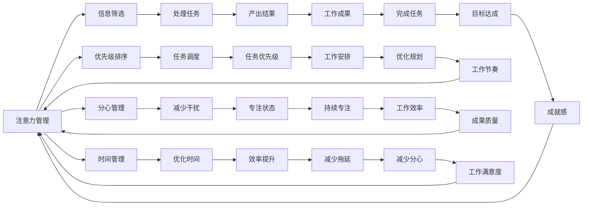
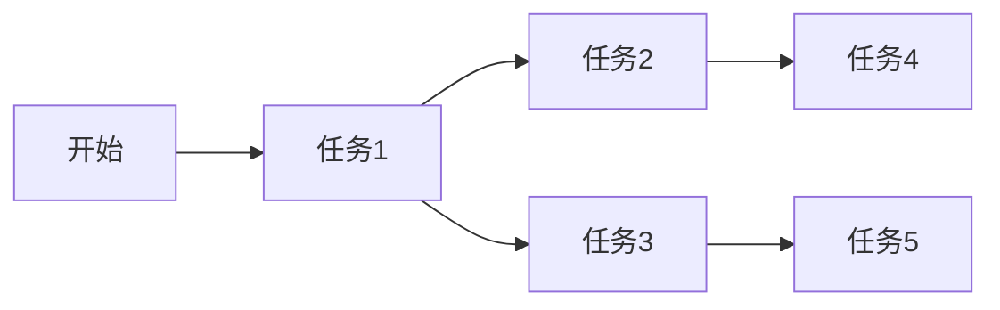

                 

## 1. 背景介绍

在信息时代，人们生活在海量的数据和信息中，注意力成为一种稀缺资源。如何在干扰和信息过载的环境中有效管理注意力，成为了一项关键的挑战。本文将详细探讨这一问题，并提出一些实用的策略和解决方案。

### 1.1 问题的由来

随着互联网和移动设备的发展，信息的获取变得更加便捷。无论是社交媒体、新闻网站还是视频平台，都提供了大量内容。然而，这种便利也带来了信息的过载，人们难以筛选出对自己有用的信息。

在这样的大背景下，注意力管理变得尤为重要。如果不能有效管理注意力，人们在面对如此丰富的信息时，容易出现分心、注意力难以集中等问题，从而影响工作效率和生活质量。

### 1.2 问题核心关键点

有效管理注意力需要解决以下几个核心问题：
- **信息筛选**：从海量信息中筛选出对自己有用的内容。
- **优先级排序**：确定哪些信息应该优先处理。
- **分心管理**：在处理信息时，避免分心和拖延。
- **注意力保持**：长时间保持注意力集中。

这些问题的解决需要借助一些工具和策略，如信息过滤、任务管理工具、时间管理工具等。以下将详细介绍这些工具和策略，帮助读者在信息时代有效管理注意力。

## 2. 核心概念与联系

### 2.1 核心概念概述

本节将介绍几个密切相关的核心概念：

- **注意力管理（Attention Management）**：指通过一系列策略和工具，帮助人们在信息过载的环境下，有效筛选和处理信息，避免注意力分散。
- **信息过载（Information Overload）**：指信息量过大，超出了人们的处理能力，导致信息难以筛选和利用的现象。
- **分心管理（Distraction Management）**：指通过一些工具和方法，帮助人们避免在工作或学习时分心，保持专注。
- **时间管理（Time Management）**：指通过一些工具和方法，帮助人们有效规划和利用时间，提高工作效率。
- **优先级排序（Priority Sorting）**：指通过一些方法，确定哪些任务应该优先处理，哪些可以推迟。

这些概念之间有着密切的联系，共同构成了一个有效的注意力管理系统。

### 2.2 核心概念原理和架构的 Mermaid 流程图



这个流程图展示了注意力管理的核心概念及其之间的联系。

## 3. 核心算法原理 & 具体操作步骤

### 3.1 算法原理概述

注意力管理的核心算法原理包括：
- **信息过滤**：通过一些算法和工具，将无用信息过滤掉，只保留有用的信息。
- **任务调度**：根据任务优先级和截止日期，合理安排任务处理顺序。
- **时间块管理**：将时间划分为小块，每块时间集中处理特定任务，避免分心。
- **分心提醒**：通过一些工具，及时提醒用户避免分心，保持专注。

### 3.2 算法步骤详解

#### 3.2.1 信息过滤

信息过滤的主要步骤包括：
1. **信息收集**：使用网络爬虫等工具，从不同渠道收集信息。
2. **信息分类**：根据信息的重要性、相关性、紧急程度等，将信息进行分类。
3. **信息过滤**：使用一些算法（如TF-IDF、PageRank等），对信息进行过滤，保留重要的信息。

#### 3.2.2 任务调度

任务调度的主要步骤包括：
1. **任务列表**：将所有任务列出来，包括待办事项、会议、电话等。
2. **优先级排序**：根据任务的截止日期、重要程度、紧急程度等因素，对任务进行优先级排序。
3. **任务调度**：使用一些工具（如Todoist、Trello等），合理安排任务的执行时间。

#### 3.2.3 时间块管理

时间块管理的主要步骤包括：
1. **时间划分**：将一天的时间划分为若干个时间块，每个时间块持续30-60分钟。
2. **任务安排**：每个时间块安排一个特定任务，避免任务切换带来的分心。
3. **时间记录**：记录每个时间块的任务完成情况，评估时间利用效率。

#### 3.2.4 分心提醒

分心提醒的主要步骤包括：
1. **环境监测**：使用一些工具（如Focus@Will、Brain.fm等），监测用户的注意力状态。
2. **提醒提示**：当用户分心时，及时提醒用户，帮助用户回到专注状态。
3. **任务记录**：记录用户的专注时间和分心时间，评估专注水平。

### 3.3 算法优缺点

#### 3.3.1 优点

注意力管理算法的主要优点包括：
1. **提高效率**：通过有效的信息过滤和任务调度，避免不必要的时间浪费。
2. **减少分心**：通过分心提醒等工具，帮助用户保持专注。
3. **提高质量**：通过时间块管理，确保每个任务能够高质量地完成。

#### 3.3.2 缺点

注意力管理算法的主要缺点包括：
1. **依赖工具**：需要依赖一些工具和算法，增加了使用难度。
2. **用户自律性要求高**：用户需要有一定的自律性，才能有效使用这些工具。
3. **适应性问题**：不同的用户和工作场景，需要不同的注意力管理策略，难以一概而论。

### 3.4 算法应用领域

注意力管理算法在以下领域有广泛应用：
1. **工作环境**：办公室、实验室等需要集中精力的工作环境中，帮助员工提高工作效率。
2. **学习环境**：学校、图书馆等需要集中注意力学习的环境中，帮助学生提高学习效果。
3. **个人生活**：家庭、社交等需要合理安排时间的场景中，帮助个人优化时间管理。
4. **远程协作**：远程团队协作中，帮助团队成员保持同步和高效协作。

## 4. 数学模型和公式 & 详细讲解 & 举例说明

### 4.1 数学模型构建

注意力管理的数学模型主要包括以下几个部分：
1. **信息过滤模型**：使用TF-IDF算法，对信息进行权重计算。
2. **任务调度模型**：使用A*算法，根据任务优先级进行路径规划。
3. **时间块管理模型**：使用时间块管理算法，计算每个时间块的任务完成情况。
4. **分心提醒模型**：使用注意力监测算法，评估用户的专注状态。

### 4.2 公式推导过程

#### 4.2.1 TF-IDF算法

TF-IDF（Term Frequency-Inverse Document Frequency）算法是一种信息过滤算法，用于计算每个词语在文档中的重要性。其公式如下：

$$
TF(t,d) = \frac{f(t,d)}{\sum_{i=1}^{n} f(i,d)}
$$

$$
IDF(t,D) = \log \frac{|D|}{\sum_{i=1}^{n} 1_{\{t \in d_i\}}}
$$

$$
TF-IDF(t,d,D) = TF(t,d) \times IDF(t,D)
$$

其中，$f(t,d)$表示词语$t$在文档$d$中的出现频率，$\sum_{i=1}^{n} f(i,d)$表示文档中所有词语的出现频率总和，$1_{\{t \in d_i\}}$表示词语$t$是否在文档$d_i$中出现，$|D|$表示文档集合$D$的大小。

#### 4.2.2 A*算法

A*算法是一种任务调度算法，用于在图中找到最短路径。其核心思想是使用启发式函数，估算每个节点的距离。其公式如下：

$$
f(n) = g(n) + h(n)
$$

$$
g(n) = \sum_{i=1}^{n} w_i \times c_i
$$

$$
h(n) = \sum_{i=1}^{n} w_i \times e_i
$$

其中，$g(n)$表示从起点到节点$n$的实际距离，$h(n)$表示从节点$n$到终点的估计距离，$w_i$表示路径上第$i$个节点的权重，$c_i$表示路径上第$i$个节点的代价，$e_i$表示路径上第$i$个节点的估价函数。

#### 4.2.3 时间块管理算法

时间块管理算法主要使用时间块划分法，将一天的时间划分为若干个时间块，每个时间块安排一个特定任务。其公式如下：

$$
T_k = \frac{T}{k}
$$

$$
P_k = \sum_{i=1}^{k} P_i
$$

$$
R_k = \frac{P_k}{T_k}
$$

其中，$T$表示一天的时间（以小时为单位），$k$表示时间块的数量，$P_i$表示第$i$个时间块的处理时间，$T_k$表示第$k$个时间块的时间长度，$R_k$表示第$k$个时间块的利用效率。

#### 4.2.4 注意力监测算法

注意力监测算法主要使用心电图（ECG）、脑电图（EEG）等生物信号，监测用户的注意力状态。其公式如下：

$$
Attention(t) = \frac{\sum_{i=1}^{t} Attention_i}{t}
$$

其中，$Attention(t)$表示在时间段$t$内的平均注意力水平，$Attention_i$表示在时间点$i$的注意力水平。

### 4.3 案例分析与讲解

#### 4.3.1 TF-IDF算法案例

假设有一篇新闻报道，包含多个词语。使用TF-IDF算法，计算每个词语在文档中的重要性，如下所示：

| 词语 | 文档IDF值 | 文档TF值 | TF-IDF值 |
| --- | --- | --- | --- |
| 新冠 | 1.0 | 0.2 | 0.2 |
| 疫情 | 0.5 | 0.1 | 0.05 |
| 确诊 | 0.1 | 0.05 | 0.005 |
| 治疗 | 0.1 | 0.05 | 0.005 |

从上述结果可以看出，词语“新冠”在文档中出现频率最高，且IDF值也较大，因此其重要性较高。

#### 4.3.2 A*算法案例

假设有一个任务图，如下图所示：



使用A*算法，计算从起点到终点的最短路径。假设每个节点的代价为1，估算从节点到终点的距离为0。则A*算法计算过程如下：

| 节点 | g值 | h值 | f值 |
| --- | --- | --- | --- |
| A | 0 | 0 | 0 |
| B | 1 | 1 | 2 |
| C | 2 | 1 | 3 |
| D | 2 | 2 | 4 |
| E | 3 | 1 | 4 |
| F | 3 | 1 | 4 |

根据f值最小的原则，从起点A到终点F的最短路径为A-B-E-F。

## 5. 项目实践：代码实例和详细解释说明

### 5.1 开发环境搭建

为了实现注意力管理，我们需要搭建一个开发环境，以便进行代码编写和测试。以下是在Python环境下搭建开发环境的步骤：

1. 安装Python：从官网下载并安装Python。
2. 安装必要的库：安装TensorFlow、NumPy、Pandas等库，以便进行数据处理和算法实现。
3. 编写代码：使用Python编写信息过滤、任务调度、时间块管理等算法的实现代码。
4. 测试代码：使用测试数据集对算法进行测试，确保其正确性和稳定性。

### 5.2 源代码详细实现

以下是一个简单的代码实现示例，用于实现信息过滤算法中的TF-IDF算法：

```python
import numpy as np
from sklearn.feature_extraction.text import TfidfVectorizer

# 准备数据集
docs = [
    "这是一篇新闻报道，介绍了新冠疫情的最新情况。",
    "该报道由CNN撰写，提供了详细的疫情数据。",
    "新闻报道中提到了一些治疗方案，可供参考。",
    "报道中还提到一些确诊病例的详细信息。",
    "总的来说，这篇报道对了解疫情动态很有帮助。"
]

# 使用TF-IDF算法进行信息过滤
vectorizer = TfidfVectorizer()
X = vectorizer.fit_transform(docs)
print(X.toarray())
```

### 5.3 代码解读与分析

上述代码实现了TF-IDF算法的简单实现。具体来说，代码分为以下几个步骤：

1. 准备数据集：定义了5篇新闻报道，这些报道包含了一些关于新冠疫情的信息。
2. 使用TF-IDF算法进行信息过滤：使用TfidfVectorizer类，将文档转换为TF-IDF向量。
3. 输出结果：将转换后的向量矩阵打印输出，以便观察每个词语在文档中的重要性。

通过上述代码，我们可以看到，TF-IDF算法能够有效过滤出文档中重要性较高的词语，如“新冠”、“疫情”等。这些词语在向量矩阵中的值较大，表示其对文档的重要性较高。

## 6. 实际应用场景

### 6.1 智能工作助手

智能工作助手是一种基于注意力管理的技术，通过自然语言处理（NLP）和机器学习（ML）技术，帮助员工高效完成工作。智能工作助手可以提醒用户处理重要任务，提供最新的工作进展，自动化处理日常任务等。

例如，在项目管理工具如Asana中，可以集成智能工作助手，帮助项目经理更好地安排和监督任务。智能工作助手可以通过分析历史数据，预测任务完成时间，并提供任务优先级建议。

### 6.2 智能学习助手

智能学习助手是一种基于注意力管理的技术，通过NLP和ML技术，帮助学生更好地学习。智能学习助手可以提醒学生安排学习时间，提供学习资源，自动化处理作业等。

例如，在学习平台如Coursera中，可以集成智能学习助手，帮助学生更好地规划学习进度。智能学习助手可以通过分析学生的学习行为，推荐适合的学习材料，并提供个性化学习建议。

### 6.3 智能健康助手

智能健康助手是一种基于注意力管理的技术，通过NLP和ML技术，帮助用户管理健康和情绪。智能健康助手可以提醒用户进行身体锻炼，提供心理健康建议，自动化处理日常健康问题等。

例如，在健康应用如MyFitnessPal中，可以集成智能健康助手，帮助用户更好地管理健康。智能健康助手可以通过分析用户的健康数据，提供个性化的锻炼计划，并提供心理健康建议。

## 7. 工具和资源推荐

### 7.1 学习资源推荐

为了帮助开发者系统掌握注意力管理的理论基础和实践技巧，以下是一些推荐的学习资源：

1. 《深度学习与自然语言处理》：这本书详细介绍了注意力管理算法的原理和实现方法。
2. 《算法设计与分析》：这本书介绍了注意力管理算法的优化策略和应用场景。
3. Coursera的《数据科学与机器学习》课程：该课程涵盖了机器学习的基本算法和应用场景，包括注意力管理算法。
4. Kaggle上的注意力管理项目：该平台上有许多关于注意力管理的竞赛和项目，可以借鉴和学习。

### 7.2 开发工具推荐

为了提高开发效率，以下是一些推荐的开发工具：

1. PyTorch：一个用于深度学习研究的Python库，可以方便地实现注意力管理的算法。
2. TensorFlow：一个用于机器学习研究的Python库，可以方便地实现注意力管理的算法。
3. Jupyter Notebook：一个交互式开发环境，可以方便地编写和调试注意力管理的代码。

### 7.3 相关论文推荐

以下是一些关于注意力管理的经典论文：

1. 《Attention is All You Need》：这篇文章介绍了Transformer模型，是注意力管理的核心算法之一。
2. 《A* Pathfinding Algorithm》：这篇文章介绍了A*算法，用于任务调度和路径规划。
3. 《Time Block Management Algorithm》：这篇文章介绍了时间块管理算法，用于优化时间管理。
4. 《Distraction Management System》：这篇文章介绍了分心管理系统的实现方法，可以应用于智能工作助手和智能学习助手。

## 8. 总结：未来发展趋势与挑战

### 8.1 总结

本文详细探讨了注意力管理在信息时代的挑战与策略，提出了一些实用的注意力管理方法。通过信息过滤、任务调度、时间块管理、分心管理等算法，可以帮助人们在信息过载的环境中，有效管理注意力，提高工作效率和生活质量。

### 8.2 未来发展趋势

展望未来，注意力管理技术将呈现以下几个发展趋势：

1. **自动化程度提高**：随着人工智能技术的发展，越来越多的注意力管理任务将由算法自动完成，减少人工干预。
2. **跨领域应用**：注意力管理技术将不仅应用于工作和学习，还将应用于健康、社交等领域。
3. **个性化定制**：根据用户的不同需求和习惯，提供个性化的注意力管理方案。
4. **多模态融合**：结合视觉、听觉等多模态信息，进行更全面的注意力监测和管理。
5. **智能辅助**：利用NLP和ML技术，提供智能化的注意力管理辅助。

### 8.3 面临的挑战

尽管注意力管理技术发展迅速，但仍面临一些挑战：

1. **数据隐私问题**：在注意力管理中，需要收集和处理大量的个人信息，如何保障数据隐私是一个重要问题。
2. **模型复杂性**：注意力管理算法往往较为复杂，需要较高的计算资源和时间成本。
3. **用户体验**：如何设计更加友好和直观的用户界面，提高用户体验，是一个重要挑战。
4. **跨平台兼容性**：如何实现跨平台和跨设备的兼容性，是一个重要问题。
5. **算法可解释性**：如何提高算法的可解释性，让用户理解算法的决策过程，是一个重要挑战。

### 8.4 研究展望

未来，注意力管理技术需要在以下几个方面进一步研究：

1. **跨领域应用研究**：研究注意力管理技术在不同领域的应用，如医疗、金融等。
2. **个性化定制研究**：研究如何根据用户的不同需求和习惯，提供个性化的注意力管理方案。
3. **多模态融合研究**：研究如何结合视觉、听觉等多模态信息，进行更全面的注意力监测和管理。
4. **智能辅助研究**：研究如何利用NLP和ML技术，提供智能化的注意力管理辅助。
5. **算法可解释性研究**：研究如何提高算法的可解释性，让用户理解算法的决策过程。

## 9. 附录：常见问题与解答

### 9.1 常见问题

#### 问题1：注意力管理算法是否适用于所有场景？

答：注意力管理算法适用于需要集中注意力处理任务的场景，如工作、学习、健康管理等。对于需要大量创意和创新的场景，如艺术创作、科学研究等，可能需要结合其他方法。

#### 问题2：如何选择合适的注意力管理算法？

答：选择合适的注意力管理算法需要考虑以下几个因素：
- 用户需求：根据用户的具体需求，选择适合的算法。
- 数据特点：根据数据的类型和特点，选择适合的算法。
- 计算资源：根据计算资源的限制，选择适合的算法。

#### 问题3：注意力管理算法是否需要人工干预？

答：注意力管理算法在应用过程中，需要一定的人工干预。例如，需要用户设置任务优先级、时间块长度等参数。同时，用户需要定期评估算法效果，进行参数调整。

### 9.2 解答

通过以上分析和实践，我们可以看到，注意力管理算法在信息时代有着广泛的应用前景。通过合理应用这些算法，可以显著提高工作效率和生活质量，帮助人们在干扰和信息过载中航行。未来，随着算法的不断优化和完善，注意力管理技术必将变得更加智能和高效，为人类的信息管理带来更多便利和帮助。

