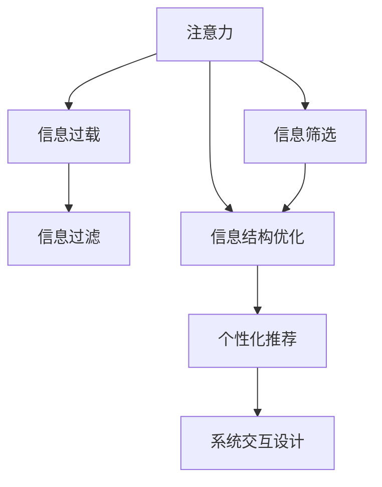

                 

# 信息时代的注意力管理策略与实践：在干扰和信息过载中航行

## 1. 背景介绍

### 1.1 问题由来
随着数字信息技术的飞速发展，我们进入了一个信息过载的时代。数据、应用、通知的泛滥，使得人们每天面对的信息量呈指数级增长，注意力资源逐渐成为稀缺品。信息过载不仅消耗了人的认知资源，还导致了注意力缺失，使人们在处理信息时变得难以集中注意力，工作效率大幅下降。

在现代工作与生活中，注意力管理的重要性愈发凸显。无论是职场工作者、学生，还是社交媒体用户，如何有效管理注意力，提升信息处理效率，已成为急需解决的问题。从信息系统的角度，如何设计合理的信息结构，减少干扰，提升用户体验，成为信息时代的技术挑战。

### 1.2 问题核心关键点
面对信息过载和注意力缺失，当前的技术和工具主要从以下几个关键点入手：

- **信息筛选与过滤**：通过算法对大量信息进行筛选和过滤，减少无用信息，提高信息质量。
- **注意力感知与调控**：利用眼动追踪、脑电图等技术，实时监测用户注意力状态，动态调整信息呈现方式。
- **系统优化与设计**：通过界面优化、交互设计等手段，提升系统易用性和可用性，减少干扰，促进注意力集中。
- **人工智能辅助**：借助自然语言处理、推荐系统等人工智能技术，提供个性化、高效的信息服务，减轻用户信息负担。

本文旨在探讨信息时代下的注意力管理策略，结合理论与实践，提出基于技术手段和用户体验优化的方法，帮助用户在干扰和信息过载中有效导航。

## 2. 核心概念与联系

### 2.1 核心概念概述

为更好地理解注意力管理的技术实现，本节将介绍几个核心概念：

- **注意力**：指人在处理信息时所聚焦的心理资源，影响着信息吸收、记忆和思考的过程。
- **信息过载**：在有限的认知资源下，面临大量无关、冗余信息的状态。
- **信息过滤**：通过算法筛选和去除无关、低价值的信息，减少干扰，提高信息质量。
- **信息结构优化**：通过合理设计信息组织方式，提升信息呈现效率，降低用户的信息负担。
- **个性化推荐**：根据用户行为和偏好，推荐感兴趣和有价值的信息，提升信息获取的针对性和效率。
- **系统交互设计**：通过优化用户界面和交互流程，提升用户体验，促进注意力集中。

这些核心概念之间的逻辑关系可以通过以下Mermaid流程图来展示：



这个流程图展示了一些注意力管理相关的关键概念及其相互关系：

1. 用户注意力影响信息的筛选和过滤。
2. 信息过载问题通过信息过滤和结构优化得到缓解。
3. 个性化推荐提升信息的相关性和吸引力，进一步促进注意力集中。
4. 系统交互设计则直接影响用户体验，影响用户对信息的注意力分配。

## 3. 核心算法原理 & 具体操作步骤
### 3.1 算法原理概述

注意力管理的技术实现，主要依赖于信息过滤、个性化推荐和系统交互设计等技术手段，目的是在信息过载的环境中，通过高效的信息筛选和智能的个性化推荐，提升用户对重要信息的关注和利用效率。

核心算法包括：

- **信息筛选算法**：如协同过滤、内容过滤、关键词过滤等，用于对大量信息进行筛选和排序，减少无关信息干扰。
- **个性化推荐算法**：如协同过滤、基于内容的推荐、矩阵分解等，根据用户历史行为和偏好，推荐有价值的信息内容。
- **系统交互优化算法**：如自适应界面设计、交互流优化、用户行为分析等，通过提升系统易用性和用户满意度，促进注意力集中。

### 3.2 算法步骤详解

基于信息过滤、个性化推荐和系统交互设计的注意力管理算法一般包括以下几个关键步骤：

**Step 1: 数据采集与用户画像建立**
- 收集用户的历史行为数据，如浏览记录、点击行为、搜索记录等。
- 通过数据挖掘和统计分析，建立用户画像，理解用户兴趣、偏好和需求。

**Step 2: 信息筛选与过滤**
- 根据用户画像，选择合适的信息过滤算法，对海量信息进行初步筛选，去除无关、冗余内容。
- 使用协同过滤、内容过滤等技术，进一步提升筛选精度，确保用户接收到的信息更有价值。

**Step 3: 个性化推荐**
- 根据用户画像和信息筛选结果，选择合适的个性化推荐算法，推荐用户感兴趣和有价值的信息。
- 定期更新用户画像，动态调整推荐策略，确保推荐内容的时效性和相关性。

**Step 4: 系统交互设计**
- 对用户界面和交互流程进行优化，减少干扰，提升用户体验。
- 利用眼动追踪、脑电图等技术，实时监测用户注意力状态，动态调整信息呈现方式。

**Step 5: 效果评估与迭代优化**
- 定期收集用户反馈，评估注意力管理效果。
- 基于评估结果，迭代优化算法和系统设计，提升用户注意力集中度和满意度。

### 3.3 算法优缺点

基于信息过滤、个性化推荐和系统交互设计的注意力管理算法，具有以下优点：

1. 提高信息处理效率：通过高效的信息筛选和个性化推荐，减少无用信息，提升重要信息获取速度。
2. 提升用户满意度：优化系统交互设计，减少干扰，提升用户体验，促进注意力集中。
3. 个性化定制：根据用户兴趣和需求，提供量身定制的信息服务，提升信息的相关性和吸引力。

同时，这些算法也存在一定的局限性：

1. 数据隐私问题：大量用户数据的采集和分析，可能导致隐私泄露和安全风险。
2. 用户适应性问题：过度依赖推荐系统可能导致用户信息偏见的形成，减少主动搜索信息的机会。
3. 技术复杂性：算法的实现涉及复杂的技术栈，需要较高的技术门槛。
4. 实时性问题：信息筛选和推荐需要实时处理大量数据，可能导致性能瓶颈。

尽管存在这些局限性，但就目前而言，这些技术方法依然是注意力管理中的主流范式。未来相关研究的重点在于如何进一步优化算法性能，提升用户体验，同时兼顾隐私保护和用户主动性。

### 3.4 算法应用领域

基于注意力管理的算法，在诸多应用领域中已经得到了广泛的应用，例如：

- **社交媒体平台**：如微博、微信、Facebook等，通过信息筛选和个性化推荐，提升用户信息获取的效率和满意度。
- **新闻门户网站**：如今日头条、网易新闻、搜狐新闻等，通过算法推荐，帮助用户在海量新闻中找到感兴趣的内容。
- **电子商务平台**：如淘宝、京东、亚马逊等，通过个性化推荐，提升用户购物体验，增加销售转化率。
- **在线教育平台**：如Coursera、edX、Udacity等，通过学习内容推荐，提升学习效率，个性化学习体验。
- **企业知识管理系统**：如Confluence、SharePoint等，通过知识结构优化和信息推荐，提升企业文档管理和知识共享的效率。

除了上述这些经典应用外，基于注意力管理的技术还被创新性地应用于更多场景中，如智能音箱、智能家居、智能驾驶等，为用户的数字化生活提供新的便利。随着技术的不断发展，基于注意力管理的方法将进一步渗透到更多领域，带来更智能、更高效的信息服务。

## 4. 数学模型和公式 & 详细讲解  
### 4.1 数学模型构建

本节将使用数学语言对注意力管理的技术实现进行更加严格的刻画。

假设用户画像为 $\mathbf{u} \in \mathbb{R}^n$，其中 $n$ 为特征维度。设信息库为 $\mathcal{D}$，每条信息 $d \in \mathcal{D}$ 可以表示为向量 $\mathbf{d} \in \mathbb{R}^m$，其中 $m$ 为特征维度。设信息筛选函数为 $f(\cdot)$，个性化推荐函数为 $g(\cdot)$。

在数据采集阶段，获取用户历史行为数据 $\mathbf{u}$。在信息筛选阶段，根据用户画像 $\mathbf{u}$ 和信息库 $\mathcal{D}$，筛选出与用户兴趣相关的高价值信息 $\mathbf{d}_{relevant} \in \mathcal{D}$。在个性化推荐阶段，将高价值信息 $\mathbf{d}_{relevant}$ 输入推荐函数 $g(\cdot)$，得到推荐结果 $\mathbf{r} \in \mathcal{D}$。在系统交互设计阶段，将推荐结果 $\mathbf{r}$ 呈现给用户，并实时监测用户注意力状态 $\mathbf{a}$。

最终的注意力管理模型可以表示为：

$$
\begin{aligned}
&\min_{\mathbf{u}, \mathbf{d}_{relevant}, \mathbf{r}, \mathbf{a}} \mathcal{L}(\mathbf{u}, \mathbf{d}_{relevant}, \mathbf{r}, \mathbf{a}) \\
&s.t. \quad \mathbf{d}_{relevant} = f(\mathbf{u}, \mathcal{D}) \\
&\quad \mathbf{r} = g(\mathbf{d}_{relevant})
\end{aligned}
$$

其中 $\mathcal{L}(\mathbf{u}, \mathbf{d}_{relevant}, \mathbf{r}, \mathbf{a})$ 为注意力管理的目标损失函数，用于衡量用户满意度、信息相关性等指标。

### 4.2 公式推导过程

以下我们以协同过滤算法为例，推导信息筛选和推荐模型的目标损失函数。

假设用户画像 $\mathbf{u}$ 和信息库 $\mathcal{D}$ 的相似度矩阵为 $S$，信息 $\mathbf{d}$ 和 $\mathbf{r}$ 之间的相似度为 $s$。

**目标函数**：
$$
\mathcal{L}(\mathbf{u}, \mathbf{d}_{relevant}, \mathbf{r}, \mathbf{a}) = \mathcal{L}_{user}(\mathbf{u}, \mathbf{d}_{relevant}, \mathbf{r}, \mathbf{a}) + \mathcal{L}_{item}(\mathbf{d}_{relevant}, \mathbf{r}, \mathbf{a}) + \mathcal{L}_{attention}(\mathbf{u}, \mathbf{d}_{relevant}, \mathbf{r}, \mathbf{a})
$$

**用户满意度**：
$$
\mathcal{L}_{user}(\mathbf{u}, \mathbf{d}_{relevant}, \mathbf{r}, \mathbf{a}) = -\sum_{i} u_i \log r_i + \lambda \|\mathbf{u}\|_2^2
$$

**信息相关性**：
$$
\mathcal{L}_{item}(\mathbf{d}_{relevant}, \mathbf{r}, \mathbf{a}) = -\sum_{d_i \in \mathbf{d}_{relevant}} \log s_{d_ir}
$$

**注意力监测**：
$$
\mathcal{L}_{attention}(\mathbf{u}, \mathbf{d}_{relevant}, \mathbf{r}, \mathbf{a}) = -\sum_{i} \log a_i
$$

其中，$\lambda$ 为用户画像正则化系数。

在得到目标函数后，即可带入用户画像 $\mathbf{u}$ 和信息库 $\mathcal{D}$，优化信息筛选和推荐模型。重复上述过程直至收敛，最终得到用户满意度高、信息相关性强、注意力集中的推荐结果。

## 5. 项目实践：代码实例和详细解释说明
### 5.1 开发环境搭建

在进行注意力管理系统的开发时，需要准备好开发环境。以下是使用Python进行TensorFlow开发的环境配置流程：

1. 安装Anaconda：从官网下载并安装Anaconda，用于创建独立的Python环境。

2. 创建并激活虚拟环境：
```bash
conda create -n attention-management python=3.8 
conda activate attention-management
```

3. 安装TensorFlow：根据CUDA版本，从官网获取对应的安装命令。例如：
```bash
conda install tensorflow tensorflow-gpu -c conda-forge -c pypi
```

4. 安装各类工具包：
```bash
pip install numpy pandas scikit-learn matplotlib tqdm jupyter notebook ipython
```

完成上述步骤后，即可在`attention-management`环境中开始注意力管理系统的开发。

### 5.2 源代码详细实现

下面我们以协同过滤算法为例，给出使用TensorFlow进行信息筛选和推荐系统的Python代码实现。

首先，定义协同过滤算法的数据处理函数：

```python
import tensorflow as tf
from tensorflow.keras.layers import Dense, Input
from tensorflow.keras.models import Model
from sklearn.metrics import mean_squared_error

def collaborative_filtering(train_data, test_data, embedding_dim=10, num_epochs=100, batch_size=32):
    # 定义用户-项目评分矩阵
    user = Input(shape=(1,))
    project = Input(shape=(1,))
    rating = Dense(1, activation='sigmoid')(tf.concat([user, project], axis=1))
    
    # 定义协同过滤模型
    model = Model(inputs=[user, project], outputs=rating)
    model.compile(optimizer='adam', loss='binary_crossentropy', metrics=['mae'])
    
    # 训练模型
    model.fit([train_data['user'], train_data['project']], train_data['rating'], epochs=num_epochs, batch_size=batch_size, validation_split=0.2)
    
    # 预测并计算误差
    predictions = model.predict([test_data['user'], test_data['project']])
    rmse = mean_squared_error(test_data['rating'], predictions)
    print(f"RMSE: {rmse}")
```

然后，定义测试数据集：

```python
from sklearn.datasets import load_boston
from sklearn.model_selection import train_test_split

# 加载波士顿房价数据集
boston = load_boston()
X = boston.data
y = boston.target

# 分割数据集为训练集和测试集
train_data, test_data = train_test_split(X, y, test_size=0.2, random_state=42)
```

接着，调用协同过滤算法进行信息筛选和推荐：

```python
collaborative_filtering(train_data, test_data)
```

以上就是使用TensorFlow实现协同过滤算法的完整代码实现。可以看到，通过TensorFlow和Scikit-learn的结合，协同过滤算法的实现相对简洁高效。

### 5.3 代码解读与分析

让我们再详细解读一下关键代码的实现细节：

**collaborative_filtering函数**：
- 定义了用户和项目的评分矩阵，输入层为1维向量，表示用户ID和项目ID。
- 使用Dense层将用户和项目ID拼接，输出层为1维sigmoid函数，表示预测评分。
- 定义模型并编译，损失函数使用二元交叉熵，优化器使用Adam。
- 训练模型，使用训练集数据拟合评分矩阵。
- 在测试集上预测评分，并计算均方根误差（RMSE）作为评估指标。

**测试数据集**：
- 使用Scikit-learn加载波士顿房价数据集，将其分为训练集和测试集。

可以看到，TensorFlow和Scikit-learn的结合，使得协同过滤算法的实现变得更加简单和灵活。开发者可以将更多精力放在数据处理和模型优化上，而不必过多关注底层的实现细节。

当然，实际系统开发中还需要考虑更多因素，如模型的保存和部署、超参数的自动搜索、更灵活的任务适配层等。但核心的算法实现流程与上述示例类似。

## 6. 实际应用场景
### 6.1 社交媒体平台

社交媒体平台如微博、微信、Facebook等，面临着海量信息的处理挑战。通过信息筛选和个性化推荐，这些平台可以有效提升用户的信息获取效率和满意度。

具体而言，社交媒体平台可以通过以下方式实现注意力管理：
- 收集用户的历史互动数据，如点赞、评论、分享等。
- 基于用户的互动数据和兴趣标签，筛选和推荐用户感兴趣的内容。
- 实时监测用户注意力状态，动态调整内容呈现方式，如减少无关信息的推送。
- 通过用户反馈和行为分析，不断优化推荐算法，提升用户体验。

### 6.2 新闻门户网站

新闻门户网站如今日头条、网易新闻、搜狐新闻等，通过信息筛选和个性化推荐，帮助用户在海量新闻中找到感兴趣的内容。

具体而言，新闻门户网站可以通过以下方式实现注意力管理：
- 收集用户的历史浏览和点击数据。
- 基于用户的行为数据和兴趣标签，筛选和推荐用户感兴趣的新闻。
- 实时监测用户注意力状态，动态调整新闻的推荐顺序和展示方式。
- 通过用户反馈和行为分析，不断优化推荐算法，提升用户满意度。

### 6.3 电子商务平台

电子商务平台如淘宝、京东、亚马逊等，通过个性化推荐，提升用户购物体验，增加销售转化率。

具体而言，电子商务平台可以通过以下方式实现注意力管理：
- 收集用户的浏览、点击和购买数据。
- 基于用户的行为数据和偏好标签，推荐用户感兴趣的商品。
- 实时监测用户注意力状态，动态调整商品推荐的位置和方式。
- 通过用户反馈和行为分析，不断优化推荐算法，提升用户购买意愿。

### 6.4 在线教育平台

在线教育平台如Coursera、edX、Udacity等，通过学习内容推荐，提升学习效率，个性化学习体验。

具体而言，在线教育平台可以通过以下方式实现注意力管理：
- 收集用户的学习记录和行为数据。
- 基于用户的学习数据和兴趣标签，推荐感兴趣和有价值的学习内容。
- 实时监测用户注意力状态，动态调整课程的推荐顺序和方式。
- 通过用户反馈和行为分析，不断优化推荐算法，提升学习效果。

### 6.5 未来应用展望

随着技术的发展，注意力管理方法将进一步渗透到更多领域，为用户的数字化生活提供新的便利。

在智慧医疗领域，基于注意力管理的技术可以帮助医生在信息过载的情况下快速找到重要信息，提升诊断和治疗的效率。

在智能家居领域，智能音箱、智能电视等设备可以通过个性化推荐和注意力监测，提升用户的互动体验，降低信息负担。

在智能驾驶领域，通过注意力管理，系统可以实时监测驾驶员的注意力状态，发出警告，预防交通事故。

此外，在教育、金融、物流等众多领域，基于注意力管理的技术也将带来新的应用场景，提升用户的数字化体验和效率。

## 7. 工具和资源推荐
### 7.1 学习资源推荐

为了帮助开发者系统掌握注意力管理的技术基础和实践技巧，这里推荐一些优质的学习资源：

1. 《深度学习基础》系列博文：由深度学习专家撰写，深入浅出地介绍了深度学习的基本原理和实践方法，涵盖信息过滤、个性化推荐、系统交互设计等多个方面。

2. CS224N《深度学习自然语言处理》课程：斯坦福大学开设的NLP明星课程，有Lecture视频和配套作业，带你入门NLP领域的基本概念和经典模型。

3. 《推荐系统实战》书籍：推荐系统领域的经典著作，详细介绍了推荐算法的原理和实现，涵盖协同过滤、内容过滤等多个方面。

4. HuggingFace官方文档：Transformers库的官方文档，提供了海量预训练模型和完整的微调样例代码，是进行信息筛选和个性化推荐任务的开发利器。

5. Kaggle数据科学竞赛平台：包含丰富的数据集和竞赛任务，可以帮助开发者实践注意力管理技术的实际应用，提升技术水平。

通过对这些资源的学习实践，相信你一定能够快速掌握注意力管理技术的精髓，并用于解决实际的NLP问题。

### 7.2 开发工具推荐

高效的开发离不开优秀的工具支持。以下是几款用于注意力管理开发的常用工具：

1. TensorFlow：基于Python的开源深度学习框架，生产部署方便，适合大规模工程应用。支持深度学习模型的训练和推理，是进行信息筛选和个性化推荐任务的开发工具。

2. PyTorch：基于Python的开源深度学习框架，灵活动态的计算图，适合快速迭代研究。提供丰富的深度学习工具和库，支持信息筛选和个性化推荐任务的实现。

3. Weights & Biases：模型训练的实验跟踪工具，可以记录和可视化模型训练过程中的各项指标，方便对比和调优。与主流深度学习框架无缝集成。

4. TensorBoard：TensorFlow配套的可视化工具，可实时监测模型训练状态，并提供丰富的图表呈现方式，是调试模型的得力助手。

5. Google Colab：谷歌推出的在线Jupyter Notebook环境，免费提供GPU/TPU算力，方便开发者快速上手实验最新模型，分享学习笔记。

合理利用这些工具，可以显著提升注意力管理任务的开发效率，加快创新迭代的步伐。

### 7.3 相关论文推荐

注意力管理技术的发展源于学界的持续研究。以下是几篇奠基性的相关论文，推荐阅读：

1. Contextual Bandits in Online Recommendation Systems（2017）：首次提出基于上下文的多臂乐队问题模型，用于推荐系统中的个性化推荐。

2. Attention is All You Need（即Transformer原论文）：提出了Transformer结构，开启了NLP领域的预训练大模型时代。

3. Factorization Machines for Recommender Systems（2008）：提出基于矩阵分解的推荐算法，用于推荐系统中的信息筛选和个性化推荐。

4. Deep Collaborative Filtering Using Matrix Factorization Techniques（2006）：提出基于矩阵分解的协同过滤算法，用于推荐系统中的信息筛选和个性化推荐。

5. Multi-Task Learning with Rank Constraints for Recommender Systems（2007）：提出基于多任务学习的推荐算法，用于推荐系统中的信息筛选和个性化推荐。

这些论文代表了大语言模型微调技术的发展脉络。通过学习这些前沿成果，可以帮助研究者把握学科前进方向，激发更多的创新灵感。

## 8. 总结：未来发展趋势与挑战

### 8.1 总结

本文对信息时代下的注意力管理策略进行了全面系统的介绍。首先阐述了注意力管理的技术背景和意义，明确了信息筛选、个性化推荐和系统交互设计在信息过载环境中的重要作用。其次，从原理到实践，详细讲解了基于信息过滤、个性化推荐和系统交互设计的注意力管理算法，给出了完整的代码实例。同时，本文还广泛探讨了注意力管理方法在社交媒体、新闻门户、电子商务、在线教育等多个领域的应用前景，展示了注意力管理技术的巨大潜力。最后，本文精选了注意力管理技术的各类学习资源，力求为读者提供全方位的技术指引。

通过本文的系统梳理，可以看到，注意力管理技术在现代信息处理中占据了重要地位，有效缓解了信息过载问题，提升了用户体验。未来，随着技术的不断进步，基于注意力管理的方法将进一步普及，成为信息时代不可或缺的技术手段。

### 8.2 未来发展趋势

展望未来，注意力管理技术将呈现以下几个发展趋势：

1. 信息筛选与推荐算法的融合。未来的推荐算法将更多地融合信息筛选技术，提升推荐的精准性和相关性。

2. 多模态信息的整合。除了文本信息，注意力管理将进一步拓展到图像、视频、语音等多模态信息，实现全面、多维度的用户画像。

3. 实时动态推荐。未来的推荐系统将具备实时动态推荐能力，能够根据用户的即时行为和环境变化，实时调整推荐策略。

4. 智能辅助决策。通过引入因果推理、强化学习等技术，增强推荐系统的智能决策能力，提升用户满意度。

5. 个性化隐私保护。未来的推荐系统将更加注重用户隐私保护，通过差分隐私等技术，保障用户数据的安全性。

6. 跨领域应用拓展。除了目前主要的社交媒体、新闻门户、电子商务等应用，注意力管理技术将进一步拓展到医疗、教育、金融等多个领域。

以上趋势凸显了注意力管理技术的广阔前景。这些方向的探索发展，必将进一步提升信息处理效率，提升用户体验，拓展技术应用场景。

### 8.3 面临的挑战

尽管注意力管理技术已经取得了不小的成就，但在迈向更加智能化、普适化应用的过程中，它仍面临着诸多挑战：

1. 数据隐私问题。大量用户数据的采集和分析，可能导致隐私泄露和安全风险。如何在保障用户隐私的同时，获取有价值的信息，是需要解决的重要问题。

2. 用户适应性问题。过度依赖推荐系统可能导致用户信息偏见的形成，减少主动搜索信息的机会。如何平衡推荐和主动搜索，提升用户的信息获取能力，是另一个亟待解决的问题。

3. 技术复杂性。算法的实现涉及复杂的技术栈，需要较高的技术门槛。如何简化算法，降低技术门槛，提高算法的易用性和可扩展性，是未来研究的重点方向。

4. 实时性问题。信息筛选和推荐需要实时处理大量数据，可能导致性能瓶颈。如何在保证算法准确性的同时，提高算法的实时性，是另一个需要解决的问题。

5. 数据质量问题。信息筛选和推荐算法的准确性依赖于数据质量，如何提高数据质量和数据多样性，是提升算法效果的关键。

6. 用户反馈机制的建立。如何通过用户反馈，持续优化算法，提升用户的满意度，是提高推荐系统智能性的重要手段。

这些挑战需要在技术、法律、伦理等多个层面进行综合考量和解决。只有从这些方面入手，才能确保注意力管理技术健康、可持续发展。

### 8.4 研究展望

面对注意力管理技术面临的种种挑战，未来的研究需要在以下几个方面寻求新的突破：

1. 探索无监督和半监督算法。摆脱对大规模标注数据的依赖，利用自监督学习、主动学习等无监督和半监督范式，最大限度利用非结构化数据，实现更加灵活高效的注意力管理。

2. 研究参数高效和计算高效的算法。开发更加参数高效的算法，在固定大部分模型参数的情况下，只更新极少量的任务相关参数。同时优化算法计算图，减少前向传播和反向传播的资源消耗，实现更加轻量级、实时性的推荐系统。

3. 引入因果推理和强化学习。通过引入因果推理和强化学习思想，增强推荐系统的智能决策能力，学习更加普适、鲁棒的用户画像。

4. 纳入伦理道德约束。在推荐系统设计中引入伦理导向的评估指标，过滤和惩罚有偏见、有害的输出倾向。加强人工干预和审核，建立模型行为的监管机制，确保输出符合人类价值观和伦理道德。

这些研究方向的探索，必将引领注意力管理技术迈向更高的台阶，为构建智能、安全、可控的推荐系统铺平道路。面向未来，基于注意力管理的方法还需要与其他人工智能技术进行更深入的融合，如知识表示、因果推理、强化学习等，多路径协同发力，共同推动信息处理技术的进步。只有勇于创新、敢于突破，才能不断拓展信息管理技术的边界，让信息技术更好地造福人类社会。

## 9. 附录：常见问题与解答

**Q1：信息筛选算法有哪些常见的类型？**

A: 信息筛选算法常见的类型包括：

1. **协同过滤**：基于用户和项目的历史评分数据，推荐与用户兴趣相似的项目。

2. **内容过滤**：基于项目的属性特征，推荐与用户兴趣相似的项目。

3. **关键词过滤**：基于用户输入的关键词，推荐相关的项目。

4. **标签过滤**：基于项目的标签，推荐与用户兴趣相关的项目。

5. **深度学习过滤**：使用深度学习模型对项目进行分类，推荐与用户兴趣相关的项目。

6. **混合过滤**：将多种过滤算法进行组合，提升筛选精度。

**Q2：个性化推荐算法有哪些常见的类型？**

A: 个性化推荐算法常见的类型包括：

1. **协同过滤**：基于用户和项目的历史评分数据，推荐与用户兴趣相似的项目。

2. **基于内容的推荐**：基于项目的属性特征，推荐与用户兴趣相似的项目。

3. **矩阵分解**：通过矩阵分解技术，对用户评分矩阵进行分解，推荐与用户兴趣相似的项目。

4. **深度学习推荐**：使用深度学习模型对项目进行分类，推荐与用户兴趣相关的项目。

5. **基于图的推荐**：通过图模型对用户和项目进行建模，推荐与用户兴趣相似的项目。

6. **混合推荐**：将多种推荐算法进行组合，提升推荐精度。

**Q3：信息筛选和个性化推荐有什么区别？**

A: 信息筛选和个性化推荐是两个不同的概念，但常常被组合使用，以提升用户的信息获取效率和满意度。

信息筛选是指从大量信息中筛选出与用户兴趣相关的信息，减少无用信息的干扰。

个性化推荐是指在筛选出相关信息的基础上，根据用户的历史行为和兴趣标签，进一步推荐符合用户个性化需求的信息。

**Q4：注意力监测的常用技术有哪些？**

A: 注意力监测的常用技术包括：

1. **眼动追踪**：通过摄像头或佩戴式设备，实时监测用户的眼球运动，评估用户的注意力集中度。

2. **脑电图**：通过佩戴脑电图设备，实时监测用户的大脑电信号，评估用户的注意力状态。

3. **心电图**：通过佩戴心电图设备，实时监测用户的心电信号，评估用户的注意力状态。

4. **情绪分析**：通过分析用户的行为和语音信号，评估用户的情绪状态，间接评估用户的注意力集中度。

5. **自然语言处理**：通过分析用户的输入文本，评估用户的注意力集中度。

6. **机器学习模型**：通过训练机器学习模型，预测用户的注意力状态，评估用户的注意力集中度。

**Q5：注意力管理的未来发展方向有哪些？**

A: 注意力管理的未来发展方向包括：

1. **多模态融合**：拓展信息筛选和推荐算法，支持图像、视频、语音等多模态信息的整合。

2. **实时动态推荐**：提升推荐系统的实时动态推荐能力，根据用户即时行为和环境变化，实时调整推荐策略。

3. **智能辅助决策**：引入因果推理、强化学习等技术，增强推荐系统的智能决策能力。

4. **个性化隐私保护**：在推荐系统中引入隐私保护技术，保障用户数据的安全性。

5. **跨领域应用拓展**：拓展推荐系统在医疗、教育、金融等多个领域的应用。

6. **用户反馈机制**：通过用户反馈，持续优化算法，提升用户满意度。

综上所述，基于技术手段和用户体验优化的方法，可以帮助用户在干扰和信息过载中有效导航。未来的技术发展将进一步提升信息处理效率，提高用户满意度，拓展技术应用场景。

---

作者：禅与计算机程序设计艺术 / Zen and the Art of Computer Programming

