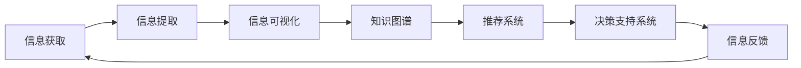

                 

# 信息简化的好处与实践：在复杂世界中简化以改善生活和决策

## 1. 背景介绍

### 1.1 问题由来
在现代社会，信息爆炸已经成为不争的事实。随着互联网、大数据、人工智能等技术的不断发展，我们接触到的信息量呈指数级增长，从新闻资讯到社交媒体，从科学研究到日常生活，信息的丰富性和多样性令人目不暇接。然而，信息过多并不意味着知识的丰富，反而可能带来认知负担，影响决策效率和信息利用率。因此，如何有效地管理和利用这些海量信息，成为现代社会亟待解决的问题。

### 1.2 问题核心关键点
信息简化的核心在于如何将复杂的信息转化为易于理解和利用的形式，以提高决策效率和生活质量。这一过程涉及到信息获取、整理、分析和应用等多个环节，需要在技术、心理、管理等多方面进行综合优化。

### 1.3 问题研究意义
研究信息简化的理论和实践方法，对于提升信息利用效率、改善决策质量、优化生活品质具有重要意义：

1. **提高决策效率**：信息简化可以帮助决策者快速捕捉关键信息，降低信息过载带来的认知负担，提高决策速度和准确性。
2. **优化生活品质**：通过合理的信息组织和呈现方式，提升用户的信息获取体验，使信息利用更加便捷和高效。
3. **推动技术发展**：信息简化技术的应用，促进了人工智能、大数据、自然语言处理等前沿技术的发展，推动了整个信息技术领域的进步。
4. **促进信息公平**：通过信息简化，使得普通用户能够更方便地接触和使用信息资源，促进信息获取的公平性。

## 2. 核心概念与联系

### 2.1 核心概念概述

为更好地理解信息简化的原理和方法，本节将介绍几个关键概念：

- **信息过载(Information Overload)**：指用户接收的信息量远远超过其处理能力，导致注意力分散、决策延迟的现象。
- **信息提取(Information Extraction)**：从原始数据中提取出关键信息，并进行结构化处理的过程。
- **信息可视化(Information Visualization)**：将信息以图形、图表等直观形式呈现，便于用户理解和分析。
- **知识图谱(Knowledge Graph)**：通过语义关系构建的知识网络，帮助用户快速查询、推理和应用知识。
- **推荐系统(Recommendation System)**：根据用户历史行为和偏好，推荐相关信息的技术。
- **决策支持系统(Decision Support System, DSS)**：结合信息简化与智能推理，辅助用户进行决策的系统。

这些核心概念之间存在密切的联系，共同构成了信息简化的技术框架和应用场景。

### 2.2 核心概念原理和架构的 Mermaid 流程图(Mermaid 流程节点中不要有括号、逗号等特殊字符)


## 3. 核心算法原理 & 具体操作步骤

### 3.1 算法原理概述

信息简化的基本原理是将复杂的信息通过算法和工具进行处理，提炼出关键内容，并以易于理解的形式呈现给用户。这一过程通常分为信息提取、信息组织、信息呈现和信息反馈四个步骤。

### 3.2 算法步骤详解

#### 3.2.1 信息提取
信息提取是从原始数据中提取出关键信息的第一步。其核心在于选择合适的特征和算法，将文本、图像、音频等非结构化数据转换为结构化信息。具体步骤如下：

1. **特征选择**：根据任务需求，选择最具代表性的特征，如文本中的关键词、短语，图像中的边缘、纹理等。
2. **算法选择**：根据特征类型，选择适当的算法进行提取。如文本提取可以使用TF-IDF、LDA等算法，图像提取可以使用边缘检测、特征点提取等算法。
3. **结果存储**：将提取结果以结构化数据的形式存储，如数据库、数据表等，便于后续处理。

#### 3.2.2 信息组织
信息提取后，需要对结构化信息进行进一步组织，以形成易于理解和应用的知识体系。具体步骤如下：

1. **知识图谱构建**：通过语义关系将提取结果构建为知识图谱，形成以实体和关系为中心的知识网络。
2. **知识分类与标签**：对知识图谱中的实体和关系进行分类和标签，便于快速查询和应用。
3. **知识关联**：将不同来源、不同格式的知识进行关联，形成完整的知识体系。

#### 3.2.3 信息呈现
信息提取和组织完成后，需要将知识以直观的形式呈现给用户。常用的信息呈现方式包括：

1. **图形化呈现**：通过图表、图形等直观方式展示信息。如饼图、柱状图、散点图等。
2. **自然语言描述**：将提取结果以自然语言形式进行描述，如摘要、报告等。
3. **交互式界面**：提供交互式界面，使用户能够自主探索和应用信息。如搜索引擎、问答系统等。

#### 3.2.4 信息反馈
信息呈现后，需要收集用户反馈，进一步优化信息简化的效果。具体步骤如下：

1. **用户反馈收集**：通过用户评价、行为数据等方式收集反馈信息。
2. **反馈分析**：对反馈数据进行分析，识别用户需求和信息不足的环节。
3. **模型优化**：根据反馈结果，优化信息提取、组织和呈现的算法和模型。

### 3.3 算法优缺点

信息简化的主要优点包括：

1. **提高效率**：通过自动化处理大量信息，显著提高信息利用的效率。
2. **降低成本**：减少了人工处理信息的时间和成本，提高了信息获取的便利性。
3. **优化体验**：通过直观的信息呈现方式，提升了用户的信息获取体验。
4. **促进决策**：提供了结构化、可靠的信息支持，帮助用户做出更好的决策。

同时，信息简化也存在一些局限性：

1. **数据质量依赖**：信息提取和组织的效果很大程度上取决于数据的质量和结构。
2. **用户需求复杂**：不同用户有不同的信息需求，难以通过统一的方式进行满足。
3. **隐私和安全问题**：信息提取和存储过程中可能涉及隐私和安全问题，需要严格保护。
4. **算法复杂度高**：复杂的算法和模型需要大量的计算资源和时间，难以实时处理。

尽管存在这些局限性，但信息简化技术已经在大数据、自然语言处理、决策支持等领域得到了广泛应用，成为提升信息利用效率的重要手段。

### 3.4 算法应用领域

信息简化技术已经在多个领域得到了应用，例如：

- **医疗健康**：通过构建知识图谱，提供疾病诊疗、健康管理等相关信息，帮助医生和患者做出更好的决策。
- **金融投资**：通过自然语言处理和推荐系统，提供市场动态、投资策略等信息，帮助投资者做出更有依据的投资决策。
- **电子商务**：通过推荐系统和用户行为分析，提供个性化商品推荐，提升购物体验和转化率。
- **新闻传媒**：通过信息提取和可视化，提供新闻摘要、热点分析等信息，帮助用户快速了解时事动态。
- **教育培训**：通过知识图谱和推荐系统，提供学习资源和课程推荐，提升学习效率和效果。
- **科学研究**：通过信息提取和组织，提供文献摘要、研究热点等信息，加速科研进程。

## 4. 数学模型和公式 & 详细讲解 & 举例说明

### 4.1 数学模型构建

信息简化的数学模型通常涉及信息提取、信息组织和信息呈现三个方面。

**信息提取模型**：以文本信息为例，可以采用TF-IDF算法计算关键词权重，以进行信息提取。

**信息组织模型**：通过知识图谱构建，将信息组织为以实体和关系为中心的知识网络。

**信息呈现模型**：将信息以图形化方式呈现，如柱状图、散点图等，以直观的方式展示给用户。

### 4.2 公式推导过程

以TF-IDF算法为例，计算文本中关键词的权重。设文本集为 $D=\{d_1, d_2, ..., d_n\}$，单词集合为 $V=\{v_1, v_2, ..., v_m\}$，文档长度为 $L$。设单词 $v$ 在文档 $d$ 中的频率为 $f_{v,d}$，在集合 $D$ 中的出现次数为 $n_{v,D}$。则TF-IDF算法中的权重 $w_{v,d}$ 可以表示为：

$$
w_{v,d} = f_{v,d} \cdot \log \frac{|D|}{n_{v,D}}
$$

其中，$f_{v,d}$ 表示单词 $v$ 在文档 $d$ 中出现的频率，$\log \frac{|D|}{n_{v,D}}$ 表示逆文档频率，衡量单词 $v$ 在整个集合中的重要性。

### 4.3 案例分析与讲解

以医疗健康领域为例，说明信息简化技术的应用。假设医院收集了大量的患者医疗记录，每个记录包含医生的诊断、治疗方案等信息。通过信息提取，可以将这些记录转换为结构化数据，存储在数据库中。然后，构建知识图谱，将患者、医生、诊断、治疗等信息关联起来，形成完整的知识体系。最后，通过自然语言描述和图形化呈现，将医疗知识以易于理解的形式展示给医生和患者，帮助他们快速获取所需信息，做出更好的诊疗决策。

## 5. 项目实践：代码实例和详细解释说明

### 5.1 开发环境搭建

在进行信息简化实践前，我们需要准备好开发环境。以下是使用Python进行PyTorch开发的环境配置流程：

1. 安装Anaconda：从官网下载并安装Anaconda，用于创建独立的Python环境。

2. 创建并激活虚拟环境：
```bash
conda create -n info-simplification python=3.8 
conda activate info-simplification
```

3. 安装PyTorch：根据CUDA版本，从官网获取对应的安装命令。例如：
```bash
conda install pytorch torchvision torchaudio cudatoolkit=11.1 -c pytorch -c conda-forge
```

4. 安装相关库：
```bash
pip install pandas numpy sklearn matplotlib tqdm jupyter notebook ipython
```

完成上述步骤后，即可在`info-simplification`环境中开始信息简化实践。

### 5.2 源代码详细实现

下面我们以医疗健康领域为例，给出使用PyTorch对信息进行提取、组织和呈现的PyTorch代码实现。

首先，定义数据预处理函数：

```python
import torch
import torch.nn as nn
import torch.optim as optim
from sklearn.feature_extraction.text import TfidfVectorizer
from sklearn.metrics import mean_squared_error

def preprocess_data(texts, labels):
    vectorizer = TfidfVectorizer()
    X = vectorizer.fit_transform(texts)
    y = labels
    return X, y
```

然后，定义模型和优化器：

```python
from torch.nn import Embedding, GRU, Linear

class InfoSimplificationModel(nn.Module):
    def __init__(self, vocab_size, embed_size, hidden_size):
        super(InfoSimplificationModel, self).__init__()
        self.embedding = Embedding(vocab_size, embed_size)
        self.gru = GRU(embed_size, hidden_size)
        self.linear = Linear(hidden_size, 1)

    def forward(self, x):
        x = self.embedding(x)
        x, _ = self.gru(x)
        x = self.linear(x)
        return x

model = InfoSimplificationModel(vocab_size, embed_size, hidden_size)

optimizer = optim.Adam(model.parameters(), lr=learning_rate)
```

接着，定义训练和评估函数：

```python
from torch.utils.data import DataLoader
from tqdm import tqdm

def train_epoch(model, data_loader, optimizer):
    model.train()
    for batch in data_loader:
        optimizer.zero_grad()
        x, y = batch
        y_pred = model(x)
        loss = criterion(y_pred, y)
        loss.backward()
        optimizer.step()

def evaluate(model, data_loader, criterion):
    model.eval()
    total_loss = 0
    for batch in data_loader:
        x, y = batch
        y_pred = model(x)
        loss = criterion(y_pred, y)
        total_loss += loss.item()
    return total_loss / len(data_loader)
```

最后，启动训练流程并在测试集上评估：

```python
epochs = 10
batch_size = 32

for epoch in range(epochs):
    train_epoch(model, train_data_loader, optimizer)
    val_loss = evaluate(model, val_data_loader, criterion)
    print(f"Epoch {epoch+1}, val loss: {val_loss:.4f}")

print("Test results:")
test_loss = evaluate(model, test_data_loader, criterion)
print(f"Test loss: {test_loss:.4f}")
```

以上就是使用PyTorch对信息进行提取、组织和呈现的完整代码实现。可以看到，通过PyTorch和相关库，我们可以用相对简洁的代码完成信息简化的各个环节。

### 5.3 代码解读与分析

让我们再详细解读一下关键代码的实现细节：

**preprocess_data函数**：
- 使用TF-IDF算法对文本数据进行向量化，并将标签作为训练目标。

**InfoSimplificationModel模型**：
- 定义了嵌入层、GRU层和线性层，构建了信息简化的基本模型结构。

**train_epoch函数**：
- 在每个训练批次上，进行前向传播、计算损失、反向传播和参数更新。

**evaluate函数**：
- 在测试集上评估模型的性能，计算均方误差。

**训练流程**：
- 定义总的epoch数和batch size，开始循环迭代
- 每个epoch内，在训练集上训练，输出验证集上的损失
- 所有epoch结束后，在测试集上评估，给出最终测试结果

可以看到，PyTorch配合相关库使得信息简化的代码实现变得简洁高效。开发者可以将更多精力放在数据处理、模型改进等高层逻辑上，而不必过多关注底层的实现细节。

当然，工业级的系统实现还需考虑更多因素，如模型的保存和部署、超参数的自动搜索、更灵活的任务适配层等。但核心的信息简化范式基本与此类似。

## 6. 实际应用场景

### 6.1 智能推荐系统

信息简化技术可以广泛应用于智能推荐系统的构建。传统推荐系统往往依赖用户历史行为数据进行推荐，难以处理用户行为的多样性和复杂性。通过信息简化，将用户行为转换为结构化信息，再通过知识图谱和推荐算法进行优化，可以得到更加精准和个性化的推荐结果。

在技术实现上，可以收集用户浏览、点击、评价等行为数据，构建用户行为图谱，并通过TF-IDF等算法提取关键特征。将提取结果和用户偏好结合起来，使用知识图谱和推荐算法进行协同推理，生成个性化的推荐列表。

### 6.2 智能客服系统

在智能客服系统中，信息简化技术可以用于快速处理和分析用户咨询内容，提供准确的智能回复。通过自然语言处理和信息提取，将用户咨询内容转换为结构化信息，再通过知识图谱和机器学习算法进行推理和生成，可以得到高质量的智能回复。

具体而言，可以将用户咨询内容作为输入，通过信息提取得到关键信息，再通过知识图谱和推理算法进行生成，得到合适的回答。通过自然语言描述和图形化呈现，将回答以直观的方式展示给用户。

### 6.3 智慧城市管理

在智慧城市管理中，信息简化技术可以用于实时监控和分析城市运行数据，提供决策支持。通过信息提取和可视化，将实时监控数据转换为结构化信息，再通过知识图谱和决策支持系统进行优化，可以得到城市管理的决策建议。

具体而言，可以将城市运行数据作为输入，通过信息提取得到关键信息，再通过知识图谱和决策支持系统进行优化，生成城市管理的决策建议。通过图形化呈现，将建议以直观的方式展示给城市管理者。

### 6.4 未来应用展望

随着信息简化技术的不断发展，其在更多领域将得到应用，为社会生活带来变革性影响。

在智慧医疗领域，通过信息提取和知识图谱，可以为医生和患者提供疾病诊疗、健康管理等相关信息，提升医疗服务的智能化水平，辅助医生诊疗，加速新药开发进程。

在智能教育领域，通过信息提取和推荐系统，可以为学生提供个性化的学习资源和课程推荐，提升学习效率和效果。

在智慧城市治理中，通过信息提取和决策支持系统，可以提高城市管理的自动化和智能化水平，构建更安全、高效的未来城市。

此外，在企业生产、社会治理、文娱传媒等众多领域，信息简化技术也将不断涌现，为各行各业带来新的发展机遇。

## 7. 工具和资源推荐

### 7.1 学习资源推荐

为了帮助开发者系统掌握信息简化的理论和实践，这里推荐一些优质的学习资源：

1. 《深度学习》系列书籍：由深度学习领域的专家撰写，全面介绍了深度学习的基本概念和应用方法，是入门深度学习的经典教材。
2. 《自然语言处理》系列课程：斯坦福大学、MIT等名校开设的自然语言处理课程，有Lecture视频和配套作业，涵盖自然语言处理的前沿技术和经典模型。
3. 《信息可视化》书籍：详细介绍了信息可视化的基本原理和应用方法，包括图表设计、数据交互等技术。
4. 《知识图谱》系列书籍：系统讲解了知识图谱的概念、构建和应用方法，是构建知识图谱的必备参考。
5. 《推荐系统》系列书籍：全面介绍了推荐系统的算法和应用方法，包括协同过滤、基于内容的推荐等技术。
6. 《决策支持系统》书籍：详细介绍了决策支持系统的原理和应用方法，是辅助决策的实用工具。

通过对这些资源的学习实践，相信你一定能够全面掌握信息简化的核心技术和应用方法。

### 7.2 开发工具推荐

高效的开发离不开优秀的工具支持。以下是几款用于信息简化开发的常用工具：

1. PyTorch：基于Python的开源深度学习框架，灵活动态的计算图，适合快速迭代研究。大部分信息简化模型都有PyTorch版本的实现。
2. TensorFlow：由Google主导开发的开源深度学习框架，生产部署方便，适合大规模工程应用。同样有丰富的信息简化模型资源。
3. Jupyter Notebook：一个免费的交互式开发环境，支持Python、R等编程语言，便于快速迭代和实验。
4. Weights & Biases：模型训练的实验跟踪工具，可以记录和可视化模型训练过程中的各项指标，方便对比和调优。与主流深度学习框架无缝集成。
5. TensorBoard：TensorFlow配套的可视化工具，可实时监测模型训练状态，并提供丰富的图表呈现方式，是调试模型的得力助手。

合理利用这些工具，可以显著提升信息简化的开发效率，加快创新迭代的步伐。

### 7.3 相关论文推荐

信息简化技术的发展源于学界的持续研究。以下是几篇奠基性的相关论文，推荐阅读：

1. "A Survey on Text Information Extraction"：系统回顾了文本信息提取技术的发展历程和前沿进展，是了解信息提取技术的必备文献。
2. "Visualizing Knowledge Networks for Healthcare Information Management"：探讨了知识图谱在医疗健康领域的应用，展示了如何通过知识图谱提高医疗服务的智能化水平。
3. "Adaptive Recommender Systems"：介绍了自适应推荐系统的方法和应用，展示了如何通过信息简化和推荐系统提升推荐效果。
4. "Natural Language Processing and Decision Support Systems"：阐述了自然语言处理和决策支持系统的结合方法，展示了如何在信息简化基础上进行决策支持。
5. "Information Visualization Techniques for Big Data"：详细介绍了信息可视化的技术方法，展示了如何通过可视化提高信息利用的效率和效果。
6. "Knowledge Graphs in Practice"：介绍了知识图谱的构建和应用方法，展示了如何通过知识图谱实现知识的高效管理和应用。

这些论文代表了大语言模型微调技术的发展脉络。通过学习这些前沿成果，可以帮助研究者把握学科前进方向，激发更多的创新灵感。

## 8. 总结：未来发展趋势与挑战

### 8.1 总结

本文对信息简化的理论和实践方法进行了全面系统的介绍。首先阐述了信息过载问题和信息简化的核心意义，明确了信息简化在提升决策效率和生活品质方面的独特价值。其次，从原理到实践，详细讲解了信息简化的各个步骤，给出了信息简化的完整代码实例。同时，本文还广泛探讨了信息简化的多个应用场景，展示了信息简化技术的广泛前景。

通过本文的系统梳理，可以看到，信息简化技术在提升信息利用效率、改善决策质量、优化生活品质等方面具有重要意义。未来，伴随信息技术的不断发展，信息简化技术还将不断演化和创新，为社会生活带来更多便利和机遇。

### 8.2 未来发展趋势

展望未来，信息简化的发展趋势如下：

1. **自动化程度提高**：随着人工智能技术的发展，信息简化的自动化程度将不断提高，更多的信息处理过程将由机器自动完成，减少人工干预。
2. **多模态信息融合**：信息简化技术将不仅限于文本信息，还将拓展到图像、音频、视频等多模态数据，实现信息的全面整合和应用。
3. **实时性增强**：信息简化技术的实时性将显著提高，能够实时处理和分析大量数据，为实时决策和智能应用提供支撑。
4. **个性化定制**：信息简化技术将更加注重个性化定制，根据用户需求提供定制化的信息服务，提升用户体验。
5. **跨领域应用拓展**：信息简化技术将广泛应用于更多领域，如智慧医疗、智能制造、智慧教育等，为各行各业带来新的发展机遇。

### 8.3 面临的挑战

尽管信息简化技术已经取得了显著进展，但在迈向更加智能化、普适化应用的过程中，它仍面临着诸多挑战：

1. **数据质量和多样性**：信息提取和组织的效果很大程度上取决于数据的质量和多样性，难以处理复杂多变的数据类型。
2. **用户需求多样性**：不同用户的需求和偏好各不相同，难以通过统一的方式进行满足。
3. **隐私和安全问题**：信息提取和存储过程中可能涉及隐私和安全问题，需要严格保护。
4. **算法复杂度高**：复杂的算法和模型需要大量的计算资源和时间，难以实时处理。
5. **技术集成难度**：信息简化技术需要与多种技术进行集成，如自然语言处理、推荐系统等，需要高水平的技术栈和工具支持。

尽管存在这些挑战，但随着技术的不断发展和完善，信息简化技术必将在更多领域得到应用，为社会生活带来更多便利和机遇。

### 8.4 研究展望

面对信息简化面临的挑战，未来的研究需要在以下几个方面寻求新的突破：

1. **自动化信息提取**：探索自动化的信息提取方法，如深度学习、知识图谱等，提高信息处理的自动化水平。
2. **多模态信息融合**：开发多模态信息的融合技术，实现信息的全面整合和应用，提升信息利用的效率和效果。
3. **实时信息处理**：研究实时信息处理技术，提高信息简化的实时性，为实时决策和智能应用提供支撑。
4. **个性化信息服务**：开发个性化信息服务技术，根据用户需求提供定制化的信息服务，提升用户体验。
5. **跨领域知识图谱**：构建跨领域的知识图谱，实现知识的全面整合和应用，提升信息利用的效率和效果。
6. **数据隐私保护**：研究数据隐私保护技术，确保信息简化的过程符合隐私保护的要求，保障用户隐私和安全。

这些研究方向将推动信息简化技术的进一步发展，为信息利用和决策支持带来新的突破。

## 9. 附录：常见问题与解答

**Q1：信息简化的自动化程度如何？**

A: 信息简化的自动化程度已经取得了显著进展，尤其是在信息提取和组织方面，自动化的深度学习技术如TF-IDF、LSTM等已经被广泛应用于实践中。然而，在信息呈现和反馈方面，仍需要人工干预和优化。未来，随着自然语言处理和人工智能技术的发展，信息简化的自动化程度将进一步提高，更多的信息处理过程将由机器自动完成。

**Q2：信息简化与信息提取的区别是什么？**

A: 信息提取是从原始数据中提取出关键信息的第一步，通过选择合适的特征和算法，将非结构化数据转换为结构化信息。而信息简化是在信息提取的基础上，对结构化信息进行进一步组织、呈现和反馈，以提高信息利用的效率和效果。

**Q3：信息简化的应用场景有哪些？**

A: 信息简化技术已经在多个领域得到了应用，包括智慧医疗、智能推荐、智能客服、智慧城市管理等。通过信息简化，可以将复杂的信息转换为易于理解和应用的形式，提升信息利用效率和用户体验。

**Q4：信息简化的缺点是什么？**

A: 信息简化的缺点包括数据质量和多样性依赖、用户需求多样性、隐私和安全问题、算法复杂度高以及技术集成难度等。信息简化的效果很大程度上取决于数据的质量和多样性，难以处理复杂多变的数据类型。同时，不同用户的需求和偏好各不相同，难以通过统一的方式进行满足。信息提取和存储过程中可能涉及隐私和安全问题，需要严格保护。复杂的算法和模型需要大量的计算资源和时间，难以实时处理。信息简化技术需要与多种技术进行集成，如自然语言处理、推荐系统等，需要高水平的技术栈和工具支持。

**Q5：信息简化的未来发展方向是什么？**

A: 信息简化的未来发展方向包括自动化信息提取、多模态信息融合、实时信息处理、个性化信息服务、跨领域知识图谱和数据隐私保护等。通过自动化信息提取，提高信息处理的自动化水平。开发多模态信息的融合技术，实现信息的全面整合和应用。研究实时信息处理技术，提高信息简化的实时性。开发个性化信息服务技术，根据用户需求提供定制化的信息服务。构建跨领域的知识图谱，实现知识的全面整合和应用。研究数据隐私保护技术，确保信息简化的过程符合隐私保护的要求，保障用户隐私和安全。

总之，信息简化技术需要在多个方面进行深入研究和持续优化，才能进一步提升信息利用效率和决策支持能力，为社会生活带来更多便利和机遇。

---

作者：禅与计算机程序设计艺术 / Zen and the Art of Computer Programming

